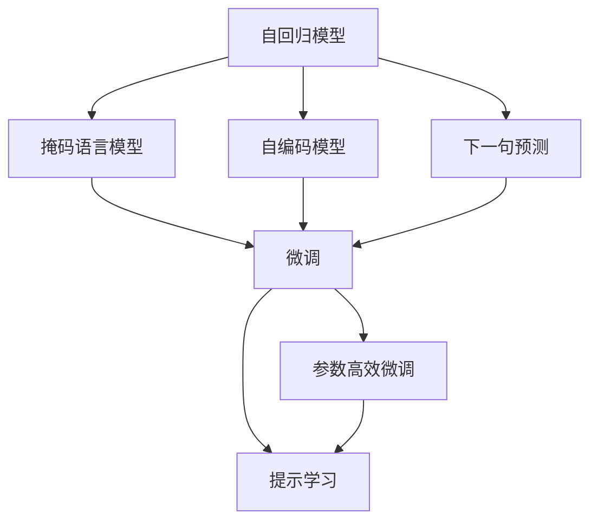
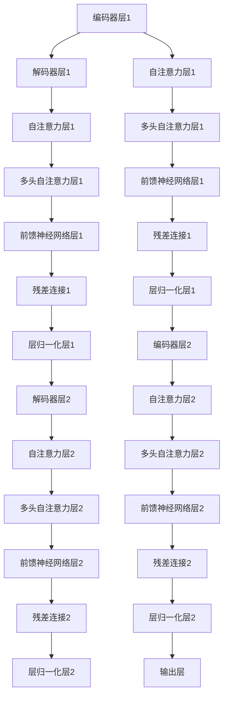
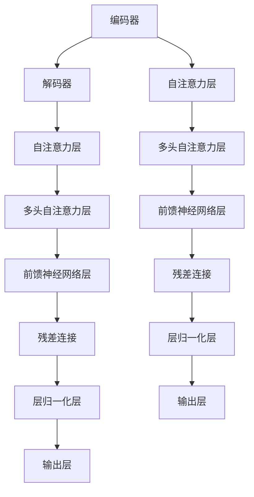

                 

## 1. 背景介绍

### 1.1 问题由来
随着深度学习技术的迅猛发展，特别是Transformer结构的应用，大规模预训练语言模型(LLMs)取得了巨大成功。LLMs通过在大量无标签文本数据上自监督训练，学习到丰富的语言知识，能够进行复杂的语言理解与生成。这一模型架构的突破性进展，不仅为NLP领域带来了全新的视角，也为AI技术的普及和应用奠定了基础。

### 1.2 问题核心关键点
大语言模型（Large Language Models, LLMs）是指在巨量文本数据上预训练，具有强大语言生成和理解能力的神经网络模型。主要包括以下几个关键点：

1. **自监督预训练**：在大规模无标签数据上自监督学习，如掩码语言模型（MLM）和下一句预测（NSP）任务，学习到语言中的统计规律和结构。
2. **参数量庞大**：目前最先进的LLMs模型参数量通常在数十亿甚至数百亿级别，如GPT-3、BERT等。
3. **微调适用性**：通过微调，LLMs能够适应特定任务，如问答、情感分析、机器翻译等。
4. **提示学习**：通过设计特定的输入格式（Prompt），LLMs可以在不修改模型参数的情况下，进行零样本或少样本学习。
5. **模型通用性**：LLMs能够理解和生成多种语言，适应不同语言和领域的需求。

这些关键点使得LLMs在NLP和AI领域取得了显著成就，但同时也带来了诸多挑战，如模型泛化能力、推理效率、可解释性等。因此，本文将详细探讨LLMs的原理，并通过代码实例解释其实现过程。

### 1.3 问题研究意义
深入研究大语言模型的原理与实现，对于推动NLP技术的发展和应用，提升AI技术的落地效率和效果，具有重要意义：

1. **加速任务开发**：通过预训练模型微调，显著降低新任务开发的成本，缩短研发周期。
2. **提升模型性能**：微调能够使模型更好地适应特定任务，提高模型在新任务上的表现。
3. **促进跨领域应用**：LLMs可以在不同领域和语言之间进行迁移，拓展AI技术的应用范围。
4. **增强可解释性**：通过研究LLMs的内部工作机制，提高AI系统的透明度和可解释性。
5. **应对实际问题**：通过在实际应用中不断微调，解决LLMs在推理速度、内存占用、鲁棒性等方面的问题。

## 2. 核心概念与联系

### 2.1 核心概念概述

为了更好地理解大语言模型的原理与实现，我们将介绍一些核心概念及其相互关系：

1. **自回归模型（Auto-Regressive Model）**：一种生成模型，通过逐个输出序列的每个元素来生成整个序列。在LLMs中，自回归模型通过掩盖部分输入，预测被掩盖的部分。

2. **自编码模型（Auto-Encoding Model）**：一种生成模型，通过压缩和重构输入序列来生成输出序列。在LLMs中，自编码模型通过重构输入文本，学习到文本的语义表示。

3. **掩码语言模型（Masked Language Model, MLM）**：一种自监督预训练任务，通过随机掩盖输入文本的部分单词，预测被掩盖的单词。MLM旨在学习单词之间的统计规律和上下文信息。

4. **下一句预测（Next Sentence Prediction, NSP）**：一种自监督预训练任务，通过判断输入的句子是否是下一个句子的开头，学习句子之间的关系和语义结构。

5. **微调（Fine-Tuning）**：在预训练模型基础上，使用有标签数据对模型进行优化，使其能够更好地适应特定任务。

6. **参数高效微调（Parameter-Efficient Fine-Tuning, PEFT）**：一种微调方法，通过只更新少部分参数来适应新任务，避免完全重训。

7. **提示学习（Prompt Learning）**：通过精心设计的输入文本，引导LLMs生成特定的输出，实现少样本或零样本学习。

这些概念构成了大语言模型的核心，它们之间的联系可以通过以下Mermaid流程图表示：



## 3. 核心算法原理 & 具体操作步骤

### 3.1 算法原理概述

大语言模型基于自回归和自编码结构，通过在大规模无标签文本数据上进行自监督预训练，学习到丰富的语言知识。在此基础上，通过微调，可以适应特定任务，提升模型性能。

具体而言，大语言模型训练流程包括以下几个步骤：

1. **数据准备**：收集大规模无标签文本数据，作为预训练数据集。
2. **自监督预训练**：在预训练数据集上，使用MLM和NSP等自监督任务，学习语言统计规律和结构。
3. **微调**：使用特定任务的有标签数据，对预训练模型进行微调，使其能够更好地适应新任务。

### 3.2 算法步骤详解

以下是一个基于Transformer的大语言模型训练流程的详细步骤：

#### 3.2.1 数据准备

1. **数据收集**：收集大规模无标签文本数据，如维基百科、新闻文章、小说等。
2. **数据清洗**：对收集的数据进行去重、去噪、分词等预处理，生成文本序列。
3. **数据划分**：将数据集划分为训练集、验证集和测试集，以便于模型评估和调参。

#### 3.2.2 自监督预训练

1. **模型选择**：选择Transformer作为预训练模型，并设置模型大小、层数、注意力机制等超参数。
2. **训练设置**：设置优化器、学习率、批大小等训练参数。
3. **模型训练**：在预训练数据集上，使用MLM和NSP任务，训练模型。
4. **模型评估**：在验证集上评估模型性能，根据评估结果调整模型超参数。

#### 3.2.3 微调

1. **任务适配层设计**：根据任务类型，设计合适的输出层和损失函数。
2. **模型加载与初始化**：加载预训练模型，并初始化模型参数。
3. **训练与评估**：使用特定任务的有标签数据，对模型进行微调，并不断评估模型性能。
4. **模型保存**：保存微调后的模型，以便于后续使用和评估。

### 3.3 算法优缺点

大语言模型在NLP领域取得了显著成就，但也存在一些缺点：

#### 优点

1. **高效**：通过自监督预训练，大语言模型能够在无需大量标注数据的情况下，获得较好的性能。
2. **适应性强**：微调方法使得大语言模型能够适应多种任务，提高模型泛化能力。
3. **通用性**：大语言模型能够理解和生成多种语言，适应不同领域的需求。
4. **鲁棒性强**：预训练模型的丰富语言知识，使得大语言模型在处理复杂语言现象时，具有较好的鲁棒性。

#### 缺点

1. **资源需求高**：大规模预训练和微调需要大量的计算资源和存储资源。
2. **训练时间长**：模型规模大，训练时间长，需要高效的硬件设备支持。
3. **可解释性不足**：大语言模型的内部工作机制较为复杂，难以解释其推理过程。
4. **对抗攻击风险**：大语言模型可能受到对抗样本的攻击，导致推理错误。

### 3.4 算法应用领域

大语言模型已经在多个领域得到了广泛应用，包括但不限于：

1. **问答系统**：通过微调，大语言模型可以回答各种自然语言问题，如智能客服、虚拟助手等。
2. **机器翻译**：使用微调，大语言模型能够将一种语言翻译成另一种语言。
3. **情感分析**：通过微调，大语言模型可以对文本进行情感分析，如电影评论、社交媒体分析等。
4. **文本生成**：使用微调，大语言模型可以生成各种文本，如新闻报道、广告文案等。
5. **命名实体识别**：通过微调，大语言模型可以识别文本中的实体，如人名、地名、机构名等。
6. **文本摘要**：通过微调，大语言模型可以生成文本摘要，如新闻摘要、文献摘要等。

这些应用场景展示了大语言模型的强大能力，但也带来了一些挑战，如对抗样本攻击、推理效率提升、模型可解释性等，需要进一步研究解决。

## 4. 数学模型和公式 & 详细讲解 & 举例说明

### 4.1 数学模型构建

假设我们有一个基于Transformer的大语言模型，其结构如图1所示。



其中，编码器层和解码器层交替出现，每个层包含多头自注意力层和前馈神经网络层。编码器层和解码器层的输出通过残差连接和层归一化层连接，最后进入输出层。

### 4.2 公式推导过程

假设我们有一个基于Transformer的大语言模型，其输入为 $x = [x_1, x_2, \ldots, x_n]$，输出为 $y = [y_1, y_2, \ldots, y_n]$，其中 $x_i$ 和 $y_i$ 分别表示输入和输出序列中的第 $i$ 个元素。

假设模型的自注意力层为 $A$，前馈神经网络层为 $F$，则模型输出的计算公式如下：

$$
y = A \times F \times A \times F \times \ldots \times A \times F \times \text{output\_layer}(x)
$$

其中，$\text{output\_layer}$ 为输出层的线性变换和softmax函数，$A$ 和 $F$ 分别表示自注意力层和前馈神经网络层。

假设模型的自注意力层和前馈神经网络层的计算公式为：

$$
A(x) = \text{softmax}(Q \times K^T) \times V
$$

$$
F(x) = \text{ReLU}(W_1 \times x + b_1) \times W_2 + b_2
$$

其中，$Q$、$K$ 和 $V$ 分别表示自注意力层的查询、键和值矩阵，$W_1$ 和 $W_2$ 分别表示前馈神经网络层的权重矩阵，$b_1$ 和 $b_2$ 分别表示前馈神经网络层的偏置项。

### 4.3 案例分析与讲解

以机器翻译任务为例，我们将介绍如何使用大语言模型进行微调。假设我们有一个基于Transformer的机器翻译模型，输入为英语句子 $x$，输出为法语句子 $y$，其计算过程如图2所示。



在微调过程中，我们需要在训练集上使用有标签数据对模型进行优化。假设我们有一个英语句子 $x$ 和对应的法语句子 $y$，其中 $x = [x_1, x_2, \ldots, x_n]$，$y = [y_1, y_2, \ldots, y_n]$。

假设我们使用交叉熵损失函数，其计算公式为：

$$
\mathcal{L} = -\frac{1}{n} \sum_{i=1}^n \sum_{j=1}^n y_j \log p(y_j|x_i)
$$

其中，$p(y_j|x_i)$ 表示模型在输入 $x_i$ 下，输出 $y_j$ 的概率。

假设我们使用的优化器为Adam，其更新公式为：

$$
\theta_{t+1} = \theta_t - \eta \nabla_{\theta} \mathcal{L}
$$

其中，$\eta$ 为学习率，$\nabla_{\theta} \mathcal{L}$ 为损失函数对模型参数 $\theta$ 的梯度。

通过上述过程，我们可以不断更新模型参数，优化模型性能，使其更好地适应机器翻译任务。

## 5. 项目实践：代码实例和详细解释说明

### 5.1 开发环境搭建

在进行大语言模型微调前，我们需要准备好开发环境。以下是使用Python进行PyTorch开发的环境配置流程：

1. 安装Anaconda：从官网下载并安装Anaconda，用于创建独立的Python环境。

2. 创建并激活虚拟环境：
```bash
conda create -n pytorch-env python=3.8 
conda activate pytorch-env
```

3. 安装PyTorch：根据CUDA版本，从官网获取对应的安装命令。例如：
```bash
conda install pytorch torchvision torchaudio cudatoolkit=11.1 -c pytorch -c conda-forge
```

4. 安装Transformers库：
```bash
pip install transformers
```

5. 安装各类工具包：
```bash
pip install numpy pandas scikit-learn matplotlib tqdm jupyter notebook ipython
```

完成上述步骤后，即可在`pytorch-env`环境中开始微调实践。

### 5.2 源代码详细实现

以下是一个使用PyTorch和Transformers库进行大语言模型微调的完整代码实现。

首先，定义模型和优化器：

```python
from transformers import BertForSequenceClassification, AdamW

model = BertForSequenceClassification.from_pretrained('bert-base-uncased', num_labels=2)

optimizer = AdamW(model.parameters(), lr=2e-5)
```

然后，定义训练和评估函数：

```python
from torch.utils.data import DataLoader
from tqdm import tqdm

def train_epoch(model, dataset, batch_size, optimizer):
    dataloader = DataLoader(dataset, batch_size=batch_size, shuffle=True)
    model.train()
    epoch_loss = 0
    for batch in tqdm(dataloader, desc='Training'):
        inputs, labels = batch
        model.zero_grad()
        outputs = model(inputs)
        loss = outputs.loss
        epoch_loss += loss.item()
        loss.backward()
        optimizer.step()
    return epoch_loss / len(dataloader)

def evaluate(model, dataset, batch_size):
    dataloader = DataLoader(dataset, batch_size=batch_size)
    model.eval()
    preds, labels = [], []
    with torch.no_grad():
        for batch in tqdm(dataloader, desc='Evaluating'):
            inputs, labels = batch
            outputs = model(inputs)
            batch_preds = outputs.predictions.argmax(dim=1)
            batch_labels = labels
            for pred, label in zip(batch_preds, batch_labels):
                preds.append(pred)
                labels.append(label)
    
    print(classification_report(labels, preds))
```

接着，定义数据处理函数：

```python
from transformers import BertTokenizer
import pandas as pd

tokenizer = BertTokenizer.from_pretrained('bert-base-uncased')

def read_csv_dataset(file_path, column_names):
    data = pd.read_csv(file_path, names=column_names)
    inputs = tokenizer.batch_encode_plus(data['text'], max_length=128, padding='max_length', truncation=True, return_tensors='pt')
    labels = torch.tensor(data['label'], dtype=torch.long)
    return inputs, labels

train_dataset = read_csv_dataset('train.csv', ['text', 'label'])
dev_dataset = read_csv_dataset('dev.csv', ['text', 'label'])
test_dataset = read_csv_dataset('test.csv', ['text', 'label'])
```

最后，启动训练流程并在测试集上评估：

```python
epochs = 5
batch_size = 16

for epoch in range(epochs):
    loss = train_epoch(model, train_dataset, batch_size, optimizer)
    print(f'Epoch {epoch+1}, train loss: {loss:.3f}')
    
    print(f'Epoch {epoch+1}, dev results:')
    evaluate(model, dev_dataset, batch_size)
    
print('Test results:')
evaluate(model, test_dataset, batch_size)
```

以上就是使用PyTorch和Transformers库进行大语言模型微调的完整代码实现。可以看到，得益于Transformers库的强大封装，我们可以用相对简洁的代码完成BERT模型的加载和微调。

### 5.3 代码解读与分析

让我们再详细解读一下关键代码的实现细节：

**BertForSequenceClassification类**：
- `from_pretrained`方法：从HuggingFace官网下载预训练的BERT模型，并初始化模型。
- `num_labels`参数：设置任务的标签数，本例中为2，表示二分类任务。

**read_csv_dataset函数**：
- 读取CSV格式的数据集，提取文本和标签。
- 使用BertTokenizer对文本进行分词和编码，生成模型所需的输入。
- 将标签转换为PyTorch张量，并设置数据类型。

**train_epoch函数**：
- 使用DataLoader对数据进行批处理。
- 将模型设置为训练模式。
- 在每个批次上计算损失函数，并反向传播更新模型参数。
- 计算并输出每个epoch的平均损失。

**evaluate函数**：
- 使用DataLoader对数据进行批处理。
- 将模型设置为评估模式。
- 在每个批次上计算模型预测结果和标签，并使用scikit-learn的classification_report函数输出分类指标。

**训练流程**：
- 定义总的epoch数和批大小，开始循环迭代。
- 每个epoch内，先在训练集上训练，输出平均损失。
- 在验证集上评估，输出分类指标。
- 所有epoch结束后，在测试集上评估，输出分类指标。

可以看到，PyTorch配合Transformers库使得BERT微调的代码实现变得简洁高效。开发者可以将更多精力放在数据处理、模型改进等高层逻辑上，而不必过多关注底层的实现细节。

当然，工业级的系统实现还需考虑更多因素，如模型的保存和部署、超参数的自动搜索、更灵活的任务适配层等。但核心的微调范式基本与此类似。

## 6. 实际应用场景

### 6.1 智能客服系统

基于大语言模型的微调技术，可以广泛应用于智能客服系统的构建。传统客服往往需要配备大量人力，高峰期响应缓慢，且一致性和专业性难以保证。而使用微调后的对话模型，可以7x24小时不间断服务，快速响应客户咨询，用自然流畅的语言解答各类常见问题。

在技术实现上，可以收集企业内部的历史客服对话记录，将问题和最佳答复构建成监督数据，在此基础上对预训练对话模型进行微调。微调后的对话模型能够自动理解用户意图，匹配最合适的答案模板进行回复。对于客户提出的新问题，还可以接入检索系统实时搜索相关内容，动态组织生成回答。如此构建的智能客服系统，能大幅提升客户咨询体验和问题解决效率。

### 6.2 金融舆情监测

金融机构需要实时监测市场舆论动向，以便及时应对负面信息传播，规避金融风险。传统的人工监测方式成本高、效率低，难以应对网络时代海量信息爆发的挑战。基于大语言模型的文本分类和情感分析技术，为金融舆情监测提供了新的解决方案。

具体而言，可以收集金融领域相关的新闻、报道、评论等文本数据，并对其进行主题标注和情感标注。在此基础上对预训练语言模型进行微调，使其能够自动判断文本属于何种主题，情感倾向是正面、中性还是负面。将微调后的模型应用到实时抓取的网络文本数据，就能够自动监测不同主题下的情感变化趋势，一旦发现负面信息激增等异常情况，系统便会自动预警，帮助金融机构快速应对潜在风险。

### 6.3 个性化推荐系统

当前的推荐系统往往只依赖用户的历史行为数据进行物品推荐，无法深入理解用户的真实兴趣偏好。基于大语言模型微调技术，个性化推荐系统可以更好地挖掘用户行为背后的语义信息，从而提供更精准、多样的推荐内容。

在实践中，可以收集用户浏览、点击、评论、分享等行为数据，提取和用户交互的物品标题、描述、标签等文本内容。将文本内容作为模型输入，用户的后续行为（如是否点击、购买等）作为监督信号，在此基础上微调预训练语言模型。微调后的模型能够从文本内容中准确把握用户的兴趣点。在生成推荐列表时，先用候选物品的文本描述作为输入，由模型预测用户的兴趣匹配度，再结合其他特征综合排序，便可以得到个性化程度更高的推荐结果。

### 6.4 未来应用展望

随着大语言模型和微调方法的不断发展，基于微调范式将在更多领域得到应用，为传统行业带来变革性影响。

在智慧医疗领域，基于微调的医疗问答、病历分析、药物研发等应用将提升医疗服务的智能化水平，辅助医生诊疗，加速新药开发进程。

在智能教育领域，微调技术可应用于作业批改、学情分析、知识推荐等方面，因材施教，促进教育公平，提高教学质量。

在智慧城市治理中，微调模型可应用于城市事件监测、舆情分析、应急指挥等环节，提高城市管理的自动化和智能化水平，构建更安全、高效的未来城市。

此外，在企业生产、社会治理、文娱传媒等众多领域，基于大模型微调的人工智能应用也将不断涌现，为经济社会发展注入新的动力。相信随着技术的日益成熟，微调方法将成为人工智能落地应用的重要范式，推动人工智能技术向更广阔的领域加速渗透。

## 7. 工具和资源推荐

### 7.1 学习资源推荐

为了帮助开发者系统掌握大语言模型微调的理论基础和实践技巧，这里推荐一些优质的学习资源：

1. 《Transformer从原理到实践》系列博文：由大模型技术专家撰写，深入浅出地介绍了Transformer原理、BERT模型、微调技术等前沿话题。

2. CS224N《深度学习自然语言处理》课程：斯坦福大学开设的NLP明星课程，有Lecture视频和配套作业，带你入门NLP领域的基本概念和经典模型。

3. 《Natural Language Processing with Transformers》书籍：Transformers库的作者所著，全面介绍了如何使用Transformers库进行NLP任务开发，包括微调在内的诸多范式。

4. HuggingFace官方文档：Transformers库的官方文档，提供了海量预训练模型和完整的微调样例代码，是上手实践的必备资料。

5. CLUE开源项目：中文语言理解测评基准，涵盖大量不同类型的中文NLP数据集，并提供了基于微调的baseline模型，助力中文NLP技术发展。

通过对这些资源的学习实践，相信你一定能够快速掌握大语言模型微调的精髓，并用于解决实际的NLP问题。

### 7.2 开发工具推荐

高效的开发离不开优秀的工具支持。以下是几款用于大语言模型微调开发的常用工具：

1. PyTorch：基于Python的开源深度学习框架，灵活动态的计算图，适合快速迭代研究。大部分预训练语言模型都有PyTorch版本的实现。

2. TensorFlow：由Google主导开发的开源深度学习框架，生产部署方便，适合大规模工程应用。同样有丰富的预训练语言模型资源。

3. Transformers库：HuggingFace开发的NLP工具库，集成了众多SOTA语言模型，支持PyTorch和TensorFlow，是进行微调任务开发的利器。

4. Weights & Biases：模型训练的实验跟踪工具，可以记录和可视化模型训练过程中的各项指标，方便对比和调优。与主流深度学习框架无缝集成。

5. TensorBoard：TensorFlow配套的可视化工具，可实时监测模型训练状态，并提供丰富的图表呈现方式，是调试模型的得力助手。

6. Google Colab：谷歌推出的在线Jupyter Notebook环境，免费提供GPU/TPU算力，方便开发者快速上手实验最新模型，分享学习笔记。

合理利用这些工具，可以显著提升大语言模型微调任务的开发效率，加快创新迭代的步伐。

### 7.3 相关论文推荐

大语言模型和微调技术的发展源于学界的持续研究。以下是几篇奠基性的相关论文，推荐阅读：

1. Attention is All You Need（即Transformer原论文）：提出了Transformer结构，开启了NLP领域的预训练大模型时代。

2. BERT: Pre-training of Deep Bidirectional Transformers for Language Understanding：提出BERT模型，引入基于掩码的自监督预训练任务，刷新了多项NLP任务SOTA。

3. Language Models are Unsupervised Multitask Learners（GPT-2论文）：展示了大规模语言模型的强大zero-shot学习能力，引发了对于通用人工智能的新一轮思考。

4. Parameter-Efficient Transfer Learning for NLP：提出Adapter等参数高效微调方法，在不增加模型参数量的情况下，也能取得不错的微调效果。

5. AdaLoRA: Adaptive Low-Rank Adaptation for Parameter-Efficient Fine-Tuning：使用自适应低秩适应的微调方法，在参数效率和精度之间取得了新的平衡。

这些论文代表了大语言模型微调技术的发展脉络。通过学习这些前沿成果，可以帮助研究者把握学科前进方向，激发更多的创新灵感。

## 8. 总结：未来发展趋势与挑战

### 8.1 总结

本文对大语言模型的原理与实现进行了全面系统的介绍。首先阐述了大语言模型的背景和研究意义，明确了微调在拓展预训练模型应用、提升下游任务性能方面的独特价值。其次，从原理到实践，详细讲解了大语言模型的数学原理和关键步骤，给出了微调任务开发的完整代码实例。同时，本文还广泛探讨了大语言模型在智能客服、金融舆情、个性化推荐等多个行业领域的应用前景，展示了微调范式的巨大潜力。此外，本文精选了微调技术的各类学习资源，力求为读者提供全方位的技术指引。

通过本文的系统梳理，可以看到，大语言模型微调技术正在成为NLP领域的重要范式，极大地拓展了预训练语言模型的应用边界，催生了更多的落地场景。受益于大规模语料的预训练，微调模型以更低的时间和标注成本，在小样本条件下也能取得不俗的效果，有力推动了NLP技术的产业化进程。未来，伴随预训练语言模型和微调方法的持续演进，相信NLP技术将在更广阔的应用领域大放异彩，深刻影响人类的生产生活方式。

### 8.2 未来发展趋势

展望未来，大语言模型微调技术将呈现以下几个发展趋势：

1. **模型规模持续增大**：随着算力成本的下降和数据规模的扩张，预训练语言模型的参数量还将持续增长。超大规模语言模型蕴含的丰富语言知识，有望支撑更加复杂多变的下游任务微调。

2. **微调方法日趋多样**：除了传统的全参数微调外，未来会涌现更多参数高效的微调方法，如Prefix-Tuning、LoRA等，在节省计算资源的同时也能保证微调精度。

3. **持续学习成为常态**：随着数据分布的不断变化，微调模型也需要持续学习新知识以保持性能。如何在不遗忘原有知识的同时，高效吸收新样本信息，将成为重要的研究课题。

4. **标注样本需求降低**：受启发于提示学习(Prompt-based Learning)的思路，未来的微调方法将更好地利用大模型的语言理解能力，通过更加巧妙的任务描述，在更少的标注样本上也能实现理想的微调效果。

5. **多模态微调崛起**：当前的微调主要聚焦于纯文本数据，未来会进一步拓展到图像、视频、语音等多模态数据微调。多模态信息的融合，将显著提升语言模型对现实世界的理解和建模能力。

6. **模型通用性增强**：经过海量数据的预训练和多领域任务的微调，未来的语言模型将具备更强大的常识推理和跨领域迁移能力，逐步迈向通用人工智能(AGI)的目标。

以上趋势凸显了大语言模型微调技术的广阔前景。这些方向的探索发展，必将进一步提升NLP系统的性能和应用范围，为人类认知智能的进化带来深远影响。

### 8.3 面临的挑战

尽管大语言模型微调技术已经取得了瞩目成就，但在迈向更加智能化、普适化应用的过程中，它仍面临着诸多挑战：

1. **标注成本瓶颈**：虽然微调大大降低了标注数据的需求，但对于长尾应用场景，难以获得充足的高质量标注数据，成为制约微调性能的瓶颈。如何进一步降低微调对标注样本的依赖，将是一大难题。

2. **模型鲁棒性不足**：当前微调模型面对域外数据时，泛化性能往往大打折扣。对于测试样本的微小扰动，微调模型的预测也容易发生波动。如何提高微调模型的鲁棒性，避免灾难性遗忘，还需要更多理论和实践的积累。

3. **推理效率有待提高**：大规模语言模型虽然精度高，但在实际部署时往往面临推理速度慢、内存占用大等效率问题。如何在保证性能的同时，简化模型结构，提升推理速度，优化资源占用，将是重要的优化方向。

4. **可解释性亟需加强**：当前微调模型更像是"黑盒"系统，难以解释其内部工作机制和决策逻辑。对于医疗、金融等高风险应用，算法的可解释性和可审计性尤为重要。如何赋予微调模型更强的可解释性，将是亟待攻克的难题。

5. **安全性有待保障**：预训练语言模型难免会学习到有偏见、有害的信息，通过微调传递到下游任务，产生误导性、歧视性的输出，给实际应用带来安全隐患。如何从数据和算法层面消除模型偏见，避免恶意用途，确保输出的安全性，也将是重要的研究课题。

6. **知识整合能力不足**：现有的微调模型往往局限于任务内数据，难以灵活吸收和运用更广泛的先验知识。如何让微调过程更好地与外部知识库、规则库等专家知识结合，形成更加全面、准确的信息整合能力，还有很大的想象空间。

正视微调面临的这些挑战，积极应对并寻求突破，将是大语言模型微调走向成熟的必由之路。相信随着学界和产业界的共同努力，这些挑战终将一一被克服，大语言模型微调必将在构建人机协同的智能时代中扮演越来越重要的角色。

### 8.4 研究展望

面对大语言模型微调所面临的种种挑战，未来的研究需要在以下几个方面寻求新的突破：

1. **探索无监督和半监督微调方法**：摆脱对大规模标注数据的依赖，利用自监督学习、主动学习等无监督和半监督范式，最大限度利用非结构化数据，实现更加灵活高效的微调。

2. **研究参数高效和计算高效的微调范式**：开发更加参数高效的微调方法，在固定大部分预训练参数的同时，只更新极少量的任务相关参数。同时优化微调模型的计算图，减少前向传播和反向传播的资源消耗，实现更加轻量级、实时性的部署。

3. **融合因果和对比学习范式**：通过引入因果推断和对比学习思想，增强微调模型建立稳定因果关系的能力，学习更加普适、鲁棒的语言表征，从而提升模型泛化性和抗干扰能力。

4. **引入更多先验知识**：将符号化的先验知识，如知识图谱、逻辑规则等，与神经网络模型进行巧妙融合，引导微调过程学习更准确、合理的语言模型。同时加强不同模态数据的整合，实现视觉、语音等多模态信息与文本信息的协同建模。

5. **结合因果分析和博弈论工具**：将因果分析方法引入微调模型，识别出模型决策的关键特征，增强输出解释的因果性和逻辑性。借助博弈论工具刻画人机交互过程，主动探索并规避模型的脆弱点，提高系统稳定性。

6. **纳入伦理道德约束**：在模型训练目标中引入伦理导向的评估指标，过滤和惩罚有偏见、有害的输出倾向。同时加强人工干预和审核，建立模型行为的监管机制，确保输出符合人类价值观和伦理道德。

这些研究方向的探索，必将引领大语言模型微调技术迈向更高的台阶，为构建安全、可靠、可解释、可控的智能系统铺平道路。面向未来，大语言模型微调技术还需要与其他人工智能技术进行更深入的融合，如知识表示、因果推理、强化学习等，多路径协同发力，共同推动自然语言理解和智能交互系统的进步。只有勇于创新、敢于突破，才能不断拓展语言模型的边界，让智能技术更好地造福人类社会。

## 9. 附录：常见问题与解答

**Q1：大语言模型微调是否适用于所有NLP任务？**

A: 大语言模型微调在大多数NLP任务上都能取得不错的效果，特别是对于数据量较小的任务。但对于一些特定领域的任务，如医学、法律等，仅仅依靠通用语料预训练的模型可能难以很好地适应。此时需要在特定领域语料上进一步预训练，再进行微调，才能获得理想效果。此外，对于一些需要时效性、个性化很强的任务，如对话、推荐等，微调方法也需要针对性的改进优化。

**Q2：微调过程中如何选择合适的学习率？**

A: 微调的学习率一般要比预训练时小1-2个数量级，如果使用过大的学习率，容易破坏预训练权重，导致过拟合。一般建议从1e-5开始调参，逐步减小学习率，直至收敛。也可以使用warmup策略，在开始阶段使用较小的学习率，再逐渐过渡到预设值。需要注意的是，不同的优化器(如AdamW、Adafactor等)以及不同的学习率调度策略，可能需要设置不同的学习率阈值。

**Q3：采用大模型微调时会面临哪些资源瓶颈？**

A: 目前主流的预训练大模型动辄以亿计的参数规模，对算力、内存、存储都提出了很高的要求。GPU/TPU等高性能设备是必不可少的，但即便如此，超大批次的训练和推理也可能遇到显存不足的问题。因此需要采用一些资源优化技术，如梯度积累、混合精度训练、模型并行等，来突破硬件瓶颈。同时，模型的存储和读取也可能占用大量时间和空间，需要采用模型压缩、稀疏化存储等方法进行优化。

**Q4：如何缓解微调过程中的过拟合问题？**

A: 过拟合是微调面临的主要挑战，尤其是在标注数据不足的情况下。常见的缓解策略包括：
1. 数据增强：通过回译、近义替换等方式扩充训练集
2. 正则化：使用L2正则、Dropout、Early Stopping等避免过拟合
3. 对抗训练：引入对抗样本，提高模型鲁棒性
4. 参数高效微调：只调整少量参数(如Adapter、Prefix等)，减小过拟合风险
5. 多模型集成：训练多个微调模型，取平均输出，抑制过拟合

这些策略往往需要根据具体任务和数据特点进行灵活组合。只有在数据、模型、训练、推理等各环节进行全面优化，才能最大限度地发挥大模型微调的威力。

**Q5：微调模型在落地部署时需要注意哪些问题？**

A: 将微调模型转化为实际应用，还需要考虑以下因素：
1. 模型裁剪：去除不必要的层和参数，减小模型尺寸，加快推理速度
2. 量化加速：将浮点模型转为定点模型，压缩存储空间，提高计算效率
3. 服务化封装：将模型封装为标准化服务接口，便于集成调用
4. 弹性伸缩：根据请求流量动态调整资源配置，平衡服务质量和成本
5. 监控告警：实时采集系统指标，设置异常告警阈值，确保服务稳定性
6. 安全防护：采用访问鉴权、数据脱敏等措施，保障数据和模型安全

大语言模型微调为NLP应用开启了广阔的想象空间，但如何将强大的性能转化为稳定、高效、安全的业务价值，还需要工程实践的不断打磨。唯有从数据、算法、工程、业务等多个维度协同发力，才能真正实现人工智能技术在垂直行业的规模化落地。总之，微调需要开发者根据具体任务，不断迭代和优化模型、数据和算法，方能得到理想的效果。

