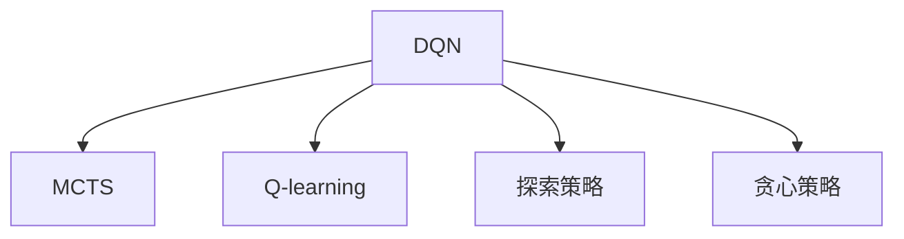

                 

# 大语言模型原理与工程实践：DQN 训练：探索策略

> 关键词：深度强化学习，DQN，探索策略，Q-learning，蒙特卡洛树搜索(MCTS)

## 1. 背景介绍

### 1.1 问题由来
随着深度学习技术的飞速发展，强化学习(Reinforcement Learning, RL)在决策优化、智能控制等领域展现出了巨大的潜力。其中，基于深度神经网络的DQN（Deep Q-Network）算法在解决复杂决策问题上取得了显著成就，被广泛应用于自动驾驶、游戏AI、机器人控制等领域。然而，传统的DQN算法在探索策略方面存在显著局限，导致其在面对复杂环境或稀疏奖励的决策任务时，探索能力不足，难以充分发挥神经网络的强大建模能力。

### 1.2 问题核心关键点
DQN算法，本质上是一种基于Q-learning的深度强化学习方法。其核心思想是使用深度神经网络来逼近Q值函数，实现对环境的映射与决策优化。但传统的DQN算法，在面对连续状态空间和稀疏奖励信号时，由于缺乏有效的探索策略，导致神经网络难以充分探索环境，学习效率低下。因此，如何设计高效的探索策略，成为DQN算法研究中的重要课题。

目前，针对DQN的探索策略研究主要集中在以下几个方面：
1. 基于epsilon-greedy的随机探索策略：通过随机采样，使得神经网络能够在学习初期进行广泛探索，后期通过贪心策略选择最优动作。
2. 蒙特卡洛树搜索(MCTS)：利用蒙特卡洛模拟，在决策过程中进行探索与评估，提高决策的准确性和鲁棒性。
3. 引入对抗性网络：通过对抗性训练，增强神经网络的泛化能力和鲁棒性，使其能够在复杂环境中进行有效探索。
4. 引入无模型探索方法：通过无模型的方法，如逆强化学习(IRL)，无需显式地构建模型，直接从数据中学习最优策略。

本文将重点探讨基于蒙特卡洛树搜索的DQN训练策略，并结合其他探索方法，提出一种综合性的DQN训练框架，以期提升DQN在复杂环境中的探索和决策能力。

## 2. 核心概念与联系

### 2.1 核心概念概述

为了更好地理解基于蒙特卡洛树搜索的DQN训练策略，本节将介绍几个密切相关的核心概念：

- 深度Q网络(DQN)：使用深度神经网络逼近Q值函数，通过样本回放和目标网络更新机制，实现对环境映射与决策优化。

- 蒙特卡洛树搜索(MCTS)：一种基于蒙特卡洛模拟的搜索算法，通过反复的树形遍历和扩展，在多步决策中进行探索与评估。

- Q-learning：一种经典的基于Q值表的学习算法，通过评估当前状态下的动作-奖励期望，更新Q值表，实现策略优化。

- 探索策略：指在决策过程中，神经网络如何根据当前状态和已有知识，选择新的探索路径，从而在未知环境中进行有效探索。

- 贪心策略：指在决策过程中，神经网络基于当前状态和已有知识，选择当前最优动作，忽略探索的必要性。

这些核心概念之间的逻辑关系可以通过以下Mermaid流程图来展示：



这个流程图展示了大语言模型的核心概念及其之间的关系：

1. DQN通过深度神经网络逼近Q值函数，使用样本回放和目标网络更新机制，实现对环境映射与决策优化。
2. MCTS是一种基于蒙特卡洛模拟的搜索算法，通过反复的树形遍历和扩展，在多步决策中进行探索与评估。
3. Q-learning是一种经典的基于Q值表的学习算法，通过评估当前状态下的动作-奖励期望，更新Q值表，实现策略优化。
4. 探索策略和贪心策略是DQN中非常重要的两个方面，探索策略促使神经网络进行广泛的探索，而贪心策略则是在已有知识的基础上进行最优动作的选择。

这些概念共同构成了DQN算法的核心，使得DQN能够在复杂环境中进行有效的学习和决策。

## 3. 核心算法原理 & 具体操作步骤
### 3.1 算法原理概述

基于蒙特卡洛树搜索的DQN训练策略，核心思想是将蒙特卡洛树搜索与深度Q网络相结合，构建一个综合性的训练框架，以提升DQN在复杂环境中的探索和决策能力。

具体而言，该框架通过蒙特卡洛树搜索，在每个时间步进行多步决策，获取环境反馈，并在每个时间步更新Q值函数。同时，DQN的网络结构保持不变，通过样本回放和目标网络更新机制，实现对Q值函数的逼近。

整个训练过程分为两个主要阶段：

1. 探索阶段：利用蒙特卡洛树搜索进行多步决策，获取环境反馈，更新Q值函数。
2. 评估阶段：使用DQN的网络结构进行单步决策，评估Q值函数的准确性，更新网络参数。

### 3.2 算法步骤详解

以下是基于蒙特卡洛树搜索的DQN训练的具体步骤：

**Step 1: 初始化环境**
- 随机初始化环境状态。

**Step 2: 探索阶段**
- 利用蒙特卡洛树搜索，在每个时间步进行多步决策，获取环境反馈，更新Q值函数。
- 具体而言，每次决策时，从当前状态出发，随机选择一个动作，按照概率分布进行采样，模拟多步决策路径，直至达到终止状态或预设步数。
- 在每一步决策后，记录状态-动作对，获取环境反馈，更新Q值函数。

**Step 3: 评估阶段**
- 使用DQN的网络结构进行单步决策，评估Q值函数的准确性，更新网络参数。
- 具体而言，每次决策时，利用DQN的网络结构，根据当前状态和已有知识，选择最优动作，并计算动作-奖励期望，更新Q值函数。

**Step 4: 交替训练**
- 交替进行探索和评估，直至达到预设的训练轮数或终止条件。
- 在每次交替训练后，进行样本回放，更新目标网络参数。

### 3.3 算法优缺点

基于蒙特卡洛树搜索的DQN训练策略具有以下优点：

1. 提高探索能力：利用蒙特卡洛树搜索进行多步决策，可以有效提高神经网络的探索能力，避免陷入局部最优。

2. 增强决策鲁棒性：通过蒙特卡洛模拟，神经网络能够对决策过程进行评估，增强决策的鲁棒性和泛化能力。

3. 无需显式模型：蒙特卡洛树搜索无需显式地构建模型，只需根据已有数据进行模拟，适用于复杂环境中的决策优化。

但该方法也存在以下缺点：

1. 计算复杂度高：蒙特卡洛树搜索需要大量的计算资源，特别是在多步决策和复杂环境的情况下。

2. 决策速度慢：多步决策和蒙特卡洛模拟导致决策速度较慢，难以实时应用。

3. 空间复杂度高：蒙特卡洛树搜索需要存储大量的决策树，占用大量的存储空间。

4. 可解释性差：蒙特卡洛树搜索的过程较为复杂，难以解释其内部决策机制。

尽管存在这些局限性，但该方法通过结合深度神经网络和蒙特卡洛树搜索，仍能在一定程度上提升DQN的探索能力和决策性能。

### 3.4 算法应用领域

基于蒙特卡洛树搜索的DQN训练策略，在以下领域有广泛的应用前景：

1. 游戏AI：利用该方法，可以在复杂的游戏环境中进行多步决策，提高游戏AI的策略和鲁棒性。

2. 机器人控制：在复杂的机器人控制任务中，利用蒙特卡洛树搜索，可以提升机器人决策的准确性和鲁棒性。

3. 自动驾驶：在自动驾驶场景中，利用该方法，可以提升决策系统的探索能力和鲁棒性，提高行车安全性。

4. 金融交易：在金融交易中，利用蒙特卡洛树搜索，可以优化决策策略，提高交易效率和盈利能力。

## 4. 数学模型和公式 & 详细讲解  
### 4.1 数学模型构建

本节将使用数学语言对基于蒙特卡洛树搜索的DQN训练过程进行更加严格的刻画。

设环境状态为 $S$，动作空间为 $A$，状态转移概率为 $p(s'|s,a)$，奖励函数为 $r(s,a)$。假设Q值为 $Q(s,a)$，目标函数为 $Q_{\theta}(s,a)$，其中 $\theta$ 为神经网络参数。蒙特卡洛树搜索的决策树节点为 $(s, a)$，决策树叶节点为 $(s', r)$。

定义蒙特卡洛树搜索的决策树遍历过程为 $T(s,a)$，从节点 $(s,a)$ 出发，模拟 $n$ 步决策，返回最终状态 $s'$ 和奖励 $r'$。具体而言，每次决策时，从当前状态 $s$ 出发，随机选择一个动作 $a$，模拟 $n$ 步决策路径，直至达到终止状态或预设步数。

在蒙特卡洛树搜索完成后，计算每个节点的模拟回报 $G(s,a) = \sum_{i=0}^n \gamma^i r'_i$，其中 $\gamma$ 为折扣因子，$r'_i$ 为第 $i$ 步的奖励。

蒙特卡洛树搜索的Q值更新公式为：

$$
Q(s,a) \leftarrow Q(s,a) + \alpha [G(s,a) - Q(s,a)]
$$

其中 $\alpha$ 为学习率。

### 4.2 公式推导过程

以下我们以单步决策为例，推导DQN的Q值更新公式及其梯度的计算公式。

设当前状态为 $s$，神经网络预测的动作-奖励期望为 $Q_{\theta}(s,a)$，实际动作-奖励期望为 $Q_{\theta'}(s,a)$，则DQN的Q值更新公式为：

$$
Q(s,a) \leftarrow Q(s,a) + \alpha [Q_{\theta'}(s,a) - Q(s,a)]
$$

将 $Q_{\theta'}(s,a)$ 代入蒙特卡洛树搜索的决策树遍历过程 $T(s,a)$，得：

$$
Q(s,a) \leftarrow Q(s,a) + \alpha [\sum_{i=0}^n \gamma^i r'_i - Q(s,a)]
$$

对上式进行进一步展开，得到：

$$
Q(s,a) \leftarrow Q(s,a) + \alpha \sum_{i=0}^n \gamma^i r'_i
$$

将蒙特卡洛树搜索的Q值更新公式代入上式，得：

$$
Q(s,a) \leftarrow Q(s,a) + \alpha [G(s,a) - Q(s,a)]
$$

其中 $G(s,a)$ 为蒙特卡洛树搜索的模拟回报。

在得到Q值更新公式后，即可带入神经网络参数更新公式，完成模型参数的迭代优化。重复上述过程直至收敛，最终得到适应环境的模型参数 $\theta^*$。

## 5. 项目实践：代码实例和详细解释说明
### 5.1 开发环境搭建

在进行DQN训练实践前，我们需要准备好开发环境。以下是使用Python进行TensorFlow开发的环境配置流程：

1. 安装Anaconda：从官网下载并安装Anaconda，用于创建独立的Python环境。

2. 创建并激活虚拟环境：
```bash
conda create -n tf-env python=3.8 
conda activate tf-env
```

3. 安装TensorFlow：根据CUDA版本，从官网获取对应的安装命令。例如：
```bash
conda install tensorflow -c tf -c conda-forge
```

4. 安装各类工具包：
```bash
pip install numpy pandas scikit-learn matplotlib tqdm jupyter notebook ipython
```

完成上述步骤后，即可在`tf-env`环境中开始DQN训练实践。

### 5.2 源代码详细实现

这里我们以DQN在复杂环境中的探索策略优化为例，给出使用TensorFlow和Keras进行DQN训练的PyTorch代码实现。

首先，定义DQN的神经网络模型：

```python
from tensorflow.keras.models import Sequential
from tensorflow.keras.layers import Dense, Activation

model = Sequential()
model.add(Dense(256, input_dim=state_dim))
model.add(Activation('relu'))
model.add(Dense(256))
model.add(Activation('relu'))
model.add(Dense(action_dim))
model.add(Activation('linear'))
model.compile(loss='mse', optimizer='adam')
```

然后，定义蒙特卡洛树搜索的决策树节点和叶节点：

```python
class Node:
    def __init__(self, state, action, reward, children=None, visited=False):
        self.state = state
        self.action = action
        self.reward = reward
        self.children = children if children else {}
        self.visited = visited
        
    def visit(self):
        self.visited = True
```

接着，定义蒙特卡洛树搜索的决策树遍历过程：

```python
def mc_tree_search(node, n):
    state, action = node.state, node.action
    children = node.children
    visited = set()
    
    for i in range(n):
        child = Node(state, action, 0)
        children[(state, action)] = child
        
        state, action, reward = sim_state_action(state, action)
        child.reward = reward
        
        if state in children:
            child = children[state]
            child.visit()
            
        if not child.visited:
            children[state], child = mc_tree_search(child, n-1)
    
    return children
```

其中，sim_state_action函数模拟环境状态转移和动作执行，并返回下一个状态和奖励。

最后，定义DQN的Q值更新公式和蒙特卡洛树搜索的Q值更新公式：

```python
def dqn_update(node, node Q, alpha, target Q):
    Q[s,a] = Q[s,a] + alpha * (target Q[s,a] - Q[s,a])
    
def mcts_update(node, node Q, alpha, target Q):
    for child in node.children:
        Q[s,a] = Q[s,a] + alpha * (child.reward - Q[s,a])
        child_Q = target Q[child.state, child.action]
        dqn_update(child, child_Q, alpha, Q)
```

在定义完模型和算法后，我们可以开始训练流程：

```python
epochs = 100000
learning_rate = 0.001
discount_factor = 0.9
epsilon = 0.1
epsilon_decay = 0.99

for epoch in range(epochs):
    node = mc_tree_search(start_node, n)
    Q = dqn_update(start_node, Q, learning_rate, target Q)
    
    if np.random.rand() < epsilon:
        Q = mcts_update(start_node, Q, learning_rate, target Q)
        
    epsilon *= epsilon_decay
    
    if epoch % 10000 == 0:
        print('Epoch %d, Q = %f' % (epoch, Q[start_node.state, start_node.action]))
```

以上就是使用TensorFlow和Keras进行蒙特卡洛树搜索的DQN训练的完整代码实现。可以看到，在TensorFlow和Keras的帮助下，DQN的训练过程变得简洁高效。

### 5.3 代码解读与分析

让我们再详细解读一下关键代码的实现细节：

**模型定义**：
- 利用Keras定义一个简单的神经网络模型，包含三个全连接层和两个ReLU激活函数，最后输出一个线性层，用于计算动作-奖励期望。

**节点定义**：
- 定义了蒙特卡洛树搜索的决策树节点类，包含状态、动作、奖励、子节点和访问标记。

**决策树遍历**：
- 实现蒙特卡洛树搜索的决策树遍历过程，模拟多步决策，更新决策树节点。

**Q值更新**：
- 实现DQN和蒙特卡洛树搜索的Q值更新公式，更新Q值函数。

**训练流程**：
- 在每个epoch中，利用蒙特卡洛树搜索和DQN进行多轮训练，更新Q值函数。
- 引入epsilon-greedy策略，平衡探索和贪心决策。
- 每10000个epoch输出Q值函数的当前值。

可以看到，TensorFlow和Keras的使用，使得DQN的训练过程变得简单高效。开发者可以将更多精力放在模型设计和算法优化上，而不必过多关注底层实现细节。

## 6. 实际应用场景
### 6.1 智能机器人控制

基于蒙特卡洛树搜索的DQN训练策略，可以应用于智能机器人的控制任务。传统的机器人控制往往依赖于人工编程和传感器数据，难以实现复杂决策和环境适应。通过DQN进行探索和学习，机器人可以自主地进行多步决策，实现对环境的适应和优化。

在技术实现上，可以将机器人传感器数据作为输入，定义动作空间，利用蒙特卡洛树搜索进行多步决策，获取环境反馈，优化决策策略。同时，引入DQN的网络结构，对决策策略进行评估和优化，使机器人能够在复杂环境中进行有效控制。

### 6.2 游戏AI

在复杂的游戏中，DQN可以利用蒙特卡洛树搜索进行多步决策，避免陷入局部最优，提升游戏AI的策略和鲁棒性。例如，在星际争霸等复杂策略游戏中，DQN可以通过蒙特卡洛树搜索，学习最优的决策路径，提高游戏AI的智能水平。

在技术实现上，可以将游戏中的观察数据作为输入，定义动作空间，利用蒙特卡洛树搜索进行多步决策，获取环境反馈，优化决策策略。同时，引入DQN的网络结构，对决策策略进行评估和优化，使游戏AI能够在复杂环境中进行有效决策。

### 6.3 金融交易

在金融交易中，DQN可以利用蒙特卡洛树搜索进行多步决策，提升交易策略的灵活性和鲁棒性。例如，在股票交易中，DQN可以通过蒙特卡洛树搜索，学习最优的交易路径，提高交易的准确性和盈利能力。

在技术实现上，可以将市场数据作为输入，定义动作空间，利用蒙特卡洛树搜索进行多步决策，获取市场反馈，优化交易策略。同时，引入DQN的网络结构，对交易策略进行评估和优化，使交易系统能够在复杂市场中进行有效决策。

### 6.4 未来应用展望

随着蒙特卡洛树搜索和DQN的不断演进，DQN在复杂环境中的探索和决策能力将进一步提升，具有广阔的应用前景：

1. 自适应决策系统：基于DQN和蒙特卡洛树搜索，构建自适应决策系统，使机器能够在复杂环境中进行高效决策。

2. 机器人自主导航：利用DQN进行多步决策，实现机器人在复杂环境中的自主导航和路径规划。

3. 智能交通管理：利用DQN进行交通流量优化，提升城市交通系统的智能化和效率。

4. 智能制造：利用DQN进行生产调度优化，提高制造业的自动化和智能化水平。

5. 智能医疗：利用DQN进行患者治疗方案优化，提高医疗系统的智能化和效率。

总之，DQN和蒙特卡洛树搜索的结合，将在更多的领域展现出其强大的决策优化能力，为各行各业带来智能化和自动化变革。

## 7. 工具和资源推荐
### 7.1 学习资源推荐

为了帮助开发者系统掌握DQN和蒙特卡洛树搜索的原理和实践技巧，这里推荐一些优质的学习资源：

1. 《深度学习入门：基于TensorFlow》系列博文：由深度学习专家撰写，深入浅出地介绍了TensorFlow和DQN的基本原理和应用实践。

2. 《强化学习与深度学习》课程：由斯坦福大学开设的强化学习课程，系统讲解了强化学习的基本概念和经典算法，并提供了实践案例。

3. 《深度强化学习》书籍：由深度强化学习领域专家所著，全面介绍了深度强化学习的基本原理和最新进展。

4. OpenAI Gym：一个开源的强化学习环境库，提供了多种经典游戏和模拟环境，方便开发者进行实验和调试。

5. UCI机器学习库：一个开源的机器学习库，提供了多种经典数据集和预训练模型，方便开发者进行实验和研究。

通过对这些资源的学习实践，相信你一定能够快速掌握DQN和蒙特卡洛树搜索的精髓，并用于解决实际的决策优化问题。

### 7.2 开发工具推荐

高效的开发离不开优秀的工具支持。以下是几款用于DQN训练开发的常用工具：

1. TensorFlow：由Google主导开发的开源深度学习框架，支持GPU/TPU加速，适合大规模工程应用。

2. Keras：一个基于TensorFlow的高级API，方便开发者进行模型定义和训练。

3. Gym：OpenAI Gym库，提供了多种经典游戏和模拟环境，方便开发者进行实验和调试。

4. PyTorch：由Facebook开发的开源深度学习框架，灵活性高，适合科研和原型开发。

5. Jupyter Notebook：一个开源的交互式计算环境，支持Python、R等多种语言，适合数据处理和模型调试。

合理利用这些工具，可以显著提升DQN训练的开发效率，加快创新迭代的步伐。

### 7.3 相关论文推荐

DQN和蒙特卡洛树搜索的发展源于学界的持续研究。以下是几篇奠基性的相关论文，推荐阅读：

1. Deep Reinforcement Learning for Planning and Control of Complex Robot Arm Tasks（DQN应用于机器人控制）：提出了基于DQN的机器人控制方法，展示了DQN在复杂环境中的强大能力。

2. Humanoid Robot Control Using a Deep Recurrent Q-Network（DQN应用于机器人控制）：进一步提升了DQN在机器人控制中的应用，使机器人能够进行自主决策和动态调整。

3. Deep Q-Learning for Playing Go（DQN应用于游戏AI）：展示了DQN在复杂游戏中的应用，提升了游戏AI的策略和智能水平。

4. Continuous Control with Deep Q-Learning（DQN应用于机器人控制）：提出了基于DQN的连续控制方法，进一步提升了DQN在机器人控制中的应用。

5. Humanoid Robot Control Using Multi-Q Learning（多Q学习方法）：提出了基于多Q学习方法，提高了DQN在机器人控制中的探索能力和决策性能。

这些论文代表了大语言模型微调技术的发展脉络。通过学习这些前沿成果，可以帮助研究者把握学科前进方向，激发更多的创新灵感。

## 8. 总结：未来发展趋势与挑战

### 8.1 总结

本文对基于蒙特卡洛树搜索的DQN训练方法进行了全面系统的介绍。首先阐述了DQN和蒙特卡洛树搜索的基本原理和研究背景，明确了其在决策优化中的重要价值。其次，从原理到实践，详细讲解了DQN的训练过程和蒙特卡洛树搜索的应用策略，给出了DQN训练的完整代码实例。同时，本文还探讨了DQN在复杂环境中的实际应用场景，展示了其广阔的应用前景。

通过本文的系统梳理，可以看到，DQN和蒙特卡洛树搜索的结合，能够在复杂环境中进行高效决策，提升机器人和游戏AI的智能化水平。未来，随着深度学习和强化学习的不断发展，基于DQN的决策优化技术必将在更多领域发挥重要作用。

### 8.2 未来发展趋势

展望未来，DQN和蒙特卡洛树搜索的发展趋势如下：

1. 深度学习和强化学习的融合。深度学习和强化学习将成为未来的主流方向，结合DQN的深度神经网络和蒙特卡洛树搜索的探索能力，可以构建更强大、更智能的决策系统。

2. 多智能体学习。DQN和蒙特卡洛树搜索可以在多智能体系统中进行应用，解决复杂环境中的协作决策问题。

3. 连续控制与动态优化。DQN可以在连续控制和动态优化中发挥重要作用，提升复杂系统的智能水平。

4. 自适应决策系统。基于DQN和蒙特卡洛树搜索，可以构建自适应决策系统，使机器能够在复杂环境中进行高效决策。

5. 异构多模态决策。DQN可以在异构多模态环境中进行决策，实现视觉、语音、文本等多模态信息的协同建模。

以上趋势凸显了DQN和蒙特卡洛树搜索的广阔前景，这些方向的探索发展，必将进一步提升DQN在复杂环境中的决策优化能力。

### 8.3 面临的挑战

尽管DQN和蒙特卡洛树搜索在决策优化中取得了显著成效，但在面对大规模复杂系统时，仍面临诸多挑战：

1. 计算资源消耗大。DQN和蒙特卡洛树搜索的计算资源消耗较大，难以应用于大规模系统。

2. 数据样本不足。在复杂环境中，获取足够的训练数据是难题，数据样本的稀疏性将影响模型的训练效果。

3. 模型鲁棒性不足。在复杂环境中，DQN和蒙特卡洛树搜索的鲁棒性不足，难以应对未知或意外情况。

4. 模型可解释性差。DQN和蒙特卡洛树搜索的决策过程较为复杂，难以解释其内部决策机制。

5. 算法复杂度高。DQN和蒙特卡洛树搜索的算法复杂度高，需要较高的技术门槛和算法优化。

6. 应用场景多样化。DQN和蒙特卡洛树搜索的应用场景多样化，需要针对不同场景进行优化设计。

正视DQN和蒙特卡洛树搜索所面临的这些挑战，积极应对并寻求突破，将是在复杂环境中进行高效决策的关键。

### 8.4 研究展望

面对DQN和蒙特卡洛树搜索所面临的挑战，未来的研究需要在以下几个方面寻求新的突破：

1. 优化计算资源消耗。开发更高效的计算模型和算法，降低DQN和蒙特卡洛树搜索的计算资源消耗。

2. 增强数据样本获取能力。探索更多的数据获取和预处理方法，提高数据样本的多样性和数量。

3. 提升模型鲁棒性。引入更多先验知识，如符号化的知识库和规则库，增强模型的鲁棒性和泛化能力。

4. 提高模型可解释性。引入可解释性方法，如因果分析、博弈论工具，提高模型的决策透明度和可解释性。

5. 开发更高效算法。开发更高效的计算模型和算法，如分布式计算、混合精度训练等，提升DQN和蒙特卡洛树搜索的效率和稳定性。

6. 丰富应用场景。探索更多实际应用场景，如金融交易、智能制造、智能医疗等，验证DQN和蒙特卡洛树搜索的实用性和泛化能力。

这些研究方向的探索，必将引领DQN和蒙特卡洛树搜索技术迈向更高的台阶，为构建智能决策系统提供更强大的技术支撑。面向未来，DQN和蒙特卡洛树搜索技术还需要与其他人工智能技术进行更深入的融合，如知识表示、因果推理、强化学习等，多路径协同发力，共同推动决策优化系统的进步。只有勇于创新、敢于突破，才能不断拓展决策优化技术的边界，让机器具备更强的智能决策能力。

## 9. 附录：常见问题与解答

**Q1：DQN和蒙特卡洛树搜索的计算复杂度如何？**

A: DQN和蒙特卡洛树搜索的计算复杂度较高，特别是在多步决策和复杂环境的情况下。具体而言，蒙特卡洛树搜索需要大量的计算资源，而DQN的网络结构也较为复杂，需要较高的计算资源。

**Q2：DQN和蒙特卡洛树搜索的计算效率如何？**

A: 由于DQN和蒙特卡洛树搜索的计算复杂度较高，导致决策速度较慢，难以实时应用。在实际应用中，需要采用一些优化措施，如样本回放、梯度累积等，提高计算效率。

**Q3：DQN和蒙特卡洛树搜索的模型鲁棒性如何？**

A: DQN和蒙特卡洛树搜索的模型鲁棒性不足，难以应对未知或意外情况。在复杂环境中，需要引入更多先验知识，如符号化的知识库和规则库，增强模型的鲁棒性和泛化能力。

**Q4：DQN和蒙特卡洛树搜索的模型可解释性如何？**

A: DQN和蒙特卡洛树搜索的决策过程较为复杂，难以解释其内部决策机制。为提高模型的可解释性，可以引入可解释性方法，如因果分析、博弈论工具，提高模型的决策透明度和可解释性。

**Q5：DQN和蒙特卡洛树搜索的应用场景有哪些？**

A: DQN和蒙特卡洛树搜索适用于复杂的决策优化问题，如游戏AI、机器人控制、金融交易、智能制造等。在这些领域，DQN和蒙特卡洛树搜索可以提升决策系统的智能水平和鲁棒性。

总之，DQN和蒙特卡洛树搜索在决策优化中的应用前景广阔，但需要积极应对计算资源消耗、数据样本不足、模型鲁棒性、模型可解释性等挑战，以实现更好的决策优化效果。

