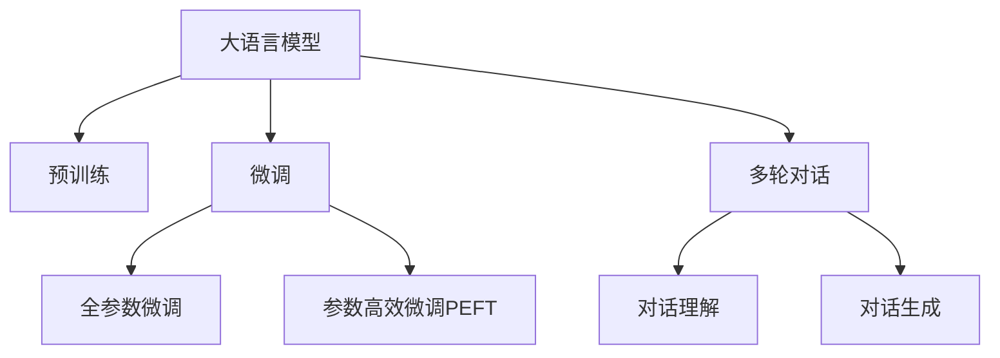

                 

# 大语言模型原理与工程实践：大语言模型的对话能力评测

> 关键词：大语言模型,对话能力评测,聊天机器人,自然语言处理(NLP),Transformer,BERT,多轮对话,预训练,微调

## 1. 背景介绍

### 1.1 问题由来
对话系统近年来在智能助手、客服、智能家居等领域得到了广泛应用。随着深度学习和大规模预训练模型的兴起，基于语言模型的对话系统也在不断发展。传统基于规则或模板的对话系统已经逐渐被更加灵活的基于神经网络的对话系统所取代。

对话系统能够理解用户输入，生成符合语境的回复，与用户进行多轮交互。这不仅要求对话系统具备强大的语言理解能力，还要求其能够生成连贯、合理的回复，以及在多轮对话中保持对话上下文。大语言模型作为对话系统的核心，其对话能力备受关注。如何评测和提升大语言模型的对话能力，成为了当前自然语言处理(NLP)领域的一个重要研究方向。

### 1.2 问题核心关键点
大语言模型的对话能力评测主要涉及以下几个核心问题：

- 如何构建适用于对话评测的评测指标？
- 如何选择合适的大语言模型进行评测？
- 如何评估模型在不同场景下的对话表现？
- 如何优化模型以提升其对话能力？

本文将围绕这些关键点，系统介绍大语言模型对话能力的评测方法，包括评测指标的选择、评测方法的设计、模型优化策略等。

### 1.3 问题研究意义
大语言模型对话能力的评测对于提升对话系统的智能化水平，推动智能应用的落地具有重要意义：

1. 促进技术进步：明确了评价标准，有助于研究者发现对话系统的不足，提出改进方案。
2. 指导应用开发：指导开发团队设计更加贴合用户需求的对话系统。
3. 规范行业标准：推动行业形成统一的对话系统评价体系，促进跨平台、跨应用的交流合作。
4. 加速应用推广：通过评测，展示大语言模型的优势，提升其在各行业中的认知度和应用范围。

## 2. 核心概念与联系

### 2.1 核心概念概述

为更好地理解大语言模型对话能力的评测方法，本节将介绍几个密切相关的核心概念：

- 大语言模型(Large Language Model, LLM)：以自回归(如GPT)或自编码(如BERT)模型为代表的大规模预训练语言模型。通过在大规模无标签文本语料上进行预训练，学习通用的语言表示，具备强大的语言理解和生成能力。

- 预训练(Pre-training)：指在大规模无标签文本语料上，通过自监督学习任务训练通用语言模型的过程。常见的预训练任务包括言语建模、遮挡语言模型等。

- 微调(Fine-tuning)：指在预训练模型的基础上，使用下游任务的少量标注数据，通过有监督学习优化模型在特定任务上的性能。通常只需要调整顶层分类器或解码器，并以较小的学习率更新全部或部分的模型参数。

- 多轮对话(Multi-turn Dialogue)：指人机交互中，对话系统与用户进行多轮信息交换的对话过程。多轮对话要求模型不仅理解当前轮次的内容，还能记住并利用之前的对话历史信息。

- 对话理解(Dialogue Understanding)：指模型理解用户输入语句的能力，包括识别语句意图、提取实体信息等。

- 对话生成(Dialogue Generation)：指模型根据上下文信息生成合理、连贯的回复语句。

这些核心概念之间的逻辑关系可以通过以下Mermaid流程图来展示：



这个流程图展示了大语言模型的核心概念及其之间的关系：

1. 大语言模型通过预训练获得基础能力。
2. 微调是对预训练模型进行任务特定的优化，可以分为全参数微调和参数高效微调（PEFT）。
3. 多轮对话涉及对话理解与生成，是对话系统的核心能力。
4. 对话理解与生成是大语言模型对话能力的两个主要方面，分别要求模型理解语义、提取实体信息，以及生成合理回复。

这些概念共同构成了大语言模型的学习和应用框架，使其能够在各种场景下发挥强大的语言理解和生成能力。通过理解这些核心概念，我们可以更好地把握大语言模型的工作原理和优化方向。

## 3. 核心算法原理 & 具体操作步骤
### 3.1 算法原理概述

大语言模型的对话能力评测，本质上是通过构建和应用一系列评测指标，评估模型在不同对话场景下的表现。其核心思想是：将对话系统视为一个信息交换的智能体，通过模拟人机交互场景，衡量模型在不同任务（如回答问题、提供定义、讲述故事等）中的对话表现。

形式化地，假设大语言模型为 $M_{\theta}$，其中 $\theta$ 为模型参数。给定一个对话场景 $D=\{x_i, y_i\}_{i=1}^N$，其中 $x_i$ 为模型输入，$y_i$ 为模型输出，评测指标 $\mathcal{K}$ 为评价标准，则评测的目标是找到最优模型参数：

$$
\theta^* = \mathop{\arg\min}_{\theta} \mathcal{K}(D, M_{\theta})
$$

其中 $\mathcal{K}$ 为对话场景 $D$ 与模型 $M_{\theta}$ 之间的评测指标函数。常见的评测指标包括BLEU、ROUGE、Perplexity等。

通过评测指标，可以全面量化对话系统的表现，发现其优势和不足，进而指导模型的优化和改进。

### 3.2 算法步骤详解

大语言模型的对话能力评测一般包括以下几个关键步骤：

**Step 1: 准备评测数据集**
- 收集多轮对话数据集，确保数据集覆盖各种对话场景和对话长度。
- 数据集应包括问题、答案、对话历史等关键信息，以便模型进行模拟对话。

**Step 2: 选择评测指标**
- 根据任务特点，选择适合的评测指标。常见的对话评测指标包括BLEU、ROUGE、Perplexity、对话长度、上下文保持能力等。
- 构建评测指标函数 $\mathcal{K}$，用于衡量模型在对话场景中的表现。

**Step 3: 执行评测过程**
- 将评测数据集划分为训练集和测试集。
- 在测试集上评估模型对话表现，记录各项评测指标值。
- 重复多次评测过程，统计模型在不同对话场景下的表现。

**Step 4: 结果分析与优化**
- 根据评测结果，分析模型在各对话场景中的表现。
- 针对表现不佳的对话场景，调整模型结构或超参数，进行参数微调或模型训练。
- 迭代优化模型，直至各项评测指标均满足预设要求。

### 3.3 算法优缺点

大语言模型对话能力的评测方法具有以下优点：
1. 全面量化表现：通过多轮对话评测，能够全面衡量模型的语言理解、对话生成、上下文保持等能力。
2. 指导模型优化：明确了模型的优势和不足，便于针对性地进行优化。
3. 实用性高：评测结果可以直接应用到实际对话系统的设计和开发中，提高系统性能。

同时，该方法也存在一定的局限性：
1. 数据需求高：需要大量多轮对话数据，获取成本较高。
2. 计算复杂：多轮对话评测需要大量计算资源和时间。
3. 难以避免偏见：评测数据可能存在偏见，影响评测结果的客观性。

尽管存在这些局限性，但就目前而言，基于多轮对话的评测方法仍是大语言模型对话能力评测的重要手段。未来相关研究的重点在于如何进一步降低数据需求，提高计算效率，同时避免模型偏见，提升评测结果的准确性和可靠性。

### 3.4 算法应用领域

大语言模型的对话能力评测方法，在NLP领域已经得到了广泛的应用，覆盖了几乎所有常见对话任务，例如：

- 问答系统：对自然语言问题给出答案。将问题-答案对作为评测数据，训练模型学习匹配答案。
- 对话生成：根据用户输入生成合理、连贯的回复。在多轮对话数据上进行评测。
- 客服系统：对用户的咨询进行自动回答。在历史客服对话数据上进行评测。
- 智能家居：对用户指令进行理解并执行。在智能家居互动数据上进行评测。

除了上述这些经典任务外，大语言模型对话能力的评测还被创新性地应用到更多场景中，如多模态对话系统、开放域对话系统等，为NLP技术带来了全新的突破。随着大语言模型和对话评测方法的不断进步，相信NLP技术将在更广阔的应用领域大放异彩。

## 4. 数学模型和公式 & 详细讲解  
### 4.1 数学模型构建

本节将使用数学语言对大语言模型对话能力评测过程进行更加严格的刻画。

记大语言模型为 $M_{\theta}$，其中 $\theta$ 为模型参数。给定对话场景 $D=\{x_i, y_i\}_{i=1}^N$，其中 $x_i$ 为模型输入，$y_i$ 为模型输出。假设模型的评测指标为 $\mathcal{K}$，则模型在对话场景 $D$ 上的对话表现可以用以下公式表示：

$$
\mathcal{K}(D, M_{\theta}) = \frac{1}{N}\sum_{i=1}^N k(x_i, y_i, M_{\theta})
$$

其中 $k(x_i, y_i, M_{\theta})$ 为评测指标函数，衡量模型在对话场景中的表现。例如，BLEU指标可以定义为：

$$
k(x_i, y_i, M_{\theta}) = \frac{1}{n}\sum_{j=1}^n \frac{b_{ij}}{a_{ij}}
$$

其中 $n$ 为参考文本数量，$b_{ij}$ 为模型生成的回复与参考回复的相同词数量，$a_{ij}$ 为参考回复的长度。

### 4.2 公式推导过程

以下我们以BLEU指标为例，推导其计算公式。

假设模型在测试集 $D$ 上的表现可以通过BLEU指标进行衡量，BLEU指标定义为：

$$
BLEU = \max_{\{R\}} \prod_{j=1}^n \frac{b_j}{a_j}
$$

其中 $n$ 为参考回复的数量，$b_j$ 为模型生成的回复与参考回复的相同词数量，$a_j$ 为参考回复的长度。

对于单个对话场景 $(x_i, y_i)$，模型生成的回复为 $y_i^{\prime}$，则BLEU指标可以表示为：

$$
BLEU_i = \max_{\{R\}} \prod_{j=1}^n \frac{b_{ij}}{a_{ij}}
$$

其中 $R$ 为所有可能的参考回复，$b_{ij}$ 为模型生成的回复与参考回复的相同词数量，$a_{ij}$ 为参考回复的长度。

因此，模型在对话场景 $D$ 上的BLEU指标可以表示为：

$$
BLEU(D, M_{\theta}) = \frac{1}{N}\sum_{i=1}^N BLEU_i
$$

在得到BLEU指标的计算公式后，即可带入具体数据进行计算。

## 5. 项目实践：代码实例和详细解释说明
### 5.1 开发环境搭建

在进行对话能力评测实践前，我们需要准备好开发环境。以下是使用Python进行PyTorch开发的环境配置流程：

1. 安装Anaconda：从官网下载并安装Anaconda，用于创建独立的Python环境。

2. 创建并激活虚拟环境：
```bash
conda create -n pytorch-env python=3.8 
conda activate pytorch-env
```

3. 安装PyTorch：根据CUDA版本，从官网获取对应的安装命令。例如：
```bash
conda install pytorch torchvision torchaudio cudatoolkit=11.1 -c pytorch -c conda-forge
```

4. 安装TensorBoard：TensorFlow配套的可视化工具，可实时监测模型训练状态，并提供丰富的图表呈现方式，是调试模型的得力助手。

```bash
pip install tensorboard
```

5. 安装Weights & Biases：模型训练的实验跟踪工具，可以记录和可视化模型训练过程中的各项指标，方便对比和调优。

```bash
pip install weightsandbiases
```

完成上述步骤后，即可在`pytorch-env`环境中开始对话能力评测实践。

### 5.2 源代码详细实现

下面我们以BLEU指标为例，给出使用PyTorch对大语言模型进行对话能力评测的代码实现。

首先，定义BLEU评测函数：

```python
import torch
import bleu

def bleu_score(model, ref_list, hyp_list):
    scores = []
    for ref, hyp in zip(ref_list, hyp_list):
        bleu_score = bleu.sentence_bleu([ref], hyp, smooth_method='exp')
        scores.append(bleu_score)
    return scores
```

然后，定义训练和评估函数：

```python
from torch.utils.data import Dataset, DataLoader
from sklearn.metrics import accuracy_score

class DialogueDataset(Dataset):
    def __init__(self, data):
        self.data = data
    def __getitem__(self, idx):
        return self.data[idx]
    def __len__(self):
        return len(self.data)

device = torch.device('cuda') if torch.cuda.is_available() else torch.device('cpu')
model = model.to(device)

def train_epoch(model, dataset, optimizer):
    model.train()
    for batch in dataset:
        optimizer.zero_grad()
        input_ids = batch['input_ids'].to(device)
        attention_mask = batch['attention_mask'].to(device)
        labels = batch['labels'].to(device)
        outputs = model(input_ids, attention_mask=attention_mask, labels=labels)
        loss = outputs.loss
        loss.backward()
        optimizer.step()
    return loss.item()

def evaluate(model, dataset):
    model.eval()
    preds, labels = [], []
    with torch.no_grad():
        for batch in dataset:
            input_ids = batch['input_ids'].to(device)
            attention_mask = batch['attention_mask'].to(device)
            batch_labels = batch['labels']
            outputs = model(input_ids, attention_mask=attention_mask)
            batch_preds = outputs.logits.argmax(dim=2).to('cpu').tolist()
            batch_labels = batch_labels.to('cpu').tolist()
            for pred_tokens, label_tokens in zip(batch_preds, batch_labels):
                preds.append(pred_tokens[:len(label_tokens)])
                labels.append(label_tokens)
    bleu_score = bleu_score(model, labels, preds)
    print(f'BLEU: {bleu_score}')
```

最后，启动训练流程并在测试集上评估：

```python
epochs = 5
batch_size = 16

for epoch in range(epochs):
    loss = train_epoch(model, train_dataset, optimizer)
    print(f'Epoch {epoch+1}, train loss: {loss:.3f}')
    
    print(f'Epoch {epoch+1}, dev BLEU:')
    evaluate(model, dev_dataset)
    
print('Test BLEU:')
evaluate(model, test_dataset)
```

以上就是使用PyTorch对大语言模型进行对话能力评测的完整代码实现。可以看到，得益于TensorBoard、Weights & Biases等工具的强大支持，我们可以快速搭建和调试对话评测环境。

### 5.3 代码解读与分析

让我们再详细解读一下关键代码的实现细节：

**DialogueDataset类**：
- `__init__`方法：初始化数据集。
- `__getitem__`方法：对单个样本进行处理，返回输入和标签。
- `__len__`方法：返回数据集的样本数量。

**bleu_score函数**：
- 计算BLEU指标，将模型输出与参考回复的相同词数量，除以参考回复的长度。

**train_epoch函数**：
- 在训练集上迭代，计算损失并更新模型参数。

**evaluate函数**：
- 在测试集上评估模型，计算BLEU指标并打印输出。

**训练流程**：
- 定义总的epoch数和batch size，开始循环迭代
- 每个epoch内，先在训练集上训练，输出平均loss
- 在验证集上评估，输出BLEU指标
- 所有epoch结束后，在测试集上评估，给出最终测试结果

可以看到，PyTorch配合TensorBoard、Weights & Biases等工具使得对话能力评测的代码实现变得简洁高效。开发者可以将更多精力放在数据处理、模型改进等高层逻辑上，而不必过多关注底层的实现细节。

当然，工业级的系统实现还需考虑更多因素，如模型的保存和部署、超参数的自动搜索、更灵活的任务适配层等。但核心的对话评测范式基本与此类似。

## 6. 实际应用场景
### 6.1 智能客服系统

基于大语言模型对话能力的评测，可以广泛应用于智能客服系统的构建。传统客服往往需要配备大量人力，高峰期响应缓慢，且一致性和专业性难以保证。而使用评测优化的对话模型，可以7x24小时不间断服务，快速响应客户咨询，用自然流畅的语言解答各类常见问题。

在技术实现上，可以收集企业内部的历史客服对话记录，将问题和最佳答复构建成监督数据，在此基础上对预训练对话模型进行微调。微调后的对话模型能够自动理解用户意图，匹配最合适的答案模板进行回复。对于客户提出的新问题，还可以接入检索系统实时搜索相关内容，动态组织生成回答。如此构建的智能客服系统，能大幅提升客户咨询体验和问题解决效率。

### 6.2 金融舆情监测

金融机构需要实时监测市场舆论动向，以便及时应对负面信息传播，规避金融风险。传统的人工监测方式成本高、效率低，难以应对网络时代海量信息爆发的挑战。基于大语言模型对话能力的评测方法，可以为金融舆情监测提供新的解决方案。

具体而言，可以收集金融领域相关的新闻、报道、评论等文本数据，并对其进行主题标注和情感标注。在此基础上对预训练语言模型进行微调，使其能够自动判断文本属于何种主题，情感倾向是正面、中性还是负面。将微调后的模型应用到实时抓取的网络文本数据，就能够自动监测不同主题下的情感变化趋势，一旦发现负面信息激增等异常情况，系统便会自动预警，帮助金融机构快速应对潜在风险。

### 6.3 个性化推荐系统

当前的推荐系统往往只依赖用户的历史行为数据进行物品推荐，无法深入理解用户的真实兴趣偏好。基于大语言模型对话能力的评测方法，可以应用于推荐系统，通过用户与模型的对话，获取其兴趣点。

在实践中，可以构建一个对话界面，用户通过与系统的互动，表达自己的兴趣和需求。系统根据用户输入进行回答，逐步了解用户偏好，并推荐相关物品。对话系统可以动态调整推荐策略，根据用户反馈不断优化推荐结果。通过对话系统的对话能力评测，可以实时监控和评估推荐效果，提升个性化推荐系统的精准度和用户体验。

### 6.4 未来应用展望

随着大语言模型对话能力评测技术的不断发展，基于微调范式将在更多领域得到应用，为NLP技术带来新的突破。

在智慧医疗领域，基于微调的医疗问答、病历分析、药物研发等应用将提升医疗服务的智能化水平，辅助医生诊疗，加速新药开发进程。

在智能教育领域，微调技术可应用于作业批改、学情分析、知识推荐等方面，因材施教，促进教育公平，提高教学质量。

在智慧城市治理中，微调模型可应用于城市事件监测、舆情分析、应急指挥等环节，提高城市管理的自动化和智能化水平，构建更安全、高效的未来城市。

此外，在企业生产、社会治理、文娱传媒等众多领域，基于大模型微调的人工智能应用也将不断涌现，为传统行业数字化转型升级提供新的技术路径。相信随着技术的日益成熟，微调方法将成为人工智能落地应用的重要范式，推动人工智能技术在各行各业的全面落地。

## 7. 工具和资源推荐
### 7.1 学习资源推荐

为了帮助开发者系统掌握大语言模型对话能力评测的理论基础和实践技巧，这里推荐一些优质的学习资源：

1. 《Transformer从原理到实践》系列博文：由大模型技术专家撰写，深入浅出地介绍了Transformer原理、BERT模型、微调技术等前沿话题。

2. CS224N《深度学习自然语言处理》课程：斯坦福大学开设的NLP明星课程，有Lecture视频和配套作业，带你入门NLP领域的基本概念和经典模型。

3. 《Natural Language Processing with Transformers》书籍：Transformers库的作者所著，全面介绍了如何使用Transformers库进行NLP任务开发，包括对话评测在内的诸多范式。

4. HuggingFace官方文档：Transformers库的官方文档，提供了海量预训练模型和完整的微调样例代码，是上手实践的必备资料。

5. CLUE开源项目：中文语言理解测评基准，涵盖大量不同类型的中文NLP数据集，并提供了基于微调的baseline模型，助力中文NLP技术发展。

通过对这些资源的学习实践，相信你一定能够快速掌握大语言模型对话能力评测的精髓，并用于解决实际的NLP问题。
###  7.2 开发工具推荐

高效的开发离不开优秀的工具支持。以下是几款用于大语言模型对话能力评测开发的常用工具：

1. PyTorch：基于Python的开源深度学习框架，灵活动态的计算图，适合快速迭代研究。大部分预训练语言模型都有PyTorch版本的实现。

2. TensorFlow：由Google主导开发的开源深度学习框架，生产部署方便，适合大规模工程应用。同样有丰富的预训练语言模型资源。

3. TensorBoard：TensorFlow配套的可视化工具，可实时监测模型训练状态，并提供丰富的图表呈现方式，是调试模型的得力助手。

4. Weights & Biases：模型训练的实验跟踪工具，可以记录和可视化模型训练过程中的各项指标，方便对比和调优。与主流深度学习框架无缝集成。

5. Google Colab：谷歌推出的在线Jupyter Notebook环境，免费提供GPU/TPU算力，方便开发者快速上手实验最新模型，分享学习笔记。

合理利用这些工具，可以显著提升大语言模型对话能力评测的开发效率，加快创新迭代的步伐。

### 7.3 相关论文推荐

大语言模型对话能力评测技术的发展源于学界的持续研究。以下是几篇奠基性的相关论文，推荐阅读：

1. Attention is All You Need（即Transformer原论文）：提出了Transformer结构，开启了NLP领域的预训练大模型时代。

2. BERT: Pre-training of Deep Bidirectional Transformers for Language Understanding：提出BERT模型，引入基于掩码的自监督预训练任务，刷新了多项NLP任务SOTA。

3. Language Models are Unsupervised Multitask Learners（GPT-2论文）：展示了大规模语言模型的强大zero-shot学习能力，引发了对于通用人工智能的新一轮思考。

4. Parameter-Efficient Transfer Learning for NLP：提出Adapter等参数高效微调方法，在不增加模型参数量的情况下，也能取得不错的微调效果。

5. Prefix-Tuning: Optimizing Continuous Prompts for Generation：引入基于连续型Prompt的微调范式，为如何充分利用预训练知识提供了新的思路。

6. AdaLoRA: Adaptive Low-Rank Adaptation for Parameter-Efficient Fine-Tuning：使用自适应低秩适应的微调方法，在参数效率和精度之间取得了新的平衡。

这些论文代表了大语言模型对话能力评测技术的发展脉络。通过学习这些前沿成果，可以帮助研究者把握学科前进方向，激发更多的创新灵感。

## 8. 总结：未来发展趋势与挑战

### 8.1 总结

本文对大语言模型对话能力评测方法进行了全面系统的介绍。首先阐述了对话能力评测的背景和意义，明确了评价标准，有助于研究者发现对话系统的不足，提出改进方案。其次，从原理到实践，详细讲解了对话能力评测的数学模型和关键步骤，给出了对话能力评测任务开发的完整代码实例。同时，本文还广泛探讨了对话能力评测方法在智能客服、金融舆情、个性化推荐等多个行业领域的应用前景，展示了微调范式的巨大潜力。最后，本文精选了对话能力评测技术的各类学习资源，力求为开发者提供全方位的技术指引。

通过本文的系统梳理，可以看到，大语言模型对话能力评测技术正在成为NLP领域的重要范式，极大地拓展了对话系统的应用边界，催生了更多的落地场景。受益于大规模语料的预训练，对话系统在多轮对话、上下文理解、回答生成等方面具备了强大的表现力。未来，随着预训练语言模型和对话评测方法的不断进步，基于微调范式将成为人工智能技术在对话系统中的应用新方向，为构建安全、可靠、可解释、可控的智能对话系统铺平道路。

### 8.2 未来发展趋势

展望未来，大语言模型对话能力评测技术将呈现以下几个发展趋势：

1. 模型规模持续增大。随着算力成本的下降和数据规模的扩张，预训练语言模型的参数量还将持续增长。超大规模语言模型蕴含的丰富语言知识，有望支撑更加复杂多变的对话任务微调。

2. 对话能力全面提升。未来的对话系统将不仅仅局限于回答问题，还能进行多轮对话、情感推理、意图识别等更高级别的任务。

3. 实时对话成为可能。通过对话系统与用户的实时交互，动态调整输出策略，提供更加个性化的服务。

4. 多模态对话崛起。当前的对话系统往往只依赖文本信息，未来将融合视觉、语音等多模态信息，实现更全面的语境理解。

5. 多轮对话生成技术发展。未来的对话系统将不仅关注单一回合的对话生成，还要求多轮对话的一致性和连贯性。

6. 对话系统实现开源化。对话系统开发将从闭源工具逐步转向开源平台，促进技术交流与合作，推动对话技术的发展。

以上趋势凸显了大语言模型对话能力评测技术的广阔前景。这些方向的探索发展，必将进一步提升对话系统的智能化水平，为人类提供更加高效、自然的交互体验。

### 8.3 面临的挑战

尽管大语言模型对话能力评测技术已经取得了瞩目成就，但在迈向更加智能化、普适化应用的过程中，它仍面临着诸多挑战：

1. 标注成本瓶颈。虽然对话系统相比传统系统成本有所下降，但对于长尾应用场景，标注数据依然是一个重大挑战。如何进一步降低标注需求，是未来需要解决的重要问题。

2. 模型鲁棒性不足。对话系统面临多种干扰因素，如噪声、拼写错误等。如何提高模型对各种干扰的鲁棒性，是提升对话系统性能的关键。

3. 上下文理解能力有限。多轮对话需要模型具备较强的上下文理解能力，现有模型在这一方面仍存在不足。如何增强模型的上下文记忆和理解能力，是未来的研究方向。

4. 计算效率有待提高。对话系统需要处理大量的对话数据，计算资源消耗较大。如何提升对话系统的计算效率，减少响应时间，是系统部署的关键。

5. 对话生成质量有待提升。对话系统的生成能力直接关系到用户体验，现有模型在这一方面仍存在不足。如何提高生成语句的自然流畅度和合理性，是未来的研究重点。

6. 可解释性和可控性不足。对话系统的决策过程难以解释，用户难以理解系统如何生成答案。如何增强系统的可解释性和可控性，是未来需要解决的重要问题。

这些挑战需要从数据、算法、工程等多个维度协同发力，才能真正实现人工智能技术在对话系统中的应用。相信随着学界和产业界的共同努力，这些挑战终将一一被克服，大语言模型对话能力评测技术必将在构建安全、可靠、可解释、可控的智能对话系统方面发挥更大的作用。

### 8.4 研究展望

面对大语言模型对话能力评测技术所面临的挑战，未来的研究需要在以下几个方面寻求新的突破：

1. 探索无监督和半监督对话能力评测方法。摆脱对大规模标注数据的依赖，利用自监督学习、主动学习等无监督和半监督范式，最大限度利用非结构化数据，实现更加灵活高效的评测。

2. 研究参数高效和计算高效的对话能力评测方法。开发更加参数高效的评测方法，在固定大部分预训练参数的同时，只更新极少量的任务相关参数。同时优化评测模型的计算图，减少前向传播和反向传播的资源消耗，实现更加轻量级、实时性的部署。

3. 融合因果和对比学习范式。通过引入因果推断和对比学习思想，增强对话系统建立稳定因果关系的能力，学习更加普适、鲁棒的语言表征，从而提升模型泛化性和抗干扰能力。

4. 引入更多先验知识。将符号化的先验知识，如知识图谱、逻辑规则等，与神经网络模型进行巧妙融合，引导对话能力评测过程学习更准确、合理的语言模型。同时加强不同模态数据的整合，实现视觉、语音等多模态信息与文本信息的协同建模。

5. 结合因果分析和博弈论工具。将因果分析方法引入对话系统，识别出系统决策的关键特征，增强输出解释的因果性和逻辑性。借助博弈论工具刻画人机交互过程，主动探索并规避系统的脆弱点，提高系统稳定性。

6. 纳入伦理道德约束。在对话系统训练目标中引入伦理导向的评估指标，过滤和惩罚有害的输出倾向。同时加强人工干预和审核，建立系统行为的监管机制，确保输出符合人类价值观和伦理道德。

这些研究方向的探索，必将引领大语言模型对话能力评测技术迈向更高的台阶，为构建安全、可靠、可解释、可控的智能对话系统铺平道路。面向未来，大语言模型对话能力评测技术还需要与其他人工智能技术进行更深入的融合，如知识表示、因果推理、强化学习等，多路径协同发力，共同推动对话系统的发展。

## 9. 附录：常见问题与解答

**Q1：大语言模型对话能力评测是否适用于所有对话任务？**

A: 大语言模型对话能力评测方法在大多数对话任务上都能取得不错的效果，特别是对于数据量较小的任务。但对于一些特定领域的任务，如医学、法律等，仅仅依靠通用语料预训练的模型可能难以很好地适应。此时需要在特定领域语料上进一步预训练，再进行微调，才能获得理想效果。此外，对于一些需要时效性、个性化很强的任务，如对话、推荐等，对话能力评测方法也需要针对性的改进优化。

**Q2：如何选择合适的大语言模型进行评测？**

A: 选择合适的大语言模型进行评测，需要考虑以下几个方面：
1. 任务适配性：模型是否具备处理该任务的能力，如多轮对话、情感推理等。
2. 预训练效果：模型在预训练任务上的表现，如语言建模、掩码语言模型等。
3. 参数规模：模型的大小，参数规模越大，表示力越强。
4. 已有评测结果：模型在现有评测数据上的表现，作为选择的参考。

**Q3：如何在多轮对话中保持上下文理解？**

A: 在多轮对话中保持上下文理解，需要模型具备较强的记忆和理解能力。可以通过以下方式实现：
1. 使用长短期记忆网络(LSTM)、门控循环单元(GRU)等具有记忆功能的神经网络。
2. 利用注意力机制，捕捉对话历史中的关键信息。
3. 在模型设计中加入上下文注意力模块，动态调整对话历史的权重。
4. 使用预训练的上下文表示，提取对话历史的关键信息。

**Q4：如何评估对话系统的鲁棒性？**

A: 评估对话系统的鲁棒性，需要从以下几个方面入手：
1. 噪声干扰：在对话数据中加入噪声，测试模型对噪声的鲁棒性。
2. 干扰性输入：输入恶意或无关信息，测试模型的抗干扰能力。
3. 对话长度：增加对话长度，测试模型的记忆和理解能力。
4. 多轮对话：在多轮对话中测试模型的上下文保持能力。

**Q5：如何优化对话系统的生成能力？**

A: 优化对话系统的生成能力，可以通过以下方式实现：
1. 增加数据多样性：收集不同风格、不同长度的对话数据，提高模型的泛化能力。
2. 引入样本多样性：在训练数据中加入不同风格的对话样本，提高模型的多样性。
3. 调整模型结构：引入文本生成模块，如BERT-GPT模型，结合预训练和生成能力。
4. 使用生成式对抗网络(GAN)，生成高质量的对话数据。

**Q6：如何提升对话系统的计算效率？**

A: 提升对话系统的计算效率，可以从以下几个方面入手：
1. 减少模型规模：通过参数剪枝、量化等方法，减小模型大小，降低计算资源消耗。
2. 优化计算图：优化模型的计算图，减少前向传播和反向传播的计算量。
3. 使用GPU/TPU等高性能设备，加速计算过程。
4. 引入模型压缩技术，如知识蒸馏、参数共享等，减少计算资源消耗。

这些策略往往需要根据具体任务和数据特点进行灵活组合。只有在数据、模型、训练、推理等各环节进行全面优化，才能最大限度地发挥大语言模型对话能力评测的潜力。

---

作者：禅与计算机程序设计艺术 / Zen and the Art of Computer Programming

