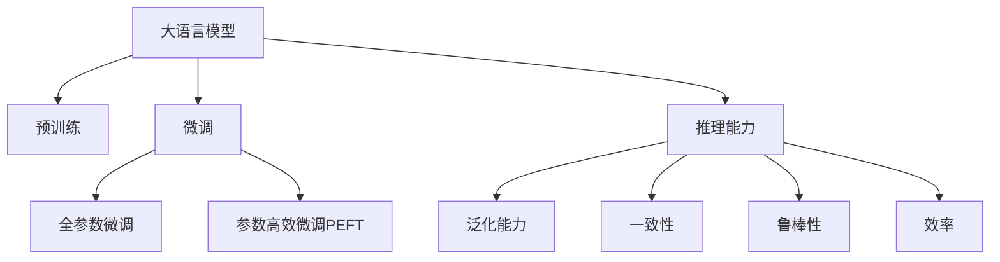

                 

# 大语言模型原理与工程实践：大语言模型的推理能力

> 关键词：大语言模型,推理能力,Transformer,BERT,自回归模型,自编码模型,伪标签,逻辑回归,认知推理

## 1. 背景介绍

### 1.1 问题由来

大语言模型（Large Language Model, LLM）自2018年以来迅速崛起，特别是在自然语言处理（Natural Language Processing, NLP）领域，其泛化能力和性能提升已经引发了广泛关注。谷歌的BERT和OpenAI的GPT等模型，通过在大量无标签文本上预训练，学习了丰富的语言知识，并通过微调（Fine-Tuning）在特定任务上取得了优异的表现。然而，推理能力是大语言模型应用的重要方面，但对于大语言模型的推理能力如何工作，以及如何改进其推理能力，现有文献和实践关注较少。

### 1.2 问题核心关键点

推理能力（Inference Capability）指的是模型在面对新输入时，能够根据已有知识和经验，做出合理的预测和决策。对于大语言模型而言，其推理能力主要体现在以下几个方面：

- **泛化能力**：模型是否能够从训练数据中泛化到新场景，适应不同的输入和任务。
- **一致性**：模型在不同输入下的推理结果是否一致，避免系统性的误差。
- **鲁棒性**：模型面对噪声、干扰或异常数据时的稳定性。
- **效率**：推理速度和资源占用是否合理。

本文旨在通过分析大语言模型的推理原理，探讨如何改进和优化其推理能力，从而在实际应用中更好地发挥其价值。

### 1.3 问题研究意义

大语言模型的推理能力，是其在复杂任务和实际应用中表现优异的关键。通过改进推理能力，可以有效提升模型的可靠性和效率，使其能够更好地适应现实世界的复杂性和多样性。同时，推理能力的提升也有助于增强模型的可解释性和安全性，减少误导性或有害的输出，促进人工智能技术在各领域的广泛应用。

## 2. 核心概念与联系

### 2.1 核心概念概述

为了深入理解大语言模型的推理能力，首先需要明确一些核心概念：

- **大语言模型**：以自回归（如GPT）或自编码（如BERT）模型为代表的大规模预训练语言模型，通过在海量无标签文本上预训练，学习到了丰富的语言知识和常识。
- **预训练**：指在大量无标签文本上，通过自监督学习任务训练通用语言模型的过程。常见的预训练任务包括掩码语言模型（Masked Language Model, MLM）、下一句预测（Next Sentence Prediction, NSP）等。
- **微调**：指在预训练模型的基础上，使用下游任务的少量标注数据，通过有监督学习优化模型在该任务上的性能。
- **推理能力**：指模型在面对新输入时，根据已有知识和经验，做出合理预测和决策的能力。
- **自回归模型**：如GPT，采用序列到序列（Sequence-to-Sequence）的生成方式，每个时刻的输出依赖于之前的所有时刻。
- **自编码模型**：如BERT，通过重建原始输入，学习编码器-解码器（Encoder-Decoder）框架。

这些核心概念之间的逻辑关系可以通过以下Mermaid流程图来展示：



### 2.2 核心概念原理和架构

#### 2.2.1 自回归模型

自回归模型（如GPT-2、GPT-3）的核心是Transformer架构，由多个编码器层和解码器层组成。每个层包含多头自注意力（Multi-Head Self-Attention）机制，能够捕捉输入序列中的依赖关系。在解码阶段，模型通过生成位置条件编码器（Positional Encoding），逐步生成下一个词汇。


#### 2.2.2 自编码模型

自编码模型（如BERT、RoBERTa）通过重建原始输入来学习编码器-解码器框架。在预训练阶段，模型输入被分割成多个句子，并随机掩码（Mask）其中部分词汇。在解码阶段，模型尝试还原原始输入，从而学习到词汇之间的关系。


### 2.3 大语言模型推理过程

大语言模型的推理过程可以分为以下几个步骤：

1. **输入编码**：将输入文本转换成模型可以处理的向量形式。
2. **自注意力机制**：通过自注意力机制，模型能够捕捉输入文本中的依赖关系。
3. **生成过程**：通过多头注意力和前馈神经网络（Feedforward Neural Network），模型逐步生成输出。
4. **解码输出**：最终输出经过解码器，生成自然语言文本。

## 3. 核心算法原理 & 具体操作步骤

### 3.1 算法原理概述

大语言模型的推理能力主要依赖于其预训练阶段学习到的语言知识和常识。通过微调，模型能够适应特定任务的需求，进一步提升推理能力。常见的微调方法包括全参数微调和参数高效微调（Parameter-Efficient Fine-Tuning, PEFT）。全参数微调指的是微调模型的所有参数，而参数高效微调仅微调顶层或特定参数，以减少资源消耗和过拟合风险。

### 3.2 算法步骤详解

#### 3.2.1 输入编码

输入文本首先经过分词（Tokenization），然后通过嵌入层（Embedding Layer）转换成向量形式。在BERT中，每个词汇被嵌入到一个128维的向量中。在GPT中，每个词汇被嵌入到一个不同的向量中，以捕捉词汇之间的依赖关系。

#### 3.2.2 自注意力机制

自注意力机制是Transformer架构的核心，通过计算注意力权重，模型能够捕捉输入序列中的依赖关系。自注意力机制分为多头注意力（Multi-Head Self-Attention）和位置注意力（Positional Self-Attention）两种。多头注意力机制将输入序列分解为多个头，每个头负责捕捉不同的依赖关系；位置注意力机制通过位置编码（Positional Encoding），捕捉序列中每个位置的重要性。

#### 3.2.3 生成过程

在自回归模型中，生成过程包括两个步骤：解码器和自回归模块。解码器通过多头注意力和前馈神经网络，逐步生成下一个词汇。自回归模块通过预测下一个词汇，更新模型状态。在自编码模型中，生成过程主要通过解码器实现，通过预测原始输入来重建输入序列。

#### 3.2.4 解码输出

最终输出经过解码器，生成自然语言文本。在自回归模型中，输出文本的每个词汇都依赖于之前的所有词汇；在自编码模型中，输出文本与输入文本在结构上有所不同，但仍然需要通过解码器生成。

### 3.3 算法优缺点

#### 3.3.1 优点

1. **泛化能力**：大语言模型通过在大量无标签文本上预训练，学习到了丰富的语言知识，能够在不同任务上表现优异。
2. **一致性**：自注意力机制使得模型在面对不同输入时，能够保持一致的推理结果。
3. **鲁棒性**：通过使用正则化技术、对抗训练等方法，模型能够提高鲁棒性，减少对噪声数据的敏感性。
4. **效率**：部分参数高效微调方法可以显著降低计算资源消耗，提升推理速度。

#### 3.3.2 缺点

1. **资源消耗**：大语言模型通常具有大量参数，计算资源消耗较大。
2. **解释性不足**：黑盒模型难以解释其内部推理过程。
3. **过拟合风险**：在微调过程中，如果参数过多或学习率过大，模型容易过拟合。
4. **推理速度**：由于模型参数量大，推理速度较慢，难以满足实时应用需求。

### 3.4 算法应用领域

大语言模型的推理能力广泛应用于以下几个领域：

- **问答系统**：如IBM Watson、Microsoft QnA Maker等，通过问答对训练微调模型，能够理解用户问题并提供准确回答。
- **对话系统**：如Google Dialogflow、Microsoft Bot Framework等，通过对话历史和上下文，逐步生成对话回复。
- **翻译系统**：如Google Translate、Microsoft Translator等，通过机器翻译模型，将一种语言翻译成另一种语言。
- **文本摘要**：如OpenAI Codex、GPT-3等，通过自动摘要模型，将长文本压缩成简短摘要。
- **命名实体识别**：如BERT、RoBERTa等，通过实体识别模型，从文本中提取特定实体。

## 4. 数学模型和公式 & 详细讲解 & 举例说明

### 4.1 数学模型构建

大语言模型的推理过程可以通过数学模型进行形式化描述。以BERT为例，其预训练目标函数包括掩码语言模型（MLM）和下一句预测（NSP）两个部分。


### 4.2 公式推导过程

在BERT中，掩码语言模型（MLM）的目标是最小化预测词汇概率与真实词汇概率的差距。对于每个输入句子，随机掩码其中15%的词汇，然后通过掩码向量进行预测。


对于下一个句子的预测（NSP），BERT通过预测两个句子是否连续，来强化模型的序列理解能力。


在微调过程中，我们使用监督学习任务来训练模型。以二分类任务为例，目标是最小化交叉熵损失。对于每个样本，模型预测标签和真实标签之间的差异可以通过交叉熵损失函数来衡量。


### 4.3 案例分析与讲解

假设我们有一个二分类任务，通过微调BERT模型来实现。其代码实现如下：

```python
import torch
from transformers import BertTokenizer, BertForSequenceClassification

# 初始化模型和tokenizer
model = BertForSequenceClassification.from_pretrained('bert-base-uncased')
tokenizer = BertTokenizer.from_pretrained('bert-base-uncased')

# 准备数据
train_data = # 训练数据
val_data = # 验证数据
test_data = # 测试数据

# 定义损失函数和优化器
loss_fn = torch.nn.CrossEntropyLoss()
optimizer = torch.optim.Adam(model.parameters(), lr=2e-5)

# 微调过程
for epoch in range(10):
    # 训练过程
    model.train()
    for data in train_data:
        inputs, labels = data
        outputs = model(inputs)
        loss = loss_fn(outputs, labels)
        optimizer.zero_grad()
        loss.backward()
        optimizer.step()

    # 验证过程
    model.eval()
    for data in val_data:
        inputs, labels = data
        outputs = model(inputs)
        loss = loss_fn(outputs, labels)

# 测试过程
model.eval()
for data in test_data:
    inputs, labels = data
    outputs = model(inputs)
    loss = loss_fn(outputs, labels)
```

在上述代码中，我们通过Adam优化器来最小化交叉熵损失，逐步训练模型，并在验证集上评估模型性能。

## 5. 项目实践：代码实例和详细解释说明

### 5.1 开发环境搭建

在开始微调之前，我们需要准备好开发环境。以下是使用Python进行PyTorch开发的环境配置流程：

1. 安装Anaconda：从官网下载并安装Anaconda，用于创建独立的Python环境。

2. 创建并激活虚拟环境：
```bash
conda create -n pytorch-env python=3.8 
conda activate pytorch-env
```

3. 安装PyTorch：根据CUDA版本，从官网获取对应的安装命令。例如：
```bash
conda install pytorch torchvision torchaudio cudatoolkit=11.1 -c pytorch -c conda-forge
```

4. 安装Transformers库：
```bash
pip install transformers
```

5. 安装各类工具包：
```bash
pip install numpy pandas scikit-learn matplotlib tqdm jupyter notebook ipython
```

完成上述步骤后，即可在`pytorch-env`环境中开始微调实践。

### 5.2 源代码详细实现

下面我们以命名实体识别（Named Entity Recognition, NER）任务为例，给出使用Transformers库对BERT模型进行微调的PyTorch代码实现。

首先，定义NER任务的数据处理函数：

```python
from transformers import BertTokenizer
from torch.utils.data import Dataset
import torch

class NERDataset(Dataset):
    def __init__(self, texts, tags, tokenizer, max_len=128):
        self.texts = texts
        self.tags = tags
        self.tokenizer = tokenizer
        self.max_len = max_len
        
    def __len__(self):
        return len(self.texts)
    
    def __getitem__(self, item):
        text = self.texts[item]
        tags = self.tags[item]
        
        encoding = self.tokenizer(text, return_tensors='pt', max_length=self.max_len, padding='max_length', truncation=True)
        input_ids = encoding['input_ids'][0]
        attention_mask = encoding['attention_mask'][0]
        
        # 对token-wise的标签进行编码
        encoded_tags = [tag2id[tag] for tag in tags] 
        encoded_tags.extend([tag2id['O']] * (self.max_len - len(encoded_tags)))
        labels = torch.tensor(encoded_tags, dtype=torch.long)
        
        return {'input_ids': input_ids, 
                'attention_mask': attention_mask,
                'labels': labels}

# 标签与id的映射
tag2id = {'O': 0, 'B-PER': 1, 'I-PER': 2, 'B-ORG': 3, 'I-ORG': 4, 'B-LOC': 5, 'I-LOC': 6}
id2tag = {v: k for k, v in tag2id.items()}

# 创建dataset
tokenizer = BertTokenizer.from_pretrained('bert-base-cased')

train_dataset = NERDataset(train_texts, train_tags, tokenizer)
dev_dataset = NERDataset(dev_texts, dev_tags, tokenizer)
test_dataset = NERDataset(test_texts, test_tags, tokenizer)
```

然后，定义模型和优化器：

```python
from transformers import BertForTokenClassification, AdamW

model = BertForTokenClassification.from_pretrained('bert-base-cased', num_labels=len(tag2id))

optimizer = AdamW(model.parameters(), lr=2e-5)
```

接着，定义训练和评估函数：

```python
from torch.utils.data import DataLoader
from tqdm import tqdm
from sklearn.metrics import classification_report

device = torch.device('cuda') if torch.cuda.is_available() else torch.device('cpu')
model.to(device)

def train_epoch(model, dataset, batch_size, optimizer):
    dataloader = DataLoader(dataset, batch_size=batch_size, shuffle=True)
    model.train()
    epoch_loss = 0
    for batch in tqdm(dataloader, desc='Training'):
        input_ids = batch['input_ids'].to(device)
        attention_mask = batch['attention_mask'].to(device)
        labels = batch['labels'].to(device)
        model.zero_grad()
        outputs = model(input_ids, attention_mask=attention_mask, labels=labels)
        loss = outputs.loss
        epoch_loss += loss.item()
        loss.backward()
        optimizer.step()
    return epoch_loss / len(dataloader)

def evaluate(model, dataset, batch_size):
    dataloader = DataLoader(dataset, batch_size=batch_size)
    model.eval()
    preds, labels = [], []
    with torch.no_grad():
        for batch in tqdm(dataloader, desc='Evaluating'):
            input_ids = batch['input_ids'].to(device)
            attention_mask = batch['attention_mask'].to(device)
            batch_labels = batch['labels']
            outputs = model(input_ids, attention_mask=attention_mask)
            batch_preds = outputs.logits.argmax(dim=2).to('cpu').tolist()
            batch_labels = batch_labels.to('cpu').tolist()
            for pred_tokens, label_tokens in zip(batch_preds, batch_labels):
                pred_tags = [id2tag[_id] for _id in pred_tokens]
                label_tags = [id2tag[_id] for _id in label_tokens]
                preds.append(pred_tags[:len(label_tags)])
                labels.append(label_tags)
                
    print(classification_report(labels, preds))
```

最后，启动训练流程并在测试集上评估：

```python
epochs = 5
batch_size = 16

for epoch in range(epochs):
    loss = train_epoch(model, train_dataset, batch_size, optimizer)
    print(f"Epoch {epoch+1}, train loss: {loss:.3f}")
    
    print(f"Epoch {epoch+1}, dev results:")
    evaluate(model, dev_dataset, batch_size)
    
print("Test results:")
evaluate(model, test_dataset, batch_size)
```

以上就是使用PyTorch对BERT进行命名实体识别任务微调的完整代码实现。可以看到，得益于Transformers库的强大封装，我们可以用相对简洁的代码完成BERT模型的加载和微调。

### 5.3 代码解读与分析

让我们再详细解读一下关键代码的实现细节：

**NERDataset类**：
- `__init__`方法：初始化文本、标签、分词器等关键组件。
- `__len__`方法：返回数据集的样本数量。
- `__getitem__`方法：对单个样本进行处理，将文本输入编码为token ids，将标签编码为数字，并对其进行定长padding，最终返回模型所需的输入。

**tag2id和id2tag字典**：
- 定义了标签与数字id之间的映射关系，用于将token-wise的预测结果解码回真实的标签。

**训练和评估函数**：
- 使用PyTorch的DataLoader对数据集进行批次化加载，供模型训练和推理使用。
- 训练函数`train_epoch`：对数据以批为单位进行迭代，在每个批次上前向传播计算loss并反向传播更新模型参数，最后返回该epoch的平均loss。
- 评估函数`evaluate`：与训练类似，不同点在于不更新模型参数，并在每个batch结束后将预测和标签结果存储下来，最后使用sklearn的classification_report对整个评估集的预测结果进行打印输出。

**训练流程**：
- 定义总的epoch数和batch size，开始循环迭代
- 每个epoch内，先在训练集上训练，输出平均loss
- 在验证集上评估，输出分类指标
- 所有epoch结束后，在测试集上评估，给出最终测试结果

可以看到，PyTorch配合Transformers库使得BERT微调的代码实现变得简洁高效。开发者可以将更多精力放在数据处理、模型改进等高层逻辑上，而不必过多关注底层的实现细节。

当然，工业级的系统实现还需考虑更多因素，如模型的保存和部署、超参数的自动搜索、更灵活的任务适配层等。但核心的微调范式基本与此类似。

## 6. 实际应用场景

### 6.1 智能客服系统

基于大语言模型微调的对话技术，可以广泛应用于智能客服系统的构建。传统客服往往需要配备大量人力，高峰期响应缓慢，且一致性和专业性难以保证。而使用微调后的对话模型，可以7x24小时不间断服务，快速响应客户咨询，用自然流畅的语言解答各类常见问题。

在技术实现上，可以收集企业内部的历史客服对话记录，将问题和最佳答复构建成监督数据，在此基础上对预训练对话模型进行微调。微调后的对话模型能够自动理解用户意图，匹配最合适的答案模板进行回复。对于客户提出的新问题，还可以接入检索系统实时搜索相关内容，动态组织生成回答。如此构建的智能客服系统，能大幅提升客户咨询体验和问题解决效率。

### 6.2 金融舆情监测

金融机构需要实时监测市场舆论动向，以便及时应对负面信息传播，规避金融风险。传统的人工监测方式成本高、效率低，难以应对网络时代海量信息爆发的挑战。基于大语言模型微调的文本分类和情感分析技术，为金融舆情监测提供了新的解决方案。

具体而言，可以收集金融领域相关的新闻、报道、评论等文本数据，并对其进行主题标注和情感标注。在此基础上对预训练语言模型进行微调，使其能够自动判断文本属于何种主题，情感倾向是正面、中性还是负面。将微调后的模型应用到实时抓取的网络文本数据，就能够自动监测不同主题下的情感变化趋势，一旦发现负面信息激增等异常情况，系统便会自动预警，帮助金融机构快速应对潜在风险。

### 6.3 个性化推荐系统

当前的推荐系统往往只依赖用户的历史行为数据进行物品推荐，无法深入理解用户的真实兴趣偏好。基于大语言模型微调技术，个性化推荐系统可以更好地挖掘用户行为背后的语义信息，从而提供更精准、多样的推荐内容。

在实践中，可以收集用户浏览、点击、评论、分享等行为数据，提取和用户交互的物品标题、描述、标签等文本内容。将文本内容作为模型输入，用户的后续行为（如是否点击、购买等）作为监督信号，在此基础上微调预训练语言模型。微调后的模型能够从文本内容中准确把握用户的兴趣点。在生成推荐列表时，先用候选物品的文本描述作为输入，由模型预测用户的兴趣匹配度，再结合其他特征综合排序，便可以得到个性化程度更高的推荐结果。

### 6.4 未来应用展望

随着大语言模型和微调方法的不断发展，基于微调范式将在更多领域得到应用，为传统行业带来变革性影响。

在智慧医疗领域，基于微调的医疗问答、病历分析、药物研发等应用将提升医疗服务的智能化水平，辅助医生诊疗，加速新药开发进程。

在智能教育领域，微调技术可应用于作业批改、学情分析、知识推荐等方面，因材施教，促进教育公平，提高教学质量。

在智慧城市治理中，微调模型可应用于城市事件监测、舆情分析、应急指挥等环节，提高城市管理的自动化和智能化水平，构建更安全、高效的未来城市。

此外，在企业生产、社会治理、文娱传媒等众多领域，基于大模型微调的人工智能应用也将不断涌现，为经济社会发展注入新的动力。相信随着技术的日益成熟，微调方法将成为人工智能落地应用的重要范式，推动人工智能技术在各领域的广泛应用。

## 7. 工具和资源推荐

### 7.1 学习资源推荐

为了帮助开发者系统掌握大语言模型微调的理论基础和实践技巧，这里推荐一些优质的学习资源：

1. 《Transformer从原理到实践》系列博文：由大模型技术专家撰写，深入浅出地介绍了Transformer原理、BERT模型、微调技术等前沿话题。

2. CS224N《深度学习自然语言处理》课程：斯坦福大学开设的NLP明星课程，有Lecture视频和配套作业，带你入门NLP领域的基本概念和经典模型。

3. 《Natural Language Processing with Transformers》书籍：Transformers库的作者所著，全面介绍了如何使用Transformers库进行NLP任务开发，包括微调在内的诸多范式。

4. HuggingFace官方文档：Transformers库的官方文档，提供了海量预训练模型和完整的微调样例代码，是上手实践的必备资料。

5. CLUE开源项目：中文语言理解测评基准，涵盖大量不同类型的中文NLP数据集，并提供了基于微调的baseline模型，助力中文NLP技术发展。

通过对这些资源的学习实践，相信你一定能够快速掌握大语言模型微调的精髓，并用于解决实际的NLP问题。
###  7.2 开发工具推荐

高效的开发离不开优秀的工具支持。以下是几款用于大语言模型微调开发的常用工具：

1. PyTorch：基于Python的开源深度学习框架，灵活动态的计算图，适合快速迭代研究。大部分预训练语言模型都有PyTorch版本的实现。

2. TensorFlow：由Google主导开发的开源深度学习框架，生产部署方便，适合大规模工程应用。同样有丰富的预训练语言模型资源。

3. Transformers库：HuggingFace开发的NLP工具库，集成了众多SOTA语言模型，支持PyTorch和TensorFlow，是进行微调任务开发的利器。

4. Weights & Biases：模型训练的实验跟踪工具，可以记录和可视化模型训练过程中的各项指标，方便对比和调优。与主流深度学习框架无缝集成。

5. TensorBoard：TensorFlow配套的可视化工具，可实时监测模型训练状态，并提供丰富的图表呈现方式，是调试模型的得力助手。

6. Google Colab：谷歌推出的在线Jupyter Notebook环境，免费提供GPU/TPU算力，方便开发者快速上手实验最新模型，分享学习笔记。

合理利用这些工具，可以显著提升大语言模型微调任务的开发效率，加快创新迭代的步伐。

### 7.3 相关论文推荐

大语言模型和微调技术的发展源于学界的持续研究。以下是几篇奠基性的相关论文，推荐阅读：

1. Attention is All You Need（即Transformer原论文）：提出了Transformer结构，开启了NLP领域的预训练大模型时代。

2. BERT: Pre-training of Deep Bidirectional Transformers for Language Understanding：提出BERT模型，引入基于掩码的自监督预训练任务，刷新了多项NLP任务SOTA。

3. Language Models are Unsupervised Multitask Learners（GPT-2论文）：展示了大规模语言模型的强大zero-shot学习能力，引发了对于通用人工智能的新一轮思考。

4. Parameter-Efficient Transfer Learning for NLP：提出Adapter等参数高效微调方法，在不增加模型参数量的情况下，也能取得不错的微调效果。

5. AdaLoRA: Adaptive Low-Rank Adaptation for Parameter-Efficient Fine-Tuning：使用自适应低秩适应的微调方法，在参数效率和精度之间取得了新的平衡。

6. Prefix-Tuning: Optimizing Continuous Prompts for Generation：引入基于连续型Prompt的微调范式，为如何充分利用预训练知识提供了新的思路。

这些论文代表了大语言模型微调技术的发展脉络。通过学习这些前沿成果，可以帮助研究者把握学科前进方向，激发更多的创新灵感。

## 8. 总结：未来发展趋势与挑战

### 8.1 总结

本文对大语言模型的推理能力进行了全面系统的介绍。首先阐述了大语言模型和微调技术的研究背景和意义，明确了推理能力在提升模型效果和实际应用中的重要性。其次，从原理到实践，详细讲解了推理能力的核心算法和具体操作步骤，给出了微调任务开发的完整代码实例。同时，本文还广泛探讨了推理能力在智能客服、金融舆情、个性化推荐等多个行业领域的应用前景，展示了推理能力的巨大潜力。此外，本文精选了推理能力的学习资源，力求为读者提供全方位的技术指引。

通过本文的系统梳理，可以看到，大语言模型的推理能力是其应用的核心，对于提升模型性能和实际应用有着不可忽视的重要作用。未来，随着推理能力的不断提升和优化，大语言模型必将在更广泛的领域中发挥其价值，推动人工智能技术的发展。

### 8.2 未来发展趋势

展望未来，大语言模型的推理能力将呈现以下几个发展趋势：

1. **多任务学习**：通过多任务学习，模型能够同时学习多个任务的知识，提升泛化能力。多任务学习的推理能力，能够更好地应对多领域、多场景的复杂应用。

2. **跨模态推理**：通过引入视觉、语音、文本等多模态数据，模型能够进行跨模态推理，增强其在真实世界中的理解和推理能力。

3. **因果推理**：引入因果推断方法，模型能够识别出因果关系，提高推理的逻辑性和准确性。

4. **交互式推理**：通过对话系统等交互式工具，模型能够与用户进行交互，逐步细化推理过程，提供更符合用户需求的输出。

5. **自适应推理**：通过自适应学习算法，模型能够根据输入数据动态调整推理策略，提高推理的灵活性和适应性。

6. **鲁棒性提升**：通过对抗训练、鲁棒性增强技术，模型能够更好地应对噪声数据、异常情况等挑战，提高推理的稳定性和鲁棒性。

以上趋势凸显了大语言模型推理能力的广阔前景。这些方向的探索发展，必将进一步提升模型的性能和应用范围，为人工智能技术在各领域的落地应用提供坚实的基础。

### 8.3 面临的挑战

尽管大语言模型的推理能力在不断提升，但在迈向更加智能化、普适化应用的过程中，它仍面临诸多挑战：

1. **计算资源瓶颈**：推理过程涉及大量计算，尤其是大模型的高参数量和复杂度，使得推理过程耗时较长。

2. **模型解释性不足**：尽管大语言模型在推理过程中取得了不错的效果，但其内部工作机制仍难以解释，缺乏可解释性和透明度。

3. **知识整合能力有限**：当前的模型通常局限于特定领域或任务，难以灵活整合和运用多源知识。

4. **数据质量问题**：推理过程中，模型依赖于数据的质量和多样性，数据偏差和噪声会影响推理结果的准确性。

5. **公平性和偏见问题**：推理过程中，模型可能带有固有的偏见，影响其在不同群体上的公平性。

6. **安全性和隐私问题**：推理过程中，模型可能泄露用户隐私，存在安全风险。

正视推理能力面临的这些挑战，积极应对并寻求突破，将是大语言模型推理能力走向成熟的必由之路。相信随着学界和产业界的共同努力，这些挑战终将一一被克服，大语言模型推理能力必将在构建智能系统、推动人工智能技术发展中发挥更大的作用。

### 8.4 研究展望

为了应对未来挑战，大语言模型推理能力的研究需要从以下几个方面进行探讨：

1. **模型压缩与加速**：通过模型压缩、量化等技术，减少推理过程中的计算量和资源消耗，提高推理速度。

2. **知识图谱整合**：通过引入知识图谱，模型能够更好地整合和利用多源知识，提升推理能力。

3. **对抗训练与鲁棒性增强**：通过对抗训练、鲁棒性增强等技术，提高模型的鲁棒性和抗干扰能力。

4. **自适应学习与知识融合**：通过自适应学习算法，模型能够根据不同任务和数据动态调整推理策略，提高推理的灵活性和适应性。

5. **公平性与偏见纠正**：通过公平性学习、偏见纠正等技术，提高模型在不同群体上的公平性和公正性。

6. **隐私保护与安全机制**：通过隐私保护、安全机制等技术，保障推理过程中的数据安全和用户隐私。

这些研究方向和技术探索，必将进一步提升大语言模型的推理能力，推动其在实际应用中的广泛落地和应用。未来，随着技术的发展和研究的深入，大语言模型的推理能力必将在更多领域发挥其价值，助力人工智能技术的全面应用。

## 9. 附录：常见问题与解答

**Q1：如何评估大语言模型的推理能力？**

A: 评估大语言模型的推理能力，可以通过以下几个指标：

1. **准确率（Accuracy）**：模型正确预测的比例。
2. **精确率（Precision）**：模型预测为正例的样本中，实际为正例的比例。
3. **召回率（Recall）**：实际为正例的样本中，被模型预测为正例的比例。
4. **F1值（F1-Score）**：精确率和召回率的调和平均数。
5. **AUC-ROC曲线**：通过绘制ROC曲线，评估模型在不同阈值下的性能。

这些指标可以帮助评估模型在不同任务上的推理能力，并进行优化和改进。

**Q2：如何改进大语言模型的推理能力？**

A: 改进大语言模型的推理能力，可以从以下几个方面入手：

1. **数据增强**：通过数据增强技术，扩充训练集的多样性，提高模型的泛化能力。
2. **正则化技术**：使用正则化技术，如L2正则、Dropout等，防止模型过拟合。
3. **对抗训练**：通过引入对抗样本，提高模型的鲁棒性。
4. **模型压缩**：通过模型压缩技术，减少模型的参数量和计算量，提高推理效率。
5. **跨模态学习**：通过引入视觉、语音等多模态数据，增强模型的推理能力。

通过这些技术手段，可以有效提升大语言模型的推理能力，使其更好地适应实际应用场景。

**Q3：大语言模型在推理过程中如何进行知识整合？**

A: 大语言模型在推理过程中，可以通过以下方式进行知识整合：

1. **知识图谱嵌入**：将知识图谱中的实体和关系嵌入到向量空间中，通过图神经网络等技术，增强模型对知识图谱的理解。
2. **规则嵌入**：将符号化的规则和知识嵌入到模型中，通过逻辑推理，增强模型的推理能力。
3. **多源数据融合**：通过融合多源数据，增强模型的多样性和全面性。
4. **自适应学习**：通过自适应学习算法，动态调整模型的推理策略，提高推理的灵活性和适应性。

通过这些方法，大语言模型能够更好地整合和利用多源知识，提高推理的准确性和全面性。

**Q4：大语言模型在推理过程中如何避免偏见和歧视？**

A: 大语言模型在推理过程中，可以通过以下方式避免偏见和歧视：

1. **数据清洗**：通过数据清洗技术，去除偏见和歧视的数据。
2. **公平性学习**：通过公平性学习算法，提升模型在不同群体上的公平性。
3. **偏见检测**：通过偏见检测技术，识别和纠正模型中的偏见。
4. **规则约束**：通过规则约束，限制模型在特定领域或任务上的行为。

通过这些方法，可以有效避免大语言模型在推理过程中的偏见和歧视问题，提高模型的公正性和公平性。

**Q5：大语言模型在推理过程中如何保护隐私和安全性？**

A: 大语言模型在推理过程中，可以通过以下方式保护隐私和安全性：

1. **差分隐私**：通过差分隐私技术，保护用户隐私，避免数据泄露。
2. **匿名化处理**：通过匿名化处理技术，保护用户身份信息。
3. **访问控制**：通过访问控制技术，限制模型的使用权限和范围。
4. **安全计算**：通过安全计算技术，保护数据在计算过程中的安全性。

通过这些方法，可以有效保护大语言模型在推理过程中的隐私和安全性，确保系统的可靠性和稳定性。

---

作者：禅与计算机程序设计艺术 / Zen and the Art of Computer Programming

