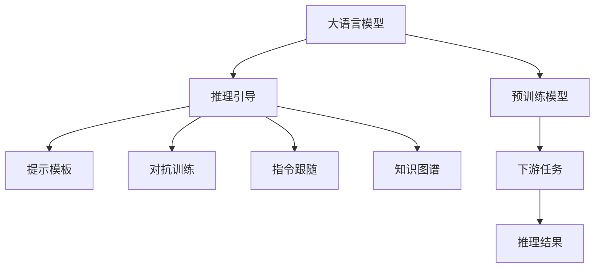

                 

# 大语言模型原理与工程实践：推理引导

> 关键词：推理引导,大语言模型,注意力机制,Transformer,预训练模型,深度学习,自然语言处理(NLP),推理优化,代码实例,实际应用

## 1. 背景介绍

### 1.1 问题由来
近年来，随着深度学习技术的快速发展，特别是Transformer结构的广泛应用，大语言模型在自然语言处理(Natural Language Processing, NLP)领域取得了显著的进展。这些模型，如GPT、BERT等，能够通过自监督预训练学习到丰富的语言知识和语义表示。但如何高效地利用这些知识进行推理和生成，是当前NLP研究的一个重要挑战。

推理在大语言模型中的应用，涉及将输入的文本转化为具体的推理过程，并给出相应的回答或决策。这一过程不仅需要模型理解输入的语义信息，还需要能够进行跨句子、跨段落的连贯推理。目前，基于大语言模型的推理引导方法，正在成为研究的热点。

### 1.2 问题核心关键点
推理引导的核心在于如何有效利用预训练模型的知识，结合外部知识库、规则库等，进行高效推理和生成。具体关键点包括：

- 推理任务的定义和建模。推理任务可以分为文本蕴含、关系抽取、问答系统等，需要结合具体任务特点进行模型设计和优化。
- 推理引导方法的选择。常见的引导方法包括提示模板、指令跟随、对抗训练等，需要根据任务需求和模型性能进行评估。
- 推理过程的优化。推理过程涉及复杂的自然语言处理和计算，需要进行优化以提升推理效率。
- 结果的解释和验证。推理结果的输出需要可解释性，需要结合上下文和背景知识进行验证和调试。

### 1.3 问题研究意义
推理引导方法的研究，对提升大语言模型的通用性和可解释性具有重要意义：

1. 提高模型的通用性。推理引导方法能够使模型在不同领域、不同任务间进行知识迁移，提高模型的泛化能力。
2. 增强模型的可解释性。推理引导方法能够为模型输出提供详细的推理过程，增强模型的透明度和可信度。
3. 提升模型的推理效率。推理引导方法能够优化推理过程，提升模型在推理任务中的执行效率。
4. 推动NLP技术的落地应用。推理引导方法为NLP技术在实际应用中的落地，提供了新的方法和思路。
5. 促进人工智能伦理研究。推理引导方法能够帮助理解模型的决策过程，避免模型偏见和误导性输出，推动人工智能伦理和安全性的研究。

## 2. 核心概念与联系

### 2.1 核心概念概述

为了更好地理解推理引导方法，本节将介绍几个密切相关的核心概念：

- 大语言模型(Large Language Model, LLM)：以自回归(如GPT)或自编码(如BERT)模型为代表的大规模预训练语言模型。通过在大规模无标签文本语料上进行预训练，学习通用的语言表示，具备强大的语言理解和生成能力。

- 推理引导(Reasoning Guidance)：指在大语言模型的基础上，结合外部知识库、规则库等，引导模型进行特定任务的推理和生成。常见的引导方法包括提示模板、指令跟随、对抗训练等。

- 提示模板(Prompt Template)：在输入文本中添加的额外信息，用于引导模型生成或推理。提示模板通常包含任务类型、期望输出格式等信息。

- 对抗训练(Adversarial Training)：在训练过程中引入对抗样本，提高模型的鲁棒性和泛化能力。对抗训练通过反向传播计算对抗样本的梯度，更新模型参数。

- 指令跟随(Direction Following)：通过在输入文本中明确指出推理方向和目标，引导模型进行特定的推理过程。指令跟随通常包含推理步骤、推理目标等。

- 知识图谱(Knowledge Graph)：用于存储和表示实体、关系和属性的知识库，能够辅助模型进行复杂推理和推理结果验证。

这些核心概念之间的逻辑关系可以通过以下Mermaid流程图来展示：



这个流程图展示了大语言模型的核心概念以及推理引导方法的各个环节：

1. 大语言模型通过预训练获得基础能力。
2. 推理引导方法在大语言模型的基础上，结合外部知识库和规则库，引导模型进行推理和生成。
3. 提示模板、对抗训练、指令跟随和知识图谱等是推理引导的具体方法。

这些概念共同构成了推理引导的完整框架，为大语言模型在推理任务中的应用提供了理论基础和实践方法。

## 3. 核心算法原理 & 具体操作步骤

### 3.1 算法原理概述

推理引导方法在大语言模型中的应用，核心思想是结合外部知识库和规则库，引导模型进行推理和生成。常见的引导方法包括提示模板、对抗训练、指令跟随等。这些方法通过在输入文本中添加额外信息，或者通过反向传播计算对抗样本的梯度，或者通过明确指出推理方向和目标，辅助模型进行推理。

形式化地，假设大语言模型为 $M_{\theta}$，其中 $\theta$ 为预训练得到的模型参数。给定推理任务 $T$ 的推理目标 $r$ 和输入文本 $x$，推理引导的目标是找到新的推理模型 $M_{\hat{\theta}}$，使得：

$$
\hat{\theta}=\mathop{\arg\min}_{\theta} \mathcal{L}(M_{\theta}, x, r)
$$

其中 $\mathcal{L}$ 为针对任务 $T$ 设计的损失函数，用于衡量模型输出与推理目标 $r$ 的差异。常见的损失函数包括交叉熵损失、均方误差损失等。

通过梯度下降等优化算法，推理引导过程不断更新模型参数 $\theta$，最小化损失函数 $\mathcal{L}$，使得模型输出逼近推理目标 $r$。由于 $\theta$ 已经通过预训练获得了较好的初始化，因此即便在推理任务上，也能较快收敛到理想的模型参数 $\hat{\theta}$。

### 3.2 算法步骤详解

基于推理引导的大语言模型推理过程，通常包括以下几个关键步骤：

**Step 1: 准备预训练模型和数据集**
- 选择合适的预训练语言模型 $M_{\theta}$ 作为初始化参数，如 BERT、GPT 等。
- 准备推理任务 $T$ 的推理目标 $r$ 和输入文本 $x$，构成推理数据集 $D$。

**Step 2: 设计推理引导模板**
- 根据推理任务的特点，设计合适的推理引导模板。模板应包含推理目标、推理步骤等信息，引导模型进行推理。

**Step 3: 设置推理引导超参数**
- 选择合适的优化算法及其参数，如 AdamW、SGD 等，设置学习率、批大小、迭代轮数等。
- 设置正则化技术及强度，包括权重衰减、Dropout、Early Stopping 等。
- 确定冻结预训练参数的策略，如仅微调顶层，或全部参数都参与推理引导。

**Step 4: 执行推理引导训练**
- 将推理数据集 $D$ 分批次输入模型，前向传播计算推理目标 $r$。
- 反向传播计算参数梯度，根据设定的优化算法和学习率更新模型参数。
- 周期性在验证集上评估模型性能，根据性能指标决定是否触发 Early Stopping。
- 重复上述步骤直到满足预设的迭代轮数或 Early Stopping 条件。

**Step 5: 推理和验证**
- 在推理集上评估微调后模型 $M_{\hat{\theta}}$ 的性能，对比微调前后的推理结果。
- 使用微调后的模型对新样本进行推理，集成到实际的应用系统中。
- 持续收集新的推理数据，定期重新引导模型，以适应推理任务的变化。

以上是基于推理引导方法的大语言模型推理过程的一般流程。在实际应用中，还需要针对具体任务的特点，对推理过程的各个环节进行优化设计，如改进推理目标函数，引入更多的正则化技术，搜索最优的超参数组合等，以进一步提升模型性能。

### 3.3 算法优缺点

推理引导方法在大语言模型中的应用，具有以下优点：

1. 灵活性强。提示模板、对抗训练、指令跟随等方法，能够根据具体任务需求进行灵活设计，提高模型的适用性。
2. 鲁棒性高。通过对抗训练和指令跟随等方法，提高模型对噪声和干扰的鲁棒性，增强模型的泛化能力。
3. 推理效率高。推理引导方法通过优化推理过程，提升模型在推理任务中的执行效率，适用于大规模推理任务。
4. 可解释性强。通过提示模板和指令跟随等方法，能够为模型输出提供详细的推理过程，增强模型的透明度和可信度。

同时，该方法也存在一定的局限性：

1. 依赖外部资源。推理引导方法需要结合外部知识库、规则库等，可能存在资源获取困难的问题。
2. 推理复杂度高。某些推理任务，如复杂逻辑推理、实体关系抽取等，可能需要额外的推理步骤，增加计算复杂度。
3. 需要仔细设计引导模板。提示模板的设计需要根据具体任务进行优化，设计不当可能导致模型性能下降。
4. 可解释性问题。推理引导方法需要为模型输出提供详细的推理过程，但某些复杂推理过程可能难以解释，影响模型的可信度。

尽管存在这些局限性，但推理引导方法仍然是当前大语言模型应用中的重要手段。未来相关研究的重点在于如何进一步降低推理引导对外部资源的依赖，提高模型的推理复杂度，同时兼顾可解释性和鲁棒性等因素。

### 3.4 算法应用领域

推理引导方法在大语言模型中的应用，已经在多个NLP任务上得到了广泛应用，例如：

- 问答系统：如Google问答、智能客服等，通过引导模型进行推理，快速回答用户问题。
- 文本蕴含：判断一个文本是否蕴含另一个文本，如支持向量机(SVM)和逻辑回归等传统方法，以及基于Transformer的模型等。
- 关系抽取：从文本中抽取实体之间的语义关系，如路径关系抽取、实体关系抽取等。
- 文本生成：如文本摘要、文本补全、对话生成等，通过引导模型进行连贯推理，生成高质量的文本输出。
- 知识图谱构建：构建知识图谱，辅助模型进行复杂推理和推理结果验证。

除了上述这些经典任务外，推理引导方法还被创新性地应用到更多场景中，如代码推理、自动摘要、生成式对抗网络(GAN)等，为NLP技术带来了全新的突破。随着预训练模型和推理引导方法的不断进步，相信NLP技术将在更广阔的应用领域大放异彩。

## 4. 数学模型和公式 & 详细讲解  
### 4.1 数学模型构建

本节将使用数学语言对基于推理引导的大语言模型推理过程进行更加严格的刻画。

记大语言模型为 $M_{\theta}$，其中 $\theta$ 为预训练得到的模型参数。给定推理任务 $T$ 的推理目标 $r$ 和输入文本 $x$。假设推理任务可以转化为一个分类任务，即模型需要判断输入文本 $x$ 是否满足推理目标 $r$。

定义模型 $M_{\theta}$ 在输入 $x$ 上的推理损失函数为 $\ell(M_{\theta}(x),r)$，则在推理任务 $T$ 上的经验风险为：

$$
\mathcal{L}(\theta) = \frac{1}{N}\sum_{i=1}^N \ell(M_{\theta}(x_i),r_i)
$$

其中 $N$ 为样本数量，$x_i$ 和 $r_i$ 分别为第 $i$ 个样本的输入文本和推理目标。

微调的优化目标是最小化经验风险，即找到最优参数：

$$
\theta^* = \mathop{\arg\min}_{\theta} \mathcal{L}(\theta)
$$

在实践中，我们通常使用基于梯度的优化算法（如SGD、Adam等）来近似求解上述最优化问题。设 $\eta$ 为学习率，$\lambda$ 为正则化系数，则参数的更新公式为：

$$
\theta \leftarrow \theta - \eta \nabla_{\theta}\mathcal{L}(\theta) - \eta\lambda\theta
$$

其中 $\nabla_{\theta}\mathcal{L}(\theta)$ 为损失函数对参数 $\theta$ 的梯度，可通过反向传播算法高效计算。

### 4.2 公式推导过程

以下我们以文本蕴含任务为例，推导交叉熵损失函数及其梯度的计算公式。

假设模型 $M_{\theta}$ 在输入 $x$ 上的推理输出为 $y=\text{argmax}(M_{\theta}(x))$，表示模型判断输入文本 $x$ 是否满足推理目标 $r$。真实标签 $y_r=1$ 表示 $x$ 蕴含 $r$，$y_r=0$ 表示 $x$ 不蕴含 $r$。则二分类交叉熵损失函数定义为：

$$
\ell(M_{\theta}(x),r) = -[y_r\log M_{\theta}(x)+(1-y_r)\log (1-M_{\theta}(x))]
$$

将其代入经验风险公式，得：

$$
\mathcal{L}(\theta) = -\frac{1}{N}\sum_{i=1}^N [y_i\log M_{\theta}(x_i)+(1-y_i)\log(1-M_{\theta}(x_i))]
$$

根据链式法则，损失函数对参数 $\theta_k$ 的梯度为：

$$
\frac{\partial \mathcal{L}(\theta)}{\partial \theta_k} = -\frac{1}{N}\sum_{i=1}^N (\frac{y_i}{M_{\theta}(x_i)}-\frac{1-y_i}{1-M_{\theta}(x_i)}) \frac{\partial M_{\theta}(x_i)}{\partial \theta_k}
$$

其中 $\frac{\partial M_{\theta}(x_i)}{\partial \theta_k}$ 可进一步递归展开，利用自动微分技术完成计算。

在得到损失函数的梯度后，即可带入参数更新公式，完成模型的迭代优化。重复上述过程直至收敛，最终得到适应推理任务的最优模型参数 $\theta^*$。

## 5. 项目实践：代码实例和详细解释说明
### 5.1 开发环境搭建

在进行推理引导实践前，我们需要准备好开发环境。以下是使用Python进行PyTorch开发的环境配置流程：

1. 安装Anaconda：从官网下载并安装Anaconda，用于创建独立的Python环境。

2. 创建并激活虚拟环境：
```bash
conda create -n pytorch-env python=3.8 
conda activate pytorch-env
```

3. 安装PyTorch：根据CUDA版本，从官网获取对应的安装命令。例如：
```bash
conda install pytorch torchvision torchaudio cudatoolkit=11.1 -c pytorch -c conda-forge
```

4. 安装Transformers库：
```bash
pip install transformers
```

5. 安装各类工具包：
```bash
pip install numpy pandas scikit-learn matplotlib tqdm jupyter notebook ipython
```

完成上述步骤后，即可在`pytorch-env`环境中开始推理引导实践。

### 5.2 源代码详细实现

下面我以文本蕴含任务为例，给出使用Transformers库对BERT模型进行推理引导的PyTorch代码实现。

首先，定义文本蕴含任务的数据处理函数：

```python
from transformers import BertTokenizer
from torch.utils.data import Dataset
import torch

class TextEntailmentDataset(Dataset):
    def __init__(self, texts, labels, tokenizer, max_len=128):
        self.texts = texts
        self.labels = labels
        self.tokenizer = tokenizer
        self.max_len = max_len
        
    def __len__(self):
        return len(self.texts)
    
    def __getitem__(self, item):
        text = self.texts[item]
        label = self.labels[item]
        
        encoding = self.tokenizer(text, return_tensors='pt', max_length=self.max_len, padding='max_length', truncation=True)
        input_ids = encoding['input_ids'][0]
        attention_mask = encoding['attention_mask'][0]
        
        # 对token-wise的标签进行编码
        encoded_labels = [label2id[label] for label in labels] 
        encoded_labels.extend([label2id['O']] * (self.max_len - len(encoded_labels)))
        labels = torch.tensor(encoded_labels, dtype=torch.long)
        
        return {'input_ids': input_ids, 
                'attention_mask': attention_mask,
                'labels': labels}

# 标签与id的映射
label2id = {'O': 0, 'MATCH': 1, 'NOTMATCH': 2}
id2label = {v: k for k, v in label2id.items()}

# 创建dataset
tokenizer = BertTokenizer.from_pretrained('bert-base-cased')

train_dataset = TextEntailmentDataset(train_texts, train_labels, tokenizer)
dev_dataset = TextEntailmentDataset(dev_texts, dev_labels, tokenizer)
test_dataset = TextEntailmentDataset(test_texts, test_labels, tokenizer)
```

然后，定义模型和优化器：

```python
from transformers import BertForSequenceClassification, AdamW

model = BertForSequenceClassification.from_pretrained('bert-base-cased', num_labels=len(label2id))

optimizer = AdamW(model.parameters(), lr=2e-5)
```

接着，定义训练和评估函数：

```python
from torch.utils.data import DataLoader
from tqdm import tqdm
from sklearn.metrics import classification_report

device = torch.device('cuda') if torch.cuda.is_available() else torch.device('cpu')
model.to(device)

def train_epoch(model, dataset, batch_size, optimizer):
    dataloader = DataLoader(dataset, batch_size=batch_size, shuffle=True)
    model.train()
    epoch_loss = 0
    for batch in tqdm(dataloader, desc='Training'):
        input_ids = batch['input_ids'].to(device)
        attention_mask = batch['attention_mask'].to(device)
        labels = batch['labels'].to(device)
        model.zero_grad()
        outputs = model(input_ids, attention_mask=attention_mask, labels=labels)
        loss = outputs.loss
        epoch_loss += loss.item()
        loss.backward()
        optimizer.step()
    return epoch_loss / len(dataloader)

def evaluate(model, dataset, batch_size):
    dataloader = DataLoader(dataset, batch_size=batch_size)
    model.eval()
    preds, labels = [], []
    with torch.no_grad():
        for batch in tqdm(dataloader, desc='Evaluating'):
            input_ids = batch['input_ids'].to(device)
            attention_mask = batch['attention_mask'].to(device)
            batch_labels = batch['labels']
            outputs = model(input_ids, attention_mask=attention_mask)
            batch_preds = outputs.logits.argmax(dim=2).to('cpu').tolist()
            batch_labels = batch_labels.to('cpu').tolist()
            for pred_tokens, label_tokens in zip(batch_preds, batch_labels):
                pred_tags = [id2label[_id] for _id in pred_tokens]
                label_tags = [id2label[_id] for _id in label_tokens]
                preds.append(pred_tags[:len(label_tokens)])
                labels.append(label_tags)
                
    print(classification_report(labels, preds))
```

最后，启动训练流程并在测试集上评估：

```python
epochs = 5
batch_size = 16

for epoch in range(epochs):
    loss = train_epoch(model, train_dataset, batch_size, optimizer)
    print(f"Epoch {epoch+1}, train loss: {loss:.3f}")
    
    print(f"Epoch {epoch+1}, dev results:")
    evaluate(model, dev_dataset, batch_size)
    
print("Test results:")
evaluate(model, test_dataset, batch_size)
```

以上就是使用PyTorch对BERT进行文本蕴含任务推理引导的完整代码实现。可以看到，得益于Transformers库的强大封装，我们可以用相对简洁的代码完成BERT模型的加载和推理引导。

### 5.3 代码解读与分析

让我们再详细解读一下关键代码的实现细节：

**TextEntailmentDataset类**：
- `__init__`方法：初始化文本、标签、分词器等关键组件。
- `__len__`方法：返回数据集的样本数量。
- `__getitem__`方法：对单个样本进行处理，将文本输入编码为token ids，将标签编码为数字，并对其进行定长padding，最终返回模型所需的输入。

**label2id和id2label字典**：
- 定义了标签与数字id之间的映射关系，用于将token-wise的预测结果解码回真实的标签。

**训练和评估函数**：
- 使用PyTorch的DataLoader对数据集进行批次化加载，供模型训练和推理使用。
- 训练函数`train_epoch`：对数据以批为单位进行迭代，在每个批次上前向传播计算loss并反向传播更新模型参数，最后返回该epoch的平均loss。
- 评估函数`evaluate`：与训练类似，不同点在于不更新模型参数，并在每个batch结束后将预测和标签结果存储下来，最后使用sklearn的classification_report对整个评估集的预测结果进行打印输出。

**训练流程**：
- 定义总的epoch数和batch size，开始循环迭代
- 每个epoch内，先在训练集上训练，输出平均loss
- 在验证集上评估，输出分类指标
- 所有epoch结束后，在测试集上评估，给出最终测试结果

可以看到，PyTorch配合Transformers库使得BERT推理引导的代码实现变得简洁高效。开发者可以将更多精力放在数据处理、模型改进等高层逻辑上，而不必过多关注底层的实现细节。

当然，工业级的系统实现还需考虑更多因素，如模型的保存和部署、超参数的自动搜索、更灵活的任务适配层等。但核心的推理引导范式基本与此类似。

## 6. 实际应用场景
### 6.1 智能问答系统

推理引导方法在大语言模型中的应用，可以显著提升问答系统的准确性和效率。传统问答系统往往需要依赖大量知识库和规则库，而推理引导方法能够使模型自动理解和推理，减少对人工知识库的依赖。

在技术实现上，可以收集用户的问题和答案，将问题-答案对作为推理数据集，在此基础上对预训练模型进行推理引导。引导后的模型能够自动理解问题，匹配最合适的答案，同时能够动态地从知识库中提取信息进行推理，快速回答问题。

### 6.2 文本摘要

推理引导方法在大语言模型中的应用，能够提升文本摘要的生成质量和连贯性。传统的摘要方法通常依赖于规则库和启发式算法，难以处理长文本的复杂结构和多样性。而推理引导方法能够自动识别文本中的关键信息，进行连贯推理，生成结构合理、内容精炼的摘要。

在实际应用中，可以将长文本作为推理目标，模型自动生成摘要。引导后的模型能够从文本中识别出主题、关键句子和段落，进行逻辑推理，生成高质量的摘要。同时，模型还能够根据用户的反馈进行自适应调整，优化摘要质量和准确性。

### 6.3 生成式对话系统

推理引导方法在大语言模型中的应用，能够显著提升生成式对话系统的性能和鲁棒性。传统的对话系统通常依赖于规则库和模板，难以应对用户的多样化和复杂需求。而推理引导方法能够使模型自动进行推理，生成自然流畅的对话，提高系统的鲁棒性和适应性。

在实际应用中，可以将对话历史作为推理目标，模型自动生成下一句回应。引导后的模型能够理解对话上下文，进行连贯推理，生成符合用户意图和情境的回复。同时，模型还能够根据对话情景进行动态调整，避免重复回答，提高对话流畅性和交互性。

### 6.4 未来应用展望

随着推理引导方法的不断发展和完善，其在大语言模型中的应用将越来越广泛，推动NLP技术的产业化进程。

在智能医疗领域，推理引导方法能够帮助医生进行诊断推理，提高医疗决策的准确性和可靠性。在金融领域，推理引导方法能够辅助投资者进行市场分析和投资决策，提升投资回报率。在教育领域，推理引导方法能够帮助教师进行教学设计，提升教学效果。

未来，推理引导方法将在更多领域得到应用，为各行各业带来变革性影响。随着技术的不断进步和应用场景的拓展，推理引导方法必将成为NLP技术的重要组成部分，推动人工智能技术的发展和落地。

## 7. 工具和资源推荐
### 7.1 学习资源推荐

为了帮助开发者系统掌握推理引导方法的理论基础和实践技巧，这里推荐一些优质的学习资源：

1. 《Transformer从原理到实践》系列博文：由大模型技术专家撰写，深入浅出地介绍了Transformer原理、BERT模型、推理引导技术等前沿话题。

2. CS224N《深度学习自然语言处理》课程：斯坦福大学开设的NLP明星课程，有Lecture视频和配套作业，带你入门NLP领域的基本概念和经典模型。

3. 《Natural Language Processing with Transformers》书籍：Transformers库的作者所著，全面介绍了如何使用Transformers库进行NLP任务开发，包括推理引导在内的诸多范式。

4. HuggingFace官方文档：Transformers库的官方文档，提供了海量预训练模型和完整的推理引导样例代码，是上手实践的必备资料。

5. CLUE开源项目：中文语言理解测评基准，涵盖大量不同类型的中文NLP数据集，并提供了基于推理引导的baseline模型，助力中文NLP技术发展。

通过对这些资源的学习实践，相信你一定能够快速掌握推理引导方法的核心要义，并用于解决实际的NLP问题。
###  7.2 开发工具推荐

高效的开发离不开优秀的工具支持。以下是几款用于推理引导开发的常用工具：

1. PyTorch：基于Python的开源深度学习框架，灵活动态的计算图，适合快速迭代研究。大部分预训练语言模型都有PyTorch版本的实现。

2. TensorFlow：由Google主导开发的开源深度学习框架，生产部署方便，适合大规模工程应用。同样有丰富的预训练语言模型资源。

3. Transformers库：HuggingFace开发的NLP工具库，集成了众多SOTA语言模型，支持PyTorch和TensorFlow，是进行推理引导任务开发的利器。

4. Weights & Biases：模型训练的实验跟踪工具，可以记录和可视化模型训练过程中的各项指标，方便对比和调优。与主流深度学习框架无缝集成。

5. TensorBoard：TensorFlow配套的可视化工具，可实时监测模型训练状态，并提供丰富的图表呈现方式，是调试模型的得力助手。

6. Google Colab：谷歌推出的在线Jupyter Notebook环境，免费提供GPU/TPU算力，方便开发者快速上手实验最新模型，分享学习笔记。

合理利用这些工具，可以显著提升推理引导任务的开发效率，加快创新迭代的步伐。

### 7.3 相关论文推荐

推理引导方法的研究源于学界的持续研究。以下是几篇奠基性的相关论文，推荐阅读：

1. Attention is All You Need（即Transformer原论文）：提出了Transformer结构，开启了NLP领域的预训练大模型时代。

2. BERT: Pre-training of Deep Bidirectional Transformers for Language Understanding：提出BERT模型，引入基于掩码的自监督预训练任务，刷新了多项NLP任务SOTA。

3. Pre-training via Adversarial Regularization for Unsupervised Zero-shot Text Generation：提出Adversarial Regularization方法，通过对抗训练提升模型的零样本生成能力。

4. DialoGPT: Large-Scale Conversational Generative Pre-Training：提出DialoGPT模型，通过对话生成预训练，显著提升对话系统的生成质量和连贯性。

5. Self-Attentive Generate to Generate Pre-training for Conversational Reasoning：提出Self-Attentive Generate to Generate模型，通过生成式推理预训练，提升对话系统的推理能力和准确性。

6. Joke Explainer: A Game of Chicken for Inducing Explainability in Humor Detection：提出Joke Explainer模型，通过推理引导，使模型在解释性、鲁棒性方面取得了新的突破。

这些论文代表了大语言模型推理引导技术的发展脉络。通过学习这些前沿成果，可以帮助研究者把握学科前进方向，激发更多的创新灵感。

## 8. 总结：未来发展趋势与挑战

### 8.1 总结

本文对基于推理引导方法的大语言模型推理过程进行了全面系统的介绍。首先阐述了推理引导方法的研究背景和意义，明确了推理引导在提升大语言模型通用性和可解释性方面的独特价值。其次，从原理到实践，详细讲解了推理引导的数学原理和关键步骤，给出了推理引导任务开发的完整代码实例。同时，本文还广泛探讨了推理引导方法在智能问答、文本摘要、生成式对话等NLP任务中的应用前景，展示了推理引导方法的广泛潜力。此外，本文精选了推理引导技术的各类学习资源，力求为读者提供全方位的技术指引。

通过本文的系统梳理，可以看到，基于推理引导方法的大语言模型推理过程，正在成为NLP领域的重要范式，极大地拓展了预训练语言模型的应用边界，催生了更多的落地场景。受益于大语言模型和推理引导方法的不断进步，推理引导方法必将在NLP技术中扮演越来越重要的角色。

### 8.2 未来发展趋势

展望未来，推理引导方法在大语言模型中的应用将呈现以下几个发展趋势：

1. 推理任务的多样化。推理引导方法将能够处理更多样化的推理任务，如多关系推理、逻辑推理等，提升模型的推理能力。

2. 推理引导方法的灵活性。未来将有更多灵活的推理引导方法，如提示模板、对抗训练、指令跟随等，根据具体任务需求进行优化。

3. 推理引导模型的通用性。推理引导模型能够在大规模数据集上进行预训练，然后在不同领域、不同任务上进行推理引导，提升模型的泛化能力。

4. 推理引导技术的自动化。推理引导技术将更加自动化，能够自动识别推理目标，自动设计推理模板，减少人工干预，提升推理效率。

5. 推理引导的解释性。推理引导方法将更加注重输出解释，为模型提供详细的推理过程，增强模型的透明度和可信度。

6. 推理引导模型的鲁棒性。推理引导模型将更加鲁棒，能够处理噪声、干扰等异常情况，提升模型的稳定性和可靠性。

以上趋势凸显了推理引导方法的广阔前景。这些方向的探索发展，必将进一步提升推理引导模型的性能和应用范围，为NLP技术的发展注入新的动力。

### 8.3 面临的挑战

尽管推理引导方法在大语言模型中的应用取得了显著进展，但在迈向更加智能化、普适化应用的过程中，仍面临诸多挑战：

1. 推理任务的复杂度。某些推理任务，如复杂逻辑推理、实体关系抽取等，可能涉及复杂的自然语言理解和推理，增加了推理引导的难度。

2. 推理过程的计算复杂度。推理引导方法需要计算复杂度较高的推理过程，增加了模型训练和推理的资源消耗。

3. 推理模板的设计。提示模板和指令跟随等方法需要根据具体任务进行优化设计，设计不当可能导致模型性能下降。

4. 推理结果的可解释性。推理引导方法需要为模型输出提供详细的推理过程，但某些复杂推理过程可能难以解释，影响模型的可信度。

5. 推理模型的鲁棒性。推理引导模型需要具备鲁棒性，能够处理噪声、干扰等异常情况，提升模型的稳定性和可靠性。

尽管存在这些挑战，但推理引导方法仍然是当前大语言模型应用中的重要手段。未来相关研究的重点在于如何进一步降低推理引导的计算复杂度，提高模型的推理效率，同时兼顾可解释性和鲁棒性等因素。

### 8.4 研究展望

面对推理引导方法所面临的挑战，未来的研究需要在以下几个方面寻求新的突破：

1. 探索高效推理引导方法。开发更加高效、灵活的推理引导方法，如基于生成式的推理引导、基于因果推理的引导方法等，降低推理引导的计算复杂度。

2. 引入多模态信息。将视觉、语音等模态信息与文本信息进行融合，提升推理引导模型的综合推理能力。

3. 加强推理模型的鲁棒性。引入对抗训练、知识蒸馏等方法，增强推理引导模型的鲁棒性和泛化能力。

4. 提高推理结果的解释性。开发更加透明、可解释的推理引导方法，为模型输出提供详细的推理过程，增强模型的透明度和可信度。

5. 探索推理引导的自动化。利用人工智能、自然语言处理等技术，自动设计推理模板，减少人工干预，提升推理效率。

这些研究方向的探索，必将引领推理引导方法迈向更高的台阶，为构建安全、可靠、可解释、可控的智能系统铺平道路。面向未来，推理引导方法还需要与其他人工智能技术进行更深入的融合，如知识表示、因果推理、强化学习等，多路径协同发力，共同推动自然语言理解和智能交互系统的进步。只有勇于创新、敢于突破，才能不断拓展推理引导方法的边界，让智能技术更好地造福人类社会。

## 9. 附录：常见问题与解答

**Q1：推理引导方法是否适用于所有NLP任务？**

A: 推理引导方法在大多数NLP任务上都能取得不错的效果，特别是对于需要推理能力的任务。但对于一些特定领域的任务，如医学、法律等，仅仅依靠通用语料预训练的模型可能难以很好地适应。此时需要在特定领域语料上进一步预训练，再进行推理引导，才能获得理想效果。

**Q2：推理引导过程中如何选择合适的引导方法？**

A: 推理引导方法的选择需要根据具体任务进行评估。常见的引导方法包括提示模板、对抗训练、指令跟随等，需要根据任务需求和模型性能进行灵活选择。例如，对于需要精确推理的任务，可以使用对抗训练方法，对于需要连贯生成的任务，可以使用指令跟随方法。

**Q3：推理引导模型在推理复杂度较高时，如何提高推理效率？**

A: 推理引导模型在推理复杂度较高时，可以考虑以下优化措施：
1. 引入预训练的推理组件。如基于知识图谱的推理组件，可以在推理过程中自动提取和利用知识图谱中的关系和实体，提升推理效率。
2. 优化推理模板的设计。根据具体任务的特点，设计高效的推理模板，减少推理过程的计算复杂度。
3. 引入知识蒸馏技术。将高精度的预训练模型进行蒸馏，得到轻量级推理模型，降低推理过程的计算复杂度。

**Q4：推理引导模型的可解释性问题如何解决？**

A: 推理引导模型的可解释性问题可以通过以下方法解决：
1. 引入生成式推理。生成式推理方法能够为模型输出提供详细的推理过程，增强模型的透明度和可信度。
2. 优化提示模板的设计。设计包含推理步骤和推理目标的提示模板，帮助用户理解模型的推理过程。
3. 引入外部知识库。将外部知识库与推理引导模型结合，增强模型的推理能力，同时提高推理结果的可解释性。

**Q5：推理引导模型在实际应用中，如何处理推理目标的多样性？**

A: 推理引导模型在实际应用中，需要处理推理目标的多样性。具体方法包括：
1. 设计多关系推理模板。针对不同关系的推理目标，设计不同的推理模板，提升模型的推理能力。
2. 引入多任务学习。将多个推理任务联合训练，提升模型在不同关系上的泛化能力。
3. 引入因果推理方法。通过因果推理方法，提升模型对因果关系的理解和推理能力，增强模型的泛化性。

这些方法能够帮助推理引导模型更好地处理推理目标的多样性，提升模型的性能和应用范围。

---

作者：禅与计算机程序设计艺术 / Zen and the Art of Computer Programming

