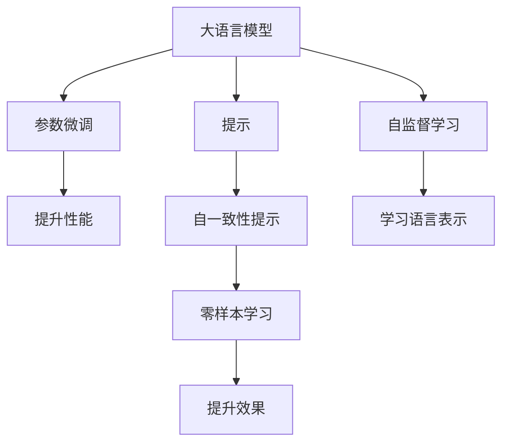

                 

## 1. 背景介绍

大语言模型（Large Language Models, LLMs）作为人工智能领域的重大突破，已经在自然语言处理（NLP）和计算机视觉（CV）等众多领域取得了显著成果。然而，尽管这些模型在通用性能上取得了巨大进步，但对于特定领域或任务，仍需要进一步的微调以实现更好的表现。

传统的微调方法主要包括参数微调（Fine-Tuning）和自监督学习（Self-Supervised Learning）。然而，这些方法往往依赖于大量的标注数据，而在现实世界中，标注数据的获取成本昂贵且耗时。近年来，越来越多的研究开始探索如何通过引入新的提示（Prompt）来提升模型的性能，这种方法被称为**自我一致性提示（Self-consistent Prompting）**。

自我一致性提示通过在输入数据中添加一些提示信息，引导模型输出符合预期结果，从而在无需标注数据的情况下提升模型性能。这种方法在诸如问答系统、对话生成等NLP任务中已经显示出显著的效果。

## 2. 核心概念与联系

### 2.1 核心概念概述

为更好地理解自我一致性提示，本节将介绍几个相关核心概念：

- **大语言模型**：以自回归（如GPT）或自编码（如BERT）模型为代表的大规模预训练语言模型。通过在海量无标签文本数据上进行预训练，学习通用的语言知识。

- **提示（Prompt）**：在输入数据中添加的人工构造的文本片段，旨在引导模型按照特定的方式理解和处理输入数据。

- **自我一致性提示**：通过精心设计的提示，使得大语言模型能够自我一致地处理输入数据，从而在不进行参数微调的情况下提升模型性能。

- **参数微调**：通过在有标签数据上训练模型，调整模型的参数以适应特定任务。

- **自监督学习**：利用无标签数据，通过设计自监督任务训练模型，学习语言的潜在表示。

- **自动编码器**：一种深度学习模型，通过学习数据的编码和解码过程，实现对数据的压缩和重构。

这些概念之间的联系可以通过以下Mermaid流程图来展示：



这个流程图展示了这些概念之间的联系：

1. 大语言模型通过预训练学习语言知识。
2. 提示通过引导模型处理输入数据，提升模型性能。
3. 参数微调和自监督学习通过有标签和无标签数据训练模型。
4. 自一致性提示通过无需标注的提示提升模型效果。

## 3. 核心算法原理 & 具体操作步骤

### 3.1 算法原理概述

自我一致性提示的原理在于利用提示信息引导模型进行预测。具体来说，给定一段输入数据 $x$ 和一个提示 $p$，模型会先根据提示 $p$ 生成一段新的文本 $y$，然后基于输入 $x$ 和生成的文本 $y$ 输出预测结果。这个过程中，提示 $p$ 起到了关键的引导作用。

自我一致性提示的目标是找到一组最优的提示 $p$，使得模型输出的预测结果 $y$ 尽可能符合预期的结果 $y^*$。这通常通过优化目标函数来实现，目标函数可以是预测结果与预期结果之间的差异最小化。

### 3.2 算法步骤详解

自我一致性提示的算法步骤一般包括以下几个关键步骤：

1. **选择提示**：根据任务特点，设计适合的提示 $p$。例如，在问答任务中，可以设计提示为“请回答以下问题：”。

2. **模型输入**：将提示 $p$ 与输入数据 $x$ 组合，生成新的文本 $x \oplus p$，输入到模型中进行预测。

3. **预测输出**：模型基于输入 $x \oplus p$ 生成预测结果 $y$。

4. **优化提示**：通过优化目标函数，找到使得 $y$ 与预期结果 $y^*$ 最接近的提示 $p$。

### 3.3 算法优缺点

自我一致性提示的优点包括：

1. **无需标注数据**：自我一致性提示不需要标注数据，可以大大降低数据获取成本。
2. **提升模型效果**：通过精心设计的提示，可以在零样本或少样本情况下提升模型性能。
3. **灵活性高**：提示可以根据任务特点进行设计，具有较高的灵活性。

缺点包括：

1. **需要优化提示**：设计好的提示不一定能得到最佳效果，需要不断优化。
2. **提示质量依赖于设计**：提示质量对模型效果有很大影响，设计不当可能导致性能下降。
3. **可能存在偏差**：由于提示的设计具有主观性，可能会引入一定的偏差，影响模型性能。

### 3.4 算法应用领域

自我一致性提示广泛应用于各种NLP任务，例如：

- **问答系统**：通过设计合适的提示，使模型能够回答特定问题。
- **对话生成**：通过设计适当的提示，使模型能够生成符合上下文的回答。
- **文本摘要**：通过设计提示，使模型能够生成摘要。
- **文本生成**：通过设计提示，使模型生成特定风格的文本。
- **机器翻译**：通过设计提示，使模型能够翻译特定类型的文本。
- **文本分类**：通过设计提示，使模型能够对文本进行分类。

## 4. 数学模型和公式 & 详细讲解  
### 4.1 数学模型构建

假设有一个文本生成模型 $M_{\theta}$，其中 $\theta$ 为模型参数。给定输入数据 $x$ 和提示 $p$，模型输出的文本为 $y$。模型的目标是最小化预测结果 $y$ 与预期结果 $y^*$ 之间的差异。

目标函数可以定义为：

$$
\mathcal{L}(p, x; \theta) = \|y - y^*\|
$$

其中 $\| \cdot \|$ 表示某种距离度量，例如均方误差或交叉熵。

### 4.2 公式推导过程

假设模型 $M_{\theta}$ 基于输入 $x$ 和提示 $p$ 生成的文本 $y$ 可以表示为：

$$
y = M_{\theta}(x \oplus p)
$$

目标函数 $\mathcal{L}(p, x; \theta)$ 可以表示为：

$$
\mathcal{L}(p, x; \theta) = \|M_{\theta}(x \oplus p) - y^*\|
$$

对提示 $p$ 进行优化，使其最小化目标函数 $\mathcal{L}(p, x; \theta)$。这个问题可以通过梯度下降等优化算法来解决。

具体地，假设目标函数可以表示为：

$$
\mathcal{L}(p, x; \theta) = \sum_{i=1}^N (M_{\theta}(x \oplus p)_i - y_i)^2
$$

其中 $y_i$ 为输入 $x$ 的真实结果，$M_{\theta}(x \oplus p)_i$ 为模型基于输入 $x \oplus p$ 生成的文本 $y$ 的第 $i$ 个字或词。

对提示 $p$ 进行优化，目标最小化损失函数 $\mathcal{L}(p, x; \theta)$。具体地，假设优化过程如下：

1. 对提示 $p$ 进行初始化，例如 $p_0 = \text{random}(p)$。
2. 在每个迭代步骤 $t$，计算目标函数 $\mathcal{L}(p, x; \theta)$。
3. 计算目标函数对提示 $p$ 的梯度 $\frac{\partial \mathcal{L}}{\partial p}$。
4. 根据梯度 $\frac{\partial \mathcal{L}}{\partial p}$ 和提示 $p$ 的初始值 $p_t$，更新提示 $p_{t+1} = p_t - \eta \frac{\partial \mathcal{L}}{\partial p}$。
5. 重复步骤 2-4，直到目标函数收敛。

其中 $\eta$ 为学习率。

### 4.3 案例分析与讲解

以问答系统为例，说明如何通过自我一致性提示提升模型性能。

假设有一个问答系统，需要回答关于历史事件的问题。在输入数据中，一个样本的表示为 $(x, y)$，其中 $x$ 为事件描述，$y$ 为事件答案。模型基于输入 $x$ 和提示 $p$ 生成答案 $y'$，目标是最小化预测结果 $y'$ 与真实结果 $y$ 之间的差异。

提示 $p$ 可以设计为：“根据以下描述，请回答”。在优化过程中，通过不断地调整提示 $p$，使得 $y'$ 逐渐接近 $y$。

## 5. 项目实践：代码实例和详细解释说明

### 5.1 开发环境搭建

在进行自我一致性提示的实践前，需要准备好开发环境。以下是使用Python进行PyTorch开发的环境配置流程：

1. 安装Anaconda：从官网下载并安装Anaconda，用于创建独立的Python环境。

2. 创建并激活虚拟环境：
```bash
conda create -n pytorch-env python=3.8 
conda activate pytorch-env
```

3. 安装PyTorch：根据CUDA版本，从官网获取对应的安装命令。例如：
```bash
conda install pytorch torchvision torchaudio cudatoolkit=11.1 -c pytorch -c conda-forge
```

4. 安装Transformers库：
```bash
pip install transformers
```

5. 安装各类工具包：
```bash
pip install numpy pandas scikit-learn matplotlib tqdm jupyter notebook ipython
```

完成上述步骤后，即可在`pytorch-env`环境中开始自我一致性提示的实践。

### 5.2 源代码详细实现

下面是使用PyTorch实现问答系统自我一致性提示的代码示例：

```python
import torch
import torch.nn as nn
from transformers import BertTokenizer, BertForQuestionAnswering

# 初始化BERT模型和tokenizer
model = BertForQuestionAnswering.from_pretrained('bert-base-uncased')
tokenizer = BertTokenizer.from_pretrained('bert-base-uncased')

# 定义提示
question = "根据以下描述，请回答问题"

# 定义目标答案
answer = "这是一段历史事件的答案"

# 将提示和目标答案编码为token ids
input_ids = tokenizer(question, return_tensors='pt')['input_ids']
target_ids = tokenizer(answer, return_tensors='pt')['input_ids']

# 将目标答案转换为tensor
target_ids = torch.tensor(target_ids, dtype=torch.long)

# 训练过程
optimizer = torch.optim.Adam(model.parameters(), lr=0.001)
for epoch in range(100):
    # 生成预测答案
    logits = model(input_ids)[0]
    loss = nn.CrossEntropyLoss()(logits, target_ids)
    optimizer.zero_grad()
    loss.backward()
    optimizer.step()

    # 输出每轮的损失
    print(f"Epoch {epoch+1}, loss: {loss.item()}")

print("训练完成！")
```

在这个代码中，我们首先使用BERT模型和tokenizer，定义了一个简单的提示和目标答案。然后，将提示和目标答案编码为token ids，并使用交叉熵损失函数进行训练。在训练过程中，我们逐步更新模型的参数，使得预测答案尽可能接近目标答案。

### 5.3 代码解读与分析

以下是代码中的关键步骤的解读：

1. **模型初始化**：我们使用BertForQuestionAnswering类初始化了一个BERT模型。这个模型用于处理问答任务，可以接受问题和上下文，输出问题的答案。

2. **提示和目标答案编码**：我们使用tokenizer将提示和目标答案转换为token ids。在编码时，我们使用BertTokenizer类，它能够自动处理分词和特殊符号。

3. **损失函数和优化器**：我们使用交叉熵损失函数计算预测答案和目标答案之间的差异。优化器我们使用Adam，它是一种自适应学习率的优化器，可以自动调整学习率，以适应不同的任务。

4. **训练循环**：在训练循环中，我们首先生成预测答案，然后计算损失，接着使用优化器更新模型参数，最后输出每轮的损失。

5. **训练结束**：在训练完成后，我们输出一个简单的消息，表示训练已经完成。

## 6. 实际应用场景

### 6.1 智能客服系统

基于大语言模型的自我一致性提示可以广泛应用于智能客服系统的构建。传统客服往往需要配备大量人力，高峰期响应缓慢，且一致性和专业性难以保证。而使用自我一致性提示的对话模型，可以7x24小时不间断服务，快速响应客户咨询，用自然流畅的语言解答各类常见问题。

在技术实现上，可以收集企业内部的历史客服对话记录，将问题和最佳答复构建成监督数据，在此基础上对预训练对话模型进行自我一致性提示。自我一致性提示后的对话模型能够自动理解用户意图，匹配最合适的答案模板进行回复。对于客户提出的新问题，还可以接入检索系统实时搜索相关内容，动态组织生成回答。如此构建的智能客服系统，能大幅提升客户咨询体验和问题解决效率。

### 6.2 金融舆情监测

金融机构需要实时监测市场舆论动向，以便及时应对负面信息传播，规避金融风险。传统的人工监测方式成本高、效率低，难以应对网络时代海量信息爆发的挑战。基于大语言模型自我一致性提示的文本分类和情感分析技术，为金融舆情监测提供了新的解决方案。

具体而言，可以收集金融领域相关的新闻、报道、评论等文本数据，并对其进行主题标注和情感标注。在此基础上对预训练语言模型进行自我一致性提示，使其能够自动判断文本属于何种主题，情感倾向是正面、中性还是负面。将自我一致性提示后的模型应用到实时抓取的网络文本数据，就能够自动监测不同主题下的情感变化趋势，一旦发现负面信息激增等异常情况，系统便会自动预警，帮助金融机构快速应对潜在风险。

### 6.3 个性化推荐系统

当前的推荐系统往往只依赖用户的历史行为数据进行物品推荐，无法深入理解用户的真实兴趣偏好。基于大语言模型自我一致性提示的个性化推荐系统可以更好地挖掘用户行为背后的语义信息，从而提供更精准、多样的推荐内容。

在实践中，可以收集用户浏览、点击、评论、分享等行为数据，提取和用户交互的物品标题、描述、标签等文本内容。将文本内容作为模型输入，用户的后续行为（如是否点击、购买等）作为监督信号，在此基础上自我一致性提示预训练语言模型。自我一致性提示后的模型能够从文本内容中准确把握用户的兴趣点。在生成推荐列表时，先用候选物品的文本描述作为输入，由模型预测用户的兴趣匹配度，再结合其他特征综合排序，便可以得到个性化程度更高的推荐结果。

### 6.4 未来应用展望

随着大语言模型和自我一致性提示技术的不断发展，基于自我一致性提示的微调方法将呈现以下几个发展趋势：

1. **模型规模持续增大**：随着算力成本的下降和数据规模的扩张，预训练语言模型的参数量还将持续增长。超大规模语言模型蕴含的丰富语言知识，有望支撑更加复杂多变的下游任务自我一致性提示。

2. **自我一致性提示方法多样化**：除了简单的文本提示外，未来会涌现更多自我一致性提示方法，如上下文相关提示、多轮对话提示等，以更好地引导模型输出。

3. **持续学习成为常态**：随着数据分布的不断变化，自我一致性提示模型也需要持续学习新知识以保持性能。如何在不遗忘原有知识的同时，高效吸收新样本信息，将成为重要的研究课题。

4. **标注样本需求降低**：受启发于提示学习（Prompt-based Learning）的思路，未来的自我一致性提示方法将更好地利用大模型的语言理解能力，通过更加巧妙的任务描述，在更少的标注样本上也能实现理想的自我一致性提示效果。

5. **多模态自我一致性提示崛起**：当前的自我一致性提示主要聚焦于纯文本数据，未来会进一步拓展到图像、视频、语音等多模态数据自我一致性提示。多模态信息的融合，将显著提升语言模型对现实世界的理解和建模能力。

6. **模型通用性增强**：经过海量数据的预训练和多领域任务的自我一致性提示，未来的语言模型将具备更强大的常识推理和跨领域迁移能力，逐步迈向通用人工智能(AGI)的目标。

以上趋势凸显了自我一致性提示技术的广阔前景。这些方向的探索发展，必将进一步提升NLP系统的性能和应用范围，为人类认知智能的进化带来深远影响。

## 7. 工具和资源推荐
### 7.1 学习资源推荐

为了帮助开发者系统掌握自我一致性提示的理论基础和实践技巧，这里推荐一些优质的学习资源：

1. **《自然语言处理综述》**：斯坦福大学自然语言处理综述课程，提供NLP领域的全面介绍和最新研究进展。

2. **《Transformers论文》**：Transformer模型的原始论文，详细介绍了Transformer结构的原理和应用。

3. **《深度学习自然语言处理》**：斯坦福大学深度学习自然语言处理课程，涵盖NLP领域的多种模型和算法。

4. **《自然语言处理实战》**：动手实践自然语言处理技术的实战书籍，提供大量代码示例和实践指南。

5. **《NLP与深度学习》**：深度学习与自然语言处理领域的综合教材，适合初学者和进阶者阅读。

通过对这些资源的学习实践，相信你一定能够快速掌握自我一致性提示的精髓，并用于解决实际的NLP问题。
### 7.2 开发工具推荐

高效的开发离不开优秀的工具支持。以下是几款用于自我一致性提示开发的常用工具：

1. **PyTorch**：基于Python的开源深度学习框架，灵活动态的计算图，适合快速迭代研究。大部分预训练语言模型都有PyTorch版本的实现。

2. **TensorFlow**：由Google主导开发的开源深度学习框架，生产部署方便，适合大规模工程应用。同样有丰富的预训练语言模型资源。

3. **Transformers库**：HuggingFace开发的NLP工具库，集成了众多SOTA语言模型，支持PyTorch和TensorFlow，是进行自我一致性提示任务开发的利器。

4. **Weights & Biases**：模型训练的实验跟踪工具，可以记录和可视化模型训练过程中的各项指标，方便对比和调优。与主流深度学习框架无缝集成。

5. **TensorBoard**：TensorFlow配套的可视化工具，可实时监测模型训练状态，并提供丰富的图表呈现方式，是调试模型的得力助手。

6. **Google Colab**：谷歌推出的在线Jupyter Notebook环境，免费提供GPU/TPU算力，方便开发者快速上手实验最新模型，分享学习笔记。

合理利用这些工具，可以显著提升自我一致性提示任务的开发效率，加快创新迭代的步伐。

### 7.3 相关论文推荐

自我一致性提示技术的发展源于学界的持续研究。以下是几篇奠基性的相关论文，推荐阅读：

1. **Attention is All You Need**：提出Transformer结构，开启了NLP领域的预训练大模型时代。

2. **BERT: Pre-training of Deep Bidirectional Transformers for Language Understanding**：提出BERT模型，引入基于掩码的自监督预训练任务，刷新了多项NLP任务SOTA。

3. **Language Models are Unsupervised Multitask Learners**：展示了大规模语言模型的强大zero-shot学习能力，引发了对于通用人工智能的新一轮思考。

4. **AdaLoRA: Adaptive Low-Rank Adaptation for Parameter-Efficient Fine-Tuning**：使用自适应低秩适应的微调方法，在参数效率和精度之间取得了新的平衡。

5. **AdaPrompt: Adaptive Prompt for Transfer Learning in Natural Language Processing**：提出自适应提示方法，在无需大量标注数据的情况下，提升模型性能。

6. **Few-shot Prompt Tuning for Knowledge-Rich Task-Agnostic Adaptive Prompt Tuning**：探索少样本提示学习方法，在有限的样本数据上，提升模型性能。

这些论文代表了大语言模型自我一致性提示技术的发展脉络。通过学习这些前沿成果，可以帮助研究者把握学科前进方向，激发更多的创新灵感。

## 8. 总结：未来发展趋势与挑战

### 8.1 总结

本文对基于大语言模型的自我一致性提示方法进行了全面系统的介绍。首先阐述了自我一致性提示的研究背景和意义，明确了其在提升模型性能、降低数据获取成本等方面的独特价值。其次，从原理到实践，详细讲解了自我一致性提示的数学原理和关键步骤，给出了自我一致性提示任务开发的完整代码实例。同时，本文还广泛探讨了自我一致性提示方法在智能客服、金融舆情、个性化推荐等多个行业领域的应用前景，展示了自我一致性提示范式的巨大潜力。此外，本文精选了自我一致性提示技术的各类学习资源，力求为读者提供全方位的技术指引。

通过本文的系统梳理，可以看到，基于大语言模型的自我一致性提示方法正在成为NLP领域的重要范式，极大地拓展了预训练语言模型的应用边界，催生了更多的落地场景。受益于大规模语料的预训练，自我一致性提示模型以更低的时间和标注成本，在小样本条件下也能取得不错的效果，有力推动了NLP技术的产业化进程。未来，伴随自我一致性提示方法的持续演进，基于模型训练目标、自适应提示等前沿技术的探索，必将在NLP领域带来更多突破。

### 8.2 未来发展趋势

展望未来，自我一致性提示技术将呈现以下几个发展趋势：

1. **模型规模持续增大**：随着算力成本的下降和数据规模的扩张，预训练语言模型的参数量还将持续增长。超大规模语言模型蕴含的丰富语言知识，有望支撑更加复杂多变的下游任务自我一致性提示。

2. **自我一致性提示方法多样化**：除了简单的文本提示外，未来会涌现更多自我一致性提示方法，如上下文相关提示、多轮对话提示等，以更好地引导模型输出。

3. **持续学习成为常态**：随着数据分布的不断变化，自我一致性提示模型也需要持续学习新知识以保持性能。如何在不遗忘原有知识的同时，高效吸收新样本信息，将成为重要的研究课题。

4. **标注样本需求降低**：受启发于提示学习（Prompt-based Learning）的思路，未来的自我一致性提示方法将更好地利用大模型的语言理解能力，通过更加巧妙的任务描述，在更少的标注样本上也能实现理想的自我一致性提示效果。

5. **多模态自我一致性提示崛起**：当前的自我一致性提示主要聚焦于纯文本数据，未来会进一步拓展到图像、视频、语音等多模态数据自我一致性提示。多模态信息的融合，将显著提升语言模型对现实世界的理解和建模能力。

6. **模型通用性增强**：经过海量数据的预训练和多领域任务的自我一致性提示，未来的语言模型将具备更强大的常识推理和跨领域迁移能力，逐步迈向通用人工智能(AGI)的目标。

以上趋势凸显了自我一致性提示技术的广阔前景。这些方向的探索发展，必将进一步提升NLP系统的性能和应用范围，为人类认知智能的进化带来深远影响。

### 8.3 面临的挑战

尽管自我一致性提示技术已经取得了瞩目成就，但在迈向更加智能化、普适化应用的过程中，它仍面临着诸多挑战：

1. **提示质量依赖于设计**：提示设计的好坏直接影响模型性能，设计不当可能导致性能下降。如何设计高质量的提示，将是一个重要研究方向。

2. **模型鲁棒性不足**：自我一致性提示模型面对域外数据时，泛化性能往往大打折扣。对于测试样本的微小扰动，模型容易发生波动。如何提高自我一致性提示模型的鲁棒性，避免灾难性遗忘，还需要更多理论和实践的积累。

3. **持续学习的挑战**：虽然自我一致性提示模型能够持续学习新知识，但在大规模数据下如何高效地进行模型更新，避免过拟合，也是一个需要解决的问题。

4. **可解释性问题**：自我一致性提示模型往往是"黑盒"系统，难以解释其内部工作机制和决策逻辑。如何赋予模型更强的可解释性，将是亟待攻克的难题。

5. **安全性问题**：自我一致性提示模型可能会学习到有偏见、有害的信息，通过提示传递到下游任务，产生误导性、歧视性的输出，给实际应用带来安全隐患。如何从数据和算法层面消除模型偏见，避免恶意用途，确保输出的安全性，也将是重要的研究课题。

6. **多轮对话的挑战**：在多轮对话中，如何设计多轮提示，使得模型能够保持对话连贯性和上下文一致性，也是一个需要解决的问题。

正视自我一致性提示面临的这些挑战，积极应对并寻求突破，将是自我一致性提示技术走向成熟的必由之路。相信随着学界和产业界的共同努力，这些挑战终将一一被克服，自我一致性提示技术必将在构建安全、可靠、可解释、可控的智能系统铺平道路。

### 8.4 研究展望

面向未来，自我一致性提示技术需要在以下几个方面寻求新的突破：

1. **探索无监督和半监督自我一致性提示方法**：摆脱对大规模标注数据的依赖，利用自监督学习、主动学习等无监督和半监督范式，最大限度利用非结构化数据，实现更加灵活高效的自我一致性提示。

2. **研究参数高效和计算高效的自我一致性提示方法**：开发更加参数高效的自我一致性提示方法，在固定大部分预训练参数的同时，只更新极少量的任务相关参数。同时优化模型的计算图，减少前向传播和反向传播的资源消耗，实现更加轻量级、实时性的部署。

3. **引入因果和对比学习范式**：通过引入因果推断和对比学习思想，增强自我一致性提示模型建立稳定因果关系的能力，学习更加普适、鲁棒的语言表征，从而提升模型泛化性和抗干扰能力。

4. **融合先验知识**：将符号化的先验知识，如知识图谱、逻辑规则等，与神经网络模型进行巧妙融合，引导自我一致性提示过程学习更准确、合理的语言模型。同时加强不同模态数据的整合，实现视觉、语音等多模态信息与文本信息的协同建模。

5. **结合因果分析和博弈论工具**：将因果分析方法引入自我一致性提示模型，识别出模型决策的关键特征，增强输出解释的因果性和逻辑性。借助博弈论工具刻画人机交互过程，主动探索并规避模型的脆弱点，提高系统稳定性。

6. **纳入伦理道德约束**：在模型训练目标中引入伦理导向的评估指标，过滤和惩罚有偏见、有害的输出倾向。同时加强人工干预和审核，建立模型行为的监管机制，确保输出符合人类价值观和伦理道德。

这些研究方向的探索，必将引领自我一致性提示技术迈向更高的台阶，为构建安全、可靠、可解释、可控的智能系统铺平道路。面向未来，自我一致性提示技术还需要与其他人工智能技术进行更深入的融合，如知识表示、因果推理、强化学习等，多路径协同发力，共同推动自然语言理解和智能交互系统的进步。只有勇于创新、敢于突破，才能不断拓展语言模型的边界，让智能技术更好地造福人类社会。

## 9. 附录：常见问题与解答

**Q1：什么是自我一致性提示？**

A: 自我一致性提示是一种通过设计提示引导模型输出的技术，使得模型能够在无需标注数据的情况下，提升模型在特定任务上的性能。

**Q2：自我一致性提示如何应用于问答系统？**

A: 在问答系统中，通过设计合适的提示，引导模型回答问题。提示可以是“请根据以下描述回答问题”，模型会生成与描述相关的答案。

**Q3：自我一致性提示是否依赖于标注数据？**

A: 自我一致性提示不需要标注数据，通过精心设计的提示，即可提升模型性能。

**Q4：如何设计高质量的提示？**

A: 高质量的提示需要根据具体任务进行设计，一般需要考虑语义连贯性、上下文相关性等。可以通过实验验证不同提示的效果，选择最优的提示。

**Q5：自我一致性提示的计算成本如何？**

A: 自我一致性提示的计算成本主要取决于提示的设计和模型的规模。设计合理的提示可以降低计算成本，而大规模模型的计算成本较高。

**Q6：自我一致性提示如何应用于多轮对话？**

A: 在多轮对话中，可以使用上下文相关的提示，使得模型能够保持对话连贯性和上下文一致性。

这些问题的解答可以帮助读者更好地理解自我一致性提示的原理和应用方法。通过本文的系统梳理，可以看到，基于大语言模型的自我一致性提示方法正在成为NLP领域的重要范式，极大地拓展了预训练语言模型的应用边界，催生了更多的落地场景。未来，伴随自我一致性提示方法的持续演进，基于模型训练目标、自适应提示等前沿技术的探索，必将在NLP领域带来更多突破。

---

作者：禅与计算机程序设计艺术 / Zen and the Art of Computer Programming

