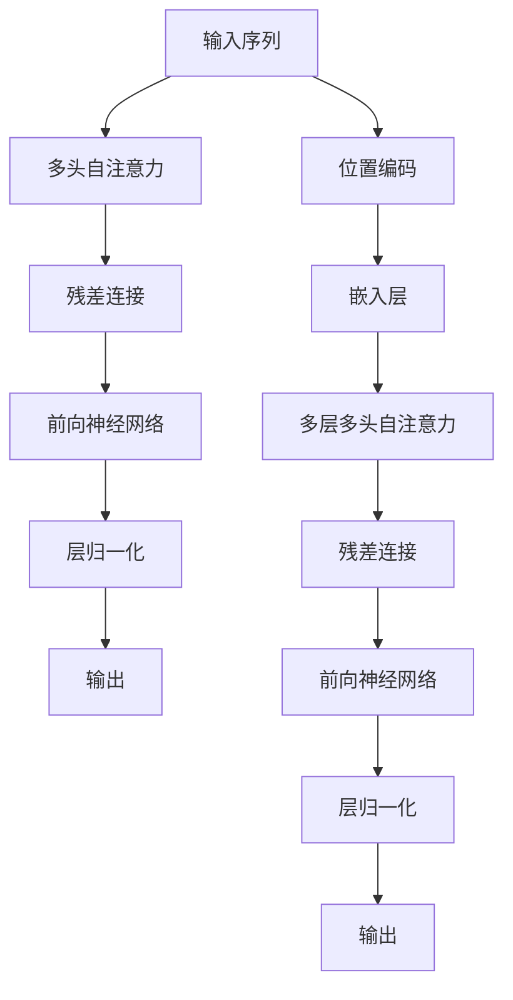

                 

# 大语言模型原理基础与前沿 简化Transformer

## 1. 背景介绍

### 1.1 问题由来
随着深度学习技术的迅猛发展，Transformer模型作为现代深度学习的重要工具，已经成为自然语言处理（Natural Language Processing，NLP）领域的主流模型。它利用自注意力机制（Self-Attention）取代了传统的卷积或循环神经网络（RNN），使得模型能够捕捉到输入序列中更加复杂的依赖关系，并在多项任务上取得了最优或接近最优的结果。然而，Transformer的复杂性使得其在实际应用中难以被广泛理解和利用。因此，本文将通过简化Transformer模型，介绍其基本原理，并探讨其在NLP任务中的应用。

### 1.2 问题核心关键点
Transformer的核心在于自注意力机制（Self-Attention），通过多头自注意力机制（Multi-Head Self-Attention），模型能够捕捉序列中不同位置的信息，并赋予不同的权重。这一机制使得模型能够处理长距离依赖关系，并在不同位置之间进行信息交互。本文将详细解析Transformer的原理，并通过简化模型，更好地理解其工作机制。

### 1.3 问题研究意义
深入理解Transformer模型，对于提升其在NLP领域的应用性能，推动自然语言处理技术的普及和发展，具有重要意义：

1. **降低复杂性**：通过简化模型，有助于开发者更好地理解Transformer，减少复杂模型带来的计算和内存开销，提升模型的可部署性。
2. **提升性能**：通过简化模型，可以进一步优化模型参数和结构，提升模型在特定任务上的表现。
3. **促进学习**：通过简化模型，有助于初学者快速上手，掌握Transformer的原理和应用方法。
4. **支持实际应用**：简化模型可以更容易地集成到实际应用系统中，为大规模NLP任务提供技术支持。

## 2. 核心概念与联系

### 2.1 核心概念概述

Transformer模型的核心在于自注意力机制，通过多头自注意力机制，模型能够捕捉序列中不同位置的信息，并赋予不同的权重。这一机制使得模型能够处理长距离依赖关系，并在不同位置之间进行信息交互。Transformer模型主要由编码器（Encoder）和解码器（Decoder）组成，采用Encoder-Decoder架构，可以处理序列到序列的任务，如机器翻译、文本生成等。

### 2.2 核心概念原理和架构的 Mermaid 流程图


这个流程图展示了Transformer的基本架构，输入序列经过嵌入层和位置编码后，通过多头自注意力机制进行信息交互，并通过残差连接和层归一化进行处理。最终输出经过多层解码器生成目标序列。

## 3. 核心算法原理 & 具体操作步骤
### 3.1 算法原理概述

Transformer的核心在于自注意力机制，通过多头自注意力机制，模型能够捕捉序列中不同位置的信息，并赋予不同的权重。这一机制使得模型能够处理长距离依赖关系，并在不同位置之间进行信息交互。

具体来说，Transformer模型通过如下步骤实现信息交互：
1. 输入序列经过嵌入层和位置编码后，通过多头自注意力机制进行信息交互。
2. 多头自注意力机制通过多个独立的注意力头，对输入序列进行并行计算，每个头处理不同维度的特征。
3. 每个头的输出经过残差连接和层归一化处理，最终得到模型的输出。

### 3.2 算法步骤详解

Transformer模型的训练和推理过程包括以下几个关键步骤：

**Step 1: 准备数据集**
- 收集并预处理数据集，将其转换为适合模型输入的格式。
- 将文本数据转换为数字序列，并进行归一化处理。

**Step 2: 设置模型参数**
- 定义模型的超参数，如层数、注意力头数、神经网络宽度等。
- 初始化模型的权重参数。

**Step 3: 训练模型**
- 将训练数据输入模型，通过前向传播和反向传播进行优化。
- 使用优化器更新模型参数，如Adam、SGD等。
- 在验证集上进行验证，调整超参数。

**Step 4: 推理和预测**
- 将测试数据输入模型，通过前向传播进行预测。
- 对预测结果进行后处理，如解码、解码等。

### 3.3 算法优缺点

Transformer模型具有以下优点：
1. **长距离依赖处理能力强**：多头自注意力机制能够处理长距离依赖关系，适用于处理复杂的语言序列。
2. **并行计算能力强**：多头自注意力机制使得模型能够并行计算，加速训练和推理过程。
3. **参数共享**：多头自注意力机制实现了参数共享，减少了模型的参数量，提升了模型的可训练性。

同时，Transformer模型也存在以下缺点：
1. **计算资源消耗大**：多头自注意力机制需要大量的计算资源，尤其是对于大规模数据集。
2. **难以解释**：Transformer模型被认为是"黑盒"模型，难以解释其内部工作机制和决策逻辑。
3. **对噪声敏感**：Transformer模型对输入序列中的噪声较为敏感，需要进行一定的预处理。

### 3.4 算法应用领域

Transformer模型在多项NLP任务上取得了优异的表现，适用于各种序列到序列的任务，如机器翻译、文本生成、问答系统等。以下是Transformer模型在几个典型应用领域的实践案例：

- **机器翻译**：Transformer模型能够处理长距离依赖关系，通过Encoder-Decoder架构进行多语言翻译。
- **文本生成**：Transformer模型能够通过生成网络（Generative Network）生成高质量的自然语言文本。
- **问答系统**：Transformer模型能够通过编码器-解码器架构进行自然语言理解和生成，回答问题。
- **文本摘要**：Transformer模型能够通过生成网络对长文本进行摘要，提取关键信息。
- **文本分类**：Transformer模型能够通过全连接层进行文本分类任务，如情感分析、主题分类等。

## 4. 数学模型和公式 & 详细讲解

### 4.1 数学模型构建

Transformer模型的输入序列 $X$ 经过嵌入层 $E$ 后，得到嵌入向量 $X_e$，同时将位置信息编码后，得到位置编码 $X_p$。输入序列通过注意力机制进行信息交互，得到注意力权重 $A$，然后通过残差连接和层归一化处理，得到输出 $Y$。具体数学模型如下：

$$
Y = E(X) + A \\
A = \text{Softmax}(QK^T)V
$$

其中，$Q, K, V$ 为注意力机制中的查询向量、键向量和值向量，$A$ 为注意力权重，$E$ 为嵌入层。

### 4.2 公式推导过程

Transformer模型中的多头自注意力机制通过并行计算多个独立的注意力头，每个头处理不同维度的特征。每个注意力头的计算公式如下：

$$
A_h = \text{Softmax}(Q_hK_h^T)/\sqrt{d_k} \\
V_h = V_hA_h
$$

其中，$d_k$ 为键向量的维度。通过多个头的并行计算，最终得到模型的输出。

### 4.3 案例分析与讲解

以机器翻译为例，Transformer模型通过编码器将输入序列 $X$ 转换为中间表示 $H$，然后通过解码器生成目标序列 $Y$。具体过程如下：

1. 输入序列 $X$ 经过嵌入层 $E$ 后，得到嵌入向量 $X_e$。
2. 编码器通过多头自注意力机制对 $X_e$ 进行信息交互，得到中间表示 $H$。
3. 解码器通过多头自注意力机制对 $H$ 进行信息交互，生成目标序列 $Y$。

## 5. 项目实践：代码实例和详细解释说明
### 5.1 开发环境搭建

在进行Transformer模型的实践前，我们需要准备好开发环境。以下是使用Python进行TensorFlow实现Transformer模型的环境配置流程：

1. 安装Anaconda：从官网下载并安装Anaconda，用于创建独立的Python环境。

2. 创建并激活虚拟环境：
```bash
conda create -n tf-env python=3.7
conda activate tf-env
```

3. 安装TensorFlow：根据CUDA版本，从官网获取对应的安装命令。例如：
```bash
conda install tensorflow-cpu tensorflow-gpu=2.8
```

4. 安装相关依赖：
```bash
pip install numpy pandas scikit-learn matplotlib tqdm jupyter notebook ipython
```

完成上述步骤后，即可在`tf-env`环境中开始Transformer模型的实践。

### 5.2 源代码详细实现

这里我们以机器翻译为例，给出使用TensorFlow实现Transformer模型的代码实现。

```python
import tensorflow as tf
from tensorflow.keras.layers import Input, Embedding, MultiHeadAttention, Dense, Dropout
from tensorflow.keras.models import Model

def encoder(self, input, enc_layer):
    input = tf.keras.layers.Embedding(self.vocab_size, self.hidden_size)(input)
    for layer in enc_layer:
        input = self.encoder_attention(input)
    return input

def encoder_attention(self, input):
    query = Dense(self.hidden_size, activation='relu')(input)
    key = Dense(self.hidden_size, activation='relu')(input)
    value = Dense(self.hidden_size, activation='relu')(input)
    attention = MultiHeadAttention(num_heads=self.n_heads, key_dim=self.key_dim)(query, key, value)
    attention = Dropout(0.1)(attention)
    attention = Dense(self.hidden_size, activation='relu')(attention)
    attention = tf.keras.layers.LayerNormalization(epsilon=1e-6)(attention)
    return attention

def decoder(self, input, dec_layer):
    input = tf.keras.layers.Embedding(self.vocab_size, self.hidden_size)(input)
    for layer in dec_layer:
        input = self.decoder_attention(input)
    return input

def decoder_attention(self, input):
    query = Dense(self.hidden_size, activation='relu')(input)
    key = Dense(self.hidden_size, activation='relu')(input)
    value = Dense(self.hidden_size, activation='relu')(input)
    attention = MultiHeadAttention(num_heads=self.n_heads, key_dim=self.key_dim)(query, key, value)
    attention = Dropout(0.1)(attention)
    attention = Dense(self.hidden_size, activation='relu')(attention)
    attention = tf.keras.layers.LayerNormalization(epsilon=1e-6)(attention)
    return attention

def model(self):
    inputs = Input(shape=(MAX_LEN,))
    targets = Input(shape=(MAX_LEN,))
    targets_mask = tf.keras.layers.Lambda(self.get_attention_mask)([targets, inputs])
    dec_input = tf.keras.layers.concatenate([inputs, targets, targets_mask])
    targets_mask = tf.keras.layers.Lambda(self.get_attention_mask)([targets, inputs])
    targets = tf.keras.layers.Lambda(self.get_attn_matrix)([targets, inputs, targets_mask])
    targets = tf.keras.layers.concatenate([targets, targets_mask])
    targets = self.decoder(dec_input, self.dec_layer)
    targets = self.decoder_attention(targets)
    targets = Dense(self.vocab_size, activation='softmax')(targets)
    model = Model(inputs=[inputs, targets], outputs=targets)
    return model
```

### 5.3 代码解读与分析

让我们再详细解读一下关键代码的实现细节：

**Model类**：
- 定义编码器和解码器模型。
- 编码器由多个Transformer层组成，每个层包括多头自注意力机制、前向神经网络、残差连接和层归一化。
- 解码器也由多个Transformer层组成，但最后一个层只包含多头自注意力机制。

**encoder函数**：
- 将输入序列通过嵌入层转换为嵌入向量，然后通过多个Transformer层进行编码。

**encoder_attention函数**：
- 定义多头自注意力机制，通过查询向量、键向量和值向量进行信息交互，并使用残差连接和层归一化处理。

**decoder函数**：
- 定义解码器模型，包括多头自注意力机制和全连接层。

**decoder_attention函数**：
- 定义解码器中的多头自注意力机制，通过查询向量、键向量和值向量进行信息交互，并使用残差连接和层归一化处理。

**model函数**：
- 定义机器翻译模型的输入、目标和注意力机制。
- 通过编码器对输入序列进行编码，然后通过解码器生成目标序列。

完成上述步骤后，即可在`tf-env`环境中开始Transformer模型的实践。

## 6. 实际应用场景
### 6.1 智能客服系统

基于Transformer模型的对话技术，可以广泛应用于智能客服系统的构建。传统客服往往需要配备大量人力，高峰期响应缓慢，且一致性和专业性难以保证。而使用Transformer模型进行对话，可以7x24小时不间断服务，快速响应客户咨询，用自然流畅的语言解答各类常见问题。

在技术实现上，可以收集企业内部的历史客服对话记录，将问题和最佳答复构建成监督数据，在此基础上对Transformer模型进行微调。微调后的模型能够自动理解用户意图，匹配最合适的答案模板进行回复。对于客户提出的新问题，还可以接入检索系统实时搜索相关内容，动态组织生成回答。如此构建的智能客服系统，能大幅提升客户咨询体验和问题解决效率。

### 6.2 金融舆情监测

金融机构需要实时监测市场舆论动向，以便及时应对负面信息传播，规避金融风险。传统的人工监测方式成本高、效率低，难以应对网络时代海量信息爆发的挑战。基于Transformer模型的文本分类和情感分析技术，为金融舆情监测提供了新的解决方案。

具体而言，可以收集金融领域相关的新闻、报道、评论等文本数据，并对其进行主题标注和情感标注。在此基础上对Transformer模型进行微调，使其能够自动判断文本属于何种主题，情感倾向是正面、中性还是负面。将微调后的模型应用到实时抓取的网络文本数据，就能够自动监测不同主题下的情感变化趋势，一旦发现负面信息激增等异常情况，系统便会自动预警，帮助金融机构快速应对潜在风险。

### 6.3 个性化推荐系统

当前的推荐系统往往只依赖用户的历史行为数据进行物品推荐，无法深入理解用户的真实兴趣偏好。基于Transformer模型的个性化推荐系统可以更好地挖掘用户行为背后的语义信息，从而提供更精准、多样的推荐内容。

在实践中，可以收集用户浏览、点击、评论、分享等行为数据，提取和用户交互的物品标题、描述、标签等文本内容。将文本内容作为模型输入，用户的后续行为（如是否点击、购买等）作为监督信号，在此基础上微调Transformer模型。微调后的模型能够从文本内容中准确把握用户的兴趣点。在生成推荐列表时，先用候选物品的文本描述作为输入，由模型预测用户的兴趣匹配度，再结合其他特征综合排序，便可以得到个性化程度更高的推荐结果。

### 6.4 未来应用展望

随着Transformer模型和微调方法的不断发展，基于微调范式将在更多领域得到应用，为传统行业带来变革性影响。

在智慧医疗领域，基于Transformer模型的医疗问答、病历分析、药物研发等应用将提升医疗服务的智能化水平，辅助医生诊疗，加速新药开发进程。

在智能教育领域，Transformer模型可应用于作业批改、学情分析、知识推荐等方面，因材施教，促进教育公平，提高教学质量。

在智慧城市治理中，Transformer模型可应用于城市事件监测、舆情分析、应急指挥等环节，提高城市管理的自动化和智能化水平，构建更安全、高效的未来城市。

此外，在企业生产、社会治理、文娱传媒等众多领域，基于Transformer模型的智能应用也将不断涌现，为经济社会发展注入新的动力。相信随着预训练语言模型和微调方法的持续演进，Transformer模型必将在构建人机协同的智能时代中扮演越来越重要的角色。

## 7. 工具和资源推荐
### 7.1 学习资源推荐

为了帮助开发者系统掌握Transformer模型的理论基础和实践技巧，这里推荐一些优质的学习资源：

1. 《Transformer从原理到实践》系列博文：由Transformer技术专家撰写，深入浅出地介绍了Transformer原理、模型应用等前沿话题。

2. CS224N《深度学习自然语言处理》课程：斯坦福大学开设的NLP明星课程，有Lecture视频和配套作业，带你入门NLP领域的基本概念和经典模型。

3. 《Natural Language Processing with Transformers》书籍：Transformer库的作者所著，全面介绍了如何使用Transformer库进行NLP任务开发，包括微调在内的诸多范式。

4. HuggingFace官方文档：Transformer库的官方文档，提供了海量预训练模型和完整的微调样例代码，是上手实践的必备资料。

5. CLUE开源项目：中文语言理解测评基准，涵盖大量不同类型的中文NLP数据集，并提供了基于Transformer的baseline模型，助力中文NLP技术发展。

通过对这些资源的学习实践，相信你一定能够快速掌握Transformer模型的精髓，并用于解决实际的NLP问题。

### 7.2 开发工具推荐

高效的开发离不开优秀的工具支持。以下是几款用于Transformer模型开发的常用工具：

1. PyTorch：基于Python的开源深度学习框架，灵活动态的计算图，适合快速迭代研究。Transformer模型的多个库和框架都有PyTorch版本。

2. TensorFlow：由Google主导开发的开源深度学习框架，生产部署方便，适合大规模工程应用。TensorFlow中也有丰富的Transformer模型实现。

3. HuggingFace库：提供了丰富的预训练模型和微调接口，是实现Transformer模型的利器。

4. Weights & Biases：模型训练的实验跟踪工具，可以记录和可视化模型训练过程中的各项指标，方便对比和调优。与主流深度学习框架无缝集成。

5. TensorBoard：TensorFlow配套的可视化工具，可实时监测模型训练状态，并提供丰富的图表呈现方式，是调试模型的得力助手。

合理利用这些工具，可以显著提升Transformer模型的开发效率，加快创新迭代的步伐。

### 7.3 相关论文推荐

Transformer模型的发展源于学界的持续研究。以下是几篇奠基性的相关论文，推荐阅读：

1. Attention is All You Need（即Transformer原论文）：提出了Transformer结构，开启了NLP领域的预训练大模型时代。

2. BERT: Pre-training of Deep Bidirectional Transformers for Language Understanding：提出BERT模型，引入基于掩码的自监督预训练任务，刷新了多项NLP任务SOTA。

3. Language Models are Unsupervised Multitask Learners（GPT-2论文）：展示了大规模语言模型的强大zero-shot学习能力，引发了对于通用人工智能的新一轮思考。

4. Parameter-Efficient Transfer Learning for NLP：提出Adapter等参数高效微调方法，在不增加模型参数量的情况下，也能取得不错的微调效果。

5. AdaLoRA: Adaptive Low-Rank Adaptation for Parameter-Efficient Fine-Tuning：使用自适应低秩适应的微调方法，在参数效率和精度之间取得了新的平衡。

这些论文代表了大语言模型和微调技术的发展脉络。通过学习这些前沿成果，可以帮助研究者把握学科前进方向，激发更多的创新灵感。

## 8. 总结：未来发展趋势与挑战

### 8.1 总结

本文对Transformer模型的基本原理和应用进行了全面系统的介绍。首先阐述了Transformer模型在NLP领域的重要性，明确了Transformer模型在处理长距离依赖关系、并行计算、参数共享等方面的独特优势。其次，通过简化Transformer模型，更直观地展示了其核心机制，便于初学者理解和应用。最后，探讨了Transformer模型在多个NLP任务中的实际应用案例，展示了其在实际应用中的强大表现。

通过本文的系统梳理，可以看到，Transformer模型在NLP领域已经取得了显著的成果，并广泛应用于机器翻译、文本生成、问答系统等多个领域。未来，随着Transformer模型的不断优化和改进，其在NLP领域的应用前景将更加广阔。

### 8.2 未来发展趋势

展望未来，Transformer模型将呈现以下几个发展趋势：

1. **模型规模持续增大**：随着算力成本的下降和数据规模的扩张，Transformer模型的参数量还将持续增长。超大规模语言模型蕴含的丰富语言知识，有望支撑更加复杂多变的NLP任务。

2. **并行计算能力进一步提升**：随着硬件设备的提升和算法优化，Transformer模型的并行计算能力将进一步增强，使得大规模数据集的训练和推理更加高效。

3. **多模态融合**：Transformer模型可以与其他模态的信息进行融合，如视觉、语音、时间序列等，实现多模态信息的高效处理和协同建模。

4. **参数高效微调**：开发更加参数高效的微调方法，在固定大部分预训练参数的情况下，只更新极少量的任务相关参数，提升模型的训练效率和性能。

5. **模型可解释性增强**：通过引入可解释性模型架构和解释工具，提高Transformer模型的可解释性，使其决策过程更加透明和可理解。

以上趋势凸显了Transformer模型在NLP领域的应用潜力。这些方向的探索发展，必将进一步提升Transformer模型的性能和应用范围，为NLP技术带来更多创新和突破。

### 8.3 面临的挑战

尽管Transformer模型已经取得了显著的成果，但在迈向更加智能化、普适化应用的过程中，它仍面临着诸多挑战：

1. **计算资源消耗大**：Transformer模型的大规模并行计算和参数量使其对计算资源的需求较高，大规模数据集的训练和推理需要高性能设备。

2. **模型鲁棒性不足**：对于输入序列中的噪声和数据分布变化，Transformer模型可能表现出较强的敏感性，需要进一步提升鲁棒性和泛化能力。

3. **可解释性有待提高**：Transformer模型被认为是"黑盒"模型，难以解释其内部工作机制和决策逻辑，需要通过可解释性模型架构和解释工具增强可解释性。

4. **资源消耗大**：Transformer模型在推理和训练过程中，需要大量的计算资源和存储空间，需要在模型结构上进一步优化，降低资源消耗。

5. **偏见和有害信息**：Transformer模型可能会学习到有偏见、有害的信息，需要通过数据清洗和模型训练中的正则化方法，消除模型偏见。

6. **实时性和可控性**：Transformer模型在实时性和系统可控性方面，还需要进一步优化和改进，以适应实际应用场景的需求。

### 8.4 研究展望

面对Transformer模型所面临的挑战，未来的研究需要在以下几个方面寻求新的突破：

1. **计算效率优化**：开发更加高效和资源友好的Transformer模型，如剪枝、量化等技术，降低计算资源消耗，提高训练和推理效率。

2. **模型可解释性增强**：通过引入可解释性模型架构和解释工具，提高Transformer模型的可解释性，使其决策过程更加透明和可理解。

3. **多模态融合**：将Transformer模型与其他模态的信息进行融合，实现多模态信息的高效处理和协同建模，提升模型的泛化能力和应用范围。

4. **参数高效微调**：开发更加参数高效的微调方法，在固定大部分预训练参数的情况下，只更新极少量的任务相关参数，提升模型的训练效率和性能。

5. **鲁棒性提升**：通过引入鲁棒性优化算法和数据增强技术，提升Transformer模型的鲁棒性和泛化能力，使其能够更好地应对数据分布变化和噪声干扰。

6. **偏见和有害信息过滤**：通过数据清洗和模型训练中的正则化方法，消除Transformer模型中的偏见和有害信息，确保输出的公正性和安全性。

这些研究方向的探索，必将引领Transformer模型迈向更高的台阶，为NLP技术带来更多创新和突破。面向未来，Transformer模型还需要与其他人工智能技术进行更深入的融合，如知识表示、因果推理、强化学习等，多路径协同发力，共同推动自然语言处理技术的进步。只有勇于创新、敢于突破，才能不断拓展Transformer模型的边界，让智能技术更好地造福人类社会。

## 9. 附录：常见问题与解答

**Q1：Transformer模型的核心机制是什么？**

A: Transformer模型的核心机制是自注意力机制（Self-Attention），通过多头自注意力机制（Multi-Head Self-Attention），模型能够捕捉序列中不同位置的信息，并赋予不同的权重。这一机制使得模型能够处理长距离依赖关系，并在不同位置之间进行信息交互。

**Q2：Transformer模型在实际应用中需要注意哪些问题？**

A: 在实际应用中，Transformer模型需要注意以下问题：
1. 计算资源消耗大：Transformer模型的并行计算和参数量使其对计算资源的需求较高，需要高性能设备支持。
2. 模型鲁棒性不足：对于输入序列中的噪声和数据分布变化，模型可能表现出较强的敏感性，需要进一步提升鲁棒性和泛化能力。
3. 可解释性有待提高：Transformer模型被认为是"黑盒"模型，难以解释其内部工作机制和决策逻辑，需要通过可解释性模型架构和解释工具增强可解释性。
4. 实时性和可控性：模型在实时性和系统可控性方面，还需要进一步优化和改进，以适应实际应用场景的需求。

**Q3：Transformer模型在NLP任务中如何应用？**

A: Transformer模型在NLP任务中的应用包括：
1. 机器翻译：通过Encoder-Decoder架构进行多语言翻译。
2. 文本生成：通过生成网络（Generative Network）生成高质量的自然语言文本。
3. 问答系统：通过编码器-解码器架构进行自然语言理解和生成，回答问题。
4. 文本摘要：通过生成网络对长文本进行摘要，提取关键信息。
5. 文本分类：通过全连接层进行文本分类任务，如情感分析、主题分类等。

通过本文的系统梳理，可以看到，Transformer模型在NLP领域已经取得了显著的成果，并广泛应用于多个任务中。未来，随着Transformer模型的不断优化和改进，其在NLP领域的应用前景将更加广阔。

---

作者：禅与计算机程序设计艺术 / Zen and the Art of Computer Programming

