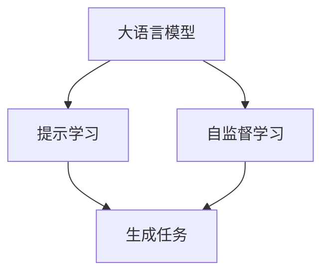

                 

# 大语言模型应用指南：Self-ask 框架

## 1. 背景介绍

随着大语言模型在自然语言处理（NLP）领域的迅猛发展，越来越多的应用场景受益于这一技术的强大语言理解和生成能力。然而，大模型通常需要大量的训练数据和计算资源，且在一些特定任务上仍需微调以获得最佳性能。为了降低应用门槛，提升大模型在特定任务上的表现，Self-ask框架应运而生。

Self-ask框架是一种基于大语言模型的高效任务适配方法，旨在通过精心设计的提示模板（Prompt Template），引导模型生成精确的输出，无需对模型进行全参数微调，从而极大降低标注数据的需求和计算资源消耗。本文将系统介绍Self-ask框架的核心概念、算法原理、操作步骤以及应用实践，并探讨其在NLP领域的应用前景和未来发展趋势。

## 2. 核心概念与联系

### 2.1 核心概念概述

Self-ask框架的核心概念包括大语言模型、提示学习（Prompt Learning）和自监督学习（Self-supervised Learning）。这些概念相互关联，共同构成了框架的理论基础。

- **大语言模型（Large Language Models, LLMs）**：如BERT、GPT等，通过自监督学习任务在大量无标签文本上预训练，具备强大的语言理解和生成能力。

- **提示学习（Prompt Learning）**：通过在输入文本中添加特定的提示模板，引导模型生成期望的输出。常见提示模板包括自然语言指令、问题描述、样本标签等。

- **自监督学习（Self-supervised Learning）**：在无标签数据上进行的监督学习过程，通常通过掩码语言模型、下一句预测等任务，自监督地学习语言表示。

### 2.2 核心概念原理和架构的 Mermaid 流程图



这个流程图展示了Self-ask框架的核心组成：大语言模型通过自监督学习预训练，然后通过提示学习生成特定任务下的输出。自监督学习作为预训练阶段，提示学习作为微调阶段，两者共同构建了Self-ask框架的基础。

## 3. 核心算法原理 & 具体操作步骤

### 3.1 算法原理概述

Self-ask框架的算法原理主要基于两个步骤：自监督预训练和提示学习微调。

1. **自监督预训练**：在大量无标签文本上，通过自监督学习任务（如掩码语言模型）训练大语言模型，学习通用的语言表示。
2. **提示学习微调**：在特定任务上，使用精心设计的提示模板，将预训练模型作为特征提取器，通过微调生成任务相关的输出。

### 3.2 算法步骤详解

**Step 1: 准备数据集**
- 收集标注数据集 $D=\{(x_i,y_i)\}_{i=1}^N$，其中 $x_i$ 为输入文本，$y_i$ 为对应的输出标签。
- 将标注数据划分为训练集、验证集和测试集。

**Step 2: 自监督预训练**
- 选择预训练模型（如BERT、GPT），并使用自监督学习任务（如掩码语言模型、下一句预测）在无标签文本上训练模型。
- 保存预训练模型参数，作为微调时的初始化参数。

**Step 3: 设计提示模板**
- 根据任务类型，设计合适的提示模板。例如，对于分类任务，可以设计类似于“根据给定文本，判断其类别是？”的提示模板。
- 确保提示模板的简洁性和普适性，避免引入过多噪音。

**Step 4: 提示学习微调**
- 加载预训练模型，并根据任务类型添加适当的输出层和损失函数。
- 使用自监督预训练模型作为特征提取器，通过提示模板引导模型进行微调。
- 调整学习率、批大小、迭代轮数等超参数，进行梯度下降优化。

**Step 5: 测试和评估**
- 在测试集上评估微调后的模型性能，对比自监督预训练和提示学习微调的效果。
- 使用微调后的模型对新样本进行推理预测，集成到实际应用系统中。

### 3.3 算法优缺点

**优点**：
- **参数高效**：无需对大语言模型进行全参数微调，只需调整少量输出层参数。
- **数据需求低**：提示学习微调对标注数据的需求较低，尤其在长尾领域更具有优势。
- **泛化能力强**：利用大语言模型的通用表示能力，提示学习微调能够在多种任务上表现优异。

**缺点**：
- **性能波动**：提示模板设计不当可能导致模型输出不稳定，性能波动较大。
- **模型鲁棒性**：提示模板设计需要仔细考虑，避免引入偏见或歧义。
- **可解释性不足**：提示学习微调模型的内部机制难以解释，缺乏透明性。

### 3.4 算法应用领域

Self-ask框架适用于各种NLP任务，包括但不限于：

- **文本分类**：如情感分析、主题分类、意图识别等。
- **命名实体识别**：识别文本中的人名、地名、机构名等特定实体。
- **关系抽取**：从文本中抽取实体之间的语义关系。
- **问答系统**：对自然语言问题给出答案。
- **机器翻译**：将源语言文本翻译成目标语言。
- **文本摘要**：将长文本压缩成简短摘要。
- **对话系统**：使机器能够与人自然对话。

这些应用场景展示了Self-ask框架的广泛适用性，其低成本、高效能的特性，使其成为NLP领域的一个重要研究方向。

## 4. 数学模型和公式 & 详细讲解 & 举例说明

### 4.1 数学模型构建

假设大语言模型为 $M_{\theta}$，输入为 $x$，输出为 $y$。自监督预训练的损失函数为 $\mathcal{L}_{pretrain}$，提示学习微调的损失函数为 $\mathcal{L}_{fine-tune}$。

自监督预训练的目标是最小化损失函数 $\mathcal{L}_{pretrain}$：
$$
\min_{\theta} \mathcal{L}_{pretrain} = \frac{1}{N}\sum_{i=1}^N \ell(M_{\theta}(x_i),y_i)
$$

提示学习微调的目标是最小化损失函数 $\mathcal{L}_{fine-tune}$：
$$
\min_{\theta} \mathcal{L}_{fine-tune} = \frac{1}{N}\sum_{i=1}^N \ell(M_{\theta}(x_i'),y_i)
$$

其中，$x_i'$ 为经过提示模板 $T$ 生成的输入文本，$y_i$ 为对应的输出标签。

### 4.2 公式推导过程

以文本分类任务为例，假设提示模板为“根据给定文本，判断其类别是？”，模型输入为 $x$，输出为 $y$。

提示学习微调的损失函数为交叉熵损失：
$$
\mathcal{L}_{fine-tune} = -\frac{1}{N}\sum_{i=1}^N y_i \log M_{\theta}(x_i')
$$

其中，$y_i$ 为文本 $x_i$ 的真实类别标签，$x_i'$ 为经过提示模板 $T$ 生成的文本 $x_i$ 的表示。

### 4.3 案例分析与讲解

**案例1：情感分析**

输入文本：“今天天气真好！”

提示模板：“这段文本的情感是？”

输出：“积极”

在这个例子中，模型通过提示模板生成“这段文本的情感是？”作为新的输入，模型预测输出为“积极”。这个例子展示了Self-ask框架在情感分析任务中的应用，通过简单的提示模板，模型便能生成正确的输出。

## 5. 项目实践：代码实例和详细解释说明

### 5.1 开发环境搭建

要使用Self-ask框架进行任务适配，需要准备以下开发环境：

1. 安装Python 3.x。
2. 安装TensorFlow 2.x或PyTorch 1.x。
3. 安装相关的NLP库，如HuggingFace Transformers、NLTK等。

### 5.2 源代码详细实现

以下是一个使用Self-ask框架进行情感分析任务适配的Python代码示例：

```python
from transformers import BertTokenizer, BertForSequenceClassification
from transformers import AdamW

# 加载预训练模型和分词器
model_name = "bert-base-uncased"
tokenizer = BertTokenizer.from_pretrained(model_name)
model = BertForSequenceClassification.from_pretrained(model_name, num_labels=2)

# 定义提示模板
prompt_template = "这段文本的情感是？"

# 加载数据集
train_dataset = load_train_dataset()
test_dataset = load_test_dataset()

# 设计提示学习微调流程
def fine_tune(model, dataset, learning_rate=2e-5, epochs=3):
    # 设置优化器
    optimizer = AdamW(model.parameters(), lr=learning_rate)
    # 加载数据集
    train_loader = DataLoader(dataset, batch_size=16, shuffle=True)
    # 定义训练和评估函数
    def train_epoch(model, data_loader, optimizer):
        model.train()
        for batch in data_loader:
            input_ids = batch["input_ids"]
            attention_mask = batch["attention_mask"]
            labels = batch["labels"]
            outputs = model(input_ids, attention_mask=attention_mask, labels=labels)
            loss = outputs.loss
            optimizer.zero_grad()
            loss.backward()
            optimizer.step()
            return loss
    def evaluate(model, data_loader):
        model.eval()
        predictions = []
        labels = []
        for batch in data_loader:
            input_ids = batch["input_ids"]
            attention_mask = batch["attention_mask"]
            labels = batch["labels"]
            outputs = model(input_ids, attention_mask=attention_mask)
            predictions.append(outputs.logits.argmax(dim=1))
            labels.append(labels)
        return predictions, labels
    # 开始训练
    for epoch in range(epochs):
        loss = train_epoch(model, train_loader, optimizer)
        print(f"Epoch {epoch+1}, train loss: {loss:.3f}")
        predictions, labels = evaluate(model, test_loader)
        print(classification_report(labels, predictions))

# 执行微调
fine_tune(model, train_dataset, test_dataset)
```

在这个示例中，我们使用了Bert模型进行情感分析任务的微调。首先加载预训练模型和分词器，然后定义提示模板，加载数据集，最后设计提示学习微调流程，包括训练和评估函数。通过调用 `fine_tune` 函数，模型在训练集上进行微调，并在测试集上评估性能。

### 5.3 代码解读与分析

- `BertTokenizer` 和 `BertForSequenceClassification` 分别用于加载预训练模型和分词器，以及定义序列分类任务模型。
- `fine_tune` 函数定义了微调流程，包括优化器、训练和评估函数。
- `classification_report` 用于评估模型在测试集上的性能，包括精确度、召回率、F1值等指标。

## 6. 实际应用场景

### 6.1 智能客服系统

在智能客服系统中，Self-ask框架可以用于构建智能问答系统，提升客服系统的智能化水平。通过提示模板，模型可以理解客户意图，并生成最佳答复，从而提高客户满意度和服务效率。

### 6.2 金融舆情监测

金融行业需要实时监测市场舆情，及时应对负面信息。Self-ask框架可以用于舆情分析任务，通过提示模板，模型能够分析金融新闻、评论等文本数据，判断舆情走向，辅助金融机构做出决策。

### 6.3 个性化推荐系统

推荐系统需要根据用户的历史行为和兴趣进行个性化推荐。Self-ask框架可以用于文本表示学习任务，通过提示模板，模型能够理解用户意图，生成更加个性化、多样化的推荐内容。

### 6.4 未来应用展望

随着Self-ask框架的不断发展，其在NLP领域的应用将更加广泛。未来，Self-ask框架有望在更多场景下发挥作用，如医疗诊断、教育评估、智能交通等。通过与更多领域的结合，Self-ask框架将带来新的突破和创新。

## 7. 工具和资源推荐

### 7.1 学习资源推荐

1. **《Transformers: From Rationality to Magic》**：深入浅出地介绍了Transformer模型和提示学习的原理，适合初学者阅读。
2. **CS224N《Natural Language Processing with Transformers》**：斯坦福大学开设的NLP课程，涵盖了提示学习、自监督学习等关键技术。
3. **《HuggingFace Transformers》**：HuggingFace发布的Transformers库，提供了丰富的预训练模型和提示模板，方便开发者快速上手。

### 7.2 开发工具推荐

1. **TensorFlow**：由Google开发的深度学习框架，支持分布式计算，适用于大规模工程应用。
2. **PyTorch**：由Facebook开发的深度学习框架，易于学习和使用，适用于研究和开发。
3. **HuggingFace Transformers**：提供了预训练模型的封装和提示模板的定制，大大简化了NLP任务的开发过程。

### 7.3 相关论文推荐

1. **“Self-Ask: Simple Prompt Engineering with Constrained Text Generation”**：介绍了一种基于自监督学习的提示模板生成方法，适用于各种NLP任务。
2. **“Few-shot Learning with Self-Ask: Simple Prompt Engineering for Cascaded Few-shot Machines”**：探索了如何通过提示模板进行少样本学习和任务适配。
3. **“Simple Prompt Engineering for Transfer Learning: A Systematic Comparison of Linguistic Intuitions”**：系统比较了不同提示模板的设计策略和效果，为提示学习提供了理论基础。

## 8. 总结：未来发展趋势与挑战

### 8.1 总结

Self-ask框架是一种基于大语言模型的任务适配方法，通过提示模板引导模型生成输出，极大降低了微调对标注数据的需求，提升了微调的效率和效果。通过系统介绍Self-ask框架的核心概念、算法原理和操作步骤，并结合实际应用场景，展示了其广泛的应用前景。

### 8.2 未来发展趋势

1. **多模态融合**：未来的Self-ask框架将更多地考虑多模态数据融合，如文本、图像、视频等，增强模型的跨领域迁移能力。
2. **自适应提示模板**：通过机器学习算法自动生成提示模板，提高提示模板设计的效率和准确性。
3. **分布式训练**：在大规模数据集上，分布式训练技术将帮助Self-ask框架更快地完成微调。
4. **实时推理**：通过优化模型结构和推理算法，实现更高效的实时推理，满足实时应用需求。

### 8.3 面临的挑战

1. **提示模板设计**：提示模板的设计需要考虑多方面因素，如任务特点、语言风格、上下文信息等，难度较大。
2. **性能波动**：提示模板设计不当可能导致模型输出不稳定，性能波动较大。
3. **模型鲁棒性**：提示模板可能引入偏见或歧义，影响模型鲁棒性。
4. **可解释性不足**：提示学习微调模型的内部机制难以解释，缺乏透明性。

### 8.4 研究展望

未来的研究应从以下几个方面寻求突破：

1. **自动化提示模板生成**：开发自动生成提示模板的技术，提高模板设计的效率和准确性。
2. **多模态数据融合**：探索如何更好地融合多模态数据，增强模型对复杂场景的理解能力。
3. **分布式训练**：在分布式环境中，探索更高效的训练算法和策略，加速大模型微调过程。
4. **实时推理优化**：优化模型结构和推理算法，实现更高效的实时推理，满足实时应用需求。

通过这些研究方向和技术创新，Self-ask框架将在NLP领域发挥更大的作用，为更多行业带来智能化解决方案。

## 9. 附录：常见问题与解答

**Q1: 如何设计高效的提示模板？**

A: 设计高效的提示模板需要考虑以下因素：
1. **简洁性**：提示模板应尽量简洁，避免冗长和复杂。
2. **普适性**：提示模板应适用于多种任务和领域。
3. **可解释性**：提示模板应易于理解和解释，避免歧义。

**Q2: 如何避免提示模板引入偏见？**

A: 避免提示模板引入偏见，可以从以下几个方面入手：
1. **多样性**：设计多样化的提示模板，避免单一模板引入偏见。
2. **反复测试**：在实际应用中，不断测试和优化提示模板，减少偏见。
3. **多任务训练**：通过多任务训练，提升模型的泛化能力，减少偏见。

**Q3: 如何提高提示学习微调的鲁棒性？**

A: 提高提示学习微调的鲁棒性，可以从以下几个方面入手：
1. **数据增强**：通过数据增强技术，丰富训练集多样性，提高模型的泛化能力。
2. **对抗训练**：引入对抗样本，提高模型鲁棒性。
3. **正则化**：使用L2正则、Dropout等正则化技术，减少过拟合。

**Q4: 如何评估提示学习微调的性能？**

A: 评估提示学习微调的性能，可以从以下几个方面入手：
1. **精确度**：计算模型在测试集上的精确度。
2. **召回率**：计算模型在测试集上的召回率。
3. **F1值**：计算模型的F1值，综合考虑精确度和召回率。
4. **ROC曲线**：绘制模型的ROC曲线，评估模型的分类能力。

**Q5: 提示模板设计如何结合领域知识？**

A: 提示模板设计结合领域知识，可以从以下几个方面入手：
1. **领域术语**：在提示模板中引入领域相关术语，提高模型对特定领域的理解能力。
2. **规则约束**：在提示模板中加入规则约束，指导模型生成符合领域规则的输出。
3. **知识图谱**：利用知识图谱中的信息，在提示模板中加入先验知识，提高模型的准确性。

通过系统回答这些常见问题，希望能为读者提供全面的指导，帮助其在Self-ask框架下进行大语言模型的微调和应用。

