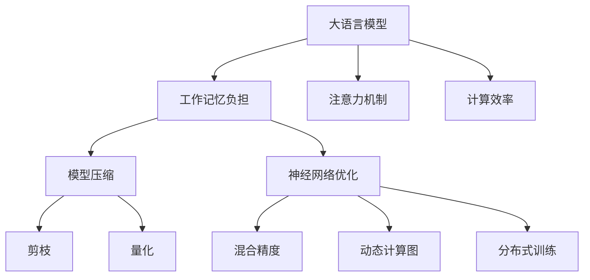

                 

# 大语言模型应用指南：减轻工作记忆的负担

> 关键词：大语言模型, 工作记忆, 认知负担, 注意力机制, 计算效率, 神经网络优化

## 1. 背景介绍

### 1.1 问题由来

大语言模型（Large Language Models, LLMs）的兴起，极大地推动了自然语言处理（NLP）和人工智能（AI）领域的发展。这些模型通过深度学习技术，可以在大规模无标签数据上自监督预训练，从而获得丰富的语言表示能力。但与此同时，这些模型的复杂度也带来了新的挑战——随着模型参数量的增加，训练和推理过程中的计算开销急剧增大，工作记忆的负担也在不断加重。

对于计算机来说，执行深度神经网络推理时，需要将所有的网络参数和中间计算结果都存储在工作内存中，才能高效地执行前向传播和反向传播。随着模型参数量的增加，尤其是对于像BERT、GPT这样的海量参数模型，内存的占用迅速增加，导致计算效率下降。

如何在大模型应用中，有效减轻工作记忆的负担，是当前大语言模型应用中亟待解决的问题。本文将详细探讨这一问题，并提供解决方案，帮助开发者构建更高效、更轻量级的大语言模型应用。

## 2. 核心概念与联系

### 2.1 核心概念概述

- **大语言模型（LLMs）**：一种基于深度神经网络架构的模型，可以在大规模无标签数据上进行自监督预训练，学习通用的语言表示。典型的大模型包括BERT、GPT系列、T5等。

- **工作记忆（Working Memory）**：在计算机科学中，工作记忆是指用于存储计算过程中的临时数据的内存。在大模型中，工作记忆主要指用于存储模型参数和中间计算结果的内存。

- **注意力机制（Attention Mechanism）**：在大模型中，注意力机制用于决定不同部分输入对输出结果的贡献程度。通过筛选重要信息，减少冗余计算，可以显著减轻工作记忆的负担。

- **计算效率（Computational Efficiency）**：衡量大模型应用时，计算机的计算速度和资源利用率。随着模型参数量的增加，计算效率可能显著下降。

- **神经网络优化（Neural Network Optimization）**：为了提升大模型应用的计算效率和模型性能，采用的各种技术手段，如剪枝、量化、混合精度等。

- **模型压缩（Model Compression）**：通过剪枝、量化等技术，减少模型参数量，优化模型结构，从而提高计算效率和内存利用率。

### 2.2 核心概念原理和架构的 Mermaid 流程图



这个流程图展示了大语言模型中的核心概念及其相互联系：

1. 大语言模型（A）通过工作记忆负担（B）承载计算过程中的临时数据。
2. 注意力机制（C）用于筛选重要信息，减少工作记忆负担。
3. 计算效率（D）与工作记忆负担紧密相关，依赖于注意力机制优化。
4. 模型压缩（E）通过剪枝（G）和量化（H）技术，减少模型参数，优化工作记忆。
5. 神经网络优化（F）包含混合精度（I）、动态计算图（J）、分布式训练（K）等技术，进一步提升计算效率。

## 3. 核心算法原理 & 具体操作步骤

### 3.1 算法原理概述

大语言模型的计算效率和工作记忆负担，与其内部架构密切相关。注意力机制在大模型中起到了关键作用。通过注意力机制，模型能够在处理输入时，只关注与当前任务最相关的信息，从而减少冗余计算，减轻工作记忆负担。

在大模型中，注意力机制的实现通常基于矩阵运算，包括计算注意力权重、注意力得分、注意力向量等。以Transformer架构为例，其中包含了多头注意力（Multi-Head Attention）和位置注意力（Position Attention）等。

$$
\text{Multi-Head Attention}(Q,K,V) = \text{softmax}(\frac{QK^T}{\sqrt{d_k}})V
$$

其中，$Q$、$K$、$V$分别代表查询向量、键向量和值向量，$d_k$为键向量的维度。

### 3.2 算法步骤详解

大语言模型的计算过程主要包括以下几个步骤：

1. **输入编码**：将输入文本转换为模型能够处理的形式，通常通过分词和嵌入（Embedding）实现。

2. **前向传播**：在模型内部执行前向传播计算，包括多个层（Layer）的计算，每层通常包含多个子层（Sub-layer），如编码器层（Encoder Layer）和解码器层（Decoder Layer）。

3. **注意力机制**：在每层的子层中，使用注意力机制计算每个位置对当前位置的贡献程度，筛选重要信息。

4. **残差连接**：使用残差连接（Residual Connection）将前一层的输出与当前层的输出相加，提升模型表达能力。

5. **线性变换和激活函数**：在最后一层的子层之后，通常会进行线性变换和激活函数（如ReLU）的操作，将输出映射到最终的预测结果。

6. **反向传播和优化**：通过反向传播计算损失函数的梯度，使用优化算法（如Adam）更新模型参数。

### 3.3 算法优缺点

大语言模型计算效率和工作记忆负担的优化，主要通过以下几个方面实现：

#### 优点：

1. **计算效率高**：通过注意力机制，模型能够有选择地关注输入中的重要信息，减少冗余计算，提高计算效率。

2. **模型表现强**：通过优化注意力机制和模型结构，可以在较小的计算资源下，获得比传统模型更好的性能。

3. **适应性强**：模型能够灵活适应各种类型的输入数据，如文本、图像、语音等。

#### 缺点：

1. **内存占用大**：大模型参数量大，内存占用大，尤其是在推理阶段。

2. **计算资源需求高**：训练大模型需要大量的计算资源和时间，且容易发生过拟合。

3. **模型压缩难度大**：大模型压缩难度较大，且压缩后的模型性能可能下降。

### 3.4 算法应用领域

大语言模型在多个领域都有广泛的应用，包括但不限于：

- **自然语言处理（NLP）**：如机器翻译、文本分类、命名实体识别、情感分析等。

- **计算机视觉（CV）**：如图像分类、目标检测、图像生成等。

- **语音处理**：如语音识别、语音合成、语音翻译等。

- **推荐系统**：如商品推荐、新闻推荐等。

## 4. 数学模型和公式 & 详细讲解 & 举例说明

### 4.1 数学模型构建

大语言模型的计算过程可以抽象为矩阵乘法和线性变换的组合。以Transformer模型为例，其前向传播过程可以表示为：

$$
y = M(x; \theta) = f(G(H(..., \theta)))
$$

其中，$M$为整个模型的前向传播函数，$G$为某一层的前向传播函数，$H$为上一层的前向传播函数，$\theta$为模型参数。

### 4.2 公式推导过程

Transformer模型中，注意力机制的计算过程如下：

1. **计算查询向量**：
$$
Q = XW^Q
$$

2. **计算键向量**：
$$
K = XW^K
$$

3. **计算值向量**：
$$
V = XW^V
$$

4. **计算注意力权重**：
$$
A = \text{softmax}(\frac{QK^T}{\sqrt{d_k}})
$$

5. **计算注意力向量**：
$$
V' = AV
$$

6. **计算注意力结果**：
$$
y' = \text{Linear}(y'')
$$

其中，$X$为输入文本，$W^Q$、$W^K$、$W^V$为线性变换矩阵，$d_k$为键向量的维度，$\text{softmax}$为注意力权重计算函数，$\text{Linear}$为线性变换函数。

### 4.3 案例分析与讲解

以BERT模型为例，其在多任务学习中的注意力机制计算过程如下：

1. **输入编码**：将输入文本转换为BERT可接受的格式，如将单词嵌入（Embedding）。

2. **前向传播**：通过多个Transformer层进行前向传播计算，每层包含多个子层，如编码器层和解码器层。

3. **多头注意力**：在每个子层中，使用多头注意力机制计算每个位置的贡献程度，筛选重要信息。

4. **残差连接**：使用残差连接将前一层的输出与当前层的输出相加。

5. **线性变换和激活函数**：在最后一层的子层之后，进行线性变换和激活函数的操作，将输出映射到最终的预测结果。

## 5. 项目实践：代码实例和详细解释说明

### 5.1 开发环境搭建

开发大语言模型应用时，需要搭建相应的开发环境。以下是使用Python进行PyTorch开发的环境配置流程：

1. 安装Anaconda：从官网下载并安装Anaconda，用于创建独立的Python环境。

2. 创建并激活虚拟环境：
```bash
conda create -n pytorch-env python=3.8 
conda activate pytorch-env
```

3. 安装PyTorch：根据CUDA版本，从官网获取对应的安装命令。例如：
```bash
conda install pytorch torchvision torchaudio cudatoolkit=11.1 -c pytorch -c conda-forge
```

4. 安装Transformers库：
```bash
pip install transformers
```

5. 安装各类工具包：
```bash
pip install numpy pandas scikit-learn matplotlib tqdm jupyter notebook ipython
```

完成上述步骤后，即可在`pytorch-env`环境中开始模型开发。

### 5.2 源代码详细实现

以下是使用PyTorch实现一个大语言模型微调的示例代码：

```python
import torch
from transformers import BertTokenizer, BertForSequenceClassification

# 定义模型和优化器
model = BertForSequenceClassification.from_pretrained('bert-base-uncased', num_labels=2)
optimizer = torch.optim.Adam(model.parameters(), lr=2e-5)

# 准备数据
tokenizer = BertTokenizer.from_pretrained('bert-base-uncased')
train_data = tokenizer.encode(train_texts, return_tensors='pt', padding=True, truncation=True)
train_labels = torch.tensor(train_labels, dtype=torch.long)

# 训练模型
model.train()
for i in range(epochs):
    optimizer.zero_grad()
    logits = model(train_data)
    loss = torch.nn.CrossEntropyLoss()(logits, train_labels)
    loss.backward()
    optimizer.step()
```

### 5.3 代码解读与分析

让我们再详细解读一下关键代码的实现细节：

**BertForSequenceClassification类**：
- `from_pretrained`方法：从预训练模型库中加载BERT模型。
- `num_labels`参数：指定分类任务的目标标签数量。

**tokenizer.encode方法**：
- 将文本转换为模型能够处理的格式，包括分词和嵌入。

**BertForSequenceClassification类**：
- 定义了BERT模型的基本结构，包括编码器层、多头注意力机制、残差连接、线性变换和激活函数等。

**train_data和train_labels**：
- 将文本数据和标签数据转换为PyTorch张量，用于模型训练。

**optimizer.zero_grad()**：
- 清空梯度，为前向传播做准备。

**logits = model(train_data)**：
- 使用模型对输入文本进行前向传播，得到预测结果。

**torch.nn.CrossEntropyLoss()**：
- 计算交叉熵损失函数。

**loss.backward()**：
- 计算损失函数的梯度，用于反向传播更新模型参数。

**optimizer.step()**：
- 使用优化器更新模型参数。

## 6. 实际应用场景

### 6.1 智能客服系统

大语言模型在智能客服系统中的应用，可以显著提升客户咨询的响应速度和质量。通过微调，模型能够理解客户问题，并自动匹配最佳答案，减少人工干预，提高服务效率。

**实际应用**：
- 收集客户咨询数据，标注问题和回答。
- 对预训练模型进行微调，使其能够理解问题和生成回答。
- 在生产环境中，将微调后的模型部署到客服系统中，实时处理客户咨询请求。

### 6.2 金融舆情监测

大语言模型在金融舆情监测中的应用，可以帮助金融机构实时监控市场舆情，及时发现负面信息，规避风险。

**实际应用**：
- 收集金融领域的文本数据，包括新闻、评论、社交媒体等。
- 对预训练模型进行微调，使其能够识别金融词汇和情感倾向。
- 在实时数据流中，使用微调后的模型检测舆情变化，生成报告，帮助决策者及时应对。

### 6.3 个性化推荐系统

大语言模型在个性化推荐系统中的应用，可以提升推荐系统的精准性和多样性。通过微调，模型能够理解用户的兴趣偏好，生成个性化的推荐结果。

**实际应用**：
- 收集用户的历史行为数据，包括浏览、点击、购买等。
- 对预训练模型进行微调，使其能够理解用户兴趣，生成个性化推荐。
- 在推荐系统中，使用微调后的模型生成推荐结果，提升用户满意度。

### 6.4 未来应用展望

随着大语言模型的不断发展，其在更多领域的应用将逐渐普及。未来，大语言模型将在智慧医疗、智能教育、智慧城市治理等多个领域发挥重要作用，推动社会进步。

**未来趋势**：
- **智慧医疗**：通过微调模型，实现医疗问答、病历分析、药物研发等任务，辅助医生诊疗，加速新药开发。
- **智能教育**：使用微调模型进行作业批改、学情分析、知识推荐，因材施教，促进教育公平。
- **智慧城市治理**：通过微调模型，实现城市事件监测、舆情分析、应急指挥，提高城市管理自动化水平。

## 7. 工具和资源推荐

### 7.1 学习资源推荐

为了帮助开发者系统掌握大语言模型的应用，这里推荐一些优质的学习资源：

1. **Transformer from Principles to Practice**：由大模型技术专家撰写，深入浅出地介绍了Transformer原理、BERT模型、微调技术等前沿话题。

2. **CS224N Deep Learning for NLP**：斯坦福大学开设的NLP明星课程，有Lecture视频和配套作业，带你入门NLP领域的基本概念和经典模型。

3. **Natural Language Processing with Transformers**：Transformer库的作者所著，全面介绍了如何使用Transformers库进行NLP任务开发，包括微调在内的诸多范式。

4. **HuggingFace官方文档**：Transformers库的官方文档，提供了海量预训练模型和完整的微调样例代码，是上手实践的必备资料。

5. **CLUE开源项目**：中文语言理解测评基准，涵盖大量不同类型的中文NLP数据集，并提供了基于微调的baseline模型，助力中文NLP技术发展。

通过对这些资源的学习实践，相信你一定能够快速掌握大语言模型的应用精髓，并用于解决实际的NLP问题。

### 7.2 开发工具推荐

高效的开发离不开优秀的工具支持。以下是几款用于大语言模型微调开发的常用工具：

1. **PyTorch**：基于Python的开源深度学习框架，灵活动态的计算图，适合快速迭代研究。大部分预训练语言模型都有PyTorch版本的实现。

2. **TensorFlow**：由Google主导开发的开源深度学习框架，生产部署方便，适合大规模工程应用。同样有丰富的预训练语言模型资源。

3. **Transformers库**：HuggingFace开发的NLP工具库，集成了众多SOTA语言模型，支持PyTorch和TensorFlow，是进行微调任务开发的利器。

4. **Weights & Biases**：模型训练的实验跟踪工具，可以记录和可视化模型训练过程中的各项指标，方便对比和调优。与主流深度学习框架无缝集成。

5. **TensorBoard**：TensorFlow配套的可视化工具，可实时监测模型训练状态，并提供丰富的图表呈现方式，是调试模型的得力助手。

6. **Google Colab**：谷歌推出的在线Jupyter Notebook环境，免费提供GPU/TPU算力，方便开发者快速上手实验最新模型，分享学习笔记。

合理利用这些工具，可以显著提升大语言模型微调任务的开发效率，加快创新迭代的步伐。

### 7.3 相关论文推荐

大语言模型和微调技术的发展源于学界的持续研究。以下是几篇奠基性的相关论文，推荐阅读：

1. **Attention is All You Need**：提出了Transformer结构，开启了NLP领域的预训练大模型时代。

2. **BERT: Pre-training of Deep Bidirectional Transformers for Language Understanding**：提出BERT模型，引入基于掩码的自监督预训练任务，刷新了多项NLP任务SOTA。

3. **Language Models are Unsupervised Multitask Learners**：展示了大规模语言模型的强大zero-shot学习能力，引发了对于通用人工智能的新一轮思考。

4. **Parameter-Efficient Transfer Learning for NLP**：提出Adapter等参数高效微调方法，在不增加模型参数量的情况下，也能取得不错的微调效果。

5. **Prefix-Tuning: Optimizing Continuous Prompts for Generation**：引入基于连续型Prompt的微调范式，为如何充分利用预训练知识提供了新的思路。

6. **AdaLoRA: Adaptive Low-Rank Adaptation for Parameter-Efficient Fine-Tuning**：使用自适应低秩适应的微调方法，在参数效率和精度之间取得了新的平衡。

这些论文代表了大语言模型微调技术的发展脉络。通过学习这些前沿成果，可以帮助研究者把握学科前进方向，激发更多的创新灵感。

## 8. 总结：未来发展趋势与挑战

### 8.1 研究成果总结

本文对大语言模型的应用进行了全面系统的介绍，涵盖其计算效率、工作记忆负担、注意力机制等方面，提供了详细的算法原理和操作步骤。同时，通过案例分析，展示了其在智能客服、金融舆情监测、个性化推荐系统等实际应用场景中的应用前景。

### 8.2 未来发展趋势

展望未来，大语言模型在计算效率、模型压缩、神经网络优化等方面将继续发展，推动其在更多领域的应用：

1. **计算效率提升**：通过更高效的算法和架构设计，进一步提升大语言模型的计算效率。

2. **模型压缩**：采用更先进的剪枝、量化等技术，减少模型参数量，优化计算资源占用。

3. **神经网络优化**：引入混合精度、动态计算图等技术，提升模型的计算效率和资源利用率。

4. **模型融合**：将大语言模型与其他技术进行深度融合，如知识图谱、因果推理等，提升模型的综合性能。

5. **跨领域应用**：拓展大语言模型在更多领域的适用性，如计算机视觉、语音处理等。

6. **伦理与安全**：加强模型输出可解释性和安全性，避免偏见和有害信息传播。

### 8.3 面临的挑战

尽管大语言模型在多个领域展现了巨大的潜力，但在实际应用中，仍面临以下挑战：

1. **计算资源需求高**：大模型训练和推理需要大量计算资源，如何优化资源利用率，降低计算成本，仍是重要问题。

2. **模型压缩难度大**：大模型压缩难度较大，且压缩后的模型性能可能下降，如何平衡压缩和性能，仍是技术难题。

3. **模型鲁棒性不足**：面对数据分布变化，模型泛化性能可能下降，如何提高模型的鲁棒性，仍需更多研究。

4. **输出可解释性差**：大语言模型缺乏可解释性，难以理解和调试模型的决策过程，如何增强模型的可解释性，仍需更多探索。

5. **伦理与安全问题**：大语言模型可能学习到有害信息，如何确保模型的伦理与安全，避免负面影响，仍需深入研究。

6. **数据分布变化**：大语言模型需要持续学习新数据，如何保持模型的时效性，避免知识老化，仍需更多研究。

### 8.4 研究展望

面对未来的大语言模型应用，研究者需要在以下几个方向进行更深入的探索：

1. **跨领域迁移学习**：将大语言模型应用于不同领域的任务，探索跨领域的迁移学习策略。

2. **少样本学习和自监督学习**：在少量标注数据情况下，通过少样本学习和自监督学习提升模型性能。

3. **动态计算图与分布式训练**：引入动态计算图和分布式训练，优化模型的计算效率和资源利用率。

4. **知识表示与推理**：将符号化的知识与神经网络模型结合，提升模型的推理能力和可解释性。

5. **分布式与边缘计算**：将大语言模型应用于边缘计算和分布式计算环境中，提升模型的实时性和可靠性。

6. **伦理与隐私保护**：研究大语言模型的伦理与隐私保护问题，确保模型应用的公平性、透明性和安全性。

这些研究方向的探索，必将推动大语言模型向更高层次发展，为构建更加智能、安全、可靠的人工智能系统提供有力支撑。

## 9. 附录：常见问题与解答

**Q1：大语言模型的工作记忆负担如何减轻？**

A: 减轻大语言模型的工作记忆负担，主要通过优化注意力机制和模型结构实现。具体方法包括：
1. 使用更高效的注意力机制，如Layer-wise Attention和Local Attention。
2. 引入残差连接，将前一层的输出加到当前层的输出中。
3. 使用混合精度训练，减少浮点数的计算开销。
4. 采用分布式训练，提高模型训练效率。

**Q2：如何高效地使用大语言模型进行推理？**

A: 高效使用大语言模型进行推理，主要通过以下几个步骤：
1. 使用预训练模型作为特征提取器，减少推理所需的内存和计算资源。
2. 引入剪枝和量化技术，减少模型参数量。
3. 使用动态计算图，避免不必要的计算。
4. 优化模型结构，如使用Transformer的线性变换代替全连接层。

**Q3：如何在多任务学习中优化大语言模型？**

A: 多任务学习中优化大语言模型，可以通过以下方法实现：
1. 使用Multi-task Learning框架，在多任务训练中同时优化多个任务的损失函数。
2. 引入元学习，通过少量标注数据进行学习，提升模型的泛化能力。
3. 引入自监督学习，利用大量无标签数据进行预训练，提升模型的性能。

**Q4：大语言模型在实际应用中，如何解决资源瓶颈问题？**

A: 解决大语言模型在实际应用中的资源瓶颈问题，主要通过以下方法实现：
1. 采用剪枝和量化技术，减少模型参数量。
2. 使用混合精度训练，减少浮点数的计算开销。
3. 引入分布式训练，提高模型训练效率。
4. 采用动态计算图，避免不必要的计算。
5. 使用边缘计算和分布式计算环境，减少数据传输和处理开销。

**Q5：大语言模型在微调过程中，如何进行超参数调优？**

A: 在微调过程中，进行超参数调优的方法包括：
1. 使用网格搜索（Grid Search）和随机搜索（Random Search），寻找最优超参数组合。
2. 引入贝叶斯优化（Bayesian Optimization）和强化学习（Reinforcement Learning），更高效地寻找最优超参数。
3. 使用超参数共享（Hyperparameter Sharing），在多个任务中共享超参数，降低超参数调优成本。

**Q6：大语言模型在实际应用中，如何进行模型部署？**

A: 大语言模型在实际应用中进行模型部署的方法包括：
1. 使用模型压缩技术，减少模型大小，提高部署效率。
2. 使用GPU和TPU等高性能设备，加速模型推理。
3. 使用分布式计算环境，提高模型推理效率。
4. 引入模型量化和剪枝技术，优化模型推理性能。
5. 使用边缘计算和分布式计算环境，减少数据传输和处理开销。

**Q7：大语言模型在实际应用中，如何进行模型监控和调优？**

A: 大语言模型在实际应用中进行模型监控和调优的方法包括：
1. 使用模型训练的实验跟踪工具，记录和可视化模型训练过程中的各项指标。
2. 使用超参数调优工具，进行超参数调整，优化模型性能。
3. 使用A/B测试，比较不同模型的性能和效果，选择最优模型。
4. 使用动态计算图和混合精度训练，优化模型推理性能。
5. 使用边缘计算和分布式计算环境，提高模型推理效率。

**Q8：大语言模型在实际应用中，如何进行模型优化？**

A: 大语言模型在实际应用中进行模型优化的方法包括：
1. 使用剪枝和量化技术，减少模型参数量，优化计算效率。
2. 引入混合精度训练，减少浮点数的计算开销。
3. 使用动态计算图，避免不必要的计算。
4. 优化模型结构，如使用Transformer的线性变换代替全连接层。
5. 使用分布式训练，提高模型训练效率。
6. 使用模型压缩技术，减少模型大小，提高部署效率。

以上是关于大语言模型应用的一些常见问题及其解答。通过深入理解这些关键问题，相信你能够更好地掌握大语言模型的应用技巧，提升模型性能和应用效果。

---

作者：禅与计算机程序设计艺术 / Zen and the Art of Computer Programming

