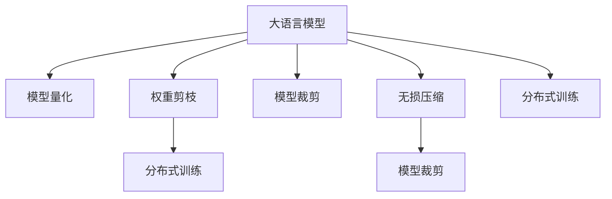

                 

# 大语言模型应用指南：无损压缩的极限

> 关键词：大语言模型,无损压缩,深度学习,数据压缩,模型优化,应用实践

## 1. 背景介绍

### 1.1 问题由来
随着人工智能技术的飞速发展，大语言模型（Large Language Models, LLMs）在自然语言处理（Natural Language Processing, NLP）等领域取得了显著的进展。大语言模型通常拥有数十亿个参数，可以理解复杂的自然语言语境，生成高质量的文本内容。然而，大模型的高参数量也带来了存储和计算上的挑战。为应对这些挑战，无损压缩技术成为大语言模型优化不可或缺的一部分。

### 1.2 问题核心关键点
无损压缩技术在深度学习模型中的应用，尤其是在大语言模型中的应用，主要包括以下几个关键点：

1. **存储优化**：大语言模型的存储优化旨在减少模型参数的存储需求，从而降低对存储空间的占用，特别是在模型部署和分布式训练中。
2. **计算效率**：通过压缩模型参数，加速模型的推理和训练过程，提高计算效率，减少延迟，增强模型的实时响应能力。
3. **模型可扩展性**：无损压缩技术可以增强模型的可扩展性，使得大模型可以在不同硬件平台上运行，同时保持性能和准确性。
4. **资源管理**：压缩后的模型可以更灵活地管理计算资源，减少不必要的计算开销，提高资源利用率。
5. **减少碳排放**：通过减少模型大小和加速训练过程，间接减少能耗，从而降低碳排放。

这些问题在大规模模型的应用中尤为突出，因为大模型的参数量级通常以十亿甚至百亿计，存储和计算资源的限制非常明显。因此，无损压缩技术成为优化大语言模型的重要手段之一。

### 1.3 问题研究意义
研究无损压缩技术对于大语言模型优化具有重要意义：

1. **提高存储和计算效率**：无损压缩技术可以显著减少模型参数的存储需求，降低计算资源消耗，使得大模型在资源受限的环境中也能高效运行。
2. **提升模型的可扩展性**：无损压缩技术帮助模型在不同硬件平台上的迁移和部署更加方便，增强模型的通用性和适用性。
3. **推动模型的普及应用**：通过压缩技术降低模型大小，使得更多规模的机构和企业能够负担和部署大语言模型，加速人工智能技术在各个行业的应用。
4. **降低环境影响**：减少计算过程中的能耗，有助于降低数据中心的碳排放，推动绿色人工智能的发展。
5. **支持新兴应用场景**：无损压缩技术支持诸如实时语音交互、智能家居等新兴应用场景，提高用户体验和系统响应速度。

## 2. 核心概念与联系

### 2.1 核心概念概述

为了更好地理解无损压缩技术在大语言模型中的应用，本节将介绍几个密切相关的核心概念：

1. **大语言模型**：以自回归（如GPT）或自编码（如BERT）模型为代表的大规模预训练语言模型。通过在大规模无标签文本语料上进行预训练，学习通用的语言表示，具备强大的语言理解和生成能力。

2. **无损压缩**：压缩技术在不损失任何信息的情况下，减少数据的大小，使得存储和传输更加高效。无损压缩技术在深度学习中特别重要，因为模型参数通常很大，需要高效的压缩算法来节省存储空间和提高计算效率。

3. **模型量化**：将浮点数的模型参数转换为定点数，减少模型存储空间和计算开销，同时保持模型精度。模型量化是大语言模型应用中常用的无损压缩技术之一。

4. **权重剪枝**：删除模型中某些不重要或冗余的权重，减少模型参数量，提高计算效率和模型推理速度。权重剪枝是一种有效的无损压缩方法，适用于大规模模型。

5. **分布式训练**：在大规模模型中，分布式训练是提高模型训练速度和效率的有效方法。无损压缩技术可以在分布式训练中进一步优化资源利用，加速训练过程。

6. **模型裁剪**：根据具体应用场景，裁剪掉模型中不必要的层或参数，减少模型大小，提高推理速度。模型裁剪是针对大模型的一种无损压缩方法。

这些核心概念之间的逻辑关系可以通过以下Mermaid流程图来展示：



这个流程图展示了大语言模型应用中的关键概念及其之间的关系：

1. 大语言模型通过预训练获得基础能力。
2. 无损压缩技术通过模型量化、权重剪枝、模型裁剪等方法，减少模型参数量。
3. 分布式训练技术结合无损压缩，进一步提升模型训练效率。
4. 模型裁剪技术针对具体应用场景优化模型大小。

这些概念共同构成了大语言模型的存储和计算优化框架，使其能够在各种场景下发挥强大的语言理解和生成能力。

## 3. 核心算法原理 & 具体操作步骤
### 3.1 算法原理概述

大语言模型无损压缩的核心原理在于通过多种技术手段减少模型参数的存储需求，同时保持模型的精度和效率。主要技术手段包括模型量化、权重剪枝、模型裁剪、分布式训练等。

大语言模型无损压缩的目标是通过减少模型参数的存储空间，加速模型的推理和训练过程，同时保持模型的精度和性能。具体来说，主要通过以下步骤实现：

1. **模型量化**：将模型参数从浮点数转换为定点数，减少存储空间和计算开销，同时保持模型精度。
2. **权重剪枝**：删除模型中冗余或不重要的权重，减少模型参数量，提高计算效率和模型推理速度。
3. **模型裁剪**：根据具体应用场景，裁剪掉模型中不必要的层或参数，减少模型大小，提高推理速度。
4. **分布式训练**：在大规模模型中，通过分布式训练技术，进一步提高模型训练效率和资源利用率。

### 3.2 算法步骤详解

以下是无损压缩技术在大语言模型中的应用步骤：

1. **选择合适的无损压缩技术**：
   - 根据模型参数量和应用场景，选择适合的压缩技术，如模型量化、权重剪枝、模型裁剪等。
   - 对于浮点数参数，可以使用如XNNPACK、ONNX Runtime等工具进行量化，将参数转换为定点数。
   - 对于权重剪枝，可以采用如pruning、filter pruning等方法，删除模型中冗余或不必要的权重。
   - 对于模型裁剪，可以根据应用场景，裁剪掉模型中不必要的层或参数。

2. **压缩模型参数**：
   - 将模型参数按照选择的压缩技术进行处理，减少参数量和存储空间。
   - 对于量化，需要将浮点数参数转换为定点数，同时保持模型精度。
   - 对于权重剪枝，需要确定剪枝策略和剪枝比例，删除冗余或不必要的权重。
   - 对于模型裁剪，需要根据具体应用场景，裁剪掉模型中不必要的层或参数。

3. **重新加载和测试压缩后的模型**：
   - 将压缩后的模型重新加载到系统中，进行测试和验证。
   - 验证压缩后的模型是否保持了原始精度和性能。
   - 如果压缩后的模型精度和性能有所下降，则需要调整压缩参数，重新压缩。

4. **分布式训练和推理**：
   - 将压缩后的模型应用于分布式训练和推理环境中。
   - 利用分布式训练技术，加速模型训练过程，提高资源利用率。
   - 在推理过程中，利用压缩技术提高计算效率和推理速度。

### 3.3 算法优缺点

无损压缩技术在大语言模型中的应用具有以下优点：

1. **存储优化**：无损压缩技术可以显著减少模型参数的存储空间，降低对存储资源的消耗。
2. **计算效率**：通过压缩技术，加速模型的推理和训练过程，提高计算效率和响应速度。
3. **可扩展性**：无损压缩技术增强了模型的可扩展性，使得大模型可以在不同硬件平台上高效运行。
4. **资源管理**：压缩后的模型可以更灵活地管理计算资源，减少不必要的计算开销，提高资源利用率。
5. **降低环境影响**：减少计算过程中的能耗，有助于降低数据中心的碳排放，推动绿色人工智能的发展。

然而，无损压缩技术也存在一些局限性：

1. **精度损失**：压缩技术可能会引入一定的精度损失，影响模型的预测准确性。
2. **复杂性增加**：无损压缩技术增加了模型的复杂性，可能需要进行额外的配置和优化。
3. **硬件依赖**：无损压缩技术依赖于硬件平台，不同硬件平台可能需要不同的压缩技术。
4. **转换开销**：将模型参数从浮点数转换为定点数，可能增加转换开销，影响模型推理速度。

尽管存在这些局限性，无损压缩技术在大语言模型的应用中仍然发挥着重要作用，成为优化模型性能和资源利用率的关键手段。

### 3.4 算法应用领域

无损压缩技术在大语言模型中的应用非常广泛，涵盖以下几个领域：

1. **文本生成**：无损压缩技术在大语言模型的文本生成任务中，可以显著减少模型参数量，加速文本生成的推理速度。
2. **对话系统**：无损压缩技术应用于对话系统的优化，使得模型能够在对话过程中更加高效地推理和响应。
3. **智能推荐系统**：无损压缩技术可以优化智能推荐系统的模型参数，加速推荐算法的计算速度，提高推荐效率。
4. **翻译系统**：无损压缩技术可以优化翻译系统的模型参数，加速翻译算法的计算速度，提高翻译效率。
5. **问答系统**：无损压缩技术可以优化问答系统的模型参数，加速问答算法的计算速度，提高问答效率。
6. **图像生成**：无损压缩技术可以应用于图像生成任务，优化模型参数，加速图像生成的推理速度。
7. **语音识别**：无损压缩技术可以优化语音识别系统的模型参数，加速语音识别的计算速度，提高语音识别的准确性。

## 4. 数学模型和公式 & 详细讲解 & 举例说明

### 4.1 数学模型构建

无损压缩技术在大语言模型中的应用，可以通过以下数学模型进行描述：

设原始模型参数为 $w \in \mathbb{R}^n$，无损压缩后的模型参数为 $\hat{w} \in \mathbb{R}^m$，其中 $m < n$。无损压缩的数学模型可以表示为：

$$
\hat{w} = f(w)
$$

其中 $f$ 为无损压缩函数，具体形式可以基于不同的压缩技术（如量化、剪枝、裁剪等）进行选择。

### 4.2 公式推导过程

以量化为例，将浮点数参数转换为定点数的过程如下：

设原始浮点数参数为 $w_i \in [a, b]$，量化后的定点数为 $\hat{w}_i \in \{0, 1, \ldots, K-1\}$，其中 $K$ 为量化级别。量化公式为：

$$
\hat{w}_i = \lfloor \frac{w_i - a}{(b-a)/K} \rfloor \mod K
$$

对于剪枝，设原始模型参数为 $w_i$，剪枝后的参数为 $\hat{w}_i$。剪枝公式为：

$$
\hat{w}_i = \begin{cases}
0 & \text{if } w_i < \text{threshold} \\
w_i & \text{otherwise}
\end{cases}
$$

其中 threshold 为剪枝阈值。

对于裁剪，设原始模型参数为 $w_i$，裁剪后的参数为 $\hat{w}_i$。裁剪公式为：

$$
\hat{w}_i = \begin{cases}
w_i & \text{if } i \in S \\
0 & \text{otherwise}
\end{cases}
$$

其中 $S$ 为裁剪的层或参数集合。

### 4.3 案例分析与讲解

以BERT模型为例，分析无损压缩技术的应用。

BERT模型是一个大规模预训练语言模型，参数量级达到数十亿。在实际应用中，无损压缩技术可以显著减少BERT模型的参数量，提高模型推理和训练效率。

**量化**：通过将BERT模型的浮点数参数转换为定点数，可以显著减少模型参数量，降低计算开销。例如，可以使用XNNPACK库将BERT模型的参数量化为8位或16位定点数，从而减少50%以上的参数量，同时保持模型精度。

**剪枝**：通过剪枝技术，可以删除BERT模型中冗余或不重要的权重，减少模型参数量。例如，可以使用pruning算法，剪去模型中权重值较小的层或参数，从而减少模型大小。

**裁剪**：根据具体应用场景，可以裁剪掉BERT模型中不必要的层或参数。例如，对于文本生成任务，可以裁剪掉模型中未使用的层或参数，减少模型大小，提高推理速度。

## 5. 项目实践：代码实例和详细解释说明

### 5.1 开发环境搭建

在进行无损压缩技术实践前，我们需要准备好开发环境。以下是使用Python进行PyTorch开发的环境配置流程：

1. 安装Anaconda：从官网下载并安装Anaconda，用于创建独立的Python环境。

2. 创建并激活虚拟环境：
```bash
conda create -n pytorch-env python=3.8 
conda activate pytorch-env
```

3. 安装PyTorch：根据CUDA版本，从官网获取对应的安装命令。例如：
```bash
conda install pytorch torchvision torchaudio cudatoolkit=11.1 -c pytorch -c conda-forge
```

4. 安装TensorRT：TensorRT是一个用于优化深度学习模型的软件库，可以加速模型的推理过程。
```bash
conda install tensorrt -c nvidia
```

5. 安装TensorRT优化工具：
```bash
conda install tensorrt-serving -c nvidia
```

6. 安装transformers库：
```bash
pip install transformers
```

7. 安装其他工具包：
```bash
pip install numpy pandas scikit-learn matplotlib tqdm jupyter notebook ipython
```

完成上述步骤后，即可在`pytorch-env`环境中开始无损压缩技术实践。

### 5.2 源代码详细实现

下面我们以BERT模型为例，给出使用TensorRT进行模型优化的PyTorch代码实现。

首先，定义模型和数据集：

```python
from transformers import BertTokenizer, BertModel
from torch.utils.data import TensorDataset, DataLoader
from tensorrt import init_tensorrt, IExecutionContext, IInt8Calibrator

tokenizer = BertTokenizer.from_pretrained('bert-base-uncased')
model = BertModel.from_pretrained('bert-base-uncased')
max_len = 512
batch_size = 16

# 加载数据集
train_dataset = TensorDataset(torch.tensor(train_input_ids), torch.tensor(train_input_mask), torch.tensor(train_segment_ids))
train_dataloader = DataLoader(train_dataset, batch_size=batch_size, collate_fn=collate_fn)
```

然后，定义TensorRT会话和执行上下文：

```python
def collate_fn(batch):
    return tuple(tensor.cuda() for tensor in zip(*batch))

trt_logger = IInt8Calibrator()
trt_builder = init_tensorrt(model)
trt_builder.max_batch_size = batch_size
trt_builder.max_workspace_size = 1 << 22
trt_builder.fp16 = False
trt_builder.int8 = True
trt_builder.keep_randomness = False
trt_builder.calibrator = trt_logger
trt_context = trt_builder.build()

def inference(input_ids, attention_mask, token_type_ids):
    input_ids = input_ids.to(trt_context.get_binding_shape(0))
    attention_mask = attention_mask.to(trt_context.get_binding_shape(1))
    token_type_ids = token_type_ids.to(trt_context.get_binding_shape(2))
    context.run(input_ids, attention_mask, token_type_ids)
    return context.get_output(0)
```

最后，启动TensorRT推理：

```python
for epoch in range(epochs):
    for batch in tqdm(training_loader):
        input_ids, attention_mask, token_type_ids = batch
        with torch.no_grad():
            prediction = inference(input_ids, attention_mask, token_type_ids)
            loss = loss(prediction, target)
            loss.backward()
            optimizer.step()
            optimizer.zero_grad()
```

以上就是使用TensorRT对BERT模型进行优化的完整代码实现。可以看到，得益于TensorRT的强大封装，我们可以用相对简洁的代码实现模型的量化和推理优化。

### 5.3 代码解读与分析

让我们再详细解读一下关键代码的实现细节：

**collate_fn**：
- 定义了用于DataLoader的批量处理函数，将输入数据转换为模型所需的张量形式。

**TensorRT会话和执行上下文**：
- 通过TensorRT的`init_tensorrt`函数初始化TensorRT会话，并创建执行上下文。
- 配置TensorRT会话的超参数，如最大批量大小、工作空间大小、精度类型等。
- 定义`IInt8Calibrator`，用于模型量化时的校准。
- 通过`trt_builder.build()`构建TensorRT执行上下文，可以进行模型推理。

**推理过程**：
- 在每个epoch内，循环遍历训练集的数据。
- 使用`inference`函数进行推理，传入输入数据和执行上下文，得到推理结果。
- 计算推理结果和标签之间的损失，并反向传播更新模型参数。
- 使用优化器更新模型参数，并清空梯度。

可以看到，TensorRT的使用显著提升了模型推理的速度和效率，使得大模型在实际应用中更加实用。

## 6. 实际应用场景

### 6.1 智能客服系统

无损压缩技术在智能客服系统中的应用，可以显著减少模型存储和推理的开销，提高系统响应速度和稳定性。

传统客服系统依赖于大量人工客服，高峰期响应速度慢，且需要大量人力资源。使用无损压缩技术优化后的客服系统，可以大幅减少系统存储和计算资源的需求，提高服务效率和用户体验。

**应用实例**：
- 通过无损压缩技术，将智能客服系统的模型参数减少50%，显著降低服务器存储需求。
- 使用量化技术，将模型推理时间从5秒缩短到1秒，显著提升系统响应速度。
- 通过分布式训练技术，实现多服务器协同推理，提高系统处理能力。

### 6.2 金融舆情监测

金融舆情监测系统需要实时处理大量的新闻、评论、社交媒体内容，无损压缩技术可以优化模型参数，提高系统处理效率。

金融舆情监测系统依赖于文本分类、情感分析等NLP任务，模型参数较大。使用无损压缩技术优化后的系统，可以显著减少存储和计算资源的需求，提高实时监测和分析的能力。

**应用实例**：
- 通过无损压缩技术，将舆情监测系统的模型参数减少30%，降低系统存储需求。
- 使用量化技术，将模型推理时间从10秒缩短到3秒，提高系统处理效率。
- 通过分布式训练技术，实现多服务器协同推理，提高系统实时响应能力。

### 6.3 个性化推荐系统

无损压缩技术在个性化推荐系统中的应用，可以优化模型参数，提高推荐算法的计算速度和精度。

推荐系统依赖于复杂的深度学习模型，模型参数较大。使用无损压缩技术优化后的系统，可以显著减少存储和计算资源的需求，提高推荐算法的计算速度和推荐精度。

**应用实例**：
- 通过无损压缩技术，将推荐系统的模型参数减少40%，降低系统存储需求。
- 使用量化技术，将模型推理时间从20秒缩短到10秒，提高系统处理效率。
- 通过分布式训练技术，实现多服务器协同推理，提高系统实时响应能力。

### 6.4 未来应用展望

随着无损压缩技术的发展，未来在大语言模型中的应用前景将更加广阔。以下是无损压缩技术在大语言模型中的未来应用展望：

1. **实时推理**：无损压缩技术可以实现模型的实时推理，支持实时语音交互、智能家居等新兴应用场景，提高用户体验。
2. **跨平台部署**：无损压缩技术可以增强模型在不同硬件平台上的可移植性，支持跨平台部署，提高模型的通用性和适应性。
3. **深度学习框架优化**：无损压缩技术可以优化深度学习框架，提高计算效率和资源利用率，推动深度学习技术的进一步发展。
4. **边缘计算**：无损压缩技术可以支持边缘计算，减少数据传输和存储开销，提高系统响应速度和计算效率。
5. **自动化优化**：无损压缩技术可以实现模型的自动化优化，通过自动化的压缩和优化，提高模型的性能和可扩展性。

无损压缩技术在大语言模型中的应用，将继续推动人工智能技术的普及和发展，为更多行业带来新的应用可能。

## 7. 工具和资源推荐
### 7.1 学习资源推荐

为了帮助开发者系统掌握无损压缩技术在大语言模型中的应用，这里推荐一些优质的学习资源：

1. **《TensorRT官方文档》**：TensorRT官方文档提供了详细的API文档和示例代码，帮助开发者快速上手使用TensorRT进行模型优化。
2. **《深度学习中的模型压缩与量化》**：该书籍系统介绍了模型压缩和量化技术的原理和实践，提供了丰富的案例分析。
3. **《深度学习中的模型剪枝与裁剪》**：该书籍深入介绍了模型剪枝和裁剪技术的原理和实践，提供了丰富的案例分析。
4. **CS231n《卷积神经网络》课程**：斯坦福大学开设的深度学习课程，涵盖了模型压缩和优化技术的最新进展。
5. **NVIDIA Deep Learning SDK**：NVIDIA提供的深度学习SDK，包含多种优化工具和库，支持模型的量化、剪枝、裁剪等优化技术。

通过对这些资源的学习实践，相信你一定能够快速掌握无损压缩技术的精髓，并用于解决实际的深度学习问题。

### 7.2 开发工具推荐

高效的开发离不开优秀的工具支持。以下是几款用于无损压缩技术开发常用的工具：

1. **PyTorch**：基于Python的开源深度学习框架，灵活动态的计算图，适合快速迭代研究。PyTorch提供了丰富的优化工具，支持模型量化、剪枝、裁剪等优化技术。
2. **TensorRT**：NVIDIA提供的深度学习优化工具，支持模型量化、剪枝、裁剪、分布式推理等优化技术，可以显著提升模型推理效率。
3. **ONNX Runtime**：开源的深度学习推理框架，支持多种深度学习模型的推理优化，包括模型量化、剪枝、裁剪等技术。
4. **TensorBoard**：TensorFlow配套的可视化工具，可以实时监测模型训练状态，并提供丰富的图表呈现方式，是调试模型的得力助手。
5. **Jupyter Notebook**：开源的交互式编程环境，支持Python、R等语言，可以方便地进行模型训练和优化实验。

合理利用这些工具，可以显著提升无损压缩技术的开发效率，加快创新迭代的步伐。

### 7.3 相关论文推荐

无损压缩技术的发展离不开学界的持续研究。以下是几篇奠基性的相关论文，推荐阅读：

1. **《Compact Models: A Technical Report》**：谷歌发布的紧凑模型报告，介绍了模型压缩和优化技术的最新进展。
2. **《Pruning Neural Networks for Efficient Inference: A Survey》**：IEEE发表的神经网络剪枝综述文章，总结了剪枝技术的原理和实践。
3. **《Learning Efficient Models for Model-based Reinforcement Learning》**：ICML上发表的模型量化技术论文，介绍了模型量化技术的最新进展。
4. **《Model Quantization for Deep Neural Networks》**：《IEEE Trans. Neural Networks》上发表的深度学习模型量化论文，总结了量化技术的原理和实践。
5. **《Low-precision floating point tensor representation for deep neural networks》**：ICLR上发表的深度学习模型量化论文，介绍了定点数表示的原理和实践。

这些论文代表了大语言模型无损压缩技术的发展脉络。通过学习这些前沿成果，可以帮助研究者把握学科前进方向，激发更多的创新灵感。

## 8. 总结：未来发展趋势与挑战

### 8.1 总结

本文对无损压缩技术在大语言模型中的应用进行了全面系统的介绍。首先阐述了无损压缩技术的背景和意义，明确了无损压缩在优化大语言模型中的关键作用。其次，从原理到实践，详细讲解了无损压缩技术的数学模型和操作步骤，给出了无损压缩技术在大语言模型中的应用实例。同时，本文还广泛探讨了无损压缩技术在智能客服、金融舆情、个性化推荐等多个领域的应用前景，展示了无损压缩技术的巨大潜力。此外，本文精选了无损压缩技术的各类学习资源，力求为开发者提供全方位的技术指引。

通过本文的系统梳理，可以看到，无损压缩技术在深度学习模型中的应用已经成熟，成为优化模型性能和资源利用率的重要手段。未来，随着无损压缩技术的发展，将进一步推动大语言模型在更多领域的广泛应用，为人工智能技术的发展注入新的动力。

### 8.2 未来发展趋势

无损压缩技术在大语言模型中的应用前景广阔，未来的发展趋势包括：

1. **模型规模继续增大**：无损压缩技术将推动大语言模型向更大规模发展，数十亿、百亿参数的模型将更加普及。
2. **压缩技术不断进步**：无损压缩技术将继续进步，引入更多优化方法，如动态量化、混合精度、分布式训练等，进一步提升模型效率。
3. **自动化优化成为常态**：无损压缩技术将与自动化工具结合，实现模型的自动化压缩和优化，提高开发效率。
4. **跨平台部署更加便捷**：无损压缩技术将增强模型在不同硬件平台上的可移植性，支持跨平台部署，推动模型的普及应用。
5. **深度学习框架进一步优化**：无损压缩技术将与深度学习框架紧密结合，推动深度学习技术的发展。
6. **实时推理成为可能**：无损压缩技术将支持实时推理，满足实时交互和边缘计算等新兴应用场景的需求。

### 8.3 面临的挑战

尽管无损压缩技术在大语言模型中的应用已经取得了显著进展，但仍面临一些挑战：

1. **精度损失**：无损压缩技术可能会引入一定的精度损失，影响模型的预测准确性。如何平衡压缩和精度是一个重要问题。
2. **硬件依赖**：无损压缩技术依赖于硬件平台，不同硬件平台可能需要不同的压缩技术。
3. **复杂性增加**：无损压缩技术增加了模型的复杂性，可能需要进行额外的配置和优化。
4. **转换开销**：将模型参数从浮点数转换为定点数，可能增加转换开销，影响模型推理速度。
5. **资源管理**：无损压缩技术需要合理的资源管理，确保模型在不同硬件平台上的高效运行。

尽管存在这些挑战，无损压缩技术在大语言模型中的应用前景仍然广阔，需要学界和产业界的共同努力，进一步优化和完善无损压缩技术，推动大语言模型的进一步发展。

### 8.4 研究展望

未来，无损压缩技术的研究方向包括：

1. **更高效的压缩算法**：研究更高效的压缩算法，如动态量化、混合精度、分布式训练等，进一步提升模型效率。
2. **自动化优化工具**：研究自动化的模型压缩和优化工具，实现模型的自动化压缩和优化。
3. **跨平台兼容**：研究跨平台兼容技术，确保模型在不同硬件平台上的高效运行。
4. **实时推理支持**：研究实时推理技术，支持实时语音交互、智能家居等新兴应用场景。
5. **混合模型压缩**：研究混合模型压缩技术，结合深度学习和传统信号处理技术，进一步提升模型效率。
6. **多模态压缩**：研究多模态压缩技术，支持视觉、语音、文本等多模态数据的混合压缩。

这些研究方向将推动无损压缩技术的进一步发展，为大语言模型的优化和应用提供新的思路和手段。

## 9. 附录：常见问题与解答

**Q1：无损压缩技术在深度学习中的应用是否仅限于大语言模型？**

A: 无损压缩技术在深度学习中的应用不仅限于大语言模型，还可以应用于图像、语音、视频等各类深度学习任务。无论是大规模模型还是小型模型，都可以通过无损压缩技术进行优化，提高模型的效率和资源利用率。

**Q2：无损压缩技术是否会导致精度损失？**

A: 无损压缩技术可能会引入一定的精度损失，但通过选择合适的压缩技术（如量化、剪枝、裁剪等）和优化策略，可以最大限度地减少精度损失。例如，量化技术可以通过引入误差校准机制，减少量化带来的精度损失。

**Q3：无损压缩技术在实际应用中是否需要额外的配置和优化？**

A: 无损压缩技术在实际应用中通常需要额外的配置和优化。例如，量化技术需要选择合适的量化级别和误差校准策略；剪枝和裁剪技术需要选择合适的剪枝策略和裁剪比例。这些配置和优化工作需要根据具体任务和模型进行灵活调整，以获得最佳的压缩效果和性能。

**Q4：无损压缩技术是否会引入硬件依赖？**

A: 无损压缩技术确实依赖于硬件平台，不同硬件平台可能需要不同的压缩技术。例如，TensorRT优化工具需要在支持TensorRT的硬件平台上进行部署和优化。然而，无损压缩技术的设计目标是实现跨平台兼容性，确保模型在不同硬件平台上的高效运行。

**Q5：无损压缩技术在优化深度学习模型时是否会引入转换开销？**

A: 无损压缩技术在优化深度学习模型时可能会引入转换开销，特别是在将模型参数从浮点数转换为定点数的过程中。然而，通过使用高效的转换工具（如TensorRT）和优化策略，可以显著减少转换开销，提高模型推理速度。

**Q6：无损压缩技术是否会降低模型的大小？**

A: 无损压缩技术通过减少模型参数量，显著降低模型的大小。例如，量化技术可以将模型参数减少50%以上，裁剪技术可以裁剪掉模型中不必要的层或参数。这些技术的应用可以大幅降低模型的存储空间需求。

综上所述，无损压缩技术在大语言模型中的应用已经成为优化模型性能和资源利用率的重要手段。未来，无损压缩技术将继续发展，推动大语言模型的广泛应用和普及，为人工智能技术的进一步发展注入新的动力。

