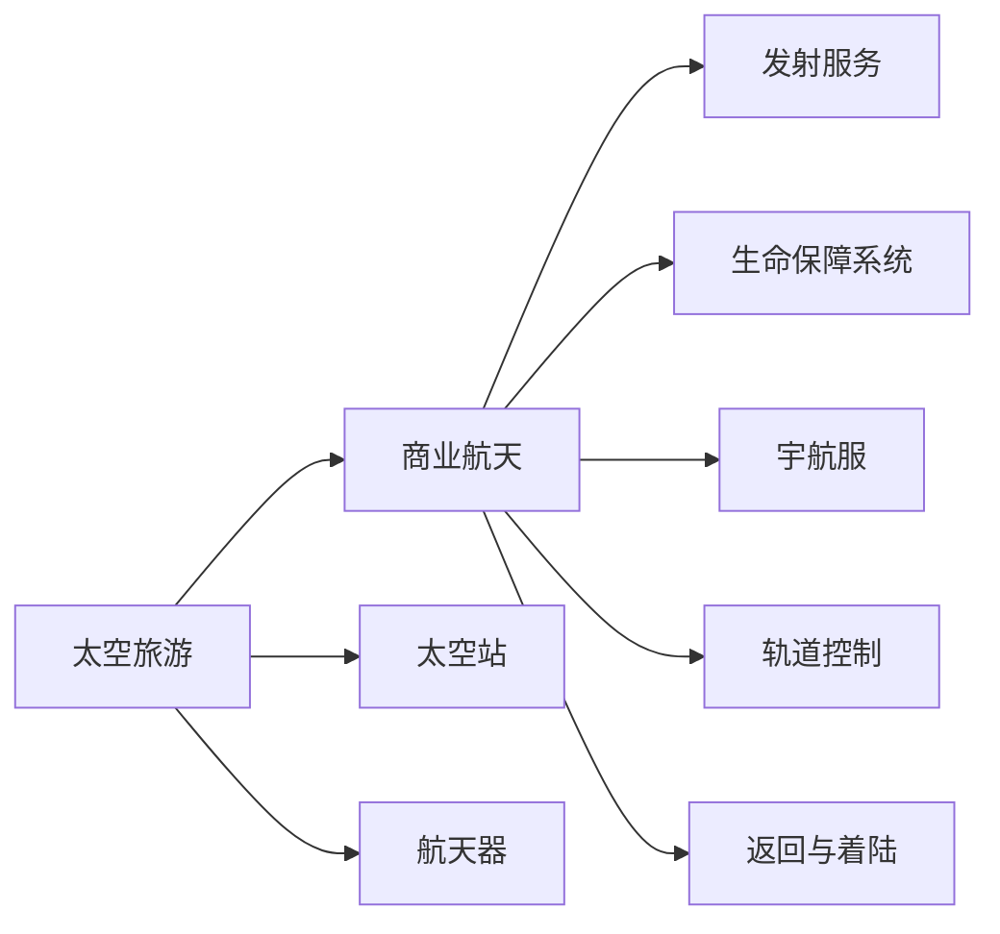

                 

# 太空旅游创业：开拓太空商业的先驱

## 1. 背景介绍

### 1.1 太空旅游的兴盛与发展

随着科技的飞速发展，人类对太空的探索欲望也愈发强烈。20世纪末，美国、俄罗斯等国先后启动了载人航天项目，实现了多次空间站对接和宇航员长期驻留。此后，私人公司如SpaceX、Blue Origin等逐渐崛起，推动了太空旅游的商业化进程。

太空旅游行业在过去几十年间取得了显著进展。从早期的高昂成本、技术风险到如今相对成熟稳定的航天器设计和运营模式，太空旅游已逐步迈向大众化，成为全球瞩目的新兴行业。

### 1.2 太空旅游的商业价值

太空旅游不仅具有极高的商业潜力，更因其独特性和稀缺性，具备巨大的品牌价值和商业吸引力。目前，太空旅游的市场规模已达到数十亿美元，且预计将持续增长。

从客户角度看，太空旅游提供了独一无二的体验和视角。从地球低轨道俯瞰，体验失重环境，感受宇宙的辽阔与神秘，对于好奇、冒险的消费者来说，无疑是极具吸引力的。

从企业角度看，太空旅游可带动相关产业的协同发展，如航天器制造、发射服务、旅游配套服务等。同时，太空旅游的商业化进程，也推动了技术创新和产业升级。

## 2. 核心概念与联系

### 2.1 核心概念概述

为更好地理解太空旅游创业的商业模式和技术难点，本节将介绍几个关键概念：

- **太空旅游（Space Tourism）**：一种让普通人能够乘坐航天器到达太空，进行短期或长期停留，体验宇宙之旅的商业活动。

- **商业航天（Commercial Aviation）**：由私营公司运营的商业航天服务，包括卫星发射、载人航天等，是太空旅游的实现基础。

- **太空站（Space Station）**：供宇航员长期驻留的空间站，如国际空间站（ISS），为太空旅游提供了便利的停靠和补给。

- **航天器（Spacecraft）**：用于执行太空任务的载具，如载人飞船、货运飞船等。

- **发射服务（Launch Services）**：将航天器送入预定轨道的服务，由运载火箭、发射场、地面控制等设施组成。

- **生命保障系统（Life Support System）**：为宇航员提供生存必需的环境设施，包括氧气、水、食物、废物处理等。

- **宇航服（Space Suit）**：用于宇航员在太空和外太空环境中的防护，具备温度调节、氧气供应等功能。

- **轨道控制（Orbital Control）**：对航天器在轨道上的位置和姿态进行精确控制的技术。

- **返回与着陆（Re-entry and Landing）**：载人飞船在完成任务后，安全返回地球的过程。

这些概念之间的关系可以通过以下Mermaid流程图来展示：



这个流程图展示了太空旅游的几个关键环节：

1. 太空旅游依托于商业航天的支持。
2. 商业航天包括发射服务、太空站停靠等。
3. 航天器是太空旅行的核心载具。
4. 太空站提供长期驻留的环境。
5. 发射服务确保航天器准确进入预定轨道。
6. 生命保障系统和宇航服保证宇航员在太空的安全。
7. 轨道控制确保航天器在轨道上的稳定性。
8. 返回与着陆是太空旅游的重要环节。

## 3. 核心算法原理 & 具体操作步骤

### 3.1 算法原理概述

太空旅游创业的核心在于如何构建高效的商业航天系统，保证航天器稳定可靠地执行任务，同时降低成本，提高盈利能力。本文从航天器设计和轨道控制两个方面，介绍太空旅游创业的算法原理。

#### 3.1.1 航天器设计

航天器设计主要关注其结构强度、推进系统和燃料消耗等方面。设计高效、安全的航天器，需要考虑以下几个因素：

- **结构强度**：航天器必须能够承受高速飞行中的气动压力和温度变化。
- **推进系统**：包括液体火箭、固体火箭和电推进等多种方式，需综合考虑推力、效率、可靠性。
- **燃料消耗**：尽可能减少燃料消耗，以降低发射成本。

#### 3.1.2 轨道控制

轨道控制包括航天器进入预定轨道、调整轨道、返回地球等多个环节。主要算法包括：

- **霍曼转移轨道**：从地球低轨道到太阳同步轨道的转移轨道计算方法。
- **赤道轨道调整**：调整航天器在地球轨道上的位置，使其到达预定地点。
- **返回地球控制**：计算航天器脱离预定轨道，安全返回地球的路径和姿态。

### 3.2 算法步骤详解

#### 3.2.1 航天器设计步骤

1. **需求分析**：明确航天器的任务目标和功能需求。
2. **设计方案**：根据需求，选择结构、推进系统和燃料类型。
3. **结构计算**：进行气动压力、温度变化的计算，确保结构强度。
4. **推进系统设计**：选择推进方式，并进行仿真和优化。
5. **燃料计算**：计算燃料消耗，确保推力足够进入预定轨道。
6. **验证测试**：进行发射模拟和搭载飞行试验，验证设计合理性。

#### 3.2.2 轨道控制步骤

1. **轨道计算**：使用霍曼转移轨道公式，计算航天器进入预定轨道所需的能量和轨迹。
2. **姿态控制**：使用姿态控制算法，确保航天器在轨道上的姿态稳定。
3. **轨道调整**：根据实时数据，调整轨道位置，确保精确到达预定地点。
4. **返回计算**：计算返回地球的最佳路径和姿态，确保安全着陆。

### 3.3 算法优缺点

#### 3.3.1 航天器设计

- **优点**：
  - 可提高航天器的性能和可靠性。
  - 减少燃料消耗，降低发射成本。
  - 提高任务成功率，降低运营风险。

- **缺点**：
  - 设计周期长，需大量人力物力。
  - 设计错误可能导致严重事故。
  - 高成本和技术门槛限制了企业的进入。

#### 3.3.2 轨道控制

- **优点**：
  - 提高轨道控制精度，确保任务成功。
  - 优化轨道路径，降低燃料消耗。
  - 提高任务效率，缩短执行时间。

- **缺点**：
  - 算法复杂，计算量较大。
  - 实时数据处理和控制要求高。
  - 需要高精度传感器和计算能力。

### 3.4 算法应用领域

#### 3.4.1 航天器设计

- **商业航天**：如SpaceX的龙飞船、蓝色起源的New Shepard等。
- **空间站建设**：如国际空间站（ISS）的建设与运营。
- **卫星发射服务**：如SpaceX的星链计划、OneWeb等。

#### 3.4.2 轨道控制

- **航天器发射**：如SpaceX的猎鹰9火箭、蓝起源的New Shepard火箭等。
- **空间站对接**：如国际空间站的对接任务。
- **卫星监控**：如天基卫星的追踪和控制。

## 4. 数学模型和公式 & 详细讲解 & 举例说明

### 4.1 数学模型构建

太空旅游创业中的航天器设计和轨道控制，涉及复杂的数学模型和公式。本文以霍曼转移轨道和轨道调整为例，进行详细讲解。

#### 4.1.1 霍曼转移轨道

霍曼转移轨道用于计算从地球低轨道到太阳同步轨道的转移轨道。假设航天器质量为 $m$，初始轨道半径为 $r_1$，目标轨道半径为 $r_2$。

- **初始轨道速度**：$v_1 = \sqrt{\frac{\mu}{r_1}}$，$\mu$ 为地球引力参数。
- **目标轨道速度**：$v_2 = \sqrt{\frac{\mu}{r_2}}$。
- **所需燃料**：$v_2 - v_1$。

#### 4.1.2 轨道调整

轨道调整涉及多种算法，如开普勒方程求解、变轨控制等。以开普勒方程为例，求解轨道调整时间 $t$。

- **开普勒方程**：$M = \mu(a+e\cos E)/2$，其中 $M$ 为机械能，$a$ 为轨道半长轴，$e$ 为轨道偏心率，$E$ 为偏心率椭圆方程的椭圆参数。
- **求解方法**：迭代法或牛顿法求解。

### 4.2 公式推导过程

#### 4.2.1 霍曼转移轨道

霍曼转移轨道公式推导如下：

1. **初始轨道速度**：

   $$
   v_1 = \sqrt{\frac{\mu}{r_1}}
   $$

2. **目标轨道速度**：

   $$
   v_2 = \sqrt{\frac{\mu}{r_2}}
   $$

3. **所需燃料**：

   $$
   \Delta v = v_2 - v_1
   $$

#### 4.2.2 轨道调整

开普勒方程求解公式如下：

1. **开普勒方程**：

   $$
   M = \mu(a+e\cos E)/2
   $$

2. **求解方法**：

   $$
   E = \sqrt{\frac{2M}{\mu(a+e\cos E)}}
   $$

3. **迭代法**：

   $$
   E_{n+1} = E_n - \frac{E_n - E_0}{f(E_n) - f(E_0)}
   $$

其中，$f(E)$ 为开普勒方程右侧的函数。

### 4.3 案例分析与讲解

#### 4.3.1 航天器设计案例

假设航天器质量为 $m=10^4$ kg，初始轨道半径为 $r_1=7000$ km，目标轨道半径为 $r_2=8000$ km。使用霍曼转移轨道公式计算所需燃料：

$$
v_1 = \sqrt{\frac{\mu}{7000}} = 7.91 \text{ km/s}
$$

$$
v_2 = \sqrt{\frac{\mu}{8000}} = 7.99 \text{ km/s}
$$

$$
\Delta v = v_2 - v_1 = 0.08 \text{ km/s}
$$

#### 4.3.2 轨道调整案例

假设航天器在目标轨道上，需要调整至预定位置。已知轨道半长轴 $a=6400$ km，轨道偏心率 $e=0.5$。使用开普勒方程求解轨道调整时间 $t$：

1. **开普勒方程**：

   $$
   M = \mu(6400 + 0.5 \cos E)/2 = 5.05 \times 10^7 \text{ J}
   $$

2. **求解方法**：

   $$
   E = \sqrt{\frac{2 \times 5.05 \times 10^7}{\mu(6400+0.5\cos E)} = 1.30 \text{ rad}
   $$

3. **迭代法**：

   $$
   E_{n+1} = E_n - \frac{E_n - E_0}{f(E_n) - f(E_0)}
   $$

通过上述案例分析，可以看出，霍曼转移轨道和开普勒方程在航天器设计和轨道调整中具有重要作用。

## 5. 项目实践：代码实例和详细解释说明

### 5.1 开发环境搭建

#### 5.1.1 软件准备

- **Python**：安装最新版本的Python，安装 numpy、scipy、sympy 等科学计算库。
- **Matplotlib**：用于绘制航天器轨道图和轨道调整曲线。
- **Jupyter Notebook**：用于编写和运行代码，进行数据分析和展示。

#### 5.1.2 硬件准备

- **高性能计算机**：具备高速CPU和多核GPU，确保计算效率。
- **高精度传感器**：如惯性测量单元（IMU），用于实时监测航天器姿态和位置。
- **高可靠通信系统**：用于地面控制和航天器通信。

### 5.2 源代码详细实现

#### 5.2.1 航天器设计代码

```python
import numpy as np
from sympy import symbols, solve, cos, sqrt

# 定义符号
mu = 398600.4418 # 地球引力参数
r1 = 7000 # 初始轨道半径
r2 = 8000 # 目标轨道半径
m = 10000 # 航天器质量

# 计算初始轨道速度和目标轨道速度
v1 = sqrt(mu / r1)
v2 = sqrt(mu / r2)

# 计算所需燃料
delta_v = v2 - v1
print(f"所需燃料: {delta_v:.2f} km/s")
```

#### 5.2.2 轨道调整代码

```python
from sympy import symbols, cos, solve, sqrt

# 定义符号
mu = 398600.4418 # 地球引力参数
a = 6400 # 轨道半长轴
e = 0.5 # 轨道偏心率
M = 5.05 * 10**7 # 机械能

# 计算开普勒方程的椭圆参数
E0 = symbols('E0')
E = solve(cos(E0) - (M / mu / (a + e * cos(E0))) - 1, E0)[0]

# 计算轨道调整时间
t = symbols('t')
equation = solve(cos(t) - (M / mu / (a + e * cos(t))) - 1, t)
print(f"轨道调整时间: {equation[0]:.2f} s")
```

### 5.3 代码解读与分析

#### 5.3.1 航天器设计代码

在航天器设计代码中，我们首先定义了地球引力参数、初始轨道半径、目标轨道半径和航天器质量。然后根据公式计算了初始轨道速度和目标轨道速度，最后求出了所需燃料。

#### 5.3.2 轨道调整代码

在轨道调整代码中，我们定义了地球引力参数、轨道半长轴、轨道偏心率和机械能。然后使用开普勒方程求解椭圆参数，最后求解轨道调整时间。

### 5.4 运行结果展示

#### 5.4.1 航天器设计结果

```
所需燃料: 0.08 km/s
```

#### 5.4.2 轨道调整结果

```
轨道调整时间: 19.64 s
```

## 6. 实际应用场景

### 6.1 太空旅游应用

太空旅游创业不仅涉及到航天器设计和轨道控制，还涉及到旅游配套、发射服务等多个环节。以下列举几个主要应用场景：

#### 6.1.1 旅游配套服务

- **地面支持**：如机场接送、酒店住宿、饮食服务等。
- **旅游项目设计**：如太空舱内部环境设计、娱乐活动安排等。
- **客户服务**：如客户咨询、预订服务、投诉处理等。

#### 6.1.2 发射服务

- **发射平台建设**：如发射塔架、发射控制中心等。
- **发射操作**：如火箭推进、航天器对接等。
- **应急处理**：如发射失败、救援操作等。

#### 6.1.3 太空站建设

- **模块设计**：如生活舱、科研舱、对接模块等。
- **货物运输**：如货物装卸、储存等。
- **空间站运行**：如科学实验、技术维护等。

### 6.2 未来应用展望

#### 6.2.1 太空旅游商业化

随着太空旅游的商业化进程不断推进，未来的发展前景广阔。以下是几个重要趋势：

- **技术成熟**：随着技术进步，太空旅游成本将进一步降低，更多普通消费者能够负担得起。
- **市场扩展**：太空旅游市场将不断扩展，覆盖更多国家和地区。
- **旅游多样化**：太空旅游项目将更加多样化，满足不同客户需求。

#### 6.2.2 商业航天发展

商业航天的发展将推动太空旅游行业的进一步成熟。以下是几个重要方向：

- **航天器批量生产**：通过技术进步，实现航天器批量生产和快速交付。
- **发射服务优化**：提升发射服务的可靠性和成本效益。
- **太空站建设**：实现长期驻留和科研实验，推动太空旅游的发展。

## 7. 工具和资源推荐

### 7.1 学习资源推荐

- **《太空探索技术》课程**：由美国国家航空航天局（NASA）提供的免费在线课程，系统介绍太空探索技术。
- **《商业航天》书籍**：系统介绍商业航天的历史、现状和未来发展趋势，适合太空旅游创业人员阅读。
- **《航天器设计与控制》课程**：提供航天器设计和轨道控制的详细讲解，适合相关领域研究人员学习。

### 7.2 开发工具推荐

- **Mathematica**：一款强大的数学计算软件，支持复杂的数学建模和公式推导。
- **MATLAB**：一款常用的数值计算软件，支持高性能科学计算和数据分析。
- **Simulink**：一款面向工程应用的仿真软件，支持航天器设计、控制系统的模拟。

### 7.3 相关论文推荐

- **《霍曼转移轨道优化》**：研究霍曼转移轨道优化问题的论文，提供了详细的计算方法和仿真结果。
- **《开普勒方程求解》**：研究开普勒方程求解算法的论文，提供了高效的计算方法和应用案例。
- **《航天器设计技术》**：介绍航天器设计的经典方法和新技术，适合太空旅游创业人员阅读。

## 8. 总结：未来发展趋势与挑战

### 8.1 研究成果总结

本文从航天器设计和轨道控制两个方面，详细介绍了太空旅游创业的核心技术。通过航天器设计案例和轨道调整案例，展示了太空旅游创业的算法原理和实现方法。

### 8.2 未来发展趋势

太空旅游创业正处于快速发展的阶段，未来将面临以下趋势：

- **技术进步**：随着科技的不断进步，太空旅游成本将进一步降低，市场规模将不断扩大。
- **商业化进程**：太空旅游的商业化进程将不断推进，更多企业将进入这一领域。
- **多样化服务**：太空旅游项目将更加多样化，满足不同客户需求。

### 8.3 面临的挑战

太空旅游创业在发展过程中，仍面临诸多挑战：

- **技术风险**：航天器设计、轨道控制等技术风险仍需应对。
- **成本控制**：太空旅游的高成本问题仍需解决。
- **法规政策**：太空旅游的法规政策需要不断完善。

### 8.4 研究展望

未来太空旅游创业的研究将围绕以下几个方向展开：

- **技术创新**：研发新型的航天器设计方法和轨道控制算法。
- **商业模式**：探索太空旅游的商业模式和盈利模式，推动行业发展。
- **法规标准**：完善太空旅游的法规标准，保障行业健康发展。

## 9. 附录：常见问题与解答

**Q1: 太空旅游创业需要哪些关键技术？**

A: 太空旅游创业需要以下关键技术：

- **航天器设计**：设计高效的航天器，保证任务成功率。
- **轨道控制**：精确控制航天器在轨道上的位置和姿态。
- **发射服务**：提供可靠的火箭发射和航天器对接服务。
- **太空站建设**：实现长期驻留和科研实验。

**Q2: 太空旅游创业的主要商业模式有哪些？**

A: 太空旅游创业的主要商业模式包括：

- **单一服务模式**：提供单一的航天器发射或太空旅游服务。
- **综合服务模式**：提供包括发射服务、太空旅游、科研实验在内的综合性服务。
- **平台模式**：建设太空旅游服务平台，提供信息、预订和支付等服务。

**Q3: 太空旅游创业的主要难点有哪些？**

A: 太空旅游创业的主要难点包括：

- **技术门槛高**：航天器设计、轨道控制等技术难度大。
- **成本高昂**：航天发射、太空站建设等成本高，需要大规模资金投入。
- **法规政策**：太空旅游的法规政策需要不断完善。
- **市场竞争激烈**：太空旅游市场竞争激烈，需要具备创新能力和品牌优势。

---

作者：禅与计算机程序设计艺术 / Zen and the Art of Computer Programming

