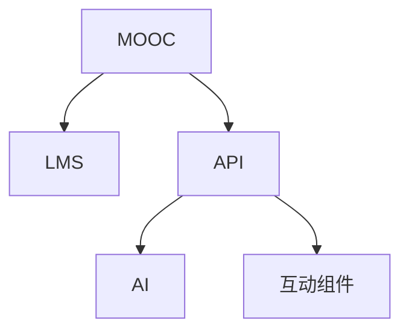

                 

# 如何利用技术能力创建在线课程

## 1. 背景介绍

### 1.1 问题由来

随着技术的发展，在线教育已经从传统的视频课程和图文讲解逐渐发展为集成了丰富互动和智能评估功能的混合式学习平台。这不仅为传统教育注入了新的活力，也为技术开发者提供了广阔的发展空间。如何利用技术能力，创造出更具吸引力和互动性的在线课程，成为教育技术领域的新课题。

### 1.2 问题核心关键点

在线课程的核心在于如何构建有效的教学内容体系，同时通过技术手段提升学生的学习效果和互动体验。关键点包括：

- **内容设计**：课程内容的结构化和系统性，确保知识点的连贯性和逻辑性。
- **技术实现**：通过编程语言、框架和工具实现课程功能的开发。
- **用户交互**：设计互动性强的用户界面和交互机制，提升学习体验。
- **评估反馈**：建立智能评估和反馈系统，及时了解学生的学习进度和问题。

### 1.3 问题研究意义

在线课程的创建不仅为教育资源的大规模共享提供了可能，还为个性化、自适应学习提供了新途径。技术能力在这一过程中起到了至关重要的作用，通过合理的技术架构和高效的工具应用，可以实现从内容创作到用户互动的全链路优化，提升教育质量。

## 2. 核心概念与联系

### 2.1 核心概念概述

在线课程的创建涉及多个核心概念，这些概念相互关联，共同构成了在线教育的完整生态：

- **MOOC（大规模开放在线课程）**：一种开放的学习平台，允许全球的学生免费访问高质量的教学资源。
- **LMS（学习管理系统）**：提供课程创建、发布、管理和评估等功能的教育管理平台。
- **API（应用程序接口）**：用于实现不同系统之间数据交互的标准接口，支持个性化推荐和互动功能。
- **AI（人工智能）**：通过机器学习算法，实现智能推荐、自动评估和个性化辅导。
- **互动组件**：如讨论区、测试题、投票等，增强学习者的互动和参与感。

这些概念之间的逻辑关系可以通过以下Mermaid流程图来展示：



这个流程图展示了MOOC、LMS、API、AI和互动组件之间的关联：

1. MOOC作为课程发布平台，提供课程内容和学习者管理功能。
2. LMS用于课程的创建、发布和管理，是MOOC的核心组件之一。
3. API和AI分别通过数据交互和算法优化，提升了学习过程的个性化和智能化。
4. 互动组件则通过增强用户互动，提升了学习的趣味性和参与度。

## 3. 核心算法原理 & 具体操作步骤
### 3.1 算法原理概述

在线课程的创建涉及多种算法和技术的综合应用，主要包括：

- **课程内容生成算法**：通过自然语言处理(NLP)、数据挖掘等技术，自动生成或推荐课程内容。
- **学习路径规划算法**：使用机器学习算法，根据学生的学习进度和表现，动态调整课程难度和内容。
- **互动组件设计算法**：通过用户行为分析，设计出能够吸引学生、提升参与度的互动组件。
- **智能评估算法**：利用自然语言理解(NLU)和机器学习算法，实现自动化的学习评估和反馈。

这些算法共同作用，构成了在线课程的技术基础。

### 3.2 算法步骤详解

**Step 1: 确定课程目标和内容结构**

1. **目标设定**：根据课程目标，确定课程的核心知识点和技能点。
2. **内容规划**：根据目标，设计课程内容的结构和顺序，确保知识的连贯性和逻辑性。
3. **资源准备**：收集和准备课程所需的教学资源，如视频、PPT、习题等。

**Step 2: 课程内容生成与推荐**

1. **内容生成**：使用NLP技术，自动生成或推荐相关内容。例如，通过语义分析，从海量的文本数据中提取关键信息，生成视频脚本或PPT幻灯片。
2. **内容推荐**：利用协同过滤、内容推荐算法，根据学生的学习历史和兴趣，推荐适合的内容和学习路径。

**Step 3: 学习路径规划**

1. **数据收集**：收集学生的学习进度、成绩、反馈等数据。
2. **模型训练**：使用机器学习算法（如决策树、随机森林等），训练出学习路径规划模型。
3. **路径调整**：根据模型预测，动态调整课程难度和内容，确保学生能够适应挑战，同时避免学习瓶颈。

**Step 4: 互动组件设计**

1. **用户行为分析**：通过数据分析，了解学生对不同互动组件的反馈和参与度。
2. **组件优化**：根据分析结果，设计并优化互动组件，如讨论区、测试题、投票等，提升学生的参与感和互动体验。
3. **集成实现**：将优化后的互动组件集成到LMS平台中，实现用户交互功能。

**Step 5: 智能评估与反馈**

1. **评估模型设计**：设计自然语言理解(NLU)模型，能够识别学生对问题的回答，进行自动化评估。
2. **反馈机制建立**：建立反馈系统，根据评估结果和学生反馈，调整学习内容和进度。
3. **数据分析与报告**：定期收集和分析学生数据，生成学习报告，帮助教师和学生了解学习进展和问题。

### 3.3 算法优缺点

**优点**：

- **高效生成内容**：利用算法和技术自动生成和推荐课程内容，节省大量人力成本。
- **个性化学习**：通过数据驱动的学习路径规划和互动组件设计，提升学生的学习体验和效果。
- **实时评估与反馈**：智能评估和反馈系统，能够及时了解学生的学习进度和问题，提供个性化辅导。

**缺点**：

- **数据依赖性强**：课程内容和推荐系统的效果依赖于高质量的数据，数据质量直接影响系统的准确性和有效性。
- **算法复杂度高**：涉及自然语言处理、机器学习等多种算法，需要较高的技术门槛和计算资源。
- **个性化差异**：算法设计需要考虑不同学生的需求和背景，难以实现完全个性化的学习路径和内容。

### 3.4 算法应用领域

在线课程的创建涉及多个应用领域，包括但不限于：

- **K-12教育**：为中小学生提供个性化和自适应的学习资源。
- **高等教育**：为大学生提供灵活的自学和选修课程。
- **职业培训**：为企业员工提供技能培训和专业认证课程。
- **终身学习**：为成人提供灵活的学习机会和技能提升课程。

## 4. 数学模型和公式 & 详细讲解 & 举例说明

### 4.1 数学模型构建

在线课程的创建涉及多个数学模型的构建，主要包括：

- **课程内容生成模型**：如文本生成模型、图像生成模型等，用于自动生成课程内容。
- **学习路径规划模型**：如决策树模型、神经网络模型等，用于预测和调整学习路径。
- **互动组件设计模型**：如协同过滤模型、推荐系统等，用于设计互动组件。
- **智能评估模型**：如自然语言理解模型、情感分析模型等，用于自动化评估和反馈。

### 4.2 公式推导过程

以**自然语言理解(NLU)模型**为例，推导其基本框架和核心公式：

**目标**：给定一段文本，预测其中包含的情感倾向。

**输入**：文本$X$。

**输出**：情感类别$Y$。

**模型**：使用卷积神经网络(CNN)或循环神经网络(RNN)，构建情感分析模型。

**公式**：

$$
f(X; \theta) = \sigma(W_{out} tanh(W_{emb} X + b_{emb})) + b_{out}
$$

其中，$f$为预测函数，$\sigma$为激活函数，$W_{out}$、$b_{out}$为输出层的权重和偏置，$W_{emb}$、$b_{emb}$为嵌入层的权重和偏置。

**推导**：

1. **输入层**：将文本$X$转换为向量表示，即$X = X_{emb}$。
2. **嵌入层**：通过嵌入层，将向量$X_{emb}$映射为高维空间中的向量表示$X_{emb}$。
3. **隐藏层**：使用卷积神经网络或循环神经网络，对嵌入层的输出进行特征提取。
4. **输出层**：使用全连接层，对隐藏层的特征进行分类，输出情感类别$Y$。

### 4.3 案例分析与讲解

以**智能推荐系统**为例，展示其实现过程和效果：

1. **数据准备**：收集学生的学习历史和行为数据，如课程观看次数、测试成绩等。
2. **特征提取**：使用TF-IDF、Word2Vec等技术，提取文本和行为数据的特征。
3. **模型训练**：使用协同过滤算法，训练推荐模型。
4. **推荐实现**：根据学生当前的学习状态和历史行为，推荐适合的下一条课程或习题。

## 5. 项目实践：代码实例和详细解释说明

### 5.1 开发环境搭建

进行在线课程开发前，需要准备以下开发环境：

1. **编程语言**：Python。
2. **框架**：Django、Flask、FastAPI等。
3. **数据库**：MySQL、PostgreSQL等。
4. **版本控制**：Git。
5. **测试框架**：pytest。

### 5.2 源代码详细实现

以下是一个简单的在线课程开发示例，展示如何使用Python和Django框架构建课程发布和管理平台：

```python
# 课程模型定义
class Course(models.Model):
    name = models.CharField(max_length=255)
    description = models.TextField()
    start_date = models.DateField()
    end_date = models.DateField()
    instructor = models.ForeignKey(Instructor, on_delete=models.CASCADE)

# 学习路径规划算法
def get_course_path(course_id, user_id):
    # 根据用户学习历史和课程内容，生成推荐路径
    # 返回推荐路径列表
    pass

# 互动组件设计算法
def create_discussion_topic(course_id, topic_name):
    # 创建讨论主题，并将主题添加到课程中
    # 返回讨论主题ID
    pass

# 智能评估算法
def evaluate_answer(answer, course_id):
    # 对学生的回答进行自动评估，并返回评估结果
    # 返回评估结果字典
    pass
```

### 5.3 代码解读与分析

**Course模型**：

- `name`：课程名称，用于展示和搜索。
- `description`：课程描述，提供详细课程信息。
- `start_date`：课程开始时间。
- `end_date`：课程结束时间。
- `instructor`：课程讲师，用于课程管理和授权。

**get_course_path函数**：

- 根据用户的学习历史和课程内容，生成推荐路径，以辅助学习。

**create_discussion_topic函数**：

- 设计并创建讨论主题，增强学生互动和参与感。

**evaluate_answer函数**：

- 使用自然语言理解(NLU)模型，对学生的回答进行自动评估。

### 5.4 运行结果展示

在完成开发和部署后，可以在浏览器中访问在线课程平台，体验以下功能：

- **课程浏览**：浏览所有课程，了解课程内容和讲师信息。
- **课程报名**：选择课程并报名，获取学习权限。
- **课程学习**：观看视频、阅读教材、完成习题等。
- **讨论区**：参与讨论主题，与其他学生互动交流。
- **测试评估**：完成课程测试，获得自动评估和反馈。

## 6. 实际应用场景

### 6.1 智能招聘培训

在线课程可以为招聘公司提供定制化的培训课程，通过智能推荐和互动组件，提升培训效果。例如，针对某一职位的特定技能点，自动生成和推荐相关的课程内容，并通过智能评估系统，实时了解学员的学习进展和问题，提供个性化的辅导。

### 6.2 技能提升平台

在线课程平台为个人提供灵活的学习机会，通过智能推荐系统，推荐适合的技能提升课程。例如，针对编程语言、数据分析、项目管理等技能点，提供多种课程选择，并通过互动组件设计，增强学习的趣味性和参与感。

### 6.3 企业内训

在线课程平台为企业提供灵活的内训方案，通过智能推荐和互动组件，提升员工的学习效果。例如，针对特定岗位的技能要求，设计定制化的内训课程，并通过智能评估系统，实时了解员工的学习进展和问题，提供个性化的辅导。

### 6.4 未来应用展望

随着技术的进步，在线课程的创建将更加智能化、个性化和多样化。未来，我们可以期待以下发展趋势：

1. **全栈式开发**：整合多种技术栈，实现课程内容、学习路径、互动组件等全链路优化。
2. **跨平台学习**：支持移动端和PC端的学习，提供无缝的跨平台学习体验。
3. **AR/VR应用**：结合增强现实和虚拟现实技术，提供沉浸式的学习体验。
4. **AI辅助教学**：通过AI技术，实现自动化的内容生成、推荐和评估。
5. **大数据分析**：利用大数据技术，分析学生的学习行为和效果，提供更精准的学习建议和辅导。

## 7. 工具和资源推荐

### 7.1 学习资源推荐

- **Coursera、edX、Udemy**：提供丰富的在线课程资源，涵盖多个领域和技能点。
- **Kaggle**：提供数据科学竞赛平台，通过参与竞赛提升技能。
- **MIT OpenCourseWare**：提供MIT的开放课程资源，涵盖多个学科领域。

### 7.2 开发工具推荐

- **Django、Flask、FastAPI**：主流Web开发框架，支持快速搭建在线课程平台。
- **MySQL、PostgreSQL**：主流关系型数据库，支持高效的数据管理和查询。
- **Jupyter Notebook**：支持数据科学和机器学习的开发和研究。
- **Git、GitHub**：版本控制和代码托管平台，支持团队协作和代码共享。

### 7.3 相关论文推荐

- **Deep Learning for Personalized Online Learning**：探讨深度学习在个性化在线学习中的应用。
- **Designing Interactive Educational Systems**：介绍交互式教育系统的设计原理和实现方法。
- **Automated Recommendation Systems for Online Education**：介绍在线教育推荐系统的实现和优化。

## 8. 总结：未来发展趋势与挑战

### 8.1 研究成果总结

在线课程的创建涉及多种技术手段和算法，通过合理的技术架构和高效的工具应用，可以实现从内容创作到用户互动的全链路优化，提升教育质量。目前，在线课程已经在多个领域得到了广泛应用，包括K-12教育、高等教育、职业培训等。

### 8.2 未来发展趋势

未来的在线课程将更加智能化、个性化和多样化，主要发展趋势包括：

1. **全栈式开发**：整合多种技术栈，实现课程内容、学习路径、互动组件等全链路优化。
2. **跨平台学习**：支持移动端和PC端的学习，提供无缝的跨平台学习体验。
3. **AR/VR应用**：结合增强现实和虚拟现实技术，提供沉浸式的学习体验。
4. **AI辅助教学**：通过AI技术，实现自动化的内容生成、推荐和评估。
5. **大数据分析**：利用大数据技术，分析学生的学习行为和效果，提供更精准的学习建议和辅导。

### 8.3 面临的挑战

尽管在线课程已经取得了不少进展，但在迈向更加智能化、普适化应用的过程中，仍面临诸多挑战：

1. **数据隐私和安全**：学生数据的安全和隐私保护是重中之重，需要采取有效的措施保障数据安全。
2. **技术标准化**：在线课程平台需要遵循统一的标准和规范，确保数据和功能的互操作性。
3. **用户体验设计**：设计出易于使用、功能完备的用户界面，提升用户的学习体验。
4. **算法公平性**：避免算法偏见和歧视，确保推荐系统和评估系统的公平性和公正性。
5. **资源投入和成本**：高质量的在线课程需要大量的人力、物力和财力投入，如何平衡成本和效果，是一个重要的课题。

### 8.4 研究展望

未来的在线课程研究需要在以下几个方面寻求新的突破：

1. **数据增强技术**：通过数据增强技术，丰富课程内容和评估方法，提升课程效果。
2. **自适应学习模型**：构建自适应学习模型，根据学生的学习进展和反馈，动态调整学习路径和内容。
3. **个性化推荐系统**：引入深度学习、协同过滤等算法，提升个性化推荐系统的准确性和效率。
4. **多模态学习**：结合图像、音频等多模态数据，提供更丰富、更全面的学习体验。
5. **虚拟助教**：利用AI技术，开发虚拟助教系统，提供24小时在线辅导和答疑服务。

这些研究方向的探索，必将引领在线课程技术迈向更高的台阶，为教育质量和效率的提升提供新的动力。

## 9. 附录：常见问题与解答

**Q1：在线课程的开发难点有哪些？**

A: 在线课程的开发难点主要包括以下几个方面：

1. **内容创作**：如何高效、系统地生成高质量的课程内容，是开发过程中最大的挑战。
2. **用户互动**：设计具有互动性的学习组件，提升用户的学习体验和参与感。
3. **智能评估**：开发智能评估系统，实现自动化的学习评估和反馈。
4. **数据安全和隐私**：保障用户数据的安全和隐私，是开发过程中必须严格遵守的法规要求。

**Q2：如何提升在线课程的学习效果？**

A: 提升在线课程的学习效果，可以从以下几个方面入手：

1. **个性化学习路径**：根据学生的学习进度和反馈，动态调整学习路径和内容，确保学生能够适应挑战。
2. **互动组件设计**：设计互动性强、趣味性高的学习组件，增强学生的参与感和兴趣。
3. **智能评估系统**：利用自然语言理解(NLU)和机器学习算法，实现自动化的学习评估和反馈，及时了解学生的学习进展和问题。
4. **持续改进**：通过数据分析和反馈，不断优化课程内容和评估方法，提升课程效果。

**Q3：在线课程开发中，哪些技术是必不可少的？**

A: 在线课程开发中，以下技术是必不可少的：

1. **编程语言**：Python是主流编程语言，支持快速开发和调试。
2. **Web框架**：Django、Flask、FastAPI等框架，提供高效、安全的Web开发解决方案。
3. **数据库**：MySQL、PostgreSQL等关系型数据库，支持高效的数据管理和查询。
4. **版本控制**：Git和GitHub，支持团队协作和代码共享。
5. **测试框架**：pytest等测试框架，保障代码质量和稳定性。

**Q4：如何设计有效的在线课程内容？**

A: 设计有效的在线课程内容，可以从以下几个方面入手：

1. **结构化内容**：将课程内容结构化，确保知识点的连贯性和逻辑性。
2. **多媒体资源**：使用视频、PPT、习题等多种形式的资源，增强课程的互动性和趣味性。
3. **多样化评估**：结合自测、讨论、项目等多种评估方式，全面了解学生的学习效果。
4. **持续更新**：定期更新课程内容，保持课程的时效性和相关性。

---

作者：禅与计算机程序设计艺术 / Zen and the Art of Computer Programming

