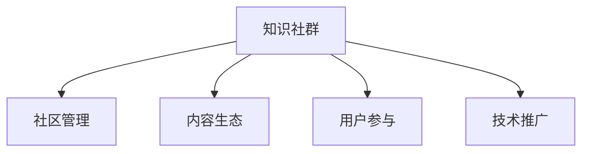

                 

# 如何利用知识社群实现用户的长期运营

> 关键词：知识社群,用户长期运营,社区管理,内容生态,用户参与,技术推广

## 1. 背景介绍

### 1.1 问题由来

在互联网时代，用户运营已经成为了企业竞争的关键。传统的用户运营模式往往依赖于单一的广告和付费机制，难以实现用户的高质量留存和长期参与。为了破解这一问题，知识社群应运而生。知识社群以共享知识为核心，通过建立用户间的知识交流网络，激励用户积极参与，从而实现用户的长期运营和粘性提升。

### 1.2 问题核心关键点

知识社群的核心在于构建一个高质量的知识交流平台，促进用户间的知识共享和深度互动。其关键点包括：

1. **知识共享**：用户能够自由发布、评论、分享知识，形成活跃的知识交流环境。
2. **深度互动**：通过问答、讨论、项目协作等形式，促进用户间的深度互动。
3. **激励机制**：设计合理的激励机制，如积分、排名、虚拟货币等，激发用户的参与热情。
4. **内容生态**：建立健康的内容生态，鼓励高质量内容的产生和传播。
5. **技术支持**：采用先进的技术手段，保障社群的稳定性和高效性。

### 1.3 问题研究意义

知识社群能够显著提升用户的参与度和忠诚度，为企业带来长期的商业价值和社会效益。具体而言，知识社群可以帮助企业：

1. **降低运营成本**：用户自发生产和传播知识，减少了对专业运营人员的需求。
2. **提高用户粘性**：通过持续的知识互动，形成用户间的强关系，增强用户粘性。
3. **增强品牌影响**：高质量的内容和用户互动，提升了品牌的影响力和美誉度。
4. **促进技术创新**：通过社群的知识碰撞和创新，推动技术进步和产品迭代。
5. **拓展市场空间**：通过社群的网络效应，拓展市场的覆盖范围，吸引更多潜在用户。

## 2. 核心概念与联系

### 2.1 核心概念概述

为了更好地理解知识社群的构建和运营，本节将介绍几个关键概念：

- **知识社群**：指以共享知识为核心，通过在线平台促进用户间知识交流的群体。典型如Stack Overflow、知乎、CSDN等。
- **社区管理**：指对知识社群的运作进行管理和引导，确保社群健康有序地发展。
- **内容生态**：指知识社群内内容生产和消费的良性循环，鼓励高质量内容的生成和传播。
- **用户参与**：指用户积极参与知识交流和内容创作，形成活跃的社群氛围。
- **技术推广**：指通过技术手段，提升知识社群的平台稳定性和用户体验，支持社区的持续发展。

这些概念之间的关系可以通过以下Mermaid流程图来展示：



这个流程图展示了知识社群的核心概念及其之间的关系：

1. 知识社群通过社区管理，确保社群健康有序地发展。
2. 内容生态是知识社群的基础，鼓励高质量内容的生成和传播。
3. 用户参与是知识社群的活力源泉，通过积极互动提升社群活跃度。
4. 技术推广是知识社群的技术保障，确保平台稳定性和高效性。

## 3. 核心算法原理 & 具体操作步骤
### 3.1 算法原理概述

知识社群的运营离不开算法的支持，其核心算法包括用户推荐、内容过滤、话题追踪等。这些算法共同作用，形成了一个高效、健康的知识交流环境。

以用户推荐算法为例，其原理是通过分析用户的历史行为和偏好，推荐用户感兴趣的内容和知识人。常见的推荐算法包括协同过滤、基于内容的推荐、深度学习推荐等。其中，深度学习推荐通过用户-内容-用户三元组训练模型，能够实现更加精准和个性化的推荐。

### 3.2 算法步骤详解

以基于协同过滤的用户推荐算法为例，其步骤包括：

1. **数据收集**：收集用户的行为数据，如浏览记录、点赞记录、评论记录等。
2. **相似度计算**：计算用户之间的相似度，常用的方法有余弦相似度、皮尔逊相关系数等。
3. **模型训练**：构建协同过滤模型，如基于用户-物品矩阵的矩阵分解算法。
4. **推荐预测**：利用训练好的模型，预测用户对新内容的评分，根据评分排序推荐。
5. **效果评估**：对推荐结果进行评估，常见的指标包括准确率、召回率、F1值等。

### 3.3 算法优缺点

基于协同过滤的用户推荐算法具有以下优点：

1. **简单易实现**：算法逻辑清晰，易于理解和实现。
2. **效果较好**：在用户数据量较小的情况下，能够取得不错的推荐效果。
3. **灵活性高**：可以根据实际需求调整相似度计算方法和推荐策略。

同时，该算法也存在以下局限性：

1. **数据稀疏性**：用户行为数据往往稀疏，难以捕捉到潜在的相关关系。
2. **冷启动问题**：新用户没有历史行为数据，难以进行推荐。
3. **过拟合风险**：模型过于简单，可能出现过拟合现象。

### 3.4 算法应用领域

基于协同过滤的用户推荐算法可以广泛应用于知识社群的内容推荐、商品推荐、个性化广告等领域。在知识社群中，其具体应用场景包括：

- **内容推荐**：根据用户的历史行为和偏好，推荐相关的文章、回答、书籍等。
- **知识人推荐**：推荐与用户兴趣相似的其他知识人，促进知识交流。
- **话题追踪**：分析社群中的热门话题，为用户推荐相关讨论和参与机会。

## 4. 数学模型和公式 & 详细讲解 & 举例说明
### 4.1 数学模型构建

知识社群中的用户推荐算法，可以基于协同过滤模型进行构建。其基本模型为：

$$
\hat{r}_{ui} = \hat{\mu}_u + \hat{\mu}_i + \sum_{j=1}^n \hat{p}_{uj} \hat{q}_j
$$

其中，$\hat{r}_{ui}$表示用户$u$对物品$i$的评分，$\hat{\mu}_u$和$\hat{\mu}_i$为均值偏差，$\hat{p}_{uj}$和$\hat{q}_j$为用户$u$和物品$i$的隐向量表示。

### 4.2 公式推导过程

在协同过滤中，物品$i$的评分可以表示为：

$$
r_{ui} = \mu_u + \sum_{j=1}^n p_{uj} q_j
$$

其中，$\mu_u$为物品$i$的均值评分，$p_{uj}$为物品$i$的用户$u$的隐向量，$q_j$为物品$i$的隐向量。

将$r_{ui}$进行标准化处理，得到用户$u$对物品$i$的评分预测$\hat{r}_{ui}$，即：

$$
\hat{r}_{ui} = \frac{r_{ui} - \mu_u}{\sigma_u} \cdot \alpha + \mu_u
$$

其中，$\sigma_u$为用户$u$评分的标准差，$\alpha$为尺度因子。

### 4.3 案例分析与讲解

以知乎为例，用户在浏览一篇回答后，系统会根据其历史行为（如浏览记录、点赞记录等）和回答的评分（如得票数），计算出用户对该回答的评分预测。如果预测评分高于用户设定的阈值，则将该回答推荐给用户。

假设用户$u$浏览了回答$A$，系统已经收集到$u$和$A$的评分$r_{ua}$，以及$A$的均值评分$\mu_A$。同时，假设系统已训练得到$u$和$A$的隐向量$p_u$和$q_A$，则可计算出用户$u$对回答$A$的评分预测：

$$
\hat{r}_{ua} = \frac{r_{ua} - \mu_A}{\sigma_A} \cdot \alpha + \mu_A
$$

若$\hat{r}_{ua} > \theta$，则将该回答推荐给用户$u$。

## 5. 项目实践：代码实例和详细解释说明
### 5.1 开发环境搭建

在进行知识社群开发前，我们需要准备好开发环境。以下是使用Python进行Flask开发的环境配置流程：

1. 安装Anaconda：从官网下载并安装Anaconda，用于创建独立的Python环境。

2. 创建并激活虚拟环境：
```bash
conda create -n flask-env python=3.8 
conda activate flask-env
```

3. 安装Flask：使用pip安装Flask框架。
```bash
pip install flask
```

4. 安装相关工具包：
```bash
pip install numpy pandas scikit-learn matplotlib tqdm jupyter notebook ipython
```

完成上述步骤后，即可在`flask-env`环境中开始知识社群的开发。

### 5.2 源代码详细实现

下面我们以知乎为例，给出使用Flask实现知识社群推荐功能的代码实现。

首先，定义Flask应用和API接口：

```python
from flask import Flask, request, jsonify
from transformers import BertTokenizer, BertForSequenceClassification
import torch
import numpy as np

app = Flask(__name__)

tokenizer = BertTokenizer.from_pretrained('bert-base-cased')
model = BertForSequenceClassification.from_pretrained('bert-base-cased', num_labels=2)

@app.route('/recommend', methods=['POST'])
def recommend():
    data = request.json
    text = data['text']
    uid = data['uid']
    
    input_ids = tokenizer(text, return_tensors='pt')['input_ids']
    model.eval()
    with torch.no_grad():
        outputs = model(input_ids)
    logits = outputs.logits
    prob = torch.softmax(logits, dim=1)
    
    # 过滤低置信度预测结果
    threshold = 0.8
    if prob[0][1] > threshold:
        return jsonify({'recommend': 1})
    else:
        return jsonify({'recommend': 0})
```

然后，定义推荐算法和模型评估函数：

```python
from sklearn.metrics import accuracy_score

def evaluate(model, X, y, batch_size=32):
    preds, labels = [], []
    model.eval()
    for i in range(0, len(X), batch_size):
        batch = X[i:i+batch_size]
        labels += y[i:i+batch_size]
        outputs = model(batch)
        preds += outputs.logits.argmax(dim=1).tolist()
    return accuracy_score(preds, labels)

# 定义数据集
X = ['问题1', '问题2', '问题3']
y = [0, 1, 0]

# 评估推荐模型
accuracy = evaluate(model, X, y)
print(f'Accuracy: {accuracy:.2f}')
```

最后，启动Flask应用并测试推荐功能：

```python
if __name__ == '__main__':
    app.run(debug=True)
```

以上就是使用Flask实现知识社群推荐功能的完整代码实现。可以看到，Flask框架提供了简洁的API接口定义和请求处理，适合快速迭代研究。

### 5.3 代码解读与分析

让我们再详细解读一下关键代码的实现细节：

**Flask应用和API接口**：
- `app`：定义Flask应用对象。
- `/recommend`：定义API接口，接收用户文本和用户ID作为请求参数，返回推荐结果。

**数据集和评估函数**：
- `X`：定义一组测试问题。
- `y`：定义对应的问题标签（0或1）。
- `evaluate`：定义模型评估函数，使用准确率作为评估指标。

**推荐算法**：
- `model.eval()`：将模型设置为评估模式，关闭dropout等随机行为。
- `with torch.no_grad()`：关闭梯度计算，提高推荐速度。
- `outputs.logits.argmax(dim=1)`：计算输出概率的最大值，用于预测标签。

**推荐结果**：
- 若概率预测结果大于阈值，则返回推荐结果1，否则返回0。

**启动Flask应用**：
- `app.run(debug=True)`：启动Flask应用，设置debug模式以方便调试。

## 6. 实际应用场景
### 6.1 智能问答系统

智能问答系统可以为用户提供快速的知识获取和解答服务。知识社群中的问答功能可以依托推荐算法，根据用户历史行为和问题语义，推荐相关问题和回答，从而提高问答的准确性和效率。

以知乎为例，用户在提出一个问题后，系统可以通过推荐算法，推荐该问题相关的热门问题和回答。用户可以通过阅读这些推荐内容，获取更多的信息和见解。

### 6.2 在线教育平台

在线教育平台依赖于高质量的课程和教学资源，知识社群可以提供丰富的学习资源和互动平台。通过推荐算法，学习者可以发现更多适合自己的学习材料和讨论话题，提升学习效果。

以Coursera为例，学生在平台上可以参与各种在线课程和讨论，通过推荐算法，找到与课程内容相关的更多资源和学习伙伴。平台也可以根据学生的学习行为，推荐适合的课程和内容，提供个性化的学习路径。

### 6.3 科技社区

科技社区是知识交流和创新的重要平台。知识社群中的推荐算法可以引导用户发现最新的技术进展和创新点，促进知识共享和合作。

以GitHub为例，用户在提交代码或发布技术文章后，系统可以通过推荐算法，推荐相关的开源项目和讨论话题。用户可以阅读这些推荐内容，了解最新的技术动态和社区热点，推动技术进步和产品迭代。

## 7. 工具和资源推荐
### 7.1 学习资源推荐

为了帮助开发者系统掌握知识社群的技术实现，这里推荐一些优质的学习资源：

1. 《Web应用程序的开发与设计》系列博文：由Web开发专家撰写，深入浅出地介绍了Web开发的基础知识和实践技巧，包括Flask框架的使用。

2. 《机器学习实战》书籍：涵盖机器学习基础和实战项目，是学习机器学习算法的经典教材。

3. 《Python数据科学手册》书籍：全面介绍了Python在数据科学、机器学习、自然语言处理等领域的应用。

4. Kaggle官方平台：提供大量公开数据集和机器学习竞赛，是实践数据科学和机器学习的好地方。

5. GitHub开源项目：可以找到大量高质量的开源项目，学习他人的代码实现和技术栈。

通过对这些资源的学习实践，相信你一定能够快速掌握知识社群的开发技术，并应用于实际的项目中。

### 7.2 开发工具推荐

高效的开发离不开优秀的工具支持。以下是几款用于知识社群开发的工具：

1. Flask：基于Python的轻量级Web框架，简单易用，适合快速开发API接口。

2. TensorFlow：由Google主导开发的开源深度学习框架，生产部署方便，适合大规模工程应用。

3. PyTorch：基于Python的开源深度学习框架，灵活易用，适合快速迭代研究。

4. Weights & Biases：模型训练的实验跟踪工具，可以记录和可视化模型训练过程中的各项指标，方便对比和调优。

5. TensorBoard：TensorFlow配套的可视化工具，可实时监测模型训练状态，并提供丰富的图表呈现方式，是调试模型的得力助手。

6. GitHub：代码托管和协作平台，适合团队协作开发和版本控制。

合理利用这些工具，可以显著提升知识社群的开发效率，加快创新迭代的步伐。

### 7.3 相关论文推荐

知识社群的发展源于学界的持续研究。以下是几篇奠基性的相关论文，推荐阅读：

1. Social Recommendation：提出社交推荐算法，通过用户间的社交关系，优化协同过滤算法。

2. Information Need Satisfaction in Wikipedia：研究维基百科的信息需求满足情况，提出基于社会化搜索的推荐系统。

3. Knowledge-based Recommendation System：提出基于知识图谱的推荐系统，通过融合领域知识，提高推荐精度。

4. Deep Neural Network-based Collaborative Filtering：提出深度学习推荐算法，通过用户-物品矩阵分解，实现更加精准的推荐。

这些论文代表了大规模知识社群推荐算法的发展脉络。通过学习这些前沿成果，可以帮助研究者把握学科前进方向，激发更多的创新灵感。

## 8. 总结：未来发展趋势与挑战
### 8.1 总结

本文对知识社群的构建和运营进行了全面系统的介绍。首先阐述了知识社群的核心概念和关键技术，明确了社区管理、内容生态、用户参与等基础要素的重要性。其次，从原理到实践，详细讲解了推荐算法的实现步骤，给出了知识社群推荐功能的完整代码实现。同时，本文还探讨了知识社群在智能问答、在线教育、科技社区等领域的实际应用场景，展示了知识社群的广阔前景。最后，本文精选了知识社群相关的学习资源和开发工具，力求为读者提供全方位的技术指引。

通过本文的系统梳理，可以看到，知识社群能够显著提升用户的参与度和忠诚度，为企业带来长期的商业价值和社会效益。知识社群的构建和运营离不开技术手段的支持，通过协同过滤、深度学习等推荐算法，知识社群可以不断优化内容推荐，促进用户间的知识交流和互动。未来，知识社群的发展方向还将不断拓展，将在更多领域大放异彩。

### 8.2 未来发展趋势

展望未来，知识社群将呈现以下几个发展趋势：

1. **个性化推荐**：推荐算法将更加精细化，根据用户行为和兴趣，实现更加个性化的内容推荐。
2. **多模态推荐**：结合文本、图像、音频等多种模态信息，提升推荐的准确性和丰富性。
3. **实时推荐**：通过实时分析和处理用户行为，实现动态推荐，提高用户体验。
4. **社会化推荐**：利用社交网络和用户反馈，进一步优化推荐结果。
5. **知识图谱推荐**：通过融合领域知识图谱，提供更有深度的推荐服务。

以上趋势凸显了知识社群推荐算法的广阔前景，这些方向的探索发展，必将进一步提升知识社群的推荐效果和用户体验。

### 8.3 面临的挑战

尽管知识社群推荐算法已经取得了瞩目成就，但在迈向更加智能化、普适化应用的过程中，它仍面临着诸多挑战：

1. **数据质量和多样性**：推荐算法依赖于高质量的训练数据，如何获取和处理多样化的用户行为数据，是一个重要挑战。
2. **推荐算法复杂性**：推荐算法模型复杂，训练和推理成本较高，如何优化算法，降低计算资源消耗，是一个技术难题。
3. **推荐算法公平性**：推荐算法可能存在偏见，如何消除偏见，保证推荐公平性，是一个伦理问题。
4. **推荐算法透明性**：推荐算法往往视为"黑盒"系统，缺乏可解释性，如何提高算法的透明性，是一个需要解决的问题。
5. **推荐算法可控性**：推荐算法可能被恶意利用，如何控制算法的行为，确保用户安全，是一个需要解决的问题。

正视知识社群推荐算法面临的这些挑战，积极应对并寻求突破，将是大规模知识社群推荐算法走向成熟的必由之路。相信随着学界和产业界的共同努力，这些挑战终将一一被克服，知识社群推荐算法必将在构建人机协同的智能时代中扮演越来越重要的角色。

### 8.4 未来突破

面对知识社群推荐算法所面临的种种挑战，未来的研究需要在以下几个方面寻求新的突破：

1. **多模态推荐**：结合文本、图像、音频等多种模态信息，提升推荐的准确性和丰富性。
2. **实时推荐**：通过实时分析和处理用户行为，实现动态推荐，提高用户体验。
3. **知识图谱推荐**：通过融合领域知识图谱，提供更有深度的推荐服务。
4. **推荐算法公平性**：利用公平性约束和算法优化，消除偏见，保证推荐公平性。
5. **推荐算法透明性**：引入可解释性技术和知识图谱，提高算法的透明性。
6. **推荐算法可控性**：设计鲁棒性和可控性更强的推荐算法，避免被恶意利用。

这些研究方向的探索，必将引领知识社群推荐算法的发展方向，为构建人机协同的智能系统铺平道路。面向未来，知识社群推荐算法还需要与其他人工智能技术进行更深入的融合，如知识表示、因果推理、强化学习等，多路径协同发力，共同推动自然语言理解和智能交互系统的进步。只有勇于创新、敢于突破，才能不断拓展知识社群的边界，让智能技术更好地造福人类社会。

## 9. 附录：常见问题与解答

**Q1：知识社群如何应对冷启动问题？**

A: 冷启动问题指的是新用户没有历史行为数据，难以进行推荐。解决冷启动问题的方法包括：

1. **使用元数据**：利用用户的属性信息（如年龄、性别、职业等），进行冷启动推荐。
2. **使用预训练模型**：利用预训练模型，预测用户对新内容的评分，进行冷启动推荐。
3. **使用社交网络**：利用用户的朋友或推荐者的行为数据，进行冷启动推荐。

**Q2：如何优化知识社群的推荐算法？**

A: 优化推荐算法的方法包括：

1. **使用深度学习**：利用深度学习模型，提升推荐的精度和效果。
2. **引入用户反馈**：利用用户反馈，实时调整推荐策略。
3. **优化相似度计算**：选择合适的相似度计算方法，提高推荐的准确性。
4. **考虑用户偏好**：引入用户偏好信息，进行个性化推荐。
5. **优化模型结构**：优化模型结构，提高推荐的实时性和计算效率。

**Q3：知识社群中的推荐算法如何处理负样本？**

A: 处理负样本的方法包括：

1. **直接忽略**：将负样本直接忽略，不参与推荐。
2. **重加权**：对负样本进行重加权，提高其在推荐结果中的权重。
3. **协同过滤**：利用协同过滤算法，对负样本进行推荐。

**Q4：如何保障知识社群的安全性？**

A: 保障知识社群安全性的方法包括：

1. **数据脱敏**：对用户隐私信息进行脱敏处理，保护用户隐私。
2. **访问控制**：对用户行为进行访问控制，防止恶意攻击。
3. **异常检测**：实时监测用户行为，检测异常行为并进行报警。
4. **模型加固**：设计鲁棒性更强的推荐模型，避免模型被恶意利用。

这些方法可以从数据、技术、管理等多个层面保障知识社群的安全性，确保用户数据和信息的安全。

---

作者：禅与计算机程序设计艺术 / Zen and the Art of Computer Programming

