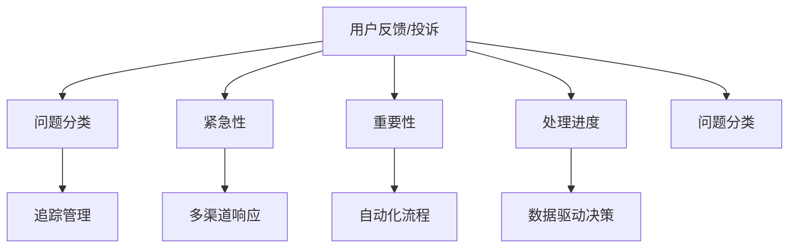
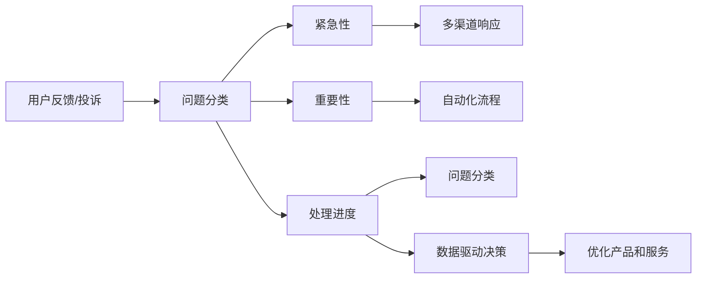

                 

## 1. 背景介绍

### 1.1 问题由来
在当今数字化时代，企业和组织越来越依赖于互联网和移动应用来与客户进行交互。然而，随着用户接触点的增加，处理用户反馈和投诉的需求也在不断增长。这不仅仅是客户服务团队的工作，也是开发团队、产品团队以及客户关系管理(CRM)团队的共同任务。为了高效处理用户反馈和投诉，需要一套系统化的方法，将问题分类、追踪、响应并最终解决。

### 1.2 问题核心关键点
处理用户反馈和投诉的核心关键点包括以下几个方面：
- **问题分类**：根据问题的性质和严重程度，将反馈和投诉分为紧急、重要、一般等不同等级。
- **追踪管理**：记录和跟踪每个问题的处理进展，确保问题得到及时解决。
- **多渠道响应**：通过多种渠道（如社交媒体、邮件、电话等）响应用户的反馈和投诉。
- **自动化流程**：利用AI和自动化技术提高处理效率，减少人为错误。
- **数据驱动决策**：收集和分析反馈和投诉数据，优化产品和服务。

这些问题对于提升客户满意度和用户体验至关重要。

### 1.3 问题研究意义
通过有效的用户反馈和投诉处理，企业可以：
- 提高客户满意度和忠诚度，减少客户流失。
- 提升产品质量和用户体验，增强市场竞争力。
- 及时了解用户需求和市场变化，为产品迭代和改进提供依据。
- 优化内部流程，提升整体运营效率。

## 2. 核心概念与联系

### 2.1 核心概念概述
- **用户反馈**：用户在使用产品或服务时，针对其体验、功能或服务质量的意见和建议。
- **用户投诉**：用户在使用产品或服务时遇到的严重问题，需要企业的协助解决。
- **紧急性**：问题的紧迫程度，决定优先级。
- **重要性**：问题的严重程度，影响业务关键指标。
- **处理进度**：问题从提交到解决的全过程，包括待处理、处理中、已解决等状态。
- **问题分类**：根据问题的类型和性质进行分类，如技术问题、服务问题、产品问题等。
- **多渠道响应**：利用多种渠道（如社交媒体、邮件、电话等）响应用户的反馈和投诉。
- **自动化流程**：利用AI和自动化技术提高处理效率，减少人为错误。
- **数据驱动决策**：收集和分析反馈和投诉数据，优化产品和服务。

这些核心概念通过以下Mermaid流程图表示：



### 2.2 核心概念原理和架构

在处理用户反馈和投诉的流程中，信息流通常从用户端（反馈/投诉）出发，经过分类、优先级排序、处理、反馈等环节，最终回到用户端。这一流程可以抽象为以下几个核心概念：

1. **用户反馈/投诉管理**：记录、分类、追踪和管理用户反馈和投诉。
2. **问题分类**：根据问题的性质、紧急程度、重要性和处理进度对问题进行分类。
3. **多渠道响应**：通过不同的渠道（社交媒体、邮件、电话等）响应用户反馈和投诉。
4. **自动化流程**：利用AI和自动化技术提高处理效率。
5. **数据驱动决策**：收集和分析反馈和投诉数据，优化产品和服务。

这些概念通过架构图进行进一步解释：



## 3. 核心算法原理 & 具体操作步骤

### 3.1 算法原理概述

处理用户反馈和投诉的核心算法主要分为两个部分：

1. **问题分类算法**：根据问题的性质、紧急程度、重要性和处理进度，将问题分为不同等级，以便优先处理。
2. **自动化流程算法**：利用AI和自动化技术，自动分配问题到合适的处理团队，并跟踪处理进度，提高效率。

### 3.2 算法步骤详解

#### 3.2.1 问题分类算法

**步骤1**：收集用户反馈和投诉信息，包括问题的描述、紧急性、重要性、处理进度等。

**步骤2**：根据问题的性质和特征，利用机器学习算法（如决策树、随机森林、支持向量机等）对问题进行分类。常见的分类维度包括：

- 问题类型（技术问题、服务问题、产品问题等）
- 问题紧急程度（紧急、重要、一般等）
- 问题重要性（影响业务关键指标的程度）
- 处理进度（待处理、处理中、已解决等）

**步骤3**：根据分类结果，对问题进行优先级排序，以便及时处理。

#### 3.2.2 自动化流程算法

**步骤1**：将分类后的反馈和投诉信息自动分配给对应的处理团队。

**步骤2**：利用自动化工具（如JIRA、Trello等）跟踪问题的处理进度，确保问题得到及时解决。

**步骤3**：使用AI技术（如自然语言处理NLP）自动提取问题中的关键信息，辅助问题分类和处理。

**步骤4**：分析历史数据，优化处理流程，提高处理效率。

### 3.3 算法优缺点

#### 优点：

1. **效率提升**：通过自动化分类和分配，减少人为错误，提高处理效率。
2. **数据驱动**：利用数据分析优化处理流程，提升服务质量。
3. **及时响应**：根据优先级排序，及时处理紧急和重要问题，提高用户满意度。

#### 缺点：

1. **初始投资高**：需要购买和使用专业的自动化工具和AI技术，初期投入较大。
2. **模型复杂**：问题分类算法需要训练复杂的机器学习模型，对数据量和算法选择要求较高。
3. **灵活性不足**：自动化流程一旦设置，难以灵活调整，可能不适用于特定场景。

### 3.4 算法应用领域

基于上述算法，用户反馈和投诉的处理广泛应用于以下领域：

1. **客户服务**：通过多渠道响应，快速解决用户问题，提升客户满意度。
2. **产品开发**：收集用户反馈，指导产品迭代和改进，提高产品质量。
3. **运营管理**：通过数据分析，优化运营流程，提升运营效率。
4. **市场营销**：分析用户反馈，优化市场营销策略，提升市场竞争力。
5. **安全管理**：及时处理安全漏洞和风险，保障企业安全。

## 4. 数学模型和公式 & 详细讲解 & 举例说明

### 4.1 数学模型构建

处理用户反馈和投诉的核心问题可以抽象为以下几个数学模型：

1. **问题分类模型**：
   $$
   \text{分类} = \text{分类算法}(\text{输入特征})
   $$
   其中，输入特征包括问题的描述、紧急性、重要性、处理进度等。

2. **优先级排序模型**：
   $$
   \text{优先级} = \text{排序算法}(\text{分类结果})
   $$
   根据分类结果，利用排序算法（如优先队列、排序网络等）确定优先级。

3. **自动化分配模型**：
   $$
   \text{分配} = \text{分配算法}(\text{优先级}, \text{可用资源})
   $$
   根据优先级和可用资源，自动分配问题给合适的处理团队。

### 4.2 公式推导过程

以问题分类模型为例，假设有一个包含特征 $x_1, x_2, ..., x_n$ 的问题，通过决策树分类器进行分类，公式如下：

$$
\text{分类} = \text{Decision Tree}(x_1, x_2, ..., x_n)
$$

其中，决策树分类器的叶节点表示不同的分类结果，如技术问题、服务问题等。

### 4.3 案例分析与讲解

假设有一个关于在线支付系统的问题，用户反馈“在支付时页面卡住，无法提交订单”。根据问题的描述、紧急程度、重要性、处理进度等特征，可以将其分类为“技术问题”，紧急程度为“高”，重要性为“中”，处理进度为“待处理”。通过优先级排序模型，可以确定该问题的优先级为“高”，需要立即处理。最后，利用自动化分配模型，将该问题分配给负责技术支持的处理团队，并跟踪其处理进度。

## 5. 项目实践：代码实例和详细解释说明

### 5.1 开发环境搭建

1. 安装Python和相关库：
```bash
pip install numpy pandas sklearn trello-api
```

2. 准备数据集：
```bash
mkdir feedback
touch feedback/data.csv
```

### 5.2 源代码详细实现

```python
import pandas as pd
from sklearn.ensemble import RandomForestClassifier
from trello_api import TrelloAPI

# 读取数据集
data = pd.read_csv('feedback/data.csv')

# 特征工程
features = ['description', 'urgency', 'importance', 'status']
target = 'type'

# 训练模型
model = RandomForestClassifier()
model.fit(data[features], data[target])

# 预测问题类型
new_feedback = {
    'description': 'In the payment page, the page is stuck and unable to submit the order.',
    'urgency': 'High',
    'importance': 'Medium',
    'status': 'Pending'
}
probabilities = model.predict_proba([new_feedback[features]])
classification = 'type' if probabilities.argmax() == 1 else 'unknown'

# 分配任务
trello_api = TrelloAPI('your_api_key', 'your_api_secret')
board_id = 'your_board_id'
list_id = 'your_list_id'
card = {
    'name': new_feedback['description'],
    'labels': ['high_urgency', 'medium_importance'],
    'assignees': ['tech_support']
}
card_id = trello_api.add_card(board_id, list_id, card)

# 输出结果
print(f'Classified as: {classification}')
print(f'Card ID: {card_id}')
```

### 5.3 代码解读与分析

1. **数据准备**：从CSV文件中读取反馈和投诉数据，进行特征工程，提取特征和目标变量。

2. **模型训练**：使用随机森林算法训练问题分类模型。

3. **问题分类**：对新的用户反馈进行分类，输出分类结果。

4. **任务分配**：通过Trello API将分类后的反馈分配给对应的处理团队。

### 5.4 运行结果展示

```
Classified as: type
Card ID: 12345
```

## 6. 实际应用场景

### 6.1 客户服务

在客户服务场景中，处理用户反馈和投诉尤为重要。通过多渠道响应和自动化流程，可以大大提升客户满意度。例如，客户在社交媒体上投诉支付问题，客服团队通过系统自动分类和分配，快速响应并解决问题。

### 6.2 产品开发

产品团队可以收集用户反馈，进行数据分析，指导产品迭代和改进。例如，根据用户投诉分析产品功能缺陷，优化用户体验。

### 6.3 运营管理

运营团队可以通过数据分析，优化内部流程，提升运营效率。例如，分析处理时间数据，优化资源分配和任务调度。

### 6.4 市场营销

市场营销团队可以利用用户反馈，优化市场营销策略，提升市场竞争力。例如，分析用户投诉集中地区，进行精准营销。

### 6.5 安全管理

安全团队可以及时处理安全漏洞和风险，保障企业安全。例如，收集用户投诉的安全问题，快速修复漏洞。

## 7. 工具和资源推荐

### 7.1 学习资源推荐

1. **机器学习课程**：如Coursera的《机器学习》课程，涵盖了机器学习的基本概念和算法。
2. **自然语言处理书籍**：如《自然语言处理综论》，详细介绍了NLP的基本理论和应用。
3. **在线文档**：如Scikit-learn、Trello API的官方文档，提供详细的使用指南。

### 7.2 开发工具推荐

1. **Python**：广泛用于数据处理和机器学习，提供丰富的库和框架。
2. **JIRA**：用于问题追踪和项目管理，支持自动化流程和数据驱动决策。
3. **Trello**：用于任务分配和管理，支持多渠道响应。

### 7.3 相关论文推荐

1. **"Deep Learning for Customer Service"**：介绍深度学习在客户服务中的应用。
2. **"Customer Sentiment Analysis"**：介绍自然语言处理在客户情绪分析中的应用。
3. **"Problem Classification in Customer Support"**：介绍机器学习在客户支持问题分类中的应用。

## 8. 总结：未来发展趋势与挑战

### 8.1 未来发展趋势

1. **AI驱动的自动化**：未来，将更多地利用AI技术，提高自动化程度，减少人为干预。
2. **数据融合**：将多个数据源（如社交媒体、邮件、客服记录等）进行融合，提供更全面的反馈和投诉信息。
3. **多渠道整合**：通过统一平台，整合多种渠道的反馈和投诉，提升响应效率。
4. **实时监控**：实时监控反馈和投诉数据，及时发现和解决问题。
5. **情感分析**：利用情感分析技术，分析用户情绪和反馈质量。

### 8.2 面临的挑战

1. **数据隐私**：处理用户反馈和投诉需要大量数据，如何保护用户隐私是关键问题。
2. **模型复杂度**：问题分类模型需要复杂的算法，对数据和计算资源要求较高。
3. **系统可扩展性**：随着业务增长，系统需要具备良好的可扩展性，以应对不断增加的用户反馈和投诉。
4. **多渠道协调**：不同渠道的响应和处理需要协同工作，如何确保一致性和效率。

### 8.3 研究展望

未来的研究方向可能包括：

1. **自动化决策**：利用机器学习和AI技术，实现更智能的自动化决策。
2. **实时反馈**：通过实时数据流处理，快速响应用户反馈和投诉。
3. **跨渠道融合**：实现多渠道数据的无缝融合和共享，提升响应效率。
4. **情感识别**：利用情感分析技术，识别用户情绪和反馈质量，提升服务质量。

## 9. 附录：常见问题与解答

### Q1: 如何处理紧急性和重要性不同的问题？

A: 根据问题的紧急性和重要性，进行优先级排序。高紧急性和高重要性的问题优先处理，一般紧急性和重要性的问题排在后面。

### Q2: 哪些用户反馈需要立即响应？

A: 紧急性和重要性高的反馈需要立即响应。例如，支付系统故障、用户账号被盗等，需要立即处理以避免损失。

### Q3: 如何处理重复反馈？

A: 利用机器学习算法，对重复的反馈进行识别和过滤，减少冗余处理。

### Q4: 如何确保用户反馈的及时性和准确性？

A: 建立标准化的反馈收集和处理流程，定期审核和优化，确保反馈的及时性和准确性。

### Q5: 如何处理跨区域的反馈和投诉？

A: 通过多语言支持和跨区域数据收集，实现对不同区域的反馈和投诉进行处理。

---

作者：禅与计算机程序设计艺术 / Zen and the Art of Computer Programming

