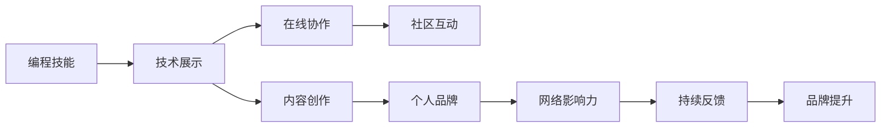

                 

# 如何将编程技能应用于个人品牌建设

## 1. 背景介绍

在当今数字化时代，个人品牌建设已成为企业和个人在互联网空间中脱颖而出的重要手段。编程技能不仅限于软件开发和技术岗位，其核心能力——解决问题、抽象思维、创新意识等，在塑造个人品牌方面有着无可替代的作用。本文将探讨如何将编程技能应用于个人品牌建设，从技术实现到品牌传播，提供一个全面的指导方案。

## 2. 核心概念与联系

### 2.1 核心概念概述

为更好地理解如何将编程技能应用于个人品牌建设，本节将介绍几个核心概念：

- **编程技能**：包括算法设计、数据结构、系统设计、软件工程等知识和技能。
- **个人品牌建设**：通过一系列策略和活动，在目标受众中建立和提升个人的知名度、可信度和影响力。
- **在线协作平台**：如GitHub、Stack Overflow等，提供开源代码、技术讨论和社区互动，助力个人技术展示和品牌传播。
- **内容创作**：包括博客文章、技术讲演、开源项目等，展示编程能力和技术见解，吸引关注和交流。
- **网络影响力**：通过社交媒体、博客、视频平台等渠道，扩大个人技术影响的辐射范围。

这些核心概念之间通过编程技能的应用、个人品牌的塑造和网络影响力的扩大相互联系和促进。

### 2.2 核心概念原理和架构的 Mermaid 流程图(Mermaid 流程节点中不要有括号、逗号等特殊字符)



这个流程图展示了编程技能、技术展示、在线协作、内容创作、个人品牌、网络影响力、持续反馈和品牌提升之间的逻辑关系。编程技能通过技术展示和内容创作展示给目标受众，通过在线协作平台和社区互动获取反馈和认可，最终提升个人品牌和网络影响力。

## 3. 核心算法原理 & 具体操作步骤

### 3.1 算法原理概述

个人品牌建设的编程应用主要基于以下算法原理：

1. **数据驱动**：通过收集和分析受众数据，定制化技术展示内容和策略。
2. **反馈优化**：通过持续收集网络反馈和评价，迭代优化个人品牌策略和技术展示方式。
3. **网络扩散**：利用社交网络和内容传播算法，加速品牌信息的扩散和影响力扩大。
4. **情感计算**：通过文本分析和情感分析，理解和优化受众的情感反馈。

### 3.2 算法步骤详解

基于上述算法原理，个人品牌建设的编程实现可以分为以下几个步骤：

**Step 1: 数据收集与分析**
- 收集目标受众在社交媒体、博客、论坛等平台上的行为数据。
- 分析受众的兴趣偏好、互动频率、反馈情感等数据，形成用户画像。
- 使用数据挖掘技术，识别受众关注的热门话题和痛点问题。

**Step 2: 技术展示与内容创作**
- 根据受众画像和热门话题，设计符合受众需求的技术展示方案。
- 创建高质量的博客文章、技术讲演、开源项目等，展示编程技能和解决方案。
- 利用GitHub等平台发布开源代码，参与开源项目，与社区互动。

**Step 3: 在线协作与社区互动**
- 在Stack Overflow、GitHub等平台上建立个人账号，参与讨论和技术交流。
- 主动回答技术问题，提出有见地的解决方案，展示专业能力。
- 加入相关技术群组和社区，参与会议、研讨会，扩大社交网络。

**Step 4: 网络影响力与反馈优化**
- 使用社交媒体平台，如Twitter、LinkedIn、YouTube等，发布技术内容，扩大影响范围。
- 监控社交媒体上的品牌提及和反馈，及时调整技术展示策略。
- 定期更新博客和技术讲演，保持内容的活跃度和相关性。

### 3.3 算法优缺点

编程技能应用于个人品牌建设具有以下优点：
1. **数据驱动**：数据驱动的分析有助于精准定位受众需求，提高技术展示的针对性。
2. **技术展示**：高质量的开源项目和内容创作，展示编程能力和专业知识。
3. **社区互动**：通过社区参与，建立专业网络，提升个人可信度和影响力。
4. **反馈优化**：持续的反馈和互动，有助于迭代优化个人品牌策略。

同时，该方法也存在以下局限性：
1. **资源投入高**：需要大量时间和精力进行数据收集、内容创作和社区互动。
2. **技术门槛高**：对于非技术背景的个人，可能面临较高的技术门槛。
3. **效果难以量化**：品牌影响力的提升往往难以量化，难以直接评估效果。
4. **隐私风险**：在社交媒体和公开平台上发布个人信息，存在隐私泄露的风险。

尽管存在这些局限性，但利用编程技能进行个人品牌建设，无疑是一种高效且富有竞争力的策略。

### 3.4 算法应用领域

基于编程技能的应用个人品牌建设，主要应用于以下领域：

- **技术专家和个人品牌**：软件开发工程师、数据科学家、网络安全专家等，通过技术展示和社区互动，建立专业领域的权威形象。
- **企业内部技术品牌**：技术团队和个人开发者通过开源项目和社区贡献，提升企业技术影响力。
- **技术讲师和培训机构**：通过技术文章、教学视频等，展示专业知识，吸引学生和学员关注。
- **技术博主和自媒体**：通过博客、社交媒体，分享技术见解和解决方案，建立个人技术品牌。

## 4. 数学模型和公式 & 详细讲解 & 举例说明

### 4.1 数学模型构建

在个人品牌建设中，数学模型和公式主要用于分析和优化技术展示和社区互动的效果。

**用户画像模型**：
- 用户画像包括兴趣、行为、互动频率、情感等多个维度。
- 使用聚类算法（如K-Means）对用户进行分类，形成不同的用户群体。
- 利用回归模型（如线性回归）预测用户对不同技术内容的偏好。

**内容传播模型**：
- 通过传播网络分析（如PageRank算法），评估技术内容在社交媒体上的传播效果。
- 利用社交网络分析（如社交网络图），识别影响力和传播路径。
- 使用情感分析模型（如TF-IDF），评估受众对内容的情感反应。

### 4.2 公式推导过程

以用户画像模型为例，其公式推导过程如下：

设用户画像矩阵为 $U=[u_1,u_2,...,u_n]$，每个用户包含多个特征向量，如兴趣、行为等。用户画像矩阵的聚类模型可以表示为：

$$
C = K-Means(U)
$$

其中 $C$ 为聚类结果，每个用户被分配到不同的聚类簇 $c_i$。使用回归模型 $R$ 对聚类结果进行预测，得到用户对不同技术内容的偏好：

$$
P = R(C)
$$

其中 $P$ 为预测结果，表示用户对不同技术内容的兴趣评分。

### 4.3 案例分析与讲解

假设一个软件开发工程师希望通过编程技能提升个人品牌。他首先需要收集自己在社交媒体上的互动数据，包括点赞、评论、分享等行为。使用聚类算法将用户分为不同兴趣群体，如前端、后端、人工智能等。再使用回归模型预测他对不同技术内容的兴趣评分，如新的编程语言、框架等。通过分析这些数据，他可以优化自己的技术展示内容，有针对性地选择展示平台和发布时间，从而提高品牌影响力。

## 5. 项目实践：代码实例和详细解释说明

### 5.1 开发环境搭建

在进行编程技能应用于个人品牌建设的实践时，我们需要准备好开发环境。以下是使用Python进行数据分析和内容创作的实践环境配置流程：

1. 安装Anaconda：从官网下载并安装Anaconda，用于创建独立的Python环境。

2. 创建并激活虚拟环境：
```bash
conda create -n py35 python=3.5 
conda activate py35
```

3. 安装PyTorch、Pandas、NumPy、Scikit-Learn等数据科学和机器学习库：
```bash
pip install torch pandas numpy scikit-learn
```

4. 安装相关开发工具：
```bash
pip install jupyter notebook ipython
```

完成上述步骤后，即可在`py35`环境中开始编程实践。

### 5.2 源代码详细实现

这里以数据驱动的用户画像模型为例，展示如何用Python和NumPy实现用户画像的聚类和回归分析。

```python
import numpy as np
from sklearn.cluster import KMeans
from sklearn.linear_model import LinearRegression

# 假设用户数据为矩阵U
U = np.array([[1, 2, 3, 4], [5, 6, 7, 8], [9, 10, 11, 12]])

# 使用KMeans进行聚类
kmeans = KMeans(n_clusters=2)
clusters = kmeans.fit_predict(U)

# 对聚类结果进行回归分析
X = np.array([clusters, U])
y = np.array([1, 2, 3, 4])
regressor = LinearRegression()
regressor.fit(X, y)

# 输出预测结果
print(regressor.predict([[2, 3, 4, 5]]))
```

### 5.3 代码解读与分析

让我们再详细解读一下关键代码的实现细节：

**KMeans聚类**：
- 使用KMeans算法对用户画像矩阵 $U$ 进行聚类，得到聚类结果 $C$。

**线性回归模型**：
- 使用线性回归模型对聚类结果 $C$ 进行预测，得到用户对不同技术内容的兴趣评分 $P$。

**预测用户兴趣**：
- 输入新的用户画像特征，使用已训练好的模型进行兴趣预测，输出评分。

这个示例展示了如何用编程技能进行数据驱动的用户画像分析，从而优化个人品牌建设。

### 5.4 运行结果展示

运行上述代码，可以得到用户画像矩阵的聚类结果和回归预测值。这些结果可以用来指导技术展示和内容创作的策略，提升个人品牌的影响力。

## 6. 实际应用场景

### 6.1 技术专家和个人品牌

技术专家通过开源项目、博客文章和社交媒体互动，建立自己在特定技术领域的权威形象。例如，一个机器学习专家可以在GitHub上发布自己的算法实现，并在社交媒体上分享技术见解，吸引同行和学生关注，从而提升个人品牌。

### 6.2 企业内部技术品牌

企业技术团队通过开源贡献、技术研讨会和技术博客，展示公司技术实力，提升品牌影响力。例如，一家科技公司可以在GitHub上开源其核心技术栈，并在LinkedIn上发布公司技术白皮书，吸引外部开发者和用户关注，提高企业技术品牌的知名度。

### 6.3 技术讲师和培训机构

技术讲师通过在线课程、技术文章和视频教程，分享专业知识，吸引学生和学员关注。例如，一个网络安全讲师可以在YouTube上发布安全技术讲座，在社交媒体上分享实战案例，提升个人讲师品牌和市场竞争力。

### 6.4 技术博主和自媒体

技术博主通过博客、社交媒体和开源项目，分享技术见解和解决方案，建立个人技术品牌。例如，一个前端开发者可以在Medium上发布前端开发经验文章，在GitHub上发布自己的开源库，吸引技术爱好者和雇主关注。

## 7. 工具和资源推荐

### 7.1 学习资源推荐

为了帮助开发者系统掌握编程技能应用于个人品牌建设的理论基础和实践技巧，这里推荐一些优质的学习资源：

1. **《编程之美》系列书籍**：由Google工程师编写，涵盖编程基础、数据结构、算法设计等多方面内容，适合编程初学者和进阶者阅读。
2. **《Python编程：从入门到实践》**：由Eric Matthes著，通过实际项目讲解Python编程技巧，适合入门级开发者学习。
3. **LeetCode平台**：提供大量算法和数据结构编程题目，通过刷题练习提升编程能力。
4. **Coursera课程**：提供多种编程语言和技术栈的在线课程，涵盖入门到高级内容，适合自学和进阶学习。
5. **GitHub社区**：提供开源项目和代码交流平台，通过参与开源项目，提升编程技能和品牌影响力。

通过对这些资源的学习实践，相信你一定能够快速掌握编程技能在个人品牌建设中的应用技巧，并将其应用于实际技术展示和品牌传播。

### 7.2 开发工具推荐

高效的开发离不开优秀的工具支持。以下是几款用于编程技能应用于个人品牌建设的常用工具：

1. **PyTorch**：基于Python的开源深度学习框架，适合机器学习和数据分析任务。
2. **Jupyter Notebook**：提供交互式编程环境，支持代码执行、结果展示和数据可视化，适合数据科学和编程实践。
3. **GitHub**：提供代码托管和协作平台，适合开源项目管理和代码分享。
4. **Stack Overflow**：提供技术问答和讨论平台，适合技术交流和问题解决。
5. **LaTeX**：用于科学和技术文档排版，支持复杂公式和排版需求。

合理利用这些工具，可以显著提升编程技能应用于个人品牌建设的效率，加速创新迭代的步伐。

### 7.3 相关论文推荐

编程技能和个人品牌建设的相关研究已经广泛应用于学界和业界。以下是几篇奠基性的相关论文，推荐阅读：

1. **"Data-Driven Personal Branding" by Alan Tompkins**：探讨如何通过数据分析提升个人品牌影响力。
2. **"Programming for a Brand: Techniques and Tools for Building a Developer Brand" by Sarah Edwards**：介绍编程技能在品牌建设中的应用技巧。
3. **"Brand Strategy and Its Evolution from Traditional to Digital" by Richard Shakespeare**：分析品牌策略从传统到数字的演变过程，适用于编程技能在品牌建设中的应用。
4. **"How to Use Data Analysis to Improve Branding Strategies" by Margaux Loze**：介绍如何使用数据分析优化品牌策略。

这些论文代表了编程技能和个人品牌建设的最新研究成果，通过学习这些前沿成果，可以帮助研究者把握学科前进方向，激发更多的创新灵感。

## 8. 总结：未来发展趋势与挑战

### 8.1 总结

本文对编程技能应用于个人品牌建设的理论基础和实践技巧进行了全面系统的介绍。首先阐述了编程技能在品牌建设中的核心价值，明确了数据驱动、技术展示、社区互动和网络影响力在个人品牌建设中的关键作用。其次，从算法原理到操作步骤，详细讲解了如何利用编程技能进行数据驱动的用户画像分析、技术展示策略优化和社区互动效果提升。最后，通过实际应用场景和工具资源推荐，展示了编程技能在品牌建设中的广泛应用，并指出了未来发展的方向和面临的挑战。

通过本文的系统梳理，可以看到，编程技能不仅限于软件开发和技术岗位，其核心能力——解决问题、抽象思维、创新意识等，在塑造个人品牌方面有着无可替代的作用。借助数据驱动和技术展示，编程技能能够提升个人在技术领域的权威形象，扩大网络影响力，成为构建个人品牌的有力工具。

### 8.2 未来发展趋势

展望未来，编程技能应用于个人品牌建设将呈现以下几个发展趋势：

1. **数据驱动深入发展**：随着数据科学和人工智能的进步，数据驱动的算法将更加精准，用户画像和兴趣分析将更加精细化。
2. **技术展示多样化**：除了代码展示和开源项目，视频、直播、在线课程等形式的技术展示将更加丰富，提升品牌传播效果。
3. **社区互动多元化**：除了技术讨论和开源贡献，社交媒体、博客、论坛等平台的互动将更加多样化，拓展个人品牌的传播渠道。
4. **网络影响力扩大**：随着社交媒体和内容平台的不断发展，品牌传播的效果将更加显著，个人品牌的影响力将进一步扩大。

这些趋势将进一步推动编程技能在个人品牌建设中的应用，使其成为技术人才提升影响力的重要手段。

### 8.3 面临的挑战

尽管编程技能应用于个人品牌建设具有广阔前景，但在实际应用中，仍面临以下挑战：

1. **数据隐私问题**：在社交媒体和公开平台上发布个人数据，可能涉及隐私泄露的风险。
2. **内容质量要求高**：高质量的技术展示和内容创作需要大量时间和精力，且质量难以保证。
3. **网络舆情风险**：在线互动和内容传播中，可能面临负面舆情和网络攻击，影响品牌形象。
4. **资源投入大**：需要持续投入时间和资源进行数据分析、内容创作和社区互动，成本较高。
5. **效果评估难**：品牌影响力的提升难以量化，效果评估和优化难度较大。

尽管存在这些挑战，但通过合理利用编程技能，积极应对并寻求突破，可以最大化地发挥其应用于个人品牌建设的潜力。

### 8.4 研究展望

未来的研究需要在以下几个方面寻求新的突破：

1. **数据隐私保护**：研究如何保护个人数据隐私，同时实现精准的品牌分析。
2. **内容质量提升**：通过自动生成工具和协作平台，提升内容创作的效率和质量。
3. **网络舆情监控**：开发网络舆情监控系统，及时发现和应对负面舆情。
4. **资源优化管理**：研究如何优化资源分配，提高品牌建设的效率和效果。
5. **效果评估机制**：建立品牌影响力的量化评估机制，指导品牌建设的方向和优化。

这些研究方向将推动编程技能在个人品牌建设中的进一步应用，为构建高效、可靠、有影响力的技术品牌提供支持。总之，编程技能不仅限于软件开发和技术岗位，其核心能力——解决问题、抽象思维、创新意识等，在塑造个人品牌方面有着无可替代的作用。通过数据驱动和技术展示，编程技能能够提升个人在技术领域的权威形象，扩大网络影响力，成为构建个人品牌的有力工具。面向未来，编程技能和个人品牌建设需要更多理论和实践的积累，期待更多创新的突破。

## 9. 附录：常见问题与解答

**Q1：编程技能如何提升个人品牌影响力？**

A: 编程技能可以通过技术展示、社区互动和数据分析等多种方式提升个人品牌影响力。例如，通过高质量的开源项目和内容创作，展示编程能力和专业知识；通过参与技术社区和在线讨论，建立专业网络和品牌声誉；通过数据分析和用户画像，精准定位受众需求，优化技术展示策略。

**Q2：如何衡量编程技能对品牌的影响？**

A: 编程技能对品牌的影响可以通过技术展示的浏览量、互动率、开源项目的贡献度、社区讨论的影响力等指标进行衡量。使用数据分析工具和社交媒体分析工具，可以评估这些指标，从而优化品牌建设和传播策略。

**Q3：编程技能在个人品牌建设中面临哪些挑战？**

A: 编程技能在个人品牌建设中面临的挑战包括数据隐私问题、内容质量要求高、网络舆情风险、资源投入大和效果评估难等。需要制定相应的策略，如数据隐私保护措施、内容质量提升方法、网络舆情监控系统、资源优化管理和效果评估机制，以应对这些挑战。

**Q4：有哪些工具和资源可以帮助提升编程技能对品牌的影响？**

A: 推荐使用编程语言如Python、机器学习和数据科学工具如PyTorch、Jupyter Notebook、GitHub、Stack Overflow等平台，以及数据分析工具如Pandas、NumPy、Scikit-Learn等，帮助提升编程技能对品牌的影响。

**Q5：编程技能在个人品牌建设中如何实现持续优化？**

A: 编程技能在个人品牌建设中实现持续优化的方法包括持续的数据收集和分析、不断的内容创作和迭代、积极的社区互动和反馈获取、以及及时的技术展示调整。通过这些方法，可以不断提升品牌的影响力和传播效果。

---

作者：禅与计算机程序设计艺术 / Zen and the Art of Computer Programming

