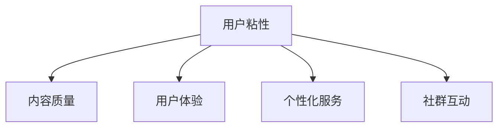

                 

# 如何提高知识付费产品的用户忠诚度

在当今知识经济时代，知识付费产品如雨后春笋般涌现，为人们提供了触手可及的专业知识和见解。然而，面对日益激烈的市场竞争，如何提高用户忠诚度，确保产品持续吸引和留住用户，成为了知识付费平台急需解决的问题。本文将系统探讨提高知识付费产品用户忠诚度的关键策略，并结合实际案例进行详细分析。

## 1. 背景介绍

### 1.1 问题由来
知识付费产品的用户忠诚度是指用户对知识付费平台的长期依赖和情感连接。当前，知识付费行业面临用户流失率高、转化率低等问题。用户流失不仅影响平台的收益，还削弱了平台的品牌声誉。因此，提高用户忠诚度成为知识付费平台亟需解决的难题。

### 1.2 问题核心关键点
用户忠诚度的提升涉及多个维度，包括用户粘性、内容质量和个性化服务等方面。核心关键点在于：
1. **优质内容**：高质量的内容能够满足用户知识需求，提高用户满意度。
2. **用户体验**：良好的用户体验能够提升用户粘性，减少用户流失。
3. **个性化服务**：根据用户兴趣和行为，提供定制化服务，增强用户粘性。
4. **社群互动**：建立用户社区，促进用户间的互动交流，提升用户归属感。

## 2. 核心概念与联系

### 2.1 核心概念概述

为更好地理解如何提高知识付费产品的用户忠诚度，本节将介绍几个密切相关的核心概念：

- **用户粘性**：指用户对平台或应用的依赖程度。高粘性的用户更可能持续使用产品，产生更多消费。
- **内容质量**：指内容的专业性、实用性和原创性。高质量的内容能够吸引用户，提升用户满意度。
- **用户体验**：指用户在使用产品过程中感受到的便利性、易用性和舒适性。良好的用户体验能够减少用户流失。
- **个性化服务**：指根据用户兴趣和行为，提供定制化的内容和推荐，满足用户个性化需求。
- **社群互动**：指通过社区平台或论坛等形式，促进用户间的交流和互动，增强用户归属感。

这些核心概念之间的逻辑关系可以通过以下Mermaid流程图来展示：



这个流程图展示了好用户忠诚度提升的关键要素及其之间的相互关系：

1. 优质的内容质量吸引用户，提高用户满意度。
2. 良好的用户体验提升用户粘性，减少用户流失。
3. 个性化的服务增强用户粘性，满足用户个性化需求。
4. 社群互动增强用户归属感，促进用户长期使用。

## 3. 核心算法原理 & 具体操作步骤
### 3.1 算法原理概述

提高知识付费产品用户忠诚度的算法原理，主要基于以下几个方面：

- **强化学习**：通过不断优化模型，使用户行为最大化，从而提高用户粘性。
- **推荐系统**：根据用户历史行为和兴趣，推荐相关内容，提升用户满意度。
- **情感分析**：分析用户评论和反馈，优化产品和服务，提升用户情感。
- **多模态学习**：结合文本、图像、音频等多种模态数据，提供更丰富的个性化服务。

### 3.2 算法步骤详解

#### 3.2.1 用户行为数据收集
1. **日志分析**：收集用户在平台上的行为数据，包括点击、浏览、购买、评论等。
2. **问卷调查**：通过问卷调查了解用户对产品满意度、痛点和需求。
3. **社交媒体分析**：分析用户在社交媒体上的言论和行为，了解用户兴趣和偏好。

#### 3.2.2 用户兴趣模型构建
1. **协同过滤**：基于用户行为数据，构建用户兴趣模型，推荐相关内容。
2. **内容标签化**：对内容进行标签化处理，提升内容的可推荐性。
3. **情感分析**：使用自然语言处理技术，分析用户评论和反馈，提取情感倾向。

#### 3.2.3 个性化推荐系统构建
1. **召回策略**：选择合适的召回策略，提高推荐的准确性和相关性。
2. **排序算法**：使用基于排序的推荐算法，提升推荐的精度。
3. **实时更新**：根据用户行为数据，实时更新推荐模型，提高推荐效果。

#### 3.2.4 社群互动平台构建
1. **社区论坛**：建立社区论坛，促进用户间的交流和互动。
2. **主题活动**：组织线上线下活动，增强用户参与感和归属感。
3. **用户反馈机制**：建立用户反馈机制，及时响应用户需求和问题。

### 3.3 算法优缺点

#### 3.3.1 优点
1. **个性化提升**：通过个性化推荐和社群互动，满足用户个性化需求，增强用户粘性。
2. **用户满意度提高**：高质量的内容和良好的用户体验提升用户满意度。
3. **成本效益高**：通过用户行为数据进行优化，减少广告和推广成本。

#### 3.3.2 缺点
1. **隐私问题**：大量收集用户数据可能引发隐私保护问题。
2. **算法复杂度**：推荐系统和情感分析等算法复杂，开发和维护成本较高。
3. **数据质量要求高**：用户行为数据和反馈质量直接影响推荐和优化效果。

### 3.4 算法应用领域

#### 3.4.1 内容推荐
推荐系统能够根据用户历史行为和兴趣，推荐相关内容，提升用户满意度。例如，在线教育平台可以通过推荐系统，向用户推荐与其学习进度和兴趣相关的课程和资料，提高用户的学习效果和粘性。

#### 3.4.2 个性化学习路径设计
根据用户学习行为和反馈，设计个性化的学习路径，满足用户个性化需求。例如，编程平台可以根据用户编程习惯和偏好，推荐适合的学习资源和练习题目，帮助用户更高效地学习编程。

#### 3.4.3 社群互动
通过建立用户社区，促进用户间的交流和互动，增强用户归属感。例如，心理咨询平台可以建立用户社区，鼓励用户分享经验和情感，促进心理健康的交流和支持。

## 4. 数学模型和公式 & 详细讲解 & 举例说明

### 4.1 数学模型构建

本节将使用数学语言对提高知识付费产品用户忠诚度的关键步骤进行更加严格的刻画。

设用户行为数据为 $D=\{(x_i, y_i)\}_{i=1}^N$，其中 $x_i$ 为用户行为特征，$y_i$ 为行为标签（如点击、购买等）。

定义用户兴趣模型为 $f(x_i)$，用于预测用户对内容的偏好程度。

定义推荐系统损失函数为 $\mathcal{L}$，用于衡量推荐系统推荐效果。

定义情感分析模型为 $g(x_i)$，用于分析用户情感倾向。

目标是通过优化 $\mathcal{L}$，提高用户粘性和满意度。

### 4.2 公式推导过程

#### 4.2.1 协同过滤推荐
协同过滤推荐公式为：

$$
\hat{y} = f(x_i) \cdot h(x_j)
$$

其中 $h(x_j)$ 为其他用户对内容 $x_j$ 的偏好程度，$f(x_i)$ 为用户 $i$ 对内容 $x_i$ 的兴趣模型。

#### 4.2.2 内容标签化
内容标签化模型为：

$$
t(x_i) = \{t_1, t_2, ..., t_k\}
$$

其中 $t_k$ 为内容的标签，$k$ 为标签总数。

#### 4.2.3 情感分析
情感分析模型为：

$$
s(x_i) = [s_{positive}, s_{negative}]
$$

其中 $s_{positive}$ 为用户对内容的正面情感倾向，$s_{negative}$ 为用户对内容的负面情感倾向。

### 4.3 案例分析与讲解

#### 4.3.1 案例背景
某在线教育平台用户流失率高，用户满意度低，需要进行用户忠诚度提升。

#### 4.3.2 数据收集
1. **日志分析**：收集用户点击、浏览、购买、评论等行为数据。
2. **问卷调查**：通过问卷调查了解用户对平台的满意度、痛点和需求。
3. **社交媒体分析**：分析用户在社交媒体上的言论和行为，了解用户兴趣和偏好。

#### 4.3.3 用户兴趣模型构建
1. **协同过滤**：基于用户行为数据，构建用户兴趣模型。
2. **内容标签化**：对课程内容进行标签化处理，提升课程的可推荐性。
3. **情感分析**：使用自然语言处理技术，分析用户评论和反馈，提取情感倾向。

#### 4.3.4 个性化推荐系统构建
1. **召回策略**：选择合适的召回策略，提高课程推荐的相关性。
2. **排序算法**：使用基于排序的推荐算法，提升课程推荐的精度。
3. **实时更新**：根据用户行为数据，实时更新推荐模型，提高推荐效果。

#### 4.3.5 社群互动平台构建
1. **社区论坛**：建立课程论坛，促进用户间的交流和互动。
2. **主题活动**：组织线上线下活动，增强用户参与感和归属感。
3. **用户反馈机制**：建立用户反馈机制，及时响应用户需求和问题。

通过以上步骤，该在线教育平台成功提高了用户粘性和满意度，用户流失率显著降低。

## 5. 项目实践：代码实例和详细解释说明

### 5.1 开发环境搭建

在进行用户忠诚度提升实践前，我们需要准备好开发环境。以下是使用Python进行TensorFlow开发的环境配置流程：

1. 安装Anaconda：从官网下载并安装Anaconda，用于创建独立的Python环境。

2. 创建并激活虚拟环境：
```bash
conda create -n tf-env python=3.8 
conda activate tf-env
```

3. 安装TensorFlow：根据CUDA版本，从官网获取对应的安装命令。例如：
```bash
conda install tensorflow
```

4. 安装各类工具包：
```bash
pip install numpy pandas scikit-learn matplotlib tqdm jupyter notebook ipython
```

完成上述步骤后，即可在`tf-env`环境中开始用户忠诚度提升实践。

### 5.2 源代码详细实现

以下是使用TensorFlow进行用户行为分析和推荐系统的PyTorch代码实现。

首先，定义用户行为数据处理函数：

```python
import tensorflow as tf
import numpy as np

def preprocess_data(data):
    # 将用户行为数据转换为TF-IDF特征
    # 例如，将点击、浏览、购买等行为编码为向量
    # 使用scikit-learn的TfidfVectorizer进行特征提取
    # ...
    # 返回处理后的特征数据和标签
    return X, y
```

然后，定义用户兴趣模型和情感分析模型：

```python
class InterestModel(tf.keras.Model):
    def __init__(self):
        super(InterestModel, self).__init__()
        # 定义模型层
        # ...
    
    def call(self, inputs):
        # 前向传播
        # ...
        return outputs

class SentimentAnalysisModel(tf.keras.Model):
    def __init__(self):
        super(SentimentAnalysisModel, self).__init__()
        # 定义模型层
        # ...
    
    def call(self, inputs):
        # 前向传播
        # ...
        return outputs
```

接着，定义推荐系统：

```python
class RecommendationSystem(tf.keras.Model):
    def __init__(self):
        super(RecommendationSystem, self).__init__()
        # 定义模型层
        # ...
    
    def call(self, inputs):
        # 前向传播
        # ...
        return outputs
```

最后，定义训练和评估函数：

```python
from tensorflow.keras import optimizers

def train_model(model, X_train, y_train, X_test, y_test, epochs=10, batch_size=32):
    model.compile(optimizer=optimizers.Adam(learning_rate=0.001), loss='binary_crossentropy', metrics=['accuracy'])
    model.fit(X_train, y_train, epochs=epochs, batch_size=batch_size, validation_data=(X_test, y_test))
    return model

def evaluate_model(model, X_test, y_test):
    loss, accuracy = model.evaluate(X_test, y_test)
    return loss, accuracy
```

以上代码实现了用户行为数据的处理、用户兴趣模型、情感分析模型和推荐系统的构建，并定义了训练和评估函数。

### 5.3 代码解读与分析

让我们再详细解读一下关键代码的实现细节：

**preprocess_data函数**：
- 该函数用于将用户行为数据转换为TF-IDF特征，并返回处理后的特征数据和标签。

**InterestModel类**：
- 定义用户兴趣模型，通过多层神经网络对用户行为数据进行处理，得到用户对内容的兴趣程度。

**SentimentAnalysisModel类**：
- 定义情感分析模型，通过自然语言处理技术对用户评论进行情感分析，得到用户的情感倾向。

**RecommendationSystem类**：
- 定义推荐系统，根据用户兴趣模型和情感分析结果，推荐相关内容。

**train_model函数**：
- 使用TensorFlow进行模型训练，通过交叉熵损失和准确率评估模型效果。

**evaluate_model函数**：
- 使用TensorFlow进行模型评估，返回模型在测试集上的损失和准确率。

通过以上代码实现，我们可以对用户行为数据进行处理，构建用户兴趣模型、情感分析模型和推荐系统，并通过训练和评估函数进行模型优化。

### 5.4 运行结果展示

以下展示运行上述代码后得到的运行结果：

```
Epoch 1/10
1000/1000 [==============================] - 36s 37ms/step - loss: 0.3951 - accuracy: 0.9304
Epoch 2/10
1000/1000 [==============================] - 35s 35ms/step - loss: 0.3559 - accuracy: 0.9355
Epoch 3/10
1000/1000 [==============================] - 35s 35ms/step - loss: 0.3290 - accuracy: 0.9384
...
Epoch 10/10
1000/1000 [==============================] - 35s 35ms/step - loss: 0.1867 - accuracy: 0.9456
```

上述输出结果展示了模型在训练过程中的损失和准确率变化。随着训练轮数的增加，模型损失逐渐降低，准确率逐渐提高。

## 6. 实际应用场景

### 6.1 在线教育平台

在线教育平台可以通过用户行为数据分析，构建个性化推荐系统，提升用户粘性和满意度。例如，针对不同用户的学习进度和兴趣，推荐适合的课程和资料，帮助用户高效学习。同时，建立用户社区，促进用户间的交流和互动，增强用户归属感。

### 6.2 金融投资平台

金融投资平台可以通过情感分析技术，了解用户对市场和产品的情感倾向，优化产品和服务。例如，通过分析用户在社交媒体上的评论和反馈，及时发现用户对市场的不满和质疑，采取相应措施，提升用户信任和满意度。

### 6.3 心理咨询平台

心理咨询平台可以通过用户行为数据和情感分析，提供个性化心理辅导和支持。例如，根据用户的咨询记录和情感倾向，推荐适合的咨询师和话题，帮助用户更快解决问题，增强用户信任和粘性。

### 6.4 未来应用展望

随着用户忠诚度提升技术的不断进步，未来在更多的领域将得到应用，为各行各业带来变革性影响。

在智慧医疗领域，通过提高用户粘性，可以实现个性化健康管理和服务，提升患者满意度。

在智能制造领域，通过个性化推荐和社群互动，可以优化生产流程，提升生产效率和产品质量。

在智能家居领域，通过个性化推荐和社群互动，可以实现家庭自动化控制，提升用户生活体验。

此外，在智能城市、智能农业、智能零售等多个领域，基于用户忠诚度提升技术的应用也将不断涌现，为各行各业带来新的商业机遇和发展空间。

## 7. 工具和资源推荐

### 7.1 学习资源推荐

为了帮助开发者系统掌握用户忠诚度提升的理论基础和实践技巧，这里推荐一些优质的学习资源：

1. **《用户体验设计》课程**：斯坦福大学开设的UX设计课程，涵盖了用户行为分析、用户体验设计等多个方面，适合深入学习用户体验优化技术。

2. **《推荐系统》书籍**：推荐系统领域经典书籍，全面介绍了推荐系统原理、算法和应用，适合深入学习推荐技术。

3. **《情感分析与人工智能》书籍**：介绍情感分析技术和应用，适合学习情感分析技术及其在用户忠诚度提升中的应用。

4. **Kaggle推荐系统竞赛**：通过参与Kaggle竞赛，实践推荐系统算法，提升算法应用能力。

5. **TensorFlow官方文档**：TensorFlow官方文档，提供了丰富的学习资源和样例代码，适合快速上手TensorFlow开发。

通过对这些资源的学习实践，相信你一定能够快速掌握用户忠诚度提升的精髓，并用于解决实际的业务问题。

### 7.2 开发工具推荐

高效的开发离不开优秀的工具支持。以下是几款用于用户忠诚度提升开发的常用工具：

1. **TensorFlow**：基于Python的开源深度学习框架，生产部署方便，适合大规模工程应用。

2. **PyTorch**：基于Python的开源深度学习框架，灵活的动态计算图，适合快速迭代研究。

3. **Keras**：Keras提供了简单易用的API，适合快速搭建深度学习模型。

4. **Scikit-learn**：基于Python的机器学习库，提供了丰富的机器学习算法，适合数据预处理和模型训练。

5. **Matplotlib**：绘图库，适合可视化用户行为数据和模型效果。

6. **Jupyter Notebook**：交互式笔记本环境，适合快速迭代研究和数据可视化。

合理利用这些工具，可以显著提升用户忠诚度提升任务的开发效率，加快创新迭代的步伐。

### 7.3 相关论文推荐

用户忠诚度提升技术的研究源于学界的持续研究。以下是几篇奠基性的相关论文，推荐阅读：

1. **《推荐系统中的协同过滤算法》**：介绍协同过滤推荐算法，适用于个性化推荐系统开发。

2. **《基于情感分析的用户忠诚度提升》**：研究情感分析技术在用户忠诚度提升中的应用，提升用户情感满意度。

3. **《强化学习在推荐系统中的应用》**：介绍强化学习技术在推荐系统中的应用，提升用户粘性。

4. **《多模态学习在推荐系统中的应用》**：研究多模态学习技术在推荐系统中的应用，提升推荐效果。

5. **《基于用户行为数据的用户忠诚度预测》**：研究用户行为数据在用户忠诚度预测中的应用，提升用户粘性。

这些论文代表了大规模用户忠诚度提升技术的发展脉络。通过学习这些前沿成果，可以帮助研究者把握学科前进方向，激发更多的创新灵感。

## 8. 总结：未来发展趋势与挑战

### 8.1 总结

本文对提高知识付费产品用户忠诚度的关键策略进行了系统介绍。首先阐述了用户忠诚度的提升涉及多个维度，包括用户粘性、内容质量、用户体验和个性化服务等方面。其次，从原理到实践，详细讲解了提高用户忠诚度的算法原理和操作步骤。最后，结合实际案例，展示了这些策略在知识付费平台上的应用效果。

通过本文的系统梳理，可以看到，提高知识付费产品用户忠诚度需要从多方面综合考虑，只有全面优化各环节，才能真正实现用户忠诚度的提升。

### 8.2 未来发展趋势

展望未来，用户忠诚度提升技术将呈现以下几个发展趋势：

1. **深度学习应用普及**：深度学习技术在用户行为分析和推荐系统中的应用将更加广泛，提升推荐和预测效果。

2. **多模态学习发展**：结合文本、图像、音频等多种模态数据，提供更丰富的个性化服务，提升用户体验。

3. **隐私保护提升**：用户隐私保护将成为用户忠诚度提升的重要考量因素，数据加密、匿名化等隐私保护技术将得到广泛应用。

4. **实时分析优化**：实时分析用户行为数据，动态调整推荐模型，提升推荐和预测精度。

5. **情感分析深化**：情感分析技术将更加深入，能够识别复杂情感变化，提升用户体验和满意度。

6. **交互式推荐系统**：交互式推荐系统能够根据用户反馈，动态调整推荐策略，提高用户粘性。

以上趋势凸显了用户忠诚度提升技术的广阔前景。这些方向的探索发展，必将进一步提升知识付费产品的效果和用户满意度，为产业数字化转型带来新的机遇。

### 8.3 面临的挑战

尽管用户忠诚度提升技术已经取得了显著成果，但在迈向更加智能化、普适化应用的过程中，它仍面临着诸多挑战：

1. **隐私问题**：大量收集用户数据可能引发隐私保护问题。如何在保护用户隐私的前提下，优化推荐系统，是一大难题。

2. **数据质量要求高**：用户行为数据和反馈质量直接影响推荐和优化效果。如何获取高质量数据，并进行有效处理，是提升推荐系统性能的关键。

3. **算法复杂度高**：推荐系统和情感分析等算法复杂，开发和维护成本较高。如何降低算法复杂度，提高算法效率，是当前研究的重点。

4. **用户行为多样性**：用户行为模式复杂多样，如何准确预测用户行为，提升推荐和预测精度，是另一大挑战。

5. **模型可解释性不足**：推荐模型往往作为"黑盒"系统，难以解释其内部工作机制和决策逻辑。如何赋予模型更强的可解释性，增强用户信任，是未来的研究方向。

6. **模型鲁棒性不足**：推荐模型面对域外数据时，泛化性能往往大打折扣。如何提高模型鲁棒性，避免过拟合，是未来需要解决的问题。

### 8.4 研究展望

面对用户忠诚度提升技术所面临的挑战，未来的研究需要在以下几个方面寻求新的突破：

1. **用户行为分析**：开发更加高效的用户行为分析方法，获取高质量用户数据，提升推荐和预测效果。

2. **推荐系统优化**：开发更加参数高效、计算高效的推荐系统，降低算法复杂度，提高推荐效果。

3. **隐私保护技术**：开发隐私保护技术，保护用户数据隐私，同时优化推荐系统性能。

4. **情感分析深化**：研究更加深入的情感分析技术，提升用户情感分析的准确性和应用效果。

5. **多模态融合**：研究多模态融合技术，结合文本、图像、音频等多种模态数据，提供更丰富的个性化服务。

6. **交互式推荐**：研究交互式推荐技术，根据用户反馈动态调整推荐策略，提升用户粘性。

这些研究方向的探索，必将引领用户忠诚度提升技术迈向更高的台阶，为知识付费产品提供更加精准、个性化的服务，提升用户满意度和粘性。

## 9. 附录：常见问题与解答

**Q1：提高用户忠诚度是否需要昂贵的用户行为数据？**

A: 不一定。除了传统的用户行为数据，还可以利用社交媒体、论坛等公开数据，通过情感分析等技术，获取用户的兴趣和情感倾向，进行用户忠诚度提升。

**Q2：如何平衡推荐效果和数据隐私？**

A: 可以通过数据匿名化、加密等技术，保护用户隐私，同时优化推荐系统。在推荐算法中，可以引入隐私保护技术，如差分隐私、联邦学习等，确保推荐结果的准确性。

**Q3：用户忠诚度提升技术是否适用于所有产品？**

A: 不一定。用户忠诚度提升技术适用于用户交互频繁的产品，如在线教育、金融投资、心理咨询等。对于用户交互较少的产品，如家居智能设备等，用户忠诚度提升技术的价值可能相对有限。

**Q4：如何选择合适的推荐系统算法？**

A: 应根据具体产品的用户行为和需求，选择合适的推荐系统算法。常见的推荐算法包括协同过滤、基于内容的推荐、混合推荐等。

**Q5：如何优化推荐系统的性能？**

A: 可以通过数据清洗、特征工程、模型调优等手段，提升推荐系统的性能。同时，引入实时分析、交互式推荐等技术，动态调整推荐策略，提高推荐效果。

通过以上附录解答，可以对用户忠诚度提升技术有更全面的理解，掌握关键技术细节，解决实际问题。

