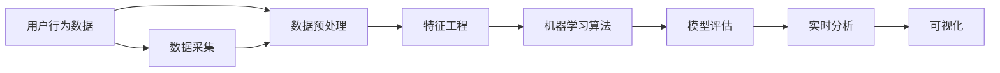

                 

# 如何进行有效的用户行为分析

> 关键词：用户行为分析, 数据挖掘, 机器学习, 深度学习, 决策树, 集成学习, 聚类算法, 特征工程, 数据分析, 实时分析, 商业智能

## 1. 背景介绍

### 1.1 问题由来
在数字化时代的浪潮中，用户行为分析已成为企业了解市场趋势、优化用户体验、提升运营效率的关键手段。通过收集和分析用户的点击、浏览、购买等行为数据，企业可以洞察用户的偏好和需求，精准制定营销策略，预测市场走向。然而，随着用户数据的爆炸式增长，数据质量和复杂度的提升，传统的用户行为分析方法逐渐显现出其局限性。用户数据往往存在异构性、稀疏性、噪声等问题，传统统计方法难以应对大规模数据和复杂多变的用户行为模式。为此，需要引入更先进的数据分析和机器学习技术，实现对用户行为数据的深度挖掘和高效分析。

### 1.2 问题核心关键点
用户行为分析的本质在于从大量原始数据中提取有用的信息，辅助决策过程。核心在于：
- 如何高效获取、整合用户行为数据。
- 如何从数据中抽取有价值的用户行为特征。
- 如何选择合适的模型算法，构建高效的用户行为分析框架。
- 如何对用户行为数据进行可视化呈现，指导业务决策。
- 如何在保证数据安全的前提下，实现实时分析。

## 2. 核心概念与联系

### 2.1 核心概念概述

用户行为分析(Upper Behavior Analysis, UBA) 涉及多个核心概念，这些概念紧密联系，共同构成了UBA的完整框架。

- **用户行为数据(Upper Behavior Data)**：用户在应用中的行为记录，如点击、浏览、搜索、购买等。是用户行为分析的基础数据来源。
- **数据预处理(Data Preprocessing)**：对原始数据进行清洗、归一化、降维等处理，保证数据质量。
- **特征工程(Feature Engineering)**：从原始数据中提取和构造有意义的特征，供后续机器学习模型使用。
- **机器学习算法(Machine Learning Algorithms)**：利用统计学和数据挖掘技术，从数据中提取模式和规律，构建用户行为预测模型。
- **模型评估(Model Evaluation)**：对模型性能进行评估，选择最优模型，优化参数设置。
- **实时分析(Real-time Analysis)**：对用户行为数据进行实时处理和分析，提供即时的决策支持。
- **可视化(Visualization)**：通过图表、仪表盘等形式呈现分析结果，直观展示用户行为趋势和模式。

这些核心概念之间的逻辑关系可以通过以下Mermaid流程图来展示：



这个流程图展示了大规模用户行为数据分析的基本流程：

1. 从数据采集源获取用户行为数据。
2. 对原始数据进行预处理，去除噪声，填补缺失。
3. 对处理后的数据进行特征提取和构造，提升数据质量。
4. 利用机器学习模型对数据进行分析和预测。
5. 对模型进行评估，选择最优模型。
6. 对模型进行实时处理，提供即时分析结果。
7. 将分析结果通过可视化方式呈现，指导决策。

## 3. 核心算法原理 & 具体操作步骤
### 3.1 算法原理概述

用户行为分析的核心目标是构建能够预测用户行为、反映用户偏好的模型。主要依赖于机器学习和深度学习技术，包括监督学习、无监督学习和半监督学习等。

- **监督学习(Supervised Learning)**：通过标注数据训练模型，预测用户行为。常见算法包括决策树、随机森林、支持向量机、神经网络等。
- **无监督学习(Unsupervised Learning)**：无需标注数据，直接从数据中提取用户行为模式。常见算法包括聚类、关联规则挖掘、奇异值分解等。
- **半监督学习(Semi-supervised Learning)**：利用少量标注数据和大量未标注数据训练模型。常见算法包括标签传播、自训练等。

### 3.2 算法步骤详解

用户行为分析的算法流程主要包括以下几个步骤：

**Step 1: 数据采集与预处理**
- 收集用户行为数据：通过日志、点击流、搜索记录等形式，获取用户行为数据。
- 数据清洗：去除异常值、缺失值、重复数据等，保证数据质量。
- 数据归一化：对不同类型的数据进行标准化处理，保证模型一致性。
- 特征选择与构造：从原始数据中提取和构造有意义的特征，提升模型性能。

**Step 2: 特征工程**
- 数据降维：通过PCA、LDA等方法，减少特征维度，提升模型效率。
- 特征构建：利用数据衍生特征，如时间特征、统计特征等，增强模型解释性。
- 特征选择：通过相关性分析、特征重要性排序等方法，选择最有价值的特征。

**Step 3: 模型训练与评估**
- 选择模型：根据任务需求，选择适合的监督学习、无监督学习或半监督学习模型。
- 训练模型：利用训练数据对模型进行训练，调整模型参数，提升模型准确率。
- 模型评估：通过交叉验证、ROC曲线、AUC等指标，评估模型性能。
- 参数调优：通过网格搜索、随机搜索等方法，优化模型参数。

**Step 4: 实时分析与可视化**
- 实时处理：利用流式计算、Spark Streaming等技术，实现对用户行为的实时分析。
- 可视化展示：通过Tableau、Power BI等工具，将分析结果通过图表、仪表盘等形式展示，直观展示用户行为趋势和模式。

### 3.3 算法优缺点

用户行为分析的算法框架具有以下优点：
- 高效性：通过机器学习算法，从大量数据中提取有用信息，提升分析效率。
- 准确性：利用数据挖掘技术，对用户行为模式进行精确预测和分析。
- 实时性：通过实时分析技术，提供即时的决策支持，提升运营效率。
- 可解释性：通过特征工程和模型评估，提升模型的可解释性，帮助业务人员理解结果。

同时，这些算法也存在一定的局限性：
- 数据质量依赖度高：算法结果依赖于数据质量和特征工程的质量。
- 模型复杂度高：部分模型算法可能需要较高的计算资源和时间成本。
- 模型黑盒化：部分深度学习模型如神经网络等，结果难以解释，缺乏透明性。
- 数据安全风险：处理大量用户数据，数据隐私和安全风险较大。

## 4. 数学模型和公式 & 详细讲解 & 举例说明

### 4.1 数学模型构建

用户行为分析的数学模型构建主要包括以下几个关键步骤：

1. 构建原始数据矩阵 $\mathbf{X}$，其中每一行代表一个用户行为，每一列代表一个特征。
2. 通过数据预处理和特征工程，获得处理后的数据矩阵 $\mathbf{X'}$。
3. 选择适当的机器学习算法，定义损失函数 $L$ 和优化目标函数 $F$。
4. 利用训练数据 $\mathbf{X'}_{train}$ 和目标标签 $\mathbf{y}_{train}$ 训练模型，得到模型参数 $\theta$。
5. 利用测试数据 $\mathbf{X'}_{test}$ 和目标标签 $\mathbf{y}_{test}$ 评估模型性能。

### 4.2 公式推导过程

以监督学习中的决策树为例，其核心算法流程包括：

1. 构建决策树：根据信息增益、信息增益比等指标，选择最佳划分特征。
2. 剪枝决策树：防止过拟合，通过交叉验证等方法进行剪枝。
3. 模型评估：利用测试集进行验证，计算准确率、召回率等指标。

具体数学推导如下：

**决策树算法**
$$
\text{Decision Tree} = \mathop{\arg\min}_{T} L(T, D) + \lambda R(T)
$$

其中，$L(T, D)$ 表示模型的损失函数，$R(T)$ 表示模型的正则化项，$\lambda$ 表示正则化系数。损失函数通常为交叉熵或均方误差，正则化项则有L1正则和L2正则两种形式。

**剪枝算法**
$$
\text{Pruning} = \mathop{\arg\min}_{T} L(T, D) + \lambda R(T)
$$

其中，$\lambda$ 表示剪枝系数，$R(T)$ 可以是惩罚项或验证集误差。剪枝的目的在于去除决策树中的无用节点，防止过拟合。

### 4.3 案例分析与讲解

以用户行为预测为例，假设我们有一个电商平台的用户数据，包括用户ID、购买时间、购买金额、购买商品类别等特征。我们的目标是预测用户是否会再次购买。

**Step 1: 数据采集与预处理**
- 收集用户购买记录，构建原始数据矩阵 $\mathbf{X}$。
- 对数据进行清洗，去除异常值和缺失值。
- 对数据进行归一化，使不同特征具有相同的量级。
- 选择有用的特征，如购买金额、购买频率等。

**Step 2: 特征工程**
- 构建时间特征，如购买时间、最近一次购买时间等。
- 计算统计特征，如购买次数、平均购买金额等。
- 通过PCA方法，对数据进行降维，减少特征维度。

**Step 3: 模型训练与评估**
- 选择决策树算法作为模型，利用训练数据对模型进行训练，调整参数。
- 利用测试数据评估模型性能，计算准确率、召回率等指标。
- 进行模型剪枝，防止过拟合。

**Step 4: 实时分析与可视化**
- 利用流式计算技术，对实时购买数据进行实时分析。
- 通过Tableau等工具，将分析结果通过图表、仪表盘等形式展示，直观展示用户行为趋势和模式。

## 5. 项目实践：代码实例和详细解释说明
### 5.1 开发环境搭建

在进行用户行为分析项目实践前，我们需要准备好开发环境。以下是使用Python进行Pandas、Scikit-learn等库开发的环境配置流程：

1. 安装Anaconda：从官网下载并安装Anaconda，用于创建独立的Python环境。

2. 创建并激活虚拟环境：
```bash
conda create -n uba-env python=3.8 
conda activate uba-env
```

3. 安装Pandas、Scikit-learn、Matplotlib等库：
```bash
pip install pandas scikit-learn matplotlib seaborn
```

4. 安装相关开发工具：
```bash
pip install jupyter notebook tensorboard
```

完成上述步骤后，即可在`uba-env`环境中开始用户行为分析实践。

### 5.2 源代码详细实现

以下是使用Python和Scikit-learn库进行用户行为预测的代码实现：

```python
import pandas as pd
from sklearn.model_selection import train_test_split
from sklearn.preprocessing import StandardScaler
from sklearn.ensemble import DecisionTreeClassifier
from sklearn.metrics import accuracy_score, roc_auc_score
import seaborn as sns
import matplotlib.pyplot as plt

# 1. 数据加载
data = pd.read_csv('user_purchase_data.csv')

# 2. 数据预处理
# 构建时间特征
data['time_feature'] = (pd.to_datetime(data['purchase_time']) - data['purchase_time'].min()).dt.days

# 3. 特征选择
selected_features = ['purchase_amount', 'purchase_frequency', 'time_feature']

# 4. 数据分割
train_data, test_data = train_test_split(data, test_size=0.2, random_state=42)

# 5. 数据归一化
scaler = StandardScaler()
train_data[selected_features] = scaler.fit_transform(train_data[selected_features])
test_data[selected_features] = scaler.transform(test_data[selected_features])

# 6. 模型训练与评估
model = DecisionTreeClassifier()
model.fit(train_data[selected_features], train_data['purchase_label'])

train_pred = model.predict(train_data[selected_features])
test_pred = model.predict(test_data[selected_features])

train_acc = accuracy_score(train_data['purchase_label'], train_pred)
test_acc = accuracy_score(test_data['purchase_label'], test_pred)
roc_auc = roc_auc_score(test_data['purchase_label'], test_pred)

# 7. 结果展示
print(f'Train Accuracy: {train_acc:.2f}')
print(f'Test Accuracy: {test_acc:.2f}')
print(f'ROC AUC: {roc_auc:.2f}')

# 可视化结果
sns.pairplot(train_data, hue='purchase_label')
plt.show()
```

### 5.3 代码解读与分析

让我们再详细解读一下关键代码的实现细节：

**数据加载**
- 使用Pandas库加载用户购买数据，构建原始数据矩阵 $\mathbf{X}$。

**数据预处理**
- 构建时间特征，通过计算购买时间与最近一次购买时间的差值，构建时间窗口特征。
- 选择有用的特征，如购买金额、购买频率等。

**数据分割**
- 利用train_test_split方法，将数据划分为训练集和测试集。

**数据归一化**
- 对特征进行归一化处理，使用StandardScaler将特征值缩放到均值为0，方差为1的范围内。

**模型训练与评估**
- 选择决策树算法作为模型，利用训练数据对模型进行训练，计算模型的准确率和AUC值。

**结果展示**
- 输出模型在训练集和测试集上的准确率及AUC值。
- 使用Seaborn库对训练数据进行可视化展示。

## 6. 实际应用场景
### 6.1 电商平台的用户行为预测

电商平台通过用户行为预测，可以精准推荐商品，提高用户购买转化率，优化库存管理，提升运营效率。利用用户行为分析，电商平台能够预测用户的购买倾向，预测哪些商品可能受到用户青睐，进而进行个性化推荐。

具体实现流程如下：
1. 收集用户购买历史数据，包括购买金额、购买频率、浏览时间等行为数据。
2. 对数据进行预处理，构建时间窗口特征，选择有用的特征。
3. 利用决策树等算法构建用户行为预测模型。
4. 在实时购买数据上进行实时预测，指导商品推荐。
5. 通过可视化工具，展示用户行为趋势和推荐效果。

### 6.2 金融领域的用户行为监测

金融领域利用用户行为监测，可以及时发现风险信号，防范金融欺诈，提升用户体验。利用用户行为分析，金融公司可以监测用户的异常交易行为，及时预警潜在风险，保障用户资金安全。

具体实现流程如下：
1. 收集用户交易记录，包括交易金额、交易时间、交易地点等行为数据。
2. 对数据进行预处理，构建时间窗口特征，选择有用的特征。
3. 利用聚类、关联规则挖掘等算法构建用户行为监测模型。
4. 在实时交易数据上进行实时监测，及时发现异常行为。
5. 通过可视化工具，展示用户行为模式和风险预警结果。

### 6.3 教育行业的用户行为分析

教育行业利用用户行为分析，可以提升教学质量，优化学习体验，实现个性化教学。利用用户行为分析，教育平台能够分析学生的学习行为，发现学习薄弱环节，制定个性化学习计划，提升学生学习效果。

具体实现流程如下：
1. 收集学生学习行为数据，包括学习时间、学习内容、学习成果等行为数据。
2. 对数据进行预处理，构建时间窗口特征，选择有用的特征。
3. 利用聚类、关联规则挖掘等算法构建用户行为分析模型。
4. 在实时学习数据上进行实时分析，制定个性化学习计划。
5. 通过可视化工具，展示学生行为模式和学习效果。

### 6.4 未来应用展望

随着用户行为分析技术的不断进步，未来将在更多领域得到应用，为各个行业带来变革性影响。

在智慧医疗领域，利用用户行为分析，可以预测疾病发展趋势，提前进行医疗干预，提升医疗服务质量。
在智能城市治理中，利用用户行为分析，可以监测城市事件动态，提升城市管理智能化水平，构建更安全、高效的城市。
在娱乐传媒领域，利用用户行为分析，可以优化内容推荐，提升用户满意度和粘性，增加广告收益。

## 7. 工具和资源推荐
### 7.1 学习资源推荐

为了帮助开发者系统掌握用户行为分析的理论基础和实践技巧，这里推荐一些优质的学习资源：

1. 《Python数据科学手册》系列博文：由数据科学专家撰写，全面介绍Pandas、Scikit-learn等数据科学库的使用方法。
2. Coursera《数据科学与机器学习》课程：由约翰霍普金斯大学开设，系统介绍数据科学和机器学习的基本概念和经典模型。
3. 《深度学习入门》书籍：使用Python和TensorFlow实现深度学习模型的经典教程。
4. Kaggle数据科学竞赛平台：提供丰富的数据集和竞赛任务，帮助开发者实践数据科学项目。
5. Scikit-learn官方文档：提供详细的API文档和示例代码，方便开发者学习和使用。

通过对这些资源的学习实践，相信你一定能够快速掌握用户行为分析的精髓，并用于解决实际的业务问题。

### 7.2 开发工具推荐

高效的开发离不开优秀的工具支持。以下是几款用于用户行为分析开发的常用工具：

1. Jupyter Notebook：开源的交互式开发环境，支持Python、R等多种语言，方便快速迭代实验。
2. TensorBoard：TensorFlow配套的可视化工具，可实时监测模型训练状态，提供丰富的图表展示功能。
3. Tableau：商业智能可视化工具，提供丰富的数据可视化功能，支持多种数据源。
4. Apache Spark：流式计算框架，支持大规模数据实时处理，适合处理海量用户行为数据。
5. Apache Flink：流式计算框架，提供高效的实时数据处理能力，支持多种编程语言。

合理利用这些工具，可以显著提升用户行为分析的开发效率，加快创新迭代的步伐。

### 7.3 相关论文推荐

用户行为分析领域的研究涉及多个子领域，以下是几篇奠基性的相关论文，推荐阅读：

1. Decision Trees in Data Mining (ID3)：决策树算法的经典论文，介绍了决策树的基本原理和算法流程。
2. Random Forest: A Randomization Approach to Decision Tree Induction：随机森林算法，介绍了一种基于集成学习的决策树算法。
3. Clustering-Based Anomaly Detection (K-Means)：聚类算法的经典论文，介绍了K-means算法的原理和实现方法。
4. Association Rules and Their Use in Knowledge Discovery：关联规则挖掘算法，介绍了一种基于统计的特征提取方法。
5. Neural Collaborative Filtering：协同过滤算法，介绍了一种基于深度学习的推荐系统模型。

这些论文代表了大规模用户行为分析技术的发展脉络。通过学习这些前沿成果，可以帮助研究者把握学科前进方向，激发更多的创新灵感。

## 8. 总结：未来发展趋势与挑战
### 8.1 总结

本文对用户行为分析的原理和实践进行了全面系统的介绍。首先阐述了用户行为分析在数字化时代的重要性和挑战，明确了用户行为分析在业务决策中的关键作用。其次，从原理到实践，详细讲解了用户行为分析的数学模型和关键步骤，给出了用户行为分析任务开发的完整代码实例。同时，本文还广泛探讨了用户行为分析在电商平台、金融领域、教育行业等多个行业领域的应用前景，展示了用户行为分析技术的巨大潜力。此外，本文精选了用户行为分析技术的各类学习资源，力求为读者提供全方位的技术指引。

通过本文的系统梳理，可以看到，用户行为分析技术正在成为数字化运营的重要手段，极大地拓展了业务决策的智能水平，提升了运营效率和用户体验。未来，伴随数据质量和计算能力的不断提升，用户行为分析技术将进一步发展，为企业提供更精准、实时的决策支持，推动各行业的数字化转型。

### 8.2 未来发展趋势

展望未来，用户行为分析技术将呈现以下几个发展趋势：

1. 多模态数据融合：结合文本、图像、语音等多种数据源，提升对用户行为的全面理解。
2. 实时化处理：利用流式计算技术，实现对用户行为的实时分析和预测。
3. 自动化建模：通过自动化模型构建工具，降低建模门槛，提升建模效率。
4. 深度学习应用：利用深度学习技术，提升对用户行为模式的准确预测。
5. 数据隐私保护：引入数据隐私保护技术，确保用户数据的安全性和隐私性。
6. 多领域扩展：将用户行为分析技术应用到更多领域，如智慧医疗、智能城市、娱乐传媒等。

以上趋势凸显了用户行为分析技术的广阔前景。这些方向的探索发展，必将进一步提升用户行为分析的效果，为各行业带来更高效、精准的业务决策支持。

### 8.3 面临的挑战

尽管用户行为分析技术已经取得了显著进展，但在迈向更加智能化、普适化应用的过程中，它仍面临着诸多挑战：

1. 数据质量和多样性：用户行为数据往往存在异构性、稀疏性、噪声等问题，需要高质量的数据处理和特征工程。
2. 模型复杂度：部分高级算法如深度学习模型，需要较高的计算资源和时间成本，难以在生产环境中大规模部署。
3. 模型可解释性：部分深度学习模型如神经网络等，结果难以解释，缺乏透明性。
4. 数据隐私和安全：处理大量用户数据，数据隐私和安全风险较大。
5. 实时性要求高：实时处理海量数据，对计算资源和算法效率要求较高。

正视用户行为分析面临的这些挑战，积极应对并寻求突破，将是大规模用户行为分析技术走向成熟的必由之路。

### 8.4 研究展望

面对用户行为分析面临的挑战，未来的研究需要在以下几个方面寻求新的突破：

1. 数据质量提升：引入数据清洗、数据增强等技术，提升数据质量，降低数据噪音。
2. 模型效率优化：开发参数高效的算法，降低模型复杂度，提高模型效率。
3. 模型解释性增强：引入模型可解释性技术，提升模型的透明性和可解释性。
4. 数据隐私保护：引入差分隐私、联邦学习等技术，确保用户数据的安全性和隐私性。
5. 多模态数据融合：引入跨模态学习技术，实现多模态数据的高效融合。
6. 自动化建模：引入自动化建模工具，降低建模门槛，提升建模效率。

这些研究方向的探索，必将引领用户行为分析技术迈向更高的台阶，为各行业提供更精准、实时的决策支持。总之，用户行为分析技术需要从数据、算法、工程、业务等多个维度协同发力，才能真正实现其广泛应用，推动各行业的数字化转型。

