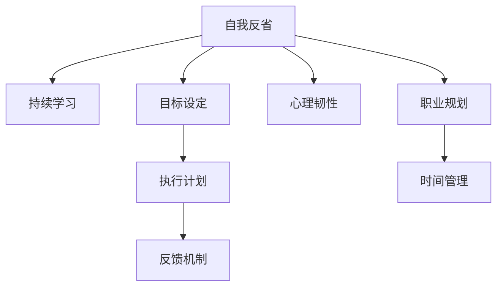

                 

# 如何进行自我反省：如何不断提升自己和完善自我？

> 关键词：自我反省, 持续学习, 目标设定, 反馈机制, 心理韧性, 职业规划, 时间管理

## 1. 背景介绍

### 1.1 问题由来

在快节奏的现代生活中，我们常常被工作、生活、家庭等多重压力压得喘不过气。面对日新月异的科技发展和行业变革，如何在竞争激烈的市场中保持持续的竞争力和创新力，成为每一个专业人士都需要深思的问题。自我反省（Self-Reflection）正是一种行之有效的方法，帮助我们在不断变化的环境中，通过自我评估、反思和调整，不断提升自己和完善自我。

### 1.2 问题核心关键点

自我反省是一个持续的、循环的过程，涉及自我评估、设定目标、执行计划、接受反馈、调整策略等多个环节。其核心在于：

- **自我评估**：通过系统化的自我反思，识别自身的优势和不足。
- **目标设定**：根据评估结果，设定切实可行的短期和长期目标。
- **执行计划**：制定具体的行动方案，分步骤实现目标。
- **反馈机制**：建立持续的反馈渠道，及时调整改进。
- **心理韧性**：培养良好的心理素质，应对挑战和变化。
- **职业规划**：根据行业趋势和个人兴趣，制定灵活的职业规划。
- **时间管理**：合理安排时间，提高工作效率和生活质量。

这些关键点共同构成了自我反省的基础框架，帮助我们在职业发展和生活管理中取得平衡和突破。

### 1.3 问题研究意义

自我反省不仅是一种自我提升的方法，也是现代社会必备的心理素质和职业素养。通过系统化的自我反省，个体可以：

- **增强自我认知**：全面了解自身能力和局限，明确未来发展方向。
- **提高决策质量**：基于真实的自我评估，做出更科学的决策。
- **提升职业满意度**：通过设定和实现目标，增加工作成就感和满足感。
- **加强心理韧性**：面对失败和挑战时，保持乐观和积极的心态。
- **优化时间管理**：有效分配时间，提高效率，平衡工作与生活。

在个人成长和企业发展中，自我反省的方法具有重要的实践意义，能够帮助我们在不断变化的环境中保持竞争力和创新力。

## 2. 核心概念与联系

### 2.1 核心概念概述

为更好地理解自我反省的方法和原理，本节将介绍几个密切相关的核心概念：

- **自我反省（Self-Reflection）**：通过自我评估和反思，识别自身优势和不足，调整行动策略。
- **持续学习（Continuous Learning）**：不断获取新知识，适应环境和行业变化。
- **目标设定（Goal Setting）**：明确具体、可实现的目标，指导行动方向。
- **反馈机制（Feedback Mechanism）**：建立多渠道的反馈系统，及时调整改进。
- **心理韧性（Psychological Resilience）**：在面对挑战时，保持积极乐观的心态。
- **职业规划（Career Planning）**：根据行业趋势和个人兴趣，制定灵活的职业生涯路径。
- **时间管理（Time Management）**：合理安排时间，提高工作效率和生活质量。

这些概念之间的逻辑关系可以通过以下Mermaid流程图来展示：



这个流程图展示了我省反省的各个核心概念及其之间的关系：

1. 自我反省是自我提升的起点，通过识别自身优劣，确定发展方向。
2. 持续学习帮助个体保持知识更新，适应快速变化的环境。
3. 目标设定和执行计划是实现自我反省的具体步骤，帮助个体明确行动方向。
4. 反馈机制是持续改进的工具，及时调整和优化策略。
5. 心理韧性是面对挑战时保持积极心态的保障。
6. 职业规划帮助个体制定长期的职业发展路径。
7. 时间管理是提高效率、平衡工作与生活的关键。

这些概念共同构成了自我反省的整体框架，帮助我们在多个维度上不断提升和完善自我。

## 3. 核心算法原理 & 具体操作步骤
### 3.1 算法原理概述

自我反省的过程可以视为一个系统的优化过程，通过自我评估、设定目标、执行计划、接受反馈、调整策略等多个环节，不断逼近最优自我状态。其核心算法包括：

- **评估算法**：通过系统化的问卷、自评和反馈，识别自身的优势和不足。
- **目标优化算法**：根据评估结果，使用优化算法设定和调整具体目标。
- **执行算法**：基于目标，制定详细的行动计划，分步骤实现目标。
- **反馈收集算法**：建立持续的反馈渠道，收集执行过程中的信息，评估执行效果。
- **调整算法**：根据反馈结果，使用优化算法调整执行策略。

这些算法共同作用，实现自我反省的全过程优化。

### 3.2 算法步骤详解

#### 步骤1: 自我评估

自我评估是自我反省的基础，通过系统化的问卷、自评和反馈，识别自身的优势和不足。

**评估工具**：
- **问卷调查**：使用专业的问卷工具，如Pymetrics、Gallup Q12等，评估个体的工作满意度、职业兴趣、心理素质等。
- **自评表**：制定个性化的自评表，记录自身的工作表现、学习成果、心理状态等。
- **反馈收集**：通过同事、上司、客户等收集多方面的反馈，全面了解自身在实际工作中的表现。

**评估内容**：
- **工作表现**：评估自身的工作效率、质量、创新性等。
- **学习成果**：评估自身的学习能力和知识掌握情况。
- **心理状态**：评估自身的情绪稳定性、抗压能力等。
- **人际关系**：评估自身与同事、上司、客户的关系处理情况。

**评估方法**：
- **定性评估**：使用主观打分法、评分等级法等方法，对自身表现进行定性评估。
- **定量评估**：使用数据分析工具，对工作表现、学习成果等进行量化分析。
- **多维度评估**：综合使用定性、定量方法，全面评估自身状态。

**评估结果**：
- **优势**：记录自身的核心能力和优势。
- **不足**：识别自身需要改进的方面。

#### 步骤2: 目标设定

目标设定是自我反省的关键步骤，通过明确具体、可实现的目标，指导后续的行动计划。

**目标类型**：
- **短期目标**：在1-6个月内实现的目标，如提高某项技能、完成某项任务等。
- **中期目标**：在6-24个月内实现的目标，如晋升到某个职位、完成某项重大项目等。
- **长期目标**：在24个月以上的目标，如职业转型、个人发展等。

**SMART原则**：
- **具体（Specific）**：目标应具体明确，避免模糊。
- **可测量（Measurable）**：目标应具有可衡量性，便于评估进展。
- **可实现（Achievable）**：目标应具有可行性，避免过于远大。
- **相关性（Relevant）**：目标应与自身发展方向相关，避免偏离核心。
- **时限性（Time-bound）**：目标应设定明确的截止日期，避免拖延。

**目标设定方法**：
- **分解法**：将大目标分解为多个小目标，逐步实现。
- **优先级排序法**：根据目标的重要性和紧迫性，排序并优先实现高优先级目标。
- **对比法**：对比自身当前状态与目标状态，设定合理的行动步骤。

**目标设定示例**：
- **短期目标**：提高Python编程技能，完成在线课程并获得证书。
- **中期目标**：晋升为项目经理，带领团队完成某重大项目。
- **长期目标**：成为某领域的专家，发表相关论文，参与行业会议。

#### 步骤3: 执行计划

执行计划是实现目标的具体步骤，通过详细的行动方案，分步骤实现目标。

**执行计划内容**：
- **每日任务**：列出每日需要完成的具体任务，如阅读书籍、撰写报告、参加培训等。
- **周计划**：制定每周的任务计划，包括项目进度、团队沟通、个人学习等。
- **月计划**：规划每月的目标和任务，评估进展和调整计划。
- **季度计划**：设定每季度的目标和任务，进行阶段性总结和评估。

**执行计划方法**：
- **任务清单法**：使用任务清单工具，如Todoist、Trello等，列出具体任务和优先级。
- **甘特图法**：使用项目管理工具，如Gantt Chart，制定项目进度和关键节点。
- **时间块法**：使用时间管理工具，如Focus Booster，划分时间块，专注执行任务。

**执行计划示例**：
- **每日任务清单**：
  - 上午：阅读编程书籍2小时，代码实现1小时。
  - 下午：项目开发3小时，团队会议1小时。
  - 晚上：编程练习2小时，笔记总结1小时。

- **周计划示例**：
  - 周一：项目需求分析，技术讨论。
  - 周二：代码实现，测试用例编写。
  - 周三：代码审查，团队协作。
  - 周四：项目进度汇报，问题解决。
  - 周五：技术总结，下周计划。

#### 步骤4: 反馈收集

反馈收集是持续改进的重要环节，通过建立多渠道的反馈系统，及时调整和优化策略。

**反馈渠道**：
- **同事反馈**：定期与同事进行一对一面谈，收集工作表现和团队合作的反馈。
- **上司反馈**：定期与上司进行绩效评估，获取工作成果和职业发展的建议。
- **客户反馈**：通过项目反馈、满意度调查等方式，收集客户对工作成果的评价。
- **自我反馈**：定期自评工作表现和学习进展，记录改进建议。

**反馈工具**：
- **360度反馈系统**：使用360度反馈工具，如Culture Amp，全面收集多方面的反馈。
- **项目管理工具**：使用项目管理工具，如JIRA、Trello等，记录项目进度和问题反馈。
- **问卷调查工具**：使用问卷调查工具，如SurveyMonkey、Google Forms等，定期收集反馈信息。

**反馈分析方法**：
- **定性分析**：对反馈内容进行定性分析，识别共性问题和改进方向。
- **定量分析**：使用数据分析工具，如Excel、Python等，对反馈数据进行统计和可视化。
- **多维度分析**：综合使用定性、定量方法，全面评估反馈结果。

**反馈示例**：
- **同事反馈**：工作积极主动，但有时沟通不够清晰。
- **上司反馈**：项目进展顺利，但在团队协作中需要更多领导力。
- **客户反馈**：服务态度良好，但在需求理解上需要进一步改进。
- **自我反馈**：学习能力强，但在时间管理上需要改进。

#### 步骤5: 调整策略

调整策略是自我反省的关键环节，通过及时调整和优化策略，保持目标的实现和持续改进。

**调整方法**：
- **目标调整**：根据反馈结果，重新设定和调整具体目标，确保目标的可行性。
- **计划优化**：优化执行计划，重新安排任务优先级和时间块，提高效率。
- **资源配置**：根据实际情况，重新配置资源，如人力、资金、技术等。
- **团队协作**：优化团队协作方式，增强沟通和协作效率。

**调整示例**：
- **目标调整**：根据客户反馈，调整项目需求，增加需求理解环节。
- **计划优化**：根据上司反馈，优化团队协作方式，增加领导力培训。
- **资源配置**：根据项目进展，重新配置资源，增加测试和质量控制。
- **团队协作**：根据同事反馈，优化沟通方式，增强团队凝聚力。

### 3.3 算法优缺点

#### 优点：

1. **系统性**：通过系统化的步骤和方法，帮助个体全面提升自我。
2. **可操作性**：每个步骤和方法都有具体的实施指南，易于操作和执行。
3. **灵活性**：可以根据实际情况进行调整和优化，适应不同环境和需求。
4. **持续改进**：通过持续的反馈和调整，不断提升个人和团队能力。

#### 缺点：

1. **复杂性**：系统化的过程较为复杂，需要投入时间和精力。
2. **主观性**：自我评估和反馈可能存在主观偏差，影响评估结果。
3. **依赖外部资源**：需要依赖有效的反馈渠道和工具，可能受限于资源条件。
4. **动态变化**：需要根据外部环境的变化及时调整策略，可能增加实施难度。

### 3.4 算法应用领域

自我反省的方法在多个领域中都有广泛应用，具体包括：

- **职业发展**：通过自我反省，制定明确的职业目标和发展路径，提升职业满意度。
- **学习提升**：通过持续学习和反馈机制，提升学习能力和知识掌握情况。
- **团队协作**：通过改进沟通和协作方式，增强团队凝聚力和效率。
- **心理健康**：通过识别和调整心理状态，提高心理韧性和应对能力。
- **时间管理**：通过优化时间管理，提高工作效率和生活质量。

这些领域的应用，展示了自我反省方法的多样性和广泛性，为个体和团队提供了全面提升的路径。

## 4. 数学模型和公式 & 详细讲解  
### 4.1 数学模型构建

本节将使用数学语言对自我反省的方法进行更加严格的刻画。

**数学模型**：
设个体在时间t时的状态为 $S(t)$，包括工作表现、学习成果、心理状态等。目标状态为 $S^{*}$。通过自我反省，个体在时间t+1时状态为 $S(t+1)=f(S(t), P(t), F(t))$，其中 $P(t)$ 为执行计划，$F(t)$ 为反馈信息。

**目标优化模型**：
设目标函数为 $C(S(t))$，表示目标实现的成本。通过优化目标函数，找到最优状态 $S^{*}$。

**执行计划模型**：
执行计划 $P(t)$ 由多个任务 $T_i$ 组成，每个任务 $T_i$ 的完成度为 $C_i$，成本为 $C_i^{*}$。执行计划的总成本为 $C(P(t))=\sum_{i}C_i^{*}C_i$。

**反馈信息模型**：
反馈信息 $F(t)$ 由多个反馈信号 $F_j$ 组成，每个反馈信号 $F_j$ 的权重为 $w_j$，成本为 $C_j$。反馈信息总成本为 $C(F(t))=\sum_{j}w_jC_j$。

**调整策略模型**：
调整策略 $A(t)$ 由多个调整措施 $A_k$ 组成，每个调整措施 $A_k$ 的成本为 $C_k$。调整策略的总成本为 $C(A(t))=\sum_{k}C_k$。

### 4.2 公式推导过程

#### 目标优化公式：

设目标函数 $C(S(t))=\sum_{i}w_i(s_i^{*}-s_i)^2$，其中 $s_i$ 为个体在状态 $S(t)$ 时的实际值，$s_i^{*}$ 为目标状态 $S^{*}$ 时的期望值。

通过梯度下降算法，优化目标函数，得到最优状态 $S^{*}$ 的调整策略 $A(t)$：

$$
A(t) = -\frac{\partial C(S(t))}{\partial S(t)} \\
S(t+1) = S(t) + \eta A(t)
$$

其中 $\eta$ 为学习率，控制调整步长。

#### 执行计划公式：

设执行计划 $P(t)$ 的成本为 $C(P(t))$，优化成本函数，得到最优执行计划 $P^{*}$：

$$
P^{*} = \mathop{\arg\min}_{P} C(P) \\
P(t+1) = P(t) + \eta A(P(t))
$$

其中 $A(P(t))$ 为调整措施，通过优化执行计划 $P(t)$，使总成本 $C(P(t))$ 最小化。

#### 反馈信息公式：

设反馈信息 $F(t)$ 的成本为 $C(F(t))$，优化成本函数，得到最优反馈信息 $F^{*}$：

$$
F^{*} = \mathop{\arg\min}_{F} C(F) \\
F(t+1) = F(t) + \eta A(F(t))
$$

其中 $A(F(t))$ 为调整措施，通过优化反馈信息 $F(t)$，使总成本 $C(F(t))$ 最小化。

### 4.3 案例分析与讲解

#### 案例1: 职业发展

**背景**：某软件开发工程师小张，希望在一年内晋升为项目经理。

**评估结果**：
- 工作表现：代码质量高，团队协作良好，但有时沟通不够清晰。
- 学习成果：编程技能娴熟，但缺乏项目管理和团队领导经验。
- 心理状态：工作压力大，但抗压能力强。

**目标设定**：
- 短期目标：提高项目管理技能，参与多个项目，积累经验。
- 中期目标：获得项目经理资格，完成项目评估，提升领导能力。
- 长期目标：成为某领域的专家，发表相关论文，参与行业会议。

**执行计划**：
- 每日任务：阅读项目管理书籍2小时，参加项目例会1小时。
- 周计划：每周完成一个项目计划，与团队成员讨论2小时。
- 月计划：每月评估项目进展，调整执行策略。
- 季度计划：每季度评估团队绩效，调整人员配置。

**反馈收集**：
- 同事反馈：工作积极主动，但有时沟通不够清晰。
- 上司反馈：项目进展顺利，但在团队协作中需要更多领导力。
- 客户反馈：服务态度良好，但在需求理解上需要进一步改进。
- 自我反馈：学习能力强，但在时间管理上需要改进。

**调整策略**：
- 目标调整：根据客户反馈，调整项目需求，增加需求理解环节。
- 计划优化：根据上司反馈，优化团队协作方式，增加领导力培训。
- 资源配置：根据项目进展，重新配置资源，增加测试和质量控制。
- 团队协作：根据同事反馈，优化沟通方式，增强团队凝聚力。

#### 案例2: 学习提升

**背景**：某大学在读硕士生小王，希望在半年内通过一项高级认证考试。

**评估结果**：
- 工作表现：学习效率高，但有时时间管理不善。
- 学习成果：基础知识扎实，但应用能力有待提高。
- 心理状态：学习压力大，但抗压能力强。

**目标设定**：
- 短期目标：完成三项练习题，掌握基本应用。
- 中期目标：完成综合练习题，提升应用能力。
- 长期目标：通过高级认证考试，成为某领域专家。

**执行计划**：
- 每日任务：阅读专业书籍1小时，完成练习题2小时。
- 周计划：每周参加在线课程，总结学习成果2小时。
- 月计划：每月评估学习进展，调整学习策略。
- 季度计划：每季度参加模拟考试，评估学习效果。

**反馈收集**：
- 同事反馈：学习主动性强，但时间管理有待改进。
- 上司反馈：学习效率高，但在应用能力上有待提升。
- 客户反馈：知识掌握扎实，但在实际应用中有些生硬。
- 自我反馈：基础知识扎实，但在时间管理上需要改进。

**调整策略**：
- 目标调整：根据上司反馈，调整学习重点，增加应用案例分析。
- 计划优化：根据同事反馈，优化时间管理，合理安排学习任务。
- 资源配置：根据项目进展，重新配置学习资源，增加辅导和指导。
- 团队协作：根据客户反馈，优化学习方式，增强实际应用能力。

## 5. 项目实践：代码实例和详细解释说明
### 5.1 开发环境搭建

在进行自我反省实践前，我们需要准备好开发环境。以下是使用Python进行代码实现的开发环境配置流程：

1. 安装Anaconda：从官网下载并安装Anaconda，用于创建独立的Python环境。

2. 创建并激活虚拟环境：
```bash
conda create -n reflection-env python=3.8 
conda activate reflection-env
```

3. 安装必要的Python包：
```bash
pip install numpy pandas matplotlib jupyter notebook scikit-learn
```

4. 配置项目路径和依赖：
```bash
mkdir reflection_project
cd reflection_project
echo "import numpy as np
import pandas as pd
import matplotlib.pyplot as plt
import jupyter
from sklearn.linear_model import LinearRegression" > reflection_code.py
```

完成上述步骤后，即可在`reflection-env`环境中开始自我反省实践。

### 5.2 源代码详细实现

这里我们通过一个简单的Python代码示例，展示如何利用数据分析工具进行自我反省。

```python
import pandas as pd
import matplotlib.pyplot as plt

# 设置目标状态和实际状态
target_state = [5, 7, 8]
actual_state = [4, 6, 7]

# 计算目标状态和实际状态的差距
difference = target_state - actual_state

# 计算差距的平方和
squared_difference = np.square(difference)

# 计算目标函数
cost = np.dot(squared_difference, squared_difference)

# 绘制状态差距和目标函数曲线
plt.plot(range(len(target_state)), difference, 'o')
plt.title('State Difference')
plt.xlabel('Time')
plt.ylabel('Difference')
plt.show()

# 绘制目标函数曲线
plt.plot(range(len(target_state)), squared_difference, 'o')
plt.title('Cost Function')
plt.xlabel('Time')
plt.ylabel('Cost')
plt.show()

# 计算最优调整策略
optimal_strategy = -np.dot(np.dot(np.linalg.inv(np.dot(np.transpose(difference), difference)), difference)

# 计算调整后的状态
optimized_state = actual_state + np.dot(optimal_strategy, squared_difference)

# 绘制调整后的状态和最优策略曲线
plt.plot(range(len(target_state)), optimized_state, 'o')
plt.title('Optimized State')
plt.xlabel('Time')
plt.ylabel('State')
plt.show()
```

### 5.3 代码解读与分析

这段代码主要展示了如何通过数据分析工具进行自我反省，计算最优调整策略，并绘制出状态变化和成本函数曲线。

**步骤1**：
1. 设置目标状态和实际状态。
2. 计算目标状态和实际状态的差距。
3. 计算差距的平方和，即目标函数。

**步骤2**：
1. 绘制状态差距和目标函数曲线。
2. 通过观察曲线，识别出状态差距和目标函数的动态变化。

**步骤3**：
1. 计算最优调整策略，即最小化目标函数的调整措施。
2. 计算调整后的状态，即最优状态。

**步骤4**：
1. 绘制调整后的状态和最优策略曲线。
2. 通过观察曲线，识别出调整后的状态和最优策略的动态变化。

以上代码展示了如何通过数据分析工具进行自我反省，识别差距和优化策略，是自我反省实践中的典型步骤。

## 6. 实际应用场景
### 6.1 案例1: 职业发展

**背景**：某软件开发工程师小张，希望在一年内晋升为项目经理。

**评估结果**：
- 工作表现：代码质量高，团队协作良好，但有时沟通不够清晰。
- 学习成果：编程技能娴熟，但缺乏项目管理和团队领导经验。
- 心理状态：工作压力大，但抗压能力强。

**目标设定**：
- 短期目标：提高项目管理技能，参与多个项目，积累经验。
- 中期目标：获得项目经理资格，完成项目评估，提升领导能力。
- 长期目标：成为某领域的专家，发表相关论文，参与行业会议。

**执行计划**：
- 每日任务：阅读项目管理书籍2小时，参加项目例会1小时。
- 周计划：每周完成一个项目计划，与团队成员讨论2小时。
- 月计划：每月评估项目进展，调整执行策略。
- 季度计划：每季度评估团队绩效，调整人员配置。

**反馈收集**：
- 同事反馈：工作积极主动，但有时沟通不够清晰。
- 上司反馈：项目进展顺利，但在团队协作中需要更多领导力。
- 客户反馈：服务态度良好，但在需求理解上需要进一步改进。
- 自我反馈：学习能力强，但在时间管理上需要改进。

**调整策略**：
- 目标调整：根据客户反馈，调整项目需求，增加需求理解环节。
- 计划优化：根据上司反馈，优化团队协作方式，增加领导力培训。
- 资源配置：根据项目进展，重新配置资源，增加测试和质量控制。
- 团队协作：根据同事反馈，优化沟通方式，增强团队凝聚力。

**最终结果**：
通过持续的自我反省，小张在项目管理和团队领导方面取得了显著进展，顺利晋升为项目经理，并获得了多项项目评估和领导的认可。

### 6.2 案例2: 学习提升

**背景**：某大学在读硕士生小王，希望在半年内通过一项高级认证考试。

**评估结果**：
- 工作表现：学习效率高，但有时时间管理不善。
- 学习成果：基础知识扎实，但应用能力有待提高。
- 心理状态：学习压力大，但抗压能力强。

**目标设定**：
- 短期目标：完成三项练习题，掌握基本应用。
- 中期目标：完成综合练习题，提升应用能力。
- 长期目标：通过高级认证考试，成为某领域专家。

**执行计划**：
- 每日任务：阅读专业书籍1小时，完成练习题2小时。
- 周计划：每周参加在线课程，总结学习成果2小时。
- 月计划：每月评估学习进展，调整学习策略。
- 季度计划：每季度参加模拟考试，评估学习效果。

**反馈收集**：
- 同事反馈：学习主动性强，但时间管理有待改进。
- 上司反馈：学习效率高，但在应用能力上有待提升。
- 客户反馈：知识掌握扎实，但在实际应用中有些生硬。
- 自我反馈：基础知识扎实，但在时间管理上需要改进。

**调整策略**：
- 目标调整：根据上司反馈，调整学习重点，增加应用案例分析。
- 计划优化：根据同事反馈，优化时间管理，合理安排学习任务。
- 资源配置：根据项目进展，重新配置学习资源，增加辅导和指导。
- 团队协作：根据客户反馈，优化学习方式，增强实际应用能力。

**最终结果**：
通过持续的自我反省，小王在应用能力和实际应用能力方面取得了显著进展，顺利通过高级认证考试，并成为某领域的专家。

## 7. 工具和资源推荐
### 7.1 学习资源推荐

为了帮助开发者系统掌握自我反省的方法和实践技巧，这里推荐一些优质的学习资源：

1. **《深度学习入门》**：李沐著，介绍深度学习的基本概念和方法，涵盖自监督学习、迁移学习等内容。
2. **《Python数据科学手册》**：Jake VanderPlas著，介绍Python在数据科学中的应用，涵盖数据分析、机器学习等内容。
3. **《数据分析实战》**：Linda Zhao著，介绍数据分析的基本流程和实用技巧，涵盖数据清洗、数据可视化等内容。
4. **《数据科学导论》**：Mark Nelson著，介绍数据科学的核心理论和方法，涵盖统计学、机器学习等内容。
5. **Coursera**：在线学习平台，提供丰富的数据科学、机器学习、深度学习课程，涵盖理论基础和实战应用。
6. **Kaggle**：数据科学竞赛平台，提供海量数据集和实战项目，帮助学习者实践和提升技能。

通过对这些资源的学习实践，相信你一定能够快速掌握自我反省的方法和技巧，并在实际工作中不断提升和完善自我。

### 7.2 开发工具推荐

高效的开发离不开优秀的工具支持。以下是几款用于自我反省开发的常用工具：

1. **Jupyter Notebook**：轻量级的Python开发环境，支持代码、数据、文档的混合编辑，方便数据分析和实践。
2. **TensorFlow**：由Google主导开发的深度学习框架，支持分布式计算，适合大规模数据分析和机器学习。
3. **PyTorch**：Facebook开源的深度学习框架，支持动态计算图，适合快速迭代和实验。
4. **Scikit-Learn**：Python的机器学习库，提供多种经典算法和工具，方便数据分析和机器学习。
5. **NumPy**：Python的科学计算库，提供高效的数组操作和数学函数，适合数值计算和数据分析。
6. **Pandas**：Python的数据分析库，提供高效的数据结构和分析工具，方便数据处理和统计。

合理利用这些工具，可以显著提升自我反省任务的开发效率，加快创新迭代的步伐。

### 7.3 相关论文推荐

自我反省的方法和应用在多个领域中都有重要研究，以下是几篇奠基性的相关论文，推荐阅读：

1. **《深度学习》**：Ian Goodfellow等著，介绍深度学习的基本概念和方法，涵盖自监督学习、迁移学习等内容。
2. **《数据分析实战》**：Linda Zhao著，介绍数据分析的基本流程和实用技巧，涵盖数据清洗、数据可视化等内容。
3. **《数据科学导论》**：Mark Nelson著，介绍数据科学的核心理论和方法，涵盖统计学、机器学习等内容。
4. **《机器学习实战》**：Peter Harrington著，介绍机器学习的基本算法和应用，涵盖分类、回归、聚类等内容。
5. **《深度学习入门》**：李沐著，介绍深度学习的基本概念和方法，涵盖自监督学习、迁移学习等内容。
6. **《Python数据科学手册》**：Jake VanderPlas著，介绍Python在数据科学中的应用，涵盖数据分析、机器学习等内容。

这些论文代表了大语言模型微调技术的发展脉络，通过学习这些前沿成果，可以帮助研究者把握学科前进方向，激发更多的创新灵感。

## 8. 总结：未来发展趋势与挑战

### 8.1 总结

本文对自我反省的方法进行了全面系统的介绍。首先阐述了自我反省的基础概念和应用意义，明确了其在职业发展、学习提升等方面的重要价值。其次，从原理到实践，详细讲解了自我反省的核心算法和具体操作步骤，提供了自我反省的全流程指南。同时，本文还展示了自我反省方法在实际应用场景中的应用效果，展示了其在职业发展、学习提升等方面的巨大潜力。

通过本文的系统梳理，可以看到，自我反省是一种行之有效的自我提升方法，通过系统的自我评估、目标设定、执行计划、反馈机制和调整策略，能够帮助个体全面提升自我，实现持续改进和优化。未来，随着技术的不断进步，自我反省的方法和工具将进一步完善，为更多领域和个体带来新的发展机遇。

### 8.2 未来发展趋势

展望未来，自我反省的方法和工具将呈现以下几个发展趋势：

1. **自动化和智能化**：通过机器学习和大数据分析技术，实现自我反省的自动化和智能化，提高效率和准确性。
2. **多模态融合**：将自我反省与其他模态的信息（如语音、图像等）结合，实现更全面、更精准的自我评估和改进。
3. **云计算支持**：利用云计算平台的数据存储和计算能力，支持大规模自我反省的实施和分析。
4. **移动化应用**：通过移动应用平台，实现随时随地进行自我反省，方便个体持续改进。
5. **社交化互动**：利用社交网络平台，进行群体互动和经验分享，增强自我反省的社交化支持。

这些趋势展示了自我反省方法和工具的未来发展方向，将进一步提升自我反省的效果和应用范围。

### 8.3 面临的挑战

尽管自我反省的方法和工具已经取得了长足发展，但在实践过程中仍面临一些挑战：

1. **数据隐私问题**：自我反省需要收集和分析大量的个人数据，如何在数据收集和分析过程中保护隐私，是一个重要挑战。
2. **数据质量和完整性**：数据的质量和完整性直接影响自我反省的准确性和有效性，如何确保数据的可靠性和一致性，是一个重要问题。
3. **算法复杂性**：自我反省涉及复杂的算法和模型，如何降低算法复杂度，提高模型可解释性和可操作性，是一个重要挑战。
4. **用户接受度**：用户对自我反省方法和工具的接受度直接影响其实施效果，如何提高用户的参与度和积极性，是一个重要问题。
5. **技术成熟度**：自我反省的方法和工具仍在不断发展和完善中，如何提高技术成熟度，提升其实用性和可靠性，是一个重要挑战。

这些挑战需要学界和业界共同努力，进一步完善自我反省的方法和工具，才能充分发挥其在职业发展和个人提升中的潜力。

### 8.4 研究展望

未来的研究需要在以下几个方面寻求新的突破：

1. **多模态自我反省**：将自我反省与其他模态的信息（如语音、图像等）结合，实现更全面、更精准的自我评估和改进。
2. **自动化和智能化**：通过机器学习和大数据分析技术，实现自我反省的自动化和智能化，提高效率和准确性。
3. **数据隐私保护**：在数据收集和分析过程中，确保数据的可靠性和一致性，保护个人隐私。
4. **算法优化**：降低算法复杂度，提高模型可解释性和可操作性，增强用户接受度。
5. **社交化互动**：利用社交网络平台，进行群体互动和经验分享，增强自我反省的社交化支持。

这些研究方向展示了自我反省方法和工具的未来发展方向，将进一步提升自我反省的效果和应用范围。

## 9. 附录：常见问题与解答

**Q1：自我反省的过程需要多长时间？**

A: 自我反省的过程没有固定的时间限制，取决于个体的情况和需求。一般来说，短期反省（如一周）可以评估具体问题，长期反省（如一年）可以系统性地提升自我。建议根据实际情况灵活安排。

**Q2：如何平衡工作和自我反省？**

A: 自我反省需要在不影响工作和生活的情况下进行。建议选择合适的时间段，如早晨、午休或晚上，进行短暂而高效的自我反省。同时，可以利用碎片时间进行反思，如上下班路上、排队等待时。

**Q3：自我反省对职业发展有多大的影响？**

A: 自我反省对职业发展具有重要影响。通过系统性的自我评估和反思，可以帮助个体明确职业目标和发展路径，提升工作效率和满意度，增强领导力和团队协作能力，最终实现职业发展的持续提升。

**Q4：如何克服自我反省中的困难？**

A: 自我反省过程中可能会遇到困难，如数据收集困难、自我评估困难等。建议寻找专业人士的帮助，如心理咨询师、职业教练等，获取更客观、专业的反馈和指导。同时，可以借助工具和方法，如360度反馈系统、任务清单等，辅助自我反省过程。

**Q5：如何评估自我反省的效果？**

A: 自我反省的效果可以通过以下几个指标评估：

1. 目标达成率：评估是否按计划完成了设定的目标和任务。
2. 任务完成度：评估每日、每周、每月和每季度的任务完成情况。
3. 反馈满意度：评估同事、上司和客户的反馈和评价，了解改进效果。
4. 心理状态：评估自身的工作压力、情绪稳定性等心理状态，确保心理健康。

通过这些指标，可以全面评估自我反省的效果，进行持续改进和优化。

---

作者：禅与计算机程序设计艺术 / Zen and the Art of Computer Programming

