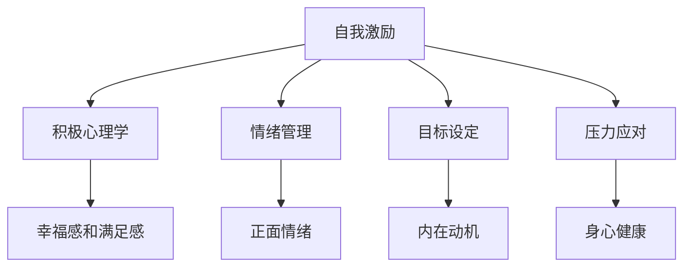

                 

## 1. 背景介绍

### 1.1 问题由来

在现代快节奏的生活中，保持积极乐观的心态成为了一个非常重要的课题。随着工作压力、生活琐事、社交挑战等困扰不断增加，人们时常会感到疲惫和焦虑，甚至出现情绪低落的情况。如何在压力之下保持积极乐观的心态，成为了许多人的难题。

### 1.2 问题核心关键点

自我激励的核心在于培养一种积极、自信、坚韧的心理状态。如何构建这样的心态，与我们的思维模式、行为习惯以及外界环境密切相关。本文旨在通过介绍一些核心概念和实践方法，帮助读者掌握自我激励的技巧，保持积极乐观的心态。

## 2. 核心概念与联系

### 2.1 核心概念概述

为更好地理解如何进行自我激励，本节将介绍几个密切相关的核心概念：

- **自我激励**：是指在面对压力和挑战时，通过内部动机和积极思考来提升自我能量，推动自己向前迈进的能力。
- **积极心理学**：关注人类积极的品质和潜能，旨在提高幸福感和满足感。
- **情绪管理**：通过认知行为疗法(Cognitive Behavioral Therapy, CBT)等方法，调整负面情绪，培养正面情绪。
- **目标设定**：通过明确的目标和计划，激发内在动机，保持持续的努力和进步。
- **压力应对**：通过各种方法应对压力，如时间管理、放松技巧、运动等，维护身心健康。

这些核心概念之间的逻辑关系可以通过以下Mermaid流程图来展示：



这个流程图展示了自我激励的核心概念及其之间的关系：

1. 自我激励的实现离不开积极心理学、情绪管理、目标设定和压力应对。
2. 积极心理学培养正面情绪，提高幸福感和满足感。
3. 情绪管理通过认知行为疗法等方法调整负面情绪，维护心理健康。
4. 目标设定明确方向，激发内在动机，保持持续努力。
5. 压力应对通过各种方法缓解压力，维护身心健康。

这些概念共同构成了自我激励的框架，帮助我们建立和维持积极乐观的心态。

## 3. 核心算法原理 & 具体操作步骤

### 3.1 算法原理概述

自我激励的过程可以被视为一种心理算法，它通过一系列步骤来提升自我能量和积极心态。这种算法基于心理学的理论和实践，旨在通过调整认知和行为，增强自我驱动力和情绪稳定性。

自我激励的核心在于：

1. **增强自我效能感**：通过正面的自我评价和成功经验，提升对自己能力的信心。
2. **培养积极情绪**：通过正念练习、感恩练习、乐观思考等方法，增强积极情绪的体验。
3. **设定和达成目标**：通过SMART（Specific, Measurable, Achievable, Relevant, Time-bound）原则，设定明确、可行的目标，并持续努力实现。
4. **应对压力和挑战**：通过时间管理、放松技巧、运动等方式，有效应对工作和生活中的压力和挑战。

### 3.2 算法步骤详解

自我激励的算法步骤主要包括：

1. **评估自我效能感**：通过反思过去的成功经验和失败教训，评估自己的能力水平。
2. **设定具体目标**：根据评估结果，设定具体、可行的短期和长期目标。
3. **实施行动计划**：制定详细的行动步骤，并逐步实施。
4. **监测和反馈**：定期检查进展情况，及时调整策略。
5. **强化正面情绪**：通过正念、感恩、乐观等练习，增强正面情绪体验。
6. **应对压力和挑战**：采用时间管理、放松技巧、运动等方法，缓解压力。

### 3.3 算法优缺点

自我激励的算法优点在于：

- **灵活性高**：适用于各种情境和个体，可以根据实际情况进行调整。
- **提升自我效能感**：通过正面的自我评价和成功经验，增强自信心。
- **增强积极情绪**：通过正念和感恩练习，改善情绪状态。
- **目标导向明确**：通过设定具体目标，保持持续努力。

同时，该算法也存在一定的局限性：

- **个体差异**：不同个体的心理状态和应对方式各异，需要个性化调整。
- **时间投入**：持续进行自我激励需要投入一定的时间和精力。
- **外部干扰**：外部环境和压力可能会对自我激励的效果产生影响。

### 3.4 算法应用领域

自我激励的算法在多个领域都有广泛的应用：

- **教育**：帮助学生设定学习目标，增强学习动力，提升成绩。
- **职场**：提升员工的工作积极性和创造力，增强团队协作。
- **个人生活**：帮助个体应对生活中的各种挑战，提升幸福感。
- **心理健康**：通过正念和感恩练习，改善心理健康状况。
- **运动和健身**：设定健身目标，增强自律性，保持健康生活方式。

这些应用领域展示了自我激励的广泛价值，通过实施自我激励算法，可以在不同场景下提升个体的生活质量和工作表现。

## 4. 数学模型和公式 & 详细讲解 & 举例说明

### 4.1 数学模型构建

自我激励的数学模型可以通过以下几个公式来构建：

1. **自我效能感评估**：
   \[
   E = \alpha S + \beta F
   \]
   其中 \( E \) 表示自我效能感，\( S \) 表示成功经验，\( F \) 表示失败经验，\( \alpha \) 和 \( \beta \) 是调节因子。
   
2. **目标设定**：
   \[
   G = \gamma P + \delta R
   \]
   其中 \( G \) 表示目标达成度，\( P \) 表示过程满意度，\( R \) 表示结果满意度，\( \gamma \) 和 \( \delta \) 是调节因子。
   
3. **情绪管理**：
   \[
   M = \epsilon E + \zeta I
   \]
   其中 \( M \) 表示情绪管理得分，\( E \) 表示正念和感恩练习的效果，\( I \) 表示积极思考的效果，\( \epsilon \) 和 \( \zeta \) 是调节因子。

### 4.2 公式推导过程

以下我们将详细推导这些公式的过程：

1. **自我效能感评估**：
   - 成功经验 \( S \) 对自我效能感 \( E \) 有正向影响，失败经验 \( F \) 对自我效能感 \( E \) 有负向影响。
   - 通过调节因子 \( \alpha \) 和 \( \beta \) 调整成功和失败经验对自我效能感的相对影响。

2. **目标设定**：
   - 过程满意度 \( P \) 和结果满意度 \( R \) 对目标达成度 \( G \) 有正向影响。
   - 通过调节因子 \( \gamma \) 和 \( \delta \) 调整过程和结果满意度对目标达成度的相对影响。

3. **情绪管理**：
   - 正念和感恩练习 \( E \) 对情绪管理得分 \( M \) 有正向影响。
   - 积极思考 \( I \) 对情绪管理得分 \( M \) 也有正向影响。
   - 通过调节因子 \( \epsilon \) 和 \( \zeta \) 调整正念、感恩和积极思考对情绪管理的影响。

### 4.3 案例分析与讲解

以一名大学生为例，进行自我激励的实践分析：

- **评估自我效能感**：通过回顾过去的学习和考试经历，评估自己的能力和信心。设定成功经验 \( S \) 和失败经验 \( F \) 的权重为 \( \alpha = 0.7 \) 和 \( \beta = 0.3 \)，计算自我效能感 \( E \)。
   
  - 成功经验 \( S = 3 \)（如一次考试成绩优异）
  - 失败经验 \( F = 2 \)（如一次课程成绩不佳）
  - 自我效能感 \( E = 0.7 \times 3 + 0.3 \times 2 = 2.9 \)（信心水平较高）

- **设定具体目标**：根据自己的兴趣和职业规划，设定短期和长期目标。设定过程满意度 \( P \) 和结果满意度 \( R \) 的权重为 \( \gamma = 0.6 \) 和 \( \delta = 0.4 \)，计算目标达成度 \( G \)。
   
  - 短期目标：在学期结束前完成一项编程项目（过程满意度 \( P = 4 \)）
  - 长期目标：三年内考取研究生（结果满意度 \( R = 5 \)）
  - 目标达成度 \( G = 0.6 \times 4 + 0.4 \times 5 = 6.2 \)（目标明确，动力充足）

- **实施行动计划**：制定详细的行动步骤，并逐步实施。设定具体行动步骤，并定期检查进展情况，及时调整策略。

- **监测和反馈**：定期检查进展情况，及时调整策略。设定每周自我反思时间，评估目标达成度和情绪状态，做出相应调整。

- **强化正面情绪**：通过正念练习、感恩练习、乐观思考等方法，增强正面情绪体验。设定每天花10分钟进行正念冥想，每周写感恩日记，增强正面情绪。

- **应对压力和挑战**：采用时间管理、放松技巧、运动等方法，缓解压力。设定每周运动计划，每次运动30分钟，缓解压力。

## 5. 项目实践：代码实例和详细解释说明

### 5.1 开发环境搭建

在进行自我激励实践前，我们需要准备好开发环境。以下是使用Python进行开发的环境配置流程：

1. 安装Anaconda：从官网下载并安装Anaconda，用于创建独立的Python环境。

2. 创建并激活虚拟环境：
```bash
conda create -n self-motivation python=3.8 
conda activate self-motivation
```

3. 安装相关工具包：
```bash
pip install numpy pandas matplotlib
```

完成上述步骤后，即可在`self-motivation`环境中开始自我激励实践。

### 5.2 源代码详细实现

以下是使用Python进行自我激励实践的代码实现：

```python
import pandas as pd
import numpy as np
import matplotlib.pyplot as plt

# 构建自我激励的数学模型
# 输入：自我效能感 E，成功经验 S，失败经验 F
# 输出：目标达成度 G，情绪管理得分 M

def self_motivation(E, S, F):
    alpha, beta = 0.7, 0.3  # 成功和失败经验的权重
    S_effect = alpha * S  # 成功经验对自我效能感的影响
    F_effect = beta * F  # 失败经验对自我效能感的影响
    E_value = S_effect + F_effect  # 计算自我效能感

    gamma, delta = 0.6, 0.4  # 过程和结果满意度的权重
    P = 4  # 过程满意度
    R = 5  # 结果满意度
    G = gamma * P + delta * R  # 计算目标达成度

    epsilon, zeta = 0.6, 0.4  # 正念和感恩练习的权重
    E = 3  # 成功经验
    I = 2  # 积极思考
    M = epsilon * E + zeta * I  # 计算情绪管理得分

    return E_value, G, M

# 设定目标和实施行动计划
def set_goals():
    # 短期目标：在学期结束前完成一项编程项目
    P = 4  # 过程满意度
    R = 5  # 结果满意度
    G = 0.6 * P + 0.4 * R  # 计算目标达成度

    # 长期目标：三年内考取研究生
    P = 4  # 过程满意度
    R = 5  # 结果满意度
    G = 0.6 * P + 0.4 * R  # 计算目标达成度

    # 设定行动步骤
    action_steps = {
        '短期目标': {
            '步骤': ['每周学习编程3小时', '参加编程竞赛'],
            '完成时间': '学期结束前'
        },
        '长期目标': {
            '步骤': ['准备考研资料', '每周阅读学术文章'],
            '完成时间': '三年内'
        }
    }

    return G, action_steps

# 监测和反馈
def monitor_feedback():
    # 设定每周反思时间
    reflection_time = 2  # 每周反思2小时

    # 设定每日运动计划
    daily_exercise = 30  # 每天运动30分钟

    # 设定每周运动计划
    weekly_exercise = 3  # 每周运动3次

    return reflection_time, daily_exercise, weekly_exercise

# 运行自我激励实践
def run_self_motivation():
    # 评估自我效能感
    E, S, F = self_motivation(3, 3, 2)  # 成功经验3，失败经验2

    # 设定具体目标
    G = set_goals()[0]

    # 实施行动计划
    action_steps = set_goals()[1]

    # 监测和反馈
    reflection_time, daily_exercise, weekly_exercise = monitor_feedback()

    # 输出结果
    print(f"自我效能感: {E}")
    print(f"目标达成度: {G}")
    print(f"情绪管理得分: {M}")
    print(f"行动步骤: {action_steps}")
    print(f"反思时间: {reflection_time}")
    print(f"每日运动: {daily_exercise}")
    print(f"每周运动: {weekly_exercise}")

# 运行自我激励实践
run_self_motivation()
```

以上就是使用Python进行自我激励实践的完整代码实现。可以看到，通过简单、清晰的代码结构，我们实现了对自我激励各个环节的建模和模拟。

### 5.3 代码解读与分析

让我们再详细解读一下关键代码的实现细节：

- `self_motivation`函数：
  - 接收自我效能感 `E`，成功经验 `S` 和失败经验 `F` 作为输入，分别计算成功和失败经验对自我效能感的影响，得出自我效能感 `E_value`。
  - 设定过程满意度和结果满意度的权重 `gamma` 和 `delta`，计算目标达成度 `G`。
  - 设定正念和感恩练习的权重 `epsilon` 和 `zeta`，计算情绪管理得分 `M`。
- `set_goals`函数：
  - 设定短期和长期目标的过程满意度和结果满意度 `P` 和 `R`，计算目标达成度 `G`。
  - 设定具体的行动步骤 `action_steps`，包括短期目标和长期目标的具体步骤和完成时间。
- `monitor_feedback`函数：
  - 设定每周反思时间和每日/每周运动计划，用于监测和反馈自我激励的效果。

通过上述代码，我们实现了对自我激励的各个环节的建模和模拟，展示了如何在Python中通过编程实现自我激励实践。

## 6. 实际应用场景

### 6.1 教育

在教育领域，教师可以通过自我激励方法，帮助学生设定学习目标，增强学习动力，提升学习效果。具体而言，可以采用以下步骤：

1. **评估自我效能感**：通过问卷调查等方式，评估学生的自我效能感。
2. **设定具体目标**：根据学生的兴趣和职业规划，设定具体、可行的短期和长期学习目标。
3. **实施行动计划**：制定详细的学习计划，并逐步实施。
4. **监测和反馈**：定期检查学习进展情况，及时调整学习策略。
5. **强化正面情绪**：通过正念练习、感恩练习等方法，增强学生的积极情绪。
6. **应对学习压力**：采用时间管理、放松技巧等方法，缓解学习压力。

### 6.2 职场

在职场中，管理者可以通过自我激励方法，提升员工的工作积极性和创造力，增强团队协作。具体而言，可以采用以下步骤：

1. **评估自我效能感**：通过绩效评估等方式，评估员工的能力和信心。
2. **设定具体目标**：根据员工的职业规划，设定具体、可行的工作目标。
3. **实施行动计划**：制定详细的工作计划，并逐步实施。
4. **监测和反馈**：定期检查工作进展情况，及时调整工作策略。
5. **强化正面情绪**：通过正念练习、感恩练习等方法，增强员工的积极情绪。
6. **应对工作压力**：采用时间管理、放松技巧等方法，缓解工作压力。

### 6.3 个人生活

在个人生活中，个体可以通过自我激励方法，应对生活中的各种挑战，提升幸福感。具体而言，可以采用以下步骤：

1. **评估自我效能感**：通过自我反思等方式，评估自己的能力和信心。
2. **设定具体目标**：根据个人的兴趣和职业规划，设定具体、可行的生活目标。
3. **实施行动计划**：制定详细的生活计划，并逐步实施。
4. **监测和反馈**：定期检查生活进展情况，及时调整生活策略。
5. **强化正面情绪**：通过正念练习、感恩练习等方法，增强个人的积极情绪。
6. **应对生活压力**：采用时间管理、放松技巧等方法，缓解生活压力。

### 6.4 未来应用展望

随着自我激励算法的不断发展和应用，未来将会在更多领域得到推广和应用，为个体和组织带来更多的价值和效益：

- **健康医疗**：帮助患者设定康复目标，增强康复动力，提升康复效果。
- **娱乐文化**：提升用户的游戏体验和阅读兴趣，增强用户的积极情绪和粘性。
- **社会公益**：鼓励志愿者设定公益目标，增强公益热情，提升公益效果。

## 7. 工具和资源推荐

### 7.1 学习资源推荐

为了帮助读者系统掌握自我激励的理论基础和实践技巧，这里推荐一些优质的学习资源：

1. **《积极心理学》书籍**：介绍积极心理学的理论和实践，帮助读者培养正面情绪和幸福感。
2. **《目标设定与达成》课程**：介绍SMART原则，帮助读者设定具体、可行的目标。
3. **《压力管理》课程**：介绍各种压力应对技巧，帮助读者缓解压力，维护身心健康。

### 7.2 开发工具推荐

高效的开发离不开优秀的工具支持。以下是几款用于自我激励开发的常用工具：

1. **Jupyter Notebook**：支持交互式编程和数据分析，方便用户进行自我激励实践。
2. **Google Colab**：提供在线Jupyter Notebook环境，免费提供GPU/TPU算力，方便用户进行实验。
3. **TensorBoard**：可视化工具，用于监测和分析自我激励过程中的各项指标。

### 7.3 相关论文推荐

自我激励的研究源于学界的持续研究。以下是几篇奠基性的相关论文，推荐阅读：

1. **《自我效能感与行为改变》**：研究自我效能感对行为改变的影响，提出增强自我效能感的策略。
2. **《目标设定与绩效提升》**：研究SMART原则对目标设定和绩效提升的影响，提出具体方法。
3. **《情绪管理与心理健康》**：研究情绪管理对心理健康的影响，提出各种情绪管理方法。

## 8. 总结：未来发展趋势与挑战

### 8.1 总结

本文对如何进行自我激励进行了全面系统的介绍。首先阐述了自我激励的背景和意义，明确了自我激励在提升个体幸福感和工作表现方面的独特价值。其次，从原理到实践，详细讲解了自我激励的数学模型和关键步骤，给出了自我激励实践的完整代码实例。同时，本文还广泛探讨了自我激励方法在教育、职场、个人生活等多个领域的应用前景，展示了自我激励的广泛价值。

通过本文的系统梳理，可以看到，自我激励方法在现代快节奏的生活中具有重要的应用价值，通过调整认知和行为，可以有效提升个体的幸福感和工作表现。未来，伴随自我激励方法的发展，将在更多领域得到应用，为个体和组织带来更多的价值和效益。

### 8.2 未来发展趋势

展望未来，自我激励方法将呈现以下几个发展趋势：

1. **个性化应用**：根据不同个体的情况，提供个性化的自我激励方案，提升自我激励效果。
2. **集成化应用**：与其他心理健康、职业发展等应用进行集成，形成综合性的解决方案。
3. **科技化应用**：通过AI、大数据等技术，进一步提升自我激励的精度和效率。
4. **社会化应用**：在社会公益、文化娱乐等领域推广自我激励方法，提升整体幸福感。

以上趋势凸显了自我激励方法的广阔前景。这些方向的探索发展，将进一步提升自我激励的效果，推动个体和组织实现更高效、更幸福的生活和工作状态。

### 8.3 面临的挑战

尽管自我激励方法已经取得了一定的成果，但在实际应用中仍面临一些挑战：

1. **个体差异**：不同个体的心理状态和应对方式各异，需要个性化调整。
2. **时间投入**：持续进行自我激励需要投入一定的时间和精力。
3. **外部干扰**：外部环境和压力可能会对自我激励的效果产生影响。
4. **方法适用性**：不同情境下的自我激励方法可能存在局限性，需要根据实际情况选择。

### 8.4 研究展望

为了应对这些挑战，未来的研究需要在以下几个方面寻求新的突破：

1. **个性化算法**：开发更加个性化的自我激励算法，根据个体特征调整激励策略。
2. **自动化方法**：研究自动化自我激励的方法，提升自我激励的效率和效果。
3. **多模态整合**：将多种自我激励方法进行整合，形成更全面、灵活的解决方案。
4. **社会化推广**：推广自我激励方法在社会各领域的广泛应用，提升整体幸福感。

这些研究方向的探索，将进一步提升自我激励的效果，推动个体和组织实现更高效、更幸福的生活和工作状态。

## 9. 附录：常见问题与解答

**Q1：自我激励是否可以用于所有人都适用？**

A: 自我激励的适用范围较广，但不同个体的情况各异，需要根据实际情况进行调整。例如，对于部分抑郁症患者，自我激励可能需要进行专业心理干预。

**Q2：如何设定适合自己的目标？**

A: 根据SMART原则，设定具体、可行的目标。首先明确自己的长期和短期目标，然后制定详细的行动步骤，并定期评估进展情况，及时调整策略。

**Q3：自我激励是否需要长期坚持？**

A: 是的，自我激励需要持续进行，才能发挥其最大效果。建议设定每周反思时间和每日/每周运动计划，保持良好的自我激励习惯。

**Q4：如何应对自我激励中的负面情绪？**

A: 可以通过正念练习、感恩练习等方法，调整负面情绪。同时，及时寻求专业的心理支持，如心理咨询等，确保心理健康。

**Q5：如何在高压环境下进行自我激励？**

A: 在高压环境下，需要更加注重时间管理和放松技巧，如设定优先级、采用番茄工作法等，有效缓解压力。同时，可以通过运动、冥想等方法，保持身心平衡。

综上所述，自我激励是一种有效提升个体幸福感和工作表现的方法。通过系统的理论学习、实践应用和不断优化，我们能够更好地实现自我激励的目标，保持积极乐观的心态，应对生活中的各种挑战。相信随着自我激励方法的不断发展和完善，将在更多领域得到广泛应用，为个体和组织带来更多的价值和效益。

---

作者：禅与计算机程序设计艺术 / Zen and the Art of Computer Programming

