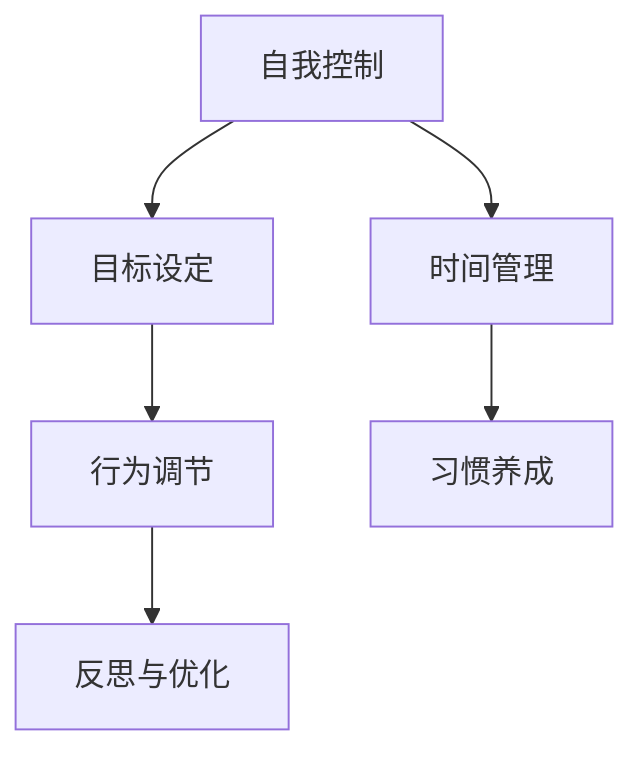

                 

# 如何进行自我管理：如何提高自我控制和自律能力？

> 关键词：自我管理, 自我控制, 自律能力, 时间管理, 目标设定, 心理机制, 习惯养成, 行为调节, 反思与优化

## 1. 背景介绍

### 1.1 问题由来
在信息爆炸、高度竞争的现代社会，如何高效地管理自己的时间和精力，实现自我提升和个人发展，是每个人都必须面对的挑战。在这其中，自我控制和自律能力扮演着至关重要的角色。无论是工作、学习还是个人生活，能够控制自己的行为和情绪，从而专注于目标，是成功的重要保障。

然而，自我控制和自律并不是天生即有的技能，而是可以通过科学的方法和持续的练习来提升的。本文旨在从心理机制、行为调节、习惯养成等方面，介绍如何提高自我控制和自律能力，帮助读者更有效地管理自己，实现个人目标。

### 1.2 问题核心关键点
自我控制和自律能力的核心在于以下几点：
1. **目标设定与分解**：明确目标并制定实现路径。
2. **行为调节**：通过心理机制和行为策略调节自身行为。
3. **习惯养成**：通过持续的行为重复形成稳固的良好习惯。
4. **反思与优化**：定期反思和调整策略，不断优化自我管理方式。

本文将围绕这些关键点，深入探讨提升自我控制和自律能力的方法。

## 2. 核心概念与联系

### 2.1 核心概念概述

为更好地理解提升自我控制和自律能力的方法，本节将介绍几个密切相关的核心概念：

- **自我控制(Self-Control)**：指个体在面对诱惑和干扰时，能够抑制冲动，坚持原定计划的能力。
- **自律能力(Self-Discipline)**：指个体在设定目标后，能够持续努力，克服困难，达成目标的能力。
- **时间管理(Time Management)**：指合理规划和管理时间，提高效率，实现目标的能力。
- **目标设定(Goal Setting)**：指明确目标，并制定具体实施计划的过程。
- **习惯养成(Habit Formation)**：指通过重复的行为形成自动化反应，无需意识参与。
- **行为调节(Behavior Regulation)**：指通过心理机制和行为策略，调节自身行为以达到目标。
- **反思与优化(Reflective Optimization)**：指通过自我反思和反馈，不断调整和优化策略的过程。

这些核心概念之间的逻辑关系可以通过以下Mermaid流程图来展示：



这个流程图展示了我自我控制和自律能力提升的基本框架：

1. 通过目标设定明确方向，并规划时间管理。
2. 使用行为调节策略和习惯养成技巧，提升自我控制能力。
3. 通过反思与优化，不断调整和优化策略。

## 3. 核心算法原理 & 具体操作步骤
### 3.1 算法原理概述

提升自我控制和自律能力的过程，本质上是一个基于行为心理学的自我调节过程。其核心思想是：通过设定明确的目标，使用行为调节策略，持续形成良好的习惯，并不断反思和优化策略，从而实现自我管理的目标。

形式化地，假设个体初始状态为 $S_0$，目标状态为 $S_T$。提升自我控制和自律能力的过程可以表示为：

$$
S_{t+1} = f(S_t, A_t)
$$

其中 $f$ 为状态转移函数，$A_t$ 为在当前状态 $S_t$ 下的行为选择。目标是通过 $A_t$ 的选择，使得 $S_{t+1}$ 逐渐趋近于 $S_T$。

### 3.2 算法步骤详解

提升自我控制和自律能力的过程可以分解为以下几个关键步骤：

**Step 1: 设定明确的目标**

- **SMART原则**：确保目标具体（Specific）、可衡量（Measurable）、可达成（Achievable）、相关性（Relevant）、时限性（Time-bound）。
- **分解目标**：将大目标分解为多个小目标，逐步实现。

**Step 2: 制定行动计划**

- **每日任务清单**：列出每天需要完成的任务，优先处理重要和紧急的任务。
- **时间块管理**：将时间分块，专注于特定任务，避免多任务处理导致的效率低下。

**Step 3: 行为调节**

- **环境控制**：减少干扰因素，创造有利于完成任务的环境。
- **心理暗示**：通过自我对话和正向激励，增强内在动力。
- **自我奖励**：设定奖励机制，完成任务后给予自己奖励，保持积极性。

**Step 4: 习惯养成**

- **21天法则**：通过21天的重复行为，形成稳固的习惯。
- **行为替代**：将不利的习惯替换为有益的习惯。

**Step 5: 反思与优化**

- **定期回顾**：每周或每月回顾目标和进度，调整策略。
- **数据记录**：记录行为和情绪变化，分析原因和效果。
- **反馈调整**：根据反思结果，调整行为策略，持续优化。

### 3.3 算法优缺点

提升自我控制和自律能力的算法具有以下优点：
1. **系统化管理**：通过目标设定、行动计划、行为调节、习惯养成、反思与优化等系统化步骤，提升自我管理效率。
2. **灵活调整**：通过反思与优化环节，可以根据实际情况灵活调整策略，适应不同的环境和任务。
3. **可持续性**：通过形成稳固的习惯，提升行为的自动化水平，减少对自我控制力的依赖。

同时，该算法也存在一定的局限性：
1. **执行难度高**：需要高度自律和坚持，才能有效执行各个步骤。
2. **个性化需求高**：不同的人有不同的需求和习惯，需要个性化设计策略。
3. **环境依赖性强**：外部环境变化可能影响执行效果，需要积极应对。
4. **心理波动影响**：情绪和心理波动可能影响行为调节效果，需定期调整策略。

尽管存在这些局限性，但就目前而言，基于行为心理学的提升自我控制和自律能力的方法，仍是最主流且有效的手段。未来相关研究的重点在于如何进一步降低执行难度，提高个性化和适应性，同时兼顾可持续性和抗干扰性等因素。

### 3.4 算法应用领域

提升自我控制和自律能力的算法已经在个人、团队管理、企业培训等多个领域得到广泛应用：

- **个人自我管理**：帮助个人制定目标、规划时间、养成良好习惯，实现自我提升。
- **团队协作**：通过目标设定和行为调节，提升团队协作效率和凝聚力。
- **企业培训**：用于提升员工自我管理和时间管理能力，提高工作效率和绩效。
- **心理健康**：通过行为调节和反思优化，帮助人们应对压力和情绪波动，改善心理健康。

除了上述这些经典应用外，提升自我控制和自律能力的算法还被创新性地应用到更多场景中，如游戏行为管理、教育辅导、运动训练等，为不同领域的管理和提升提供了新的工具。

## 4. 数学模型和公式 & 详细讲解 & 举例说明

### 4.1 数学模型构建

本节将使用数学语言对提升自我控制和自律能力的过程进行更加严格的刻画。

假设个体初始状态为 $S_0$，目标状态为 $S_T$。设每天的行为为 $A_t$，行为调节策略为 $f(A_t)$，目标状态转移为 $g(A_t)$。个体在 $t$ 天的状态为 $S_t$。则状态转移方程为：

$$
S_{t+1} = f(S_t, A_t) = g(A_t)
$$

其中，$f$ 表示行为调节对状态的影响，$g$ 表示目标状态转移。

### 4.2 公式推导过程

以目标状态转移为例，设每天的行为选择为 $A_t$，目标状态转移为 $g(A_t)$。目标状态转移函数 $g$ 可以表示为：

$$
g(A_t) = S_{t+1} = S_t + f(A_t)
$$

其中 $f(A_t)$ 为行为对目标状态的影响函数。假设每天的行为选择 $A_t$ 为 $\sum_{i=1}^n a_i$，其中 $a_i$ 为第 $i$ 项行为的影响权重，可以表示为：

$$
g(A_t) = S_{t+1} = S_t + \sum_{i=1}^n a_i f_i
$$

在实践中，可以通过设定不同的 $a_i$ 来调整行为对目标状态的影响，从而实现自我控制和自律能力的提升。

### 4.3 案例分析与讲解

假设我们希望通过阅读提升自我控制和自律能力。设定每天阅读时间为 $A_t = 30$ 分钟，阅读书籍为 $a_1 = 10$ 分，阅读笔记为 $a_2 = 5$ 分。行为对目标状态的影响函数 $f_i$ 为阅读量对知识储备的提升，可以表示为：

$$
f_1 = k_1 \cdot A_t, \quad f_2 = k_2 \cdot A_t
$$

其中 $k_1, k_2$ 为常数，表示阅读书籍和笔记对知识储备的影响。则目标状态转移方程为：

$$
g(A_t) = S_{t+1} = S_t + k_1 \cdot A_t + k_2 \cdot A_t
$$

通过设定合适的 $k_1$ 和 $k_2$，我们可以计算出阅读不同时间对知识储备的累积效果，从而评估阅读行为对自我控制和自律能力的提升效果。

## 5. 项目实践：代码实例和详细解释说明

### 5.1 开发环境搭建

在进行自我管理实践前，我们需要准备好开发环境。以下是使用Python进行开发的环境配置流程：

1. 安装Python：从官网下载并安装Python，确保版本为3.6及以上。
2. 安装pip：从官网下载安装pip，用于安装和管理Python包。
3. 安装相关库：使用pip安装必要的库，如pandas、matplotlib等。
4. 配置开发环境：创建虚拟环境，安装必要的依赖包。

完成上述步骤后，即可在开发环境中进行自我管理代码的实现。

### 5.2 源代码详细实现

下面我们以目标设定和行为调节为例，给出使用Python进行自我管理过程的代码实现。

```python
import pandas as pd
import matplotlib.pyplot as plt

# 设定目标和行为
goals = {
    '读书': {'a_1': 10, 'a_2': 5},
    '锻炼': {'a_1': 15, 'a_2': 10},
    '学习': {'a_1': 20, 'a_2': 20}
}

# 设定行为影响权重
k_values = {'target': 0.5, 'behavior': 0.5}

# 计算目标状态转移
def calculate_state_change(state, behavior):
    return state + sum([behavior['a_i'] * k_values['target'] * behavior['a_i'] * k_values['behavior'] for a_i in behavior.values()])

# 生成目标状态转移列表
state_changes = []
current_state = 0
for goal, behavior in goals.items():
    for t in range(1, 101):
        current_state = calculate_state_change(current_state, behavior)
        state_changes.append((goal, current_state))

# 可视化目标状态转移
df = pd.DataFrame(state_changes, columns=['Goal', 'State'])
plt.figure(figsize=(10, 6))
plt.plot(df['Goal'], df['State'], marker='o')
plt.title('Goal State Change Over Time')
plt.xlabel('Time')
plt.ylabel('State')
plt.show()
```

以上代码实现了目标设定和行为调节的数学模型，并生成了一个简单的目标状态随时间变化的可视化图表。

### 5.3 代码解读与分析

让我们再详细解读一下关键代码的实现细节：

**goals字典**：
- 定义了三个目标，每个目标对应的行为和影响权重。

**calculate_state_change函数**：
- 计算目标状态的变化，通过行为选择和影响权重进行加权累加。

**state_changes列表**：
- 通过循环计算，生成目标状态随时间变化的列表。

**可视化代码**：
- 使用matplotlib库，绘制目标状态随时间变化的折线图。

代码实现展示了目标设定和行为调节的基本过程，通过设定具体的行为和影响权重，可以计算出目标状态随时间的变化情况。通过可视化图表，可以直观地看到目标状态的变化趋势，从而评估行为选择对自我控制和自律能力的影响。

## 6. 实际应用场景
### 6.1 学习时间管理

在学习和工作中，时间管理是提升自我控制和自律能力的重要环节。通过设定每日学习任务、规划学习时间块，可以有效避免拖延和分心。

**Step 1: 设定目标**：明确学习的具体目标，如每天阅读1小时，做1小时作业等。

**Step 2: 制定行动计划**：列出每日任务清单，规划时间块，确保每个时间块专注于一项任务。

**Step 3: 行为调节**：避免干扰因素，如关闭社交媒体通知，设定学习时间计时器。

**Step 4: 习惯养成**：通过固定的时间段重复学习行为，形成习惯。

**Step 5: 反思与优化**：每周回顾学习效果，调整学习计划，优化行为策略。

通过上述方法，可以显著提高学习效率和时间管理能力，减少拖延和分心，提升自我控制和自律能力。

### 6.2 工作任务管理

在工作环境中，任务管理同样重要。通过设定明确的目标，合理分配时间，可以有效提升工作效率和自律性。

**Step 1: 设定目标**：明确工作的具体目标，如完成某个项目，处理邮件等。

**Step 2: 制定行动计划**：列出每日任务清单，优先处理重要和紧急的任务。

**Step 3: 行为调节**：避免干扰因素，如关闭不必要的通知，设定工作时间计时器。

**Step 4: 习惯养成**：通过固定的时间段重复工作行为，形成习惯。

**Step 5: 反思与优化**：每周回顾工作效果，调整工作计划，优化行为策略。

通过上述方法，可以显著提高工作效率和自律性，减少拖延和分心，提升自我控制和自律能力。

### 6.3 个人生活管理

个人生活管理同样需要自我控制和自律能力的支持。通过设定健康生活目标，培养良好的生活习惯，可以提升整体生活质量。

**Step 1: 设定目标**：明确健康生活的具体目标，如每天运动30分钟，每天保证8小时睡眠等。

**Step 2: 制定行动计划**：列出每日健康计划，确保每个时间块专注于一项健康行为。

**Step 3: 行为调节**：避免干扰因素，如关闭电子设备，设定健康时间计时器。

**Step 4: 习惯养成**：通过固定的时间段重复健康行为，形成习惯。

**Step 5: 反思与优化**：每周回顾健康效果，调整健康计划，优化行为策略。

通过上述方法，可以显著提升生活质量和自律性，减少不良习惯，提升自我控制和自律能力。

### 6.4 未来应用展望

随着技术的发展和应用场景的拓展，提升自我控制和自律能力的方法将更加智能化和个性化。

1. **智能提醒系统**：通过智能设备，根据用户行为和习惯，实时提醒和调整行为策略，提高自律性。

2. **个性化目标设定**：结合大数据和机器学习，分析用户习惯和需求，提供个性化的目标设定建议，提升自我管理效率。

3. **情感识别技术**：通过情感识别技术，实时监测用户情绪，及时调整行为策略，减少情绪波动对自律性的影响。

4. **行为数据可视化**：通过智能设备和应用，实时记录和可视化用户行为数据，提供详细的行为分析报告，帮助用户更好地理解和管理自己的行为。

5. **多模态反馈机制**：结合语音、图像等多模态反馈，实时调整行为策略，提升自律性。

这些技术的发展和应用，将进一步提升自我控制和自律能力，帮助人们更好地管理自己，实现个人目标。

## 7. 工具和资源推荐
### 7.1 学习资源推荐

为了帮助开发者系统掌握提升自我控制和自律能力的理论基础和实践技巧，这里推荐一些优质的学习资源：

1. **《心理学与生活》**：一本经典的心理学入门教材，介绍了行为和心理学的基本原理，是提升自我控制和自律能力的基础读物。

2. **《深度工作》**：一本关于如何提高专注力和自律能力的畅销书，提供了实用的方法和策略。

3. **Coursera《自我管理》课程**：斯坦福大学开设的课程，详细介绍了目标设定、行为调节、习惯养成等自我管理方法。

4. **《习惯的力量》**：一本关于习惯养成的经典书籍，介绍了习惯养成的科学原理和方法。

5. **《番茄工作法图解》**：一本介绍时间管理和行为调节的实用书籍，提供了简单易行的番茄工作法。

6. **《自控力》**：一本关于如何提升自控力和自律能力的心理学书籍，提供了实用的方法和案例。

通过学习这些资源，相信你一定能够快速掌握提升自我控制和自律能力的精髓，并用于解决实际的自我管理问题。

### 7.2 开发工具推荐

高效的开发离不开优秀的工具支持。以下是几款用于提升自我管理开发的常用工具：

1. **Trello**：一款简单易用的项目管理工具，帮助用户制定任务清单和计划。

2. **Todoist**：一款任务管理和时间管理工具，支持多设备同步，提供详细的任务统计和报告。

3. **Forest**：一款行为调节工具，通过种树的方式激励用户专注学习和工作。

4. **Fitbit**：一款健康管理和行为跟踪设备，实时监测用户的行为和健康数据，提供详细分析报告。

5. **Google Calendar**：一款时间管理工具，支持任务安排、时间块管理和提醒功能。

6. **Anki**：一款记忆管理工具，通过间隔重复算法，帮助用户高效记忆和复习。

合理利用这些工具，可以显著提升提升自我控制和自律能力的开发效率，加快创新迭代的步伐。

### 7.3 相关论文推荐

提升自我控制和自律能力的研究源于学界的持续研究。以下是几篇奠基性的相关论文，推荐阅读：

1. **《目标设定理论》**：介绍目标设定对行为和绩效的影响，提供了设定目标的科学依据。

2. **《行为科学》**：研究行为调节和自我控制的心理机制，提供了行为调节的科学方法。

3. **《习惯的力量》**：介绍了习惯养成的科学原理和方法，提供了系统化的习惯养成策略。

4. **《深度工作》**：提出了深度工作的概念和方法，提供了提高专注力和自律能力的实用技巧。

5. **《番茄工作法图解》**：介绍了番茄工作法的科学原理和实践技巧，提供了时间管理和行为调节的方法。

6. **《自控力》**：介绍了提升自控力和自律能力的心理学方法和案例，提供了实用的自我管理策略。

这些论文代表了大语言模型微调技术的发展脉络。通过学习这些前沿成果，可以帮助研究者把握学科前进方向，激发更多的创新灵感。

## 8. 总结：未来发展趋势与挑战

### 8.1 总结

本文对提升自我控制和自律能力的过程进行了全面系统的介绍。首先阐述了自我控制和自律能力提升的背景和意义，明确了目标设定、行为调节、习惯养成等关键点。其次，从理论到实践，详细讲解了提升自我控制和自律能力的数学原理和操作步骤，给出了完整的代码实现。同时，本文还广泛探讨了自我控制和自律能力在学习和工作中的应用前景，展示了其巨大潜力。此外，本文精选了提升自我控制和自律能力的各类学习资源，力求为读者提供全方位的技术指引。

通过本文的系统梳理，可以看到，提升自我控制和自律能力是一个基于行为心理学的自我调节过程。通过设定明确的目标，使用行为调节策略，持续形成良好的习惯，并不断反思和优化策略，可以有效实现自我管理的目标。未来，随着技术的发展和应用场景的拓展，提升自我控制和自律能力的方法将更加智能化和个性化，帮助人们更好地管理自己，实现个人目标。

### 8.2 未来发展趋势

展望未来，提升自我控制和自律能力的方法将呈现以下几个发展趋势：

1. **智能化提升**：通过人工智能技术，提供个性化的目标设定和行为调节建议，提升自律性。

2. **个性化优化**：结合大数据和机器学习，分析用户习惯和需求，提供个性化的自我管理方案。

3. **多模态融合**：结合语音、图像、行为等多模态反馈，实时调整行为策略，提升自律性。

4. **实时监测**：通过智能设备和应用，实时监测用户行为和情绪，及时调整行为策略。

5. **自动化优化**：通过智能算法，自动优化行为策略，提升自律性。

以上趋势凸显了提升自我控制和自律能力的广阔前景。这些方向的探索发展，将进一步提升自我管理效率，帮助人们更好地管理自己，实现个人目标。

### 8.3 面临的挑战

尽管提升自我控制和自律能力的方法已经取得了瞩目成就，但在迈向更加智能化、普适化应用的过程中，它仍面临着诸多挑战：

1. **数据隐私**：实时监测用户行为和情绪需要收集大量数据，如何保护用户隐私，确保数据安全，是重要挑战。

2. **算法偏见**：智能算法可能存在偏见，影响行为策略的公正性和合理性，需进行全面测试和优化。

3. **用户体验**：智能工具的使用体验需良好，避免过度干预和用户体验差。

4. **技术成熟度**：智能算法和技术需进一步成熟，避免因技术问题影响用户体验和效果。

5. **社会接受度**：智能自我管理工具需获得用户和社会接受，避免引发社会问题和争议。

6. **道德伦理**：智能自我管理工具需符合道德伦理标准，避免对用户产生负面影响。

正视提升自我控制和自律能力面临的这些挑战，积极应对并寻求突破，将是大语言模型微调走向成熟的必由之路。相信随着学界和产业界的共同努力，这些挑战终将一一被克服，提升自我控制和自律能力的方法必将更加智能化、普适化和人性化。

### 8.4 研究展望

面对提升自我控制和自律能力所面临的挑战，未来的研究需要在以下几个方面寻求新的突破：

1. **隐私保护技术**：研究隐私保护技术，确保用户数据的安全性和匿名性。

2. **公平性算法**：开发公平性算法，减少智能算法偏见，提高行为策略的公正性和合理性。

3. **用户体验优化**：优化智能工具的使用体验，提升用户粘性和满意度。

4. **技术成熟度提升**：提高智能算法的技术成熟度，确保工具的稳定性和可靠性。

5. **社会接受度提升**：加强智能自我管理工具的社会认知和接受度，推动技术应用普及。

6. **道德伦理规范**：制定智能自我管理工具的道德伦理规范，确保工具符合人类价值观和伦理道德。

这些研究方向和探索，将引领提升自我控制和自律能力技术的发展，为构建更加智能、普适、人性化的自我管理系统提供新的思路和方法。面向未来，提升自我控制和自律能力技术需要在数据隐私、算法公平、用户体验、技术成熟度、社会接受度和道德伦理等多个维度协同发力，共同推动自然语言理解和智能交互系统的进步。只有勇于创新、敢于突破，才能不断拓展自我管理系统的边界，让智能技术更好地造福人类社会。

## 9. 附录：常见问题与解答

**Q1：如何设定明确的目标？**

A: 设定明确的目标需要遵循SMART原则：具体(Specific)、可衡量(Measurable)、可达成(Achievable)、相关性(Relevant)、时限性(Time-bound)。具体做法包括：
- 将大目标分解为多个小目标。
- 设定具体的衡量标准。
- 确保目标可实现。
- 与个人价值观和职业目标相关。
- 设定明确的时间期限。

**Q2：如何避免拖延？**

A: 避免拖延的关键在于行为调节和习惯养成：
- 设定每日任务清单，优先处理重要和紧急的任务。
- 避免干扰因素，如关闭社交媒体通知，设定学习时间计时器。
- 通过固定的时间段重复行为，形成习惯。
- 使用番茄工作法等方法，保持专注力。

**Q3：如何提高自律性？**

A: 提高自律性需要综合运用目标设定、行为调节、习惯养成等方法：
- 设定明确的目标，制定详细的行动计划。
- 避免干扰因素，减少分心。
- 使用自我奖励机制，保持积极性。
- 通过反思与优化，不断调整策略。

**Q4：如何使用智能工具提升自我管理？**

A: 使用智能工具可以显著提升自我管理的效率和效果：
- 使用项目管理工具如Trello，制定任务清单和计划。
- 使用时间管理工具如Todoist，记录和安排任务。
- 使用行为调节工具如Forest，激励专注学习和工作。
- 使用健康管理工具如Fitbit，实时监测健康数据。
- 使用智能设备如Google Calendar，实时提醒和调整行为策略。

**Q5：如何应对自我管理中的情绪波动？**

A: 应对情绪波动需要灵活运用行为调节和反思优化策略：
- 通过正向激励和自我对话，增强内在动力。
- 设定适当的休息时间和放松方式，缓解压力。
- 定期进行心理疏导和情感调节。
- 反思和调整行为策略，避免情绪波动对自律性的影响。

**Q6：如何评估自我管理的效果？**

A: 评估自我管理的效果需要设定明确的衡量标准和定期反思与调整策略：
- 设定具体的衡量标准，如任务完成率、时间管理效率等。
- 定期回顾目标和进度，调整策略。
- 记录行为和情绪变化，分析原因和效果。
- 根据反思结果，调整行为策略，持续优化。

通过上述问题与解答，可以帮助读者更好地理解提升自我控制和自律能力的方法，并在实际应用中取得更好的效果。

---

作者：禅与计算机程序设计艺术 / Zen and the Art of Computer Programming

