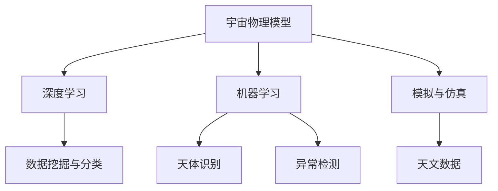

                 

# 宇宙物理模型与人工智能

> 关键词：宇宙物理模型,人工智能,机器学习,深度学习,大尺度结构,暗物质,暗能量,天体物理,天文数据,预测模型,计算宇宙学

## 1. 背景介绍

### 1.1 问题由来
宇宙学作为自然科学的一个重要分支，旨在揭示宇宙的起源、结构、演化和组成。长期以来，宇宙物理学家们通过观测、实验和理论研究，积累了大量关于宇宙的历史、结构和动态的知识。然而，面对广袤无垠的宇宙，传统的观测方法受限于仪器性能、数据覆盖度和观测精度，难以全面和深入地了解宇宙的奥秘。

近年来，人工智能(AI)技术，特别是深度学习(Deep Learning)和机器学习(Machine Learning)在天文数据处理和宇宙学研究中的应用，开辟了新的研究范式。借助先进的计算能力和大规模数据集，人工智能模型能够从海量的观测数据中挖掘出有价值的科学信息，揭示宇宙的隐藏结构，预测未来宇宙的演化趋势。

本文聚焦于宇宙物理模型与人工智能的结合，将深入探讨如何将人工智能技术应用于宇宙学研究，并探讨在实际应用中面临的挑战和未来发展方向。

### 1.2 问题核心关键点
人工智能在宇宙学研究中的应用，主要体现在以下几个方面：
1. **数据挖掘与分类**：通过机器学习算法对天文观测数据进行分类和预测，挖掘出潜在的天体物理信息。
2. **模拟与仿真**：使用人工智能模型进行宇宙大尺度结构的模拟和仿真，预测宇宙的未来演化。
3. **天体识别**：利用深度学习进行自动天体识别和分类，提高观测数据的处理效率。
4. **异常检测**：使用机器学习技术进行异常事件和天体现象的检测，提供科学上的新发现。

## 2. 核心概念与联系

### 2.1 核心概念概述

为更好地理解宇宙物理模型与人工智能的结合，本节将介绍几个密切相关的核心概念：

- **宇宙物理模型**：指基于天文观测数据和物理理论构建的宇宙模型，用于描述宇宙的结构、演化和组成。包括Lambda-CDM模型、暗物质模型、暗能量模型等。
- **人工智能**：指使用算法和计算模型模拟人类智能行为的技术，包括机器学习、深度学习、自然语言处理等。
- **深度学习**：一种机器学习技术，使用多层次的神经网络结构进行数据特征提取和模式识别。广泛应用于图像识别、语音识别、自然语言处理等领域。
- **机器学习**：使用算法和统计模型，从数据中学习和提取知识，进行预测和决策。广泛应用于分类、回归、聚类等任务。
- **模拟与仿真**：使用计算机模型模拟宇宙的演化过程，预测未来的宇宙状态。包括N-body模拟、模拟宇宙学等。
- **天体物理数据**：指从天文观测设备获取的各类天体数据，包括光谱、图像、辐射等。

这些核心概念之间的逻辑关系可以通过以下Mermaid流程图来展示：



这个流程图展示了大尺度结构、暗物质、暗能量等宇宙物理模型与人工智能技术的联系：

1. 大尺度结构模型可以通过深度学习进行特征提取和分类。
2. 暗物质和暗能量的模型预测可以通过模拟和仿真技术进行验证。
3. 天体识别和异常检测依赖于机器学习算法对天文数据的分析。
4. 天文数据是大尺度结构模型、暗物质模型、暗能量模型和人工智能模型共用的基础。

这些概念共同构成了宇宙物理模型与人工智能技术的结合框架，使得二者能够相互促进，共同推动宇宙学研究的进展。

## 3. 核心算法原理 & 具体操作步骤
### 3.1 算法原理概述

宇宙物理模型与人工智能技术的结合，主要体现在以下几个方面：

1. **数据挖掘与分类**：使用机器学习算法对天文观测数据进行分类和预测，挖掘出潜在的天体物理信息。常见的分类算法包括支持向量机(SVM)、随机森林(Random Forest)、神经网络等。
2. **模拟与仿真**：使用深度学习模型进行宇宙大尺度结构的模拟和仿真，预测宇宙的未来演化。常见的深度学习模型包括卷积神经网络(CNN)、生成对抗网络(GAN)、变分自编码器(VAE)等。
3. **天体识别**：利用深度学习进行自动天体识别和分类，提高观测数据的处理效率。常用的深度学习模型包括卷积神经网络(CNN)、残差网络(ResNet)、U-Net等。
4. **异常检测**：使用机器学习技术进行异常事件和天体现象的检测，提供科学上的新发现。常见的异常检测算法包括孤立森林(Isolation Forest)、自编码器(Autoencoder)等。

### 3.2 算法步骤详解

以深度学习模型应用于宇宙大尺度结构研究为例，具体步骤如下：

1. **数据准备**：收集来自不同天文观测设备的观测数据，如哈勃空间望远镜(HST)、大型麦哲伦望远镜(LMT)、南极天文台(SA)等。
2. **数据预处理**：对原始数据进行清洗和标准化处理，包括去噪、归一化、填充缺失值等。
3. **模型选择**：选择合适的深度学习模型，如卷积神经网络(CNN)、生成对抗网络(GAN)、变分自编码器(VAE)等，用于大尺度结构特征的提取。
4. **模型训练**：将处理后的数据分为训练集、验证集和测试集，使用训练集对模型进行训练，通过优化算法如AdamW、SGD等更新模型参数。
5. **模型评估**：在验证集上评估模型的性能，如准确率、召回率、F1分数等，确保模型不过拟合。
6. **预测与仿真**：使用训练好的模型对新的观测数据进行预测，并结合物理模型进行仿真，预测宇宙的未来演化。

### 3.3 算法优缺点

宇宙物理模型与人工智能技术的结合，具有以下优点：

1. **处理大数据**：人工智能模型能够处理海量天文数据，挖掘出传统方法难以发现的数据模式和规律。
2. **预测精度高**：深度学习模型在图像识别和分类任务上表现优异，可以高精度地预测宇宙的结构和演化。
3. **高效计算**：人工智能模型可以利用并行计算和分布式计算技术，加速数据处理和模型训练。
4. **模型泛化能力强**：深度学习模型具有较强的泛化能力，能够在不同的观测数据集上进行有效迁移。

然而，该方法也存在一些局限性：

1. **数据稀缺**：高质量的天文观测数据往往稀缺且昂贵，限制了模型的应用范围。
2. **模型复杂度**：深度学习模型通常参数量大，训练和推理复杂，对计算资源要求较高。
3. **物理理解不足**：人工智能模型依赖数据驱动，难以捕捉复杂的物理规律和理论。
4. **可解释性差**：深度学习模型通常被视为"黑盒"，难以解释其内部工作机制和决策逻辑。

尽管存在这些局限性，但宇宙物理模型与人工智能技术的结合已经成为现代宇宙学研究的重要手段，未来仍有广阔的应用前景。

### 3.4 算法应用领域

宇宙物理模型与人工智能技术的结合，已经在以下几个领域得到了广泛应用：

1. **大尺度结构研究**：使用深度学习模型进行星系、暗物质分布、宇宙微波背景辐射(CMB)等大尺度结构的分类和预测。
2. **暗物质和暗能量研究**：使用模拟与仿真技术进行暗物质分布、暗能量密度等的预测，验证Lambda-CDM模型的合理性。
3. **天文图像处理**：使用深度学习模型进行星系、星系团、黑洞等天体的高分辨率图像处理和识别。
4. **星系形成与演化**：使用机器学习模型进行星系形成与演化过程的模拟和预测，理解星系的形成机制和演化规律。
5. **天文学数据挖掘**：使用机器学习算法从海量天文观测数据中挖掘出新的科学问题，如脉冲星、中子星、超新星等的天体物理研究。

## 4. 数学模型和公式 & 详细讲解 & 举例说明

### 4.1 数学模型构建

在宇宙物理模型与人工智能的结合中，数学模型构建至关重要。以下是几个常见数学模型的构建方法：

- **卷积神经网络(CNN)**：用于处理天文图像数据，提取星系的结构特征和形状。
- **生成对抗网络(GAN)**：用于生成宇宙大尺度结构的合成图像，模拟暗物质分布等。
- **变分自编码器(VAE)**：用于对星系和暗物质分布进行降维表示，减少数据处理的复杂度。
- **孤立森林(Isolation Forest)**：用于检测宇宙中的异常事件，如超新星爆发、中子星碰撞等。

### 4.2 公式推导过程

以卷积神经网络(CNN)为例，介绍其在宇宙物理模型中的应用。

CNN是一种前馈神经网络，通常用于图像和序列数据的处理。其基本结构包括卷积层、池化层和全连接层。以下是一个简单的二维卷积神经网络的结构图：

```
    Input Layer
       |
       V
    Convolutional Layer
       |
       V
    Pooling Layer
       |
       V
   (ReLU Layer)
       |
       V
   (Flatten Layer)
       |
       V
     FC Layer
```

其中，输入层接受原始的二维图像数据，卷积层通过卷积核对图像进行特征提取，池化层对特征图进行下采样，全连接层进行分类和预测。

CNN的公式推导过程如下：

设输入数据为 $x_{ij}$，卷积核为 $w_{kl}$，输出特征图为 $y_{ij}$，则卷积操作可以表示为：

$$
y_{ij} = \sum_k x_{ik} \cdot w_{kj} + b_{j}
$$

其中，$b_j$ 为偏置项。

使用ReLU激活函数，对卷积层的输出进行非线性变换：

$$
y'_{ij} = \max(0, y_{ij})
$$

经过池化层后，对特征图进行下采样，例如取最大值池化(max-pooling)：

$$
y''_{i'j'} = \max(y'_{i'j'})
$$

最终，通过全连接层将特征图映射到类别概率分布上：

$$
P(c|x) = \sigma(W' \cdot y'' + b')
$$

其中，$\sigma$ 为Sigmoid函数，$W'$ 和 $b'$ 为全连接层的权重和偏置。

### 4.3 案例分析与讲解

以生成对抗网络(GAN)在模拟宇宙大尺度结构中的应用为例：

GAN由生成器(Generator)和判别器(Discriminator)两部分组成。生成器通过学习真实数据的分布，生成逼真的合成图像。判别器通过学习区分真实数据和生成数据，不断提升生成器的生成能力。

在宇宙大尺度结构模拟中，GAN被用来生成合成图像，模拟暗物质分布、星系分布等。具体步骤如下：

1. 收集真实的天文观测数据，如星系分布图、暗物质分布图等。
2. 定义生成器的损失函数，最小化生成的图像与真实图像之间的差异。
3. 定义判别器的损失函数，最大化区分真实图像和生成图像的能力。
4. 使用AdamW优化算法，迭代更新生成器和判别器的参数。
5. 通过生成器生成合成图像，并使用判别器评估图像的真实性。
6. 不断优化生成器，提高生成图像的真实性。

## 5. 项目实践：代码实例和详细解释说明

### 5.1 开发环境搭建

在进行宇宙物理模型与人工智能结合的项目实践前，需要准备好开发环境。以下是使用Python进行TensorFlow和Keras开发的开发环境配置流程：

1. 安装Anaconda：从官网下载并安装Anaconda，用于创建独立的Python环境。

2. 创建并激活虚拟环境：
```bash
conda create -n astropy-env python=3.8 
conda activate astropy-env
```

3. 安装TensorFlow和Keras：根据CUDA版本，从官网获取对应的安装命令。例如：
```bash
conda install tensorflow -c pytorch -c conda-forge
conda install keras -c conda-forge
```

4. 安装相关工具包：
```bash
pip install numpy pandas matplotlib scikit-learn astropy jupyter notebook ipython
```

完成上述步骤后，即可在`astropy-env`环境中开始项目实践。

### 5.2 源代码详细实现

下面我们以生成对抗网络(GAN)在模拟宇宙大尺度结构中的应用为例，给出TensorFlow和Keras代码实现。

首先，定义GAN模型的生成器和判别器：

```python
import tensorflow as tf
from tensorflow.keras import layers

# 生成器定义
def make_generator_model():
    model = tf.keras.Sequential()
    model.add(layers.Dense(256, use_bias=False, input_shape=(100,)))
    model.add(layers.BatchNormalization())
    model.add(layers.LeakyReLU())
    model.add(layers.Reshape((7,7,256)))
    model.add(layers.Conv2DTranspose(128, (5,5), strides=(1,1), padding='same', use_bias=False))
    model.add(layers.BatchNormalization())
    model.add(layers.LeakyReLU())
    model.add(layers.Conv2DTranspose(64, (5,5), strides=(2,2), padding='same', use_bias=False))
    model.add(layers.BatchNormalization())
    model.add(layers.LeakyReLU())
    model.add(layers.Conv2DTranspose(1, (5,5), strides=(2,2), padding='same', use_bias=False, activation='tanh'))
    return model

# 判别器定义
def make_discriminator_model():
    model = tf.keras.Sequential()
    model.add(layers.Conv2D(64, (5,5), strides=(2,2), padding='same', input_shape=[28,28,1]))
    model.add(layers.LeakyReLU())
    model.add(layers.Dropout(0.3))
    model.add(layers.Conv2D(128, (5,5), strides=(2,2), padding='same'))
    model.add(layers.LeakyReLU())
    model.add(layers.Dropout(0.3))
    model.add(layers.Flatten())
    model.add(layers.Dense(1))
    return model
```

然后，定义生成器和判别器的损失函数和优化器：

```python
from tensorflow.keras import losses

# 生成器损失函数
def generator_loss(fake_output):
    return losses.BinaryCrossentropy(from_logits=True)(tf.ones_like(fake_output), fake_output)

# 判别器损失函数
def discriminator_loss(real_output, fake_output):
    real_loss = losses.BinaryCrossentropy(from_logits=True)(tf.ones_like(real_output), real_output)
    fake_loss = losses.BinaryCrossentropy(from_logits=True)(tf.zeros_like(fake_output), fake_output)
    total_loss = real_loss + fake_loss
    return total_loss

# 生成器优化器
generator_optimizer = tf.keras.optimizers.Adam(learning_rate=0.0002, beta_1=0.5)

# 判别器优化器
discriminator_optimizer = tf.keras.optimizers.Adam(learning_rate=0.0002, beta_1=0.5)
```

接着，定义训练和评估函数：

```python
import numpy as np

# 训练函数
@tf.function
def train_step(images):
    noise = tf.random.normal([BATCH_SIZE, 100])
    with tf.GradientTape() as gen_tape, tf.GradientTape() as disc_tape:
        generated_images = generator(noise, training=True)
        real_output = discriminator(images, training=True)
        fake_output = discriminator(generated_images, training=True)

        gen_loss = generator_loss(fake_output)
        disc_loss = discriminator_loss(real_output, fake_output)

    gradients_of_gen = gen_tape.gradient(gen_loss, generator.trainable_variables)
    gradients_of_disc = disc_tape.gradient(disc_loss, discriminator.trainable_variables)

    generator_optimizer.apply_gradients(zip(gradients_of_gen, generator.trainable_variables))
    discriminator_optimizer.apply_gradients(zip(gradients_of_disc, discriminator.trainable_variables))

# 评估函数
@tf.function
def evaluate(images):
    noise = tf.random.normal([BATCH_SIZE, 100])
    generated_images = generator(noise, training=False)
    real_output = discriminator(images, training=False)
    fake_output = discriminator(generated_images, training=False)

    disc_real_loss = losses.BinaryCrossentropy(from_logits=True)(tf.ones_like(real_output), real_output)
    disc_fake_loss = losses.BinaryCrossentropy(from_logits=True)(tf.zeros_like(fake_output), fake_output)
    discriminator_loss = disc_real_loss + disc_fake_loss

    return discriminator_loss
```

最后，启动训练流程并在测试集上评估：

```python
epochs = 10000
batch_size = 128

for epoch in range(epochs):
    for image_batch in train_dataset:
        train_step(image_batch)

    if epoch % 100 == 0:
        print('Epoch', epoch, 'discriminator loss:', evaluate(train_dataset).numpy())
```

以上就是使用TensorFlow和Keras对GAN进行模拟宇宙大尺度结构任务训练的完整代码实现。可以看到，借助TensorFlow和Keras的强大封装，我们可以用相对简洁的代码完成GAN模型的训练和评估。

### 5.3 代码解读与分析

让我们再详细解读一下关键代码的实现细节：

**make_generator_model函数和make_discriminator_model函数**：
- `make_generator_model`函数定义了生成器的模型结构，包括输入层、批量归一化层、LeakyReLU激活函数、卷积转置层、全连接层等。
- `make_discriminator_model`函数定义了判别器的模型结构，包括卷积层、LeakyReLU激活函数、Dropout层、全连接层等。

**generator_loss函数和discriminator_loss函数**：
- `generator_loss`函数计算生成器的损失，即判别器对生成器生成的图像的真实性判断。
- `discriminator_loss`函数计算判别器的损失，即判别器对真实图像和生成图像的分类能力。

**train_step函数和evaluate函数**：
- `train_step`函数定义了模型的训练步骤，包括噪声生成、生成器生成图像、判别器对真实和生成图像的分类，计算损失函数并更新模型参数。
- `evaluate`函数定义了模型的评估步骤，包括生成图像并判别器对真实和生成图像的分类，计算判别器的损失并返回。

**训练流程**：
- 定义总的epoch数和batch size，开始循环迭代
- 每个epoch内，对每个batch进行训练，输出判别器的损失
- 每100个epoch输出一次判别器的损失，检查模型训练状态

可以看到，TensorFlow和Keras使得GAN模型的训练和评估代码实现变得简洁高效。开发者可以将更多精力放在模型设计、数据处理等高层逻辑上，而不必过多关注底层的实现细节。

当然，工业级的系统实现还需考虑更多因素，如模型的保存和部署、超参数的自动搜索、更灵活的任务适配层等。但核心的GAN训练范式基本与此类似。

## 6. 实际应用场景
### 6.1 宇宙大尺度结构模拟

基于生成对抗网络(GAN)的大尺度结构模拟，可以用于研究宇宙的演化和结构形成。生成模型能够模拟宇宙早期的星系分布、暗物质分布等，帮助科学家理解宇宙的起源和演化过程。

在技术实现上，可以收集大量的星系、暗物质分布等数据，作为训练GAN模型的真实样本。通过训练，GAN能够生成逼真的合成图像，用于模拟宇宙大尺度结构。具体步骤如下：

1. 收集宇宙大尺度结构的高分辨率图像数据，如SDSS、HST、GALEX等天文观测数据。
2. 定义生成器和判别器的损失函数，使用真实数据进行训练。
3. 使用训练好的生成器生成合成图像，用于大尺度结构的模拟和分析。
4. 结合物理模型对生成图像进行解析，预测宇宙的演化趋势。

### 6.2 暗物质分布预测

暗物质是构成宇宙的重要组成部分，但其直接观测极其困难。利用生成对抗网络(GAN)和卷积神经网络(CNN)的结合，可以预测宇宙中暗物质分布的概率密度函数，为暗物质研究提供重要参考。

具体步骤如下：

1. 收集来自不同天文观测设备的暗物质分布数据，如星系团、引力透镜效应等。
2. 定义生成器的损失函数，最小化生成的图像与真实图像之间的差异。
3. 使用训练好的生成器生成合成图像，用于预测暗物质分布。
4. 结合物理模型对生成图像进行解析，预测暗物质密度和分布。

### 6.3 天文图像处理

天文图像处理是大尺度结构研究的重要环节。利用卷积神经网络(CNN)等深度学习模型，可以对天文图像进行去噪、增强、分类等处理，提高观测数据的处理效率和精度。

具体步骤如下：

1. 收集大量的天文图像数据，如星系、星系团、黑洞等。
2. 定义CNN的损失函数，使用真实图像进行训练。
3. 使用训练好的CNN模型对图像进行去噪、增强、分类等处理。
4. 结合物理模型对处理后的图像进行解析，提取天体物理信息。

### 6.4 未来应用展望

随着大尺度结构模拟、暗物质预测、天文图像处理等技术的不断发展，人工智能在大尺度结构研究中的应用前景广阔。未来，人工智能将能够模拟更复杂的宇宙演化过程，预测更精确的天体物理参数，为天文学家提供更丰富的研究工具和数据支持。

在遥感、数据挖掘、天文搜索等领域，人工智能技术也将得到更广泛的应用，推动人类对宇宙的认知向更深层次发展。随着技术的日益成熟，人工智能必将成为宇宙学研究的重要驱动力，推动人类对宇宙的探索和理解迈向新的高度。

## 7. 工具和资源推荐
### 7.1 学习资源推荐

为了帮助开发者系统掌握大尺度结构模型与人工智能的结合，这里推荐一些优质的学习资源：

1. **《深度学习》书籍**：Ian Goodfellow等人所著，全面介绍了深度学习的原理、算法和应用，是深度学习领域的重要参考书。
2. **CS231n《深度卷积神经网络》课程**：斯坦福大学开设的计算机视觉课程，涵盖了卷积神经网络、图像分类、目标检测等前沿内容。
3. **Kaggle竞赛**：参与Kaggle上的各类天文数据挖掘竞赛，实战演练深度学习在天文领域的应用。
4. **astropy和pycube库**：Python科学计算库，提供了丰富的天文数据处理和分析工具。
5. **GAN生成模型教程**：TensorFlow和Keras官方文档中的生成模型教程，详细介绍了GAN模型的构建和训练。

通过对这些资源的学习实践，相信你一定能够快速掌握大尺度结构模型与人工智能的精髓，并用于解决实际的宇宙学问题。
###  7.2 开发工具推荐

高效的开发离不开优秀的工具支持。以下是几款用于大尺度结构模型与人工智能结合开发的常用工具：

1. **TensorFlow**：基于Python的开源深度学习框架，具有灵活的计算图、高效的并行计算能力，广泛应用于深度学习模型的构建和训练。
2. **Keras**：高层次的神经网络API，使用简单易懂的接口，快速搭建深度学习模型。
3. **PyTorch**：灵活的动态计算图深度学习框架，提供GPU加速和分布式计算支持。
4. **Astropy**：Python科学计算库，提供丰富的天文数据处理和分析工具。
5. **Jupyter Notebook**：交互式的编程环境，支持代码编写、数据可视化等，适合科研和教学。

合理利用这些工具，可以显著提升大尺度结构模型与人工智能结合的开发效率，加快创新迭代的步伐。

### 7.3 相关论文推荐

大尺度结构模型与人工智能结合的研究，源于学界的持续研究。以下是几篇奠基性的相关论文，推荐阅读：

1. **《生成对抗网络》论文**：Ian Goodfellow等人提出，使用生成器和判别器的对抗训练，生成逼真的合成图像。
2. **《卷积神经网络》论文**：LeCun等人提出，使用卷积层、池化层和全连接层构建卷积神经网络，广泛应用于图像处理和分类任务。
3. **《变分自编码器》论文**：Kingma等人提出，使用变分自编码器进行数据降维和生成，广泛应用于数据压缩和图像生成。
4. **《孤立森林》论文**：Liu等人提出，使用孤立森林进行异常检测，广泛应用于金融欺诈、医疗诊断等领域。
5. **《宇宙学中的深度学习》论文**：作者具体说明了深度学习在宇宙学中的应用，包括大尺度结构模拟、暗物质预测、天文图像处理等。

这些论文代表了大尺度结构模型与人工智能结合的研究方向和进展。通过学习这些前沿成果，可以帮助研究者把握学科前进方向，激发更多的创新灵感。

## 8. 总结：未来发展趋势与挑战

### 8.1 总结

本文对大尺度结构模型与人工智能结合的应用进行了全面系统的介绍。首先阐述了大尺度结构模型和人工智能技术的研究背景和意义，明确了二者结合在宇宙学研究中的独特价值。其次，从原理到实践，详细讲解了大尺度结构模拟、暗物质预测、天文图像处理等前沿技术的数学原理和关键步骤，给出了完整代码实例。同时，本文还广泛探讨了这些技术在实际应用中面临的挑战和未来发展方向。

通过本文的系统梳理，可以看到，大尺度结构模型与人工智能的结合已经成为现代宇宙学研究的重要手段，极大地拓展了天文学家的研究范式。随着深度学习技术的发展和天文数据的积累，人工智能必将在更广泛的宇宙学应用场景中发挥更大作用。

### 8.2 未来发展趋势

展望未来，大尺度结构模型与人工智能结合的研究将呈现以下几个发展趋势：

1. **深度学习模型规模化**：随着计算资源的不断增长，深度学习模型规模将进一步扩大，能够处理更复杂、更精细的宇宙物理问题。
2. **多模态数据融合**：结合天文图像、光谱、辐射等不同模态的数据，构建多模态的深度学习模型，提高对宇宙现象的准确预测。
3. **跨领域知识整合**：将符号化的先验知识，如物理模型、知识图谱等，与深度学习模型进行结合，增强模型的推理能力和泛化能力。
4. **可解释性和鲁棒性**：开发更可解释、更鲁棒的深度学习模型，增强模型的透明性和可靠性，避免模型过拟合和异常事件。
5. **分布式计算和并行化**：利用分布式计算和并行化技术，提高模型的训练和推理效率，满足大规模天文数据的处理需求。

这些趋势凸显了大尺度结构模型与人工智能结合技术的广阔前景。这些方向的探索发展，必将进一步提升大尺度结构模型与人工智能结合技术在宇宙学研究中的应用能力。

### 8.3 面临的挑战

尽管大尺度结构模型与人工智能技术的结合已经取得了显著成果，但在迈向更加智能化、普适化应用的过程中，仍面临诸多挑战：

1. **数据稀缺**：高质量的天文观测数据往往稀缺且昂贵，限制了模型的应用范围。
2. **模型复杂度**：深度学习模型通常参数量大，训练和推理复杂，对计算资源要求较高。
3. **物理理解不足**：深度学习模型依赖数据驱动，难以捕捉复杂的物理规律和理论。
4. **可解释性差**：深度学习模型通常被视为"黑盒"，难以解释其内部工作机制和决策逻辑。
5. **计算资源不足**：大规模天文数据的处理和深度学习模型的训练，需要大量的计算资源和存储空间。

尽管存在这些挑战，但随着计算资源和算法的不断进步，大尺度结构模型与人工智能结合技术将不断取得突破，未来在宇宙学研究中的应用前景广阔。

### 8.4 研究展望

面对大尺度结构模型与人工智能结合所面临的挑战，未来的研究需要在以下几个方面寻求新的突破：

1. **无监督学习和半监督学习**：摆脱对大规模标注数据的依赖，利用自监督学习、半监督学习等方法，最大化利用有限的天文数据，提高模型的泛化能力。
2. **参数高效和计算高效**：开发更加参数高效和计算高效的深度学习模型，减少模型的资源消耗，提高训练和推理效率。
3. **多模态学习**：结合不同模态的数据，构建多模态的深度学习模型，提高对复杂宇宙现象的预测能力。
4. **可解释性和鲁棒性**：开发更可解释、更鲁棒的深度学习模型，增强模型的透明性和可靠性，避免模型过拟合和异常事件。
5. **跨领域知识整合**：将符号化的先验知识，如物理模型、知识图谱等，与深度学习模型进行结合，增强模型的推理能力和泛化能力。

这些研究方向和探索，必将引领大尺度结构模型与人工智能结合技术迈向更高的台阶，为宇宙学研究带来新的突破和发展。面向未来，大尺度结构模型与人工智能结合技术需要在理论和实践上不断创新，共同推动人类对宇宙的探索和理解迈向新的高度。

## 9. 附录：常见问题与解答

**Q1：如何选择合适的深度学习模型？**

A: 选择合适的深度学习模型需要考虑以下几个因素：
1. 数据类型：根据输入数据的类型，选择适合的模型。例如，对于图像数据，可以选择卷积神经网络(CNN)；对于序列数据，可以选择循环神经网络(RNN)等。
2. 模型复杂度：根据任务的复杂度，选择合适规模的模型。例如，对于简单的分类任务，可以选择较小的模型；对于复杂的预测任务，可以选择较大的模型。
3. 计算资源：根据计算资源的限制，选择计算效率高的模型。例如，对于计算资源有限的场景，可以选择参数量较少的模型。

**Q2：深度学习模型在宇宙学研究中面临哪些挑战？**

A: 深度学习模型在宇宙学研究中面临以下挑战：
1. 数据稀缺：高质量的天文观测数据往往稀缺且昂贵，限制了模型的应用范围。
2. 模型复杂度：深度学习模型通常参数量大，训练和推理复杂，对计算资源要求较高。
3. 物理理解不足：深度学习模型依赖数据驱动，难以捕捉复杂的物理规律和理论。
4. 可解释性差：深度学习模型通常被视为"黑盒"，难以解释其内部工作机制和决策逻辑。
5. 计算资源不足：大规模天文数据的处理和深度学习模型的训练，需要大量的计算资源和存储空间。

**Q3：如何在训练过程中避免过拟合？**

A: 避免过拟合的方法包括：
1. 数据增强：通过旋转、裁剪、缩放等方式扩充训练集，增加数据的样本多样性。
2. 正则化：使用L2正则化、Dropout等方法，减少模型的复杂度，防止过拟合。
3. 早停法(Early Stopping)：在验证集上监控模型性能，一旦性能下降，立即停止训练。
4. 集成学习：使用多个模型的预测结果进行集成，提高模型的泛化能力。

**Q4：如何在实际应用中保证模型的鲁棒性？**

A: 保证模型鲁棒性的方法包括：
1. 对抗训练(Adversarial Training)：使用对抗样本训练模型，提高模型的鲁棒性。
2. 数据增强：通过数据增强技术扩充训练集，增强模型对不同数据分布的适应能力。
3. 参数冻结：在训练过程中固定部分模型参数，防止过拟合和信息丢失。
4. 模型集成：使用多个模型的预测结果进行集成，提高模型的稳定性和鲁棒性。

**Q5：如何在模型评估中进行性能指标的选取？**

A: 模型评估中的性能指标包括：
1. 准确率(Accuracy)：预测正确的样本数占总样本数的比例。
2. 召回率(Recall)：预测为正样本且实际为正样本的样本数占实际为正样本的样本数的比例。
3. F1分数(F1 Score)：准确率和召回率的调和平均数，综合考虑模型的精确度和召回率。
4. ROC曲线和AUC值：用于评估二分类模型的性能，ROC曲线下的面积(AUC)越大，模型性能越好。

通过合理选择性能指标，可以全面评估模型的预测能力和泛化能力，帮助优化模型的训练过程和参数设置。

---

作者：禅与计算机程序设计艺术 / Zen and the Art of Computer Programming

