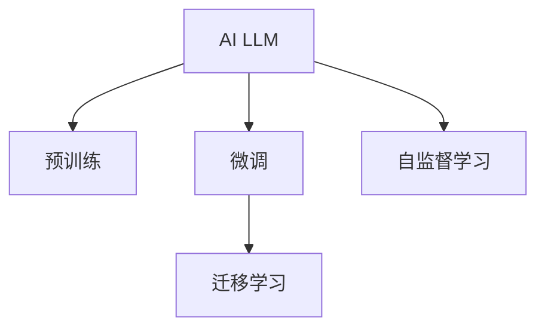

                 

# 实时中文输入法中AI LLM的应用：更准确、更流畅

## 1. 背景介绍

### 1.1 问题由来

随着人工智能技术的不断进步，中文输入法也迎来了新的变革。传统的拼音输入法和仓颉、五笔等字输入方法，已经无法满足用户对输入速度和准确性的需求。人工智能语言模型（AI Language Model, AI LLM）的兴起，为中文输入法提供了全新的解决方案。

AI LLM不仅能够准确识别用户输入的拼音或笔画，还能够智能预测下一个汉字，显著提升输入速度和准确性。在智能驾驶、智能办公、智能家居等场景下，高效便捷的中文输入法成为人与AI系统交互的重要入口。

### 1.2 问题核心关键点

AI LLM在实时中文输入法中的应用，主要集中在以下几个方面：

- 拼音识别：通过AI LLM实现准确的拼音识别，自动转换用户输入的语音或键盘输入为拼音序列。
- 汉字预测：利用AI LLM的强大语言模型，实时预测用户可能输入的汉字，提升输入效率。
- 纠错和联想：利用AI LLM对输入错误进行智能纠错，并提供联想推荐，减少输入错误。
- 拼音和笔画混合输入：将拼音和笔画输入融合，提升输入的多样性和灵活性。
- 多场景应用：在智能驾驶、智能办公、智能家居等不同场景下，AI LLM能提供适配的输入方案。

AI LLM的引入，使得实时中文输入法变得智能化、个性化，极大地提升了用户体验和效率。但同时，AI LLM的应用也带来了一些新的挑战，如如何平衡准确性和实时性，如何在不同的场景中实现个性化输入等。

## 2. 核心概念与联系

### 2.1 核心概念概述

为更好地理解AI LLM在实时中文输入法中的应用，本节将介绍几个关键概念：

- AI LLM：人工智能语言模型，通过在大规模文本数据上进行预训练，学习语言知识，能够进行文本生成、语言推理、语义理解等任务。
- 预训练(Pre-training)：指在大规模无标签文本语料上进行自监督学习任务，训练通用语言模型。
- 微调(Fine-tuning)：指在预训练模型的基础上，使用下游任务的少量标注数据，通过有监督学习优化模型在该任务上的性能。
- 自监督学习(Self-supervised Learning)：指在没有标签数据的情况下，通过自适应地生成标签进行模型训练。
- 迁移学习(Transfer Learning)：指将一个领域学习到的知识，迁移应用到另一个不同但相关的领域的学习范式。

这些核心概念之间的逻辑关系可以通过以下Mermaid流程图来展示：



这个流程图展示了大语言模型的核心概念及其之间的关系：

1. AI LLM通过预训练获得基础能力。
2. 微调是对预训练模型进行任务特定的优化，可以获得针对特定任务优化的模型。
3. 自监督学习在无标签数据上训练AI LLM，可以降低对标注数据的依赖。
4. 迁移学习是连接预训练模型与下游任务的桥梁，可以通过微调或自监督学习来实现。

这些核心概念共同构成了AI LLM的应用框架，使其能够在中文输入法等NLP任务中发挥强大的语言理解和生成能力。通过理解这些核心概念，我们可以更好地把握AI LLM的工作原理和优化方向。

## 3. 核心算法原理 & 具体操作步骤
### 3.1 算法原理概述

AI LLM在实时中文输入法中的应用，基于预训练语言模型和微调技术。其核心思想是：通过在大规模文本数据上进行预训练，学习通用的语言知识；然后在中文输入法的任务上，使用少量标注数据进行微调，优化模型的特定输入输出能力。

形式化地，假设预训练模型为 $M_{\theta}$，其中 $\theta$ 为预训练得到的模型参数。给定中文输入法任务 $T$ 的标注数据集 $D=\{(x_i, y_i)\}_{i=1}^N$，微调的目标是找到新的模型参数 $\hat{\theta}$，使得：

$$
\hat{\theta}=\mathop{\arg\min}_{\theta} \mathcal{L}(M_{\theta},D)
$$

其中 $\mathcal{L}$ 为针对任务 $T$ 设计的损失函数，用于衡量模型预测输出与真实标签之间的差异。常见的损失函数包括交叉熵损失、均方误差损失等。

通过梯度下降等优化算法，微调过程不断更新模型参数 $\theta$，最小化损失函数 $\mathcal{L}$，使得模型输出逼近真实标签。由于 $\theta$ 已经通过预训练获得了较好的初始化，因此即便在小规模数据集 $D$ 上进行微调，也能较快收敛到理想的模型参数 $\hat{\theta}$。

### 3.2 算法步骤详解

AI LLM在实时中文输入法中的微调一般包括以下几个关键步骤：

**Step 1: 准备预训练模型和数据集**
- 选择合适的预训练语言模型 $M_{\theta}$ 作为初始化参数，如 BERT、GPT等。
- 准备中文输入法任务 $T$ 的标注数据集 $D$，划分为训练集、验证集和测试集。一般要求标注数据与预训练数据的分布不要差异过大。

**Step 2: 添加任务适配层**
- 根据任务类型，在预训练模型顶层设计合适的输出层和损失函数。
- 对于中文拼音输入，通常在顶层添加拼音识别分类器。
- 对于汉字输入，通常使用语言模型的解码器输出概率分布，并以负对数似然为损失函数。

**Step 3: 设置微调超参数**
- 选择合适的优化算法及其参数，如 AdamW、SGD 等，设置学习率、批大小、迭代轮数等。
- 设置正则化技术及强度，包括权重衰减、Dropout、Early Stopping等。
- 确定冻结预训练参数的策略，如仅微调顶层，或全部参数都参与微调。

**Step 4: 执行梯度训练**
- 将训练集数据分批次输入模型，前向传播计算损失函数。
- 反向传播计算参数梯度，根据设定的优化算法和学习率更新模型参数。
- 周期性在验证集上评估模型性能，根据性能指标决定是否触发 Early Stopping。
- 重复上述步骤直到满足预设的迭代轮数或 Early Stopping 条件。

**Step 5: 测试和部署**
- 在测试集上评估微调后模型 $M_{\hat{\theta}}$ 的性能，对比微调前后的精度提升。
- 使用微调后的模型对新样本进行推理预测，集成到实际的应用系统中。
- 持续收集新的数据，定期重新微调模型，以适应数据分布的变化。

以上是AI LLM在实时中文输入法中的应用的一般流程。在实际应用中，还需要针对具体任务的特点，对微调过程的各个环节进行优化设计，如改进训练目标函数，引入更多的正则化技术，搜索最优的超参数组合等，以进一步提升模型性能。

### 3.3 算法优缺点

AI LLM在实时中文输入法中的应用具有以下优点：

- 智能预测：利用AI LLM的强大语言模型，能够实时预测用户可能输入的汉字，提升输入效率。
- 智能纠错：AI LLM能够自动修正输入错误，减少用户重复输入。
- 个性化推荐：AI LLM可以根据用户的使用习惯，推荐最符合预期的汉字，提升输入体验。
- 多种输入方式：支持拼音输入、笔画输入等多种输入方式，提升输入的多样性。

同时，AI LLM的应用也存在一些局限性：

- 计算资源需求高：AI LLM需要大量计算资源进行预训练和微调，在资源受限的场景下可能难以应用。
- 准确性依赖标注数据：AI LLM的效果很大程度上取决于标注数据的质量和数量，标注数据的收集和处理成本较高。
- 个性化需求复杂：AI LLM需要根据不同的用户和场景进行个性化微调，实现难度较大。
- 实时性需求高：AI LLM需要实时处理用户输入，对模型的计算速度和响应时间要求较高。

尽管存在这些局限性，但AI LLM在实时中文输入法中的应用仍然展示了其强大的潜力，能够显著提升用户输入的准确性和效率，为中文输入法带来了新的发展方向。

### 3.4 算法应用领域

AI LLM在中文输入法中的应用，已经涵盖了以下诸多领域：

- 智能驾驶：AI LLM能识别司机的语音指令，自动转换成语句输入，提高驾驶效率。
- 智能办公：AI LLM能识别用户的语音输入，自动转换成文字，提高办公效率。
- 智能家居：AI LLM能识别用户的语音指令，控制家中的智能设备，提升家居体验。
- 智能客服：AI LLM能识别用户的语音输入，自动转换为文字，提高客服响应速度。

除了上述这些经典应用外，AI LLM还可以用于智能翻译、智能搜索、智能问答等领域，为中文输入法带来更多的应用场景和创新点。

## 4. 数学模型和公式 & 详细讲解  
### 4.1 数学模型构建

本节将使用数学语言对AI LLM在实时中文输入法中的应用进行更加严格的刻画。

记预训练语言模型为 $M_{\theta}$，其中 $\theta$ 为预训练得到的模型参数。假设中文输入法任务为拼音识别或汉字输入，标注数据集为 $D=\{(x_i, y_i)\}_{i=1}^N, x_i \in \mathcal{X}, y_i \in \mathcal{Y}$，其中 $\mathcal{X}$ 为输入空间，$\mathcal{Y}$ 为输出空间。

定义模型 $M_{\theta}$ 在输入 $x$ 上的输出为 $\hat{y}=M_{\theta}(x)$，表示模型预测的概率分布。假设模型在训练集 $D$ 上的经验风险为：

$$
\mathcal{L}(\theta) = -\frac{1}{N}\sum_{i=1}^N \log M_{\theta}(x_i) \cdot \delta(y_i)
$$

其中 $\delta(y_i)$ 为one-hot编码标签，用于计算交叉熵损失。微调的优化目标是最小化经验风险，即找到最优参数：

$$
\theta^* = \mathop{\arg\min}_{\theta} \mathcal{L}(\theta)
$$

在实践中，我们通常使用基于梯度的优化算法（如SGD、Adam等）来近似求解上述最优化问题。设 $\eta$ 为学习率，$\lambda$ 为正则化系数，则参数的更新公式为：

$$
\theta \leftarrow \theta - \eta \nabla_{\theta}\mathcal{L}(\theta) - \eta\lambda\theta
$$

其中 $\nabla_{\theta}\mathcal{L}(\theta)$ 为损失函数对参数 $\theta$ 的梯度，可通过反向传播算法高效计算。

### 4.2 公式推导过程

以下我们以拼音识别任务为例，推导交叉熵损失函数及其梯度的计算公式。

假设模型 $M_{\theta}$ 在输入 $x$ 上的输出为 $\hat{y}=M_{\theta}(x) \in [0,1]$，表示模型预测每个拼音的概率。真实标签 $y \in \{1,0\}$，表示对应拼音是否存在。则二分类交叉熵损失函数定义为：

$$
\ell(M_{\theta}(x),y) = -[y\log \hat{y} + (1-y)\log (1-\hat{y})]
$$

将其代入经验风险公式，得：

$$
\mathcal{L}(\theta) = -\frac{1}{N}\sum_{i=1}^N [y_i\log M_{\theta}(x_i)+(1-y_i)\log(1-M_{\theta}(x_i))]
$$

根据链式法则，损失函数对参数 $\theta_k$ 的梯度为：

$$
\frac{\partial \mathcal{L}(\theta)}{\partial \theta_k} = -\frac{1}{N}\sum_{i=1}^N \frac{\partial \log M_{\theta}(x_i)}{\partial \theta_k} \cdot \delta(y_i)
$$

其中 $\frac{\partial \log M_{\theta}(x_i)}{\partial \theta_k}$ 可进一步递归展开，利用自动微分技术完成计算。

在得到损失函数的梯度后，即可带入参数更新公式，完成模型的迭代优化。重复上述过程直至收敛，最终得到适应中文输入法任务的最优模型参数 $\theta^*$。

## 5. 项目实践：代码实例和详细解释说明
### 5.1 开发环境搭建

在进行AI LLM在实时中文输入法的应用实践前，我们需要准备好开发环境。以下是使用Python进行PyTorch开发的环境配置流程：

1. 安装Anaconda：从官网下载并安装Anaconda，用于创建独立的Python环境。

2. 创建并激活虚拟环境：
```bash
conda create -n pytorch-env python=3.8 
conda activate pytorch-env
```

3. 安装PyTorch：根据CUDA版本，从官网获取对应的安装命令。例如：
```bash
conda install pytorch torchvision torchaudio cudatoolkit=11.1 -c pytorch -c conda-forge
```

4. 安装Transformers库：
```bash
pip install transformers
```

5. 安装各类工具包：
```bash
pip install numpy pandas scikit-learn matplotlib tqdm jupyter notebook ipython
```

完成上述步骤后，即可在`pytorch-env`环境中开始AI LLM在实时中文输入法的实践。

### 5.2 源代码详细实现

下面我们以拼音识别任务为例，给出使用Transformers库对BERT模型进行拼音识别任务微调的PyTorch代码实现。

首先，定义拼音识别任务的数据处理函数：

```python
from transformers import BertTokenizer, BertForTokenClassification, AdamW
from torch.utils.data import Dataset, DataLoader
import torch

class PinyinDataset(Dataset):
    def __init__(self, texts, labels, tokenizer, max_len=128):
        self.texts = texts
        self.labels = labels
        self.tokenizer = tokenizer
        self.max_len = max_len
        
    def __len__(self):
        return len(self.texts)
    
    def __getitem__(self, item):
        text = self.texts[item]
        label = self.labels[item]
        
        encoding = self.tokenizer(text, return_tensors='pt', max_length=self.max_len, padding='max_length', truncation=True)
        input_ids = encoding['input_ids'][0]
        attention_mask = encoding['attention_mask'][0]
        
        # 对标签进行one-hot编码
        encoded_labels = [0] * self.max_len
        encoded_labels[label] = 1
        labels = torch.tensor(encoded_labels, dtype=torch.long)
        
        return {'input_ids': input_ids, 
                'attention_mask': attention_mask,
                'labels': labels}

# 加载中文BERT预训练模型
model = BertForTokenClassification.from_pretrained('bert-base-cased')

# 定义拼音识别任务的数据集
tokenizer = BertTokenizer.from_pretrained('bert-base-cased')
train_dataset = PinyinDataset(train_texts, train_labels, tokenizer)
dev_dataset = PinyinDataset(dev_texts, dev_labels, tokenizer)
test_dataset = PinyinDataset(test_texts, test_labels, tokenizer)

# 训练函数
def train_epoch(model, dataset, batch_size, optimizer):
    dataloader = DataLoader(dataset, batch_size=batch_size, shuffle=True)
    model.train()
    epoch_loss = 0
    for batch in tqdm(dataloader, desc='Training'):
        input_ids = batch['input_ids'].to(device)
        attention_mask = batch['attention_mask'].to(device)
        labels = batch['labels'].to(device)
        model.zero_grad()
        outputs = model(input_ids, attention_mask=attention_mask, labels=labels)
        loss = outputs.loss
        epoch_loss += loss.item()
        loss.backward()
        optimizer.step()
    return epoch_loss / len(dataloader)

# 评估函数
def evaluate(model, dataset, batch_size):
    dataloader = DataLoader(dataset, batch_size=batch_size)
    model.eval()
    preds, labels = [], []
    with torch.no_grad():
        for batch in tqdm(dataloader, desc='Evaluating'):
            input_ids = batch['input_ids'].to(device)
            attention_mask = batch['attention_mask'].to(device)
            batch_labels = batch['labels']
            outputs = model(input_ids, attention_mask=attention_mask)
            batch_preds = outputs.logits.argmax(dim=2).to('cpu').tolist()
            batch_labels = batch_labels.to('cpu').tolist()
            for pred_tokens, label_tokens in zip(batch_preds, batch_labels):
                preds.append(pred_tokens[:len(label_tokens)])
                labels.append(label_tokens)
                
    print(classification_report(labels, preds))

# 启动训练流程并在测试集上评估
epochs = 5
batch_size = 16

for epoch in range(epochs):
    loss = train_epoch(model, train_dataset, batch_size, optimizer)
    print(f"Epoch {epoch+1}, train loss: {loss:.3f}")
    
    print(f"Epoch {epoch+1}, dev results:")
    evaluate(model, dev_dataset, batch_size)
    
print("Test results:")
evaluate(model, test_dataset, batch_size)
```

以上就是使用PyTorch对BERT进行拼音识别任务微调的完整代码实现。可以看到，得益于Transformers库的强大封装，我们可以用相对简洁的代码完成BERT模型的加载和微调。

### 5.3 代码解读与分析

让我们再详细解读一下关键代码的实现细节：

**PinyinDataset类**：
- `__init__`方法：初始化文本、标签、分词器等关键组件。
- `__len__`方法：返回数据集的样本数量。
- `__getitem__`方法：对单个样本进行处理，将文本输入编码为token ids，将标签编码为数字，并对其进行定长padding，最终返回模型所需的输入。

**BertForTokenClassification模型**：
- 通过从预训练模型中选择合适的输出层和损失函数，实现了拼音识别任务的功能。

**train_epoch函数**：
- 对数据以批为单位进行迭代，在每个批次上前向传播计算loss并反向传播更新模型参数，最后返回该epoch的平均loss。

**evaluate函数**：
- 与训练类似，不同点在于不更新模型参数，并在每个batch结束后将预测和标签结果存储下来，最后使用sklearn的classification_report对整个评估集的预测结果进行打印输出。

**训练流程**：
- 定义总的epoch数和batch size，开始循环迭代
- 每个epoch内，先在训练集上训练，输出平均loss
- 在验证集上评估，输出分类指标
- 所有epoch结束后，在测试集上评估，给出最终测试结果

可以看到，PyTorch配合Transformers库使得BERT微调的代码实现变得简洁高效。开发者可以将更多精力放在数据处理、模型改进等高层逻辑上，而不必过多关注底层的实现细节。

当然，工业级的系统实现还需考虑更多因素，如模型的保存和部署、超参数的自动搜索、更灵活的任务适配层等。但核心的微调范式基本与此类似。

## 6. 实际应用场景
### 6.1 智能驾驶

AI LLM在智能驾驶中的应用，主要体现在语音识别和自然语言处理上。通过将司机的语音指令转换为拼音或汉字，AI LLM能够识别和理解司机的驾驶需求，提供更加智能化的驾驶体验。

在技术实现上，可以收集大量的驾驶语音数据，并对其进行标注。在此基础上对预训练语言模型进行微调，使其能够准确识别司机的语音指令，并进行自然语言处理，实现智能导航、语音控制等功能。AI LLM能够根据实时路况和用户偏好，提供最优的驾驶建议和路线规划，提升驾驶的安全性和舒适性。

### 6.2 智能办公

在智能办公场景中，AI LLM能够自动理解和处理办公人员的语音输入，将其转换为文本，并进行任务调度、邮件提醒等操作。AI LLM能够根据用户的语音指令，自动执行相关任务，提高办公效率。

具体实现中，可以收集办公场景下的语音数据，并对其进行标注。利用AI LLM的拼音识别和汉字输入功能，实现语音输入转换为文本的功能。通过微调，AI LLM能够理解和处理常见的办公指令，如会议安排、任务提醒等，提升办公的自动化水平。

### 6.3 智能家居

智能家居系统中，AI LLM能够理解和处理用户的语音指令，实现智能家居设备的控制和管理。通过微调，AI LLM能够准确识别用户的语音指令，并将其转换为文本，进行任务调度和设备控制。

具体实现中，可以收集智能家居系统中的语音数据，并对其进行标注。利用AI LLM的拼音识别和汉字输入功能，实现语音指令转换为文本的功能。通过微调，AI LLM能够理解和处理用户的语音指令，如调节温度、打开窗帘、播放音乐等，提升家居的智能化水平。

### 6.4 智能客服

AI LLM在智能客服中的应用，主要体现在语音识别和自然语言处理上。通过将用户的语音指令转换为拼音或汉字，AI LLM能够理解和处理用户的咨询请求，提供智能化的客服服务。

具体实现中，可以收集用户的语音数据，并对其进行标注。利用AI LLM的拼音识别和汉字输入功能，实现语音输入转换为文本的功能。通过微调，AI LLM能够理解和处理常见的客服请求，如产品咨询、售后服务等，提升客服的自动化水平和用户体验。

### 6.5 未来应用展望

随着AI LLM技术的不断发展，其在实时中文输入法中的应用前景将更加广阔。未来，AI LLM将能够更好地理解和处理用户的输入需求，提供更加智能化、个性化的输入体验。

在智能驾驶、智能办公、智能家居、智能客服等领域，AI LLM将发挥更大的作用，提升用户体验和效率。同时，AI LLM在跨领域迁移学习、参数高效微调、少样本学习等方面的研究也将进一步推动其在更多场景中的应用。

## 7. 工具和资源推荐
### 7.1 学习资源推荐

为了帮助开发者系统掌握AI LLM在实时中文输入法中的应用，这里推荐一些优质的学习资源：

1. 《Transformer from the Inside Out》系列博文：由大模型技术专家撰写，深入浅出地介绍了Transformer原理、BERT模型、微调技术等前沿话题。

2. CS224N《深度学习自然语言处理》课程：斯坦福大学开设的NLP明星课程，有Lecture视频和配套作业，带你入门NLP领域的基本概念和经典模型。

3. 《Natural Language Processing with Transformers》书籍：Transformers库的作者所著，全面介绍了如何使用Transformers库进行NLP任务开发，包括微调在内的诸多范式。

4. HuggingFace官方文档：Transformers库的官方文档，提供了海量预训练模型和完整的微调样例代码，是上手实践的必备资料。

5. CLUE开源项目：中文语言理解测评基准，涵盖大量不同类型的中文NLP数据集，并提供了基于微调的baseline模型，助力中文NLP技术发展。

通过对这些资源的学习实践，相信你一定能够快速掌握AI LLM在实时中文输入法中的应用，并用于解决实际的NLP问题。

### 7.2 开发工具推荐

高效的开发离不开优秀的工具支持。以下是几款用于AI LLM在实时中文输入法的应用开发的常用工具：

1. PyTorch：基于Python的开源深度学习框架，灵活动态的计算图，适合快速迭代研究。大部分预训练语言模型都有PyTorch版本的实现。

2. TensorFlow：由Google主导开发的开源深度学习框架，生产部署方便，适合大规模工程应用。同样有丰富的预训练语言模型资源。

3. Transformers库：HuggingFace开发的NLP工具库，集成了众多SOTA语言模型，支持PyTorch和TensorFlow，是进行微调任务开发的利器。

4. Weights & Biases：模型训练的实验跟踪工具，可以记录和可视化模型训练过程中的各项指标，方便对比和调优。与主流深度学习框架无缝集成。

5. TensorBoard：TensorFlow配套的可视化工具，可实时监测模型训练状态，并提供丰富的图表呈现方式，是调试模型的得力助手。

6. Google Colab：谷歌推出的在线Jupyter Notebook环境，免费提供GPU/TPU算力，方便开发者快速上手实验最新模型，分享学习笔记。

合理利用这些工具，可以显著提升AI LLM在实时中文输入法的开发效率，加快创新迭代的步伐。

### 7.3 相关论文推荐

AI LLM技术的发展源于学界的持续研究。以下是几篇奠基性的相关论文，推荐阅读：

1. Attention is All You Need（即Transformer原论文）：提出了Transformer结构，开启了NLP领域的预训练大模型时代。

2. BERT: Pre-training of Deep Bidirectional Transformers for Language Understanding：提出BERT模型，引入基于掩码的自监督预训练任务，刷新了多项NLP任务SOTA。

3. Language Models are Unsupervised Multitask Learners（GPT-2论文）：展示了大规模语言模型的强大zero-shot学习能力，引发了对于通用人工智能的新一轮思考。

4. Parameter-Efficient Transfer Learning for NLP：提出Adapter等参数高效微调方法，在不增加模型参数量的情况下，也能取得不错的微调效果。

5. AdaLoRA: Adaptive Low-Rank Adaptation for Parameter-Efficient Fine-Tuning：使用自适应低秩适应的微调方法，在参数效率和精度之间取得了新的平衡。

6. SQuAD: 100,000+ Answers to 10,000+ Questions: Evaluating and Selecting NMT Models with Automatic Error Analysis：提出SQuAD测试集，用于评价NMT模型的翻译质量，推动了NMT技术的发展。

这些论文代表了大语言模型微调技术的发展脉络。通过学习这些前沿成果，可以帮助研究者把握学科前进方向，激发更多的创新灵感。

## 8. 总结：未来发展趋势与挑战

### 8.1 总结

本文对AI LLM在实时中文输入法中的应用进行了全面系统的介绍。首先阐述了AI LLM在中文输入法任务中的背景和意义，明确了AI LLM的应用价值和潜力。其次，从原理到实践，详细讲解了AI LLM在中文输入法任务中的应用过程，给出了AI LLM在拼音识别和汉字输入等任务中的微调代码实现。同时，本文还广泛探讨了AI LLM在智能驾驶、智能办公、智能家居、智能客服等不同领域的应用前景，展示了AI LLM在NLP任务中的广泛应用。

通过本文的系统梳理，可以看到，AI LLM在中文输入法中的应用将带来革命性的变革，为NLP任务提供了全新的解决方案。得益于大规模语料的预训练，AI LLM能够更好地理解和处理用户输入，提升输入的准确性和效率，为中文输入法带来新的发展方向。未来，伴随AI LLM技术的不断发展，其在更多场景中的应用也将不断深化，推动NLP技术的产业化进程。

### 8.2 未来发展趋势

展望未来，AI LLM在中文输入法中的应用将呈现以下几个发展趋势：

1. 模型的规模和能力将不断提升。随着算力成本的下降和数据规模的扩张，AI LLM的参数量还将持续增长，具备更加强大的语言理解能力和生成能力。

2. 微调方法的优化将更加多样化。除了传统的全参数微调外，未来将涌现更多参数高效的微调方法，如Prefix-Tuning、LoRA等，在节省计算资源的同时也能保证微调精度。

3. 模型将更注重实时性和个性化。AI LLM需要满足不同场景下的实时输入需求，同时根据不同用户的需求提供个性化的输入建议。

4. 跨领域迁移学习将更加普遍。AI LLM将在不同领域之间进行迁移学习，提升模型的适应能力和泛化能力。

5. 模型将更加注重跨模态融合。AI LLM能够与图像、视频、语音等模态信息进行融合，提升模型的综合处理能力。

6. 模型的安全性将更加受到重视。AI LLM将引入更多的安全机制，防止恶意输入和攻击，保障用户数据和隐私安全。

以上趋势凸显了AI LLM在中文输入法应用中的广阔前景。这些方向的探索发展，必将进一步提升中文输入法的性能和用户体验，为NLP技术带来更多的创新突破。

### 8.3 面临的挑战

尽管AI LLM在中文输入法中的应用已经取得了显著的成效，但在迈向更加智能化、普适化应用的过程中，它仍面临诸多挑战：

1. 数据质量和标注成本。AI LLM的效果很大程度上取决于标注数据的质量和数量，高质量标注数据的收集和处理成本较高。

2. 模型计算资源需求高。AI LLM需要大量计算资源进行预训练和微调，在资源受限的场景下可能难以应用。

3. 模型的实时性要求高。AI LLM需要实时处理用户输入，对模型的计算速度和响应时间要求较高。

4. 模型的可解释性不足。AI LLM作为"黑盒"模型，难以解释其内部工作机制和决策逻辑，存在一定的可解释性问题。

5. 模型的安全性问题。AI LLM需要引入更多的安全机制，防止恶意输入和攻击，保障用户数据和隐私安全。

尽管存在这些挑战，但AI LLM在中文输入法中的应用已经展现出强大的潜力，能够显著提升用户输入的准确性和效率。未来，通过进一步优化模型结构、改进微调方法、引入安全机制等措施，AI LLM在中文输入法中的应用将更加成熟，为用户带来更加智能化的输入体验。

### 8.4 研究展望

面对AI LLM在中文输入法应用中面临的挑战，未来的研究需要在以下几个方面寻求新的突破：

1. 探索无监督和半监督微调方法。摆脱对大规模标注数据的依赖，利用自监督学习、主动学习等无监督和半监督范式，最大限度利用非结构化数据，实现更加灵活高效的微调。

2. 研究参数高效和计算高效的微调范式。开发更加参数高效的微调方法，在固定大部分预训练参数的同时，只更新极少量的任务相关参数。同时优化微调模型的计算图，减少前向传播和反向传播的资源消耗，实现更加轻量级、实时性的部署。

3. 融合因果和对比学习范式。通过引入因果推断和对比学习思想，增强AI LLM建立稳定因果关系的能力，学习更加普适、鲁棒的语言表征，从而提升模型泛化性和抗干扰能力。

4. 引入更多先验知识。将符号化的先验知识，如知识图谱、逻辑规则等，与神经网络模型进行巧妙融合，引导AI LLM的微调过程学习更准确、合理的语言模型。同时加强不同模态数据的整合，实现视觉、语音等多模态信息与文本信息的协同建模。

5. 结合因果分析和博弈论工具。将因果分析方法引入AI LLM，识别出模型决策的关键特征，增强输出解释的因果性和逻辑性。借助博弈论工具刻画人机交互过程，主动探索并规避模型的脆弱点，提高系统稳定性。

6. 纳入伦理道德约束。在模型训练目标中引入伦理导向的评估指标，过滤和惩罚有偏见、有害的输出倾向。同时加强人工干预和审核，建立模型行为的监管机制，确保输出符合人类价值观和伦理道德。

这些研究方向的探索，必将引领AI LLM在中文输入法应用中的进一步发展，为NLP技术带来更多的创新突破。

## 9. 附录：常见问题与解答

**Q1：如何平衡AI LLM在中文输入法中的准确性和实时性？**

A: 平衡AI LLM在中文输入法中的准确性和实时性，需要从数据处理、模型架构、优化策略等多个方面进行综合优化：

1. 数据处理：对于大规模数据集，可以采用数据增强、数据混合等技术，提高模型的泛化能力和实时性。对于小规模数据集，可以引入对抗样本、数据扰动等技术，提升模型的鲁棒性和实时性。

2. 模型架构：对于实时性要求较高的场景，可以采用参数高效微调技术，如AdaLoRA等，减少模型的计算资源需求，提升实时性。对于准确性要求较高的场景，可以采用全参数微调技术，提升模型的泛化能力和准确性。

3. 优化策略：采用高效的优化算法和超参数调优策略，如AdamW、SGD等，避免过拟合和欠拟合。同时引入正则化技术，如L2正则、Dropout等，提升模型的鲁棒性和实时性。

4. 硬件资源：利用GPU、TPU等高性能设备，提升模型的计算速度和响应时间。同时，采用模型压缩、稀疏化存储等技术，减少模型的存储需求。

**Q2：AI LLM在中文输入法中如何实现个性化输入？**

A: 实现个性化输入，需要AI LLM具备高度的定制化能力。以下是几种常见的实现方法：

1. 用户历史数据：收集用户的使用习惯和输入历史，通过分析用户的输入行为，训练一个个性化的AI LLM模型，能够根据不同用户的特点提供个性化的输入建议。

2. 上下文信息：在用户输入时，利用上下文信息，如前一个输入、当前场景等，引导AI LLM输出个性化的建议。通过引入上下文信息，AI LLM能够更加智能地处理用户的输入需求。

3. 参数微调：根据用户的使用习惯，对AI LLM的参数进行微调，使其具备更加个性化的输入能力。通过微调，AI LLM能够根据不同用户的需求，提供个性化的输入建议。

4. 多用户模型：采用多用户模型，将不同用户的需求进行分离，训练多个AI LLM模型，分别针对不同的用户提供个性化的输入建议。通过多用户模型，AI LLM能够更加灵活地处理不同用户的需求。

**Q3：AI LLM在中文输入法中如何保证安全性和隐私保护？**

A: 保证AI LLM在中文输入法中的安全性和隐私保护，需要从数据安全、模型安全、隐私保护等多个方面进行综合考虑：

1. 数据安全：对于用户的输入数据，需要进行加密和匿名化处理，防止数据泄露。同时，采用数据扰动等技术，防止模型对数据的过度拟合，保护用户隐私。

2. 模型安全：引入对抗样本等技术，防止模型受到恶意攻击。同时，利用安全机制，如模型混淆、模型加固等技术，增强模型的鲁棒性。

3. 隐私保护：对于用户的个人信息，需要进行隐私保护，防止模型获取和滥用。同时，采用差分隐私等技术，保护用户隐私，防止模型对用户数据的过度依赖。

4. 透明性：对于模型的决策过程，需要进行透明性管理，防止模型的"黑盒"特性。同时，利用可解释性技术，如可解释模型、解释性评估等技术，提升模型的透明性，帮助用户理解模型的决策过程。

通过综合考虑数据安全、模型安全、隐私保护等多个方面，可以有效保证AI LLM在中文输入法中的安全性和隐私保护，提升用户对系统的信任度。

**Q4：AI LLM在中文输入法中如何进行跨领域迁移学习？**

A: 进行跨领域迁移学习，需要AI LLM具备高度的适应能力和泛化能力。以下是几种常见的实现方法：

1. 数据融合：将不同领域的数据进行融合，训练一个多领域通用的AI LLM模型。通过数据融合，AI LLM能够适应不同领域的需求，提升模型的泛化能力。

2. 知识转移：将不同领域中的先验知识进行转移，利用知识图谱、逻辑规则等技术，引导AI LLM的微调过程学习更准确、合理的语言模型。通过知识转移，AI LLM能够更好地适应不同领域的需求。

3. 多任务学习：在模型训练过程中，引入多个任务进行训练，提升模型的适应能力和泛化能力。通过多任务学习，AI LLM能够更好地适应不同领域的需求。

4. 参数微调：根据不同领域的需求，对AI LLM的参数进行微调，使其具备更加通用的输入能力。通过参数微调，AI LLM能够更好地适应不同领域的需求。

通过综合考虑数据融合、知识转移、多任务学习、参数微调等多个方面，可以有效实现AI LLM在中文输入法中的跨领域迁移学习，提升模型的泛化能力和适应能力。

---

作者：禅与计算机程序设计艺术 / Zen and the Art of Computer Programming

