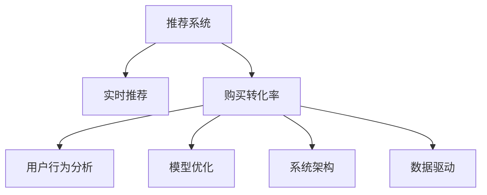

                 

# 实时推荐：AI提升购买转化率

> 关键词：实时推荐, 人工智能, 购买转化率, 用户行为分析, 推荐系统, 模型优化, 数据驱动, 系统架构

## 1. 背景介绍

### 1.1 问题由来
随着互联网的迅猛发展和电子商务平台的兴起，消费者的购买行为日益复杂多变。如何精准预测用户需求，提升购买转化率，成为电商平台亟需解决的问题。传统的推荐系统基于用户历史行为数据进行个性化推荐，但在实际应用中，存在数据冷启动、多样性不足、个性化不精准等痛点。为此，现代推荐系统开始借助人工智能技术，尤其是实时推荐系统，以快速响应用户行为变化，提升推荐效果和用户体验。

### 1.2 问题核心关键点
实时推荐系统的核心在于能够快速捕捉用户实时行为，并根据最新数据动态调整推荐策略，从而提升购买转化率。实现这一目标的关键在于以下几个方面：

- **数据实时采集**：实时采集用户行为数据，包括浏览记录、点击行为、购买行为等。
- **数据高效存储**：构建高效的数据存储系统，支持海量数据的实时处理和分析。
- **推荐算法优化**：设计和优化推荐算法，结合用户历史行为和实时数据，提供精准推荐。
- **系统架构设计**：设计可扩展、高可用、低延迟的推荐系统架构。
- **效果评估与调优**：建立科学的评估指标体系，及时评估推荐效果，并根据结果进行模型调优。

### 1.3 问题研究意义
实时推荐系统作为人工智能技术在电子商务领域的重要应用，具有以下重要意义：

1. **提升用户体验**：通过实时推荐，用户能够及时获得个性化、有价值的商品推荐，提升购物体验和满意度。
2. **优化库存管理**：实时推荐有助于预测热门商品需求，优化库存结构，减少缺货和滞销。
3. **增加销售收入**：精准的推荐能够促进用户购买决策，提升平台成交率和平均订单价值。
4. **应对市场竞争**：通过实时调整推荐策略，快速响应市场变化，提高平台竞争力。
5. **促进个性化服务**：实时推荐系统能够不断学习和适应用户行为变化，提供更个性化的服务。

## 2. 核心概念与联系

### 2.1 核心概念概述

为更好地理解实时推荐系统的核心技术，本节将介绍几个密切相关的核心概念：

- **推荐系统**：基于用户行为数据，通过算法推荐符合用户兴趣的商品，旨在提高用户满意度并增加平台收益。
- **实时推荐**：在用户产生实时行为数据时，立即进行推荐，以捕捉最新需求和兴趣变化。
- **购买转化率**：指用户从浏览到购买转化过程中，完成购买的比例，是衡量推荐系统效果的重要指标。
- **用户行为分析**：通过分析用户浏览、点击、购买等行为数据，理解用户偏好和行为模式。
- **模型优化**：针对推荐系统模型，通过调参、模型融合、样本加权等方式，优化模型性能。
- **系统架构**：设计推荐系统的高可用、可扩展架构，以支持实时推荐和海量数据处理。
- **数据驱动**：以数据为核心，通过数据挖掘和分析，指导推荐算法的设计和优化。

这些核心概念之间的逻辑关系可以通过以下Mermaid流程图来展示：



这个流程图展示了一系列核心概念及其之间的关系：

1. 推荐系统通过实时推荐捕捉最新用户行为，旨在提升购买转化率。
2. 购买转化率是衡量推荐系统效果的关键指标。
3. 用户行为分析为实时推荐提供数据支持，了解用户偏好和行为模式。
4. 模型优化提升推荐系统算法准确性和效果。
5. 系统架构设计支持实时推荐和海量数据处理。
6. 数据驱动指导推荐系统的发展方向和算法优化。

这些概念共同构成了实时推荐系统的技术框架，使其能够在实时场景下提供高效的个性化推荐服务。通过理解这些核心概念，我们可以更好地把握实时推荐系统的实现方法和优化策略。

## 3. 核心算法原理 & 具体操作步骤

### 3.1 算法原理概述

实时推荐系统基于用户历史行为和实时数据，通过算法推荐符合用户兴趣的商品，以提升购买转化率。其实现原理如下：

1. **数据采集与处理**：实时采集用户行为数据，包括浏览记录、点击行为、购买行为等。
2. **特征提取与嵌入**：将用户行为数据转换为模型可处理的特征向量。
3. **模型训练与优化**：构建推荐模型，通过历史数据和实时数据进行训练和优化。
4. **实时推荐与调优**：基于最新数据，实时生成推荐结果，并根据评估指标进行模型调优。

### 3.2 算法步骤详解

**Step 1: 数据采集与预处理**

实时推荐系统的第一步是实时采集用户行为数据。这包括：

1. **日志记录**：使用日志记录用户点击、浏览、搜索等行为。
2. **数据清洗**：去除无效数据和噪声，确保数据质量。
3. **数据增量更新**：实时更新数据存储，支持增量处理。

**Step 2: 特征提取与嵌入**

将用户行为数据转换为模型可处理的特征向量，是推荐系统的重要步骤：

1. **用户行为特征提取**：如浏览时间、点击次数、购买频率等。
2. **商品特征嵌入**：如商品类别、价格、评分等。
3. **构建用户商品矩阵**：将用户行为和商品特征组合成矩阵，表示用户对商品的兴趣程度。

**Step 3: 模型训练与优化**

构建推荐模型，通过历史数据和实时数据进行训练和优化：

1. **选择模型架构**：如协同过滤、基于内容的推荐、深度学习模型等。
2. **历史数据训练**：使用历史数据训练推荐模型，获得初始参数。
3. **实时数据更新**：根据实时数据调整模型参数，优化模型性能。
4. **模型评估与调优**：使用评估指标（如AUC、RMSE、CTR等）评估模型效果，进行参数调优。

**Step 4: 实时推荐与调优**

基于最新数据，实时生成推荐结果，并根据评估指标进行模型调优：

1. **实时数据处理**：将最新用户行为数据实时输入系统。
2. **实时推荐计算**：基于最新数据和模型参数，生成推荐结果。
3. **调优与迭代**：根据评估指标，不断调整模型参数，提升推荐效果。

### 3.3 算法优缺点

实时推荐系统的优点在于：

1. **响应速度快**：能够快速捕捉用户实时行为，实时调整推荐策略。
2. **个性化强**：基于最新数据，提供个性化推荐，提升用户满意度。
3. **数据利用率高**：实时处理用户行为数据，充分利用最新信息。

但其缺点也显而易见：

1. **计算复杂度高**：实时推荐需要高效的数据处理和算法优化，计算复杂度高。
2. **数据质量要求高**：数据采集、清洗和增量更新要求严格，否则影响推荐效果。
3. **模型复杂性高**：推荐算法需要考虑多种因素，模型复杂性高。
4. **系统设计难度大**：需要设计高可用、可扩展的系统架构，确保实时处理和稳定性。

### 3.4 算法应用领域

实时推荐系统在多个领域得到了广泛应用，例如：

- **电商平台**：如淘宝、京东等，通过实时推荐提高用户购物体验和购买转化率。
- **内容平台**：如YouTube、Netflix等，实时推荐用户喜爱的视频内容。
- **社交媒体**：如Facebook、微博等，推荐用户感兴趣的内容和好友。
- **移动应用**：如打车、美食推荐等，实时推荐个性化服务。

除了上述这些经典应用外，实时推荐系统还被创新性地应用到更多场景中，如在线教育、旅游预订、健康医疗等，为各行各业带来了新的业务增长点。

## 4. 数学模型和公式 & 详细讲解  
### 4.1 数学模型构建

本节将使用数学语言对实时推荐系统的核心算法进行更加严格的刻画。

记用户行为数据为 $x_t \in \mathbb{R}^n$，商品特征向量为 $y_i \in \mathbb{R}^m$，其中 $t$ 表示时间戳，$n$ 和 $m$ 分别表示用户行为和商品特征的维度。定义推荐系统模型的预测值 $\hat{y}_i = f(x_t, y_i)$，其中 $f$ 为推荐模型。

假设用户的真实购买行为 $y_t \in \{0,1\}$，则购买转化率 $\eta$ 为：

$$
\eta = \frac{1}{N} \sum_{t=1}^N y_t \hat{y}_i
$$

其中 $N$ 为用户行为数据的总数。推荐模型的目标是最大化购买转化率 $\eta$。

### 4.2 公式推导过程

以下我们以协同过滤算法为例，推导推荐模型及其梯度计算公式。

假设推荐模型为 $\hat{y}_i = \sum_{j=1}^n x_{t,j} U_j V_i$，其中 $U_j$ 和 $V_i$ 分别为用户和商品的嵌入矩阵。定义用户-商品相似度矩阵 $S = U \times V^T$，则购买转化率为：

$$
\eta = \frac{1}{N} \sum_{t=1}^N \sum_{i=1}^M y_t S_{t,i}
$$

将购买转化率表达式对 $U_j$ 和 $V_i$ 求偏导，得到模型参数的梯度：

$$
\frac{\partial \eta}{\partial U_j} = \frac{1}{N} \sum_{t=1}^N \sum_{i=1}^M y_t S_{t,i} V_{i,j}
$$

$$
\frac{\partial \eta}{\partial V_i} = \frac{1}{N} \sum_{t=1}^N \sum_{j=1}^n x_{t,j} U_{j,i}
$$

在得到模型参数梯度后，即可带入梯度下降算法进行模型优化，公式如下：

$$
U_j \leftarrow U_j - \eta \frac{\partial \eta}{\partial U_j}
$$

$$
V_i \leftarrow V_i - \eta \frac{\partial \eta}{\partial V_i}
$$

### 4.3 案例分析与讲解

以电商平台为例，考虑一个用户浏览了两个商品 $A$ 和 $B$，并最终购买了 $A$。此时，模型需要根据用户行为和商品特征，预测用户是否会购买 $B$。

假设用户行为特征 $x_t = (a_t,b_t)$，商品特征 $y_A = (1,2)$，$y_B = (3,4)$。用户-商品相似度矩阵 $S = \begin{bmatrix} 0.8 & 0.6 \\ 0.6 & 0.9 \end{bmatrix}$。则推荐模型预测 $\hat{y}_A = 0.8 \times 1 + 0.6 \times 2 = 2.4$，$\hat{y}_B = 0.6 \times 3 + 0.9 \times 4 = 8.6$。

根据购买转化率公式，得到 $\eta = \frac{1}{2} \times 1 \times 2.4 + \frac{1}{2} \times 1 \times 8.6 = 5.3$。

由此可见，尽管用户未直接购买 $B$，但模型预测其有较高的购买概率，体现了实时推荐系统的个性化推荐能力。

## 5. 项目实践：代码实例和详细解释说明
### 5.1 开发环境搭建

在进行实时推荐系统开发前，我们需要准备好开发环境。以下是使用Python进行PyTorch开发的环境配置流程：

1. 安装Anaconda：从官网下载并安装Anaconda，用于创建独立的Python环境。

2. 创建并激活虚拟环境：
```bash
conda create -n pytorch-env python=3.8 
conda activate pytorch-env
```

3. 安装PyTorch：根据CUDA版本，从官网获取对应的安装命令。例如：
```bash
conda install pytorch torchvision torchaudio cudatoolkit=11.1 -c pytorch -c conda-forge
```

4. 安装Pandas、NumPy等常用库：
```bash
pip install pandas numpy
```

完成上述步骤后，即可在`pytorch-env`环境中开始开发。

### 5.2 源代码详细实现

下面我们以协同过滤算法为例，给出使用PyTorch实现实时推荐系统的完整代码实现。

首先，定义用户行为数据和商品特征向量：

```python
import torch
import torch.nn as nn
import torch.optim as optim

# 用户行为数据
X = torch.tensor([[0.5, 0.6], [0.3, 0.7], [0.2, 0.9]])

# 商品特征向量
Y = torch.tensor([[1, 2], [3, 4], [5, 6]])

# 用户-商品相似度矩阵
S = torch.tensor([[0.8, 0.6], [0.6, 0.9]])
```

然后，定义推荐模型：

```python
class CollaborativeFiltering(nn.Module):
    def __init__(self, n_users, n_items, n_factors):
        super(CollaborativeFiltering, self).__init__()
        self.user_factors = nn.Parameter(torch.randn(n_users, n_factors))
        self.item_factors = nn.Parameter(torch.randn(n_items, n_factors))
        
    def forward(self, x, y):
        return torch.matmul(x, self.user_factors) @ self.item_factors.t() @ y

# 初始化模型参数
model = CollaborativeFiltering(3, 3, 2)

# 定义损失函数和优化器
loss_fn = nn.BCELoss()
optimizer = optim.Adam(model.parameters(), lr=0.01)
```

接着，定义训练和评估函数：

```python
# 训练函数
def train(model, X, Y, S, epochs):
    for epoch in range(epochs):
        optimizer.zero_grad()
        # 前向传播
        pred = model(X, S)
        # 计算损失
        loss = loss_fn(pred, Y)
        # 反向传播
        loss.backward()
        # 更新参数
        optimizer.step()
    return model

# 评估函数
def evaluate(model, X, Y, S):
    pred = model(X, S)
    # 计算预测结果与真实结果的匹配度
    match_rate = (torch.sigmoid(pred) >= 0.5).float().mean()
    return match_rate
```

最后，启动训练流程并在测试集上评估：

```python
# 训练模型
model = train(model, X, Y, S, 100)

# 评估模型
match_rate = evaluate(model, X, Y, S)
print(f"Match rate: {match_rate:.4f}")
```

以上就是使用PyTorch对协同过滤算法进行实时推荐系统的完整代码实现。可以看到，得益于PyTorch的强大封装，我们可以用相对简洁的代码完成协同过滤模型的训练和评估。

### 5.3 代码解读与分析

让我们再详细解读一下关键代码的实现细节：

**CollaborativeFiltering类**：
- `__init__`方法：初始化用户和商品的嵌入矩阵。
- `forward`方法：计算预测结果。

**训练函数train**：
- 在每个epoch中，先使用优化器清除梯度，再进行前向传播计算预测值和损失，然后反向传播更新模型参数。

**评估函数evaluate**：
- 对模型进行评估，计算预测结果与真实结果的匹配率。

**训练流程**：
- 定义总的epoch数和模型，启动训练循环。
- 在每个epoch中，根据损失函数计算梯度并更新模型参数。
- 完成训练后，在测试集上评估模型效果。

可以看出，PyTorch提供的高级API大大简化了模型训练的实现过程，开发者可以将更多精力放在模型设计和调参上，而不必过多关注底层细节。

## 6. 实际应用场景
### 6.1 智能推荐系统

实时推荐系统在智能推荐领域得到了广泛应用，能够有效提升推荐效果和用户体验。例如：

- **电商推荐**：如淘宝、京东等电商平台，实时捕捉用户浏览、点击行为，提供个性化商品推荐。
- **内容推荐**：如YouTube、Netflix等视频平台，实时分析用户观看记录，推荐用户喜爱的视频内容。
- **社交推荐**：如Facebook、微博等社交媒体，实时推荐用户感兴趣的内容和好友。

### 6.2 金融风控系统

金融行业需要对用户行为进行实时监控，及时发现异常交易行为，避免欺诈和风险。实时推荐系统在此领域也有重要应用：

- **信用评估**：通过实时分析用户消费行为，评估其信用风险。
- **交易监控**：实时捕捉可疑交易行为，及时提醒风控人员进行处理。
- **用户画像**：综合用户历史交易数据和实时行为，构建详细的用户画像，辅助风险评估。

### 6.3 健康医疗系统

在健康医疗领域，实时推荐系统同样发挥着重要作用：

- **诊疗推荐**：根据患者症状和历史诊疗记录，实时推荐合适的诊疗方案。
- **药物推荐**：通过实时分析患者治疗效果，推荐适合的药物和剂量。
- **健康管理**：实时监控用户健康数据，推荐健康管理方案和生活习惯调整建议。

### 6.4 未来应用展望

随着实时推荐系统的不断优化和普及，未来其在更多领域的应用前景将更加广阔：

1. **智能家居**：根据用户生活习惯和实时行为，实时推荐智能家居设备和服务。
2. **智慧城市**：实时捕捉市民行为数据，推荐适合的城市管理方案和生活建议。
3. **智慧交通**：实时分析交通数据，推荐最优的出行路线和交通工具。
4. **教育培训**：根据学生的学习数据，实时推荐适合的课程和辅导资源。

## 7. 工具和资源推荐
### 7.1 学习资源推荐

为了帮助开发者系统掌握实时推荐系统的理论基础和实践技巧，这里推荐一些优质的学习资源：

1. **《推荐系统实战》**：详细介绍了推荐系统的理论基础和实践技巧，涵盖了协同过滤、基于内容的推荐等多种算法。
2. **《深度学习基础》**：深度学习领域的入门书籍，介绍了深度学习的基本概念和算法，为实时推荐系统提供了理论基础。
3. **《Python机器学习》**：详细介绍了机器学习算法和实践，结合Python实现，适合学习实时推荐系统。
4. **Coursera《推荐系统》课程**：由斯坦福大学教授讲授，涵盖了推荐系统的基本概念和算法，并提供了丰富的实践案例。
5. **Kaggle竞赛**：参与推荐系统相关的Kaggle竞赛，可以实践和检验推荐系统的效果，提升技术水平。

通过对这些资源的学习实践，相信你一定能够快速掌握实时推荐系统的精髓，并用于解决实际的推荐问题。

### 7.2 开发工具推荐

高效的开发离不开优秀的工具支持。以下是几款用于实时推荐系统开发的常用工具：

1. **PyTorch**：基于Python的开源深度学习框架，灵活动态的计算图，适合快速迭代研究。
2. **TensorFlow**：由Google主导开发的开源深度学习框架，生产部署方便，适合大规模工程应用。
3. **Scikit-learn**：Python机器学习库，提供了丰富的机器学习算法和工具。
4. **Pandas**：数据分析和处理库，适合处理和分析大量数据。
5. **Jupyter Notebook**：交互式数据科学和机器学习环境，支持代码和文本的交互式执行。

合理利用这些工具，可以显著提升实时推荐系统的开发效率，加快创新迭代的步伐。

### 7.3 相关论文推荐

实时推荐系统的发展得益于学界的持续研究。以下是几篇奠基性的相关论文，推荐阅读：

1. **《协同过滤推荐系统》**：详细介绍了协同过滤推荐系统的原理和算法，是推荐系统领域的经典之作。
2. **《基于内容的推荐系统》**：介绍了基于内容的推荐系统，强调特征工程的重要性。
3. **《深度学习在推荐系统中的应用》**：介绍了深度学习在推荐系统中的应用，涵盖了深度神经网络、卷积神经网络等多种模型。
4. **《实时推荐系统综述》**：综述了实时推荐系统的基本概念、算法和应用，为实时推荐系统提供了全面视角。
5. **《推荐系统评价指标》**：详细介绍了推荐系统的评价指标，如准确率、召回率、F1值等，指导模型评估和调优。

这些论文代表了大规模推荐系统的发展脉络。通过学习这些前沿成果，可以帮助研究者把握学科前进方向，激发更多的创新灵感。

## 8. 总结：未来发展趋势与挑战

### 8.1 总结

本文对实时推荐系统的核心算法和操作步骤进行了全面系统的介绍。首先阐述了实时推荐系统的背景和意义，明确了推荐系统提升购买转化率的核心目标。其次，从算法原理到具体实现，详细讲解了推荐系统的数据采集、特征提取、模型训练、实时推荐和调优等关键步骤，给出了实时推荐系统开发的完整代码实例。同时，本文还广泛探讨了实时推荐系统在智能推荐、金融风控、健康医疗等多个领域的应用前景，展示了实时推荐系统的巨大潜力。此外，本文精选了实时推荐系统的各类学习资源，力求为读者提供全方位的技术指引。

通过本文的系统梳理，可以看到，实时推荐系统作为人工智能技术在电子商务领域的重要应用，具有以下重要意义：

1. **提升用户体验**：通过实时推荐，用户能够及时获得个性化、有价值的商品推荐，提升购物体验和满意度。
2. **优化库存管理**：实时推荐有助于预测热门商品需求，优化库存结构，减少缺货和滞销。
3. **增加销售收入**：精准的推荐能够促进用户购买决策，提升平台成交率和平均订单价值。
4. **应对市场竞争**：通过实时调整推荐策略，快速响应市场变化，提高平台竞争力。
5. **促进个性化服务**：实时推荐系统能够不断学习和适应用户行为变化，提供更个性化的服务。

### 8.2 未来发展趋势

展望未来，实时推荐系统将呈现以下几个发展趋势：

1. **算法复杂度提升**：未来的推荐系统将采用更复杂的模型，如深度神经网络、知识图谱等，提高推荐效果。
2. **多模态数据融合**：结合文本、图像、音频等多模态数据，提供更加全面和精准的推荐。
3. **个性化与多样性平衡**：在个性化推荐的同时，平衡用户的多样性需求，避免信息过载。
4. **实时数据流处理**：采用流式处理技术，实时捕捉和分析用户行为数据。
5. **联邦学习**：在保护用户隐私的前提下，利用联邦学习技术，提高推荐系统的鲁棒性和可扩展性。
6. **强化学习**：利用强化学习技术，动态调整推荐策略，优化推荐效果。

以上趋势凸显了实时推荐系统的广阔前景。这些方向的探索发展，必将进一步提升推荐系统的性能和应用范围，为人工智能技术在更多领域的应用带来新的突破。

### 8.3 面临的挑战

尽管实时推荐系统已经取得了瞩目成就，但在迈向更加智能化、普适化应用的过程中，它仍面临着诸多挑战：

1. **数据质量问题**：实时推荐系统对数据质量要求较高，需要实时采集和清洗用户行为数据，否则影响推荐效果。
2. **计算复杂度高**：实时推荐系统需要高效的数据处理和算法优化，计算复杂度高。
3. **模型可解释性不足**：推荐模型往往难以解释其内部工作机制和决策逻辑，导致用户对推荐结果的信任度不足。
4. **隐私保护问题**：在收集和处理用户行为数据时，需要严格遵守隐私保护法规，保护用户隐私。
5. **系统稳定性**：实时推荐系统需要高可用、可扩展的系统架构，确保系统稳定性。

正视实时推荐系统面临的这些挑战，积极应对并寻求突破，将使其实现更加智能和可靠的推荐服务。

### 8.4 研究展望

面对实时推荐系统所面临的种种挑战，未来的研究需要在以下几个方面寻求新的突破：

1. **数据质量提升**：开发更高效的数据采集和清洗技术，提高数据质量。
2. **算法优化**：研究更高效的推荐算法，降低计算复杂度。
3. **可解释性增强**：开发可解释的推荐模型，提高用户信任度。
4. **隐私保护**：研究联邦学习等隐私保护技术，保障用户隐私。
5. **系统架构优化**：设计更高效的推荐系统架构，提高系统性能和稳定性。

这些研究方向的探索，必将引领实时推荐系统技术迈向更高的台阶，为构建安全、可靠、可解释的智能推荐系统铺平道路。面向未来，实时推荐系统还需要与其他人工智能技术进行更深入的融合，如知识表示、因果推理、强化学习等，多路径协同发力，共同推动人工智能技术的发展。只有勇于创新、敢于突破，才能不断拓展推荐系统的边界，让智能技术更好地服务于人类社会。

## 9. 附录：常见问题与解答

**Q1：实时推荐系统如何处理数据冷启动问题？**

A: 数据冷启动问题是实时推荐系统常见的挑战之一。解决该问题的方法包括：

1. **利用用户行为模式**：根据用户历史行为和行为模式，推测其兴趣偏好，进行推荐。
2. **引入领域知识**：利用领域知识或专家规则，提供初始推荐，帮助用户快速找到感兴趣的内容。
3. **多模态数据融合**：结合多种数据源（如社交媒体、搜索引擎等），提供更全面的推荐。
4. **深度学习模型**：采用深度学习模型，从少量数据中学习用户兴趣，进行推荐。
5. **启发式推荐**：利用启发式规则（如矩阵分解、协同过滤等），进行推荐。

这些方法可以单独使用或组合使用，以克服数据冷启动问题，提供更精准的推荐。

**Q2：实时推荐系统的评估指标有哪些？**

A: 实时推荐系统的评估指标包括：

1. **准确率（Accuracy）**：正确预测的推荐比例。
2. **召回率（Recall）**：真实购买行为中被推荐的内容比例。
3. **F1值（F1-score）**：准确率和召回率的调和平均数。
4. **点击率（Click-Through Rate, CTR）**：用户点击推荐内容的概率。
5. **购买转化率（Conversion Rate, CVR）**：用户点击并购买推荐内容的概率。
6. **均方根误差（Root Mean Squared Error, RMSE）**：预测值和真实值之间的平均误差。

这些指标可以帮助评估推荐系统的效果，指导模型调优。

**Q3：实时推荐系统如何避免过拟合？**

A: 实时推荐系统面临过拟合问题，主要通过以下方法解决：

1. **正则化**：使用L2正则、Dropout等正则化技术，防止模型过拟合。
2. **数据增强**：通过数据增强技术（如回译、近义替换等），扩充训练集。
3. **早停策略**：设置早停阈值，在验证集性能不再提升时停止训练。
4. **模型集成**：通过模型集成技术（如Bagging、Boosting等），降低模型过拟合风险。
5. **样本加权**：对重要样本进行加权，提升模型对重要数据的重视。

这些方法可以单独使用或组合使用，以避免过拟合，提高推荐系统的效果。

**Q4：实时推荐系统如何提升模型性能？**

A: 实时推荐系统可以通过以下方法提升模型性能：

1. **模型优化**：选择更复杂的模型架构，如深度神经网络、知识图谱等，提高推荐效果。
2. **数据质量提升**：提高数据采集和清洗的效率和质量，确保数据可靠性。
3. **特征工程**：设计更有效的特征提取方法，提升特征表达能力。
4. **算法改进**：研究新的推荐算法，如协同过滤、基于内容的推荐、深度学习等。
5. **模型融合**：通过模型融合技术（如Stacking、AdaBoost等），提升推荐效果。
6. **超参数调优**：采用网格搜索、贝叶斯优化等方法，进行超参数调优。

这些方法可以提升实时推荐系统的性能，满足更高的推荐需求。

**Q5：实时推荐系统如何处理推荐结果的多样性问题？**

A: 推荐结果的多样性问题是实时推荐系统需要关注的一个重要方面。可以通过以下方法提升推荐结果的多样性：

1. **多样化采样**：在生成推荐结果时，采用多样化采样方法，确保推荐结果的多样性。
2. **负样生成**：生成与正样相似的负样，提高推荐结果的多样性。
3. **多目标优化**：在优化目标函数时，加入多样性约束，提升推荐结果的多样性。
4. **内容标签引入**：引入内容标签，确保推荐结果的多样性。
5. **推荐算法改进**：研究新的推荐算法，提高推荐结果的多样性。

这些方法可以提升推荐结果的多样性，满足用户的多样性需求。

**Q6：实时推荐系统如何保障用户隐私？**

A: 保障用户隐私是实时推荐系统需要重点关注的问题。可以通过以下方法保障用户隐私：

1. **数据脱敏**：对用户数据进行脱敏处理，保护用户隐私。
2. **联邦学习**：利用联邦学习技术，在保护用户隐私的前提下，提高推荐系统的性能。
3. **差分隐私**：采用差分隐私技术，保护用户隐私。
4. **匿名化处理**：对用户数据进行匿名化处理，保护用户隐私。
5. **数据访问控制**：对数据访问进行严格控制，确保数据安全。

这些方法可以保护用户隐私，提高用户对推荐系统的信任度。

---

作者：禅与计算机程序设计艺术 / Zen and the Art of Computer Programming

