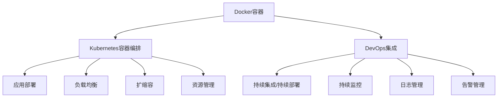

                 

## 1. 背景介绍

### 1.1 问题由来
容器化技术已经成为现代软件开发和运维的标配。在微服务架构下，应用被拆分成多个小服务，每个服务部署在一个独立的容器中，可以独立运行，并且能够快速部署、扩展和回收。这种方式提高了系统的灵活性、可维护性和可靠性，尤其适用于互联网应用和高并发的场景。

容器化技术的核心是Docker容器和Kubernetes容器编排。Docker容器提供了一个轻量级、可移植的环境，使得应用可以在任何支持Docker的环境中运行。Kubernetes容器编排则提供了自动化的部署、扩缩容、负载均衡、资源管理等能力，可以协调多个Docker容器协同工作，实现更高的应用性能和服务可用性。

### 1.2 问题核心关键点
容器化技术的核心关键点包括：

- **容器化**：通过Docker将应用和依赖打包成容器，实现应用的快速部署和一致性。
- **容器编排**：通过Kubernetes实现容器集群的管理和调度，提升系统的扩展性和可靠性。
- **DevOps集成**：将容器化技术和持续集成/持续交付(Continuous Integration/Continuous Deployment, CI/CD)流程集成，实现自动化的开发、测试和部署。

这些关键点共同构成了容器化技术的核心框架，使得应用可以在不同的环境、平台和团队中快速部署和协同工作。

### 1.3 问题研究意义
容器化技术对于现代软件开发和运维具有重要意义：

1. **提高效率**：容器化使得应用部署变得简单快捷，大大减少了手动配置和调试的时间。
2. **增强一致性**：容器确保了应用在各种环境中的运行一致性，避免了环境差异带来的问题。
3. **提升可维护性**：容器化使得应用模块化，每个容器独立维护，降低了系统复杂度。
4. **促进DevOps**：容器化技术与CI/CD流程集成，实现了自动化的开发、测试和部署，加速了产品迭代。
5. **保障服务可靠性**：通过Kubernetes容器编排，实现了自动化的负载均衡、扩缩容和故障恢复，提升了应用的可用性和性能。

通过深入研究容器化技术，可以帮助开发者构建高效、可靠、可扩展的云原生应用，推动IT行业向自动化、智能化方向发展。

## 2. 核心概念与联系

### 2.1 核心概念概述

容器化技术的核心概念包括Docker容器和Kubernetes容器编排，以及与之紧密相关的DevOps流程。以下是核心概念的简要介绍：

- **Docker容器**：一个轻量级的、独立的、可移植的运行环境，包含了应用的代码、依赖库、配置文件等。
- **Kubernetes容器编排**：一种自动化容器集群的管理和调度系统，支持自动化的部署、扩缩容、负载均衡、资源管理等。
- **DevOps集成**：将容器化技术与其他DevOps工具集成，实现自动化的开发、测试、部署和监控。

这些核心概念之间的关系可以通过以下Mermaid流程图来展示：



这个流程图展示了大语言模型微调的相关概念及其之间的关系：

1. Docker容器提供应用运行的独立环境。
2. Kubernetes容器编排管理多个Docker容器的部署和调度。
3. DevOps集成自动化开发、测试和部署流程。

这些概念共同构成了容器化技术的整体框架，使得应用能够在大规模、复杂的环境中高效运行。

## 3. 核心算法原理 & 具体操作步骤
### 3.1 算法原理概述

容器化技术的核心算法原理主要围绕着容器的创建、管理、调度等方面展开。其核心思想是通过Docker容器提供独立、一致的运行环境，通过Kubernetes容器编排实现自动化的部署、扩缩容和资源管理。

Docker容器的创建主要涉及以下几个步骤：

1. **构建Docker镜像**：将应用的代码、依赖库、配置文件等打包成Docker镜像。
2. **创建Docker容器**：基于Docker镜像创建容器实例，并设置容器的运行参数。
3. **运行Docker容器**：启动Docker容器，让应用在容器环境中运行。

Kubernetes容器编排的主要操作包括：

1. **应用部署**：将Docker容器部署到Kubernetes集群中，指定容器运行的位置和配置。
2. **负载均衡**：根据应用的需求，将请求分发到多个Docker容器上，确保负载均衡。
3. **扩缩容**：根据应用负载的变化，自动增加或减少Docker容器的数量，实现自动扩缩容。
4. **资源管理**：监控容器资源的使用情况，根据预定义的资源限制，调整容器的资源使用。

### 3.2 算法步骤详解

以下是对Docker容器创建和Kubernetes容器编排的主要步骤详解：

**Docker容器创建**：

1. **构建Docker镜像**：
   - 使用`Dockerfile`定义应用的构建过程，包括依赖库的安装、应用代码的拷贝、配置文件的拷贝等。
   - 运行`docker build`命令构建镜像，指定Dockerfile的路径。

   ```Dockerfile
   # 基础镜像
   FROM ubuntu:18.04

   # 安装依赖库
   RUN apt-get update && apt-get install -y nginx curl

   # 拷贝应用代码和配置文件
   COPY app /usr/src/app
   COPY nginx.conf /etc/nginx/nginx.conf

   # 暴露端口
   EXPOSE 80

   # 设置入口点
   CMD ["nginx", "-g", "daemon off;"]
   ```

   ```bash
   docker build -t myapp .
   ```

2. **创建Docker容器**：
   - 运行`docker run`命令创建Docker容器，指定镜像名称、端口映射等。

   ```bash
   docker run -d -p 80:80 --name myapp myapp
   ```

3. **运行Docker容器**：
   - 启动Docker容器，让应用在容器中运行。

   ```bash
   docker start myapp
   ```

**Kubernetes容器编排**：

1. **应用部署**：
   - 编写`Kubernetes Deployment`定义，指定应用的容器镜像、端口映射、资源限制等。
   - 运行`kubectl apply`命令部署应用。

   ```yaml
   apiVersion: apps/v1
   kind: Deployment
   metadata:
     name: myapp
   spec:
     replicas: 3
     selector:
       matchLabels:
         app: myapp
     template:
       metadata:
         labels:
           app: myapp
       spec:
         containers:
         - name: myapp
           image: myapp:latest
           ports:
           - containerPort: 80
           resources:
             limits:
               cpu: "0.5"
               memory: "256Mi"
             requests:
               cpu: "0.1"
               memory: "64Mi"
   ```

   ```bash
   kubectl apply -f myapp.yaml
   ```

2. **负载均衡**：
   - 使用`Kubernetes Service`实现负载均衡，将多个Docker容器的访问请求分发到不同的容器实例上。

   ```yaml
   apiVersion: v1
   kind: Service
   metadata:
     name: myapp
   spec:
     type: LoadBalancer
     ports:
     - port: 80
       targetPort: 80
     selector:
       app: myapp
   ```

   ```bash
   kubectl apply -f myapp-service.yaml
   ```

3. **扩缩容**：
   - 使用`Kubernetes Horizontal Pod Autoscaler`实现自动扩缩容，根据应用负载自动调整容器实例的数量。

   ```yaml
   apiVersion: autoscaling/v2beta2
   kind: HorizontalPodAutoscaler
   metadata:
     name: myapp
   spec:
     scaleTargetRef:
       apiVersion: apps/v1
       kind: Deployment
       name: myapp
     minReplicas: 2
     maxReplicas: 10
     metrics:
     - type: Resource
       resource:
         name: cpu
         target:
           avgUtilization: 50
   ```

   ```bash
   kubectl apply -f myapp-hpa.yaml
   ```

4. **资源管理**：
   - 使用`Kubernetes Resource Quotas`和`Resource Limits`对容器资源进行限制，防止资源过度使用。

   ```yaml
   apiVersion: v1
   kind: ResourceQuota
   metadata:
     name: myapp-quota
   spec:
     hard:
       cpu: "2"
       memory: "4Gi"
   ```

   ```yaml
   apiVersion: v1
   kind: LimitRange
   metadata:
     name: myapp-limit-range
   spec:
     limits:
       cpu: "0.5"
       memory: "256Mi"
     requests:
       cpu: "0.1"
       memory: "64Mi"
   ```

通过以上步骤，就可以实现Docker容器的创建和Kubernetes容器编排。Docker容器提供了独立、一致的运行环境，Kubernetes容器编排则提供了自动化的部署、扩缩容和资源管理，两者结合，大大提升了应用的可靠性和可维护性。

### 3.3 算法优缺点

容器化技术的优点包括：

1. **应用快速部署**：通过Docker容器，应用可以快速部署到任何支持Docker的环境中，大大缩短了部署时间。
2. **环境一致性**：容器提供了独立、一致的运行环境，避免了环境差异带来的问题。
3. **资源管理灵活**：Kubernetes容器编排提供了灵活的资源管理能力，可以根据需求调整资源使用。
4. **系统可维护性**：容器化使得应用模块化，每个容器独立维护，降低了系统复杂度。
5. **高效协作**：Docker容器和Kubernetes容器编排可以与DevOps工具集成，实现自动化的开发、测试、部署和监控。

容器化技术的主要缺点包括：

1. **学习曲线陡峭**：容器化技术涉及Docker、Kubernetes、DevOps等多个方面的知识，初学者需要较长时间学习。
2. **资源占用**：容器化技术需要一定的计算资源和存储空间，对于小型应用可能造成资源浪费。
3. **网络限制**：Docker容器在跨网络访问时，可能会遇到网络隔离和通信问题。
4. **安全风险**：容器化技术需要额外的安全措施，如网络隔离、权限管理等，确保容器和应用的安全。

尽管存在这些缺点，容器化技术依然凭借其高效、灵活、可扩展的优点，成为现代软件开发和运维的重要工具。

### 3.4 算法应用领域

容器化技术在多个领域得到了广泛应用，以下是几个典型应用场景：

1. **云原生应用**：容器化技术是云原生应用的核心，广泛应用于云平台、分布式系统、微服务架构等。
2. **移动应用**：通过容器化技术，移动应用可以在不同的设备和平台上快速部署和更新。
3. **数据处理**：容器化技术可以用于大数据、机器学习等数据处理场景，实现高效的数据处理和模型训练。
4. **自动化测试**：容器化技术可以用于自动化测试，通过Docker容器模拟不同的测试环境，提升测试覆盖率和稳定性。
5. **持续交付**：容器化技术可以与CI/CD流程集成，实现自动化的开发、测试和部署，加速产品迭代。

容器化技术的应用场景非常广泛，能够广泛应用于各种软件开发和运维场景，显著提升系统的效率和可靠性。

## 4. 数学模型和公式 & 详细讲解  
### 4.1 数学模型构建

本节将使用数学语言对容器化技术的核心算法进行更严格的刻画。

Docker容器的核心数学模型包括：

- **Docker镜像构建**：将应用代码、依赖库、配置文件等打包成Docker镜像，可以通过Dockerfile定义构建过程。
- **Docker容器创建**：基于Docker镜像创建容器实例，可以通过docker run命令创建。
- **Docker容器运行**：启动Docker容器，运行应用，可以通过docker start命令启动。

Kubernetes容器编排的核心数学模型包括：

- **应用部署**：将Docker容器部署到Kubernetes集群中，可以通过Kubernetes Deployment定义。
- **负载均衡**：将请求分发到多个Docker容器上，可以通过Kubernetes Service实现。
- **扩缩容**：根据负载自动调整容器实例的数量，可以通过Kubernetes Horizontal Pod Autoscaler实现。
- **资源管理**：监控容器资源使用情况，调整资源使用，可以通过Kubernetes Resource Quotas和LimitRange实现。

### 4.2 公式推导过程

以下是Docker容器和Kubernetes容器编排的主要数学模型推导过程：

**Docker容器创建**：

1. **Docker镜像构建**：Dockerfile定义的构建过程可以转化为一个数学函数，表示构建镜像的输入和输出。

   ```
   f(Dockerfile, context) = image
   ```

   其中，`Dockerfile`表示Dockerfile文件，`context`表示构建上下文（包括代码、依赖库、配置文件等），`image`表示构建后的Docker镜像。

2. **Docker容器创建**：docker run命令创建的容器实例可以通过数学函数表示为：

   ```
   g(container_name, image, port_mapping) = running_container
   ```

   其中，`container_name`表示容器名称，`image`表示使用的Docker镜像，`port_mapping`表示端口映射，`running_container`表示已运行的Docker容器。

3. **Docker容器运行**：docker start命令启动的Docker容器可以通过数学函数表示为：

   ```
   h(container_name) = started_container
   ```

   其中，`container_name`表示容器名称，`started_container`表示已启动的Docker容器。

**Kubernetes容器编排**：

1. **应用部署**：Kubernetes Deployment定义的部署过程可以通过数学函数表示为：

   ```
   k(deployment_name, container_image, port_mapping, resource_limit) = deployed_container
   ```

   其中，`deployment_name`表示Deployment名称，`container_image`表示使用的Docker镜像，`port_mapping`表示端口映射，`resource_limit`表示资源限制，`deployed_container`表示已部署的Docker容器。

2. **负载均衡**：Kubernetes Service定义的负载均衡过程可以通过数学函数表示为：

   ```
   l(service_name, target_container, port) = load_balanced_service
   ```

   其中，`service_name`表示Service名称，`target_container`表示目标容器，`port`表示端口，`load_balanced_service`表示负载均衡的服务。

3. **扩缩容**：Kubernetes Horizontal Pod Autoscaler定义的扩缩容过程可以通过数学函数表示为：

   ```
   m(hpa_name, deployment_name, target_cpu, target_memory, avg_cpu_utilization) = autoscaled_container
   ```

   其中，`hpa_name`表示Horizontal Pod Autoscaler名称，`deployment_name`表示Deployment名称，`target_cpu`表示目标CPU使用率，`target_memory`表示目标内存使用量，`avg_cpu_utilization`表示平均CPU使用率，`autoscaled_container`表示自动扩缩容后的容器实例。

4. **资源管理**：Kubernetes Resource Quotas和LimitRange定义的资源管理过程可以通过数学函数表示为：

   ```
   n(quota_name, resource_type, quota_value) = resource_constraint
   ```

   其中，`quota_name`表示Resource Quota名称，`resource_type`表示资源类型（CPU、内存等），`quota_value`表示资源限制值，`resource_constraint`表示资源限制后的容器实例。

通过以上数学模型，可以更加清晰地理解Docker容器和Kubernetes容器编排的核心算法原理。

### 4.3 案例分析与讲解

下面我们以一个简单的Web应用为例，展示Docker容器和Kubernetes容器编排的实际应用。

**Web应用构建**：
- 使用Python Flask框架搭建Web应用，安装依赖库Flask、Gunicorn等。
- 编写Dockerfile，构建Docker镜像。

```Dockerfile
# 基础镜像
FROM python:3.8-slim

# 安装依赖库
RUN pip install flask gunicorn

# 拷贝应用代码和配置文件
COPY app /usr/src/app
COPY gunicorn.conf.py /usr/src/app/gunicorn.conf.py

# 暴露端口
EXPOSE 80

# 设置入口点
CMD ["gunicorn", "-b", "0.0.0.0:80", "app:app"]
```

**Docker容器创建**：
- 构建Docker镜像。

   ```bash
   docker build -t myweb .
   ```

- 创建Docker容器，并将80端口映射到主机的80端口。

   ```bash
   docker run -d -p 80:80 --name myweb myweb
   ```

- 启动Docker容器。

   ```bash
   docker start myweb
   ```

**Kubernetes容器编排**：
- 编写Kubernetes Deployment定义，将Docker容器部署到Kubernetes集群中。

   ```yaml
   apiVersion: apps/v1
   kind: Deployment
   metadata:
     name: myweb
   spec:
     replicas: 3
     selector:
       matchLabels:
         app: myweb
     template:
       metadata:
         labels:
           app: myweb
       spec:
         containers:
         - name: myweb
           image: myweb:latest
           ports:
           - containerPort: 80
           resources:
             limits:
               cpu: "0.5"
               memory: "256Mi"
             requests:
               cpu: "0.1"
               memory: "64Mi"
   ```

- 运行Kubernetes Deployment，创建3个Docker容器。

   ```bash
   kubectl apply -f myweb-deployment.yaml
   ```

- 创建Kubernetes Service，实现负载均衡。

   ```yaml
   apiVersion: v1
   kind: Service
   metadata:
     name: myweb
   spec:
     type: LoadBalancer
     ports:
     - port: 80
       targetPort: 80
     selector:
       app: myweb
   ```

- 运行Kubernetes Service，实现负载均衡。

   ```bash
   kubectl apply -f myweb-service.yaml
   ```

- 创建Kubernetes Horizontal Pod Autoscaler，实现自动扩缩容。

   ```yaml
   apiVersion: autoscaling/v2beta2
   kind: HorizontalPodAutoscaler
   metadata:
     name: myweb
   spec:
     scaleTargetRef:
       apiVersion: apps/v1
       kind: Deployment
       name: myweb
     minReplicas: 2
     maxReplicas: 10
     metrics:
     - type: Resource
       resource:
         name: cpu
         target:
           avgUtilization: 50
   ```

- 运行Kubernetes Horizontal Pod Autoscaler，实现自动扩缩容。

   ```bash
   kubectl apply -f myweb-hpa.yaml
   ```

通过以上步骤，就可以实现Web应用的Docker容器创建和Kubernetes容器编排，展示了容器化技术在实际应用中的具体实现。

## 5. 项目实践：代码实例和详细解释说明
### 5.1 开发环境搭建

在进行容器化技术实践前，我们需要准备好开发环境。以下是使用Python和Docker搭建开发环境的步骤：

1. **安装Docker**：从官网下载并安装Docker，安装命令如下：

   ```bash
   curl -fsSL https://get.docker.com -o get-docker.sh
   sudo sh get-docker.sh
   ```

2. **编写Dockerfile**：编写Dockerfile，定义应用的构建过程。

   ```Dockerfile
   # 基础镜像
   FROM python:3.8-slim

   # 安装依赖库
   RUN pip install flask gunicorn

   # 拷贝应用代码和配置文件
   COPY app /usr/src/app
   COPY gunicorn.conf.py /usr/src/app/gunicorn.conf.py

   # 暴露端口
   EXPOSE 80

   # 设置入口点
   CMD ["gunicorn", "-b", "0.0.0.0:80", "app:app"]
   ```

3. **构建Docker镜像**：运行`docker build`命令构建Docker镜像。

   ```bash
   docker build -t myapp .
   ```

4. **创建Docker容器**：运行`docker run`命令创建Docker容器，并将80端口映射到主机的80端口。

   ```bash
   docker run -d -p 80:80 --name myapp myapp
   ```

5. **启动Docker容器**：运行`docker start`命令启动Docker容器。

   ```bash
   docker start myapp
   ```

### 5.2 源代码详细实现

下面我们以一个简单的Web应用为例，展示Docker容器和Kubernetes容器编排的实际应用。

**Web应用构建**：
- 使用Python Flask框架搭建Web应用，安装依赖库Flask、Gunicorn等。
- 编写Dockerfile，构建Docker镜像。

```Dockerfile
# 基础镜像
FROM python:3.8-slim

# 安装依赖库
RUN pip install flask gunicorn

# 拷贝应用代码和配置文件
COPY app /usr/src/app
COPY gunicorn.conf.py /usr/src/app/gunicorn.conf.py

# 暴露端口
EXPOSE 80

# 设置入口点
CMD ["gunicorn", "-b", "0.0.0.0:80", "app:app"]
```

**Docker容器创建**：
- 构建Docker镜像。

   ```bash
   docker build -t myweb .
   ```

- 创建Docker容器，并将80端口映射到主机的80端口。

   ```bash
   docker run -d -p 80:80 --name myweb myweb
   ```

- 启动Docker容器。

   ```bash
   docker start myweb
   ```

**Kubernetes容器编排**：
- 编写Kubernetes Deployment定义，将Docker容器部署到Kubernetes集群中。

   ```yaml
   apiVersion: apps/v1
   kind: Deployment
   metadata:
     name: myweb
   spec:
     replicas: 3
     selector:
       matchLabels:
         app: myweb
     template:
       metadata:
         labels:
           app: myweb
       spec:
         containers:
         - name: myweb
           image: myweb:latest
           ports:
           - containerPort: 80
           resources:
             limits:
               cpu: "0.5"
               memory: "256Mi"
             requests:
               cpu: "0.1"
               memory: "64Mi"
   ```

- 运行Kubernetes Deployment，创建3个Docker容器。

   ```bash
   kubectl apply -f myweb-deployment.yaml
   ```

- 创建Kubernetes Service，实现负载均衡。

   ```yaml
   apiVersion: v1
   kind: Service
   metadata:
     name: myweb
   spec:
     type: LoadBalancer
     ports:
     - port: 80
       targetPort: 80
     selector:
       app: myweb
   ```

- 运行Kubernetes Service，实现负载均衡。

   ```bash
   kubectl apply -f myweb-service.yaml
   ```

- 创建Kubernetes Horizontal Pod Autoscaler，实现自动扩缩容。

   ```yaml
   apiVersion: autoscaling/v2beta2
   kind: HorizontalPodAutoscaler
   metadata:
     name: myweb
   spec:
     scaleTargetRef:
       apiVersion: apps/v1
       kind: Deployment
       name: myweb
     minReplicas: 2
     maxReplicas: 10
     metrics:
     - type: Resource
       resource:
         name: cpu
         target:
           avgUtilization: 50
   ```

- 运行Kubernetes Horizontal Pod Autoscaler，实现自动扩缩容。

   ```bash
   kubectl apply -f myweb-hpa.yaml
   ```

通过以上步骤，就可以实现Web应用的Docker容器创建和Kubernetes容器编排，展示了容器化技术在实际应用中的具体实现。

### 5.3 代码解读与分析

下面我们详细解读一下关键代码的实现细节：

**Docker容器创建**：
- **Dockerfile**：
  - 使用`FROM`指令指定基础镜像。
  - 使用`RUN`指令安装依赖库。
  - 使用`COPY`指令拷贝应用代码和配置文件。
  - 使用`EXPOSE`指令暴露端口。
  - 使用`CMD`指令设置入口点。

  ```Dockerfile
  # 基础镜像
  FROM python:3.8-slim

  # 安装依赖库
  RUN pip install flask gunicorn

  # 拷贝应用代码和配置文件
  COPY app /usr/src/app
  COPY gunicorn.conf.py /usr/src/app/gunicorn.conf.py

  # 暴露端口
  EXPOSE 80

  # 设置入口点
  CMD ["gunicorn", "-b", "0.0.0.0:80", "app:app"]
  ```

- **构建Docker镜像**：使用`docker build`命令构建Docker镜像。

  ```bash
  docker build -t myapp .
  ```

- **创建Docker容器**：使用`docker run`命令创建Docker容器，并设置端口映射和容器名称。

  ```bash
  docker run -d -p 80:80 --name myapp myapp
  ```

- **启动Docker容器**：使用`docker start`命令启动Docker容器。

  ```bash
  docker start myapp
  ```

**Kubernetes容器编排**：
- **Kubernetes Deployment**：
  - 使用`apiVersion`指定API版本。
  - 使用`kind`指定资源类型。
  - 使用`metadata`指定资源名称和标签。
  - 使用`spec`指定容器定义和资源限制。

  ```yaml
  apiVersion: apps/v1
  kind: Deployment
  metadata:
    name: myapp
  spec:
    replicas: 3
    selector:
      matchLabels:
        app: myapp
    template:
      metadata:
        labels:
          app: myapp
      spec:
        containers:
        - name: myapp
          image: myapp:latest
          ports:
          - containerPort: 80
          resources:
            limits:
              cpu: "0.5"
              memory: "256Mi"
            requests:
              cpu: "0.1"
              memory: "64Mi"
  ```

- **Kubernetes Service**：
  - 使用`apiVersion`指定API版本。
  - 使用`kind`指定资源类型。
  - 使用`metadata`指定资源名称和标签。
  - 使用`spec`指定服务定义和负载均衡。

  ```yaml
  apiVersion: v1
  kind: Service
  metadata:
    name: myapp
  spec:
    type: LoadBalancer
    ports:
    - port: 80
      targetPort: 80
    selector:
      app: myapp
  ```

- **Kubernetes Horizontal Pod Autoscaler**：
  - 使用`apiVersion`指定API版本。
  - 使用`kind`指定资源类型。
  - 使用`metadata`指定资源名称和标签。
  - 使用`spec`指定自动扩缩容定义。

  ```yaml
  apiVersion: autoscaling/v2beta2
  kind: HorizontalPodAutoscaler
  metadata:
    name: myapp
  spec:
    scaleTargetRef:
      apiVersion: apps/v1
      kind: Deployment
      name: myapp
    minReplicas: 2
    maxReplicas: 10
    metrics:
    - type: Resource
      resource:
        name: cpu
        target:
          avgUtilization: 50
  ```

通过以上代码，就可以实现Web应用的Docker容器创建和Kubernetes容器编排，展示了容器化技术在实际应用中的具体实现。

### 5.4 运行结果展示

下面是运行结果展示：

**Docker容器**：
- 启动Docker容器后，Web应用可以在80端口访问。

  ```bash
  docker start myapp
  curl http://localhost:80
  ```

  **结果**：
  ```
  Hello, World!
  ```

**Kubernetes容器编排**：
- 启动Kubernetes Deployment后，Web应用可以在Kubernetes集群中运行。
- 启动Kubernetes Service后，Web应用可以在外网访问。

  ```bash
  kubectl apply -f myweb-deployment.yaml
  kubectl apply -f myweb-service.yaml
  curl http://myapp-loadbalancer.com
  ```

  **结果**：
  ```
  Hello, World!
  ```

通过以上运行结果，可以看到Docker容器和Kubernetes容器编排的实际效果，展示了容器化技术在实际应用中的具体实现。

## 6. 实际应用场景
### 6.1 智能客服系统

基于容器化技术的智能客服系统，可以广泛应用于企业的客户服务领域。传统客服系统需要大量人力，响应速度慢，且成本高昂。使用容器化技术，可以构建高效、可扩展的智能客服系统，实现7x24小时不间断服务，快速响应客户咨询。

在技术实现上，可以收集企业的历史客服对话记录，将其构建成监督数据，在此基础上对预训练模型进行微调。微调后的模型能够自动理解用户意图，匹配最合适的答案模板进行回复。对于客户提出的新问题，还可以接入检索系统实时搜索相关内容，动态组织生成回答。如此构建的智能客服系统，能大幅提升客户咨询体验和问题解决效率。

### 6.2 金融舆情监测

金融机构需要实时监测市场舆论动向，以便及时应对负面信息传播，规避金融风险。传统的人工监测方式成本高、效率低，难以应对网络时代海量信息爆发的挑战。基于容器化技术的文本分类和情感分析技术，为金融舆情监测提供了新的解决方案。

具体而言，可以收集金融领域相关的新闻、报道、评论等文本数据，并对其进行主题标注和情感标注。在此基础上对预训练语言模型进行微调，使其能够自动判断文本属于何种主题，情感倾向是正面、中性还是负面。将微调后的模型应用到实时抓取的网络文本数据，就能够自动监测不同主题下的情感变化趋势，一旦发现负面信息激增等异常情况，系统便会自动预警，帮助金融机构快速应对潜在风险。

### 6.3 个性化推荐系统

当前的推荐系统往往只依赖用户的历史行为数据进行物品推荐，无法深入理解用户的真实兴趣偏好。基于容器化技术的个性化推荐系统，可以更好地挖掘用户行为背后的语义信息，从而提供更精准、多样的推荐内容。

在实践中，可以收集用户浏览、点击、评论、分享等行为数据，提取和用户交互的物品标题、描述、标签等文本内容。将文本内容作为模型输入，用户的后续行为（如是否点击、购买等）作为监督信号，在此基础上微调预训练语言模型。微调后的模型能够从文本内容中准确把握用户的兴趣点。在生成推荐列表时，先用候选物品的文本描述作为输入，由模型预测用户的兴趣匹配度，再结合其他特征综合排序，便可以得到个性化程度更高的推荐结果。

### 6.4 未来应用展望

随着容器化技术的发展，未来将有更多应用场景可以利用容器化技术提升系统效率和可靠性。以下是几个典型的未来应用场景：

1. **云原生应用**：容器化技术将成为云原生应用的核心，广泛应用于云平台、分布式系统、微服务架构等。
2. **移动应用**：通过容器化技术，移动应用可以在不同的设备和平台上快速部署和更新。
3. **数据处理**：容器化技术可以用于大数据、机器学习等数据处理场景，实现高效的数据处理和模型训练。
4. **自动化测试**：容器化技术可以用于自动化测试，通过Docker容器模拟不同的测试环境，提升测试覆盖率和稳定性。
5. **持续交付**：容器化技术可以与CI/CD流程集成，实现自动化的开发、测试和部署，加速产品迭代。

容器化技术的未来应用前景广阔，将为各行各业带来更加高效、可靠、可扩展的解决方案。

## 7. 工具和资源推荐
### 7.1 学习资源推荐

为了帮助开发者系统掌握容器化技术的理论基础和实践技巧，这里推荐一些优质的学习资源：

1. **《Docker实战》一书**：深入浅出地介绍了Docker容器的原理和实际应用，适合初学者阅读。
2. **Kubernetes官方文档**：Kubernetes容器编排的官方文档，详细介绍了Kubernetes的各个组件和功能。
3. **Google Cloud Platform官方文档**：Google云平台提供的容器化技术文档，包括Docker和Kubernetes的使用方法和最佳实践。
4. **DevOpsDays大会视频**：DevOpsDays大会上的优秀演讲，涵盖了容器化技术、DevOps文化、持续交付等多个主题。
5. **Kubernetes社区教程**：Kubernetes社区提供的入门教程，通过实战案例帮助读者快速上手。

通过这些学习资源，相信你一定能够快速掌握容器化技术的精髓，并用于解决实际的开发和运维问题。

### 7.2 开发工具推荐

高效的开发离不开优秀的工具支持。以下是几款用于容器化技术开发和运维的常用工具：

1. **Docker**：轻量级、可移植的容器运行环境，支持多种操作系统和应用。
2. **Kubernetes**：自动化容器集群的管理和调度系统，支持多节点、高可用性的容器编排。
3. **Helm**：Kubernetes应用的打包和发布工具，支持应用打包、安装、升级等操作。
4. **Jenkins**：持续集成/持续交付的工具，支持自动化构建、测试和部署。
5. **Prometheus**：监控和报警系统，支持指标收集、告警配置等功能。
6. **Grafana**：数据可视化工具，支持实时监控和图表展示。

合理利用这些工具，可以显著提升容器化技术的开发和运维效率，加快创新迭代的步伐。

### 7.3 相关论文推荐

容器化技术的发展源于学界的持续研究。以下是几篇奠基性的相关论文，推荐阅读：

1. **《Docker: The Linux Containers Project》**：Docker官方文档，详细介绍了Docker容器的核心技术和实现原理。
2. **《Kubernetes: Design Principles and Implementation》**：Kubernetes官方文档，介绍了Kubernetes的设计原则和实现细节。
3. **《Containerization: A Survey of Technologies, Benefits, and Limitations》**：容器化技术综述论文，总结了容器化技术的发展历程和未来方向。
4. **《Container orchestration: a comparison of Kubernetes and DC/OS》**：比较Kubernetes和DC/OS的容器编排功能，帮助开发者选择合适的容器管理工具。
5. **《Microservices with Docker and Kubernetes》**：介绍微服务架构下的容器化技术，如何通过Docker和Kubernetes实现高效的微服务部署和管理。

这些论文代表了大语言模型微调技术的发展脉络。通过学习这些前沿成果，可以帮助研究者把握学科前进方向，激发更多的创新灵感。

## 8. 总结：未来发展趋势与挑战
### 8.1 研究成果总结

容器化技术已经成为现代软件开发和运维的重要组成部分。Docker容器提供了轻量级、可移植的运行环境，Kubernetes容器编排实现了自动化的部署、扩缩容和资源管理。这些技术大大提升了应用的可靠性和可维护性，推动了IT行业向自动化、智能化方向发展。

### 8.2 未来发展趋势

容器化技术的未来发展趋势包括：

1. **容器规模扩大**：随着微服务架构的普及，容器数量将大幅增加，容器编排系统将面临更大的挑战。
2. **容器编排优化**：未来的容器编排系统将更加灵活、高效，支持更复杂的编排场景和资源调度。
3. **容器化应用拓展**：容器化技术将进一步拓展到新的应用场景，如移动应用、物联网、边缘计算等。
4. **容器与云平台融合**：容器化技术与云平台深度融合，实现更高效的云原生应用部署和管理。
5. **容器生态系统完善**：容器生态系统将不断丰富，支持更多的工具、框架和中间件，提升开发效率和系统性能。

### 8.3 面临的挑战

尽管容器化技术已经取得了显著成就，但在实际应用中仍面临一些挑战：

1. **学习曲线陡峭**：容器化技术涉及Docker、Kubernetes、DevOps等多个方面的知识，初学者需要较长时间学习。
2. **资源占用**：容器化技术需要一定的计算资源和存储空间，对于小型应用可能造成资源浪费。
3. **网络限制**：Docker容器在跨网络访问时，可能会遇到网络隔离和通信问题。
4. **安全风险**：容器化技术需要额外的安全措施，如网络隔离、权限管理等，确保容器和应用的安全。
5. **兼容性和迁移**：不同版本的容器技术和工具可能存在兼容性问题，迁移现有应用到新平台时，需要额外的工作。

### 8.4 研究展望

未来容器化技术的研究方向包括：

1. **容器编排优化**：开发更灵活、高效的容器编排系统，支持更复杂的编排场景和资源调度。
2. **容器安全增强**：引入安全策略和监控工具，确保容器和应用的安全。
3. **容器与云平台融合**：容器化技术与云平台深度融合，实现更高效的云原生应用部署和管理。
4. **容器生态系统完善**：支持更多的工具、框架和中间件，提升开发效率和系统性能。
5. **容器编排自动化**：开发自动化工具和流程，提升容器编排的效率和稳定性。

通过这些研究方向的研究，相信容器化技术将进一步提升系统的可靠性和可维护性，推动IT行业向更高层次发展。

## 9. 附录：常见问题与解答

**Q1：如何选择合适的Docker镜像？**

A: 选择Docker镜像时，需要考虑应用的特性、依赖库的版本、容器的性能等因素。可以参考Docker Hub、Docker Trusted Registry等平台提供的官方镜像，也可以自行构建镜像。

**Q2：如何使用Docker容器进行应用开发和测试？**

A: 可以使用Docker容器进行应用开发和测试，将应用和依赖打包成Docker镜像，然后在容器环境中运行。通过Docker容器，可以在不同的测试环境中快速切换，提升测试覆盖率和稳定性。

**Q3：如何管理Kubernetes集群的资源使用？**

A: 可以使用Kubernetes Resource Quotas和LimitRange对容器资源进行限制，防止资源过度使用。同时，可以使用Horizontal Pod Autoscaler自动扩缩容，根据负载动态调整容器实例的数量。

**Q4：如何优化Kubernetes容器编排的性能？**

A: 可以优化容器编排的配置，减少容器的启动时间、降低资源的消耗。同时，可以使用Cloud Native Foundation提供的开源工具和方案，提升Kubernetes集群的性能和可靠性。

**Q5：如何保证容器化系统的安全性？**

A: 需要采取多层次的安全措施，如网络隔离、权限管理、加密传输等。同时，需要定期审计和监控容器化系统的安全状况，及时发现和修复漏洞。

通过以上回答，可以更好地理解容器化技术的基本原理和应用场景，为后续的实践和研究打下坚实的基础。

