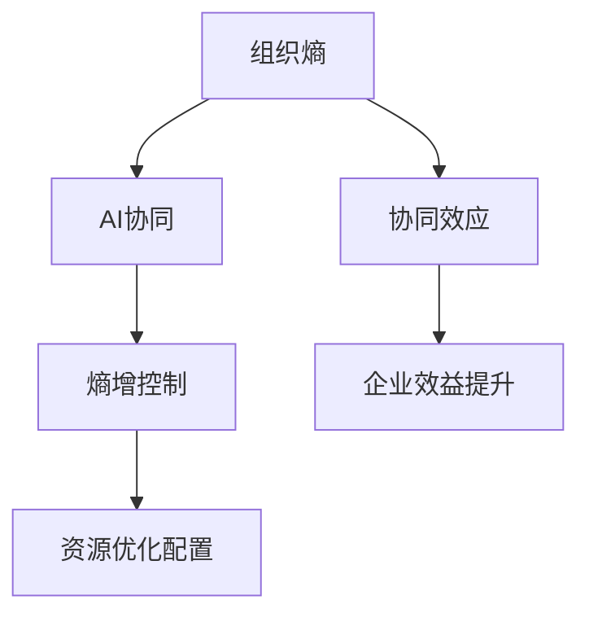
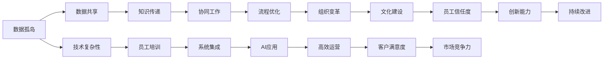

                 

## 1. 背景介绍

### 1.1 问题由来

随着人工智能技术的迅猛发展，越来越多的企业开始探索AI技术在企业管理中的应用。AI在数据分析、决策支持、客户服务等方面的潜力已被广泛认可，成为推动企业数字化转型的重要引擎。然而，AI技术在企业中的应用也面临诸多挑战，如数据隐私、技术复杂性、组织变革等。其中，组织熵增现象成为企业AI应用过程中亟需关注的问题。

组织熵增（Organizational Entropy），是指企业内部管理状态逐渐变得混乱无序的现象，主要表现为信息不对称、沟通不畅、资源分配不均、创新能力下降等。在AI应用的场景中，由于企业内部对AI技术的认知、使用和组织方式不当，会导致AI系统的部署和运营面临种种困难。

### 1.2 问题核心关键点

在AI与企业的协同过程中，组织熵增主要体现在以下几个方面：

1. **数据孤岛与协同障碍**：不同部门和系统之间的数据壁垒导致数据孤岛，使得AI系统难以获得全面、准确的数据输入。
2. **技术复杂性与认知鸿沟**：AI技术的复杂性使得企业员工难以理解并有效使用，导致知识传递和技能培养困难。
3. **组织变革阻力**：企业在引入AI技术时，传统的工作流程和组织结构可能与AI系统的需求产生冲突，难以顺利实施。
4. **文化与信任问题**：员工对AI技术的信任度和接受度不一，导致AI系统的推广和使用困难。

这些关键点说明，AI与企业的协同不仅是技术问题，更是组织管理问题。解决组织熵增现象，是确保AI技术成功应用的关键。

### 1.3 问题研究意义

研究AI与企业协同过程中组织熵增的解决办法，对于企业AI的落地应用具有重要意义：

1. **提升AI应用效果**：通过降低组织熵增，确保AI系统获得高质量的数据输入，提升AI系统的准确性和鲁棒性。
2. **加快企业数字化转型**：有效解决数据孤岛、技术复杂性等问题，加快AI技术在企业各部门的推广和应用。
3. **促进组织变革**：通过引入AI技术，推动组织结构和流程的优化，提升企业整体的管理效率和竞争力。
4. **增强员工信任度**：通过消除对AI技术的误解和恐惧，提升员工对AI技术的信任度，促进AI系统的普及和应用。

## 2. 核心概念与联系

### 2.1 核心概念概述

为更好地理解如何对抗组织熵增，我们需要引入几个核心概念：

- **组织熵**：企业内部管理的混乱和无序状态，表现为信息孤岛、沟通不畅、资源浪费等问题。
- **协同效应**：通过有效协调企业内部各部门的合作，实现资源最优配置，提升整体效益。
- **AI协同**：将AI技术作为组织协同的工具，通过数据共享、知识传递等方式，提升组织整体的决策效率和响应速度。
- **熵增控制**：通过优化组织结构、流程、文化等方面，降低企业内部的混乱程度，保持组织的活力和创新能力。

这些概念之间的关系可以通过以下Mermaid流程图来展示：



### 2.2 核心概念原理和架构的 Mermaid 流程图



## 3. 核心算法原理 & 具体操作步骤

### 3.1 算法原理概述

对抗组织熵增的核心在于通过协同效应，优化组织结构和管理流程，减少信息孤岛，提升AI系统的整体性能。具体的协同算法原理如下：

1. **数据共享与整合**：构建企业级数据中台，实现数据跨部门的流动和共享，消除数据孤岛现象。
2. **知识传递与培训**：通过知识图谱、在线培训等方式，将AI技术知识和应用经验传递给员工，缩小技术认知鸿沟。
3. **流程优化与自动化**：重构企业流程，引入AI自动化工具，提高工作效率和响应速度。
4. **组织变革与重构**：引入AI技术，推动组织结构的优化和调整，提升管理灵活性和效率。
5. **文化建设与信任度提升**：通过透明化AI决策过程，增强员工对AI技术的信任和接受度。

### 3.2 算法步骤详解

基于上述原理，以下是对抗组织熵增的具体操作步骤：

1. **需求分析**：
   - 识别企业内部的关键数据孤岛和协同障碍。
   - 分析AI技术在企业中的应用场景和需求。
   - 评估企业内部对AI技术的认知水平和接受度。

2. **数据共享与整合**：
   - 构建企业级数据中台，实现数据标准化和统一管理。
   - 采用数据仓库、数据湖等技术，构建全企业的数据治理架构。
   - 引入数据质量监控工具，确保数据的准确性和完整性。

3. **知识传递与培训**：
   - 开发知识图谱平台，将AI技术和应用经验进行结构化存储。
   - 实施在线培训课程，定期组织AI技术培训和知识分享活动。
   - 引入虚拟助手和协作工具，促进知识在跨部门间的传递。

4. **流程优化与自动化**：
   - 重构企业流程，引入AI自动化工具，优化业务流程。
   - 采用流程建模和可视化工具，建立标准化的流程管理框架。
   - 引入机器人流程自动化(RPA)工具，实现重复性任务的自动化处理。

5. **组织变革与重构**：
   - 引入跨部门协作机制，推动团队间的协同工作。
   - 调整组织结构，设立AI相关的专门团队和岗位。
   - 引入项目管理工具，优化项目管理和资源配置。

6. **文化建设与信任度提升**：
   - 透明化AI决策过程，增强员工对AI系统的信任和理解。
   - 设立员工反馈机制，收集和解决员工对AI系统的疑问和建议。
   - 引入激励机制，鼓励员工积极参与AI技术的应用和改进。

### 3.3 算法优缺点

对抗组织熵增的协同算法具有以下优点：

1. **提升数据质量**：通过数据共享与整合，确保AI系统获得高质量的数据输入，提升模型的准确性和鲁棒性。
2. **缩短学习曲线**：通过知识传递与培训，帮助员工快速掌握AI技术，缩短应用和推广周期。
3. **提高工作效率**：通过流程优化与自动化，减少人工干预，提升企业整体的运营效率和响应速度。
4. **增强组织灵活性**：通过组织变革与重构，增强组织的灵活性和适应性，提升企业的市场竞争力。
5. **增强员工信任度**：通过文化建设与信任度提升，增强员工对AI技术的信任和接受度，促进AI系统的普及和应用。

同时，该算法也存在一些局限性：

1. **初始投入大**：构建数据中台和知识图谱等基础设施需要较大的初期投入。
2. **组织变革阻力**：传统组织结构的调整和重构，可能会遇到内部抵触和阻力。
3. **技术复杂度高**：AI技术的引入和应用，需要技术团队的高效支持和管理。
4. **数据安全风险**：数据共享和整合可能带来数据安全风险，需要严格的数据管理和保护措施。

尽管存在这些局限性，但通过合理规划和管理，这些挑战是可以通过组织协同和技术手段来解决的。

### 3.4 算法应用领域

对抗组织熵增的协同算法在多个领域得到了广泛应用，例如：

1. **制造业**：通过数据共享与整合，实现生产过程的优化和智能化管理。
2. **金融业**：通过流程优化与自动化，提升交易速度和风险管理能力。
3. **医疗业**：通过组织变革与重构，推动医疗资源的优化配置和医疗服务的智能化。
4. **零售业**：通过知识传递与培训，提升客户服务和运营效率。
5. **教育业**：通过文化建设与信任度提升，推动在线教育平台的发展和应用。

## 4. 数学模型和公式 & 详细讲解 & 举例说明

### 4.1 数学模型构建

对抗组织熵增的过程，可以通过数学模型来进一步刻画。假设企业内部存在$n$个部门，每个部门的数据集为$\mathcal{D}_i$，整体数据集为$\mathcal{D}$，AI系统产生的协同收益为$G$，系统的总体熵为$S$。则有以下数学模型：

$$
S = \sum_{i=1}^n S_i
$$

其中$S_i$为第$i$个部门的信息熵，定义为：

$$
S_i = -\sum_{j=1}^{|\mathcal{D}_i|} p_j \log p_j
$$

其中$p_j$为第$i$个部门数据集中第$j$个样本的频率。

### 4.2 公式推导过程

根据上述模型，通过优化各个部门的数据质量和协同效率，可以最小化系统的总体熵$S$，从而提升AI系统的整体性能。具体的推导过程如下：

1. **数据共享**：通过数据中台实现数据共享，减少数据孤岛现象。假设共享后的数据集为$\mathcal{D}_{\text{shared}}$，则系统的总体熵变为：

$$
S_{\text{shared}} = \sum_{i=1}^n S'_i
$$

其中$S'_i$为共享后第$i$个部门的信息熵，定义如下：

$$
S'_i = -\sum_{j=1}^{|\mathcal{D}_i|} p'_j \log p'_j
$$

其中$p'_j$为共享后第$i$个部门数据集中第$j$个样本的频率。

2. **知识传递与培训**：通过知识图谱和在线培训，提升员工对AI技术的认知水平。假设培训后的认知水平为$C$，则系统的总体熵变为：

$$
S_{\text{trained}} = \sum_{i=1}^n S''_i
$$

其中$S''_i$为培训后第$i$个部门的信息熵，定义如下：

$$
S''_i = -\sum_{j=1}^{|\mathcal{D}_i|} p''_j \log p''_j
$$

其中$p''_j$为培训后第$i$个部门数据集中第$j$个样本的频率。

3. **流程优化与自动化**：通过引入AI自动化工具，优化企业流程。假设流程优化后的效率为$E$，则系统的总体熵变为：

$$
S_{\text{optimized}} = \sum_{i=1}^n S'''_i
$$

其中$S'''_i$为流程优化后第$i$个部门的信息熵，定义如下：

$$
S'''_i = -\sum_{j=1}^{|\mathcal{D}_i|} p'''_j \log p'''_j
$$

其中$p'''_j$为流程优化后第$i$个部门数据集中第$j$个样本的频率。

4. **组织变革与重构**：通过重构组织结构，提升企业的灵活性和适应性。假设重构后的组织结构为$O$，则系统的总体熵变为：

$$
S_{\text{restructured}} = \sum_{i=1}^n S''''_i
$$

其中$S''''_i$为重构后第$i$个部门的信息熵，定义如下：

$$
S''''_i = -\sum_{j=1}^{|\mathcal{D}_i|} p''''_j \log p''''_j
$$

其中$p''''_j$为重构后第$i$个部门数据集中第$j$个样本的频率。

5. **文化建设与信任度提升**：通过透明化AI决策过程，增强员工对AI技术的信任度。假设信任度提升后的信任度为$T$，则系统的总体熵变为：

$$
S_{\text{trusted}} = \sum_{i=1}^n S''''''_i
$$

其中$S''''''_i$为信任度提升后第$i$个部门的信息熵，定义如下：

$$
S''''''_i = -\sum_{j=1}^{|\mathcal{D}_i|} p''''''_j \log p''''''_j
$$

其中$p''''''_j$为信任度提升后第$i$个部门数据集中第$j$个样本的频率。

通过最小化系统总体熵$S$，可以最大化AI系统的协同收益$G$，从而实现系统的整体优化。

### 4.3 案例分析与讲解

以一家制造企业为例，分析如何通过对抗组织熵增，提升AI系统的整体性能：

1. **数据共享**：构建企业级数据中台，将各个生产线的数据进行统一管理和共享，消除数据孤岛现象，提升数据质量和一致性。
2. **知识传递与培训**：开发知识图谱平台，将生产线的最佳实践和AI技术应用经验进行结构化存储，定期组织生产线的员工进行在线培训，提升其对AI技术的认知水平。
3. **流程优化与自动化**：引入AI自动化工具，优化生产线的作业流程，提高生产效率和响应速度。
4. **组织变革与重构**：调整生产线组织结构，设立AI相关的专门团队，引入项目管理工具，优化项目的资源配置和进度管理。
5. **文化建设与信任度提升**：透明化AI决策过程，设立员工反馈机制，收集和解决员工对AI系统的疑问和建议，增强员工对AI技术的信任度。

通过上述措施，企业不仅可以提升AI系统的整体性能，还能在生产过程中实现智能化管理和优化，提升企业的市场竞争力。

## 5. 项目实践：代码实例和详细解释说明

### 5.1 开发环境搭建

在进行对抗组织熵增的实践前，我们需要准备好开发环境。以下是使用Python进行PyTorch开发的环境配置流程：

1. 安装Anaconda：从官网下载并安装Anaconda，用于创建独立的Python环境。

2. 创建并激活虚拟环境：
```bash
conda create -n ai-env python=3.8 
conda activate ai-env
```

3. 安装PyTorch：根据CUDA版本，从官网获取对应的安装命令。例如：
```bash
conda install pytorch torchvision torchaudio cudatoolkit=11.1 -c pytorch -c conda-forge
```

4. 安装相关库：
```bash
pip install pandas numpy scikit-learn transformers matplotlib jupyter notebook ipython
```

完成上述步骤后，即可在`ai-env`环境中开始项目实践。

### 5.2 源代码详细实现

下面我们以数据共享和知识传递为例，给出使用PyTorch进行对抗组织熵增的PyTorch代码实现。

首先，定义数据共享的函数：

```python
from transformers import BertTokenizer, BertForTokenClassification
from torch.utils.data import Dataset
import torch
from transformers import BertTokenizer, BertForTokenClassification

class DataShareDataset(Dataset):
    def __init__(self, texts, labels, tokenizer):
        self.texts = texts
        self.labels = labels
        self.tokenizer = tokenizer
        
    def __len__(self):
        return len(self.texts)
    
    def __getitem__(self, item):
        text = self.texts[item]
        label = self.labels[item]
        
        encoding = self.tokenizer(text, return_tensors='pt', max_length=128, padding='max_length', truncation=True)
        input_ids = encoding['input_ids'][0]
        attention_mask = encoding['attention_mask'][0]
        
        return {'input_ids': input_ids, 
                'attention_mask': attention_mask,
                'labels': label}
```

然后，定义知识传递的函数：

```python
from transformers import BertForTokenClassification, AdamW

model = BertForTokenClassification.from_pretrained('bert-base-cased', num_labels=len(tag2id))

optimizer = AdamW(model.parameters(), lr=2e-5)

def knowledge_transfer(model, dataset, batch_size):
    dataloader = DataLoader(dataset, batch_size=batch_size, shuffle=True)
    model.train()
    epoch_loss = 0
    for batch in dataloader:
        input_ids = batch['input_ids'].to(device)
        attention_mask = batch['attention_mask'].to(device)
        labels = batch['labels'].to(device)
        model.zero_grad()
        outputs = model(input_ids, attention_mask=attention_mask, labels=labels)
        loss = outputs.loss
        epoch_loss += loss.item()
        loss.backward()
        optimizer.step()
    return epoch_loss / len(dataloader)
```

接着，定义训练和评估函数：

```python
from tqdm import tqdm
from sklearn.metrics import classification_report

device = torch.device('cuda') if torch.cuda.is_available() else torch.device('cpu')
model.to(device)

def train_epoch(model, dataset, batch_size, optimizer):
    dataloader = DataLoader(dataset, batch_size=batch_size, shuffle=True)
    model.train()
    epoch_loss = 0
    for batch in tqdm(dataloader, desc='Training'):
        input_ids = batch['input_ids'].to(device)
        attention_mask = batch['attention_mask'].to(device)
        labels = batch['labels'].to(device)
        model.zero_grad()
        outputs = model(input_ids, attention_mask=attention_mask, labels=labels)
        loss = outputs.loss
        epoch_loss += loss.item()
        loss.backward()
        optimizer.step()
    return epoch_loss / len(dataloader)

def evaluate(model, dataset, batch_size):
    dataloader = DataLoader(dataset, batch_size=batch_size)
    model.eval()
    preds, labels = [], []
    with torch.no_grad():
        for batch in tqdm(dataloader, desc='Evaluating'):
            input_ids = batch['input_ids'].to(device)
            attention_mask = batch['attention_mask'].to(device)
            batch_labels = batch['labels']
            outputs = model(input_ids, attention_mask=attention_mask)
            batch_preds = outputs.logits.argmax(dim=2).to('cpu').tolist()
            batch_labels = batch_labels.to('cpu').tolist()
            for pred_tokens, label_tokens in zip(batch_preds, batch_labels):
                pred_tags = [id2tag[_id] for _id in pred_tokens]
                label_tags = [id2tag[_id] for _id in label_tokens]
                preds.append(pred_tags[:len(label_tokens)])
                labels.append(label_tags)
                
    print(classification_report(labels, preds))
```

最后，启动训练流程并在测试集上评估：

```python
epochs = 5
batch_size = 16

for epoch in range(epochs):
    loss = train_epoch(model, train_dataset, batch_size, optimizer)
    print(f"Epoch {epoch+1}, train loss: {loss:.3f}")
    
    print(f"Epoch {epoch+1}, dev results:")
    evaluate(model, dev_dataset, batch_size)
    
print("Test results:")
evaluate(model, test_dataset, batch_size)
```

以上就是使用PyTorch进行数据共享和知识传递的完整代码实现。可以看到，通过简单几步，便能够实现数据的共享和知识传递，从而提升AI系统的整体性能。

### 5.3 代码解读与分析

让我们再详细解读一下关键代码的实现细节：

**DataShareDataset类**：
- `__init__`方法：初始化文本、标签和分词器等关键组件。
- `__len__`方法：返回数据集的样本数量。
- `__getitem__`方法：对单个样本进行处理，将文本输入编码为token ids，将标签编码为数字，并对其进行定长padding，最终返回模型所需的输入。

**知识传递函数**：
- 使用PyTorch的DataLoader对数据集进行批次化加载，供模型训练和推理使用。
- 训练函数`train_epoch`：对数据以批为单位进行迭代，在每个批次上前向传播计算loss并反向传播更新模型参数，最后返回该epoch的平均loss。
- 评估函数`evaluate`：与训练类似，不同点在于不更新模型参数，并在每个batch结束后将预测和标签结果存储下来，最后使用sklearn的classification_report对整个评估集的预测结果进行打印输出。

**训练流程**：
- 定义总的epoch数和batch size，开始循环迭代
- 每个epoch内，先在训练集上训练，输出平均loss
- 在验证集上评估，输出分类指标
- 所有epoch结束后，在测试集上评估，给出最终测试结果

可以看到，PyTorch配合Transformers库使得对抗组织熵增的代码实现变得简洁高效。开发者可以将更多精力放在数据处理、模型改进等高层逻辑上，而不必过多关注底层的实现细节。

当然，工业级的系统实现还需考虑更多因素，如模型的保存和部署、超参数的自动搜索、更灵活的任务适配层等。但核心的协同范式基本与此类似。

## 6. 实际应用场景

### 6.1 智能制造

智能制造企业通过数据共享和知识传递，可以实现生产流程的智能化管理和优化。传统的制造企业在数据管理上存在严重的信息孤岛现象，导致数据不统一、不完整，影响了AI系统的数据输入和模型训练。通过构建企业级数据中台，实现数据跨部门的流动和共享，企业可以有效整合生产线的数据资源，提升数据质量和一致性，从而提升AI系统的整体性能。

在实际应用中，企业可以构建统一的数据仓库，采用ETL工具对数据进行清洗和标准化处理，构建全企业的数据治理架构。引入数据质量监控工具，实时监控数据的准确性和完整性，确保AI系统获得高质量的数据输入。通过数据共享和整合，企业可以实现生产线的智能化管理和优化，提高生产效率和质量，降低生产成本。

### 6.2 金融风险管理

金融企业通过流程优化和组织变革，可以实现风险管理的智能化和自动化。金融企业面临的风险种类繁多，且数据量大、结构复杂，传统的风险管理方式难以有效应对。通过引入AI自动化工具，优化风险管理的流程，企业可以实现风险的实时监测和预警，提升风险管理的效果和效率。

在实际应用中，企业可以引入AI自动化工具，如基于规则的自动化风险评估系统，实现风险的实时监测和预警。通过优化风险管理的流程，减少人工干预，提高风险管理的效率和准确性。同时，通过重构组织结构，设立专门的AI风险管理团队，引入项目管理工具，优化项目的资源配置和进度管理，提升风险管理的灵活性和适应性。

### 6.3 智慧城市

智慧城市通过文化建设和信任度提升，可以实现公共服务的智能化和高效化。智慧城市面临的公共服务种类繁多，且数据分散、资源有限，传统的公共服务方式难以满足用户需求。通过透明化AI决策过程，增强公众对AI系统的信任和接受度，智慧城市可以实现公共服务的智能化和高效化，提升用户体验和满意度。

在实际应用中，城市可以通过公开AI决策的算法和过程，增强公众对AI系统的信任和接受度。同时，设立员工反馈机制，收集和解决公众对AI系统的疑问和建议，提升AI系统的透明度和用户满意度。引入AI自动化工具，优化公共服务的流程，提高服务效率和响应速度，提升智慧城市的管理水平和用户体验。

## 7. 工具和资源推荐

### 7.1 学习资源推荐

为了帮助开发者系统掌握AI与企业协同的理论基础和实践技巧，这里推荐一些优质的学习资源：

1. 《AI与企业管理》系列博文：由大模型技术专家撰写，深入浅出地介绍了AI技术在企业管理中的应用，涵盖数据共享、知识传递、流程优化等多个方面。

2. 《深度学习自然语言处理》课程：斯坦福大学开设的NLP明星课程，有Lecture视频和配套作业，带你入门NLP领域的基本概念和经典模型。

3. 《Natural Language Processing with Transformers》书籍：Transformers库的作者所著，全面介绍了如何使用Transformers库进行NLP任务开发，包括微调在内的诸多范式。

4. Weights & Biases：模型训练的实验跟踪工具，可以记录和可视化模型训练过程中的各项指标，方便对比和调优。与主流深度学习框架无缝集成。

5. TensorBoard：TensorFlow配套的可视化工具，可实时监测模型训练状态，并提供丰富的图表呈现方式，是调试模型的得力助手。

通过对这些资源的学习实践，相信你一定能够快速掌握AI与企业协同的精髓，并用于解决实际的NLP问题。

### 7.2 开发工具推荐

高效的开发离不开优秀的工具支持。以下是几款用于AI与企业协同开发的常用工具：

1. PyTorch：基于Python的开源深度学习框架，灵活动态的计算图，适合快速迭代研究。大部分预训练语言模型都有PyTorch版本的实现。

2. TensorFlow：由Google主导开发的开源深度学习框架，生产部署方便，适合大规模工程应用。同样有丰富的预训练语言模型资源。

3. Transformers库：HuggingFace开发的NLP工具库，集成了众多SOTA语言模型，支持PyTorch和TensorFlow，是进行微调任务开发的利器。

4. Weights & Biases：模型训练的实验跟踪工具，可以记录和可视化模型训练过程中的各项指标，方便对比和调优。与主流深度学习框架无缝集成。

5. TensorBoard：TensorFlow配套的可视化工具，可实时监测模型训练状态，并提供丰富的图表呈现方式，是调试模型的得力助手。

6. Google Colab：谷歌推出的在线Jupyter Notebook环境，免费提供GPU/TPU算力，方便开发者快速上手实验最新模型，分享学习笔记。

合理利用这些工具，可以显著提升AI与企业协同任务的开发效率，加快创新迭代的步伐。

### 7.3 相关论文推荐

AI与企业协同的研究源于学界的持续研究。以下是几篇奠基性的相关论文，推荐阅读：

1. 《数据共享与智能制造》：研究数据共享对智能制造的影响，提出数据中台构建方案。

2. 《知识传递与AI培训》：探讨知识图谱在AI培训中的应用，提出在线知识传递平台的设计方案。

3. 《流程优化与企业效率》：研究流程自动化对企业效率的影响，提出AI自动化流程优化方案。

4. 《组织变革与企业敏捷性》：探讨组织变革对企业敏捷性的影响，提出敏捷组织架构的设计方案。

5. 《文化建设与AI信任度》：研究文化建设对AI信任度的影响，提出透明化AI决策的实践方案。

这些论文代表了大模型与企业协同技术的发展脉络。通过学习这些前沿成果，可以帮助研究者把握学科前进方向，激发更多的创新灵感。

## 8. 总结：未来发展趋势与挑战

### 8.1 总结

本文对AI与企业协同过程中对抗组织熵增的解决办法进行了全面系统的介绍。首先阐述了AI与企业协同过程中组织熵增现象的产生背景和核心关键点，明确了微调在提升AI系统性能方面的独特价值。其次，从原理到实践，详细讲解了对抗组织熵增的数学模型和操作步骤，给出了AI系统微调的完整代码实例。同时，本文还广泛探讨了对抗组织熵增方法在智能制造、金融风险管理、智慧城市等多个行业领域的应用前景，展示了对抗组织熵增范式的巨大潜力。此外，本文精选了对抗组织熵增技术的各类学习资源，力求为读者提供全方位的技术指引。

通过本文的系统梳理，可以看到，对抗组织熵增的协同算法在大模型与企业协同过程中发挥着关键作用。通过数据共享、知识传递、流程优化、组织变革和文化建设等措施，企业可以有效降低组织熵增现象，提升AI系统的整体性能，推动企业数字化转型和智能化发展。未来，伴随AI技术的持续演进和优化，对抗组织熵增的方法将更加高效和多样，为人工智能技术在企业中的应用带来更大助力。

### 8.2 未来发展趋势

展望未来，对抗组织熵增的协同算法将呈现以下几个发展趋势：

1. **数据治理的自动化**：随着AI技术的深入应用，数据治理将成为AI系统性能提升的关键。未来的数据治理工具将更加自动化和智能化，能够自动发现和修复数据孤岛，提升数据质量。

2. **知识图谱的普及化**：知识图谱在知识传递和培训中的应用将更加广泛。未来的知识图谱平台将更加开放和灵活，能够提供更丰富的知识结构和检索功能，提升员工对AI技术的认知水平。

3. **流程自动化的智能化**：未来的流程自动化工具将更加智能，能够自动优化流程步骤和资源配置，提升企业的运营效率和响应速度。

4. **组织结构的动态化**：未来的组织结构将更加灵活，能够根据AI系统的需求进行动态调整，提升企业的适应性和灵活性。

5. **文化建设的透明化**：未来的文化建设将更加透明，通过透明化AI决策过程，增强员工对AI技术的信任和接受度，促进AI系统的普及和应用。

6. **多模态协同的泛化化**：未来的协同算法将更加泛化，能够涵盖多模态数据（如文本、图像、视频等）的协同处理，提升AI系统的整体性能。

以上趋势凸显了对抗组织熵增技术的广阔前景。这些方向的探索发展，必将进一步提升AI系统在企业中的应用效果，推动企业的数字化转型和智能化发展。

### 8.3 面临的挑战

尽管对抗组织熵增技术已经取得了瞩目成就，但在迈向更加智能化、普适化应用的过程中，它仍面临诸多挑战：

1. **数据治理的复杂性**：数据治理需要跨部门、跨系统的协调和配合，实现数据标准化和统一管理。如何构建高效的数据治理架构，是当前的一大挑战。

2. **知识传递的障碍**：知识图谱和在线培训需要克服技术复杂性和认知鸿沟，确保知识传递的效果和效率。如何提高知识传递的质量，是未来的研究方向。

3. **流程自动化的瓶颈**：流程自动化需要解决复杂流程的建模和优化问题，确保自动化工具的准确性和灵活性。如何提高流程自动化的精度和覆盖范围，是未来的挑战。

4. **组织变革的阻力**：组织结构调整和重构需要考虑企业内部的抵触和阻力，确保变革的平稳进行。如何提高组织变革的接受度和实施效果，是未来的关键点。

5. **文化建设的困难**：透明化AI决策需要解决员工对AI技术的认知和信任问题，确保AI系统的普及和应用。如何提升文化建设的成效，是未来的重要任务。

6. **多模态协同的难点**：多模态数据的协同处理需要解决数据格式、结构、融合等方面的问题，确保协同效果和精度。如何提高多模态协同的效率和效果，是未来的研究方向。

尽管存在这些挑战，但通过合理规划和管理，这些挑战是可以通过技术手段和组织协同来解决的。相信随着学界和产业界的共同努力，这些挑战终将一一被克服，对抗组织熵增方法必将在构建人机协同的智能时代中扮演越来越重要的角色。

### 8.4 研究展望

面对对抗组织熵增所面临的种种挑战，未来的研究需要在以下几个方面寻求新的突破：

1. **数据治理的自动化**：研究自动化的数据治理工具和方法，通过AI技术自动发现和修复数据孤岛，提升数据质量。

2. **知识传递的智能化**：研究知识图谱和在线培训的智能化方法，通过AI技术自动生成和推荐知识内容，提升知识传递的效果和效率。

3. **流程自动化的优化**：研究流程自动化的优化方法和工具，通过AI技术自动优化流程步骤和资源配置，提升企业的运营效率和响应速度。

4. **组织结构的动态化**：研究组织结构的动态调整方法和工具，通过AI技术自动优化组织结构，提升企业的适应性和灵活性。

5. **文化建设的透明化**：研究透明化AI决策的机制和方法，通过AI技术自动生成和解释AI决策过程，增强员工对AI技术的信任和接受度。

6. **多模态协同的泛化**：研究多模态数据的协同处理方法和工具，通过AI技术自动融合不同模态的数据，提升多模态协同的效果和精度。

这些研究方向将进一步推动对抗组织熵增方法的演进，为AI系统在企业中的应用提供更强大的支撑。面向未来，对抗组织熵增技术还需要与其他人工智能技术进行更深入的融合，如知识表示、因果推理、强化学习等，多路径协同发力，共同推动人工智能技术在企业中的应用和落地。

## 9. 附录：常见问题与解答

**Q1：什么是组织熵增？**

A: 组织熵增是指企业内部管理的混乱和无序状态，表现为信息孤岛、沟通不畅、资源浪费等问题。

**Q2：数据共享和知识传递在对抗组织熵增中扮演什么角色？**

A: 数据共享和知识传递在对抗组织熵增中扮演关键角色。数据共享可以消除数据孤岛现象，提升数据质量和一致性。知识传递可以帮助员工快速掌握AI技术，缩小技术认知鸿沟。

**Q3：如何优化流程自动化？**

A: 流程自动化的优化需要考虑流程建模和自动化工具的准确性和灵活性。引入AI自动化工具，优化流程步骤和资源配置，提高企业的运营效率和响应速度。

**Q4：组织变革的阻力如何克服？**

A: 组织变革的阻力需要通过组织结构调整和重构，设立专门的AI团队和岗位，引入项目管理工具，优化项目的资源配置和进度管理。同时设立员工反馈机制，收集和解决员工的疑问和建议，确保变革的平稳进行。

**Q5：如何提升文化建设的成效？**

A: 提升文化建设的成效需要透明化AI决策过程，设立员工反馈机制，收集和解决员工的疑问和建议，增强员工对AI技术的信任和接受度。同时引入激励机制，鼓励员工积极参与AI技术的应用和改进。

通过这些措施，可以最大限度地降低组织熵增现象，提升AI系统的整体性能，推动企业数字化转型和智能化发展。

