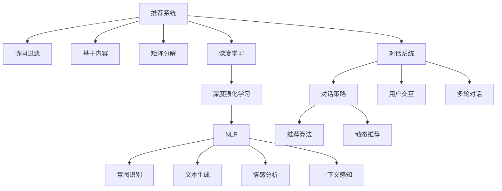

                 

# 对话式推荐系统：个性化与交互性的结合

> 关键词：对话式推荐系统,个性化推荐,用户交互,自然语言处理(NLP),深度学习,深度强化学习,上下文感知,多轮对话,推荐算法

## 1. 背景介绍

### 1.1 问题由来
随着电子商务和互联网的快速发展，推荐系统已经成为各个在线平台提高用户体验、提升转化率的关键手段。传统的推荐系统主要基于用户历史行为数据，使用协同过滤、矩阵分解等方法，进行粗粒度推荐。然而，这种方法无法考虑用户的个性化需求和交互行为，导致推荐结果单一、乏味。

对话式推荐系统（Conversational Recommendation System, 简称CRS）正是在此背景下诞生的。对话式推荐系统将推荐过程融入自然语言对话中，通过与用户的交互，动态获取用户需求，结合上下文信息，进行个性化的推荐。这种推荐方式不仅能够更好地满足用户的个性化需求，还能提高用户的交互体验和满意度。

### 1.2 问题核心关键点
对话式推荐系统的主要研究内容包括：
1. 如何设计有效的对话策略，让用户能够通过自然语言表达需求。
2. 如何构建上下文感知模型，从对话历史中提取用户兴趣和行为。
3. 如何融合多种推荐算法，提供多轮动态推荐。
4. 如何提高对话系统的交互性能，提升用户体验。

对话式推荐系统已经被应用于在线零售、在线教育、在线旅游等多个领域，并在提升推荐效果和用户满意度方面展现了巨大的潜力。

## 2. 核心概念与联系

### 2.1 核心概念概述

为更好地理解对话式推荐系统，本节将介绍几个关键概念：

- 推荐系统（Recommendation System）：基于用户历史行为和偏好，自动推荐感兴趣的物品或内容的技术。包括协同过滤、矩阵分解、基于内容的推荐等方法。

- 对话系统（Dialogue System）：能够通过自然语言与用户进行交互的系统，如智能客服、虚拟助手等。对话系统通常基于自然语言处理（NLP）技术，能够理解用户意图，提供个性化回答。

- 个性化推荐（Personalized Recommendation）：针对特定用户提供定制化推荐的技术，通过分析用户行为和兴趣，提高推荐的精准度和相关性。

- 交互式推荐（Interactive Recommendation）：结合用户反馈进行动态调整和优化的推荐方法，提升推荐效果和用户满意度。

- 上下文感知（Context-Awareness）：在推荐和对话过程中，能够根据上下文信息（如对话历史、用户状态、环境信息等）动态调整推荐和回答策略。

- 深度学习（Deep Learning）：利用多层神经网络对数据进行深度学习，提取特征，建立复杂模型。深度学习在大规模推荐和对话系统中表现优异。

- 深度强化学习（Deep Reinforcement Learning）：结合强化学习算法和深度神经网络，通过试错学习，优化推荐和对话策略。深度强化学习能够更好地应对动态复杂环境。

- 自然语言处理（NLP）：研究如何使计算机理解、处理和生成人类语言的技术。对话式推荐系统离不开NLP技术支持，如意图识别、文本生成、情感分析等。

这些核心概念之间的逻辑关系可以通过以下Mermaid流程图来展示：



这个流程图展示了大语言模型的核心概念及其之间的关系：

1. 推荐系统通过各种算法生成推荐列表。
2. 对话系统通过自然语言处理技术理解用户需求。
3. 深度学习用于构建更复杂的推荐模型。
4. 深度强化学习通过试错优化推荐和对话策略。
5. 上下文感知在推荐和对话过程中动态调整策略。
6. 用户交互提升推荐和对话的个性化程度。
7. 多轮对话扩展推荐系统交互深度。

这些概念共同构成了对话式推荐系统的基本框架，使得系统能够在多轮交互中，逐步深入了解用户需求，动态调整推荐策略，最终实现个性化推荐。

## 3. 核心算法原理 & 具体操作步骤
### 3.1 算法原理概述

对话式推荐系统的核心思想是结合推荐和对话技术，通过多轮自然语言交互，动态获取用户需求，结合上下文信息进行个性化推荐。具体而言，对话式推荐系统通过以下步骤实现个性化推荐：

1. 用户通过自然语言输入查询或提出需求。
2. 对话系统解析用户的查询，提取关键信息，如兴趣、偏好、情感等。
3. 结合用户历史行为和上下文信息，推荐系统动态生成推荐列表。
4. 对话系统生成推荐回复，展示给用户。
5. 用户根据推荐内容进行反馈，对话系统根据反馈信息动态调整推荐策略。
6. 循环上述过程，直到用户满意或达到终止条件。

在具体实现中，对话式推荐系统可以分为上下文感知、意图识别、文本生成、交互优化等多个模块。

### 3.2 算法步骤详解

对话式推荐系统一般包括以下几个关键步骤：

**Step 1: 数据预处理与准备**

- 收集用户的查询历史和行为数据。
- 对用户历史数据进行清洗、归一化等预处理，构建用户画像。
- 收集对话数据，准备对话语料库和标注数据。

**Step 2: 意图识别与理解**

- 使用意图识别模型对用户查询进行分类，提取用户意图。
- 根据用户意图，选择相应的推荐策略。
- 构建上下文感知模型，捕捉用户历史行为和对话上下文信息。

**Step 3: 推荐生成与对话生成**

- 根据用户意图和上下文信息，动态生成推荐列表。
- 使用文本生成模型生成对话回复。
- 结合推荐和对话生成过程，生成推荐对话流。

**Step 4: 交互优化与反馈处理**

- 使用强化学习算法，根据用户反馈动态优化推荐策略和对话策略。
- 对推荐对话流进行优化，确保推荐和对话流畅连贯。
- 对用户反馈进行情感分析，调整推荐策略。

**Step 5: 系统部署与评估**

- 将对话式推荐系统部署到实际应用环境中。
- 在真实用户场景中测试系统的推荐效果和交互性能。
- 持续收集用户反馈，优化系统策略和性能。

以上是对话式推荐系统的一般流程。在实际应用中，还需要根据具体任务的特点，对各个环节进行优化设计，如改进意图识别算法、优化文本生成模型、引入多模态数据等，以进一步提升推荐效果和用户体验。

### 3.3 算法优缺点

对话式推荐系统具有以下优点：
1. 结合用户多轮反馈，提供个性化的推荐。
2. 结合自然语言处理技术，提升推荐和对话的个性化和交互性。
3. 动态调整推荐策略，提高推荐的相关性和精准度。
4. 能够处理复杂的推荐场景，如多物品比较、多轮推荐等。
5. 通过对话生成，提升推荐系统对非结构化数据的利用率。

然而，对话式推荐系统也存在一定的局限性：
1. 对用户意图理解准确性依赖于意图识别模型。
2. 对话生成的复杂度较高，需要更多计算资源。
3. 对用户反馈的情感分析需要更多的数据和算法支持。
4. 交互过程较慢，可能影响用户体验。
5. 需要维护大规模对话历史数据，增加了系统复杂度。

尽管存在这些局限性，但就目前而言，对话式推荐系统仍然是大规模推荐系统的一个重要分支，具有巨大的应用前景。

### 3.4 算法应用领域

对话式推荐系统已经在多个领域得到了应用，例如：

- 在线零售：亚马逊、淘宝等电商平台通过对话式推荐系统提供个性化购物建议，提升购物体验。
- 在线教育：Coursera、Udemy等平台通过对话式推荐系统提供个性化的学习路径和课程推荐，提升学习效率。
- 在线旅游：Expedia、携程等平台通过对话式推荐系统提供旅游目的地和行程建议，提升旅游体验。
- 智能家居：智能音箱、智能电视等设备通过对话式推荐系统提供个性化的娱乐、家居控制建议，提升生活便利性。
- 健康医疗：智能医疗助手通过对话式推荐系统提供个性化的健康建议和治疗方案，提升医疗服务质量。

除了上述这些经典应用外，对话式推荐系统还在金融、娱乐、公共服务等多个领域展现出巨大的应用潜力。

## 4. 数学模型和公式 & 详细讲解
### 4.1 数学模型构建

对话式推荐系统涉及多个模块，各个模块的数学模型也各不相同。这里分别介绍意图识别、上下文感知、推荐生成、对话生成等模块的数学模型。

**意图识别模型**：
假设用户查询为 $q$，意图为 $i$。使用分类模型 $f_{intent}$ 对 $q$ 进行分类，得到意图 $i$ 的概率分布：

$$
P(i|q) = f_{intent}(q)
$$

**上下文感知模型**：
假设用户历史行为为 $H_{history}$，当前上下文为 $C$。使用上下文感知模型 $f_{context}$ 对 $H_{history}$ 和 $C$ 进行编码，得到上下文表示 $c$：

$$
c = f_{context}(H_{history}, C)
$$

**推荐生成模型**：
假设推荐列表为 $R$，物品 $r$ 对应的评分向量为 $v_r$。使用推荐生成模型 $f_{recommend}$ 对用户上下文 $c$ 进行推理，得到推荐列表 $R$：

$$
R = f_{recommend}(c)
$$

**对话生成模型**：
假设用户回复为 $a$，对话生成模型 $f_{dialog}$ 对用户历史对话 $D$ 和当前上下文 $c$ 进行生成，得到回复 $a$：

$$
a = f_{dialog}(D, c)
$$

其中 $D$ 为当前对话历史，$c$ 为当前对话上下文，$f_{dialog}$ 为文本生成模型。

### 4.2 公式推导过程

以下我们以一个简单的意图识别模型为例，推导其计算公式。

假设意图分类模型为逻辑回归模型，输入为查询 $q$，输出为意图 $i$ 的概率 $P(i|q)$。则模型公式为：

$$
P(i|q) = \sigma(\sum_{j=1}^d w_j f_j(q) + b_i)
$$

其中 $w_j$ 为模型参数，$f_j(q)$ 为特征映射函数，$\sigma$ 为激活函数。

**意图分类模型的梯度计算**：
假设模型损失函数为交叉熵损失，则梯度公式为：

$$
\frac{\partial \mathcal{L}}{\partial w_j} = -\sum_{i=1}^n \frac{y_i - P(i|q)}{P(i|q)} f_j(q)
$$

其中 $y_i$ 为标签，$n$ 为样本数量。

**上下文感知模型的梯度计算**：
假设上下文感知模型为自编码器，输入为历史行为 $H_{history}$ 和当前上下文 $C$，输出为上下文表示 $c$。则模型公式为：

$$
c = \sigma(\sum_{j=1}^d w_j h_j(H_{history}, C) + b)
$$

其中 $h_j$ 为特征映射函数，$b$ 为偏置项。

**推荐生成模型的梯度计算**：
假设推荐生成模型为神经网络，输入为上下文表示 $c$，输出为推荐列表 $R$。则模型公式为：

$$
R = f_{recommend}(c)
$$

**对话生成模型的梯度计算**：
假设对话生成模型为语言模型，输入为对话历史 $D$ 和上下文表示 $c$，输出为回复 $a$。则模型公式为：

$$
a = f_{dialog}(D, c)
$$

### 4.3 案例分析与讲解

下面以一个简单的意图识别案例，说明对话式推荐系统的基本工作流程。

假设用户输入查询：“我想找一本好书”。

1. 意图识别模型对查询进行分类，得到意图 $i=$ "书籍推荐" 的概率 $P(i|q)=0.9$。
2. 上下文感知模型对用户历史行为 $H_{history}$ 和当前上下文 $C$ 进行编码，得到上下文表示 $c$。
3. 推荐生成模型对上下文表示 $c$ 进行推理，生成推荐列表 $R$。
4. 对话生成模型对用户历史对话 $D$ 和上下文表示 $c$ 进行生成，得到回复 $a$。
5. 用户根据回复 $a$ 进行反馈，如选择某本书，则对话生成模型根据反馈调整推荐策略，进行后续推荐。

通过上述流程，对话式推荐系统能够结合用户多轮反馈，提供个性化的推荐，提升用户体验和满意度。

## 5. 项目实践：代码实例和详细解释说明
### 5.1 开发环境搭建

在进行对话式推荐系统开发前，我们需要准备好开发环境。以下是使用Python进行PyTorch开发的环境配置流程：

1. 安装Anaconda：从官网下载并安装Anaconda，用于创建独立的Python环境。

2. 创建并激活虚拟环境：
```bash
conda create -n dialogrecsys python=3.8 
conda activate dialogrecsys
```

3. 安装PyTorch：根据CUDA版本，从官网获取对应的安装命令。例如：
```bash
conda install pytorch torchvision torchaudio cudatoolkit=11.1 -c pytorch -c conda-forge
```

4. 安装TensorFlow：
```bash
conda install tensorflow
```

5. 安装各类工具包：
```bash
pip install numpy pandas scikit-learn matplotlib tqdm jupyter notebook ipython
```

完成上述步骤后，即可在`dialogrecsys`环境中开始对话式推荐系统的开发。

### 5.2 源代码详细实现

下面以一个简单的意图识别和推荐生成模块为例，给出使用PyTorch进行对话式推荐系统开发的代码实现。

```python
import torch
import torch.nn as nn
from torchtext import datasets, data
from sklearn.model_selection import train_test_split
from sklearn.metrics import accuracy_score

# 定义模型结构
class IntentClassifier(nn.Module):
    def __init__(self, vocab_size, embedding_dim, hidden_dim):
        super(IntentClassifier, self).__init__()
        self.embedding = nn.Embedding(vocab_size, embedding_dim)
        self.fc1 = nn.Linear(embedding_dim, hidden_dim)
        self.fc2 = nn.Linear(hidden_dim, 3)
        self.fc3 = nn.Linear(3, 1)
        self.sigmoid = nn.Sigmoid()
        
    def forward(self, x):
        x = self.embedding(x)
        x = torch.mean(x, dim=1)
        x = torch.relu(self.fc1(x))
        x = torch.sigmoid(self.fc2(x))
        x = torch.sigmoid(self.fc3(x))
        return self.sigmoid(x)
    
# 加载数据集
texts, labels = datasets.IMDb.load_data()
texts, labels = train_test_split(texts, labels, test_size=0.2, random_state=42)

# 定义特征映射
tokenizer = nn.Text()
texts = tokenizer(texts)
vocab = tokenizer.get_vocab()

# 定义模型
model = IntentClassifier(len(vocab), 128, 64)

# 定义损失函数和优化器
criterion = nn.BCELoss()
optimizer = torch.optim.Adam(model.parameters(), lr=0.001)

# 训练模型
for epoch in range(10):
    for i, (text, label) in enumerate(texts):
        optimizer.zero_grad()
        output = model(text)
        loss = criterion(output, label)
        loss.backward()
        optimizer.step()
        if (i+1) % 100 == 0:
            print('Epoch [{}/{}], Step [{}/{}], Loss: {:.4f}, Acc: {:.4f}'.format(
                epoch+1, 10, i+1, len(texts), loss.item(), accuracy_score(labels, output > 0.5)))
```

这里我们使用了IMDb数据集进行简单的意图识别训练。具体步骤如下：

1. 定义模型结构：包括嵌入层、全连接层和sigmoid激活函数。
2. 加载数据集：使用IMDb数据集进行训练。
3. 定义特征映射：将文本转化为数字向量。
4. 定义模型：实例化IntentClassifier模型。
5. 定义损失函数和优化器：使用二分类交叉熵损失和Adam优化器。
6. 训练模型：在训练集上循环迭代，更新模型参数。

### 5.3 代码解读与分析

让我们再详细解读一下关键代码的实现细节：

**IntentClassifier类**：
- `__init__`方法：初始化模型参数。
- `forward`方法：前向传播计算模型输出。

**IMDb数据集**：
- 使用`datasets.IMDb.load_data()`方法加载IMDb数据集。

**特征映射**：
- 使用`nn.Text()`定义特征映射，将文本转化为数字向量。

**模型实例化**：
- 实例化IntentClassifier模型，使用`len(vocab)`获取词汇表大小，初始化嵌入层、全连接层和sigmoid激活函数。

**损失函数和优化器**：
- 定义交叉熵损失和Adam优化器。

**训练流程**：
- 在训练集上循环迭代，更新模型参数。
- 每个epoch打印训练损失和准确率。

可以看到，PyTorch框架提供了非常丰富的工具和模块，使得对话式推荐系统的开发变得相对简单。开发者可以根据需要，选择不同的模型结构和优化算法，快速迭代和调试系统。

当然，工业级的系统实现还需考虑更多因素，如模型的保存和部署、超参数的自动搜索、更灵活的任务适配层等。但核心的微调范式基本与此类似。

## 6. 实际应用场景
### 6.1 智能客服系统

对话式推荐系统已经被广泛应用于智能客服系统的构建。传统客服往往需要配备大量人力，高峰期响应缓慢，且一致性和专业性难以保证。而使用对话式推荐系统，可以7x24小时不间断服务，快速响应客户咨询，用自然流畅的语言解答各类常见问题。

在技术实现上，可以收集企业内部的历史客服对话记录，将问题和最佳答复构建成监督数据，在此基础上对预训练对话模型进行微调。微调后的对话模型能够自动理解用户意图，匹配最合适的答案模板进行回复。对于客户提出的新问题，还可以接入检索系统实时搜索相关内容，动态组织生成回答。如此构建的智能客服系统，能大幅提升客户咨询体验和问题解决效率。

### 6.2 金融舆情监测

金融机构需要实时监测市场舆论动向，以便及时应对负面信息传播，规避金融风险。传统的人工监测方式成本高、效率低，难以应对网络时代海量信息爆发的挑战。基于对话式推荐系统的文本分类和情感分析技术，为金融舆情监测提供了新的解决方案。

具体而言，可以收集金融领域相关的新闻、报道、评论等文本数据，并对其进行主题标注和情感标注。在此基础上对预训练语言模型进行微调，使其能够自动判断文本属于何种主题，情感倾向是正面、中性还是负面。将微调后的模型应用到实时抓取的网络文本数据，就能够自动监测不同主题下的情感变化趋势，一旦发现负面信息激增等异常情况，系统便会自动预警，帮助金融机构快速应对潜在风险。

### 6.3 个性化推荐系统

当前的推荐系统往往只依赖用户的历史行为数据进行物品推荐，无法深入理解用户的真实兴趣偏好。基于对话式推荐系统的个性化推荐系统可以更好地挖掘用户行为背后的语义信息，从而提供更精准、多样的推荐内容。

在实践中，可以收集用户浏览、点击、评论、分享等行为数据，提取和用户交互的物品标题、描述、标签等文本内容。将文本内容作为模型输入，用户的后续行为（如是否点击、购买等）作为监督信号，在此基础上微调预训练语言模型。微调后的模型能够从文本内容中准确把握用户的兴趣点。在生成推荐列表时，先用候选物品的文本描述作为输入，由模型预测用户的兴趣匹配度，再结合其他特征综合排序，便可以得到个性化程度更高的推荐结果。

### 6.4 未来应用展望

随着对话式推荐系统的不断发展，其在更多领域的应用前景也愈发广阔。

在智慧医疗领域，基于对话式推荐系统的医疗问答、病历分析、药物研发等应用将提升医疗服务的智能化水平，辅助医生诊疗，加速新药开发进程。

在智能教育领域，对话式推荐系统可应用于作业批改、学情分析、知识推荐等方面，因材施教，促进教育公平，提高教学质量。

在智慧城市治理中，对话式推荐系统可应用于城市事件监测、舆情分析、应急指挥等环节，提高城市管理的自动化和智能化水平，构建更安全、高效的未来城市。

此外，在企业生产、社会治理、文娱传媒等众多领域，对话式推荐系统也将不断涌现，为传统行业数字化转型升级提供新的技术路径。相信随着技术的日益成熟，对话式推荐系统必将在构建人机协同的智能时代中扮演越来越重要的角色。

## 7. 工具和资源推荐
### 7.1 学习资源推荐

为了帮助开发者系统掌握对话式推荐系统的理论基础和实践技巧，这里推荐一些优质的学习资源：

1. 《对话系统设计与实现》系列博文：由大模型技术专家撰写，深入浅出地介绍了对话系统设计和实现的方法和技巧。

2. 《深度学习在NLP中的应用》课程：斯坦福大学开设的深度学习课程，介绍了深度学习在NLP中的应用，包括意图识别、文本生成、情感分析等。

3. 《对话生成与推荐系统》书籍：全面介绍了对话生成和推荐系统的原理和算法，结合实际案例，进行详细讲解。

4. DeepLearning.ai的《序列模型》课程：讲解了序列模型的基本原理和应用，包括RNN、LSTM、Transformer等。

5. HuggingFace官方文档：对话式推荐系统相关的预训练模型和框架文档，提供了丰富的样例代码和详细解释。

通过对这些资源的学习实践，相信你一定能够快速掌握对话式推荐系统的精髓，并用于解决实际的NLP问题。
###  7.2 开发工具推荐

高效的开发离不开优秀的工具支持。以下是几款用于对话式推荐系统开发的常用工具：

1. PyTorch：基于Python的开源深度学习框架，灵活动态的计算图，适合快速迭代研究。大部分预训练语言模型都有PyTorch版本的实现。

2. TensorFlow：由Google主导开发的开源深度学习框架，生产部署方便，适合大规模工程应用。同样有丰富的预训练语言模型资源。

3. Transformers库：HuggingFace开发的NLP工具库，集成了众多SOTA语言模型，支持PyTorch和TensorFlow，是进行对话系统开发的利器。

4. Weights & Biases：模型训练的实验跟踪工具，可以记录和可视化模型训练过程中的各项指标，方便对比和调优。与主流深度学习框架无缝集成。

5. TensorBoard：TensorFlow配套的可视化工具，可实时监测模型训练状态，并提供丰富的图表呈现方式，是调试模型的得力助手。

6. Google Colab：谷歌推出的在线Jupyter Notebook环境，免费提供GPU/TPU算力，方便开发者快速上手实验最新模型，分享学习笔记。

合理利用这些工具，可以显著提升对话式推荐系统的开发效率，加快创新迭代的步伐。

### 7.3 相关论文推荐

对话式推荐系统的发展源于学界的持续研究。以下是几篇奠基性的相关论文，推荐阅读：

1. TensorFlow对话系统：介绍TensorFlow在对话系统中的应用，涵盖对话模型、意图识别、对话管理等模块。

2. Attention is All You Need：提出Transformer结构，开创了大规模语言模型预训练的先河，为对话式推荐系统提供了强大的基础模型。

3. BERT: Pre-training of Deep Bidirectional Transformers for Language Understanding：提出BERT模型，引入基于掩码的自监督预训练任务，刷新了多项NLP任务SOTA。

4. Dialogue as a Conversational Recommender System：提出对话作为推荐系统的方法，结合自然语言处理和推荐算法，构建对话式推荐系统。

5. Deep Reinforcement Learning for Dynamic Dialogue Management：结合深度强化学习算法和对话管理，提升对话系统的交互性能。

这些论文代表了大语言模型微调技术的最新进展，通过学习这些前沿成果，可以帮助研究者把握学科前进方向，激发更多的创新灵感。

## 8. 总结：未来发展趋势与挑战
### 8.1 总结

本文对对话式推荐系统进行了全面系统的介绍。首先阐述了对话式推荐系统的发展背景和研究意义，明确了其在大规模推荐系统中的独特价值。其次，从原理到实践，详细讲解了对话式推荐系统的数学模型和实现流程，给出了对话式推荐系统开发的完整代码实例。同时，本文还广泛探讨了对话式推荐系统在智能客服、金融舆情、个性化推荐等多个领域的应用前景，展示了对话式推荐系统的巨大潜力。最后，本文精选了对话式推荐系统的各类学习资源，力求为读者提供全方位的技术指引。

通过本文的系统梳理，可以看到，对话式推荐系统通过多轮自然语言交互，动态获取用户需求，结合上下文信息进行个性化推荐，提升了推荐系统的智能化和交互性。对话式推荐系统已经在电商、教育、旅游等多个领域得到了广泛应用，并在提升用户体验和满意度方面展现出了巨大的优势。未来，随着深度学习、自然语言处理技术的不断进步，对话式推荐系统必将在更多领域得到应用，为各行各业带来变革性影响。

### 8.2 未来发展趋势

展望未来，对话式推荐系统将呈现以下几个发展趋势：

1. 深度学习与自然语言处理技术的结合将更加紧密。深度学习将用于构建更加复杂的推荐模型，自然语言处理技术将用于提高对话系统的理解和生成能力。

2. 多模态数据融合将增强推荐和对话系统的感知能力。通过结合文本、图像、语音等多种模态信息，系统将能够更加全面地理解用户需求和行为。

3. 跨领域迁移学习将提升推荐和对话系统的泛化能力。通过在不同领域之间的知识共享和迁移，系统将能够更好地适应新的任务和场景。

4. 增强学习将提升推荐和对话系统的自主性和互动性。结合增强学习算法，系统将能够自主地调整策略，提升与用户的互动效果。

5. 人机协同将进一步提升推荐和对话系统的效率和准确性。通过结合人工智能和人类专家的知识，系统将能够更加精准地进行推荐和对话。

6. 安全性将受到更多关注。对话式推荐系统将需要更多的安全机制，防止恶意攻击和数据泄露，保障用户隐私和系统安全。

以上趋势凸显了对话式推荐系统的发展前景。这些方向的探索发展，必将进一步提升推荐和对话系统的性能和用户体验，为各行各业带来新的价值。

### 8.3 面临的挑战

尽管对话式推荐系统已经取得了瞩目成就，但在迈向更加智能化、普适化应用的过程中，它仍面临着诸多挑战：

1. 用户意图理解准确性依赖于意图识别模型。模型需要不断优化，提高意图识别的准确性和鲁棒性。

2. 对话生成的复杂度较高，需要更多计算资源。如何降低计算复杂度，提高生成效率，是一个重要研究方向。

3. 对话系统的交互性能和流畅性需要进一步提升。对话系统需要更加自然、流畅地与用户交互，提升用户体验。

4. 系统需要维护大规模对话历史数据，增加了系统复杂度。如何高效地管理和利用对话历史数据，是一个需要解决的问题。

5. 对话系统需要考虑更多的情境因素，如上下文、情绪等。如何更好地处理这些情境因素，是提升推荐和对话效果的关键。

6. 系统需要处理更加复杂的推荐场景，如多物品比较、多轮推荐等。如何设计合适的推荐算法，是系统性能提升的关键。

尽管存在这些挑战，但就目前而言，对话式推荐系统仍然是大规模推荐系统的一个重要分支，具有巨大的应用前景。

### 8.4 研究展望

面对对话式推荐系统所面临的种种挑战，未来的研究需要在以下几个方面寻求新的突破：

1. 探索无监督和半监督微调方法。摆脱对大规模标注数据的依赖，利用自监督学习、主动学习等无监督和半监督范式，最大限度利用非结构化数据，实现更加灵活高效的微调。

2. 研究参数高效和计算高效的微调范式。开发更加参数高效的微调方法，在固定大部分预训练参数的同时，只更新极少量的任务相关参数。同时优化微调模型的计算图，减少前向传播和反向传播的资源消耗，实现更加轻量级、实时性的部署。

3. 融合因果和对比学习范式。通过引入因果推断和对比学习思想，增强推荐和对话系统建立稳定因果关系的能力，学习更加普适、鲁棒的语言表征，从而提升模型泛化性和抗干扰能力。

4. 引入更多先验知识。将符号化的先验知识，如知识图谱、逻辑规则等，与神经网络模型进行巧妙融合，引导微调过程学习更准确、合理的语言模型。同时加强不同模态数据的整合，实现视觉、语音等多模态信息与文本信息的协同建模。

5. 结合因果分析和博弈论工具。将因果分析方法引入微调模型，识别出模型决策的关键特征，增强输出解释的因果性和逻辑性。借助博弈论工具刻画人机交互过程，主动探索并规避模型的脆弱点，提高系统稳定性。

6. 纳入伦理道德约束。在模型训练目标中引入伦理导向的评估指标，过滤和惩罚有偏见、有害的输出倾向。同时加强人工干预和审核，建立模型行为的监管机制，确保输出符合人类价值观和伦理道德。

这些研究方向的探索，必将引领对话式推荐系统技术迈向更高的台阶，为构建安全、可靠、可解释、可控的智能系统铺平道路。面向未来，对话式推荐系统还需要与其他人工智能技术进行更深入的融合，如知识表示、因果推理、强化学习等，多路径协同发力，共同推动自然语言理解和智能交互系统的进步。只有勇于创新、敢于突破，才能不断拓展语言模型的边界，让智能技术更好地造福人类社会。

## 9. 附录：常见问题与解答

**Q1：对话式推荐系统是否适用于所有NLP任务？**

A: 对话式推荐系统在大多数NLP任务上都能取得不错的效果，特别是对于数据量较小的任务。但对于一些特定领域的任务，如医学、法律等，仅仅依靠通用语料预训练的模型可能难以很好地适应。此时需要在特定领域语料上进一步预训练，再进行微调，才能获得理想效果。此外，对于一些需要时效性、个性化很强的任务，如对话、推荐等，微调方法也需要针对性的改进优化。

**Q2：对话式推荐系统在实际应用中需要注意哪些问题？**

A: 在实际应用中，对话式推荐系统需要注意以下问题：

1. 意图识别模型的准确性。意图识别模型需要不断优化，提高意图识别的准确性和鲁棒性。
2. 对话生成模型的效率。对话生成模型的计算复杂度较高，需要优化生成效率，提升用户体验。
3. 对话系统的交互性能。对话系统需要更加自然、流畅地与用户交互，提升用户体验。
4. 对话历史数据的维护。对话系统需要维护大规模对话历史数据，增加了系统复杂度。
5. 情境因素的处理。对话系统需要考虑更多的情境因素，如上下文、情绪等。

**Q3：对话式推荐系统在实际应用中如何提升推荐效果？**

A: 对话式推荐系统可以通过以下方式提升推荐效果：

1. 结合多轮对话历史，动态调整推荐策略。对话系统需要结合多轮对话历史，动态调整推荐策略，提升推荐的相关性和个性化。
2. 引入多模态数据，提高推荐系统的感知能力。对话系统可以引入多模态数据，如文本、图像、语音等，提高系统的感知能力。
3. 优化推荐算法，提升推荐效果。对话系统需要优化推荐算法，提升推荐效果。
4. 结合增强学习，提高系统自主性和互动性。对话系统可以结合增强学习算法，提升系统的自主性和互动性。
5. 纳入先验知识，提高系统泛化能力。对话系统可以纳入先验知识，提高系统的泛化能力和鲁棒性。

**Q4：对话式推荐系统在实际应用中如何保障用户隐私和安全？**

A: 对话式推荐系统在实际应用中需要考虑以下问题来保障用户隐私和安全：

1. 数据加密。对话系统需要采用数据加密技术，保护用户隐私数据。
2. 匿名化处理。对话系统需要对用户数据进行匿名化处理，防止数据泄露。
3. 访问控制。对话系统需要设置访问控制机制，防止未经授权的访问。
4. 异常检测。对话系统需要设置异常检测机制，防止恶意攻击。
5. 审计和监管。对话系统需要设置审计和监管机制，确保系统行为符合法律法规。

通过上述措施，对话式推荐系统可以有效保障用户隐私和安全，构建可靠、可信的智能系统。

