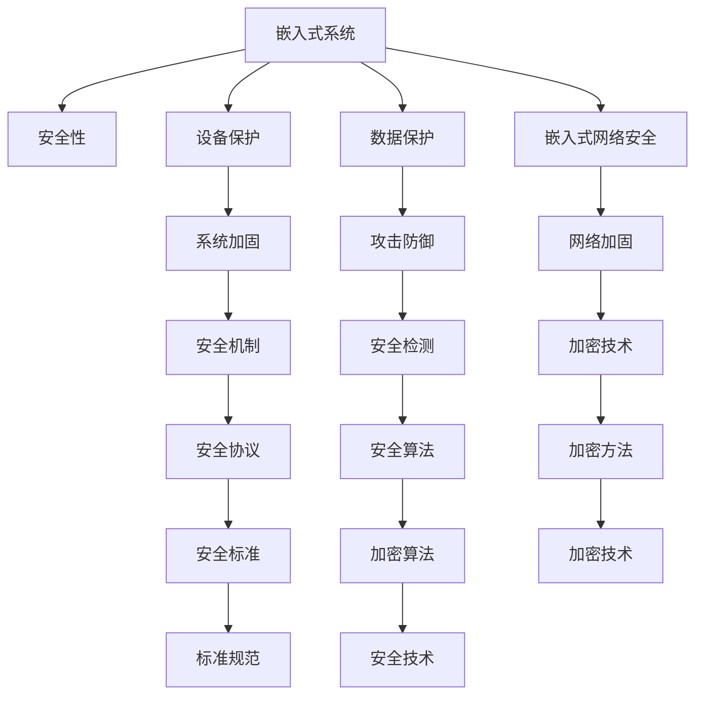

                 

# 嵌入式系统安全性：保护设备和数据

> 关键词：嵌入式系统, 安全性, 设备保护, 数据保护, 嵌入式网络安全, 系统加固, 攻击防御

## 1. 背景介绍

### 1.1 问题由来
随着物联网(IoT)的蓬勃发展，越来越多的设备接入互联网，为人们的生产生活带来了极大的便利。但与此同时，嵌入式设备的网络安全问题也日益严峻。嵌入式设备的计算资源有限、软件复杂、操作系统不通用，加之制造商可能缺乏足够的安全意识，使得其成为网络攻击者的重要目标。

嵌入式设备广泛应用于智能家居、智能交通、工业控制、医疗健康等多个领域，一旦被攻击，将导致严重的安全风险和经济损失。例如，智能家居设备的入侵可能导致隐私泄露、财产损失；工业控制设备被攻击可能造成生产停滞、设备损毁；医疗设备被入侵可能导致患者生命安全受到威胁。因此，保护嵌入式设备的隐私数据和关键功能的安全性，成为当前技术发展的紧迫需求。

### 1.2 问题核心关键点
嵌入式系统安全保护的核心问题在于：

- 如何确保设备的硬件和软件环境安全，防止未授权访问和篡改。
- 如何保护设备上存储的敏感数据，避免数据泄露和篡改。
- 如何提升设备的安全性检测和响应能力，有效防御各类攻击。
- 如何保证设备间通信的安全性，防止中间人攻击和重放攻击。

这些问题的解决需要从设备硬件、软件、网络通信等多层次进行综合设计，采取多维度的安全防护措施，构建起全方位的嵌入式系统安全保护体系。

### 1.3 问题研究意义
研究嵌入式系统安全性，对于确保嵌入式设备的安全性、保护用户隐私、提升物联网系统的整体安全性具有重要意义：

1. 保障设备安全性。通过系统加固、漏洞修复等措施，降低设备被攻击的风险，保障设备正常运行。
2. 保护用户隐私。保护设备上存储的敏感数据，防止信息泄露和滥用，增强用户隐私保护。
3. 提升物联网系统安全性。构建安全可靠的嵌入式设备网络，防范各类网络攻击，保障物联网系统的整体安全性。
4. 推动安全技术发展。嵌入式系统安全技术的不断提升，将为其他领域的网络安全技术提供有益的借鉴。

## 2. 核心概念与联系

### 2.1 核心概念概述

为更好地理解嵌入式系统安全性的核心概念，本节将介绍几个密切相关的核心概念：

- 嵌入式系统(Embedded System)：指专门为特定应用设计，资源受限的计算系统，包含处理器、存储器、输入输出等组件，广泛应用于各种嵌入式设备。
- 安全性(Security)：指保护资产免受威胁、确保信息保密性、完整性、可用性的能力。
- 设备保护(Device Protection)：指保护嵌入式设备硬件和软件环境，防止未授权访问和篡改。
- 数据保护(Data Protection)：指保护设备上存储的敏感数据，避免数据泄露和篡改。
- 嵌入式网络安全(Embedded Network Security)：指保护嵌入式设备间通信的安全性，防止中间人攻击和重放攻击。
- 系统加固(System Hardening)：指通过各种安全措施，提升嵌入式系统的整体安全性。
- 攻击防御(Attack Defense)：指检测和防御嵌入式设备面临的各种攻击，保护设备及其网络安全。

这些核心概念之间的逻辑关系可以通过以下Mermaid流程图来展示：



这个流程图展示了一系列与嵌入式系统安全性相关的核心概念及其之间的联系：

1. 嵌入式系统通过安全性保护，保障设备硬件和软件环境的安全性。
2. 设备保护和数据保护共同作用，保护设备上存储的敏感数据。
3. 嵌入式网络安全通过安全检测、加密技术、安全协议等多层次措施，保护设备间通信的安全性。
4. 系统加固、攻击防御、加密算法等安全机制，共同构建起嵌入式系统的整体安全性。
5. 安全技术、标准规范等，为嵌入式系统的安全性设计提供指导和规范。

这些概念共同构成了嵌入式系统安全性的技术框架，使得开发者能够从多个维度提升设备的安全性。

## 3. 核心算法原理 & 具体操作步骤
### 3.1 算法原理概述

嵌入式系统安全性保护的核心在于，通过一系列的安全措施，保障设备硬件、软件、通信等各个环节的安全性。其核心算法原理主要包括：

- 安全检测和安全响应机制：用于检测设备面临的安全威胁，并及时采取措施响应。
- 加密算法和密钥管理：用于保护设备上存储的敏感数据，防止数据泄露和篡改。
- 安全协议和标准：用于规范设备间通信，防止中间人攻击和重放攻击。

### 3.2 算法步骤详解

嵌入式系统安全性的实现一般包括以下几个关键步骤：

**Step 1: 硬件设计**
- 选择适当的芯片和传感器，确保设备具备必要的安全计算和存储资源。
- 设计硬件隔离机制，防止攻击者通过硬件设备攻击。
- 实现芯片的硬件指纹识别，防止芯片被盗用。

**Step 2: 软件加固**
- 对系统进行漏洞扫描和修复，消除已知的安全漏洞。
- 实现程序代码的安全审计，防止代码注入攻击。
- 采用代码混淆、程序加密等技术，防止代码被逆向分析。

**Step 3: 数据加密**
- 对设备上存储的敏感数据进行加密，防止数据泄露。
- 采用安全的密钥管理策略，如密钥分离、密钥生成器等，防止密钥泄露。

**Step 4: 网络安全**
- 采用加密通信协议，如TLS、SSH等，防止通信内容被窃听。
- 实现IP地址和MAC地址绑定，防止重放攻击。
- 实现用户认证和授权，防止未经授权的访问。

**Step 5: 安全监控**
- 实现安全日志记录和审计，追踪设备的访问和使用情况。
- 实现入侵检测系统(IDS)和安全事件响应(SOAR)，及时检测和响应安全威胁。

**Step 6: 安全协议和标准**
- 采用安全协议，如VPN、IKE等，保证数据传输的安全性。
- 遵循安全标准，如NIST、ISO等，提升设备的安全性水平。

### 3.3 算法优缺点

嵌入式系统安全性保护方法具有以下优点：

1. 全面性。涵盖了硬件、软件、通信等多层次的安全措施，具备较强的综合性。
2. 灵活性。可根据具体应用场景，灵活调整安全性方案。
3. 稳定性。通过对硬件和软件的安全加固，保障设备的稳定性。
4. 可扩展性。易于扩展到更多设备和场景，具有广泛的适用性。

同时，该方法也存在一些局限性：

1. 计算资源限制。嵌入式设备计算资源有限，安全性措施需要合理优化，避免性能瓶颈。
2. 实施难度较大。涉及硬件、软件、网络等多方面的安全措施，实施难度较大。
3. 维护成本高。安全性系统需要定期更新和维护，维护成本较高。
4. 依赖开发者。安全性设计依赖开发者的安全意识和能力，存在一定的风险。

尽管存在这些局限性，但就目前而言，嵌入式系统安全性保护仍是嵌入式设备开发中的重要组成部分。未来相关研究的重点在于如何进一步降低实施难度，优化性能，提升系统的易用性和稳定性。

### 3.4 算法应用领域

嵌入式系统安全性保护技术已经在智能家居、智能交通、工业控制、医疗健康等多个领域得到了广泛应用，保障了设备的隐私数据和关键功能的安全性。

- 智能家居：通过安全检测和认证机制，防止家庭设备被恶意入侵，保障用户隐私。
- 智能交通：实现车辆间的安全通信，防止自动驾驶车辆被攻击，保障行车安全。
- 工业控制：保护关键设备的通信安全，防止恶意篡改，保障生产稳定。
- 医疗健康：保护患者数据的安全性，防止信息泄露和篡改，保障患者隐私。

此外，嵌入式系统安全性保护技术还广泛应用于各种网络安全场景，如物联网、移动支付、智能制造等，为这些领域的网络安全提供了坚实保障。

## 4. 数学模型和公式 & 详细讲解 & 举例说明（备注：数学公式请使用latex格式，latex嵌入文中独立段落使用 $$，段落内使用 $)
### 4.1 数学模型构建

嵌入式系统安全性保护涉及多个层次的安全措施，其核心数学模型包括：

1. 硬件安全模型：描述设备硬件的安全特性，如芯片指纹、传感器数据等。
2. 软件安全模型：描述软件的安全特性，如程序加密、代码混淆等。
3. 通信安全模型：描述设备间通信的安全特性，如加密协议、IP/MAC绑定等。

以设备间通信的安全模型为例，可以采用以下数学模型：

设设备间的通信协议为 $P$，发送方为 $S$，接收方为 $R$，第三方攻击者为 $E$。则通信安全模型的数学表达式为：

$$
P(S, R, E) = (S \oplus R) \land \neg(E \oplus S)
$$

其中，$\oplus$ 表示异或运算，$\land$ 表示逻辑与运算。该表达式表示，只有当发送方 $S$ 和接收方 $R$ 都正确执行协议 $P$，且攻击者 $E$ 未成功篡改，通信才被认为是安全的。

### 4.2 公式推导过程

以下我们以数据加密算法为例，推导数据加密的基本数学模型。

设要加密的数据为 $D$，密钥为 $K$，加密算法为 $C$。则加密过程的数学模型为：

$$
C(D, K) = E(D, K)
$$

其中，$E$ 表示加密算法，$C$ 表示加密结果。解密过程的数学模型为：

$$
D' = D(K)
$$

其中，$D'$ 表示解密结果。加密和解密过程满足逆运算关系，即：

$$
E(D', K) = D(K) \land C(D, K)
$$

加密和解密过程的数学模型表明，只要掌握正确的密钥 $K$，就能解密出原始数据 $D'$。因此，密钥管理是数据加密的核心问题。

### 4.3 案例分析与讲解

以SSL/TLS协议为例，分析其加密和认证机制。

SSL/TLS协议是一种常见的加密通信协议，用于保障网络通信的安全性。其基本工作流程如下：

1. 客户端向服务器发送握手请求。
2. 服务器返回证书和公钥。
3. 客户端验证证书合法性，并生成会话密钥。
4. 客户端和服务器使用会话密钥进行数据加密和解密。
5. 会话结束后，关闭连接。

SSL/TLS协议的安全性主要体现在以下几个方面：

1. 证书验证：通过证书验证，保证通信双方的身份真实性。
2. 密钥交换：采用 Diffie-Hellman 算法，保证密钥的安全交换。
3. 数据加密：采用对称加密算法，保证数据传输的机密性。
4. 数据完整性：采用消息摘要算法，保证数据传输的完整性。

SSL/TLS协议的数学模型可以表示为：

$$
C(S, R) = (S \oplus K) \land (R \oplus K)
$$

其中，$S$ 表示发送方，$R$ 表示接收方，$K$ 表示会话密钥。该表达式表示，只要双方都使用正确的会话密钥，通信就认为是安全的。

## 5. 项目实践：代码实例和详细解释说明
### 5.1 开发环境搭建

在进行嵌入式系统安全性保护开发前，我们需要准备好开发环境。以下是使用C语言进行嵌入式设备开发的开发环境配置流程：

1. 安装GCC编译器：从官网下载并安装GCC编译器，用于编译嵌入式设备的应用程序。
2. 安装Keil IDE：从官网下载并安装Keil IDE，支持嵌入式设备的程序开发和调试。
3. 安装MinGW：从官网下载并安装MinGW，用于在Windows系统上构建嵌入式设备的应用程序。
4. 配置开发板：将开发板连接到计算机，配置好串口调试工具。
5. 安装交叉编译工具链：从官网下载并安装交叉编译工具链，用于编译嵌入式设备的应用程序。

完成上述步骤后，即可在开发板上进行嵌入式系统安全性保护的应用程序开发。

### 5.2 源代码详细实现

下面我们以嵌入式设备的安全监控为例，给出使用C语言实现的安全日志记录和入侵检测系统的代码实现。

首先，定义安全日志记录函数：

```c
#include <stdio.h>
#include <time.h>

void log(const char *msg) {
    time_t now = time(NULL);
    struct tm *ltm = localtime(&now);
    printf("[%d-%02d-%02d %02d:%02d:%02d] %s\n", ltm->tm_year + 1900, ltm->tm_mon + 1, ltm->tm_mday,
           ltm->tm_hour, ltm->tm_min, ltm->tm_sec, msg);
}
```

然后，定义入侵检测系统(IDS)函数：

```c
#include <stdio.h>
#include <stdlib.h>

int ids(const char *data, int length) {
    // 模拟入侵检测算法
    if (length > 10) {
        return 1;
    }
    return 0;
}
```

最后，启动安全日志记录和入侵检测系统：

```c
#include <stdio.h>
#include <stdlib.h>

int main() {
    // 记录安全日志
    log("嵌入式设备启动");

    // 启动入侵检测系统
    int status = ids("some_data", 10);
    if (status) {
        log("入侵检测到攻击");
    } else {
        log("没有检测到攻击");
    }

    return 0;
}
```

以上就是使用C语言对嵌入式设备的安全监控进行基本实现的代码。可以看到，通过定义日志记录函数和入侵检测函数，并调用这两个函数，可以实现对嵌入式设备的安全监控。

### 5.3 代码解读与分析

让我们再详细解读一下关键代码的实现细节：

**安全日志记录函数**：
- 定义了日志记录函数 `log`，用于记录嵌入式设备的安全日志。
- 使用 `time` 函数获取当前时间，并使用 `localtime` 函数将其转换为本地时间格式。
- 使用 `printf` 函数输出日志信息，包含时间戳和日志内容。

**入侵检测系统函数**：
- 定义了入侵检测系统函数 `ids`，用于检测嵌入式设备是否受到攻击。
- 模拟一个简单的入侵检测算法，如果数据长度大于10，则认为存在攻击。
- 根据检测结果，输出相应的日志信息。

**主函数**：
- 调用 `log` 函数记录设备启动日志。
- 调用 `ids` 函数检测设备是否受到攻击，并输出相应的日志信息。

可以看出，通过定义简单的日志记录函数和入侵检测函数，并调用这两个函数，可以实现对嵌入式设备的安全监控。当然，在实际开发中，还需要考虑更多的安全措施，如数据加密、安全认证等。

## 6. 实际应用场景
### 6.1 智能家居安全

智能家居设备通常包含大量的传感器和摄像头，容易成为网络攻击者的目标。通过安全监控和加密技术，可以有效保护用户隐私和设备安全。

在实践中，可以采用如下安全措施：

1. 硬件指纹识别：通过芯片指纹识别技术，防止设备被盗用。
2. 数据加密：对存储的敏感数据进行加密，防止数据泄露。
3. 安全日志记录：记录设备的访问和使用情况，及时发现异常行为。
4. 入侵检测：检测设备是否受到攻击，及时采取措施应对。

通过这些安全措施，可以有效保护智能家居设备的安全性，保障用户的隐私和财产安全。

### 6.2 工业控制安全

工业控制设备往往应用于关键基础设施中，一旦被攻击，可能导致严重的安全事故。通过安全监控和加密技术，可以有效保护工业控制设备的安全性。

在实践中，可以采用如下安全措施：

1. 硬件隔离：通过硬件隔离机制，防止攻击者通过设备硬件攻击。
2. 软件加固：对系统进行漏洞扫描和修复，消除已知的安全漏洞。
3. 数据加密：对存储的敏感数据进行加密，防止数据泄露。
4. 安全协议：采用加密通信协议，如TLS、SSH等，防止通信内容被窃听。

通过这些安全措施，可以有效保护工业控制设备的安全性，保障生产安全。

### 6.3 医疗健康安全

医疗设备通常应用于医院等敏感环境中，一旦被攻击，可能导致患者的隐私泄露和生命安全受到威胁。通过安全监控和加密技术，可以有效保护医疗设备的安全性。

在实践中，可以采用如下安全措施：

1. 硬件指纹识别：通过芯片指纹识别技术，防止设备被盗用。
2. 数据加密：对存储的敏感数据进行加密，防止数据泄露。
3. 安全日志记录：记录设备的访问和使用情况，及时发现异常行为。
4. 入侵检测：检测设备是否受到攻击，及时采取措施应对。

通过这些安全措施，可以有效保护医疗设备的安全性，保障患者的隐私和生命安全。

### 6.4 未来应用展望

随着物联网的进一步发展，嵌入式设备的应用场景将更加多样和复杂。嵌入式系统安全性保护技术也将不断演进，涵盖更多的设备和领域，保障更广泛的安全需求。

未来，嵌入式系统安全性保护技术将呈现以下几个发展趋势：

1. 硬件安全性提升：采用更先进的硬件安全技术，如硬件随机数生成器、安全存储器等，提升设备的抗攻击能力。
2. 软件安全性增强：采用更先进的安全编码技术，如代码混淆、程序加密等，防止代码注入攻击和逆向分析。
3. 网络安全性保障：采用更先进的网络安全技术，如IKE、VPN等，保障设备间通信的安全性。
4. 数据安全性改进：采用更先进的数据加密技术，如对称加密、公钥加密等，保护设备上存储的敏感数据。
5. 安全监控和响应：采用更先进的安全监控和响应技术，如入侵检测系统(IDS)、安全事件响应(SOAR)等，及时检测和应对安全威胁。

这些发展趋势将推动嵌入式系统安全性保护技术的不断进步，为物联网系统的整体安全性提供坚实保障。

## 7. 工具和资源推荐
### 7.1 学习资源推荐

为了帮助开发者掌握嵌入式系统安全性的设计理念和技术细节，这里推荐一些优质的学习资源：

1. 《嵌入式系统安全性设计与实现》书籍：全面介绍嵌入式系统安全性的设计原理和实现方法，涵盖硬件、软件、通信等多层次的安全措施。
2. 嵌入式系统安全性的在线课程：各大高校和在线教育平台提供的嵌入式系统安全性的课程，包括硬件安全性、软件安全性、网络安全性等多方面的内容。
3. 嵌入式系统安全性的学术会议论文：IEEE、ACM等权威学术会议和期刊上发表的嵌入式系统安全性的论文，涵盖最新的研究成果和应用案例。

通过对这些资源的学习实践，相信你一定能够系统掌握嵌入式系统安全性的设计理念和技术细节，提升自身在嵌入式设备开发中的安全意识和能力。

### 7.2 开发工具推荐

高效的开发离不开优秀的工具支持。以下是几款用于嵌入式系统安全性保护开发的常用工具：

1. GCC编译器：GCC编译器是免费的、开源的，支持多种操作系统和处理器架构，适合嵌入式设备的程序开发和调试。
2. Keil IDE：Keil IDE是一款专业的嵌入式系统开发工具，提供丰富的代码编辑、调试和分析功能，支持多种嵌入式设备和编译器。
3. MinGW：MinGW是一款在Windows系统上构建嵌入式设备的应用程序的交叉编译工具链，支持C/C++程序开发和调试。
4. Python编程语言：Python是一种高效、灵活的编程语言，适合快速原型开发和安全策略的设计。
5. OpenSSL：OpenSSL是一个开源的加密库，提供多种加密算法和协议，适合嵌入式设备的加密和认证。

合理利用这些工具，可以显著提升嵌入式系统安全性保护的开发效率，加快安全策略的实现和部署。

### 7.3 相关论文推荐

嵌入式系统安全性保护技术的发展源于学界的持续研究。以下是几篇奠基性的相关论文，推荐阅读：

1. Secure Embedded Systems：A Survey（嵌入式安全系统综述）：全面综述了嵌入式系统的安全性设计，涵盖硬件、软件、通信等多方面的安全措施。
2. Hardware Security for Embedded Systems（嵌入式系统的硬件安全性）：介绍了硬件指纹识别、安全存储器等硬件安全技术，提升了设备的抗攻击能力。
3. Software Security for Embedded Systems（嵌入式系统的软件安全性）：介绍了代码混淆、程序加密等安全编码技术，防止代码注入攻击和逆向分析。
4. Network Security for Embedded Systems（嵌入式系统的网络安全性）：介绍了IKE、VPN等安全协议，保障设备间通信的安全性。
5. Data Security for Embedded Systems（嵌入式系统的数据安全性）：介绍了对称加密、公钥加密等数据加密技术，保护设备上存储的敏感数据。

这些论文代表了大嵌入式系统安全性保护技术的发展脉络。通过学习这些前沿成果，可以帮助研究者把握学科前进方向，激发更多的创新灵感。

## 8. 总结：未来发展趋势与挑战

### 8.1 总结

本文对嵌入式系统安全性保护方法进行了全面系统的介绍。首先阐述了嵌入式系统安全性的研究背景和意义，明确了安全保护在保障设备、保护用户隐私、提升物联网系统安全性等方面的重要性。其次，从原理到实践，详细讲解了嵌入式系统安全性的数学模型和关键步骤，给出了嵌入式设备安全监控的代码实现。同时，本文还广泛探讨了嵌入式系统安全性在智能家居、工业控制、医疗健康等多个领域的应用前景，展示了嵌入式系统安全性保护的巨大潜力。此外，本文精选了嵌入式系统安全性的学习资源、开发工具和相关论文，力求为读者提供全方位的技术指引。

通过本文的系统梳理，可以看到，嵌入式系统安全性保护技术正在成为嵌入式设备开发中的重要组成部分。这些安全措施，使得嵌入式设备具备更强的抗攻击能力和更好的用户体验，为物联网系统的整体安全性提供了坚实保障。未来，伴随嵌入式系统安全性技术的不断演进，嵌入式设备的安全性将进一步提升，为人们的生活带来更多的便利和保障。

### 8.2 未来发展趋势

展望未来，嵌入式系统安全性保护技术将呈现以下几个发展趋势：

1. 硬件安全性提升：采用更先进的硬件安全技术，如硬件随机数生成器、安全存储器等，提升设备的抗攻击能力。
2. 软件安全性增强：采用更先进的安全编码技术，如代码混淆、程序加密等，防止代码注入攻击和逆向分析。
3. 网络安全性保障：采用更先进的网络安全技术，如IKE、VPN等，保障设备间通信的安全性。
4. 数据安全性改进：采用更先进的数据加密技术，如对称加密、公钥加密等，保护设备上存储的敏感数据。
5. 安全监控和响应：采用更先进的安全监控和响应技术，如入侵检测系统(IDS)、安全事件响应(SOAR)等，及时检测和应对安全威胁。

这些发展趋势将推动嵌入式系统安全性保护技术的不断进步，为物联网系统的整体安全性提供坚实保障。

### 8.3 面临的挑战

尽管嵌入式系统安全性保护技术已经取得了显著成就，但在迈向更加智能化、普适化应用的过程中，仍面临诸多挑战：

1. 计算资源限制：嵌入式设备计算资源有限，安全性措施需要合理优化，避免性能瓶颈。
2. 实施难度较大：涉及硬件、软件、网络等多方面的安全措施，实施难度较大。
3. 维护成本高：安全性系统需要定期更新和维护，维护成本较高。
4. 依赖开发者：安全性设计依赖开发者的安全意识和能力，存在一定的风险。

尽管存在这些局限性，但就目前而言，嵌入式系统安全性保护仍是嵌入式设备开发中的重要组成部分。未来相关研究的重点在于如何进一步降低实施难度，优化性能，提升系统的易用性和稳定性。

### 8.4 研究展望

面对嵌入式系统安全性保护所面临的种种挑战，未来的研究需要在以下几个方面寻求新的突破：

1. 探索无监督和半监督安全性方法：摆脱对大规模安全数据的依赖，利用自监督学习、主动学习等无监督和半监督范式，最大限度利用非结构化数据，实现更加灵活高效的安全性保护。
2. 研究参数高效和计算高效的安全性范式：开发更加参数高效的安全性方法，在固定大部分安全性参数的情况下，只调整极少量的任务相关参数。同时优化安全性模型的计算图，减少前向传播和反向传播的资源消耗，实现更加轻量级、实时性的部署。
3. 融合因果和对比学习范式：通过引入因果推断和对比学习思想，增强安全性模型建立稳定因果关系的能力，学习更加普适、鲁棒的安全性表征，从而提升模型泛化性和抗干扰能力。
4. 引入更多先验知识：将符号化的先验知识，如知识图谱、逻辑规则等，与神经网络模型进行巧妙融合，引导安全性模型的学习过程，引入更多安全性和知识库、规则库等专家知识，增强模型对安全性的理解和判断能力。
5. 结合因果分析和博弈论工具：将因果分析方法引入安全性模型，识别出模型决策的关键特征，增强输出解释的因果性和逻辑性。借助博弈论工具刻画人机交互过程，主动探索并规避模型的脆弱点，提高系统稳定性。

这些研究方向的探索，必将引领嵌入式系统安全性保护技术迈向更高的台阶，为构建安全、可靠、可解释、可控的智能系统铺平道路。面向未来，嵌入式系统安全性保护技术还需要与其他人工智能技术进行更深入的融合，如知识表示、因果推理、强化学习等，多路径协同发力，共同推动嵌入式系统的进步。只有勇于创新、敢于突破，才能不断拓展嵌入式系统的边界，让智能技术更好地造福人类社会。

## 9. 附录：常见问题与解答

**Q1：嵌入式系统安全性保护是否适用于所有嵌入式设备？**

A: 嵌入式系统安全性保护技术在大多数嵌入式设备上都能取得不错的效果，特别是对于安全性需求较高的设备。但对于一些特定类型的嵌入式设备，如医疗设备、工业控制设备等，还需要进行针对性的安全性设计和优化。

**Q2：如何选择合适的安全性算法？**

A: 选择合适的安全性算法需要考虑设备的安全需求、计算资源限制、安全性目标等多个因素。一般建议选择主流且成熟的算法，如TLS、Diffie-Hellman等，同时考虑算法的安全性和性能。

**Q3：在嵌入式设备中，如何实现数据加密？**

A: 在嵌入式设备中，可以采用对称加密算法，如AES、DES等，对敏感数据进行加密。同时，还需要设计安全的密钥管理策略，如密钥分离、密钥生成器等，防止密钥泄露。

**Q4：嵌入式系统安全性保护是否需要定期更新？**

A: 是的，嵌入式系统安全性保护需要定期更新和维护，以保证设备的持续安全性。定期更新可以包括漏洞修复、安全加固、安全协议升级等，防止新的安全威胁出现。

**Q5：如何保障嵌入式设备的安全性？**

A: 保障嵌入式设备的安全性需要从多个层次进行综合设计，包括硬件安全、软件安全、通信安全、数据安全等多方面。具体措施包括硬件指纹识别、软件加固、数据加密、安全协议等，构建全方位的安全保护体系。

---

作者：禅与计算机程序设计艺术 / Zen and the Art of Computer Programming

