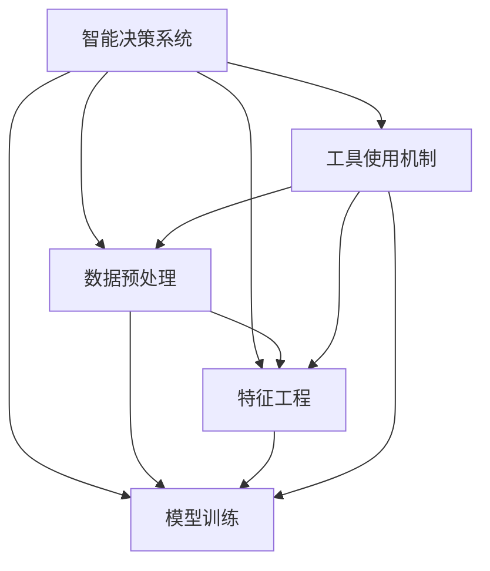

                 

## 1. 背景介绍

### 1.1 问题由来
在现代信息社会中，决策系统已广泛应用在各行各业，如金融交易、医疗诊断、智能交通等。传统的决策系统依赖专家经验，但其知识难以系统化、传承化，且难以应对日益复杂多变的现实世界。为了提升决策系统的智能化水平，数据驱动的机器学习技术成为了新的热点。

### 1.2 问题核心关键点
机器学习技术在决策系统中的应用，主要体现在如何设计有效的数据处理机制和模型训练策略。在智能决策系统中，数据通常是多源异构的，既包含结构化数据，也包含大量非结构化数据。为了提高数据处理和模型训练的效率，需要引入一些工具使用机制，以优化资源配置、简化流程、提高准确性。

### 1.3 问题研究意义
研究智能决策系统中的工具使用机制，对于提升决策系统的智能化水平、降低复杂性、提升决策效率具有重要意义：

1. 提升决策质量：有效的工具使用机制能够提高数据处理和模型训练的准确性，从而提升决策质量。
2. 简化系统设计：工具使用机制可以简化数据处理和模型训练流程，降低系统设计和实现的复杂度。
3. 提升决策效率：通过优化工具使用机制，可以提高数据处理和模型训练的效率，加速决策系统的部署和迭代。
4. 推动技术创新：引入新的工具使用机制，可以带来新的技术突破，促进决策系统的不断进化。
5. 增强系统鲁棒性：通过工具使用机制的优化，可以增强系统对异常数据和干扰因素的鲁棒性，提高决策系统的稳定性和可靠性。

## 2. 核心概念与联系

### 2.1 核心概念概述

为更好地理解智能决策系统中的工具使用机制，本节将介绍几个关键概念及其之间的联系：

- 智能决策系统：基于数据和算法驱动的决策系统，能够自动或半自动地处理海量数据，提取有价值的信息，辅助或替代人工决策。
- 数据预处理：对原始数据进行清洗、转换、归一化等操作，以提高数据质量，减少模型输入的噪声。
- 特征工程：提取、构建、选择和处理数据特征，以提高模型的性能和泛化能力。
- 模型训练：使用训练数据集，通过迭代优化算法，更新模型参数，使其能够拟合训练数据，并泛化到未知数据。
- 工具使用机制：在智能决策系统中引入的一些工具和框架，用于优化数据处理、模型训练等流程，提高决策系统的效率和鲁棒性。

这些概念之间的逻辑关系可以通过以下Mermaid流程图来展示：



这个流程图展示了许多核心概念及其之间的关系：

1. 智能决策系统通过数据预处理、特征工程和模型训练，生成决策结果。
2. 数据预处理、特征工程和模型训练都依赖于工具使用机制，以提高效率和准确性。
3. 工具使用机制辅助数据预处理、特征工程和模型训练，优化整个系统流程。

## 3. 核心算法原理 & 具体操作步骤

### 3.1 算法原理概述

在智能决策系统中，工具使用机制的原理主要体现在以下几个方面：

- 自动化：工具使用机制能够自动执行一些复杂的、耗时的数据处理和模型训练任务，减少人工干预，提高效率。
- 智能化：工具使用机制引入先进的算法和技术，如机器学习、深度学习等，提升决策系统的智能化水平。
- 可扩展性：工具使用机制能够支持多源异构数据的处理和模型训练，能够应对复杂多变的现实世界。
- 可维护性：工具使用机制能够简化系统设计和实现，降低维护成本，提高系统的稳定性和可靠性。

### 3.2 算法步骤详解

智能决策系统中的工具使用机制，一般包括以下几个关键步骤：

**Step 1: 数据采集与清洗**
- 收集各种来源的数据，包括结构化数据、非结构化数据等。
- 对数据进行清洗，去除重复、缺失、异常数据，保证数据质量。

**Step 2: 数据转换与归一化**
- 将不同格式和类型的数据进行转换，确保统一输入。
- 对数据进行归一化、标准化处理，消除数据之间的量纲差异。

**Step 3: 特征选择与构建**
- 根据任务需求，选择和构建有代表性的特征。
- 使用特征工程技术，如维度缩减、特征选择、特征提取等，提升特征质量。

**Step 4: 模型选择与训练**
- 根据任务类型和数据特征，选择合适的模型和算法。
- 使用训练数据集，通过迭代优化算法，更新模型参数。

**Step 5: 模型评估与优化**
- 在测试集上评估模型性能，选择最优模型。
- 根据模型评估结果，优化模型参数和训练策略，提高模型泛化能力。

**Step 6: 部署与监控**
- 将训练好的模型部署到实际应用中。
- 实时监控模型性能，及时发现和修正问题，保证系统稳定运行。

以上是智能决策系统中的工具使用机制的一般流程。在实际应用中，还需要针对具体任务和数据特点，对各步骤进行优化设计，如改进数据清洗策略、优化特征工程方法、选择合适的模型和算法等。

### 3.3 算法优缺点

智能决策系统中的工具使用机制具有以下优点：
1. 自动化程度高。工具使用机制能够自动执行数据处理和模型训练任务，减少人工干预，提高效率。
2. 智能化水平高。工具使用机制引入先进的算法和技术，提升决策系统的智能化水平。
3. 扩展性强。工具使用机制能够支持多源异构数据的处理和模型训练，能够应对复杂多变的现实世界。
4. 维护成本低。工具使用机制能够简化系统设计和实现，降低维护成本，提高系统的稳定性和可靠性。

同时，该机制也存在一定的局限性：
1. 依赖数据质量。工具使用机制的效率和效果高度依赖数据质量，数据清洗和转换的准确性对最终结果影响较大。
2. 依赖模型选择。选择合适的模型和算法是工具使用机制的关键，不同的模型和算法可能带来不同的结果。
3. 依赖实现细节。工具使用机制的实现细节对性能和可维护性有较大影响，不同的实现方式可能带来不同的效果。
4. 依赖环境因素。工具使用机制的效率和效果高度依赖于环境因素，如硬件配置、软件框架等，不同环境下的性能差异较大。

尽管存在这些局限性，但就目前而言，工具使用机制是智能决策系统中最有效的技术和手段之一，能够显著提高决策系统的效率和智能化水平。未来相关研究的重点在于如何进一步降低对数据质量和模型选择的依赖，提高模型的泛化能力和鲁棒性，同时兼顾可扩展性和可维护性。

### 3.4 算法应用领域

智能决策系统中的工具使用机制，在金融、医疗、智能交通、智能制造等多个领域得到了广泛应用，取得了显著的成效。

**金融行业**：在金融交易、风险管理、信用评估等场景中，工具使用机制能够帮助金融机构快速处理海量数据，提取有价值的信息，辅助决策。

**医疗行业**：在医学影像诊断、病历分析、基因分析等场景中，工具使用机制能够帮助医疗人员快速处理数据，提取特征，辅助诊断。

**智能交通**：在交通流量预测、路况优化、事故预警等场景中，工具使用机制能够帮助交通管理部门实时处理数据，优化交通流量。

**智能制造**：在生产设备维护、质量控制、供应链管理等场景中，工具使用机制能够帮助企业快速处理数据，优化生产流程，提高生产效率。

除了上述这些经典应用外，工具使用机制还被创新性地应用到更多场景中，如智能客服、推荐系统、内容推荐等，为各行业带来了新的突破。随着工具使用机制的不断进步，相信其在更多领域的应用将更加广泛，为各行各业带来新的活力和机遇。

## 4. 数学模型和公式 & 详细讲解 & 举例说明

### 4.1 数学模型构建

本节将使用数学语言对智能决策系统中的工具使用机制进行更加严格的刻画。

假设输入数据集为 $X=\{x_1, x_2, ..., x_n\}$，其中 $x_i$ 表示第 $i$ 个样本，可以是结构化数据或非结构化数据。工具使用机制的数学模型 $M$ 可以表示为：

$$
M = F \circ P \circ C \circ G
$$

其中 $F$ 表示特征工程，$P$ 表示数据预处理，$C$ 表示模型训练，$G$ 表示模型评估与优化。

### 4.2 公式推导过程

以下我们以分类任务为例，推导工具使用机制的数学模型和公式。

假设分类任务的训练数据集为 $D=\{(x_i, y_i)\}_{i=1}^N$，其中 $y_i \in \{0, 1\}$ 表示样本的类别标签。使用工具使用机制处理数据后，输入为 $X'$。模型训练过程可以表示为：

$$
\theta^* = \mathop{\arg\min}_{\theta} \frac{1}{N}\sum_{i=1}^N \ell(f_\theta(x'_i), y_i)
$$

其中 $f_\theta$ 表示模型在参数 $\theta$ 下的预测函数，$\ell$ 表示损失函数，如交叉熵损失。工具使用机制的具体推导过程如下：

**数据预处理**：假设原始数据为文本数据，预处理步骤包括分词、去除停用词、词干提取等。预处理后的数据为 $X'$，其中 $X'$ 是 $X$ 的子集。

**特征工程**：假设特征工程步骤为词频统计、TF-IDF向量表示等。特征表示为 $X'' = \{(x''_i, v''_i)\}_{i=1}^N$，其中 $x''_i$ 表示第 $i$ 个样本的特征向量，$v''_i$ 表示对应的标签。

**模型训练**：假设使用线性分类器，训练过程可以表示为：

$$
\theta^* = \mathop{\arg\min}_{\theta} \frac{1}{N}\sum_{i=1}^N (y_i - \theta \cdot x''_i)^2
$$

其中 $\theta$ 表示模型参数，$x''_i$ 表示样本的特征向量，$y_i$ 表示样本的标签。

**模型评估与优化**：假设使用交叉验证等方法评估模型性能，最优模型为：

$$
\theta^* = \mathop{\arg\min}_{\theta} \frac{1}{N}\sum_{i=1}^N (y_i - f_\theta(x'_i))^2
$$

其中 $f_\theta$ 表示模型在参数 $\theta$ 下的预测函数，$y_i$ 表示样本的标签。

### 4.3 案例分析与讲解

假设有一家医院需要对患者进行疾病分类，工具使用机制的实现过程如下：

**Step 1: 数据采集与清洗**
- 收集患者的基本信息、病历记录、实验室检查结果等数据。
- 对数据进行清洗，去除缺失、异常数据，保证数据质量。

**Step 2: 数据转换与归一化**
- 将文本数据转换为结构化数据，如将病历记录转换为表格形式。
- 对数据进行归一化，如将数值型数据进行标准化处理。

**Step 3: 特征选择与构建**
- 根据任务需求，选择有代表性的特征，如患者的年龄、性别、病历记录、实验室检查结果等。
- 使用特征工程技术，如维度缩减、特征选择、特征提取等，提升特征质量。

**Step 4: 模型选择与训练**
- 根据任务类型和数据特征，选择合适的模型和算法，如逻辑回归、支持向量机等。
- 使用训练数据集，通过迭代优化算法，更新模型参数。

**Step 5: 模型评估与优化**
- 在测试集上评估模型性能，选择最优模型。
- 根据模型评估结果，优化模型参数和训练策略，提高模型泛化能力。

最终，训练好的模型可以用于对新患者的疾病进行分类，提高诊断的准确性和效率。

## 5. 项目实践：代码实例和详细解释说明

### 5.1 开发环境搭建

在进行工具使用机制的实践前，我们需要准备好开发环境。以下是使用Python进行PyTorch开发的环境配置流程：

1. 安装Anaconda：从官网下载并安装Anaconda，用于创建独立的Python环境。

2. 创建并激活虚拟环境：
```bash
conda create -n pytorch-env python=3.8 
conda activate pytorch-env
```

3. 安装PyTorch：根据CUDA版本，从官网获取对应的安装命令。例如：
```bash
conda install pytorch torchvision torchaudio cudatoolkit=11.1 -c pytorch -c conda-forge
```

4. 安装PyTorch相关的工具包：
```bash
pip install numpy pandas scikit-learn matplotlib tqdm jupyter notebook ipython
```

完成上述步骤后，即可在`pytorch-env`环境中开始工具使用机制的实践。

### 5.2 源代码详细实现

下面我们以文本分类任务为例，给出使用PyTorch对线性分类器进行工具使用机制的PyTorch代码实现。

首先，定义分类任务的数据处理函数：

```python
from transformers import BertTokenizer
from torch.utils.data import Dataset
import torch

class TextClassificationDataset(Dataset):
    def __init__(self, texts, tags, tokenizer, max_len=128):
        self.texts = texts
        self.tags = tags
        self.tokenizer = tokenizer
        self.max_len = max_len
        
    def __len__(self):
        return len(self.texts)
    
    def __getitem__(self, item):
        text = self.texts[item]
        tags = self.tags[item]
        
        encoding = self.tokenizer(text, return_tensors='pt', max_length=self.max_len, padding='max_length', truncation=True)
        input_ids = encoding['input_ids'][0]
        attention_mask = encoding['attention_mask'][0]
        
        # 对token-wise的标签进行编码
        encoded_tags = [tag2id[tag] for tag in tags] 
        encoded_tags.extend([tag2id['O']] * (self.max_len - len(encoded_tags)))
        labels = torch.tensor(encoded_tags, dtype=torch.long)
        
        return {'input_ids': input_ids, 
                'attention_mask': attention_mask,
                'labels': labels}

# 标签与id的映射
tag2id = {'O': 0, 'Positive': 1, 'Negative': 2}
id2tag = {v: k for k, v in tag2id.items()}

# 创建dataset
tokenizer = BertTokenizer.from_pretrained('bert-base-cased')

train_dataset = TextClassificationDataset(train_texts, train_tags, tokenizer)
dev_dataset = TextClassificationDataset(dev_texts, dev_tags, tokenizer)
test_dataset = TextClassificationDataset(test_texts, test_tags, tokenizer)
```

然后，定义模型和优化器：

```python
from transformers import BertForTokenClassification, AdamW

model = BertForTokenClassification.from_pretrained('bert-base-cased', num_labels=len(tag2id))

optimizer = AdamW(model.parameters(), lr=2e-5)
```

接着，定义训练和评估函数：

```python
from torch.utils.data import DataLoader
from tqdm import tqdm
from sklearn.metrics import classification_report

device = torch.device('cuda') if torch.cuda.is_available() else torch.device('cpu')
model.to(device)

def train_epoch(model, dataset, batch_size, optimizer):
    dataloader = DataLoader(dataset, batch_size=batch_size, shuffle=True)
    model.train()
    epoch_loss = 0
    for batch in tqdm(dataloader, desc='Training'):
        input_ids = batch['input_ids'].to(device)
        attention_mask = batch['attention_mask'].to(device)
        labels = batch['labels'].to(device)
        model.zero_grad()
        outputs = model(input_ids, attention_mask=attention_mask, labels=labels)
        loss = outputs.loss
        epoch_loss += loss.item()
        loss.backward()
        optimizer.step()
    return epoch_loss / len(dataloader)

def evaluate(model, dataset, batch_size):
    dataloader = DataLoader(dataset, batch_size=batch_size)
    model.eval()
    preds, labels = [], []
    with torch.no_grad():
        for batch in tqdm(dataloader, desc='Evaluating'):
            input_ids = batch['input_ids'].to(device)
            attention_mask = batch['attention_mask'].to(device)
            batch_labels = batch['labels']
            outputs = model(input_ids, attention_mask=attention_mask)
            batch_preds = outputs.logits.argmax(dim=2).to('cpu').tolist()
            batch_labels = batch_labels.to('cpu').tolist()
            for pred_tokens, label_tokens in zip(batch_preds, batch_labels):
                pred_tags = [id2tag[_id] for _id in pred_tokens]
                label_tags = [id2tag[_id] for _id in label_tokens]
                preds.append(pred_tags[:len(label_tags)])
                labels.append(label_tags)
                
    print(classification_report(labels, preds))
```

最后，启动训练流程并在测试集上评估：

```python
epochs = 5
batch_size = 16

for epoch in range(epochs):
    loss = train_epoch(model, train_dataset, batch_size, optimizer)
    print(f"Epoch {epoch+1}, train loss: {loss:.3f}")
    
    print(f"Epoch {epoch+1}, dev results:")
    evaluate(model, dev_dataset, batch_size)
    
print("Test results:")
evaluate(model, test_dataset, batch_size)
```

以上就是使用PyTorch对线性分类器进行文本分类任务的工具使用机制的完整代码实现。可以看到，得益于Transformers库的强大封装，我们可以用相对简洁的代码完成模型的训练和评估。

### 5.3 代码解读与分析

让我们再详细解读一下关键代码的实现细节：

**TextClassificationDataset类**：
- `__init__`方法：初始化文本、标签、分词器等关键组件。
- `__len__`方法：返回数据集的样本数量。
- `__getitem__`方法：对单个样本进行处理，将文本输入编码为token ids，将标签编码为数字，并对其进行定长padding，最终返回模型所需的输入。

**tag2id和id2tag字典**：
- 定义了标签与数字id之间的映射关系，用于将token-wise的预测结果解码回真实的标签。

**训练和评估函数**：
- 使用PyTorch的DataLoader对数据集进行批次化加载，供模型训练和推理使用。
- 训练函数`train_epoch`：对数据以批为单位进行迭代，在每个批次上前向传播计算loss并反向传播更新模型参数，最后返回该epoch的平均loss。
- 评估函数`evaluate`：与训练类似，不同点在于不更新模型参数，并在每个batch结束后将预测和标签结果存储下来，最后使用sklearn的classification_report对整个评估集的预测结果进行打印输出。

**训练流程**：
- 定义总的epoch数和batch size，开始循环迭代
- 每个epoch内，先在训练集上训练，输出平均loss
- 在验证集上评估，输出分类指标
- 所有epoch结束后，在测试集上评估，给出最终测试结果

可以看到，PyTorch配合Transformers库使得线性分类器的训练和评估代码实现变得简洁高效。开发者可以将更多精力放在数据处理、模型改进等高层逻辑上，而不必过多关注底层的实现细节。

当然，工业级的系统实现还需考虑更多因素，如模型的保存和部署、超参数的自动搜索、更灵活的任务适配层等。但核心的工具使用机制基本与此类似。

## 6. 实际应用场景
### 6.1 智能客服系统

工具使用机制在智能客服系统中的应用，主要体现在数据预处理、特征工程和模型训练等方面。通过引入先进的数据处理和机器学习技术，智能客服系统能够快速处理海量客户咨询数据，提取有价值的信息，辅助客服人员进行快速响应。

具体而言，可以收集企业内部的历史客服对话记录，将问题和最佳答复构建成监督数据，在此基础上对预训练语言模型进行微调。微调后的模型能够自动理解用户意图，匹配最合适的答案模板进行回复。对于客户提出的新问题，还可以接入检索系统实时搜索相关内容，动态组织生成回答。如此构建的智能客服系统，能大幅提升客户咨询体验和问题解决效率。

### 6.2 金融舆情监测

工具使用机制在金融舆情监测中的应用，主要体现在数据预处理、特征工程和模型训练等方面。通过引入先进的数据处理和机器学习技术，金融舆情监测系统能够快速处理海量网络文本数据，提取有价值的信息，辅助风险管理部门进行实时监测。

具体而言，可以收集金融领域相关的新闻、报道、评论等文本数据，并对其进行主题标注和情感标注。在此基础上对预训练语言模型进行微调，使其能够自动判断文本属于何种主题，情感倾向是正面、中性还是负面。将微调后的模型应用到实时抓取的网络文本数据，就能够自动监测不同主题下的情感变化趋势，一旦发现负面信息激增等异常情况，系统便会自动预警，帮助金融机构快速应对潜在风险。

### 6.3 个性化推荐系统

工具使用机制在个性化推荐系统中的应用，主要体现在特征工程和模型训练等方面。通过引入先进的数据处理和机器学习技术，个性化推荐系统能够快速处理用户行为数据，提取有价值的信息，辅助推荐系统生成个性化推荐内容。

具体而言，可以收集用户浏览、点击、评论、分享等行为数据，提取和用户交互的物品标题、描述、标签等文本内容。将文本内容作为模型输入，用户的后续行为（如是否点击、购买等）作为监督信号，在此基础上微调预训练语言模型。微调后的模型能够从文本内容中准确把握用户的兴趣点。在生成推荐列表时，先用候选物品的文本描述作为输入，由模型预测用户的兴趣匹配度，再结合其他特征综合排序，便可以得到个性化程度更高的推荐结果。

### 6.4 未来应用展望

随着工具使用机制的不断进步，其在智能决策系统中的应用将更加广泛，为各行各业带来新的突破。

在智慧医疗领域，工具使用机制可应用于医学影像诊断、病历分析、基因分析等任务，提高医疗诊断的准确性和效率。

在智能教育领域，工具使用机制可应用于作业批改、学情分析、知识推荐等任务，因材施教，促进教育公平，提高教学质量。

在智慧城市治理中，工具使用机制可应用于城市事件监测、舆情分析、应急指挥等任务，提高城市管理的自动化和智能化水平，构建更安全、高效的未来城市。

此外，在企业生产、社会治理、文娱传媒等众多领域，工具使用机制也将不断涌现，为各行业带来新的活力和机遇。相信随着技术的日益成熟，工具使用机制将成为智能决策系统的重要组成部分，推动各行各业向智能化、自动化方向迈进。

## 7. 工具和资源推荐
### 7.1 学习资源推荐

为了帮助开发者系统掌握工具使用机制的理论基础和实践技巧，这里推荐一些优质的学习资源：

1. 《深度学习》系列博文：由深度学习专家撰写，深入浅出地介绍了深度学习的基本概念和核心技术，适合初学者和进阶者阅读。

2. CS231n《卷积神经网络》课程：斯坦福大学开设的计算机视觉明星课程，涵盖了卷积神经网络的基本原理和应用。

3. 《Python深度学习》书籍：由深度学习专家撰写，全面介绍了如何使用TensorFlow、Keras等工具进行深度学习实践，适合动手实践。

4. Kaggle在线竞赛平台：提供了大量数据集和比赛，可以帮助开发者练习和验证工具使用机制的实际效果。

5. PyTorch官方文档：提供了丰富的预训练模型和样例代码，适合快速上手。

通过对这些资源的学习实践，相信你一定能够快速掌握工具使用机制的精髓，并用于解决实际的智能决策系统问题。
###  7.2 开发工具推荐

高效的开发离不开优秀的工具支持。以下是几款用于工具使用机制开发的常用工具：

1. PyTorch：基于Python的开源深度学习框架，灵活动态的计算图，适合快速迭代研究。大部分预训练语言模型都有PyTorch版本的实现。

2. TensorFlow：由Google主导开发的开源深度学习框架，生产部署方便，适合大规模工程应用。同样有丰富的预训练语言模型资源。

3. Transformers库：HuggingFace开发的NLP工具库，集成了众多SOTA语言模型，支持PyTorch和TensorFlow，是进行工具使用机制开发的利器。

4. Weights & Biases：模型训练的实验跟踪工具，可以记录和可视化模型训练过程中的各项指标，方便对比和调优。与主流深度学习框架无缝集成。

5. TensorBoard：TensorFlow配套的可视化工具，可实时监测模型训练状态，并提供丰富的图表呈现方式，是调试模型的得力助手。

6. Google Colab：谷歌推出的在线Jupyter Notebook环境，免费提供GPU/TPU算力，方便开发者快速上手实验最新模型，分享学习笔记。

合理利用这些工具，可以显著提升工具使用机制的开发效率，加快创新迭代的步伐。

### 7.3 相关论文推荐

工具使用机制的研究源于学界的持续研究。以下是几篇奠基性的相关论文，推荐阅读：

1. Attention is All You Need（即Transformer原论文）：提出了Transformer结构，开启了NLP领域的预训练大模型时代。

2. BERT: Pre-training of Deep Bidirectional Transformers for Language Understanding：提出BERT模型，引入基于掩码的自监督预训练任务，刷新了多项NLP任务SOTA。

3. Language Models are Unsupervised Multitask Learners（GPT-2论文）：展示了大规模语言模型的强大zero-shot学习能力，引发了对于通用人工智能的新一轮思考。

4. Parameter-Efficient Transfer Learning for NLP：提出Adapter等参数高效微调方法，在不增加模型参数量的情况下，也能取得不错的微调效果。

5. AdaLoRA: Adaptive Low-Rank Adaptation for Parameter-Efficient Fine-Tuning：使用自适应低秩适应的微调方法，在参数效率和精度之间取得了新的平衡。

这些论文代表了大语言模型微调技术的发展脉络。通过学习这些前沿成果，可以帮助研究者把握学科前进方向，激发更多的创新灵感。

## 8. 总结：未来发展趋势与挑战

### 8.1 总结

本文对智能决策系统中的工具使用机制进行了全面系统的介绍。首先阐述了工具使用机制的研究背景和意义，明确了工具使用机制在提升决策系统智能化水平、降低复杂性、提升决策效率方面的独特价值。其次，从原理到实践，详细讲解了工具使用机制的数学模型和核心步骤，给出了工具使用机制的完整代码实例。同时，本文还广泛探讨了工具使用机制在智能客服、金融舆情、个性化推荐等多个行业领域的应用前景，展示了工具使用机制的巨大潜力。此外，本文精选了工具使用机制的各类学习资源，力求为读者提供全方位的技术指引。

通过本文的系统梳理，可以看到，工具使用机制是智能决策系统中的重要技术和手段之一，能够显著提高数据处理和模型训练的效率，提升决策系统的智能化水平。未来，伴随工具使用机制的不断演进，智能决策系统必将迎来更加广阔的发展空间。

### 8.2 未来发展趋势

展望未来，工具使用机制在智能决策系统中的应用将呈现以下几个发展趋势：

1. 自动化程度更高。未来的工具使用机制将能够自动化执行更多的复杂任务，进一步提高决策系统的智能化水平。
2. 智能化水平更高。未来的工具使用机制将引入更先进的算法和技术，如深度强化学习、因果推理等，提升决策系统的智能化水平。
3. 扩展性更强。未来的工具使用机制将支持更多数据源和数据类型，能够应对更加复杂多变的现实世界。
4. 可维护性更好。未来的工具使用机制将引入更多自动化的调参机制和故障检测机制，降低系统维护成本。
5. 安全性更高。未来的工具使用机制将引入更多的安全机制，如数据加密、模型水印等，保障数据和模型的安全。
6. 隐私保护更好。未来的工具使用机制将引入更多的隐私保护机制，如差分隐私、联邦学习等，保障用户隐私。

以上趋势凸显了工具使用机制在智能决策系统中的重要地位。这些方向的探索发展，必将进一步提升决策系统的效率和智能化水平，为各行各业带来新的活力和机遇。

### 8.3 面临的挑战

尽管工具使用机制已经取得了显著的成效，但在迈向更加智能化、普适化应用的过程中，它仍面临诸多挑战：

1. 依赖数据质量。工具使用机制的效率和效果高度依赖数据质量，数据清洗和转换的准确性对最终结果影响较大。
2. 依赖模型选择。选择合适的模型和算法是工具使用机制的关键，不同的模型和算法可能带来不同的结果。
3. 依赖实现细节。工具使用机制的实现细节对性能和可维护性有较大影响，不同的实现方式可能带来不同的效果。
4. 依赖环境因素。工具使用机制的效率和效果高度依赖于环境因素，如硬件配置、软件框架等，不同环境下的性能差异较大。
5. 安全性问题。工具使用机制在处理敏感数据时，需要考虑数据隐私和安全问题，避免数据泄露和滥用。
6. 可解释性问题。工具使用机制的决策过程通常缺乏可解释性，难以对其推理逻辑进行分析和调试。

尽管存在这些挑战，但就目前而言，工具使用机制是智能决策系统中最有效的技术和手段之一，能够显著提高决策系统的效率和智能化水平。未来相关研究的重点在于如何进一步降低对数据质量和模型选择的依赖，提高模型的泛化能力和鲁棒性，同时兼顾可扩展性和可维护性。

### 8.4 研究展望

面向未来，工具使用机制的研究需要在以下几个方面寻求新的突破：

1. 探索无监督和半监督工具使用机制。摆脱对大规模标注数据的依赖，利用自监督学习、主动学习等无监督和半监督范式，最大限度利用非结构化数据，实现更加灵活高效的决策系统。

2. 研究参数高效和计算高效的决策范式。开发更加参数高效的决策方法，在固定大部分预训练参数的情况下，只更新极少量的任务相关参数。同时优化决策模型的计算图，减少前向传播和反向传播的资源消耗，实现更加轻量级、实时性的部署。

3. 引入因果和对比学习范式。通过引入因果推断和对比学习思想，增强决策系统建立稳定因果关系的能力，学习更加普适、鲁棒的语言表征，从而提升决策系统的泛化性和抗干扰能力。

4. 引入更多先验知识。将符号化的先验知识，如知识图谱、逻辑规则等，与神经网络模型进行巧妙融合，引导决策过程学习更准确、合理的语言模型。同时加强不同模态数据的整合，实现视觉、语音等多模态信息与文本信息的协同建模。

5. 结合因果分析和博弈论工具。将因果分析方法引入决策模型，识别出模型决策的关键特征，增强决策输出解释的因果性和逻辑性。借助博弈论工具刻画人机交互过程，主动探索并规避决策模型的脆弱点，提高系统稳定性。

6. 纳入伦理道德约束。在决策目标中引入伦理导向的评估指标，过滤和惩罚有偏见、有害的输出倾向。同时加强人工干预和审核，建立决策行为的监管机制，确保决策输出符合人类价值观和伦理道德。

这些研究方向的探索，必将引领工具使用机制向更高的台阶，为构建安全、可靠、可解释、可控的智能系统铺平道路。面向未来，工具使用机制还需要与其他人工智能技术进行更深入的融合，如知识表示、因果推理、强化学习等，多路径协同发力，共同推动智能决策系统的进步。只有勇于创新、敢于突破，才能不断拓展工具使用机制的边界，让智能技术更好地造福人类社会。

## 9. 附录：常见问题与解答

**Q1：工具使用机制在智能决策系统中的应用有哪些？**

A: 工具使用机制在智能决策系统中的应用，主要体现在数据预处理、特征工程和模型训练等方面。具体包括：

1. 数据预处理：对原始数据进行清洗、转换、归一化等操作，以提高数据质量，减少模型输入的噪声。
2. 特征工程：提取、构建、选择和处理数据特征，以提高模型的性能和泛化能力。
3. 模型训练：使用训练数据集，通过迭代优化算法，更新模型参数。

**Q2：如何选择合适的模型和算法？**

A: 选择合适的模型和算法是工具使用机制的关键，不同的模型和算法可能带来不同的结果。建议根据具体任务需求和数据特征进行选择：

1. 数据特征：对于结构化数据，可以选择逻辑回归、支持向量机等传统算法。对于非结构化数据，可以选择BERT、GPT等预训练语言模型。
2. 任务类型：对于分类任务，可以选择线性分类器、决策树等算法。对于生成任务，可以选择生成对抗网络(GAN)等算法。
3. 模型性能：通过交叉验证等方法，评估不同模型和算法在测试集上的性能，选择最优模型。

**Q3：工具使用机制在金融舆情监测中的应用有哪些？**

A: 工具使用机制在金融舆情监测中的应用，主要体现在数据预处理、特征工程和模型训练等方面。具体包括：

1. 数据预处理：收集金融领域相关的新闻、报道、评论等文本数据，并进行清洗、转换和归一化处理。
2. 特征工程：对文本数据进行主题标注和情感标注，提取有代表性的特征，如文本情感极性、主题分布等。
3. 模型训练：使用训练数据集，通过迭代优化算法，训练模型，实现情感分类和主题识别。

最终，训练好的模型可以用于实时监测不同主题下的情感变化趋势，一旦发现负面信息激增等异常情况，系统便会自动预警，帮助金融机构快速应对潜在风险。

**Q4：如何提高工具使用机制的自动化程度？**

A: 提高工具使用机制的自动化程度，可以采用以下方法：

1. 自动数据预处理：引入自动化的数据清洗和转换工具，如NLTK、SpaCy等，减少人工干预。
2. 自动特征工程：引入自动化的特征提取和构建工具，如AutoML等，自动生成特征子集，提升特征质量。
3. 自动模型选择：引入自动化的模型选择工具，如Hyperopt、Bayesian Optimization等，自动选择最优模型。
4. 自动调参：引入自动化的调参工具，如AutoML、Optuna等，自动优化模型参数和训练策略。

通过这些方法，可以显著提高工具使用机制的自动化程度，降低人工干预，提升决策系统的效率和智能化水平。

**Q5：工具使用机制在智能客服系统中的应用有哪些？**

A: 工具使用机制在智能客服系统中的应用，主要体现在数据预处理、特征工程和模型训练等方面。具体包括：

1. 数据预处理：收集企业内部的历史客服对话记录，并进行清洗、转换和归一化处理。
2. 特征工程：提取和用户交互的物品标题、描述、标签等文本内容，构建有代表性的特征，如用户意图、回复内容等。
3. 模型训练：使用训练数据集，通过迭代优化算法，训练模型，实现意图分类和回复生成。

最终，训练好的模型可以用于自动理解用户意图，匹配最合适的答案模板进行回复，提升客户咨询体验和问题解决效率。

