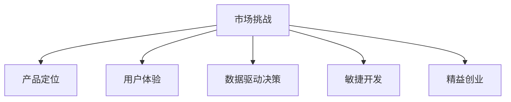

                 

# 市场挑战：创业者的必由之路

在纷繁复杂、瞬息万变的市场环境中，创业者面临着无数的挑战和不确定性。能否洞察并克服这些市场挑战，往往决定了一个创业项目的成败。本文将系统梳理创业过程中常见的市场挑战，分析其成因，提出应对策略，为创业者提供实用指导。

## 1. 背景介绍

### 1.1 市场挑战的多样性

市场挑战种类繁多，涵盖产品、技术、运营、法律、金融等多个维度。创业者需要在这些挑战中不断试错、学习和优化，才能逐步成长为成熟的市场决策者。

- **产品挑战**：如产品定位、用户体验、市场契合度等。
- **技术挑战**：如技术选型、研发效率、性能优化等。
- **运营挑战**：如用户获取、留存、增长等。
- **法律挑战**：如知识产权、隐私保护、合规性等。
- **金融挑战**：如资金筹集、投资回报、财务规划等。

### 1.2 市场挑战的复杂性

市场挑战不是孤立存在的，它们往往交织在一起，构成一个复杂的网络。例如，产品质量问题可能引发用户流失，进而影响市场份额和品牌信誉。此外，技术问题也可能导致运营效率低下，加剧资源紧张。

## 2. 核心概念与联系

### 2.1 核心概念概述

为更好地理解市场挑战及其应对策略，本节将介绍几个核心概念及其联系：

- **市场挑战**：指创业者在产品开发、运营推广、客户关系管理等过程中遇到的各种困难和问题。

- **产品定位**：确定产品目标用户、市场定位、核心功能等。产品定位是否准确，直接影响到产品的市场接受度和竞争力。

- **用户体验**：指用户使用产品的感受和体验。优秀的产品体验能够提高用户满意度和忠诚度，降低流失率。

- **数据驱动决策**：利用数据分析和数据模型，指导产品开发、市场推广和运营优化，提升决策效率和准确性。

- **敏捷开发**：通过快速迭代和持续反馈，快速响应市场变化和用户需求，提高产品开发效率和灵活性。

- **精益创业**：以最小可行产品(MVP)为起点，通过快速测试和验证市场反馈，快速迭代优化，降低资源浪费，提升成功率。

这些概念通过以下Mermaid流程图来展示：



这个流程图展示了一个典型创业项目可能面临的市场挑战与其核心概念之间的联系。

## 3. 核心算法原理 & 具体操作步骤

### 3.1 算法原理概述

市场挑战的应对策略通常涉及多维度的数据分析和决策，因此可以类比于数据科学中的机器学习流程：

1. **数据收集**：收集市场相关的数据，如用户反馈、市场趋势、竞争对手表现等。
2. **数据预处理**：清洗和整理数据，确保数据的准确性和完整性。
3. **特征工程**：从原始数据中提取关键特征，如用户行为、市场环境、技术指标等。
4. **模型构建**：选择合适的算法模型，如回归、分类、聚类等，构建预测或分类模型。
5. **模型训练**：利用历史数据训练模型，调整模型参数，优化模型性能。
6. **模型评估**：在验证集上评估模型效果，选择最优模型。
7. **模型应用**：将模型应用于实际市场决策中，指导产品优化、市场推广、客户管理等。

### 3.2 算法步骤详解

#### 3.2.1 数据收集

1. **用户数据**：通过问卷调查、用户行为分析等方式收集用户反馈和需求。
2. **市场数据**：收集市场规模、增长趋势、竞争格局、政策法规等信息。
3. **技术数据**：收集产品性能、开发进度、资源使用情况等技术指标。

#### 3.2.2 数据预处理

1. **数据清洗**：去除重复、噪声和异常值，确保数据的真实性和可靠性。
2. **数据转换**：对数据进行归一化、标准化等预处理，方便模型训练。
3. **数据整合**：将来自不同来源的数据进行整合，构建统一的数据视图。

#### 3.2.3 特征工程

1. **特征提取**：从原始数据中提取关键特征，如用户活跃度、转化率、市场份额等。
2. **特征选择**：选择最具代表性的特征，去除冗余和无关特征，提高模型效率。
3. **特征构建**：通过组合、变换等方式，生成新的特征，提升模型性能。

#### 3.2.4 模型构建

1. **回归模型**：用于预测数值型变量，如市场规模、用户增长率等。
2. **分类模型**：用于预测离散型变量，如用户流失概率、产品热销与否等。
3. **聚类模型**：用于分析用户群体的分布和特征，指导产品定位和市场细分。

#### 3.2.5 模型训练

1. **算法选择**：根据数据特点和问题类型，选择合适的算法。
2. **参数调优**：通过交叉验证等方法，调整模型参数，优化模型性能。
3. **模型评估**：在验证集上评估模型效果，选择最优模型。

#### 3.2.6 模型应用

1. **预测分析**：利用模型进行市场趋势预测、用户行为预测等。
2. **决策支持**：根据模型结果，制定产品优化、市场推广、客户管理等策略。
3. **实时监控**：通过数据流和实时计算，持续监控市场动态，快速响应变化。

### 3.3 算法优缺点

#### 3.3.1 优点

1. **系统性和科学性**：通过数据驱动的方法，使市场决策更加系统化和科学化。
2. **高效性**：利用算法模型，可以快速处理大量数据，提供精准的预测和决策支持。
3. **可解释性**：通过特征工程和模型解释，可以深入理解市场动态和用户行为。

#### 3.3.2 缺点

1. **数据依赖性**：模型的效果高度依赖于数据的质量和代表性，数据偏差可能导致模型失效。
2. **模型复杂性**：复杂模型需要较高的计算资源和时间，可能导致实际应用中的延迟和成本问题。
3. **过拟合风险**：模型在训练集上过拟合，可能导致在测试集上泛化性能不足。

### 3.4 算法应用领域

市场挑战的应对策略不仅适用于初创企业，对于成熟企业同样有效。其应用领域包括但不限于以下几个方面：

- **产品优化**：通过用户反馈和市场趋势，指导产品迭代和功能优化。
- **市场拓展**：通过竞争分析和技术预测，制定市场进入和扩张策略。
- **用户增长**：通过用户行为分析和转化率预测，提升用户获取和留存率。
- **品牌建设**：通过市场调研和品牌影响力分析，制定品牌定位和传播策略。

## 4. 数学模型和公式 & 详细讲解 & 举例说明

### 4.1 数学模型构建

在市场挑战应对中，常用的数学模型包括回归模型、分类模型、聚类模型等。这里以回归模型为例，介绍其构建和应用。

假设市场规模为 $Y$，影响因素包括用户增长率 $X_1$、市场竞争度 $X_2$、政策支持度 $X_3$ 等。可以构建如下线性回归模型：

$$ Y = \beta_0 + \beta_1 X_1 + \beta_2 X_2 + \beta_3 X_3 + \epsilon $$

其中 $\beta$ 为模型系数，$\epsilon$ 为误差项。

### 4.2 公式推导过程

1. **数据收集**：收集历史市场数据 $D = \{(x_i, y_i)\}_{i=1}^N$，其中 $x_i = [x_{i1}, x_{i2}, x_{i3}]$，$y_i$ 为市场规模。

2. **数据预处理**：对数据进行清洗、归一化等处理，确保数据质量。

3. **特征工程**：对原始数据进行特征提取，如用户增长率、市场竞争度等。

4. **模型训练**：利用最小二乘法等方法，求解模型系数 $\beta$，使模型误差最小化。

5. **模型评估**：在验证集上评估模型效果，选择最优模型。

6. **模型应用**：利用训练好的模型，对未来的市场规模进行预测。

### 4.3 案例分析与讲解

假设某创业公司想要预测未来一年的市场规模，已收集到过去五年的市场数据。通过上述步骤，可以构建一个线性回归模型，并利用该模型进行未来一年市场规模的预测。

## 5. 项目实践：代码实例和详细解释说明

### 5.1 开发环境搭建

为了实现市场预测模型，需要搭建Python开发环境。以下是具体步骤：

1. **安装Python**：下载并安装Python 3.x版本。
2. **安装依赖包**：通过pip安装Scikit-learn、NumPy、Pandas等常用库。
3. **设置开发环境**：创建虚拟环境，编写代码，设置路径和环境变量。

### 5.2 源代码详细实现

以下是基于Scikit-learn库的线性回归模型代码实现：

```python
from sklearn.linear_model import LinearRegression
import pandas as pd
import numpy as np

# 读取数据
data = pd.read_csv('market_data.csv')

# 特征工程
X = data[['growth_rate', 'competition_level', 'policy_support']]
y = data['market_size']

# 数据预处理
X = (X - X.mean()) / X.std()

# 模型训练
model = LinearRegression()
model.fit(X, y)

# 模型评估
score = model.score(X, y)
print('模型评估得分：', score)

# 模型应用
future_growth_rate = 0.1  # 假设未来一年的增长率为10%
future_competition_level = 0.2  # 假设未来一年的竞争度为20%
future_policy_support = 0.5  # 假设未来一年的政策支持度为50%

# 预测未来一年市场规模
future_market_size = model.predict([[future_growth_rate, future_competition_level, future_policy_support]])
print('未来一年市场规模预测：', future_market_size)
```

### 5.3 代码解读与分析

在上述代码中，首先使用Pandas库读取历史市场数据，并进行特征工程，提取关键特征。然后通过Scikit-learn库中的线性回归模型进行训练和评估，最后利用训练好的模型对未来一年市场规模进行预测。

## 6. 实际应用场景

### 6.1 电子商务

电子商务领域面临诸多市场挑战，如用户流失、库存管理、供应链优化等。通过数据分析和模型预测，可以帮助企业制定更有效的市场策略。

#### 6.1.1 用户流失预测

利用用户行为数据和历史流失数据，建立分类模型，预测用户流失概率。根据预测结果，及时采取措施，减少用户流失率。

#### 6.1.2 库存优化

通过市场规模预测和销售趋势分析，合理规划库存水平，减少库存积压和缺货情况。

#### 6.1.3 供应链优化

利用物流数据和市场趋势，优化供应链管理，提高物流效率和成本控制。

### 6.2 金融科技

金融科技领域面临的挑战包括风险管理、市场波动、客户服务等。通过数据分析和模型预测，可以帮助金融机构制定更稳健的策略。

#### 6.2.1 信用风险评估

利用用户信用记录和历史违约数据，建立回归模型，评估用户信用风险。根据评估结果，制定相应的授信策略。

#### 6.2.2 市场波动预测

通过市场数据和政策变化，预测股票、外汇等金融市场波动，指导投资决策。

#### 6.2.3 客户服务优化

利用用户反馈和市场分析，优化客户服务流程，提高客户满意度。

### 6.3 健康医疗

健康医疗领域面临的挑战包括患者管理、疾病预测、医疗资源优化等。通过数据分析和模型预测，可以帮助医疗机构制定更有效的策略。

#### 6.3.1 患者管理

通过患者就诊记录和历史数据，建立预测模型，预测患者的病情发展和治疗效果。根据预测结果，制定个性化的治疗方案。

#### 6.3.2 疾病预测

利用公共卫生数据和历史病例，建立回归模型，预测疾病流行趋势。根据预测结果，制定相应的防控措施。

#### 6.3.3 医疗资源优化

利用患者需求和医疗资源分布数据，优化医疗资源的配置和使用，提高医疗服务的可及性和效率。

### 6.4 未来应用展望

随着数据科学和机器学习技术的不断发展，市场挑战的应对策略将变得更加多样化和智能化。未来，以下技术将引领市场挑战应对的新趋势：

1. **大数据和云计算**：通过大数据技术和云计算平台，处理和分析海量数据，提升市场决策的精准性和效率。
2. **人工智能和深度学习**：利用深度学习和人工智能技术，构建更复杂和精准的预测模型，提升市场预测的准确性。
3. **物联网和边缘计算**：通过物联网设备和边缘计算技术，实现实时数据采集和处理，提升市场动态监测和响应速度。
4. **区块链和去中心化**：利用区块链和去中心化技术，保障市场数据的透明性和安全性，提升市场决策的可信度。

## 7. 工具和资源推荐

### 7.1 学习资源推荐

1. **《数据科学导论》**：一本全面介绍数据科学和机器学习的经典教材，适合初学者入门。
2. **《Python数据科学手册》**：一本详细介绍Python在数据科学和机器学习中应用的实用指南。
3. **Coursera《数据科学与机器学习》课程**：由斯坦福大学开设的在线课程，系统介绍数据科学和机器学习的核心概念和算法。
4. **Kaggle竞赛平台**：一个数据科学竞赛平台，提供大量真实世界的数据集和竞赛任务，帮助开发者提升实战能力。

### 7.2 开发工具推荐

1. **Jupyter Notebook**：一个开源的交互式编程环境，支持多种编程语言和数据科学库。
2. **GitHub**：一个全球最大的代码托管平台，提供代码版本控制和协作开发功能。
3. **Docker**：一个开源的容器化平台，支持应用程序的打包、部署和管理。
4. **PyCharm**：一个Python开发IDE，提供代码编辑、调试、测试等功能，提高开发效率。

### 7.3 相关论文推荐

1. **《大规模在线学习》**：由Andrew Ng等人撰写，介绍大规模在线学习算法和平台，适合了解大数据和机器学习的应用。
2. **《深度学习》**：由Ian Goodfellow等人撰写，全面介绍深度学习的原理和应用，适合深入理解深度学习算法。
3. **《机器学习实战》**：一本实用的机器学习实战指南，涵盖多种经典算法和案例。
4. **《数据挖掘导论》**：一本详细介绍数据挖掘技术和应用的经典教材，适合了解数据挖掘的基本概念和流程。

## 8. 总结：未来发展趋势与挑战

### 8.1 研究成果总结

本文系统介绍了市场挑战及其应对策略，提出了一套基于数据驱动和机器学习的解决方案。这些策略和方法不仅适用于初创企业，也适用于成熟企业。通过系统化的数据收集、处理和分析，市场决策可以变得更加科学和高效。

### 8.2 未来发展趋势

1. **数据规模不断扩大**：随着物联网和智能设备的普及，数据规模将不断扩大，市场决策的精准性和效率将得到提升。
2. **模型复杂度不断提高**：深度学习和人工智能技术将进一步普及，复杂模型将成为市场决策的主流。
3. **应用场景更加多样化**：市场挑战的应对策略将拓展到更多行业和应用场景，如医疗、教育、能源等。
4. **技术工具更加智能化**：大数据、云计算、人工智能等技术的结合，将使得市场决策更加智能化和自动化。

### 8.3 面临的挑战

1. **数据隐私和安全**：市场数据涉及用户隐私和企业机密，如何保障数据安全和隐私保护是一大挑战。
2. **数据质量和代表性**：市场数据的准确性和代表性直接影响模型的效果，如何确保数据质量是一大挑战。
3. **计算资源和时间**：复杂模型需要大量的计算资源和时间，如何高效利用计算资源是一大挑战。
4. **模型解释和透明性**：复杂模型的决策过程难以解释，如何提高模型透明性是一大挑战。
5. **算法偏见和公平性**：模型可能存在算法偏见，如何确保模型公平性是一大挑战。

### 8.4 研究展望

1. **数据隐私保护技术**：发展更加先进的数据隐私保护技术，保障数据安全和用户隐私。
2. **高效计算框架**：开发更加高效和智能的计算框架，提升数据处理和模型训练效率。
3. **可解释和透明性模型**：研究可解释性和透明性强的模型，提升模型的可信度和应用价值。
4. **公平性和伦理约束**：研究公平性模型和伦理约束机制，确保算法的公正和公平。

## 9. 附录：常见问题与解答

### Q1: 数据收集和预处理的重要性是什么？

A: 数据收集和预处理是市场挑战应对的基础，数据质量直接影响到模型效果和决策准确性。数据收集需全面且真实，数据预处理需清洗和归一化，确保数据可用性和一致性。

### Q2: 特征工程对模型效果有什么影响？

A: 特征工程是模型构建的关键步骤，通过特征选择和构建，可以提高模型的代表性和预测能力。合理的特征工程可提升模型精度和泛化能力，降低模型过拟合风险。

### Q3: 如何评估模型效果？

A: 模型评估是模型构建的重要环节，通过在验证集上评估模型效果，选择最优模型。常用的评估指标包括准确率、精确率、召回率、F1分数等，需根据具体问题选择合适指标。

### Q4: 在实际应用中，如何确保数据安全和隐私保护？

A: 在数据收集和处理过程中，需采取数据加密、匿名化等措施，确保数据安全和隐私保护。同时，建立完善的数据访问和审计机制，防止数据滥用。

### Q5: 如何高效利用计算资源？

A: 在模型训练和预测过程中，需优化算法和数据结构，减少计算资源消耗。同时，利用并行计算和分布式计算技术，提升计算效率和扩展性。

---

作者：禅与计算机程序设计艺术 / Zen and the Art of Computer Programming

