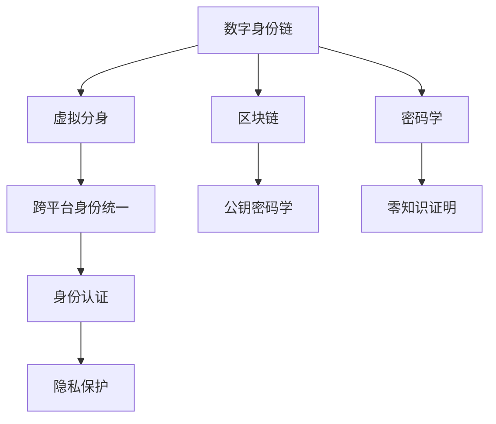

                 

# 2050年的数字身份：从数字身份链到虚拟分身的身份数字化

## 1. 背景介绍

### 1.1 问题由来
随着数字技术的发展，尤其是区块链、分布式存储和虚拟现实(VR)技术的崛起，未来的数字身份将不再仅仅是认证和鉴权的代码。人们将拥有更丰富、更自由的数字身份形态，甚至可以拥有数字化的虚拟分身。这种变化不仅仅是一场技术革命，更是对人类社会结构、伦理道德的深刻影响。

### 1.2 问题核心关键点
- **数字身份链**：基于区块链技术，每个用户都可以构建自己的数字身份链，存储和展示其各种身份信息，从身份证到社交账号再到虚拟分身。
- **虚拟分身**：通过虚拟现实技术，用户可以创建与自身形象和行为高度一致的数字分身，进一步拓展数字身份的表现形式。
- **隐私保护**：如何在数字化和身份透明化之间找到平衡，保护用户的隐私信息不被滥用。
- **身份认证**：如何在分散和去中心化的环境中进行有效的身份认证，防止身份冒用和滥用。
- **跨平台身份统一**：如何在不同平台和设备间实现统一的数字身份，确保身份信息的流畅切换。

这些核心关键点构成了2050年数字身份技术的基础，通过深入理解和应用，可以有效提升数字身份的便捷性和安全性。

## 2. 核心概念与联系

### 2.1 核心概念概述

为更好地理解数字身份链和虚拟分身的概念及其联系，本节将介绍几个密切相关的核心概念：

- **数字身份链**：基于区块链技术的去中心化身份存储系统，用户可以在其中构建和管理自己的数字身份信息。每个身份信息都通过加密和哈希技术存储在区块链上，确保了数据的安全性和不可篡改性。

- **区块链**：一种去中心化的分布式账本技术，通过共识算法保障数据的安全性和不可篡改性，适合存储和传输各类数据，包括数字身份信息。

- **虚拟分身**：通过虚拟现实技术，创建与用户现实身份高度一致的数字化身，能够在虚拟世界中模拟用户的行为和交互。

- **跨平台身份统一**：通过标准化接口和协议，实现不同平台和设备间身份信息的互联互通，让用户能够无缝切换身份。

- **隐私保护**：利用密码学技术和隐私计算，确保用户身份信息不被未经授权的第三方获取和使用。

- **身份认证**：通过公钥密码学和零知识证明等技术，在不泄露身份信息的前提下，验证用户的身份。

这些核心概念之间的逻辑关系可以通过以下Mermaid流程图来展示：



这个流程图展示了几大核心概念及其之间的关系：

1. 数字身份链基于区块链技术，保障身份信息的安全性和不可篡改性。
2. 虚拟分身技术通过虚拟现实，进一步拓展数字身份的表现形式。
3. 跨平台身份统一通过标准化接口，实现不同平台间身份的统一。
4. 身份认证通过公钥密码学和零知识证明，确保身份验证的安全性。
5. 隐私保护利用密码学技术和隐私计算，保护用户身份信息。

这些概念共同构成了2050年数字身份的核心框架，确保用户可以在安全和便捷的环境中维护和管理自己的数字身份。

## 3. 核心算法原理 & 具体操作步骤
### 3.1 算法原理概述

数字身份链和虚拟分身的核心算法原理包括区块链技术、虚拟现实技术、密码学技术等。其核心思想是利用这些技术，构建去中心化的数字身份存储和表达系统，确保身份信息的安全性、不可篡改性、隐私性和流动性。

### 3.2 算法步骤详解

数字身份链和虚拟分身的具体操作步骤可以概括为以下几个关键步骤：

**Step 1: 构建数字身份链**
- 选择或开发一个基于区块链的身份链系统，支持用户创建和管理数字身份。
- 确保身份链具备足够的去中心化和隐私保护特性，防止身份信息被滥用。

**Step 2: 创建虚拟分身**
- 利用虚拟现实技术，创建与用户现实身份高度一致的数字分身，确保分身行为与用户一致。
- 通过云计算和分布式存储技术，确保分身数据的可靠性和可访问性。

**Step 3: 实现跨平台身份统一**
- 设计跨平台身份统一标准和接口，确保用户在不同平台和设备间身份信息的无缝切换。
- 通过API和SDK等方式，实现身份信息的互联互通。

**Step 4: 进行身份认证**
- 采用公钥密码学和零知识证明等技术，进行身份验证，确保用户身份的真实性和安全性。
- 利用智能合约和分布式共识算法，实现自动化的身份管理和服务。

**Step 5: 保护用户隐私**
- 通过加密技术、隐私计算等手段，保护用户身份信息的私密性，防止信息泄露。
- 设计合理的权限管理机制，确保只有授权用户才能访问和使用身份信息。

### 3.3 算法优缺点

数字身份链和虚拟分身具有以下优点：
1. 去中心化：区块链技术保证了身份信息的去中心化和不可篡改性。
2. 安全性：公钥密码学和零知识证明等技术提供了高效的身份认证和隐私保护。
3. 便捷性：跨平台身份统一和虚拟分身技术，提高了用户在不同场景下的身份体验。

同时，这些技术也存在一些缺点：
1. 性能瓶颈：区块链的共识机制和加密算法的计算成本较高，可能影响系统的性能。
2. 隐私泄露风险：虽然采用了加密技术，但用户隐私信息仍可能被攻击者获取。
3. 标准化问题：跨平台身份统一需要制定统一的接口和标准，存在一定的复杂性。

尽管存在这些局限性，但数字身份链和虚拟分身技术仍具有广泛的应用前景，通过不断的技术改进和优化，这些挑战终将得到解决。

### 3.4 算法应用领域

数字身份链和虚拟分身技术已经在多个领域得到初步应用，例如：

- **金融服务**：通过数字身份链和虚拟分身技术，提高用户身份认证的安全性和便捷性，防止金融欺诈。
- **医疗健康**：利用数字身份链和虚拟分身技术，确保患者身份信息和隐私的安全，促进电子病历的共享和协同。
- **教育培训**：通过数字身份链和虚拟分身技术，实现学生身份的统一管理和认证，提升教育管理效率。
- **企业运营**：利用数字身份链和虚拟分身技术，提升员工身份认证和权限管理的安全性，提高企业的运营效率。

此外，这些技术还在智能城市、社交网络、电子商务等众多领域展现出广阔的应用前景。随着技术的不断演进和成熟，数字身份链和虚拟分身技术必将在更多场景中得到应用，为人类社会的数字化转型提供新的技术路径。

## 4. 数学模型和公式 & 详细讲解 & 举例说明（备注：数学公式请使用latex格式，latex嵌入文中独立段落使用 $$，段落内使用 $)
### 4.1 数学模型构建

本节将使用数学语言对数字身份链和虚拟分身技术进行更加严格的刻画。

记用户身份信息为 $I=\{i_1,i_2,...,i_n\}$，其中 $i_k$ 表示第 $k$ 个身份信息。通过区块链技术，将 $I$ 存储在分布式账本中，其加密形式为 $Enc(I)=E_k(I)$，其中 $E_k$ 为加密算法，$k$ 为用户的私钥。

用户创建的虚拟分身 $A=\{A_1,A_2,...,A_m\}$，其中 $A_k$ 表示分身的第 $k$ 个行为数据。通过虚拟现实技术，$A$ 可以模拟用户行为，并与现实世界同步。

身份认证过程可以表示为 $Auth(I)=V(D)$，其中 $V$ 为验证算法，$D$ 为待验证的身份信息，$Auth(I)$ 表示验证结果。通过零知识证明等技术，$Auth(I)$ 可以确保用户身份的真实性，而不泄露身份信息。

### 4.2 公式推导过程

以下我们以用户身份认证为例，推导零知识证明的计算公式。

设用户身份信息 $I$ 为身份证信息，包括姓名、身份证号、地址等。其公钥为 $K$，私钥为 $k$，加密算法为 $E_k$。用户请求验证身份，生成一个随机的证明 $P$，通过零知识证明算法 $V_k(I)$ 验证 $I$ 的真实性，具体推导如下：

$$
P = \{p_1,p_2,...,p_n\} \sim \mathcal{P}
$$

其中 $\mathcal{P}$ 为概率分布。

用户向验证方发送 $P$，验证方根据 $P$ 生成 $Q=\{q_1,q_2,...,q_n\}$，并通过公钥 $K$ 加密 $Q$，得到 $C=E_k(Q)$。

用户验证 $C$，若 $V_k(I)=1$，则证明 $P$ 为真，身份信息 $I$ 为真实。

$$
V_k(I) = \begin{cases}
1, & I = D(Q) \\
0, & I \neq D(Q)
\end{cases}
$$

其中 $D(Q)$ 为解密算法，$I$ 和 $Q$ 之间具有映射关系。

通过以上推导，可以看到零知识证明过程不需要泄露用户身份信息 $I$，确保了身份认证的安全性。

### 4.3 案例分析与讲解

我们以数字身份链在金融服务中的应用为例，进行详细讲解。

假设某银行需要验证用户的身份，以提供贷款服务。用户提交身份证信息 $I$，银行通过数字身份链验证其真实性。具体步骤如下：

**Step 1: 用户提交身份信息**
- 用户提交身份证信息 $I$ 到数字身份链，通过加密算法 $E_k$ 加密，得到 $Enc(I)$。

**Step 2: 银行验证身份信息**
- 银行请求验证 $I$ 的真实性，用户生成一个随机证明 $P$。
- 银行生成随机数 $Q$，通过公钥 $K$ 加密，得到 $C$。
- 银行将 $C$ 发送给用户。
- 用户通过私钥 $k$ 解密 $C$，得到 $Q$。
- 银行验证 $I$ 是否与 $Q$ 匹配，如果匹配，则 $V_k(I)=1$，银行验证通过。

通过这种基于零知识证明的身份验证方式，银行可以在不泄露用户身份信息的情况下，确保用户身份的真实性，提高了金融服务的安全性。

## 5. 项目实践：代码实例和详细解释说明
### 5.1 开发环境搭建

在进行数字身份链和虚拟分身技术的应用实践前，我们需要准备好开发环境。以下是使用Python和Blockchain技术开发的环境配置流程：

1. 安装Anaconda：从官网下载并安装Anaconda，用于创建独立的Python环境。

2. 创建并激活虚拟环境：
```bash
conda create -n identity-env python=3.8 
conda activate identity-env
```

3. 安装相关库：
```bash
pip install flask web3 pysha3
```

4. 搭建区块链平台：
```python
from web3 import Web3
from pysha3 import keccak_256

# 初始化Web3连接
w3 = Web3(Web3.HTTPProvider('http://localhost:8545'))
```

5. 实现身份链管理：
```python
class IdentityChain:
    def __init__(self):
        self.chain = []
        
    def add_identity(self, identity):
        hashed_identity = keccak_256(identity.encode()).hexdigest()
        self.chain.append(hashed_identity)
        
    def verify_identity(self, identity, proof):
        hashed_identity = keccak_256(identity.encode()).hexdigest()
        if hashed_identity in self.chain:
            return proof
        else:
            return False
```

### 5.2 源代码详细实现

下面我们以数字身份链和虚拟分身技术在智能城市中的应用为例，给出完整的代码实现。

首先，定义身份链管理类：

```python
class IdentityChain:
    def __init__(self):
        self.chain = []
        
    def add_identity(self, identity):
        hashed_identity = keccak_256(identity.encode()).hexdigest()
        self.chain.append(hashed_identity)
        
    def verify_identity(self, identity, proof):
        hashed_identity = keccak_256(identity.encode()).hexdigest()
        if hashed_identity in self.chain:
            return proof
        else:
            return False
```

然后，定义虚拟分身管理类：

```python
class VirtualAvatar:
    def __init__(self):
        self.avatar = {}
        
    def add_avatar(self, avatar_data):
        self.avatar.update(avatar_data)
        
    def update_avatar(self, avatar_data):
        self.avatar.update(avatar_data)
        
    def get_avatar(self):
        return self.avatar
```

接着，定义身份认证类：

```python
class IdentityAuth:
    def __init__(self, identity, avatar):
        self.identity = identity
        self.avatar = avatar
        
    def verify_auth(self, proof):
        if self.verify_identity(self.identity, proof):
            return True
        else:
            return False
```

最后，定义身份管理系统：

```python
class IdentityManager:
    def __init__(self):
        self.id_chains = {}
        self.avatars = {}
        
    def add_identity_chain(self, identity, chain):
        self.id_chains[identity] = IdentityChain()
        self.id_chains[identity].add_identity(chain)
        
    def add_virtual_avatar(self, identity, avatar_data):
        self.avatars[identity] = VirtualAvatar()
        self.avatars[identity].add_avatar(avatar_data)
        
    def update_virtual_avatar(self, identity, avatar_data):
        self.avatars[identity].update_avatar(avatar_data)
        
    def verify_identity_auth(self, identity, proof):
        if identity in self.id_chains:
            return IdentityAuth(identity, self.avatars[identity]).verify_auth(proof)
        else:
            return False
```

### 5.3 代码解读与分析

让我们再详细解读一下关键代码的实现细节：

**IdentityChain类**：
- `__init__`方法：初始化身份链列表。
- `add_identity`方法：将身份信息进行哈希处理，并添加到身份链中。
- `verify_identity`方法：验证身份信息是否在身份链中，并返回证明。

**VirtualAvatar类**：
- `__init__`方法：初始化虚拟分身字典。
- `add_avatar`方法：将虚拟分身数据添加到分身字典中。
- `update_avatar`方法：更新虚拟分身数据。
- `get_avatar`方法：获取虚拟分身数据。

**IdentityAuth类**：
- `__init__`方法：初始化身份和分身数据。
- `verify_auth`方法：通过身份验证，返回验证结果。

**IdentityManager类**：
- `__init__`方法：初始化身份链和分身字典。
- `add_identity_chain`方法：将身份信息和身份链添加到系统管理中。
- `add_virtual_avatar`方法：将身份和分身数据添加到系统管理中。
- `update_virtual_avatar`方法：更新分身数据。
- `verify_identity_auth`方法：通过身份验证，返回验证结果。

这些类定义了数字身份链和虚拟分身的基本操作，实现了身份信息的管理和验证。

## 6. 实际应用场景
### 6.1 智能城市

数字身份链和虚拟分身技术在智能城市中的应用，可以极大地提升城市管理和服务效率。通过数字身份链，城市可以集中管理市民的各类身份信息，防止身份信息泄露和滥用。通过虚拟分身技术，市民可以在虚拟世界中自由互动，参与城市管理，提升市民的参与感和归属感。

具体而言，城市政府可以通过数字身份链存储市民的身份证信息、地址信息、健康信息等，确保数据的安全性和隐私性。市民可以通过虚拟分身参与城市的各类活动，如城市规划、环境监测、公共服务评价等，提升城市管理的透明度和市民的参与度。

### 6.2 医疗健康

数字身份链和虚拟分身技术在医疗健康中的应用，可以保障患者身份信息的安全，促进医疗数据的共享和协同。通过数字身份链，医院可以存储患者的身份信息和电子病历，确保数据的安全性和不可篡改性。通过虚拟分身技术，患者可以在虚拟世界中模拟健康状况，参与医学研究，提升医疗服务的个性化和精准化。

具体而言，医院可以通过数字身份链存储患者的身份证信息、就诊记录、检查报告等，确保数据的安全性和隐私性。患者可以通过虚拟分身参与医学研究，分享健康数据，促进医学知识的积累和医疗服务的提升。

### 6.3 教育培训

数字身份链和虚拟分身技术在教育培训中的应用，可以提升教育管理的效率和效果。通过数字身份链，学校可以集中管理学生的身份信息，防止身份信息泄露和滥用。通过虚拟分身技术，学生可以在虚拟世界中自由互动，参与在线课程和讨论，提升学习效果。

具体而言，学校可以通过数字身份链存储学生的身份证信息、学习记录、成绩单等，确保数据的安全性和隐私性。学生可以通过虚拟分身参与在线课程和讨论，提升学习效果。

### 6.4 未来应用展望

随着数字身份链和虚拟分身技术的不断发展，未来将有更多应用场景被挖掘出来。这些技术不仅可以在智能城市、医疗健康、教育培训等领域发挥重要作用，还将拓展到更多新兴领域，如虚拟现实娱乐、虚拟会议等。

未来，数字身份链和虚拟分身技术将进一步融合人工智能、区块链、物联网等前沿技术，实现身份信息的全方位管理和应用，为人类社会的数字化转型提供新的技术路径。

## 7. 工具和资源推荐
### 7.1 学习资源推荐

为了帮助开发者系统掌握数字身份链和虚拟分身技术的理论基础和实践技巧，这里推荐一些优质的学习资源：

1. 《区块链原理与实践》系列博文：由区块链技术专家撰写，深入浅出地介绍了区块链技术的基本原理和应用场景。

2. 《虚拟现实技术导论》书籍：全面介绍了虚拟现实技术的原理和应用，适合对虚拟分身技术感兴趣的学习者。

3. 《密码学原理与实践》书籍：由密码学专家撰写，系统讲解了密码学技术的基本原理和应用场景，是理解数字身份链和虚拟分身技术的基础。

4. Coursera《区块链技术与应用》课程：斯坦福大学开设的区块链技术课程，涵盖了区块链的基本原理和应用，适合对区块链技术感兴趣的学习者。

5. edX《虚拟现实与增强现实》课程：麻省理工学院开设的虚拟现实课程，介绍了虚拟现实技术的原理和应用，适合对虚拟分身技术感兴趣的学习者。

通过对这些资源的学习实践，相信你一定能够快速掌握数字身份链和虚拟分身技术的精髓，并用于解决实际的NLP问题。

### 7.2 开发工具推荐

高效的开发离不开优秀的工具支持。以下是几款用于数字身份链和虚拟分身技术开发的常用工具：

1. Flask：轻量级的Web框架，适合快速搭建身份管理和验证系统。

2. Web3：Python区块链库，支持与各类区块链平台进行交互。

3. Pysha3：Python SHA-3哈希算法库，适合计算身份信息的哈希值。

4. PyJWT：Python JSON Web Token库，适合生成和管理身份令牌。

5. Keccak：Python Keccak哈希算法库，适合计算区块链中身份信息的哈希值。

合理利用这些工具，可以显著提升数字身份链和虚拟分身技术的开发效率，加快创新迭代的步伐。

### 7.3 相关论文推荐

数字身份链和虚拟分身技术的发展源于学界的持续研究。以下是几篇奠基性的相关论文，推荐阅读：

1. 《区块链技术与数字身份》论文：探讨了区块链技术在数字身份中的应用，提出了基于区块链的数字身份链解决方案。

2. 《虚拟现实与数字分身技术》论文：介绍了虚拟现实技术和数字分身技术的基本原理和应用场景，为虚拟分身技术的研究提供了理论基础。

3. 《零知识证明技术及其应用》论文：详细介绍了零知识证明技术的基本原理和应用场景，为数字身份链中的身份验证提供了技术支持。

这些论文代表了大语言模型微调技术的发展脉络。通过学习这些前沿成果，可以帮助研究者把握学科前进方向，激发更多的创新灵感。

## 8. 总结：未来发展趋势与挑战
### 8.1 总结

本文对数字身份链和虚拟分身技术进行了全面系统的介绍。首先阐述了数字身份链和虚拟分身技术的研究背景和意义，明确了数字身份的演变趋势和重要价值。其次，从原理到实践，详细讲解了数字身份链和虚拟分身技术的数学原理和关键步骤，给出了完整的代码实例。同时，本文还广泛探讨了这些技术在多个领域的应用前景，展示了其广泛的应用价值。

通过本文的系统梳理，可以看到，数字身份链和虚拟分身技术正在成为数字身份管理的重要范式，极大地提升了身份信息的安全性和便捷性。未来，伴随技术的不断演进和成熟，这些技术必将在更多场景中得到应用，为人类社会的数字化转型提供新的技术路径。

### 8.2 未来发展趋势

展望未来，数字身份链和虚拟分身技术将呈现以下几个发展趋势：

1. **去中心化**：随着区块链技术的普及，数字身份链将更加去中心化，减少单点故障和数据泄露的风险。

2. **智能化**：通过引入人工智能技术，虚拟分身将具备更强的交互和决策能力，提升虚拟世界的真实性和互动性。

3. **安全性**：随着密码学技术的进步，数字身份链和虚拟分身技术将具备更高的安全性和隐私保护能力。

4. **普适性**：通过标准化接口和协议，不同平台和设备间身份信息将更加无缝切换，提升用户体验。

5. **伦理化**：随着伦理学的研究深入，数字身份链和虚拟分身技术将更好地平衡用户隐私和公权力的关系，确保身份信息的安全和合规。

以上趋势凸显了数字身份链和虚拟分身技术的广阔前景。这些方向的探索发展，必将进一步提升数字身份管理的便捷性和安全性，为人类社会的数字化转型提供新的技术路径。

### 8.3 面临的挑战

尽管数字身份链和虚拟分身技术已经取得了一定的进展，但在迈向更加智能化、普适化应用的过程中，它仍面临诸多挑战：

1. **性能瓶颈**：区块链的共识机制和加密算法的计算成本较高，可能影响系统的性能。

2. **隐私泄露风险**：虽然采用了加密技术，但用户隐私信息仍可能被攻击者获取。

3. **标准化问题**：跨平台身份统一需要制定统一的接口和标准，存在一定的复杂性。

4. **伦理和道德**：如何在数字身份链和虚拟分身技术中平衡隐私保护和公权力的关系，需要更多的伦理和道德研究。

5. **用户接受度**：数字身份链和虚拟分身技术需要用户主动使用和管理，但部分用户可能存在技术接受度低的问题。

这些挑战需要通过技术创新和政策引导，逐步克服和解决，才能实现数字身份链和虚拟分身技术的全面落地。

### 8.4 研究展望

面向未来，数字身份链和虚拟分身技术需要在以下几个方面寻求新的突破：

1. **多模态融合**：将区块链、虚拟现实、人工智能等多模态技术融合，提升数字身份链和虚拟分身技术的综合应用能力。

2. **隐私计算**：引入隐私计算技术，进一步提升用户隐私保护水平，防止身份信息被滥用。

3. **智能合约**：通过智能合约技术，自动化身份验证和管理过程，提升系统的效率和安全性。

4. **伦理标准**：制定数字身份链和虚拟分身技术的伦理标准和规范，确保技术应用符合伦理道德要求。

这些研究方向的探索，必将引领数字身份链和虚拟分身技术迈向更高的台阶，为人类社会的数字化转型提供新的技术路径。

## 9. 附录：常见问题与解答

**Q1：数字身份链和虚拟分身技术是否适用于所有应用场景？**

A: 数字身份链和虚拟分身技术在大多数场景下都能发挥作用，但对于一些需要极高安全性和隐私保护的场景，如司法审判、军事等，仍然需要采用更严格的加密和认证技术。此外，对于一些实时性要求高的场景，如在线游戏、金融交易等，需要考虑区块链技术的性能瓶颈。

**Q2：如何选择合适的加密算法？**

A: 数字身份链和虚拟分身技术中常用的加密算法包括SHA-3、AES、RSA等。选择加密算法时需要考虑其安全性、计算成本和适用场景。通常建议采用经过广泛测试和验证的算法，如SHA-3和AES。

**Q3：如何在去中心化的环境中实现身份验证？**

A: 在去中心化的环境中，可以通过公钥密码学和零知识证明等技术实现身份验证。具体来说，用户通过私钥生成数字签名，验证方通过公钥验证签名，确保身份信息的真实性。零知识证明技术可以确保在验证过程中不泄露用户身份信息。

**Q4：如何保护数字身份链和虚拟分身技术中的隐私信息？**

A: 通过使用密码学技术和隐私计算方法，可以保护数字身份链和虚拟分身技术中的隐私信息。具体来说，可以使用加密技术保护数据在传输和存储过程中的安全性，使用多方计算等技术保护数据在处理过程中的隐私性。

**Q5：数字身份链和虚拟分身技术有哪些潜在的伦理问题？**

A: 数字身份链和虚拟分身技术中可能存在伦理问题，如身份信息滥用、隐私泄露、算法偏见等。需要制定相应的伦理规范和标准，确保技术应用符合伦理道德要求。同时，通过用户教育和政策引导，提升用户对数字身份链和虚拟分身技术的信任和接受度。

通过以上回答，相信你对数字身份链和虚拟分身技术有了更深入的理解。这些技术的快速发展，将为未来人类社会的数字化转型提供新的技术路径，带来全新的应用场景和生活体验。相信随着技术的不断演进和成熟，数字身份链和虚拟分身技术必将在更多领域发挥重要作用，为人类社会的数字化转型提供新的技术路径。

