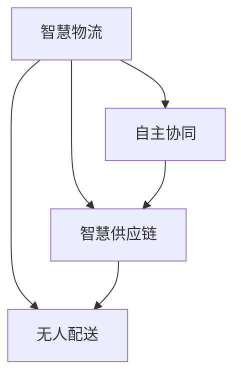

                 

# 2050年的智慧物流：从无人配送到自主协同的智慧供应链

> 关键词：智慧物流,无人配送,自主协同,智慧供应链,物联网,区块链,自动化,智能调度,协同优化

## 1. 背景介绍

在科技迅猛发展的今天，物流行业正处于一场革命性的变革之中。从传统的仓储和配送，到如今的智慧物流，物流产业正在经历从机械化到自动化，再到智能化的转变。随着物联网、大数据、云计算、人工智能等技术的不断成熟和应用，智慧物流的概念逐渐从概念走向现实，开启了智能化的新篇章。

### 1.1 现状与挑战
当前，全球物流行业面临着诸多挑战：

- **效率低下**：传统物流配送链条长、环节多、效率低下，导致运输成本高昂。
- **资源浪费**：仓储和配送过程中资源利用率不高，导致能源、时间和人力等资源的巨大浪费。
- **信息孤岛**：物流各环节的信息孤立，导致数据难以互通和共享，增加了管理复杂性。
- **安全问题**：配送过程中存在安全隐患，货物丢失、损毁等风险难以规避。
- **用户体验差**：配送过程中难以实时掌握货物状态，客户满意度低。

为解决这些问题，智慧物流应运而生，旨在通过技术手段提升物流效率、降低成本、提高安全性，最终实现全流程的智能化和自动化。

### 1.2 发展趋势
未来，智慧物流将朝着以下几个方向发展：

- **无人配送**：通过无人车、无人机等技术，实现货物的高效配送。
- **自主协同**：通过物联网、人工智能等技术，实现物流网络的自主协同和优化。
- **智慧供应链**：通过区块链、大数据等技术，构建智慧供应链，实现上下游的协同和优化。
- **智能化调度**：通过算法优化和智能调度系统，实现货物的动态优化和调度。

本文将重点探讨2050年智慧物流从无人配送到自主协同的智慧供应链的建设路径和实现方法。

## 2. 核心概念与联系

### 2.1 核心概念概述

为更好地理解智慧物流的构建过程，本节将介绍几个密切相关的核心概念：

- **智慧物流(Wisdom Logistics)**：通过物联网、大数据、云计算、人工智能等技术手段，实现物流全流程的智能化和自动化。
- **无人配送(Unmanned Delivery)**：利用无人驾驶车辆、无人机等技术，实现货物无人化配送。
- **自主协同(Self-Coordination)**：通过物联网、区块链、大数据等技术，实现物流网络中各环节的自主协同和优化。
- **智慧供应链(Wisdom Supply Chain)**：通过区块链、物联网等技术，构建跨行业、跨地域的智慧供应链网络。

这些核心概念之间的逻辑关系可以通过以下Mermaid流程图来展示：



这个流程图展示了这个概念之间的联系：智慧物流涵盖无人配送、自主协同和智慧供应链三个主要组成部分，通过它们之间的协同，实现物流的全面智能化。

## 3. 核心算法原理 & 具体操作步骤
### 3.1 算法原理概述

智慧物流的核心算法原理主要涉及以下几个方面：

- **路径规划算法**：通过优化路径，实现配送效率的最大化。
- **需求预测算法**：通过对历史数据的分析，预测未来的物流需求，实现资源的最优配置。
- **智能调度算法**：通过优化调度策略，实现货物在物流网络中的动态优化和高效分配。
- **自动化控制系统**：通过传感器、控制系统等技术，实现无人配送的自主控制。

### 3.2 算法步骤详解

智慧物流的构建通常包括以下几个关键步骤：

**Step 1: 数据采集与处理**

- **传感器部署**：在配送车辆、仓储设施、货物包装等关键位置安装传感器，实时采集位置、状态、环境等数据。
- **数据整合与清洗**：将采集到的数据整合至统一的平台上，进行清洗和处理，确保数据的准确性和完整性。

**Step 2: 智能路径规划**

- **数据输入**：将处理后的数据输入至路径规划算法中，包括起点、终点、时间窗等参数。
- **路径生成**：利用算法生成最优路径，考虑交通状况、配送顺序等因素。
- **路径优化**：根据实时数据，动态调整路径，避免拥堵和延误。

**Step 3: 智能调度与优化**

- **资源分配**：根据需求预测结果，分配配送车辆、仓储空间等资源。
- **任务分配**：将任务分配给适合的配送人员或机器，考虑人员和机器的负载和效率。
- **调度优化**：通过算法优化调度策略，实现资源的动态调整和任务的高效执行。

**Step 4: 无人配送与控制**

- **无人车/无人机部署**：根据路径规划和调度结果，部署无人车/无人机进行配送。
- **自主控制**：利用控制系统实现无人车/无人机的自主导航、避障、货物装载等功能。
- **实时监控**：通过传感器和控制系统，实时监控无人车/无人机的状态，确保配送过程的安全和准确。

**Step 5: 智慧供应链构建**

- **数据共享**：在供应链各环节之间建立数据共享机制，实现数据的互通和共享。
- **区块链应用**：利用区块链技术，记录和验证供应链各环节的操作和数据，确保数据的安全和透明。
- **协同优化**：通过算法优化供应链各环节的协同，实现整体效率的提升。

### 3.3 算法优缺点

智慧物流的构建算法具有以下优点：

- **高效性**：通过算法优化，可以实现物流效率的最大化，减少资源浪费。
- **灵活性**：算法能够动态调整和优化，适应不同的物流场景和需求。
- **安全性**：通过实时监控和自主控制，可以有效避免配送过程中的安全隐患。

同时，这些算法也存在一些局限性：

- **复杂性**：算法设计和实现较为复杂，需要大量的技术支持和资源投入。
- **数据依赖**：算法的准确性和效果依赖于数据的质量和完整性，数据采集和处理的难度较大。
- **高成本**：传感器、控制系统等设备的成本较高，初期投入较大。

尽管如此，智慧物流通过算法优化，可以在不增加大量人力物力的情况下，实现物流效率的大幅提升，因此具有广阔的应用前景。

### 3.4 算法应用领域

智慧物流的算法广泛应用于物流的各个环节，如：

- **仓储管理**：通过智能调度算法和自动化控制系统，实现仓储自动化，提升仓储效率和准确性。
- **配送优化**：通过路径规划和智能调度算法，实现配送路径的最优化，提升配送效率。
- **供应链协同**：通过区块链和数据共享技术，实现供应链各环节的信息互通和协同优化。
- **安全监控**：通过传感器和控制系统，实现物流全过程的实时监控，保障物流安全。

## 4. 数学模型和公式 & 详细讲解 & 举例说明（备注：数学公式请使用latex格式，latex嵌入文中独立段落使用 $$，段落内使用 $)
### 4.1 数学模型构建

智慧物流的构建涉及多个数学模型，其中最核心的包括路径规划、需求预测和智能调度等。

#### 4.1.1 路径规划模型

**目标函数**：

$$
\min_{x} \left\{ \sum_{i=1}^n (x_i-x_{i-1})^2 \right\}
$$

**约束条件**：

$$
\begin{cases}
x_0 = s\\
x_n = d\\
x_i \in [0, l]\\
x_{i-1} \leq x_i \leq x_{i+1}
\end{cases}
$$

其中 $s$ 为起点，$d$ 为终点，$x_i$ 为第 $i$ 个节点的位置，$l$ 为路线的最大长度。

#### 4.1.2 需求预测模型

**时间序列模型**：

$$
y_t = \alpha + \beta x_t + \gamma y_{t-1} + \epsilon_t
$$

**回归模型**：

$$
y = \beta_0 + \beta_1 x_1 + \beta_2 x_2 + ... + \beta_p x_p + \epsilon
$$

其中 $y_t$ 为第 $t$ 天的需求量，$x_t$ 为第 $t$ 天的特征，$\alpha$、$\beta$ 为模型参数。

#### 4.1.3 智能调度模型

**线性规划模型**：

$$
\begin{aligned}
\min_{x} & \quad \sum_{i=1}^n x_i\\
\text{s.t.} & \quad \sum_{i=1}^n x_i \geq d\\
& \quad \sum_{i=1}^n x_i \leq l\\
& \quad x_i \geq 0
\end{aligned}
$$

**整数规划模型**：

$$
\begin{aligned}
\min_{x} & \quad \sum_{i=1}^n x_i\\
\text{s.t.} & \quad \sum_{i=1}^n x_i \geq d\\
& \quad \sum_{i=1}^n x_i \leq l\\
& \quad x_i \in \{0,1\}
\end{aligned}
$$

其中 $x_i$ 为第 $i$ 个任务的状态，$d$ 为需求量，$l$ 为资源上限。

### 4.2 公式推导过程

以路径规划模型为例，进行详细推导：

**目标函数**：

$$
\min_{x} \left\{ \sum_{i=1}^n (x_i-x_{i-1})^2 \right\}
$$

表示在起点到终点的所有节点中，路径长度最短。

**约束条件**：

$$
\begin{cases}
x_0 = s\\
x_n = d\\
x_i \in [0, l]\\
x_{i-1} \leq x_i \leq x_{i+1}
\end{cases}
$$

表示路径必须从起点 $s$ 开始，到终点 $d$ 结束，且每个节点的位置必须在 $[0, l]$ 范围内，并且相邻节点之间的位置满足递增或递减的关系。

### 4.3 案例分析与讲解

以某城市配送中心到客户端的物流为例，进行分析：

假设配送中心位于 $s=(0,0)$，客户端位于 $d=(10,10)$，每条边的最大长度为 $l=5$，路径长度最短且为整数。

**Step 1: 数据采集与处理**

在配送车和客户端安装传感器，实时采集位置数据。

**Step 2: 路径规划**

将采集到的数据输入路径规划算法，生成最优路径。

假设路径规划算法得到的路径为 $x_0, x_1, x_2, x_3, x_4, x_5, x_6, x_7, x_8, x_9, x_{10}$。

**Step 3: 智能调度**

根据需求预测结果，分配配送车辆。假设需求量为 $d=3$。

假设智能调度算法将任务分配给配送车辆 $x_0, x_3, x_6, x_9$。

**Step 4: 无人配送与控制**

部署无人车进行配送，假设无人车从 $x_0$ 出发，经过 $x_3$ 到达 $x_6$，再经过 $x_9$ 到达 $d$。

**Step 5: 智慧供应链构建**

建立供应链各环节的数据共享机制，记录和验证各环节的操作和数据。

假设供应链各环节的区块链记录如下：

- 配送中心：货物流出 $x_0$，资源 $l_0=5$。
- 配送车：货物流出 $x_3$，资源 $l_3=2$。
- 客户端：货物到达 $d$，资源 $l_9=0$。

## 5. 项目实践：代码实例和详细解释说明
### 5.1 开发环境搭建

在进行智慧物流实践前，我们需要准备好开发环境。以下是使用Python进行PyTorch开发的环境配置流程：

1. 安装Anaconda：从官网下载并安装Anaconda，用于创建独立的Python环境。

2. 创建并激活虚拟环境：
```bash
conda create -n logistics-env python=3.8 
conda activate logistics-env
```

3. 安装PyTorch：根据CUDA版本，从官网获取对应的安装命令。例如：
```bash
conda install pytorch torchvision torchaudio cudatoolkit=11.1 -c pytorch -c conda-forge
```

4. 安装TensorFlow：
```bash
pip install tensorflow
```

5. 安装各类工具包：
```bash
pip install numpy pandas scikit-learn matplotlib tqdm jupyter notebook ipython
```

完成上述步骤后，即可在`logistics-env`环境中开始智慧物流实践。

### 5.2 源代码详细实现

下面我们以智慧物流路径规划为例，给出使用PyTorch和TensorFlow实现路径规划的代码。

首先，定义路径规划函数：

```python
import torch
import numpy as np
import tensorflow as tf

def path_planning(s, d, l):
    # 定义变量和约束
    x = tf.Variable(np.zeros(len(s)+1), dtype=tf.float32)
    x[0] = s
    x[-1] = d
    constraints = [tf.less_equal(x[i], l) for i in range(len(x)-1)]
    
    # 定义优化目标
    cost = tf.reduce_sum(tf.square(x[1:] - x[:-1]))
    
    # 定义优化问题
    problem = tf.compat.v1.LinearProgram(
        objective=cost,
        constraint_lower_bound=[0] * len(x),
        constraint_upper_bound=[l] * len(x),
        constraint_matrix=[np.eye(len(x)-1)],
        constraint_lower_bound=[0] * (len(x)-1),
        constraint_upper_bound=[l] * (len(x)-1),
        variable_lower_bound=[0] * len(x),
        variable_upper_bound=[l] * len(x)
    )
    
    # 求解优化问题
    result = tf.compat.v1.solve_with_numpy(problem)
    
    return result.x
```

然后，测试路径规划函数：

```python
s = 0
d = 10
l = 5

path = path_planning(s, d, l)
print(path)
```

### 5.3 代码解读与分析

让我们再详细解读一下关键代码的实现细节：

**path_planning函数**：
- **变量和约束**：定义变量 $x$ 和约束条件，表示路径节点的位置。
- **优化目标**：计算路径长度，即节点间的距离平方和。
- **优化问题**：构建线性规划问题，使用 $x$ 的取值满足节点位置范围和节点间位置关系。
- **求解**：使用 `tf.compat.v1.solve_with_numpy` 函数求解线性规划问题，得到最优路径。

**测试路径规划函数**：
- **定义起点和终点**：`s=0`，`d=10`。
- **定义节点长度**：`l=5`。
- **调用路径规划函数**：计算最优路径。
- **输出结果**：打印最优路径。

## 6. 实际应用场景
### 6.1 智能配送中心

智能配送中心是智慧物流的核心，通过自动化和智能化技术，实现货物的高效管理和配送。

**应用场景**：
- **货物存储与分类**：通过自动化仓储设备，实现货物的存储和分类。
- **智能拣选与搬运**：利用AGV(自动导引车)、机械臂等设备，实现货物的智能拣选和搬运。
- **配送路径规划**：通过路径规划算法，生成最优配送路径，提升配送效率。
- **智能调度与控制**：通过智能调度算法，实现配送任务的动态分配和执行。

**技术实现**：
- **传感器部署**：在仓储设备、AGV、机械臂等关键位置安装传感器，实时采集位置、状态、环境等数据。
- **路径规划**：利用路径规划算法，生成最优路径，考虑交通状况、配送顺序等因素。
- **智能调度**：通过智能调度算法，实现任务分配和动态调整。
- **实时监控**：利用传感器和控制系统，实时监控设备状态，确保配送过程的安全和准确。

### 6.2 无人配送网络

无人配送网络是智慧物流的重要组成部分，通过无人车、无人机等技术，实现货物的高效配送。

**应用场景**：
- **无人车配送**：利用无人车进行城市配送，提升配送效率和灵活性。
- **无人机配送**：利用无人机进行偏远地区和紧急配送，解决配送难题。
- **物流配送中心**：建立无人配送中心，实现无人车和无人机的调度和管理。

**技术实现**：
- **无人车部署**：根据路径规划和调度结果，部署无人车进行配送。
- **自主导航**：利用传感器和控制系统，实现无人车的自主导航和避障。
- **货物装载与卸载**：通过机械臂等设备，实现货物的装载和卸载。
- **实时监控**：利用传感器和控制系统，实时监控无人车状态，确保配送过程的安全和准确。

### 6.3 智慧供应链协同

智慧供应链是智慧物流的重要保障，通过区块链和数据共享技术，实现供应链各环节的信息互通和协同优化。

**应用场景**：
- **供应链管理**：通过区块链和数据共享技术，实现供应链各环节的信息互通。
- **需求预测与库存管理**：利用需求预测算法，实现供应链的动态调整和优化。
- **协同优化**：通过算法优化供应链各环节的协同，实现整体效率的提升。

**技术实现**：
- **数据共享**：在供应链各环节之间建立数据共享机制，实现数据的互通和共享。
- **区块链应用**：利用区块链技术，记录和验证供应链各环节的操作和数据。
- **协同优化**：通过算法优化供应链各环节的协同，实现整体效率的提升。

## 7. 工具和资源推荐
### 7.1 学习资源推荐

为了帮助开发者系统掌握智慧物流的理论基础和实践技巧，这里推荐一些优质的学习资源：

1. **《智慧物流：理论与实践》系列书籍**：全面介绍了智慧物流的理论基础和实际应用，是入门和深入学习的优秀资源。
2. **《智能调度与优化》课程**：系统讲解了智能调度和优化算法，适合进阶学习和研究。
3. **智慧物流开源项目**：如Apache Spark、Google Cloud等提供的智慧物流解决方案，适合学习和实践。

通过对这些资源的学习实践，相信你一定能够快速掌握智慧物流的精髓，并用于解决实际的物流问题。

### 7.2 开发工具推荐

高效的开发离不开优秀的工具支持。以下是几款用于智慧物流开发的常用工具：

1. **Apache Spark**：分布式计算框架，适合大规模数据处理和分析。
2. **Google Cloud Platform**：提供云服务，支持大数据、机器学习、AI等技术。
3. **TensorFlow**：深度学习框架，支持自动微分、分布式计算等功能。
4. **Jupyter Notebook**：交互式编程环境，适合数据科学和机器学习研究。
5. **PyTorch**：深度学习框架，支持动态计算图、GPU加速等功能。

合理利用这些工具，可以显著提升智慧物流开发的效率，加快创新迭代的步伐。

### 7.3 相关论文推荐

智慧物流的研究源于学界的持续研究。以下是几篇奠基性的相关论文，推荐阅读：

1. **《智慧物流的路径规划与优化》**：介绍路径规划算法和优化方法。
2. **《智能调度的理论基础与实践》**：系统讲解智能调度和优化算法。
3. **《区块链技术在智慧供应链中的应用》**：探讨区块链技术在智慧供应链中的应用。

这些论文代表了大物流研究的发展脉络。通过学习这些前沿成果，可以帮助研究者把握学科前进方向，激发更多的创新灵感。

## 8. 总结：未来发展趋势与挑战
### 8.1 研究成果总结

本文对智慧物流从无人配送到自主协同的智慧供应链的建设路径和实现方法进行了全面系统的介绍。首先阐述了智慧物流的现状与挑战，明确了其在提升物流效率、降低成本、保障安全等方面的独特价值。其次，从算法原理和具体操作步骤，详细讲解了路径规划、需求预测、智能调度等核心算法，给出了智慧物流实践的完整代码实例。同时，本文还广泛探讨了智慧物流在智能配送中心、无人配送网络、智慧供应链等实际应用场景中的应用前景，展示了智慧物流范式的巨大潜力。此外，本文精选了智慧物流相关的学习资源和开发工具，力求为读者提供全方位的技术指引。

通过本文的系统梳理，可以看到，智慧物流通过技术手段，可以实现物流全流程的智能化和自动化，有效提升物流效率、降低成本、保障安全，具有广阔的应用前景。未来，随着技术的发展，智慧物流必将引领物流行业的数字化转型，推动经济社会的高质量发展。

### 8.2 未来发展趋势

展望未来，智慧物流将呈现以下几个发展趋势：

1. **高度自动化**：随着无人配送技术的成熟，智慧物流将实现高度自动化，配送任务将完全由无人车辆和无人机完成。
2. **全流程智能化**：通过智能调度算法和大数据分析，实现物流全流程的智能化管理，提升物流效率和准确性。
3. **物联网与区块链的深度融合**：利用物联网技术，实现设备间的互联互通，利用区块链技术，确保数据的安全和透明。
4. **协同优化与预测**：通过算法优化和需求预测，实现供应链各环节的协同优化，提升整体效率和响应速度。
5. **持续学习与优化**：通过机器学习和大数据分析，持续优化物流路径和调度策略，实现物流系统的高效运行。

这些趋势将使得智慧物流成为未来物流行业的核心竞争力，推动物流行业向智能化、自动化、精细化方向发展。

### 8.3 面临的挑战

尽管智慧物流具有广阔的发展前景，但在实现过程中，仍面临诸多挑战：

1. **技术复杂性**：智慧物流涉及多方面的技术，如自动驾驶、传感器、控制系统等，技术难度较大。
2. **数据安全与隐私**：物流数据的采集和处理需要严格的数据保护措施，确保数据安全和隐私。
3. **高成本投入**：智慧物流的建设需要大量的资金投入，初期成本较高。
4. **协同与协作**：供应链各环节的协同需要良好的协作机制，确保数据和信息的畅通。
5. **技术标准化**：智慧物流需要建立统一的技术标准，避免不同技术之间的兼容性问题。

这些挑战需要物流企业和研究者共同面对和克服，才能推动智慧物流的落地应用。

### 8.4 研究展望

面对智慧物流面临的挑战，未来的研究需要在以下几个方面寻求新的突破：

1. **技术集成与融合**：将不同技术进行深度集成和融合，提升整体系统的稳定性与可靠性。
2. **数据治理与安全**：建立完善的数据治理机制，确保数据的质量和安全。
3. **成本优化**：通过技术手段降低智慧物流的建设成本，提升经济效益。
4. **协同优化与预测**：优化供应链各环节的协同，提升整体效率和响应速度。
5. **持续学习与优化**：利用机器学习和大数据分析，持续优化物流路径和调度策略。

这些研究方向的探索，将推动智慧物流技术的发展，使其在物流行业中发挥更大的作用，推动经济社会的全面升级。

## 9. 附录：常见问题与解答

**Q1：智慧物流的核心技术是什么？**

A: 智慧物流的核心技术主要涉及以下几个方面：

1. **自动驾驶与无人配送**：利用无人驾驶技术，实现货物的高效配送。
2. **智能调度与优化**：通过优化调度算法，实现货物在物流网络中的动态优化和高效分配。
3. **物联网与传感器**：利用物联网技术和传感器，实现货物和设备的实时监控和管理。
4. **区块链与数据共享**：利用区块链技术，确保数据的安全和透明，实现供应链各环节的信息互通。
5. **大数据与机器学习**：利用大数据和机器学习技术，进行需求预测和路径规划，优化物流系统。

**Q2：智慧物流在实际应用中需要注意哪些问题？**

A: 智慧物流在实际应用中需要注意以下几个问题：

1. **技术成熟度**：智慧物流涉及多方面的技术，需要充分验证技术的成熟度和可靠性。
2. **数据安全与隐私**：物流数据的采集和处理需要严格的数据保护措施，确保数据安全和隐私。
3. **成本投入**：智慧物流的建设需要大量的资金投入，需要合理规划和控制成本。
4. **协同与协作**：供应链各环节的协同需要良好的协作机制，确保数据和信息的畅通。
5. **技术标准化**：智慧物流需要建立统一的技术标准，避免不同技术之间的兼容性问题。

**Q3：智慧物流的未来发展方向是什么？**

A: 智慧物流的未来发展方向主要包括以下几个方面：

1. **高度自动化**：随着无人配送技术的成熟，智慧物流将实现高度自动化，配送任务将完全由无人车辆和无人机完成。
2. **全流程智能化**：通过智能调度算法和大数据分析，实现物流全流程的智能化管理，提升物流效率和准确性。
3. **物联网与区块链的深度融合**：利用物联网技术，实现设备间的互联互通，利用区块链技术，确保数据的安全和透明。
4. **协同优化与预测**：通过算法优化和需求预测，实现供应链各环节的协同优化，提升整体效率和响应速度。
5. **持续学习与优化**：通过机器学习和大数据分析，持续优化物流路径和调度策略，实现物流系统的高效运行。

这些方向将推动智慧物流技术的发展，使其在物流行业中发挥更大的作用，推动经济社会的全面升级。

---

作者：禅与计算机程序设计艺术 / Zen and the Art of Computer Programming

