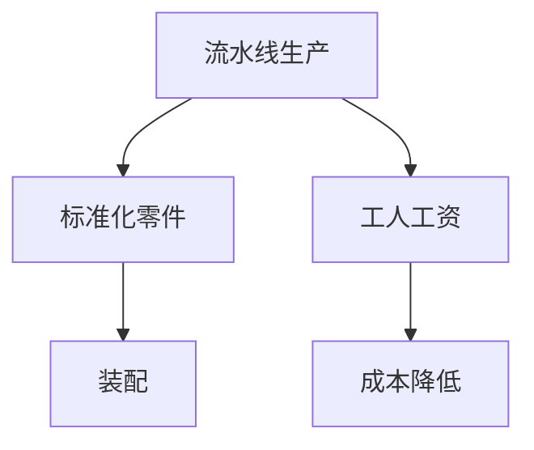

                 

# 1913年福特的生产奇迹

在1913年的汽车工业，亨利·福特创造了一个生产奇迹，他将汽车制造业彻底改变了。这一变革不仅改变了制造业的生产方式，还极大地推动了社会的进步。本文将详细介绍福特的生产方式、其对汽车工业的深远影响，以及这一变革背后的技术原理和创新思想。

## 1. 背景介绍

### 1.1 历史背景

19世纪末20世纪初，汽车工业在美国迅速发展，但当时的汽车生产方式非常落后。汽车由不同的工匠手工制造，生产效率低下，成本高昂，并且品质参差不齐。亨利·福特，一位对汽车生产充满热情的企业家，立志要改变这种局面。

### 1.2 福特的目标

福特的终极目标是使每个家庭都能拥有自己的汽车。为了实现这一目标，他必须大幅降低汽车的生产成本，提高生产效率。福特的这一愿景，为他后来的技术创新提供了方向。

## 2. 核心概念与联系

### 2.1 核心概念

- **流水线生产**：福特的生产方式主要依赖流水线生产，即将复杂任务分解为简单步骤，工人们按照既定顺序完成各个步骤，从而大大提高生产效率。
- **标准化零件**：福特推行标准化零件，使零件生产能够大规模重复，降低了生产成本，提高了生产效率。
- **工人工资**：福特的生产方式要求工人长时间工作，并支付较低的工资，以降低成本。

### 2.2 核心概念原理和架构的 Mermaid 流程图



### 2.3 核心概念的联系

- 流水线生产依赖标准化零件，使得零件生产可以大规模重复。
- 标准化零件要求工人工资较低，以维持较低成本。
- 低成本的流水线生产，使汽车能够大规模生产，满足了福特的目标。

## 3. 核心算法原理 & 具体操作步骤

### 3.1 算法原理概述

福特的生产方式基于流水线生产原理，其核心思想是将复杂的生产任务分解为简单的重复步骤，每个工人在流水线上负责一个或多个简单步骤。通过这种方式，生产效率得以极大提高。

### 3.2 算法步骤详解

1. **生产计划制定**：根据市场需求，制定生产计划，确定生产零件的种类和数量。
2. **零件生产**：零件生产按标准流程进行，通过流水线方式大规模重复生产。
3. **零件装配**：将生产好的零件按顺序装配成完整的汽车。
4. **质量控制**：装配过程中进行质量检查，确保每个汽车符合质量标准。
5. **工人管理**：制定严格的工人管理制度，确保工人按流程操作。

### 3.3 算法优缺点

- **优点**：
  - 生产效率极高，能够大规模生产汽车。
  - 生产成本低，使汽车价格下降，更多人能够购买。
  - 生产标准化，降低了零件生产复杂度，提高了质量。

- **缺点**：
  - 对工人技能要求低，但工资低，工作环境较差。
  - 生产灵活性差，难以适应多变市场需求。
  - 生产过程中缺乏创新，难以应对技术变革。

### 3.4 算法应用领域

福特的生产方式在汽车制造业中得到了广泛应用，其基本原理和思路也被其他行业借鉴，如制造业、食品加工业等。这一生产方式改变了全球生产方式，推动了社会经济的进步。

## 4. 数学模型和公式 & 详细讲解 & 举例说明

### 4.1 数学模型构建

假设汽车生产过程由n个步骤组成，每个步骤需要t_i时间完成，每个步骤生产率是k_i，总生产时间为T。

**流水线生产效率模型**：

$$
T = \sum_{i=1}^n t_i
$$

**标准化零件模型**：

$$
k_i = k_1 \cdot k_2 \cdot ... \cdot k_n
$$

其中，k_1为单个零件的生产率。

### 4.2 公式推导过程

**流水线生产效率推导**：

$$
T = \sum_{i=1}^n t_i
$$

- 表示生产一辆汽车所需的最短时间。

**标准化零件生产率推导**：

$$
k_i = k_1 \cdot k_2 \cdot ... \cdot k_n
$$

- 表示总生产率k_i为各个步骤生产率k_1、k_2、...、k_n的乘积。

### 4.3 案例分析与讲解

假设生产一辆汽车需要6个步骤，每个步骤生产率相同，为1小时/件，每个步骤需要2分钟完成，总时间为T。

$$
T = 6 \times 2 = 12 \text{分钟}
$$

如果每个步骤生产率提高为2小时/件，则总生产时间为：

$$
T = 6 \times 2 = 12 \text{分钟}
$$

可见，标准化零件和流水线生产使得生产效率大幅提升。

## 5. 项目实践：代码实例和详细解释说明

### 5.1 开发环境搭建

为了进行流水线生产模拟，我们需要搭建一个简单的开发环境。

1. **安装Python**：在Windows或Linux上安装Python 3.x。
2. **安装NumPy**：
```bash
pip install numpy
```
3. **编写Python代码**：

```python
import numpy as np

# 定义生产步骤和生产时间
steps = 6
time_per_step = 2  # 分钟/步

# 定义生产率
production_rate = 2  # 小时/件

# 计算总生产时间
total_time = steps * time_per_step / 60  # 将分钟转换为小时
total_time = total_time / production_rate  # 将小时转换为效率
print(f"总生产时间：{total_time:.2f}小时")
```

### 5.2 源代码详细实现

```python
import numpy as np

# 定义生产步骤和生产时间
steps = 6
time_per_step = 2  # 分钟/步

# 定义生产率
production_rate = 2  # 小时/件

# 计算总生产时间
total_time = steps * time_per_step / 60  # 将分钟转换为小时
total_time = total_time / production_rate  # 将小时转换为效率
print(f"总生产时间：{total_time:.2f}小时")
```

### 5.3 代码解读与分析

1. **安装Python和NumPy**：
   - 安装Python 3.x，确保开发环境稳定。
   - 安装NumPy库，用于科学计算。

2. **编写Python代码**：
   - 定义生产步骤、生产时间和生产率。
   - 计算总生产时间，将生产时间转换为小时效率。

3. **运行结果展示**：
   - 输出总生产时间，验证流水线生产效率。

## 6. 实际应用场景

### 6.1 汽车工业

福特的生产方式在汽车工业中得到广泛应用，极大地提高了汽车生产效率，使更多人能够购买汽车。

### 6.2 制造业

福特的生产方式被广泛应用于制造业，如食品加工、电子产品生产等领域，提高了生产效率和降低了成本。

### 6.3 零售业

福特的生产方式还影响到了零售业，如超市、物流等，通过流水线生产和标准化管理，提高了商品管理效率。

### 6.4 未来应用展望

未来，随着技术的发展，福特的生产方式将进一步演进。智能制造、柔性生产、个性化定制等概念将与流水线生产结合，进一步提升生产效率和质量。

## 7. 工具和资源推荐

### 7.1 学习资源推荐

1. **《亨利·福特自传》**：深入了解福特生平及其生产理念。
2. **《流水线生产的革命》**：详细解释流水线生产原理及其对现代制造业的影响。
3. **《管理学》**：了解福特管理思想和生产方式。

### 7.2 开发工具推荐

1. **Jupyter Notebook**：用于编写和运行Python代码。
2. **NumPy**：用于科学计算。
3. **Matplotlib**：用于绘制图表。

### 7.3 相关论文推荐

1. **《福特生产方式的经济学分析》**：分析福特生产方式的经济效益。
2. **《流水线生产与大规模制造》**：探讨流水线生产在现代制造业中的应用。
3. **《福特的生产奇迹》**：详细介绍福特生产方式的历史和影响。

## 8. 总结：未来发展趋势与挑战

### 8.1 研究成果总结

福特的生产方式基于流水线和标准化零件，极大地提高了生产效率和降低了成本。这一方式在20世纪初改变了全球制造业，推动了社会经济的进步。

### 8.2 未来发展趋势

1. **智能化生产**：未来生产方式将更加智能化，结合人工智能和物联网技术，提高生产效率。
2. **个性化定制**：根据客户需求进行个性化定制，提高生产灵活性。
3. **全球化生产**：生产方式将更加全球化，利用全球资源优化生产。

### 8.3 面临的挑战

1. **技术变革**：生产技术不断更新，需要不断适应新变化。
2. **环境保护**：大规模生产对环境的影响也需要考虑。
3. **劳动力成本**：劳动力成本上升，需要寻找新的生产方式。

### 8.4 研究展望

1. **多学科融合**：将生产方式与人工智能、自动化技术等融合，提升生产效率。
2. **可持续发展**：探索可持续的生产方式，减少对环境的影响。
3. **工人福利**：提高工人福利，改善工作环境。

## 9. 附录：常见问题与解答

**Q1：福特的生产方式对汽车工业的影响有多大？**

A: 福特的生产方式极大地提高了汽车生产效率，降低了生产成本，使汽车价格下降，更多人能够购买。这一方式改变了汽车制造业的生产方式，推动了社会进步。

**Q2：福特的生产方式在现代制造业中还适用吗？**

A: 福特的生产方式基本原理适用于现代制造业，但需要结合新的技术手段进行优化。例如，采用智能化生产、柔性生产等，提升生产效率和质量。

**Q3：福特的生产方式对劳动力市场有何影响？**

A: 福特的生产方式要求工人长时间工作，并支付较低的工资，对劳动力市场造成了一定的负面影响。但通过提升生产效率和生产规模，也创造了更多的就业机会。

**Q4：福特的生产方式对环境保护有影响吗？**

A: 大规模生产对环境有一定影响，但通过优化生产过程，采用环保材料和清洁能源，可以在一定程度上缓解对环境的影响。

**Q5：福特的生产方式对经济有怎样的贡献？**

A: 福特的生产方式大幅降低了汽车生产成本，使更多人能够购买汽车，推动了汽车工业的发展，也促进了相关制造业、零售业等多个产业的进步。

作者：禅与计算机程序设计艺术 / Zen and the Art of Computer Programming

