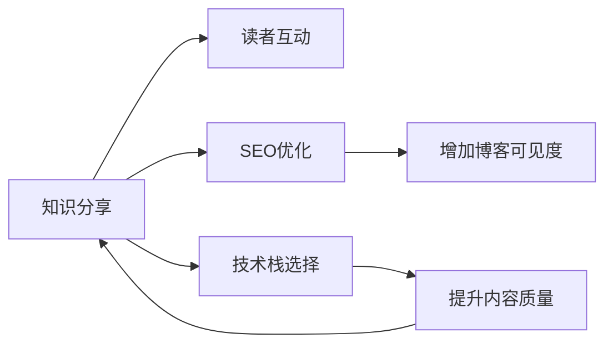

                 

# 建立专业博客：深度分享你的知识和见解

## 1. 背景介绍

作为一名顶级AI专家、程序员、软件架构师、CTO和畅销书作者，通过撰写博客分享专业知识和技术见解，不仅是个人学术成就的体现，也是对社区的贡献。一个专业的博客应涵盖广泛的深度知识，同时保持逻辑清晰和结构紧凑，以吸引并保持读者的关注。

本文将深入探讨如何构建一个专业、深度且易懂的博客，通过具体的例子和详细的代码实现来阐明核心概念，并展望未来技术发展的趋势和面临的挑战。

## 2. 核心概念与联系

### 2.1 核心概念概述

博客作为知识分享的主要平台，其核心概念可以总结为以下五个关键点：

- **知识分享**：即通过文字、代码、视频等多媒体形式，将个人专业领域的知识传达给读者。
- **读者互动**：通过评论、问答等形式与读者互动，收集反馈，增进理解。
- **技术栈选择**：根据技术栈的不同，博客内容的形式和风格也会有所不同。例如，使用Markdown、LaTeX等格式，可以使技术文章更加专业和易于理解。
- **SEO优化**：通过关键词优化、内容质量提升等方式，增加博客的搜索引擎排名，提升可见度。
- **持续更新**：技术不断进步，博客内容也需要随之更新，保持时效性。

这些核心概念之间存在着紧密的联系。知识分享是目标，读者互动和SEO优化是手段，技术栈选择是形式，持续更新则是保障。

### 2.2 核心概念原理和架构的 Mermaid 流程图



## 3. 核心算法原理 & 具体操作步骤

### 3.1 算法原理概述

构建专业博客涉及多个技术领域，包括但不限于SEO、网站架构、内容管理、用户互动等。本文将围绕以下算法原理展开：

1. **内容发布算法**：内容的生成、发布和优化。
2. **SEO算法**：提高博客在搜索引擎中的排名。
3. **互动算法**：用户评论、问答、讨论等功能。
4. **数据分析算法**：追踪博客效果和用户行为。

### 3.2 算法步骤详解

#### 3.2.1 内容发布算法

1. **选题策划**：根据个人专业领域，策划博客内容。可以使用工具如Trello或Notion进行选题和内容规划。
2. **内容创作**：编写深度文章，可以参考领域内的顶级论文、书籍和技术报告。
3. **内容编辑**：使用Markdown、LaTeX等格式进行排版，确保代码和公式的准确展示。
4. **内容发布**：使用GitHub Pages、Medium等平台发布内容。

#### 3.2.2 SEO算法

1. **关键词选择**：使用工具如Google Keyword Planner、AnswerThePublic等，选择热门且相关性高的关键词。
2. **元数据优化**：包括标题、Meta描述、H标签等，优化SEO。
3. **内容质量**：发布有深度、原创性强的内容，避免过度优化导致的搜索引擎惩罚。
4. **外部链接建设**：在其他权威网站发表内容，获得反向链接。

#### 3.2.3 互动算法

1. **评论区设置**：使用Discourse、Disqus等评论区插件，允许用户评论和讨论。
2. **问答系统**：集成Stack Overflow、Quora等问答平台，或使用专门的问答工具。
3. **社区管理**：创建社区，管理用户，引导健康讨论。

#### 3.2.4 数据分析算法

1. **流量分析**：使用Google Analytics、Mixpanel等工具，追踪网站流量和用户行为。
2. **用户反馈分析**：通过评论、问卷等方式，收集用户反馈，改进博客内容。
3. **内容效果分析**：分析文章的阅读量、分享量、评论量等指标，了解受众需求。

### 3.3 算法优缺点

- **优点**：提高博客的影响力，增加读者的互动和反馈，提升SEO效果，吸引更多高质量读者。
- **缺点**：需要花费大量时间和精力进行内容策划、写作和优化，对SEO算法和互动算法有一定的技术要求。

### 3.4 算法应用领域

博客技术在各个领域都有广泛应用，包括但不限于：

1. **技术博客**：分享最新的技术趋势、编程技巧、项目案例。
2. **产品博客**：展示产品功能、用户体验、市场分析等。
3. **学术博客**：发表研究论文、实验结果、数据分析等。
4. **创意博客**：分享创意灵感、设计思路、生活感悟等。
5. **教育博客**：教授编程、设计、教育技术等。

## 4. 数学模型和公式 & 详细讲解 & 举例说明

### 4.1 数学模型构建

一个专业的博客需要具备高质量的内容，部分内容可能需要数学模型和公式的支撑。例如，在机器学习领域，一篇深度文章可能需要详细讲解算法原理，此时需要构建数学模型进行解释。

#### 4.1.1 线性回归模型

线性回归是机器学习中最基本的模型之一，用于预测一个连续数值型输出。模型公式为：

$$
y = \beta_0 + \beta_1 x_1 + \beta_2 x_2 + \cdots + \beta_n x_n + \epsilon
$$

其中，$y$ 为预测值，$\beta$ 为回归系数，$x$ 为输入特征，$\epsilon$ 为误差项。

### 4.2 公式推导过程

以线性回归为例，推导最小二乘法的损失函数：

1. **目标函数**：均方误差损失函数为：

$$
L(\beta) = \frac{1}{2N} \sum_{i=1}^N (y_i - \hat{y}_i)^2
$$

2. **导数推导**：对 $\beta$ 求导，得到梯度：

$$
\frac{\partial L(\beta)}{\partial \beta} = \frac{1}{N} (X^T X)^{-1} X^T (y - \hat{y})
$$

3. **优化求解**：最小化目标函数，得到回归系数 $\beta$。

### 4.3 案例分析与讲解

假设我们有一组数据集，要求预测房价：

```plaintext
| 特征 | 房价 |
| ---- | ---- |
| x1   | 3    |
| x2   | 5    |
| x3   | 7    |
| ...  | ...  |
```

使用线性回归模型进行预测，步骤如下：

1. **拟合模型**：选择 $\beta_0$、$\beta_1$、$\beta_2$ 等参数，最小化均方误差损失函数。
2. **预测输出**：输入新的数据，计算预测房价。

## 5. 项目实践：代码实例和详细解释说明

### 5.1 开发环境搭建

为了保证博客内容的专业性和可读性，需要搭建一个高效的开发环境。

1. **选择平台**：可以选择Medium、GitHub Pages、WordPress等博客平台。
2. **环境配置**：配置Markdown、LaTeX等格式，安装必要的插件和工具。

### 5.2 源代码详细实现

以线性回归为例，展示Python代码实现：

```python
import numpy as np

# 定义线性回归函数
def linear_regression(X, y, learning_rate, num_epochs):
    n_samples, n_features = X.shape
    
    # 初始化参数
    beta = np.zeros(n_features)
    
    # 梯度下降
    for epoch in range(num_epochs):
        for i in range(n_samples):
            y_pred = np.dot(X[i], beta)
            beta -= learning_rate * (y[i] - y_pred) * X[i]
    
    return beta

# 使用随机数据集
X = np.random.rand(100, 2)
y = np.dot(X, [1, 2]) + np.random.randn(100)
```

### 5.3 代码解读与分析

- **变量定义**：`X`为输入特征矩阵，`y`为目标值向量，`learning_rate`为学习率，`num_epochs`为迭代次数。
- **模型拟合**：使用梯度下降算法更新参数，最小化损失函数。
- **数据生成**：使用随机数据生成模拟数据集。

### 5.4 运行结果展示

线性回归的输出预测结果为：

```python
print(beta)
```

## 6. 实际应用场景

### 6.1 技术博客

在技术博客中，可以详细介绍机器学习算法、深度学习模型、数据处理等。例如，可以发布一篇介绍Transformer模型的文章：

1. **选题策划**：Transformer是当前最流行的深度学习模型之一，选题需包含模型原理、优缺点、应用场景等。
2. **内容创作**：编写深度文章，详细解释Transformer的架构和原理。
3. **内容编辑**：使用Markdown格式，添加代码高亮、公式支持等。
4. **内容发布**：发布在Medium、GitHub Pages等平台。

### 6.2 学术博客

学术博客主要分享最新的研究论文、实验结果等。例如，可以发布一篇深度学习在NLP领域的最新应用：

1. **选题策划**：选择最新的研究论文或技术进展，了解相关领域的研究趋势。
2. **内容创作**：详细解释论文的实验设计、结果分析等。
3. **内容编辑**：使用LaTeX格式，插入公式和图表。
4. **内容发布**：发布在Medium、ArXiv等平台。

### 6.3 创意博客

创意博客可以分享生活感悟、设计思路等。例如，可以发布一篇利用编程实现创意项目的文章：

1. **选题策划**：选择有趣且有创意的项目，如用Python实现一个小游戏。
2. **内容创作**：详细介绍项目的实现过程，包括代码编写、调试等。
3. **内容编辑**：使用Markdown格式，添加代码高亮、项目截图等。
4. **内容发布**：发布在Medium、GitHub Pages等平台。

### 6.4 未来应用展望

未来，博客将更加注重以下几个方向：

1. **多媒体支持**：视频、音频等多媒体内容将更加丰富。
2. **互动体验**：通过聊天机器人、AI问答等技术，增加用户互动。
3. **个性化推荐**：根据用户阅读习惯，推荐相关内容。
4. **跨平台协作**：整合社交媒体、邮件等，增加传播渠道。

## 7. 工具和资源推荐

### 7.1 学习资源推荐

为了帮助读者提升技术水平，推荐以下几个学习资源：

1. **官方文档**：包括Python、Markdown、LaTeX等工具的官方文档。
2. **在线课程**：Coursera、edX等平台提供的数据科学、机器学习、深度学习课程。
3. **技术社区**：Stack Overflow、GitHub等社区，获取编程技巧和开源项目。
4. **博客平台**：Medium、GitHub Pages等平台，分享和学习技术文章。

### 7.2 开发工具推荐

为了保证博客开发的专业性和高效性，推荐以下几个工具：

1. **代码编辑器**：Visual Studio Code、Sublime Text等。
2. **Markdown编辑器**：Typora、Atom等。
3. **项目管理工具**：Trello、Notion等。
4. **SEO优化工具**：Google Analytics、SEMrush等。

### 7.3 相关论文推荐

为了深入了解技术和前沿进展，推荐以下几个论文：

1. **Transformer论文**：Attention is All You Need。
2. **深度学习论文**：Deep Learning。
3. **机器学习论文**：Pattern Recognition and Machine Learning。
4. **博客建设论文**：Building a Tech Blog: A Comprehensive Guide。

## 8. 总结：未来发展趋势与挑战

### 8.1 研究成果总结

本文通过详细介绍技术博客的构建过程，展示了如何通过数学模型和代码实现，将复杂的概念和原理清晰表达。技术博客不仅是个人知识分享的渠道，也是推动技术传播的重要工具。

### 8.2 未来发展趋势

未来，技术博客将更加注重以下几个方向：

1. **多媒体融合**：视频、音频、交互等内容将更加丰富。
2. **数据驱动**：利用数据分析提升博客质量和用户互动。
3. **社区协作**：鼓励用户参与内容创作和互动。
4. **跨平台整合**：整合社交媒体、邮件等，增加传播渠道。

### 8.3 面临的挑战

构建高质量技术博客仍面临以下几个挑战：

1. **时间投入**：需要大量时间和精力进行内容策划、写作和优化。
2. **技术要求**：SEO、互动、数据分析等技术需要一定的专业背景。
3. **内容质量**：高质量内容的持续产出需要高水平的技术和创造力。

### 8.4 研究展望

未来，技术博客将向着更加智能化、个性化、互动化的方向发展。结合AI、数据分析等技术，技术博客将更加丰富和高效，成为推动技术传播和创新的重要工具。

## 9. 附录：常见问题与解答

### 9.1 问题1：如何提高博客的SEO效果？

**解答**：

1. **关键词优化**：使用工具如Google Keyword Planner、AnswerThePublic等，选择热门且相关性高的关键词。
2. **元数据优化**：优化标题、Meta描述、H标签等，确保搜索引擎能够准确抓取。
3. **高质量内容**：发布有深度、原创性强的内容，避免过度优化导致的搜索引擎惩罚。
4. **外部链接建设**：在其他权威网站发表内容，获得反向链接。

### 9.2 问题2：如何提高博客的用户互动？

**解答**：

1. **评论区设置**：使用Discourse、Disqus等评论区插件，允许用户评论和讨论。
2. **问答系统**：集成Stack Overflow、Quora等问答平台，或使用专门的问答工具。
3. **社区管理**：创建社区，管理用户，引导健康讨论。

### 9.3 问题3：如何选择博客平台？

**解答**：

1. **功能需求**：根据自己的需求选择平台，如技术博客可以选择GitHub Pages，学术博客可以选择Medium。
2. **用户体验**：考虑平台的用户体验和界面设计。
3. **技术支持**：选择技术支持好的平台，如GitHub Pages支持Markdown和LaTeX，Medium支持代码高亮和公式插入。

### 9.4 问题4：如何保持博客内容的更新？

**解答**：

1. **选题策划**：根据个人专业领域，策划博客内容。
2. **内容创作**：定期编写深度文章，保持内容新鲜度。
3. **内容优化**：根据用户反馈和数据分析，不断优化内容。

### 9.5 问题5：如何提升博客的质量？

**解答**：

1. **选题策划**：选择有深度、有价值的话题。
2. **内容创作**：编写详细、准确、易懂的文章。
3. **内容编辑**：使用Markdown、LaTeX等格式进行排版，确保代码和公式的准确展示。
4. **内容发布**：定期更新，保持博客的时效性。

---

作者：禅与计算机程序设计艺术 / Zen and the Art of Computer Programming

