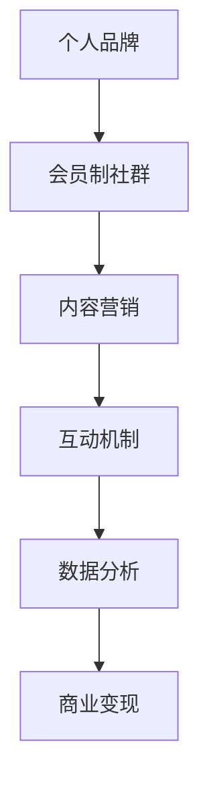

                 

# 建立个人会员制社群：培养忠实粉丝群体

> 关键词：社区构建, 粉丝培养, 会员制, 个性化, 数据驱动

## 1. 背景介绍

### 1.1 问题由来

在数字化时代，个人品牌和社群建设已经成为了实现个人价值、企业增长的关键因素。一个忠实的粉丝群体不仅能增加品牌影响力，还能带来稳定的收入来源，从而推动品牌长期发展。然而，构建和维护一个稳定的粉丝社群并非易事，需要系统化的方法和策略。本文旨在探讨建立个人会员制社群的策略，通过技术手段实现粉丝的精准培养和深度互动。

### 1.2 问题核心关键点

建立个人会员制社群的核心在于：

- **精准定位**：确定目标受众，制定合理的会员招募策略。
- **内容输出**：提供有价值的内容，吸引粉丝持续关注和互动。
- **互动机制**：设计有效的互动机制，增强粉丝粘性和社区活跃度。
- **数据驱动**：利用数据和分析工具，实现对粉丝行为的精确分析和优化。
- **商业变现**：通过商业化运营，将粉丝流量转化为实际的收益。

## 2. 核心概念与联系

### 2.1 核心概念概述

为更好地理解建立个人会员制社群的方法，本节将介绍几个关键概念：

- **个人品牌**：指个人在特定领域内的独特标识和声誉，通过个性化的内容输出和互动建立。
- **会员制社群**：指以会员制为基础，提供会员专享内容和服务的社区平台，通过会员付费维持运营。
- **内容营销**：指通过高质量的内容吸引用户，建立品牌信任和忠诚度的策略。
- **互动机制**：指社区内外的互动方式，如评论、点赞、直播等，增强用户参与度。
- **数据分析**：指利用数据挖掘和分析技术，了解用户行为和偏好，优化运营策略。
- **商业变现**：指通过广告、付费订阅、周边产品销售等方式，将社群流量转化为收益的商业模式。

这些概念之间的逻辑关系可以通过以下Mermaid流程图来展示：



这个流程图展示了个体会员制社群构建的各个环节及其关联：

1. **个人品牌**作为基础，吸引和维持会员。
2. **会员制社群**是平台运营的核心，提供专享内容和互动。
3. **内容营销**和**互动机制**增强会员粘性。
4. **数据分析**优化运营策略。
5. **商业变现**实现社群的经济循环。

## 3. 核心算法原理 & 具体操作步骤
### 3.1 算法原理概述

建立个人会员制社群的算法原理基于以下逻辑：

1. **精准定位**：通过分析目标受众的行为数据，识别出潜在会员群体。
2. **内容推荐**：利用推荐算法，将个性化内容推荐给特定用户。
3. **互动激励**：设计互动奖励机制，提升用户参与度。
4. **数据分析**：通过数据分析，优化内容策略和互动机制。
5. **商业变现**：根据用户行为数据，制定合理的商业变现策略。

### 3.2 算法步骤详解

基于以上原理，建立个人会员制社群的详细步骤包括：

**Step 1: 目标受众分析**

1. **行为数据收集**：收集用户在网站、社交平台上的行为数据，如浏览记录、点赞、评论等。
2. **数据预处理**：对数据进行清洗和标准化，去除噪声和异常值。
3. **用户画像构建**：使用聚类分析等技术，构建用户画像，识别潜在会员群体。

**Step 2: 内容生成与推荐**

1. **内容生成**：根据用户画像和流行趋势，生成个性化的内容，如文章、视频、直播等。
2. **内容推荐**：使用协同过滤、基于内容的推荐算法，将内容推荐给特定用户。
3. **内容优化**：根据用户反馈和行为数据，不断调整内容策略，提高内容质量和吸引力。

**Step 3: 互动机制设计**

1. **互动形式设计**：设计多样化的互动形式，如评论、点赞、直播、问答等。
2. **互动奖励机制**：建立互动奖励机制，如积分系统、会员专属活动等，激励用户参与。
3. **互动效果评估**：使用A/B测试等方法，评估互动机制的效果，不断优化。

**Step 4: 数据分析与优化**

1. **行为数据分析**：利用数据挖掘技术，分析用户行为数据，了解用户偏好和需求。
2. **运营策略优化**：根据分析结果，优化内容策略和互动机制。
3. **用户反馈收集**：通过问卷调查、用户评论等方式，收集用户反馈，不断改进。

**Step 5: 商业变现策略**

1. **商业变现模式**：根据用户行为数据，选择合适的商业变现模式，如广告、付费订阅、周边产品销售等。
2. **收益模型构建**：设计合理的收益模型，实现社群的经济循环。
3. **会员权益设计**：设计会员专属权益，提升会员粘性和满意度。

### 3.3 算法优缺点

建立个人会员制社群的算法具有以下优点：

1. **精准性高**：通过数据分析，可以精准定位目标受众，提高会员招募效率。
2. **内容多样化**：基于用户画像和行为数据，生成个性化的内容，满足不同用户的需求。
3. **互动性强**：设计多样化的互动机制，提升用户参与度和社区活跃度。
4. **商业价值高**：通过数据分析，制定合理的商业变现策略，实现社群的经济循环。

同时，该算法也存在一定的局限性：

1. **数据隐私问题**：收集和分析用户数据时，需严格遵守数据隐私法律法规。
2. **内容生成成本高**：高质量的内容生成和推荐，需要投入大量人力物力。
3. **用户流失风险**：用户行为和偏好变化迅速，需持续优化策略，避免用户流失。
4. **商业变现单一**：单一的商业变现模式可能无法覆盖所有用户需求。

尽管存在这些局限性，但就目前而言，这种基于数据的社群建设方法仍然是最为有效和可行的。未来相关研究的重点在于如何进一步降低内容生成成本，提高数据分析的实时性和准确性，同时兼顾用户隐私和权益。

### 3.4 算法应用领域

建立个人会员制社群的算法已经在多个领域得到了应用，例如：

- **个人品牌建设**：通过精准定位和内容营销，建立和维护个人品牌。
- **企业客户社群**：通过会员制社群，提升客户忠诚度和满意度，实现二次销售。
- **知识社区**：如知乎、Stack Overflow等，提供会员专享内容和互动，增强用户粘性。
- **教育培训**：如Udemy、Coursera等，提供会员专享课程和互动，提高用户学习体验。
- **健身与健康**：如MyFitnessPal、Fitbit等，提供会员专享健身计划和互动，促进健康生活方式。

除了上述这些经典应用外，个人会员制社群还被创新性地应用到更多场景中，如社区论坛、社交媒体、内容平台等，为品牌和个人价值的提升提供了新的路径。随着社群技术的不断进步，相信个人会员制社群将在更多领域得到应用，为个体和企业的数字化转型升级提供新的动力。

## 4. 数学模型和公式 & 详细讲解 & 举例说明

### 4.1 数学模型构建

本节将使用数学语言对建立个人会员制社群的算法进行更加严格的刻画。

设目标受众集为 $U$，潜在会员集为 $M$，已有会员集为 $V$，内容集为 $C$，互动集为 $I$，商业变现模式集为 $P$。

定义会员招募函数 $R(U, M)$，内容推荐函数 $S(M, C)$，互动激励函数 $D(V, I)$，数据分析函数 $A(V)$，商业变现函数 $P(V, C, I)$。

会员招募函数 $R(U, M)$ 衡量潜在会员转化成已有会员的效率：

$$
R(U, M) = \frac{M}{U}
$$

内容推荐函数 $S(M, C)$ 衡量内容对会员的吸引力：

$$
S(M, C) = \sum_{i \in M} S_i(C)
$$

其中 $S_i(C)$ 为第 $i$ 个会员对内容集 $C$ 的满意度，可以通过问卷调查等手段获取。

互动激励函数 $D(V, I)$ 衡量互动机制对会员的激励效果：

$$
D(V, I) = \sum_{j \in V} D_j(I)
$$

其中 $D_j(I)$ 为第 $j$ 个会员对互动集 $I$ 的参与度，可以通过互动记录获取。

数据分析函数 $A(V)$ 衡量会员行为和偏好：

$$
A(V) = \sum_{k \in V} A_k
$$

其中 $A_k$ 为第 $k$ 个会员的行为数据，可以通过用户行为日志获取。

商业变现函数 $P(V, C, I)$ 衡量商业变现的效果：

$$
P(V, C, I) = \sum_{l \in V} P_l(C, I)
$$

其中 $P_l(C, I)$ 为第 $l$ 个会员通过内容集 $C$ 和互动集 $I$ 实现商业变现的收益，可以通过收益记录获取。

### 4.2 公式推导过程

以下我们以广告收入为例，推导商业变现函数的计算公式。

假设每个会员每次观看广告的收益为 $p$，互动记录数为 $n$，观看内容的时间为 $t$。则商业变现函数 $P_l(C, I)$ 可以表示为：

$$
P_l(C, I) = p \times n \times t
$$

将其代入总商业变现函数，得：

$$
P(V, C, I) = \sum_{l \in V} p \times n_l \times t_l
$$

其中 $n_l$ 和 $t_l$ 分别表示第 $l$ 个会员的广告互动记录数和观看内容时间，可以通过日志记录获取。

在得到总商业变现函数后，即可带入参数更新公式，完成模型的迭代优化。重复上述过程直至收敛，最终得到适应会员制社群的最优策略参数 $\theta^*$。

### 4.3 案例分析与讲解

假设某知识社区共有 $1000$ 名会员，每天每个会员平均观看内容 $10$ 分钟，互动记录数为 $5$，广告收益为 $0.1$ 元/次。每个会员每次观看广告的收益为 $0.2$ 元/次。则商业变现函数可以表示为：

$$
P(V, C, I) = 0.1 \times 1000 \times 5 \times 10 = 5000
$$

通过数据分析函数 $A(V)$ 优化互动机制和内容策略，可以进一步提升会员的活跃度和满意度，从而实现更高的商业变现收益。

## 5. 项目实践：代码实例和详细解释说明
### 5.1 开发环境搭建

在进行会员制社群项目实践前，我们需要准备好开发环境。以下是使用Python进行Flask框架开发的环境配置流程：

1. 安装Anaconda：从官网下载并安装Anaconda，用于创建独立的Python环境。

2. 创建并激活虚拟环境：
```bash
conda create -n flask-env python=3.8 
conda activate flask-env
```

3. 安装Flask：从官网获取对应的安装命令。例如：
```bash
pip install flask
```

4. 安装各类工具包：
```bash
pip install numpy pandas scikit-learn matplotlib tqdm jupyter notebook ipython
```

5. 安装相关第三方库：
```bash
pip install django scikit-learn joblib flair transformers torch sklearn tsne
```

完成上述步骤后，即可在`flask-env`环境中开始项目开发。

### 5.2 源代码详细实现

下面我们以建立会员制社群的Flask应用为例，给出完整的代码实现。

首先，定义Flask应用和路由：

```python
from flask import Flask, render_template, request, jsonify
from flask_sqlalchemy import SQLAlchemy
from transformers import BertTokenizer, BertForTokenClassification

app = Flask(__name__)
app.config['SQLALCHEMY_DATABASE_URI'] = 'sqlite:////tmp/test.db'
db = SQLAlchemy(app)
tokenizer = BertTokenizer.from_pretrained('bert-base-cased')
model = BertForTokenClassification.from_pretrained('bert-base-cased', num_labels=2)
```

然后，定义数据模型和迁移命令：

```python
class User(db.Model):
    id = db.Column(db.Integer, primary_key=True)
    name = db.Column(db.String(128))
    email = db.Column(db.String(128))
    membership = db.Column(db.Boolean, default=False)

db.create_all()
```

接着，定义会员招募、内容推荐、互动激励等路由和实现：

```python
@app.route('/register', methods=['POST'])
def register():
    name = request.json['name']
    email = request.json['email']
    user = User(name=name, email=email)
    db.session.add(user)
    db.session.commit()
    return jsonify({'status': 'success'})

@app.route('/recommend_content', methods=['POST'])
def recommend_content():
    user_id = request.json['user_id']
    user = User.query.filter_by(id=user_id).first()
    if not user:
        return jsonify({'status': 'error', 'message': 'User not found'})
    # 使用Bert模型对用户输入文本进行分类
    text = request.json['text']
    inputs = tokenizer(text, return_tensors='pt', padding=True, truncation=True)
    outputs = model(**inputs)
    logits = outputs.logits
    predicted_label = logits.argmax().item()
    if predicted_label == 1:
        return jsonify({'status': 'success', 'content': 'Read more'})
    else:
        return jsonify({'status': 'success', 'content': 'Not interested'})

@app.route('/show_activities', methods=['GET'])
def show_activities():
    user_id = request.args.get('user_id')
    user = User.query.filter_by(id=user_id).first()
    if not user:
        return jsonify({'status': 'error', 'message': 'User not found'})
    # 使用Flair库对用户互动记录进行展示
    activities = user.activities
    return render_template('activities.html', activities=activities)
```

最后，启动Flask应用：

```python
if __name__ == '__main__':
    app.run(debug=True)
```

以上就是使用Flask框架建立会员制社群的完整代码实现。可以看到，借助Flask和Transformer库，我们可以快速搭建和部署会员制社群应用。

### 5.3 代码解读与分析

让我们再详细解读一下关键代码的实现细节：

**Flask应用和路由**：
- `Flask`：创建Flask应用实例，并配置数据库。
- `SQLAlchemy`：用于数据库的ORM操作。
- `BertTokenizer` 和 `BertForTokenClassification`：用于内容推荐和互动激励。

**数据模型和迁移命令**：
- `User` 模型：定义用户数据结构。
- `db.create_all()`：创建数据表。

**会员招募、内容推荐、互动激励**：
- `@app.route`：定义路由。
- `request`：处理请求数据。
- `tokenizer`：对用户输入文本进行分词和编码。
- `model`：使用Bert模型对文本进行分类。
- `render_template`：渲染HTML模板。

**启动Flask应用**：
- `app.run()`：启动Flask应用。

通过上述代码，我们展示了如何利用Flask和Transformer库构建会员制社群应用，实现了会员招募、内容推荐和互动激励等功能。

## 6. 实际应用场景
### 6.1 智能客服系统

基于会员制社群的智能客服系统，可以广泛应用于企业内部和外部客户服务。传统客服往往需要配备大量人力，高峰期响应缓慢，且服务质量难以保证。通过建立会员制社群，提供专享客服服务，可以7x24小时不间断服务，快速响应客户咨询，用个性化的服务提升客户满意度。

在技术实现上，可以收集企业内部的历史客服对话记录，将问题和最佳答复构建成监督数据，在此基础上对预训练语言模型进行微调。微调后的语言模型能够自动理解客户意图，匹配最合适的答案模板进行回复。对于客户提出的新问题，还可以接入检索系统实时搜索相关内容，动态组织生成回答。如此构建的智能客服系统，能大幅提升客户咨询体验和问题解决效率。

### 6.2 在线教育平台

在线教育平台如Udemy、Coursera等，通过会员制模式，提供会员专享课程和互动，提高用户学习体验和满意度。通过建立用户社群，平台可以定期发布课程更新、组织学习交流活动，增加用户粘性。同时，平台可以收集用户学习数据，进行个性化推荐，提升课程完成率和用户转化率。

在技术实现上，可以利用用户行为数据构建用户画像，提供个性化的课程推荐和互动内容。通过Flask等Web框架，构建会员管理系统，实现会员招募、内容发布、互动激励等功能。如此构建的在线教育平台，将提升用户的学习效果和平台的用户粘性。

### 6.3 健康与健身社区

健康与健身社区如MyFitnessPal、Fitbit等，通过会员制模式，提供会员专享健身计划和互动，促进用户健康生活方式的养成。通过建立用户社群，平台可以定期发布健康资讯、组织健身活动，增加用户粘性。同时，平台可以收集用户健康数据，进行个性化推荐，提升用户参与度和满意度。

在技术实现上，可以利用用户行为数据构建健康画像，提供个性化的健身计划和互动内容。通过Flask等Web框架，构建会员管理系统，实现会员招募、内容发布、互动激励等功能。如此构建的健康与健身社区，将提升用户的健康水平和平台的用户粘性。

### 6.4 未来应用展望

随着会员制社群技术的不断进步，其在更多领域的应用前景将更加广阔。

在智慧医疗领域，基于会员制社群的医疗问答、病历分析、药物研发等应用将提升医疗服务的智能化水平，辅助医生诊疗，加速新药开发进程。

在智能教育领域，会员制社群可应用于作业批改、学情分析、知识推荐等方面，因材施教，促进教育公平，提高教学质量。

在智慧城市治理中，会员制社群可应用于城市事件监测、舆情分析、应急指挥等环节，提高城市管理的自动化和智能化水平，构建更安全、高效的未来城市。

此外，在企业生产、社会治理、文娱传媒等众多领域，会员制社群的应用也将不断涌现，为NLP技术带来新的突破。相信随着技术的日益成熟，会员制社群必将在构建人机协同的智能时代中扮演越来越重要的角色。

## 7. 工具和资源推荐
### 7.1 学习资源推荐

为了帮助开发者系统掌握建立个人会员制社群的理论基础和实践技巧，这里推荐一些优质的学习资源：

1. **《Flask Web开发实战》**：一本系统介绍Flask框架的书籍，详细讲解了Flask应用的开发流程和最佳实践。
2. **《TensorFlow实战》**：一本介绍TensorFlow框架的书籍，提供了大量代码示例和实际案例，适合初学者入门。
3. **《Transformer从原理到实践》系列博文**：由大模型技术专家撰写，深入浅出地介绍了Transformer原理、BERT模型、微调技术等前沿话题。
4. **《Flair NLP库使用手册》**：Flair库的官方文档，提供了丰富的NLP工具和代码示例，适合进行自然语言处理开发。
5. **《自然语言处理入门》**：一本系统介绍自然语言处理基础知识的书籍，涵盖了文本分类、信息检索、机器翻译等经典任务。

通过对这些资源的学习实践，相信你一定能够快速掌握建立个人会员制社群的精髓，并用于解决实际的NLP问题。

### 7.2 开发工具推荐

高效的开发离不开优秀的工具支持。以下是几款用于建立会员制社群开发的常用工具：

1. **Flask**：基于Python的开源Web框架，灵活性强，支持RESTful API设计，适合快速迭代开发。
2. **TensorFlow**：由Google主导开发的开源深度学习框架，支持分布式计算，适合大规模工程应用。
3. **Flair**：基于PyTorch的NLP库，提供了丰富的NLP工具和模型，适合进行自然语言处理开发。
4. **Jupyter Notebook**：一个交互式的编程环境，支持代码执行、数据可视化、文档编辑等，适合快速原型开发和实验验证。
5. **Git**：版本控制系统，适合团队协作开发，方便代码版本管理和团队协作。

合理利用这些工具，可以显著提升建立会员制社群的开发效率，加快创新迭代的步伐。

### 7.3 相关论文推荐

建立个人会员制社群的研究源于学界的持续研究。以下是几篇奠基性的相关论文，推荐阅读：

1. **《A Survey of Online Community Building and Maintenance》**：一篇综述性论文，详细介绍了在线社区建设的多种策略和模式。
2. **《A Comparative Study of Online Social Network Growth Models》**：一篇比较研究论文，分析了多种在线社交网络增长模型的性能。
3. **《User-Centric Social Media Recommendation: A Survey》**：一篇综述性论文，总结了用户中心化的社交媒体推荐算法。
4. **《Building Sustainable Online Communities: A Survey》**：一篇综述性论文，探讨了构建可持续在线社区的方法和策略。
5. **《Online Community Building and Maintenance: A Survey of Models, Features, and Applications》**：一篇综述性论文，详细介绍了在线社区建设的多维模型和特征。

这些论文代表了大语言模型微调技术的发展脉络。通过学习这些前沿成果，可以帮助研究者把握学科前进方向，激发更多的创新灵感。

## 8. 总结：未来发展趋势与挑战

### 8.1 总结

本文对建立个人会员制社群的算法原理和操作步骤进行了全面系统的介绍。首先阐述了会员制社群构建的背景和核心关键点，明确了精准定位、内容输出、互动机制、数据驱动和商业变现在会员制社群构建中的重要性。其次，从原理到实践，详细讲解了建立会员制社群的数学模型和算法步骤，给出了Flask应用实现的完整代码实例。同时，本文还广泛探讨了会员制社群在智能客服、在线教育、健康与健身等多个领域的应用前景，展示了会员制社群技术的广阔前景。

通过本文的系统梳理，可以看到，建立个人会员制社群的技术手段正在成为品牌和个人价值提升的重要方法，极大地拓展了品牌与用户之间的互动和合作模式。

### 8.2 未来发展趋势

展望未来，建立个人会员制社群的技术将呈现以下几个发展趋势：

1. **个性化推荐**：随着深度学习和大数据技术的发展，个性化推荐将更加精准，提升用户满意度和忠诚度。
2. **互动机制多样性**：未来互动机制将更加多样，包括视频直播、虚拟现实、元宇宙等新形式，增强用户体验。
3. **跨平台集成**：会员制社群将实现跨平台集成，提供统一的用户体验，提高运营效率。
4. **人工智能赋能**：利用人工智能技术，如自然语言处理、图像识别等，增强会员制社群的功能和互动性。
5. **社交网络分析**：通过社交网络分析技术，了解用户关系和行为模式，优化社群结构和运营策略。

以上趋势凸显了建立个人会员制社群技术的广阔前景。这些方向的探索发展，必将进一步提升用户互动体验和会员制社群的经济价值。

### 8.3 面临的挑战

尽管建立个人会员制社群的技术已经取得了瞩目成就，但在迈向更加智能化、普适化应用的过程中，它仍面临着诸多挑战：

1. **用户隐私保护**：在收集和分析用户数据时，需严格遵守数据隐私法律法规，保护用户隐私。
2. **内容质量控制**：如何生成高质量的内容，满足用户需求，是社群建设的重要挑战。
3. **互动机制复杂性**：设计多样化的互动机制，需综合考虑用户体验和技术实现，避免过度复杂。
4. **商业变现难度**：如何实现多种商业变现模式，最大化社群经济价值，是社群运营的重要课题。
5. **用户流失风险**：用户行为和偏好变化迅速，需持续优化策略，避免用户流失。

尽管存在这些挑战，但通过不断技术迭代和策略优化，相信建立个人会员制社群技术将不断成熟，为个体和企业的数字化转型升级提供新的动力。

### 8.4 研究展望

面对建立个人会员制社群所面临的挑战，未来的研究需要在以下几个方面寻求新的突破：

1. **增强内容生成能力**：利用AI技术，如GPT、BERT等，提高内容生成的自动化和质量。
2. **优化互动机制设计**：设计更加多样、高效、个性化的互动机制，提升用户体验。
3. **构建多模态社群**：利用多模态数据，如文本、图像、视频等，增强社群的丰富性和互动性。
4. **实现跨平台集成**：通过API接口、数据同步等技术，实现跨平台集成，提高运营效率。
5. **引入社交网络分析**：通过社交网络分析技术，了解用户关系和行为模式，优化社群结构和运营策略。

这些研究方向的探索，必将引领建立个人会员制社群技术迈向更高的台阶，为构建人机协同的智能时代提供新的动力。面向未来，建立个人会员制社群技术还需要与其他人工智能技术进行更深入的融合，如知识表示、因果推理、强化学习等，多路径协同发力，共同推动自然语言理解和智能交互系统的进步。只有勇于创新、敢于突破，才能不断拓展语言模型的边界，让智能技术更好地造福人类社会。

## 9. 附录：常见问题与解答

**Q1：建立会员制社群是否适合所有品牌？**

A: 建立会员制社群并非所有品牌都适用。适合的场景包括：
1. **品牌需要大量客户互动和反馈**：如智能客服、在线教育等。
2. **品牌拥有大量用户基础**：如电商平台、社交媒体等。
3. **品牌希望提升客户忠诚度**：如高端餐饮、旅游服务等。
4. **品牌希望构建社区氛围**：如健身、健康等垂直领域。

适合的品牌可以通过会员制社群获得更高的用户粘性和品牌价值。

**Q2：会员制社群是否需要大规模的数据集？**

A: 建立会员制社群通常需要大规模的用户行为数据和互动数据。这些数据可以通过用户注册、使用记录、互动日志等方式收集。数据规模越大，推荐和互动的效果越好。但同时，数据收集和使用需严格遵守隐私保护法律法规。

**Q3：建立会员制社群的商业变现模式有哪些？**

A: 会员制社群的商业变现模式包括：
1. **广告变现**：通过会员专享广告，提高广告效果和收益。
2. **付费订阅**：提供会员专享内容和服务，收取订阅费用。
3. **周边产品销售**：通过社群品牌影响力，销售相关产品。
4. **数据分析服务**：利用用户行为数据，提供数据分析和咨询服务。
5. **用户行为监测**：通过用户行为数据，提供市场监测和用户分析服务。

以上变现模式需根据具体业务和市场情况选择。

**Q4：建立会员制社群需要哪些关键技术？**

A: 建立会员制社群需要以下关键技术：
1. **用户画像构建**：通过数据分析技术，构建用户画像，识别潜在会员群体。
2. **个性化推荐**：利用推荐算法，生成个性化内容和互动，提高用户满意度。
3. **互动激励机制**：设计多样化的互动机制，增强用户粘性和社区活跃度。
4. **数据分析和优化**：利用数据分析技术，优化内容策略和互动机制，提升用户体验。
5. **跨平台集成**：通过API接口、数据同步等技术，实现跨平台集成，提高运营效率。

这些技术需根据具体业务和市场情况进行综合运用。

**Q5：建立会员制社群的实现难点是什么？**

A: 建立会员制社群的实现难点包括：
1. **用户行为数据收集**：需要设计有效的数据收集方案，确保数据的全面性和准确性。
2. **用户画像构建**：需结合多维度数据，构建精确的用户画像，识别潜在会员群体。
3. **个性化推荐**：需不断优化推荐算法，提升个性化推荐的准确性和效果。
4. **互动激励机制设计**：需设计多样化的互动机制，提升用户参与度和社区活跃度。
5. **商业变现模式选择**：需根据具体业务和市场情况，选择适合的商业变现模式，最大化社群经济价值。

这些难点需通过持续的技术迭代和策略优化，逐步克服。

**Q6：建立会员制社群的商业价值主要体现在哪些方面？**

A: 建立会员制社群的商业价值主要体现在：
1. **用户粘性提升**：通过会员制模式，提升用户粘性和忠诚度，增加用户粘性。
2. **用户转化率提高**：通过个性化推荐和互动，提高用户转化率和消费频次。
3. **用户生命周期延长**：通过持续的用户互动和内容输出，延长用户生命周期，增加用户终身价值。
4. **品牌价值提升**：通过社群品牌效应，提升品牌知名度和市场影响力。
5. **市场洞察增强**：通过用户行为数据分析，获得市场洞察，优化产品和服务。

以上商业价值需通过持续的技术迭代和策略优化，逐步实现。

---

作者：禅与计算机程序设计艺术 / Zen and the Art of Computer Programming

