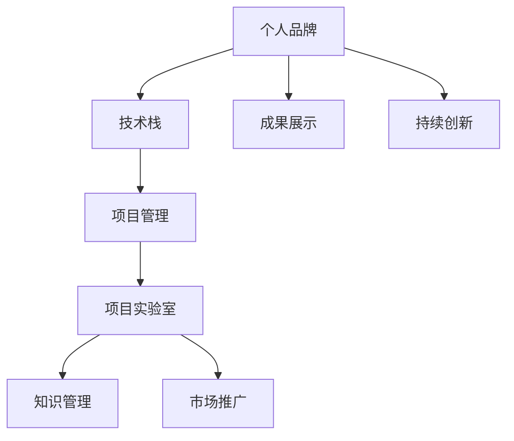

                 

# 建立个人品牌实验室：展示你的创新能力

> 关键词：个人品牌,技术创新,实验室,项目管理,产品发布,技术博客

## 1. 背景介绍

### 1.1 问题由来
在当今高度竞争的技术市场中，构建和维护一个强大的个人品牌对于个人职业发展至关重要。无论你是软件工程师、数据科学家还是AI研究员，都需要能够清晰地展示自己的技术实力和创新能力，以吸引同行、雇主或投资者的注意。而建立一个个人品牌实验室，就是一个很好的方式，不仅能展示你的技术栈和创新成果，还能通过实际项目实践来进一步提升自己的技术水平和行业影响力。

### 1.2 问题核心关键点
建立一个成功的个人品牌实验室，关键在于以下几个方面：

- **技术栈多样性**：展示你对多种技术的掌握和融合能力，包括但不限于机器学习、深度学习、自然语言处理、计算机视觉、云计算等。
- **项目创新性**：设计和实现具有创新性且应用前景广阔的项目，如自动驾驶、推荐系统、医疗诊断等。
- **项目管理能力**：确保项目按计划推进，高质量交付，具备良好的时间管理、风险管理和团队协作能力。
- **成果展示力**：通过博客、视频、GitHub代码仓库、演讲等多种方式，展示项目的全过程和成果，形成系统性的知识体系。

### 1.3 问题研究意义
构建个人品牌实验室不仅是提升个人技术能力的手段，更是一个展示创新能力和开拓商业机会的平台。通过实验室，你可以：

- **提升专业技能**：在实践中不断学习和应用新技术，提高自身技术水平和解决问题能力。
- **增强市场竞争力**：通过持续的创新和成果展示，吸引更多关注，增加在行业内的知名度和影响力。
- **拓展商业机会**：借助实验室平台，推广技术成果，寻找商业合作机会，加速技术落地。
- **建立学术影响力**：通过公开的研究成果和论文，在学术界建立声誉，为进一步的学术研究奠定基础。

## 2. 核心概念与联系

### 2.1 核心概念概述

为更好地理解个人品牌实验室的构建和运营，本节将介绍几个核心概念：

- **个人品牌**：通过技术、项目、成果等多方面的展示，形成个人在行业内的独特标识和声誉。
- **技术栈**：指一个人掌握和应用的技术集合，包括编程语言、开发框架、算法库等。
- **项目实验室**：基于实际需求或兴趣，设计和实现具有应用价值和创新性的技术项目。
- **知识管理**：通过系统化整理和展示技术知识，形成易于查询和复用的知识体系。
- **市场推广**：通过博客、社交媒体、公开演讲等方式，广泛传播技术成果和影响力。

- **项目管理**：规划、执行和控制项目，确保按时高质量交付，提升团队协作效率。

这些核心概念相互关联，共同构成了个人品牌实验室的基本框架。

### 2.2 核心概念原理和架构的 Mermaid 流程图(Mermaid 流程节点中不要有括号、逗号等特殊字符)



这个流程图展示了个人品牌实验室的各个环节及其相互作用。通过技术栈掌握、项目管理、项目实验室设计和知识管理，最终形成个人品牌并实现市场推广和成果展示。

## 3. 核心算法原理 & 具体操作步骤
### 3.1 算法原理概述

个人品牌实验室的核心算法原理主要包括以下几个方面：

- **数据管理**：收集、整理和存储项目的各类数据，如实验数据、测试结果、代码版本等。
- **模型训练**：通过机器学习算法，对数据进行处理和分析，形成模型或算法。
- **项目实现**：将模型或算法应用到实际项目中，进行迭代优化和改进。
- **效果评估**：对项目的性能和效果进行评估，发现问题并改进。
- **市场推广**：将项目和成果转化为可理解和传播的内容，通过多种渠道进行推广。

### 3.2 算法步骤详解

#### 3.2.1 项目选题与需求分析
- **选题**：选择有实际应用价值和创新性的项目，可以是个人兴趣，也可以是市场需求。
- **需求分析**：明确项目的核心需求和目标，确保项目具有实际意义和商业潜力。

#### 3.2.2 项目规划与设计
- **项目计划**：制定项目时间表和里程碑，确定资源分配和风险管理策略。
- **实验室搭建**：选择合适的开发环境、工具和框架，确保项目顺利开展。

#### 3.2.3 技术选型与实现
- **技术栈选择**：根据项目需求选择合适的技术栈，确保项目技术先进且易于维护。
- **模型或算法设计**：选择或设计合适的模型或算法，解决项目中的关键问题。
- **代码实现**：编写高质量的代码，确保项目功能完整且性能优秀。

#### 3.2.4 测试与迭代优化
- **测试**：对代码进行单元测试、集成测试和系统测试，确保功能正确。
- **迭代优化**：根据测试结果和用户反馈，不断迭代和优化项目。

#### 3.2.5 成果展示与市场推广
- **成果展示**：通过博客、视频、GitHub代码仓库等方式，展示项目的全过程和成果。
- **市场推广**：通过社交媒体、公开演讲、技术博客等渠道，广泛传播项目和成果，提升个人品牌影响力。

### 3.3 算法优缺点

#### 3.3.1 优点
- **技术深度和广度**：通过不断实践和创新，积累多样化的技术栈，展示全面的技术能力。
- **项目实战经验**：通过实际项目验证技术方案的有效性，积累丰富的项目经验和成果。
- **持续学习和提升**：在项目过程中不断学习和应用新技术，提升自身技术水平。
- **品牌影响力**：通过成果展示和市场推广，提升个人品牌在行业内的知名度和影响力。

#### 3.3.2 缺点
- **资源和时间投入**：项目设计和实现需要大量资源和时间投入，可能面临资源限制。
- **风险和不确定性**：项目可能面临技术、市场、商业等多方面的风险和不确定性。
- **成果展示难度**：需要具备一定的市场推广和成果展示能力，才能广泛传播技术成果。

### 3.4 算法应用领域

个人品牌实验室的应用领域非常广泛，涵盖各类技术项目，包括但不限于：

- **AI应用项目**：如机器学习、深度学习、计算机视觉、自然语言处理等。
- **大数据项目**：如数据挖掘、数据可视化、数据清洗和处理等。
- **云计算项目**：如云平台搭建、云服务架构设计和部署等。
- **移动应用项目**：如Android/iOS开发、跨平台开发、前端开发等。
- **网络安全项目**：如入侵检测、安全漏洞分析、加密技术等。
- **智能系统项目**：如智能推荐系统、智能聊天机器人、自动驾驶等。

这些项目不仅能展示你的技术实力，还能通过实际应用推动技术创新和商业落地。

## 4. 数学模型和公式 & 详细讲解 & 举例说明

### 4.1 数学模型构建

假设个人品牌实验室涉及的项目是一个机器学习项目，其核心任务是构建一个推荐系统。我们可以用以下数学模型来描述该推荐系统的基本框架：

设$X$为用户行为数据，$Y$为商品特征数据，$Z$为推荐结果。推荐系统的目标是通过学习模型$f$，将用户行为$X$和商品特征$Y$映射到推荐结果$Z$上。

$$
Z = f(X, Y)
$$

其中，$f$为机器学习模型，可以是线性回归、决策树、深度学习等。

### 4.2 公式推导过程

假设$f$为一个简单的线性回归模型，其公式为：

$$
Z = \beta_0 + \beta_1 X_1 + \beta_2 X_2 + \ldots + \beta_n X_n
$$

其中，$\beta_0, \beta_1, \ldots, \beta_n$为模型参数，$X_1, X_2, \ldots, X_n$为用户行为数据和商品特征数据的各个特征。

通过最小二乘法，我们可以求解模型参数$\beta$，使得模型输出$Z$与真实推荐结果$Y$的误差最小。具体来说，我们希望最小化均方误差损失函数：

$$
L(Y, Z) = \frac{1}{2} \sum_{i=1}^m (Y_i - Z_i)^2
$$

其中，$m$为样本数量。

对$L(Y, Z)$求导并令导数为0，得到模型参数的求解公式：

$$
\beta = (X^T X)^{-1} X^T Y
$$

### 4.3 案例分析与讲解

#### 4.3.1 数据准备

假设我们有一个电子商务网站的用户行为数据和商品特征数据，其中包含用户浏览历史、购买记录、商品评分、价格等特征。

1. **数据清洗**：去除重复数据、缺失值和异常值，确保数据质量。
2. **数据预处理**：进行特征工程，如特征提取、归一化、降维等，确保数据适合模型训练。

#### 4.3.2 模型训练

我们使用Python和Scikit-learn库来构建和训练模型。具体步骤如下：

1. **数据划分**：将数据集划分为训练集、验证集和测试集。
2. **模型训练**：使用Scikit-learn的线性回归模型进行训练，输出模型参数$\beta$。
3. **模型评估**：在验证集和测试集上评估模型性能，如均方误差、R²等。

### 4.3.3 模型优化

根据模型评估结果，我们发现模型的预测误差较大，需要进行模型优化。具体步骤如下：

1. **特征选择**：通过特征重要性分析，选择对模型影响最大的特征，去除无关特征。
2. **模型改进**：尝试不同的模型结构或算法，如随机森林、梯度提升树、深度神经网络等。
3. **超参数调优**：使用网格搜索、随机搜索等方法，调优模型参数，提升模型性能。

### 4.3.4 结果展示

经过多轮迭代优化后，我们得到了一个性能较好的推荐系统模型。下一步，我们需要将模型应用到实际项目中，并进行成果展示。

1. **项目部署**：将模型集成到推荐系统中，部署到服务器或云平台。
2. **效果评估**：通过A/B测试，评估推荐系统的实际效果，对比不同策略的推荐结果。
3. **市场推广**：将推荐系统的设计和实现过程写成博客文章，上传到GitHub代码仓库，并通过社交媒体、公开演讲等方式进行推广。

## 5. 项目实践：代码实例和详细解释说明

### 5.1 开发环境搭建

#### 5.1.1 开发环境配置

1. **安装Python**：在Windows系统上，从官网下载Python 3.x版本，安装并配置环境变量。
2. **安装Scikit-learn**：在命令行中输入命令`pip install scikit-learn`，安装Scikit-learn库。
3. **安装Jupyter Notebook**：在命令行中输入命令`pip install jupyter notebook`，安装Jupyter Notebook。
4. **创建虚拟环境**：使用`python -m venv env`命令，创建一个虚拟环境。

#### 5.1.2 启动Jupyter Notebook

在命令行中输入命令`jupyter notebook`，启动Jupyter Notebook。

### 5.2 源代码详细实现

#### 5.2.1 数据加载与预处理

```python
import pandas as pd
from sklearn.model_selection import train_test_split

# 加载数据
data = pd.read_csv('user_behavior_data.csv')

# 数据清洗和预处理
data = data.drop_duplicates()
data = data.dropna()
data = data.reset_index(drop=True)

# 数据划分
X_train, X_test, y_train, y_test = train_test_split(data.drop('target', axis=1), data['target'], test_size=0.2, random_state=42)
```

#### 5.2.2 模型训练与评估

```python
from sklearn.linear_model import LinearRegression
from sklearn.metrics import mean_squared_error

# 构建模型
model = LinearRegression()

# 训练模型
model.fit(X_train, y_train)

# 评估模型
mse = mean_squared_error(y_test, model.predict(X_test))
print('均方误差：', mse)
```

#### 5.2.3 模型优化与改进

```python
from sklearn.ensemble import RandomForestRegressor

# 构建随机森林模型
model = RandomForestRegressor()

# 训练模型
model.fit(X_train, y_train)

# 评估模型
mse = mean_squared_error(y_test, model.predict(X_test))
print('均方误差：', mse)
```

### 5.3 代码解读与分析

#### 5.3.1 数据加载与预处理

1. **数据加载**：使用Pandas库加载CSV文件，形成DataFrame对象。
2. **数据清洗**：使用drop_duplicates和dropna方法去除重复数据和缺失值。
3. **数据预处理**：使用reset_index方法重置索引，确保数据顺序一致。
4. **数据划分**：使用train_test_split方法将数据集划分为训练集和测试集，指定测试集占总集的比例和随机种子。

#### 5.3.2 模型训练与评估

1. **模型训练**：使用LinearRegression模型对训练集进行拟合。
2. **模型评估**：使用mean_squared_error函数计算测试集上的均方误差，评估模型性能。

#### 5.3.3 模型优化与改进

1. **模型改进**：使用RandomForestRegressor模型代替LinearRegression模型，提升模型复杂度和表达能力。
2. **模型评估**：重复评估步骤，对比不同模型的性能。

### 5.4 运行结果展示

运行上述代码，将输出模型在训练集和测试集上的均方误差。

## 6. 实际应用场景

### 6.1 智能推荐系统

智能推荐系统是个人品牌实验室的重要应用场景之一。通过设计和实现一个高效的推荐系统，可以展示你处理大规模数据、优化模型和提升用户体验的能力。

#### 6.1.1 项目需求分析

1. **用户画像**：分析用户行为数据，提取用户画像，如兴趣、偏好等。
2. **商品分类**：对商品进行分类，提取商品特征，如价格、销量、评分等。
3. **推荐策略**：设计推荐策略，如协同过滤、基于内容的推荐、混合推荐等。

#### 6.1.2 项目设计与实现

1. **数据准备**：收集用户行为数据和商品特征数据，进行清洗和预处理。
2. **模型训练**：选择合适的模型进行训练，如协同过滤模型、神经网络模型等。
3. **推荐优化**：根据用户反馈和模型评估结果，进行迭代优化。

#### 6.1.3 项目推广与市场应用

1. **成果展示**：将推荐系统实现过程写成博客文章，上传到GitHub代码仓库。
2. **市场推广**：通过社交媒体、技术博客等方式，广泛传播推荐系统的效果和优势。
3. **实际应用**：将推荐系统部署到实际应用场景中，如电商平台、视频网站等。

### 6.2 自然语言处理

自然语言处理(NLP)是另一个重要的应用领域，展示了你在处理文本数据、构建模型和提升交互体验方面的能力。

#### 6.2.1 项目需求分析

1. **文本分类**：将文本数据分类到不同的类别中，如情感分类、主题分类等。
2. **命名实体识别**：从文本中识别出人名、地名、机构名等命名实体。
3. **机器翻译**：将一种语言的文本翻译成另一种语言的文本。

#### 6.2.2 项目设计与实现

1. **数据准备**：收集文本数据，进行清洗和预处理。
2. **模型训练**：选择合适的模型进行训练，如文本分类模型、命名实体识别模型、机器翻译模型等。
3. **效果评估**：使用BLEU、F1-score等指标评估模型性能，进行迭代优化。

#### 6.2.3 项目推广与市场应用

1. **成果展示**：将NLP项目实现过程写成博客文章，上传到GitHub代码仓库。
2. **市场推广**：通过社交媒体、技术博客等方式，广泛传播NLP项目的成果和优势。
3. **实际应用**：将NLP模型部署到实际应用场景中，如智能客服、智能问答等。

## 7. 工具和资源推荐

### 7.1 学习资源推荐

1. **Kaggle**：全球最大的数据科学竞赛平台，提供了大量的数据集和竞赛，有助于学习和应用多种技术。
2. **Coursera**：提供全球顶尖大学和企业的在线课程，涵盖多种技术和项目，有助于系统学习NLP和机器学习知识。
3. **ArXiv**：提供全球顶级学术机构和科研人员的论文，有助于跟踪最新的NLP研究成果。

### 7.2 开发工具推荐

1. **Jupyter Notebook**：基于Web的交互式笔记本环境，支持Python、R等多种编程语言，便于数据处理和模型训练。
2. **GitHub**：全球最大的代码托管平台，便于版本控制和代码共享，支持多种编程语言和框架。
3. **Scikit-learn**：Python科学计算库，提供了多种机器学习算法和工具，便于模型训练和评估。

### 7.3 相关论文推荐

1. **深度学习中的自适应学习方法**：介绍深度学习中的自适应学习方法，如元学习、迁移学习等。
2. **自然语言处理的最新进展**：介绍自然语言处理领域的最新研究成果和技术趋势。
3. **机器学习的最新应用**：介绍机器学习在各领域的应用，如金融、医疗、交通等。

## 8. 总结：未来发展趋势与挑战

### 8.1 研究成果总结

本文从个人品牌实验室的构建和运营角度，系统介绍了如何通过项目设计和实践，展示技术创新能力。通过介绍数据管理、模型训练、项目实现、测试与迭代优化、成果展示与市场推广等关键步骤，展示了建立个人品牌实验室的全面方法。

### 8.2 未来发展趋势

未来，个人品牌实验室将朝着更加智能化、自动化和多样化的方向发展。以下趋势值得关注：

1. **自动化工具**：开发和使用自动化工具，如Jupyter Notebook、GitHub等，提高项目开发和成果展示的效率。
2. **跨平台协作**：通过云计算平台和跨平台协作工具，支持远程团队协作，提升项目管理和迭代效率。
3. **新兴技术**：引入新兴技术，如人工智能、区块链、物联网等，拓展个人品牌实验室的应用范围。
4. **市场推广**：通过博客、社交媒体、公开演讲等方式，广泛传播技术成果和影响力。

### 8.3 面临的挑战

尽管个人品牌实验室在技术展示和职业发展中具有重要意义，但面临的挑战也不容忽视：

1. **资源和时间投入**：项目设计和实现需要大量资源和时间投入，可能面临资源限制。
2. **风险和不确定性**：项目可能面临技术、市场、商业等多方面的风险和不确定性。
3. **成果展示难度**：需要具备一定的市场推广和成果展示能力，才能广泛传播技术成果。

### 8.4 研究展望

面对这些挑战，未来的研究需要在以下几个方面寻求新的突破：

1. **自动化技术**：开发和使用自动化工具，提高项目开发和成果展示的效率。
2. **跨平台协作**：通过云计算平台和跨平台协作工具，支持远程团队协作，提升项目管理和迭代效率。
3. **新兴技术**：引入新兴技术，如人工智能、区块链、物联网等，拓展个人品牌实验室的应用范围。
4. **市场推广**：通过博客、社交媒体、公开演讲等方式，广泛传播技术成果和影响力。

## 9. 附录：常见问题与解答

**Q1：如何选择合适的项目选题？**

A: 选择合适的项目选题是个人品牌实验室成功的关键。可以从以下方面考虑：

1. **兴趣与热情**：选择你感兴趣且愿意投入时间和精力研究的项目。
2. **市场需求**：选择有实际应用价值和商业前景的项目，确保项目具有市场竞争力。
3. **技术挑战**：选择有技术挑战的项目，展示你的技术实力和创新能力。

**Q2：如何进行项目管理和进度控制？**

A: 项目管理是个人品牌实验室的重要环节。以下步骤供参考：

1. **制定项目计划**：明确项目目标、里程碑和时间表，确定资源分配和风险管理策略。
2. **使用项目管理工具**：如Trello、Jira等，跟踪项目进度和任务完成情况，确保项目按计划推进。
3. **定期评估和反馈**：定期评估项目进展和成果，及时调整项目计划，确保项目质量和效果。

**Q3：如何展示项目成果和影响力？**

A: 展示项目成果和影响力是个人品牌实验室的重要目标。以下步骤供参考：

1. **博客撰写**：将项目过程和成果写成博客文章，分享到技术博客平台。
2. **GitHub代码仓库**：将项目代码上传到GitHub代码仓库，便于同行参考和复用。
3. **社交媒体分享**：通过社交媒体平台，如LinkedIn、Twitter等，分享项目进展和成果。
4. **公开演讲**：参加技术会议、学术研讨会等公开演讲，展示项目和技术实力。

---

作者：禅与计算机程序设计艺术 / Zen and the Art of Computer Programming

