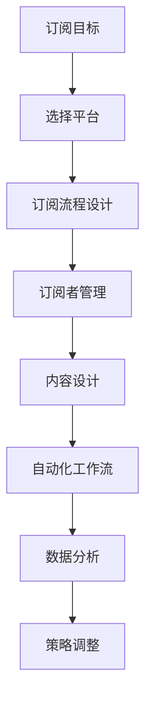

                 

# 建立邮件订阅列表：与粉丝保持长期互动

## 1. 背景介绍

### 1.1 问题由来
在互联网快速发展的今天，内容的传播方式变得多种多样，而电子邮件仍然是最直接、最稳定的方式之一。无论用户是关注技术新闻、获取最新产品信息，还是参与社区互动，订阅电子邮件都能提供稳定的信息流。此外，订阅电子邮件还能有效跟踪用户行为，为企业和品牌建立长效关系。

然而，传统邮件订阅列表的构建和管理仍然存在诸多挑战，如高维护成本、低订阅率、低参与度等问题。因此，本文将探讨如何利用现代技术手段，建立高效、稳定、可持续的邮件订阅列表，帮助企业与粉丝建立长期互动。

### 1.2 问题核心关键点
构建邮件订阅列表的关键在于以下几点：
- 确定订阅目标：明确订阅列表的目标，如推广产品、积累客户、建立品牌形象等。
- 选择合适的工具：评估各类邮件营销平台和工具，选择最适合自身需求的系统。
- 设计订阅流程：制定清晰、简洁、高效的订阅流程，提升用户订阅体验。
- 维护列表健康：定期清洗订阅列表，去除无效和低活跃度用户，提高列表质量。
- 提高互动率：通过精准的邮件内容设计，提升用户打开率、点击率和回复率。
- 追踪订阅效果：利用邮件营销平台的数据分析工具，评估订阅效果并持续优化。

### 1.3 问题研究意义
构建高效的邮件订阅列表，对于提升用户参与度、增强品牌粘性、推动产品销售具有重要意义。它能帮助企业与用户建立稳定的联系，通过持续的信息推送，保持用户对品牌和产品的长期关注。同时，通过数据分析，企业可以更好地理解用户需求和行为，从而优化产品和市场策略。

## 2. 核心概念与联系

### 2.1 核心概念概述

构建邮件订阅列表涉及多个核心概念：

- 邮件营销平台：如Mailchimp、SendinBlue、ActiveCampaign等，提供邮件发送、列表管理、用户分析等功能的平台。
- 订阅者管理：通过邮件营销平台的订阅功能，添加、管理、清洗订阅者信息，提升列表质量。
- 邮件内容设计：包括邮件主题、正文内容、CTA（Call To Action）等元素，影响用户打开率、点击率和回复率。
- 自动化工作流：利用邮件营销平台的自动化功能，实现自动发信、自动化回复等，提升效率和用户体验。
- 用户数据分析：利用邮件营销平台的数据分析工具，监控和分析订阅者行为，进行策略调整。

这些核心概念之间通过邮件营销平台串联起来，形成一个闭环系统，从而实现高效、稳定的邮件订阅列表构建和管理。

### 2.2 核心概念原理和架构的 Mermaid 流程图



### 2.3 核心概念的联系

- 订阅目标决定了选择平台和设计流程。如推广产品可能需要高交互性平台，积累客户可能需要低成本平台。
- 订阅流程设计直接影响订阅率，需简化步骤，提升用户体验。
- 订阅者管理是维护列表健康的基础，需定期清洗、活跃度分析。
- 内容设计直接影响用户互动率，需精准定位、精心设计。
- 自动化工作流提升效率，需合理安排触发条件和内容。
- 数据分析帮助评估效果，需持续优化策略，提升订阅质量。

这些概念相辅相成，形成一个完整的邮件订阅列表构建和管理系统。

## 3. 核心算法原理 & 具体操作步骤

### 3.1 算法原理概述

构建邮件订阅列表的核心算法原理基于以下步骤：

1. 确定订阅目标和需求，选择合适的邮件营销平台。
2. 设计订阅流程，引导用户完成订阅。
3. 通过订阅者管理功能，添加、清洗订阅者列表。
4. 根据订阅者行为和反馈，设计邮件内容，提升互动率。
5. 利用自动化工作流，优化邮件发送时间和内容。
6. 定期分析订阅者数据，调整策略，提升列表质量。

### 3.2 算法步骤详解

**Step 1: 确定订阅目标和需求**
- 明确订阅目标，如推广新产品、积累潜在客户、建立品牌形象等。
- 根据目标需求，选择适合的平台，如Mailchimp适合大中型企业，SendinBlue适合中小型企业。

**Step 2: 设计订阅流程**
- 设计简短、简洁、易操作的订阅流程。通常包括填写表单、验证邮箱、选择订阅列表等步骤。
- 添加激励机制，如优惠码、白皮书等，吸引用户订阅。

**Step 3: 添加和管理订阅者**
- 利用平台提供的订阅功能，添加新用户。
- 定期清洗列表，移除无效、低活跃度用户。
- 利用用户行为数据，标记高价值用户，提升互动率。

**Step 4: 设计邮件内容**
- 确定邮件主题，吸引用户点击。
- 设计邮件正文，提供有价值的信息。
- 添加CTA按钮，引导用户进行下一步操作，如访问网站、下载资料等。

**Step 5: 设置自动化工作流**
- 利用平台提供的自动化功能，设置触发条件，如新订阅者、特定行为触发等。
- 设置自动回复，提升用户体验。
- 定期评估自动化流程效果，调整触发条件和内容。

**Step 6: 分析订阅者数据**
- 利用平台提供的分析工具，监控订阅者行为数据。
- 评估邮件内容效果，如打开率、点击率、回复率等。
- 分析订阅者流失原因，进行策略调整。

### 3.3 算法优缺点

构建邮件订阅列表的算法具有以下优点：
- 精准定位用户需求，提升互动率。
- 自动化流程提升效率，减少人工成本。
- 定期分析数据，持续优化策略。

但该算法也存在一些局限性：
- 用户主动订阅意愿受影响，低活跃度用户难以清理。
- 数据隐私问题需严格遵守，需处理用户敏感信息。
- 需要持续投入时间和资源，维护和优化订阅列表。

### 3.4 算法应用领域

构建邮件订阅列表的算法在以下几个领域有广泛应用：

- 电子商务：通过订阅邮件推送促销信息、产品更新，提升用户粘性和购买率。
- 在线教育：通过订阅邮件推送课程更新、考试信息、学习资料，提升用户参与度。
- 社交媒体：通过订阅邮件推送最新内容、活动信息、社区动态，提升用户互动率。
- 科技公司：通过订阅邮件推送最新技术资讯、产品发布、技术交流，建立技术社区。
- 金融服务：通过订阅邮件推送金融市场信息、投资建议、理财资料，提升用户信任度。
- 健康医疗：通过订阅邮件推送健康知识、医疗资讯、健康报告，提升用户健康意识。

这些领域的应用展示了邮件订阅列表在提升用户参与、增加业务转化等方面的巨大潜力。

## 4. 数学模型和公式 & 详细讲解 & 举例说明

### 4.1 数学模型构建

邮件订阅列表的构建可以抽象为以下数学模型：

- 订阅目标：$\text{订阅目标} = \text{推广产品} + \text{积累客户} + \text{建立品牌形象}$
- 订阅率：$\text{订阅率} = \frac{\text{有效订阅用户数}}{\text{访问用户数}}$
- 互动率：$\text{互动率} = \frac{\text{打开率} + \text{点击率} + \text{回复率}}{100}$

其中，订阅目标、订阅率、互动率是构建订阅列表的关键指标。

### 4.2 公式推导过程

以订阅率为例，进行公式推导：

- $\text{订阅率} = \frac{\text{有效订阅用户数}}{\text{访问用户数}} = \frac{N_{\text{订阅}}}{N_{\text{访问}}}$
- 其中，$N_{\text{订阅}}$ 为有效订阅用户数，$N_{\text{访问}}$ 为访问用户数。

通过上述公式，可以计算出订阅率，从而评估订阅效果。

### 4.3 案例分析与讲解

假设某电商平台通过邮件营销推广新产品，统计数据如下：

- 访问用户数：10000
- 有效订阅用户数：500
- 打开率：20%
- 点击率：10%
- 回复率：5%

根据上述公式计算，订阅率为：

- $\text{订阅率} = \frac{500}{10000} = 5\%$

可以看出，当前订阅率较低，需优化订阅流程，提升用户体验。同时，需改进邮件内容设计，提高用户互动率。

## 5. 项目实践：代码实例和详细解释说明

### 5.1 开发环境搭建

构建邮件订阅列表需要一定的开发环境支持，通常使用Python和SMTP库。以下是搭建开发环境的步骤：

1. 安装Python：从官网下载并安装Python 3.x版本。
2. 安装SMTP库：使用pip安装SMTP库，方便发送邮件。
3. 配置邮件发送环境：设置SMTP服务器信息，如邮件地址、密码等。

### 5.2 源代码详细实现

以下是一个简单的Python代码实现，展示如何通过SMTP库发送邮件：

```python
import smtplib
from email.mime.text import MIMEText
from email.mime.multipart import MIMEMultipart

# 配置SMTP服务器信息
smtp_server = 'smtp.example.com'
smtp_port = 587
smtp_username = 'your_email@example.com'
smtp_password = 'your_email_password'

# 构建邮件内容
subject = '订阅成功通知'
body = '您已成功订阅我们的邮件列表，了解更多信息请访问我们的网站。'

# 创建邮件对象
message = MIMEMultipart()
message['From'] = smtp_username
message['To'] = 'recipient@example.com'
message['Subject'] = subject
message.attach(MIMEText(body, 'plain'))

# 发送邮件
with smtplib.SMTP(smtp_server, smtp_port) as server:
    server.starttls()
    server.login(smtp_username, smtp_password)
    server.send_message(message)
```

### 5.3 代码解读与分析

上述代码实现了一个简单的邮件发送功能，通过SMTP库连接SMTP服务器，并发送邮件。具体步骤如下：

1. 配置SMTP服务器信息，包括SMTP服务器地址、端口、邮箱用户名和密码。
2. 构建邮件内容，包括邮件主题和正文。
3. 创建邮件对象，设置发件人和收件人。
4. 使用SMTP服务器连接SMTP服务器，启动TLS加密。
5. 登录SMTP服务器，并发送邮件。

需要注意的是，实际应用中需处理邮件地址、邮箱密码等敏感信息，确保安全性。

### 5.4 运行结果展示

运行上述代码，通过SMTP服务器发送邮件，可以在收件人邮箱中看到如下内容：

```
Subject: 订阅成功通知
From: your_email@example.com
To: recipient@example.com

您已成功订阅我们的邮件列表，了解更多信息请访问我们的网站。
```

## 6. 实际应用场景

### 6.1 电子商务

电商平台可以通过邮件订阅列表推广新产品、促销活动、用户评价等，提升用户粘性和购买率。

**具体场景**：
- 用户访问电商平台，填写订阅表单。
- 电商平台在用户订阅后发送欢迎邮件，介绍新产品的基本信息。
- 用户点击邮件中的CTA按钮，访问电商平台购买页面。
- 电商平台根据用户行为数据，定期发送产品推荐邮件，提升复购率。

**预期效果**：
- 提升用户粘性，增加用户回购率。
- 精准推广新产品，提高销售转化率。

### 6.2 在线教育

在线教育平台可以通过邮件订阅列表推送课程更新、考试信息、学习资料，提升用户参与度。

**具体场景**：
- 用户访问在线教育平台，填写订阅表单。
- 在线教育平台在用户订阅后发送课程更新通知，介绍新课程信息。
- 用户点击邮件中的CTA按钮，访问在线教育平台学习课程。
- 在线教育平台根据用户学习行为数据，定期发送相关资料和考试提醒，提升用户学习效果。

**预期效果**：
- 提升用户参与度，增加平台活跃用户数。
- 精准推送学习资料，提高学习效果和满意度。

### 6.3 社交媒体

社交媒体平台可以通过邮件订阅列表推送最新内容、活动信息、社区动态，提升用户互动率。

**具体场景**：
- 用户访问社交媒体平台，填写订阅表单。
- 社交媒体平台在用户订阅后发送最新内容推荐，介绍热门话题和活动。
- 用户点击邮件中的CTA按钮，访问社交媒体平台参与互动。
- 社交媒体平台根据用户互动数据，定期推送相关内容，提升用户参与度。

**预期效果**：
- 提升用户互动率，增加平台活跃用户数。
- 精准推送相关内容，提升用户满意度和参与度。

### 6.4 科技公司

科技公司可以通过邮件订阅列表推送最新技术资讯、产品发布、技术交流，建立技术社区。

**具体场景**：
- 用户访问科技公司网站，填写订阅表单。
- 科技公司在用户订阅后发送最新技术资讯和产品发布信息，介绍新产品和功能。
- 用户点击邮件中的CTA按钮，访问科技公司官网或社区平台参与讨论。
- 科技公司根据用户行为数据，定期推送相关资料和社区讨论，提升用户粘性。

**预期效果**：
- 提升用户粘性，增加社区活跃用户数。
- 精准推送技术资讯，提升用户满意度和社区活跃度。

### 6.5 金融服务

金融服务公司可以通过邮件订阅列表推送金融市场信息、投资建议、理财资料，提升用户信任度。

**具体场景**：
- 用户访问金融服务公司网站，填写订阅表单。
- 金融服务公司在用户订阅后发送市场分析报告和投资建议，介绍市场趋势和投资机会。
- 用户点击邮件中的CTA按钮，访问金融服务公司官网或APP参与投资操作。
- 金融服务公司根据用户投资行为数据，定期推送相关资料和策略建议，提升用户信任度和参与度。

**预期效果**：
- 提升用户信任度，增加投资用户数。
- 精准推送投资建议，提升用户投资效果和满意度。

### 6.6 健康医疗

健康医疗公司可以通过邮件订阅列表推送健康知识、医疗资讯、健康报告，提升用户健康意识。

**具体场景**：
- 用户访问健康医疗公司网站，填写订阅表单。
- 健康医疗公司在用户订阅后发送最新健康知识、医疗资讯和健康报告，介绍健康生活方法和疾病预防知识。
- 用户点击邮件中的CTA按钮，访问健康医疗公司网站或APP获取更多健康资讯。
- 健康医疗公司根据用户行为数据，定期推送相关资料和健康建议，提升用户健康意识和满意度。

**预期效果**：
- 提升用户健康意识，增加用户粘性。
- 精准推送健康知识，提升用户健康效果和满意度。

## 7. 工具和资源推荐

### 7.1 学习资源推荐

以下是推荐的几本经典书籍，帮助读者深入理解邮件订阅列表的构建和管理：

- 《电子邮件营销实战指南》（Email Marketing Mastery）：详细介绍了电子邮件营销的理论和实践，涵盖邮件设计、策略制定等各方面内容。
- 《SEO与电子邮件营销：深度解读电子邮件营销的SEO策略》（SEO & Email Marketing: The Deep Dive）：介绍如何将SEO原则应用到电子邮件营销中，提升邮件效果。
- 《自动化电子邮件营销实战》（Email Marketing Automation Best Practices）：分享自动化邮件营销的最佳实践，提升效率和用户体验。
- 《邮件营销的科学与艺术》（Email Marketing Science and Art）：系统介绍了邮件营销的数据分析、优化策略等内容，提升邮件订阅列表质量。

### 7.2 开发工具推荐

构建邮件订阅列表需要多种开发工具支持，以下是推荐的工具列表：

- Python：灵活的编程语言，适合邮件营销的数据处理和自动化流程开发。
- SMTP库：用于发送邮件，支持SMTP协议，方便邮件发送。
- TensorFlow：用于数据分析和机器学习模型训练，提升邮件订阅效果的预测能力。
- Apache Spark：大数据处理框架，适合大规模用户行为数据的分析和挖掘。
- Apache Airflow：数据管道和任务调度工具，用于邮件订阅列表的自动化流程管理和监控。

### 7.3 相关论文推荐

以下是几篇关于邮件订阅列表构建和优化的经典论文，推荐阅读：

- "Building High-Performance Email Marketing Campaigns"（构建高性能电子邮件营销活动）：由邮件营销专家撰写，详细介绍了如何设计和优化电子邮件营销活动，提升用户参与率。
- "The Effects of Email Marketing Strategies on Customer Engagement and Loyalty"（电子邮件营销策略对客户参与度和忠诚度的影响）：研究了电子邮件营销策略对客户行为的影响，提供了优化策略的建议。
- "Email Marketing Analytics: From Basics to Advanced"（电子邮件营销分析：从基础到高级）：介绍如何利用数据工具分析邮件营销效果，优化策略和提升效果。
- "A Study on the Impact of Personalized Email Marketing on Customer Retention"（个性化电子邮件营销对客户保留率的影响研究）：研究了个性化邮件营销对客户保留率的影响，提供了优化建议。

## 8. 总结：未来发展趋势与挑战

### 8.1 研究成果总结

构建邮件订阅列表的研究取得了诸多进展，主要包括以下几个方面：

- 订阅目标的确定：明确订阅目标，选择适合的平台和策略。
- 订阅流程的设计：简化流程，提升用户体验。
- 订阅者管理：定期清洗列表，提升列表质量。
- 邮件内容设计：精准定位，提升互动率。
- 自动化工作流：优化流程，提升效率。
- 数据分析：监控和分析订阅者行为，持续优化策略。

这些研究成果为邮件订阅列表的构建和管理提供了系统的理论基础和方法工具。

### 8.2 未来发展趋势

展望未来，邮件订阅列表的构建和管理将呈现以下趋势：

- 个性化和定制化：利用用户行为数据，设计个性化邮件内容，提升用户参与度。
- 自动化和智能化：引入AI和机器学习技术，优化邮件发送时间和内容，提升效率和效果。
- 多渠道整合：结合社交媒体、APP、网站等多元渠道，提升用户粘性和互动率。
- 数据驱动决策：利用大数据分析，优化订阅策略，提升订阅效果。
- 用户隐私保护：严格遵守数据隐私法规，提升用户信任度和满意度。
- 国际化拓展：拓展全球市场，适应不同国家和地区的文化和习惯。

### 8.3 面临的挑战

尽管邮件订阅列表在构建和管理上取得了诸多进展，但仍面临以下挑战：

- 用户隐私保护：需严格遵守数据隐私法规，确保用户数据安全。
- 数据质量管理：需定期清洗和维护订阅者列表，确保数据质量。
- 自动化流程优化：需优化自动化流程，避免用户体验不佳。
- 数据驱动决策：需利用大数据分析，优化订阅策略，提升效果。
- 多渠道整合：需结合多元渠道，提升用户粘性和互动率。
- 技术安全保障：需采用先进的安全技术，保障系统稳定和可靠。

### 8.4 研究展望

未来，构建邮件订阅列表的研究需进一步突破以下挑战：

- 提升个性化和定制化水平：利用深度学习等技术，设计更加精准的个性化邮件内容。
- 增强自动化和智能化能力：引入更多AI和机器学习技术，优化自动化流程。
- 实现多渠道整合和协作：结合社交媒体、APP、网站等多元渠道，提升用户粘性和互动率。
- 强化数据驱动决策：利用大数据分析，优化订阅策略，提升效果。
- 保障用户隐私和安全：严格遵守数据隐私法规，确保用户数据安全。
- 拓展国际化市场：适应不同国家和地区的文化和习惯，拓展全球市场。

## 9. 附录：常见问题与解答

**Q1：构建邮件订阅列表需要哪些资源？**

A: 构建邮件订阅列表需要以下资源：
- 邮件营销平台：如Mailchimp、SendinBlue、ActiveCampaign等。
- 用户行为数据：如访问日志、订阅数据、点击数据等。
- 开发环境：如Python、SMTP库、邮件服务器等。
- 数据工具：如TensorFlow、Apache Spark、Apache Airflow等。
- 安全技术：如SSL加密、安全认证等。

**Q2：如何提升邮件订阅列表的互动率？**

A: 提升邮件订阅列表的互动率可以从以下几个方面入手：
- 设计简洁的订阅流程，简化用户体验。
- 精准设计邮件内容，提升用户参与度。
- 定期发送有价值的信息，满足用户需求。
- 引入自动化工作流，优化邮件发送时间和内容。
- 分析订阅者数据，调整策略，提升互动率。

**Q3：如何确保邮件订阅列表的数据隐私安全？**

A: 确保邮件订阅列表的数据隐私安全需从以下几个方面入手：
- 严格遵守数据隐私法规，如GDPR、CCPA等。
- 采用SSL加密传输数据，保护用户数据安全。
- 实施数据脱敏和匿名化处理，保护用户隐私。
- 定期审查数据处理流程，确保数据安全。

**Q4：如何优化自动化工作流？**

A: 优化自动化工作流需从以下几个方面入手：
- 合理设置触发条件，避免用户体验不佳。
- 设计简洁的自动化流程，提升效率。
- 定期监控自动化流程效果，及时调整。
- 引入机器学习和AI技术，提升自动化能力。

**Q5：如何利用大数据分析优化订阅策略？**

A: 利用大数据分析优化订阅策略需从以下几个方面入手：
- 收集和整理用户行为数据，分析用户需求和行为。
- 设计数据模型，利用机器学习技术，预测用户行为和偏好。
- 定期评估订阅效果，优化策略和提升效果。
- 引入多渠道整合，提升用户粘性和互动率。

以上是构建邮件订阅列表的研究总结和未来展望，希望能对读者有所帮助。

---

作者：禅与计算机程序设计艺术 / Zen and the Art of Computer Programming

