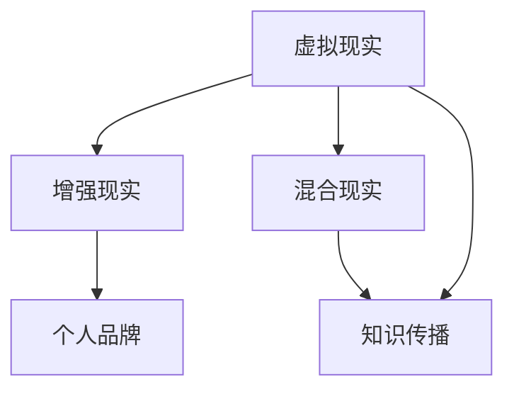

                 

# 开发个人品牌VR/AR体验：创新知识传播方式

> 关键词：虚拟现实 (VR), 增强现实 (AR), 个人品牌, 知识传播, 交互式教学, 混合现实 (MR)

## 1. 背景介绍

### 1.1 问题由来
随着数字技术的迅猛发展，虚拟现实(VR)和增强现实(AR)技术逐渐从科幻走向现实。这些技术不仅能提供沉浸式的视觉体验，还能让人们以全新的方式互动交流，甚至超越物理空间的界限。在教育、娱乐、医疗、企业培训等多个领域，VR/AR已经成为重要的工具。然而，目前VR/AR内容大都由大型企业或专业团队制作，受众范围有限。而对于大众用户，尤其是技术爱好者，如何开发高质量的VR/AR内容，以个人品牌吸引更多关注，成为一个亟待解决的问题。

### 1.2 问题核心关键点
本节将介绍利用VR/AR技术进行知识传播的核心关键点，具体包括：

- 虚拟现实与增强现实的原理和差异
- VR/AR内容开发的基础工具和平台
- 如何构建高质量的个人品牌VR/AR体验
- 交互式教学和知识传播的创新方法
- VR/AR在教育、培训和企业应用中的实际案例

## 2. 核心概念与联系

### 2.1 核心概念概述

为更好地理解个人品牌VR/AR体验的开发方法，本节将介绍几个密切相关的核心概念：

- 虚拟现实(Virtual Reality, VR)：通过计算机生成一个可交互的三维环境，使用户沉浸其中。VR用户通常佩戴头戴式显示器(HMD)和控制器，进行全方位交互。

- 增强现实(Augmented Reality, AR)：在现实世界中叠加虚拟信息，如图像、动画、声音等。AR用户使用智能手机、平板或AR眼镜，通过摄像头捕捉真实场景并展示虚拟信息。

- 混合现实(Mixed Reality, MR)：结合VR和AR的优点，创建虚实融合的互动环境。MR应用广泛，如远程协作、虚拟旅游、现场直播等。

- 个人品牌(Personal Branding)：指个人或机构通过特定的标识、行为、言论等方式，形成独特的、辨识度高的形象，并以此吸引公众关注和认可。

- 知识传播(Knowledge Dissemination)：利用各种媒介和方法，向受众传递知识、技能、经验等。

这些概念之间的逻辑关系可以通过以下Mermaid流程图来展示：



这个流程图展示了几者之间的联系和交互方式：

1. VR和AR分别构建虚拟和增强的交互环境，为其上进行的知识传播提供了载体。
2. MR将VR和AR的优点结合，扩展了知识传播的维度和方式。
3. 个人品牌可以成为知识传播过程中的引导者和受益者，利用VR/AR技术吸引关注。
4. 知识传播是VR/AR技术应用的主要目标，可以拓展为教育、培训、科普等多种形式。

## 3. 核心算法原理 & 具体操作步骤
### 3.1 算法原理概述

个人品牌VR/AR体验的开发，本质上是一个创意设计、内容制作、交互设计和用户传播的协同过程。其核心算法包括但不限于以下几类：

- 三维建模和渲染：利用3D建模工具，如Blender、Maya等，创建虚拟场景和人物。
- 物理模拟和交互：通过物理引擎，如Unity中的PhysX、Unreal Engine中的Chaos Physics，实现虚拟物体的运动和交互。
- 感知与识别：使用计算机视觉和深度学习技术，如TensorFlow、PyTorch，实现虚拟对象的识别和交互。
- 语音与文本交互：通过语音识别和自然语言处理技术，如Google Speech-to-Text、IBM Watson，实现语音控制和文本输入。

这些算法协同工作，使得VR/AR内容具有高度的真实感和互动性，为用户提供了沉浸式的知识传播体验。

### 3.2 算法步骤详解

开发个人品牌VR/AR体验的详细步骤包括：

1. **项目规划与需求分析**：明确目标用户群体，设计内容主题和呈现方式，确定VR/AR技术的应用场景。
2. **3D建模与环境设计**：选择适当的工具，创建高质量的虚拟场景和角色。
3. **物理模拟与交互设计**：添加交互元素和逻辑，实现虚拟物体的物理行为和用户互动。
4. **感知与识别技术集成**：使用深度学习模型进行图像识别、语音识别等，提升用户体验。
5. **交互式教学与内容制作**：设计知识传递路径，制作教育、科普、游戏等多种类型的内容。
6. **测试与优化**：在开发过程中进行持续的测试和优化，确保内容质量和用户体验。
7. **发布与传播**：利用社交媒体、视频平台、VR/AR应用商店等渠道发布内容，吸引目标用户。

### 3.3 算法优缺点

VR/AR体验开发的优势包括：

1. 高度沉浸感：用户可以完全沉浸在虚拟环境中，获得比传统媒体更强的感官体验。
2. 互动性强：用户可以与虚拟内容进行深度交互，提升学习效果。
3. 传播广泛：结合社交媒体，易于传播和推广。

其不足之处包括：

1. 技术门槛高：需要具备较高的编程、3D建模和交互设计能力。
2. 设备依赖：依赖高质量的VR/AR设备，如头戴式显示器和手柄。
3. 成本较高：开发和维护成本相对较高，适用于有一定经济基础的个人和团队。

### 3.4 算法应用领域

个人品牌VR/AR体验的应用领域广泛，涵盖教育、娱乐、旅游、企业培训等多个方面：

- **教育**：利用VR/AR进行沉浸式教学，如历史场景重现、科学实验模拟等，提升学习效果。
- **娱乐**：开发游戏、故事、电影等娱乐内容，吸引用户注意力。
- **旅游**：创建虚拟旅游体验，让用户足不出户便能欣赏世界各地的美景。
- **企业培训**：制作产品演示、安全教育、员工培训等内容，提高培训效果。

此外，个人品牌VR/AR体验也在医疗、广告、设计等领域逐渐显现其潜力，为不同行业带来新的发展机遇。

## 4. 数学模型和公式 & 详细讲解 & 举例说明

### 4.1 数学模型构建

本节将使用数学语言对个人品牌VR/AR体验的开发过程进行更加严格的刻画。

假设开发一个教育场景中的VR课程，其中涉及3D建模、物理模拟、交互设计等环节。我们以物理模拟为例，构建一个简单的模型。

设虚拟场景中有物体A和物体B，物体A在位置$(x_A, y_A, z_A)$，速度$(v_{Ax}, v_{Ay}, v_{Az})$，物体B在位置$(x_B, y_B, z_B)$，速度$(v_{Bx}, v_{By}, v_{Bz})$。当物体A和物体B发生碰撞时，需计算两物体的碰撞响应。

### 4.2 公式推导过程

以物体A和物体B发生碰撞时，物体A的速度变化为例，进行公式推导。

根据牛顿第二定律，物体A在碰撞前的动量$P_{A0}=m_A v_{A0}$，碰撞后的动量$P_{Af}=m_A v_{Af}$。设碰撞前后动量变化为$\Delta P_A$，则有：

$$
\Delta P_A = P_{Af} - P_{A0} = m_A (v_{Af} - v_{A0})
$$

由动量守恒定律，设碰撞前后动量变化为$\Delta P_B$，则有：

$$
\Delta P_A = -\Delta P_B
$$

设碰撞过程中，物体A的速度变化为$\Delta v_A$，物体B的速度变化为$\Delta v_B$，则有：

$$
m_A \Delta v_A = -m_B \Delta v_B
$$

由于碰撞过程中，物体A的速度变化为$\Delta v_A = v_{Af} - v_{A0}$，物体B的速度变化为$\Delta v_B = v_{Bf} - v_{B0}$，则有：

$$
m_A (v_{Af} - v_{A0}) = -m_B (v_{Bf} - v_{B0})
$$

利用上述公式，可以计算出物体A的速度变化，从而模拟碰撞后的物理行为。

### 4.3 案例分析与讲解

以一个简单的VR课程开发案例为例，说明如何利用物理模拟和交互设计实现知识传播。

**案例背景**：
开发一个模拟太空船驾驶的VR课程，用户需要掌握基本的太空航行知识。课程包括太空船的启动、避障、对接等任务。

**案例流程**：

1. **3D建模**：
   - 创建太空船和太空环境的3D模型。
   - 利用3D建模工具，对模型进行材质、纹理、光照等细节处理。

2. **物理模拟**：
   - 利用物理引擎，模拟太空船的动力学行为，如启动加速、制动、转向等。
   - 设置太空船的碰撞响应，使其在撞上太空障碍物时能够反弹。

3. **交互设计**：
   - 用户可以通过手柄控制太空船的运动。
   - 用户可以通过语音指令控制太空船的速度和方向。
   - 在用户遇到太空障碍物时，系统自动进行提示，引导用户正确避障。

4. **知识传播**：
   - 在游戏过程中，通过虚拟文本、语音解说等方式，传递太空航行知识。
   - 在任务完成后，系统提供总结和反馈，帮助用户巩固知识。

通过这个案例，我们可以看到VR/AR体验开发中各环节的协同作用，以及知识传播的创新方式。

## 5. 项目实践：代码实例和详细解释说明
### 5.1 开发环境搭建

在进行VR/AR体验开发前，我们需要准备好开发环境。以下是使用Unity 3D进行VR/AR开发的环境配置流程：

1. 安装Unity Hub：从官网下载并安装Unity Hub，用于创建和管理Unity项目。

2. 安装Unity编辑器：选择一个适合Unity开发的计算机，安装Unity 3D编辑器。

3. 配置开发环境：安装Visual Studio Code或Visual Studio，并配置Unity编辑器与开发环境。

4. 选择插件和资产：使用Unity Asset Store和Unity Hub，选择适合的3D建模、物理引擎、交互设计等插件和资产。

5. 安装VR/AR设备：准备VR/AR头盔和手柄等设备，测试设备与Unity编辑器的兼容性。

完成上述步骤后，即可在Unity编辑器中开始开发VR/AR项目。

### 5.2 源代码详细实现

下面以一个简单的VR课程开发案例为例，给出使用Unity 3D进行太空船驾驶课程的详细代码实现。

**项目架构**：

- **场景创建**：创建太空环境和太空船。
- **物理模拟**：实现太空船的动力学行为和碰撞响应。
- **交互设计**：用户通过手柄和语音指令控制太空船。
- **知识传播**：在游戏中嵌入文本和语音解说。

**关键代码实现**：

```csharp
// 太空船运动控制
void Update()
{
    if (Input.GetMouseButtonDown(0))
    {
        Vector3 delta = Input.mousePosition - camera.worldToScreenPoint(Input.mousePosition);
        Vector3 forward = transform.forward;
        Vector3 right = transform.right;
        float x = delta.x * sensitivity * Time.deltaTime;
        float y = delta.y * sensitivity * Time.deltaTime;
        float speed = inputSpeed * Time.deltaTime;
        transform.Translate(right * x + forward * y, Space.World);
    }
}

// 碰撞响应
void OnCollisionEnter(Collision collision)
{
    if (collision.gameObject.tag == "Obstacle")
    {
        Rigidbody rb = GetComponent<Rigidbody>();
        rb.AddForce(-physics.gravity * rb.mass * 0.1f);
        Debug.Log("Collided with obstacle!");
    }
}

// 文本和语音解说
void Start()
{
    text.text = "Welcome to space navigation!";
    audio.PlayOneShot(audioClip);
}
```

### 5.3 代码解读与分析

让我们再详细解读一下关键代码的实现细节：

**Update函数**：
- 使用鼠标输入控制太空船的移动方向。
- 根据鼠标位置和灵敏度计算出左右移动的方向向量，并结合速度参数控制飞船的运动。

**OnCollisionEnter函数**：
- 检测太空船是否与障碍物发生碰撞。
- 当与障碍物碰撞时，给太空船施加一个向上的冲击力，使其反弹。

**Start函数**：
- 在游戏开始时，显示欢迎文本并播放音频解说。
- 使用Unity自带的UI和Audio组件，实现文本和语音解说。

这些代码展示了Unity 3D中常见的交互设计和物理模拟方法，通过合理利用这些技术，开发者可以构建出沉浸式、互动性强的VR/AR体验。

### 5.4 运行结果展示

运行Unity编辑器，可以通过VR头盔或AR眼镜体验到太空船驾驶的课程。用户可以自由控制飞船的加速、转向和避障，同时通过文本和语音了解太空航行知识。这不仅能够提升学习的趣味性和参与度，还能提高用户的沉浸感和知识掌握效果。

## 6. 实际应用场景
### 6.1 教育领域

VR/AR技术在教育领域有着广泛的应用前景，可以提供沉浸式和互动式的学习体验，增强学生的学习兴趣和效果。

- **历史课堂**：通过VR技术重现历史事件，如埃及金字塔的建造过程、二战的空中战斗等，让学生身临其境地了解历史。
- **科学实验**：利用AR技术，展示复杂的科学实验，如DNA复制过程、化学反应等，让学生直观地理解科学原理。

### 6.2 企业培训

在企业培训中，VR/AR技术可以提供虚拟现实培训环境，帮助员工更好地掌握技能。

- **安全教育**：通过VR技术模拟危险工作场景，如高空作业、紧急疏散等，帮助员工在安全的环境中练习操作。
- **产品演示**：使用AR技术展示产品的内部结构、使用方法，帮助销售人员更好地介绍产品。

### 6.3 医疗领域

VR/AR技术在医疗领域也有着重要的应用，可以辅助医生进行手术模拟、病人教育等。

- **手术模拟**：通过VR技术进行手术模拟训练，帮助医生掌握复杂的手术技巧。
- **病人教育**：利用AR技术展示人体解剖结构、疾病传播过程，帮助病人更好地理解自己的病情。

### 6.4 未来应用展望

随着VR/AR技术的不断进步，其应用场景将更加广泛。未来，VR/AR技术可能深入到更多领域，带来全新的变革：

- **社交娱乐**：通过VR社交平台，用户可以进行虚拟会议、虚拟旅游、虚拟音乐会等，实现新形式的社交体验。
- **虚拟购物**：利用AR技术，用户可以在虚拟世界中试穿、试用、试用产品，提升购物体验。
- **远程协作**：通过VR/AR技术，实现远程协作和会议，打破物理空间的限制。

## 7. 工具和资源推荐
### 7.1 学习资源推荐

为了帮助开发者系统掌握VR/AR技术的理论基础和实践技巧，这里推荐一些优质的学习资源：

1. **Unity官方文档**：Unity 3D的官方文档，详细介绍了Unity editor的使用方法、插件安装、代码编写等，是开发VR/AR项目的必备指南。

2. **Unity Learning Center**：Unity官网提供的在线学习资源，包括视频教程、课程、示例项目等，帮助开发者快速上手Unity开发。

3. **Unreal Engine官方文档**：Unreal Engine的官方文档，提供了全面的开发指南、API文档、插件支持等，是开发VR/AR项目的可靠参考。

4. **C#编程教程**：C#作为Unity 3D的主要编程语言，学习C#编程是掌握VR/AR开发的基础。推荐《C#编程指南》等书籍和在线教程。

5. **VR/AR技术博客**：如The VR Feed、VR Daily等，定期发布最新的VR/AR技术动态、开发工具、案例分析等内容，是了解行业趋势和技术进展的重要渠道。

通过对这些资源的学习实践，相信你一定能够快速掌握VR/AR技术的精髓，并用于解决实际的开发问题。

### 7.2 开发工具推荐

高效的开发离不开优秀的工具支持。以下是几款用于VR/AR开发常用的工具：

1. **Unity 3D**：由Unity Technologies开发，支持创建高质量的3D游戏、应用和交互体验，是当前最流行的VR/AR开发引擎之一。

2. **Unreal Engine**：由Epic Games开发，提供了强大的物理模拟、图形渲染、人工智能等功能，适合开发高性能的VR/AR项目。

3. **Blender**：一个免费的开源3D建模和动画软件，支持导入和导出多种3D格式，适用于各种创意设计工作。

4. **Adobe After Effects**：用于视频特效和动画制作，支持VR/AR内容的后期制作和渲染。

5. **Google ARCore**：Google开发的AR开发框架，支持Android平台上的AR功能，方便开发者快速构建AR应用。

6. **Microsoft HoloLens**：Microsoft的增强现实平台，支持开发AR应用，提供丰富的传感器和交互工具。

合理利用这些工具，可以显著提升VR/AR项目的开发效率，加快创新迭代的步伐。

### 7.3 相关论文推荐

VR/AR技术的发展源于学界的持续研究。以下是几篇奠基性的相关论文，推荐阅读：

1. **《V-Ray: A fast ray tracer for real-time rendering》**：介绍了一种高效的实时渲染算法V-Ray，支持复杂的物理模拟和光影效果。

2. **《Holographic Video Conferencing: Technology and Practice》**：详细介绍了虚拟会议技术的原理和应用，探讨了虚拟现实在远程协作中的应用前景。

3. **《A Survey of Virtual and Augmented Reality for STEM Education》**：综述了VR/AR在科学、技术、工程和数学教育中的应用，展示了其提高教学效果和学生参与度的潜力。

4. **《PhysX: A general physics engine for interactive 3D graphics applications》**：介绍了PhysX物理引擎，支持高质量的物理模拟和碰撞检测。

5. **《Real-time ray tracing for mobile VR/AR》**：介绍了在移动设备上进行实时光线追踪的技术，推动了移动端VR/AR应用的发展。

这些论文代表了大规模VR/AR技术的发展脉络。通过学习这些前沿成果，可以帮助研究者把握学科前进方向，激发更多的创新灵感。

## 8. 总结：未来发展趋势与挑战

### 8.1 总结

本文对个人品牌VR/AR体验的开发方法进行了全面系统的介绍。首先阐述了VR/AR技术的原理和应用，明确了个人品牌和知识传播的创新意义。其次，从原理到实践，详细讲解了VR/AR体验的数学模型和算法步骤，给出了具体的代码实现。同时，本文还广泛探讨了VR/AR在教育、企业培训等多个领域的应用前景，展示了技术的广泛潜力。最后，本文精选了VR/AR技术的各类学习资源，力求为读者提供全方位的技术指引。

通过本文的系统梳理，可以看到，VR/AR技术正在成为创新知识传播的重要工具，极大地拓展了教育的边界，提升了用户的参与度和体验感。未来，伴随VR/AR技术的不断演进，其在教育、培训、娱乐、医疗等领域的应用将更加广泛，为构建人机协同的智能社会带来深远影响。

### 8.2 未来发展趋势

展望未来，VR/AR技术将呈现以下几个发展趋势：

1. **更高的沉浸感**：随着硬件设备的不断升级，VR/AR体验将更加逼真和自然，为用户提供沉浸式的体验。

2. **更强的交互性**：通过自然语言处理、手势识别等技术，用户将能够更自然、更高效地与虚拟环境互动。

3. **更广泛的应用**：VR/AR技术将在更多领域得到应用，如远程协作、虚拟旅游、虚拟购物等，带来全新的生活方式和工作方式。

4. **更高的可访问性**：随着设备价格的下降和普及率的提高，更多的用户将能够体验到VR/AR技术，推动其应用的普及。

5. **更全面的内容生态**：随着内容的丰富和多样，VR/AR技术将不断扩展其应用场景和用户群体。

以上趋势凸显了VR/AR技术的广阔前景。这些方向的探索发展，必将进一步推动技术创新和应用深化，为未来的发展带来更多可能性。

### 8.3 面临的挑战

尽管VR/AR技术已经取得了瞩目成就，但在迈向更加智能化、普适化应用的过程中，它仍面临着诸多挑战：

1. **技术成熟度**：虽然硬件设备不断升级，但整体技术成熟度仍需提升，以支持更复杂和更高质量的体验。

2. **内容制作难度**：高质量的VR/AR内容制作需要高水平的3D建模、物理模拟和交互设计，门槛较高。

3. **设备兼容性**：不同设备之间的兼容性问题仍需解决，用户切换设备体验不一致。

4. **应用场景局限**：当前VR/AR技术在特定场景中的应用较为局限，如大型空间、长时间使用等。

5. **健康和安全**：长时间使用VR/AR设备可能对用户的视觉和身体产生不良影响，需关注健康和安全问题。

6. **内容质量控制**：VR/AR内容的质量和安全性需进一步加强，避免虚假信息和有害内容对用户产生负面影响。

7. **生态系统完善**：当前VR/AR生态系统仍需完善，用户和开发者需更多支持和服务。

这些挑战凸显了VR/AR技术在应用和发展过程中需要进一步解决的问题。唯有不断创新和优化，才能推动VR/AR技术的发展和应用。

### 8.4 研究展望

面对VR/AR技术所面临的挑战，未来的研究需要在以下几个方面寻求新的突破：

1. **高精度传感和感知技术**：开发更精准的传感器和感知算法，提升虚拟环境与真实世界的融合度。

2. **智能化内容生成**：利用深度学习等技术，自动生成高质量的VR/AR内容，降低内容制作难度。

3. **轻量化和高效渲染**：开发更高效的内容渲染和处理算法，提升体验的流畅性和质量。

4. **跨平台兼容性**：提升不同设备和平台之间的兼容性，实现无缝切换和共享体验。

5. **人机协作和交互**：研究人机协作和智能交互方法，提升用户的自然交互体验。

6. **健康和安全保障**：开发健康安全监测工具，避免长期使用对用户产生不良影响。

7. **内容生态建设**：建立开放、共享的内容生态系统，促进内容创作和分享。

这些研究方向将进一步推动VR/AR技术的成熟和应用深化，为未来的发展提供更多可能性。总之，VR/AR技术正处于快速发展阶段，其应用前景广阔，未来必将带来更多创新和变革。

## 9. 附录：常见问题与解答

**Q1: VR/AR体验开发需要哪些技术支持？**

A: VR/AR体验开发需要以下技术支持：

1. **3D建模和渲染**：利用Blender、Maya等工具创建和渲染高质量的3D模型。

2. **物理模拟**：使用Unity的PhysX或Unreal的Chaos Physics等物理引擎，实现虚拟物体的运动和交互。

3. **感知与识别**：利用深度学习技术，如TensorFlow、PyTorch，实现虚拟对象的识别和交互。

4. **语音与文本交互**：通过Google Speech-to-Text、IBM Watson等技术，实现语音控制和文本输入。

**Q2: VR/AR体验开发中的常见问题有哪些？**

A: VR/AR体验开发中常见的技术问题包括：

1. **渲染性能问题**：渲染复杂场景时，可能会出现卡顿或低帧率的问题，需优化渲染算法或硬件设备。

2. **用户适应问题**：新手用户可能会对虚拟环境感到不适，需优化界面设计，提供指导和培训。

3. **内容质量问题**：内容质量不足会影响用户体验，需提高内容制作的水平和多样性。

4. **交互复杂度**：复杂的交互设计可能会增加用户的学习成本，需优化交互流程和提示。

5. **设备兼容性问题**：不同设备之间的兼容性问题需解决，确保用户切换设备体验一致。

6. **内容版权问题**：开发和分享内容需注意版权问题，避免侵权。

通过理解这些问题和解决方案，开发者可以更好地应对VR/AR项目开发中的技术挑战，提升开发质量和用户体验。

**Q3: VR/AR体验开发有哪些平台选择？**

A: 目前流行的VR/AR体验开发平台包括：

1. **Unity 3D**：功能强大，适用于各种类型的VR/AR项目，具有庞大的开发者社区。

2. **Unreal Engine**：支持高性能渲染和物理模拟，适用于复杂和高性能的VR/AR项目。

3. **Google ARCore**：支持Android平台的AR功能，方便开发者快速构建AR应用。

4. **Microsoft HoloLens**：提供增强现实平台，支持开发AR应用，具有丰富的传感器和交互工具。

选择适合自己的平台，并结合具体需求和资源，是开发高质量VR/AR体验的重要步骤。

**Q4: VR/AR体验在实际应用中有哪些挑战？**

A: VR/AR体验在实际应用中面临的挑战包括：

1. **技术成熟度**：当前VR/AR技术仍需不断提升，以支持更复杂和更高质量的体验。

2. **内容制作难度**：高质量的VR/AR内容制作需要高水平的3D建模、物理模拟和交互设计，门槛较高。

3. **设备兼容性**：不同设备之间的兼容性问题需解决，用户切换设备体验不一致。

4. **应用场景局限**：当前VR/AR技术在特定场景中的应用较为局限，如大型空间、长时间使用等。

5. **健康和安全**：长时间使用VR/AR设备可能对用户的视觉和身体产生不良影响，需关注健康和安全问题。

6. **内容质量控制**：VR/AR内容的质量和安全性需进一步加强，避免虚假信息和有害内容对用户产生负面影响。

7. **生态系统完善**：当前VR/AR生态系统仍需完善，用户和开发者需更多支持和服务。

通过理解这些挑战和解决方案，开发者可以更好地应对实际应用中的问题，推动VR/AR技术的发展和普及。

---

作者：禅与计算机程序设计艺术 / Zen and the Art of Computer Programming

