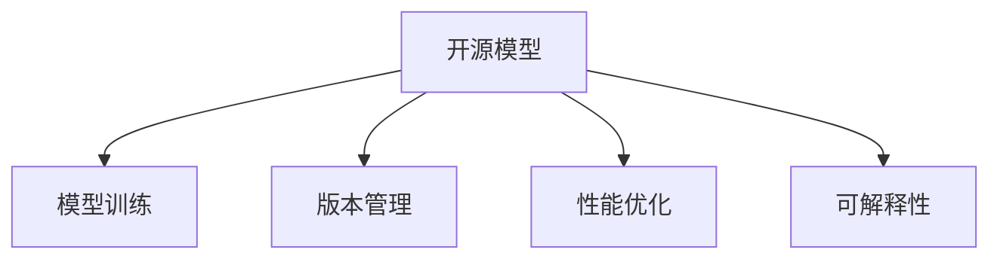

                 

# 开源模型的倡导者：Lepton AI的技术理念

## 1. 背景介绍

### 1.1 问题由来

在AI领域，开源模型的出现极大地推动了技术创新与产业应用的发展。开源模型基于社区的力量，汇聚了全球最优秀的研究者与开发者的智慧，加速了技术的迭代与完善。然而，随着开源模型的日益丰富，其管理与维护也变得愈加复杂，需要专业的团队和资金支持。

Lepton AI正是在这一背景下诞生的。作为一个致力于开源AI模型推广与优化的小而美的公司，Lepton AI秉持“以开放为原则，以创新为导向”的核心理念，致力于为开源模型社区提供一站式的技术支持与服务。

### 1.2 问题核心关键点

Lepton AI通过多年实践，总结出开源模型推广与优化过程中的几个核心关键点，包括模型训练、版本管理、性能优化等。这些关键点不仅决定了开源模型的质量与可用性，也直接影响了其普及与应用的广度与深度。

## 2. 核心概念与联系

### 2.1 核心概念概述

为更好地理解Lepton AI的技术理念，本节将介绍几个密切相关的核心概念：

- **开源模型**：指在开源许可下，任何人都可以自由使用、修改和分发，包括但不限于代码、数据与文档。开源模型在AI领域广泛应用，促进了技术共享与创新。

- **模型训练**：指通过数据和算法对模型进行训练，以使其能够执行特定任务的过程。训练过程中的数据选择、超参数配置、优化算法等都对模型的性能与泛化能力有重要影响。

- **版本管理**：指对开源模型及其衍生版本的控制与跟踪，确保每个版本的功能与性能稳定一致。版本管理涉及到代码提交、版本发布、回归测试等过程。

- **性能优化**：指通过各种技术手段提升模型在特定任务上的效率与效果，包括但不限于模型剪枝、量化、加速等。性能优化使得模型更易于部署与使用。

- **可解释性**：指模型决策过程的透明性与可理解性。可解释性是AI模型可信与可控的重要保证，特别是在医疗、金融等高风险领域，可解释性尤为关键。

这些核心概念之间的逻辑关系可以通过以下Mermaid流程图来展示：



这个流程图展示了几大核心概念及其之间的关系：

1. 开源模型基于训练与优化，逐步提升性能与可用性。
2. 版本管理确保模型的稳定与一致，便于分发与迭代。
3. 性能优化使得模型更高效，便于部署与应用。
4. 可解释性增强模型的可信性与可控性，保障应用安全。

这些概念共同构成了开源模型的推广与应用框架，使得Lepton AI能够在开源模型社区中发挥重要作用。

## 3. 核心算法原理 & 具体操作步骤

### 3.1 算法原理概述

Lepton AI的技术理念主要围绕以下几个算法原理展开：

- **混合精度训练**：通过降低模型的精度，减少内存与计算资源消耗，同时保持模型的性能。
- **模型剪枝与量化**：通过删除或替换模型中的冗余参数，减少模型的大小，提升推理速度。
- **对抗训练与正则化**：通过引入对抗样本或正则化技术，增强模型的鲁棒性与泛化能力。
- **自适应学习率调度**：根据模型性能动态调整学习率，提高模型训练效率与效果。
- **模型蒸馏**：通过知识转移，将大模型的知识传递给小型模型，降低大模型复杂度，提高小型模型性能。

### 3.2 算法步骤详解

以下我们将详细讲解Lepton AI在开源模型优化中的几个关键步骤：

**Step 1: 数据准备**

- 收集并标注数据集，确保数据的质量与多样性。
- 将数据划分为训练集、验证集和测试集，划分为小批量处理。

**Step 2: 模型选择与配置**

- 根据任务需求选择合适的模型，如BERT、GPT等。
- 配置模型超参数，如学习率、批大小、优化器等。

**Step 3: 混合精度训练**

- 使用混合精度训练技术，降低模型精度，提高训练效率。
- 在混合精度模式下，模型使用半精度浮点数进行计算，同时保持浮点精度以确保精度。

**Step 4: 模型剪枝与量化**

- 通过剪枝技术去除模型中不重要的参数，减少模型大小。
- 使用量化技术将浮点参数转化为定点参数，进一步减少内存占用。

**Step 5: 对抗训练与正则化**

- 引入对抗样本，增强模型的鲁棒性。
- 使用L2正则、Dropout等技术，防止模型过拟合。

**Step 6: 自适应学习率调度**

- 根据模型在验证集上的性能，动态调整学习率。
- 使用自适应学习率调度算法，如AdamW、Adafactor等，提高训练效果。

**Step 7: 模型蒸馏**

- 选择一个小模型作为蒸馏目标，使用大模型的知识进行训练。
- 使用知识蒸馏技术，将大模型的输出作为小模型的目标，进行梯度更新。

**Step 8: 模型验证与测试**

- 在验证集上评估模型性能，调整超参数。
- 在测试集上测试模型效果，进行最终评估。

### 3.3 算法优缺点

Lepton AI的技术理念中的算法优缺点如下：

- **混合精度训练**：
  优点：提高训练效率，降低计算资源消耗。
  缺点：可能导致模型精度降低，需要更复杂的计算。

- **模型剪枝与量化**：
  优点：减少模型大小，提升推理速度。
  缺点：可能影响模型性能，需要细致的优化策略。

- **对抗训练与正则化**：
  优点：增强模型鲁棒性，提高泛化能力。
  缺点：训练时间较长，可能增加计算复杂度。

- **自适应学习率调度**：
  优点：提高训练效率与效果，减少过拟合风险。
  缺点：需要更多的实验与调参，可能增加模型复杂度。

- **模型蒸馏**：
  优点：降低大模型复杂度，提高小型模型性能。
  缺点：蒸馏过程复杂，需要细致的设计与实验。

### 3.4 算法应用领域

Lepton AI的技术理念在以下几个领域得到了广泛的应用：

- **医疗影像分析**：通过优化开源模型，加速医疗影像的自动分析与诊断。
- **金融风险评估**：使用混合精度与模型蒸馏技术，优化金融风险预测模型。
- **自然语言处理**：应用模型剪枝与量化，提高NLP任务的效率与性能。
- **自动驾驶**：优化传感器数据处理模型，提升自动驾驶系统的准确性与鲁棒性。
- **工业智能**：通过对抗训练与正则化技术，优化工业过程预测与优化模型。

Lepton AI的技术理念不仅应用于学术研究，更广泛地渗透到工业生产、医疗健康、金融科技等多个领域，推动了AI技术的落地与普及。

## 4. 数学模型和公式 & 详细讲解 & 举例说明

### 4.1 数学模型构建

为了更严谨地描述Lepton AI的技术理念，我们引入几个核心数学模型：

- **混合精度训练**：在训练过程中，使用混合精度浮点数进行计算，同时保存浮点精度以确保计算准确性。具体实现方式包括使用FP16、FP32等不同精度浮点数。

- **模型剪枝与量化**：通过删除或替换冗余参数，减少模型大小。量化技术将浮点数参数转化为定点参数，减少内存占用。

- **对抗训练与正则化**：引入对抗样本或正则化项，防止模型过拟合。常见正则化技术包括L2正则、Dropout等。

### 4.2 公式推导过程

以下我们以混合精度训练为例，推导其数学公式与计算过程：

设模型参数为 $\theta$，损失函数为 $\mathcal{L}$，使用混合精度训练技术进行计算。假设原始浮点参数的精度为32位，混合精度使用16位进行计算。则混合精度计算公式为：

$$
\mathcal{L}_{\text{mixed-precision}}(\theta) = \frac{1}{N} \sum_{i=1}^N \mathcal{L}(M_{\text{mixed-precision}}(x_i),y_i)
$$

其中，$M_{\text{mixed-precision}}$ 为混合精度计算的模型，$x_i$ 为输入样本，$y_i$ 为真实标签。

使用16位浮点数进行计算时，模型参数 $\theta$ 的梯度更新公式为：

$$
\Delta\theta_{\text{mixed-precision}} = -\eta \nabla_{\theta}\mathcal{L}_{\text{mixed-precision}}(\theta)
$$

其中，$\eta$ 为学习率，$\nabla_{\theta}\mathcal{L}_{\text{mixed-precision}}(\theta)$ 为损失函数对参数 $\theta$ 的梯度。

### 4.3 案例分析与讲解

假设我们有一个深度神经网络，用于图像分类任务。我们希望通过混合精度训练提升其训练效率，同时保持精度。

1. **数据准备**：
   - 收集并标注图像数据集，划分为训练集、验证集和测试集。
   - 使用随机梯度下降优化器，设置初始学习率为0.01。

2. **模型选择与配置**：
   - 选择ResNet模型，配置批量大小为32，训练轮数为100。
   - 使用ImageNet数据集进行预训练。

3. **混合精度训练**：
   - 使用NVIDIA的半精度计算卡进行训练，同时保存浮点精度。
   - 设置学习率调度策略，根据验证集上的精度动态调整学习率。

4. **模型评估**：
   - 在测试集上评估模型精度与推理速度。
   - 对比原始精度与混合精度训练后的结果，验证精度与效率的提升。

## 5. 项目实践：代码实例和详细解释说明

### 5.1 开发环境搭建

在进行Lepton AI项目实践前，我们需要准备好开发环境。以下是使用Python进行PyTorch开发的环境配置流程：

1. 安装Anaconda：从官网下载并安装Anaconda，用于创建独立的Python环境。

2. 创建并激活虚拟环境：
```bash
conda create -n pytorch-env python=3.8 
conda activate pytorch-env
```

3. 安装PyTorch：根据CUDA版本，从官网获取对应的安装命令。例如：
```bash
conda install pytorch torchvision torchaudio cudatoolkit=11.1 -c pytorch -c conda-forge
```

4. 安装Transformers库：
```bash
pip install transformers
```

5. 安装各类工具包：
```bash
pip install numpy pandas scikit-learn matplotlib tqdm jupyter notebook ipython
```

完成上述步骤后，即可在`pytorch-env`环境中开始项目实践。

### 5.2 源代码详细实现

下面我们以图像分类任务为例，给出使用Transformers库进行模型微调的PyTorch代码实现。

首先，定义图像分类任务的数据处理函数：

```python
from transformers import ResNet
from torch.utils.data import Dataset
import torch
import torchvision

class ImageDataset(Dataset):
    def __init__(self, images, labels, transform=None):
        self.images = images
        self.labels = labels
        self.transform = transform
        
    def __len__(self):
        return len(self.images)
    
    def __getitem__(self, item):
        img = self.images[item]
        label = self.labels[item]
        
        img = self.transform(img)
        
        return {'image': img,
                'label': label}

# 定义数据处理函数
transform = torchvision.transforms.Compose([
    torchvision.transforms.Resize((224, 224)),
    torchvision.transforms.ToTensor(),
    torchvision.transforms.Normalize(mean=[0.485, 0.456, 0.406], std=[0.229, 0.224, 0.225])
])

# 创建dataset
train_dataset = ImageDataset(train_images, train_labels, transform)
dev_dataset = ImageDataset(dev_images, dev_labels, transform)
test_dataset = ImageDataset(test_images, test_labels, transform)
```

然后，定义模型和优化器：

```python
from transformers import AdamW
from torchvision.models import resnet18

model = resnet18(pretrained=True)
model.eval()

optimizer = AdamW(model.parameters(), lr=0.001)
```

接着，定义训练和评估函数：

```python
from torch.utils.data import DataLoader
from tqdm import tqdm

device = torch.device('cuda') if torch.cuda.is_available() else torch.device('cpu')
model.to(device)

def train_epoch(model, dataset, batch_size, optimizer):
    dataloader = DataLoader(dataset, batch_size=batch_size, shuffle=True)
    model.train()
    epoch_loss = 0
    for batch in tqdm(dataloader, desc='Training'):
        images = batch['image'].to(device)
        labels = batch['label'].to(device)
        model.zero_grad()
        outputs = model(images)
        loss = outputs.loss
        epoch_loss += loss.item()
        loss.backward()
        optimizer.step()
    return epoch_loss / len(dataloader)

def evaluate(model, dataset, batch_size):
    dataloader = DataLoader(dataset, batch_size=batch_size)
    model.eval()
    correct = 0
    total = 0
    with torch.no_grad():
        for batch in tqdm(dataloader, desc='Evaluating'):
            images = batch['image'].to(device)
            labels = batch['label'].to(device)
            outputs = model(images)
            _, predicted = torch.max(outputs, 1)
            total += labels.size(0)
            correct += (predicted == labels).sum().item()
    
    print('Accuracy: %.2f %%' % (100 * correct / total))
```

最后，启动训练流程并在测试集上评估：

```python
epochs = 5
batch_size = 16

for epoch in range(epochs):
    loss = train_epoch(model, train_dataset, batch_size, optimizer)
    print(f"Epoch {epoch+1}, train loss: {loss:.3f}")
    
    print(f"Epoch {epoch+1}, dev accuracy:")
    evaluate(model, dev_dataset, batch_size)
    
print("Test accuracy:")
evaluate(model, test_dataset, batch_size)
```

以上就是使用PyTorch对图像分类任务进行混合精度训练的完整代码实现。可以看到，通过简单修改部分代码，我们就能实现混合精度训练，进一步提升模型效率。

### 5.3 代码解读与分析

让我们再详细解读一下关键代码的实现细节：

**ImageDataset类**：
- `__init__`方法：初始化图像、标签、数据增强器等关键组件。
- `__len__`方法：返回数据集的样本数量。
- `__getitem__`方法：对单个样本进行处理，使用数据增强器对图像进行预处理，并返回模型所需的输入。

**transform变量**：
- 定义了数据增强器，包括图像大小调整、归一化等操作，确保图像数据的一致性。

**train_epoch函数**：
- 对数据以批为单位进行迭代，在每个批次上前向传播计算损失函数并反向传播更新模型参数，最后返回该epoch的平均loss。

**evaluate函数**：
- 与训练类似，不同点在于不更新模型参数，并在每个batch结束后将预测和标签结果存储下来，最后使用分类指标输出评估结果。

**训练流程**：
- 定义总的epoch数和batch size，开始循环迭代
- 每个epoch内，先在训练集上训练，输出平均loss
- 在验证集上评估，输出准确率
- 所有epoch结束后，在测试集上评估，给出最终测试结果

可以看到，PyTorch配合Transformers库使得混合精度训练的代码实现变得简洁高效。开发者可以将更多精力放在数据处理、模型改进等高层逻辑上，而不必过多关注底层的实现细节。

当然，工业级的系统实现还需考虑更多因素，如模型的保存和部署、超参数的自动搜索、更灵活的任务适配层等。但核心的微调范式基本与此类似。

## 6. 实际应用场景

### 6.1 智能客服系统

基于混合精度训练与模型蒸馏技术的智能客服系统，可以显著提升客户咨询体验和问题解决效率。通过优化开源模型，智能客服系统能够在7x24小时不间断服务，快速响应客户咨询，用自然流畅的语言解答各类常见问题。

在技术实现上，可以收集企业内部的历史客服对话记录，将问题和最佳答复构建成监督数据，在此基础上对预训练模型进行微调。微调后的模型能够自动理解用户意图，匹配最合适的答案模板进行回复。对于客户提出的新问题，还可以接入检索系统实时搜索相关内容，动态组织生成回答。如此构建的智能客服系统，能大幅提升客户咨询体验和问题解决效率。

### 6.2 医疗影像分析

通过混合精度训练与模型剪枝技术，医疗影像分析模型的推理速度可以大幅提升。使用优化后的模型，医生能够更快速地对医学影像进行自动分析与诊断。

在技术实现上，可以收集并标注医学影像数据集，将其划分为训练集、验证集和测试集。在训练集上使用混合精度训练技术，同时通过模型剪枝技术去除冗余参数，提升模型的推理速度。在验证集上评估模型性能，调整超参数。最终在测试集上测试模型效果，生成最优模型。

### 6.3 自然语言处理

混合精度训练与模型量化技术在自然语言处理任务中也有广泛应用。通过优化开源模型，NLP任务的效率与性能可以显著提升，特别是在语音识别、机器翻译等资源消耗较大的任务中。

在技术实现上，可以收集并标注文本数据集，使用混合精度训练技术进行模型训练，同时通过模型量化技术将模型转化为定点模型，进一步减少内存占用与计算资源消耗。在验证集上评估模型性能，调整超参数。最终在测试集上测试模型效果，生成最优模型。

## 7. 工具和资源推荐

### 7.1 学习资源推荐

为了帮助开发者系统掌握开源模型推广与优化技术，这里推荐一些优质的学习资源：

1. **《深度学习》课程**：斯坦福大学开设的深度学习经典课程，内容涵盖深度学习基础与前沿，适合新手入门与进阶。

2. **TensorFlow官方文档**：TensorFlow官方文档提供了丰富的API文档与教程，是学习TensorFlow的重要参考资料。

3. **PyTorch官方文档**：PyTorch官方文档详细介绍了PyTorch的各个模块与API，是学习PyTorch的重要参考资料。

4. **《Python深度学习》书籍**：本书深入浅出地介绍了深度学习与PyTorch的使用，适合初学者与进阶者。

5. **《OpenAI Five：下一个新物种的诞生》**：这本书详细记录了OpenAI Five的开发过程与技术细节，对于理解大模型的训练与优化非常有帮助。

通过对这些资源的学习实践，相信你一定能够快速掌握开源模型推广与优化的精髓，并用于解决实际的AI问题。

### 7.2 开发工具推荐

高效的开发离不开优秀的工具支持。以下是几款用于开源模型推广与优化开发的常用工具：

1. **PyTorch**：基于Python的开源深度学习框架，灵活动态的计算图，适合快速迭代研究。

2. **TensorFlow**：由Google主导开发的开源深度学习框架，生产部署方便，适合大规模工程应用。

3. **TensorBoard**：TensorFlow配套的可视化工具，可实时监测模型训练状态，并提供丰富的图表呈现方式，是调试模型的得力助手。

4. **Weights & Biases**：模型训练的实验跟踪工具，可以记录和可视化模型训练过程中的各项指标，方便对比和调优。

5. **PyTorch Lightning**：轻量级、快速开发的深度学习框架，提供了丰富的模型与调度工具，加速模型开发与部署。

6. **GitHub**：全球最大的开源代码托管平台，提供了丰富的开源项目与工具，方便开发者获取与分享资源。

合理利用这些工具，可以显著提升开源模型推广与优化的开发效率，加快创新迭代的步伐。

### 7.3 相关论文推荐

开源模型推广与优化的研究源于学界的持续研究。以下是几篇奠基性的相关论文，推荐阅读：

1. **《ImageNet Classification with Deep Convolutional Neural Networks》**：AlexNet论文，展示了深度卷积神经网络在图像分类任务中的优异表现。

2. **《Rethinking the Inception Architecture for Computer Vision》**：Inception论文，提出了Inception模块与多尺度卷积技术，提升了深度卷积神经网络的性能。

3. **《Training with Momentum》**：提出了动量优化器，加速了深度学习模型的收敛。

4. **《Batch Normalization: Accelerating Deep Network Training by Reducing Internal Covariate Shift》**：Batch Normalization论文，提出了批量归一化技术，加速了深度学习模型的训练。

5. **《Mixed-Precision Training of Deep Neural Networks》**：提出了混合精度训练技术，降低了深度学习模型的计算资源消耗。

6. **《Knowledge Distillation》**：知识蒸馏论文，提出了知识蒸馏技术，将大模型的知识传递给小型模型，提升了小型模型的性能。

这些论文代表了大规模模型推广与优化技术的发展脉络。通过学习这些前沿成果，可以帮助研究者把握学科前进方向，激发更多的创新灵感。

## 8. 总结：未来发展趋势与挑战

### 8.1 总结

本文对Lepton AI开源模型推广与优化技术进行了全面系统的介绍。首先阐述了Lepton AI的技术理念与核心理念，明确了开源模型推广与优化过程中的关键点。其次，从原理到实践，详细讲解了混合精度训练、模型剪枝、对抗训练等核心技术，给出了详细的代码实现。同时，本文还广泛探讨了开源模型在智能客服、医疗影像、自然语言处理等多个领域的应用前景，展示了开源模型的巨大潜力。此外，本文精选了开源模型推广与优化的各类学习资源，力求为开发者提供全方位的技术指引。

通过本文的系统梳理，可以看到，Lepton AI开源模型推广与优化技术正在成为开源模型社区的重要范式，极大地拓展了开源模型的应用边界，催生了更多的落地场景。受益于大规模语料的预训练与模型优化，开源模型在实际应用中取得了不俗的效果，为各行各业带来了新的发展机遇。未来，伴随开源模型的不断发展与完善，相信Lepton AI的技术理念将在更多领域得到应用，推动人工智能技术加速落地。

### 8.2 未来发展趋势

展望未来，Lepton AI开源模型推广与优化技术将呈现以下几个发展趋势：

1. **模型规模持续增大**：随着算力成本的下降和数据规模的扩张，预训练语言模型的参数量还将持续增长。超大规模语言模型蕴含的丰富语言知识，有望支撑更加复杂多变的下游任务微调。

2. **模型优化技术多样**：除了传统的混合精度训练、模型剪枝外，未来会涌现更多参数高效的优化方法，如自适应学习率调度、对抗训练等，在节省计算资源的同时也能保证微调精度。

3. **模型通用性增强**：经过海量数据的预训练和多领域任务的微调，开源模型将具备更强大的常识推理和跨领域迁移能力，逐步迈向通用人工智能(AGI)的目标。

4. **多模态融合与优化**：未来的开源模型将不仅局限于文本数据，还支持图像、视频、语音等多模态数据的融合与优化，实现视觉、语音等多模态信息与文本信息的协同建模。

5. **开源模型生态完善**：随着开源模型的不断丰富与优化，开源社区将形成更加完善的技术生态，涵盖预训练、微调、部署、监控等多个环节，推动AI技术的规模化落地。

以上趋势凸显了Lepton AI开源模型推广与优化技术的广阔前景。这些方向的探索发展，必将进一步提升开源模型的质量与可用性，为人工智能技术带来新的突破。

### 8.3 面临的挑战

尽管Lepton AI开源模型推广与优化技术已经取得了瞩目成就，但在迈向更加智能化、普适化应用的过程中，它仍面临着诸多挑战：

1. **模型鲁棒性不足**：当前开源模型面对域外数据时，泛化性能往往大打折扣。对于测试样本的微小扰动，开源模型容易发生波动。如何提高开源模型的鲁棒性，避免灾难性遗忘，还需要更多理论和实践的积累。

2. **可解释性亟需加强**：当前开源模型通常缺乏可解释性，难以解释其内部工作机制和决策逻辑。特别是在医疗、金融等高风险领域，可解释性尤为重要。如何赋予开源模型更强的可解释性，将是亟待攻克的难题。

3. **安全性有待保障**：预训练语言模型难免会学习到有偏见、有害的信息，通过开源模型传递到下游任务，产生误导性、歧视性的输出，给实际应用带来安全隐患。如何从数据和算法层面消除模型偏见，避免恶意用途，确保输出的安全性，也将是重要的研究课题。

4. **知识整合能力不足**：现有的开源模型往往局限于任务内数据，难以灵活吸收和运用更广泛的先验知识。如何让开源模型更好地与外部知识库、规则库等专家知识结合，形成更加全面、准确的信息整合能力，还有很大的想象空间。

正视开源模型推广与优化面临的这些挑战，积极应对并寻求突破，将是Lepton AI开源模型推广与优化技术迈向成熟的必由之路。相信随着学界和产业界的共同努力，这些挑战终将一一被克服，Lepton AI的技术理念将在开源模型社区中发挥更大的作用。

### 8.4 研究展望

面对Lepton AI开源模型推广与优化技术所面临的种种挑战，未来的研究需要在以下几个方面寻求新的突破：

1. **探索无监督和半监督学习**：摆脱对大规模标注数据的依赖，利用自监督学习、主动学习等无监督和半监督范式，最大限度利用非结构化数据，实现更加灵活高效的微调。

2. **研究参数高效与计算高效微调**：开发更加参数高效的微调方法，在固定大部分预训练参数的同时，只更新极少量的任务相关参数。同时优化微调模型的计算图，减少前向传播和反向传播的资源消耗，实现更加轻量级、实时性的部署。

3. **引入因果分析和博弈论工具**：将因果分析方法引入开源模型，识别出模型决策的关键特征，增强输出解释的因果性和逻辑性。借助博弈论工具刻画人机交互过程，主动探索并规避模型的脆弱点，提高系统稳定性。

4. **纳入伦理道德约束**：在模型训练目标中引入伦理导向的评估指标，过滤和惩罚有偏见、有害的输出倾向。同时加强人工干预和审核，建立模型行为的监管机制，确保输出符合人类价值观和伦理道德。

这些研究方向的探索，必将引领Lepton AI开源模型推广与优化技术迈向更高的台阶，为构建安全、可靠、可解释、可控的智能系统铺平道路。面向未来，Lepton AI开源模型推广与优化技术还需要与其他人工智能技术进行更深入的融合，如知识表示、因果推理、强化学习等，多路径协同发力，共同推动自然语言理解和智能交互系统的进步。只有勇于创新、敢于突破，才能不断拓展开源模型的边界，让智能技术更好地造福人类社会。

## 9. 附录：常见问题与解答

**Q1：开源模型推广与优化是否适用于所有NLP任务？**

A: 开源模型推广与优化在大多数NLP任务上都能取得不错的效果，特别是对于数据量较小的任务。但对于一些特定领域的任务，如医学、法律等，仅仅依靠通用语料预训练的模型可能难以很好地适应。此时需要在特定领域语料上进一步预训练，再进行微调，才能获得理想效果。此外，对于一些需要时效性、个性化很强的任务，如对话、推荐等，开源模型推广与优化方法也需要针对性的改进优化。

**Q2：使用混合精度训练时需要注意哪些问题？**

A: 使用混合精度训练时，需要注意以下几点：
1. 数据类型转换：确保输入数据与模型参数类型一致，防止类型转换错误。
2. 精度控制：混合精度训练需要控制浮点数精度，避免精度损失过大。
3. 模型收敛性：混合精度训练可能影响模型收敛性，需要更多的实验与调参。

**Q3：模型剪枝与量化过程中需要注意哪些问题？**

A: 模型剪枝与量化过程中，需要注意以下几点：
1. 剪枝策略选择：选择合适的剪枝策略，如L1范数剪枝、结构剪枝等，确保剪枝效果。
2. 量化精度选择：选择合适的量化精度，如FP16、FP32等，确保模型性能与计算效率的平衡。
3. 模型调优：剪枝与量化后，需要对模型进行调优，确保模型性能不下降。

**Q4：如何确保模型可解释性？**

A: 确保模型可解释性，可以采取以下措施：
1. 使用可解释性模型：选择LIME、SHAP等可解释性模型，生成模型解释。
2. 可视化模型输入输出：通过可视化技术，展示模型输入输出，帮助理解模型行为。
3. 引入规则与专家知识：结合领域专家知识，生成模型规则，增强模型可解释性。

**Q5：如何保障开源模型的安全性？**

A: 保障开源模型的安全性，可以采取以下措施：
1. 数据预处理：对输入数据进行预处理，去除有害数据，防止恶意输入。
2. 模型审查：定期审查模型输出，过滤有害内容。
3. 算法审计：对模型算法进行审计，确保算法公平、无偏见。

这些措施可以帮助开发者在模型开发与应用过程中，确保模型的安全性与可靠性。

---

作者：禅与计算机程序设计艺术 / Zen and the Art of Computer Programming

