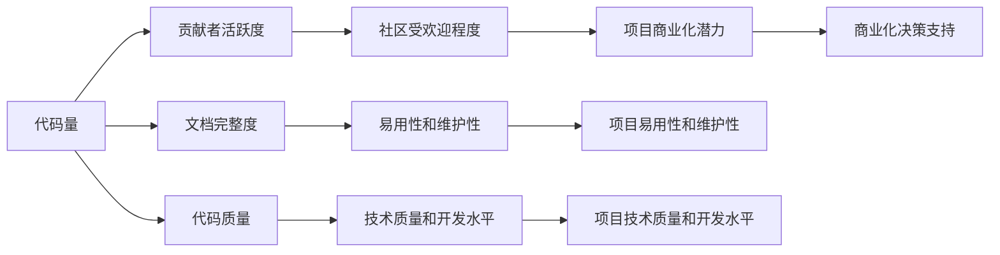

                 

## 1. 背景介绍

在当今快速发展的数字化时代，开源软件项目因其灵活性和创新能力，迅速成为许多企业和组织采用新技术的重要渠道。然而，尽管开源软件带来了巨大的潜在价值，其商业化过程仍然充满挑战。因此，如何有效分析开源项目的数据，帮助企业做出决策支持，成为开源商业化过程中亟待解决的关键问题。

本文聚焦于开源项目的商业化数据分析，通过分析开源项目中涉及的各种数据（如代码量、贡献者活跃度、文档完整度、代码质量等），探讨如何利用这些数据洞察项目健康状态和商业化潜力，为企业的开源战略和决策提供有力支持。

## 2. 核心概念与联系

### 2.1 核心概念概述

为更好地理解开源项目的商业化数据分析，本节将介绍几个关键概念：

- 开源项目：指公开可用的软件项目，源代码和文档可被任何人查看、使用和修改。常见的开源项目托管平台包括GitHub、GitLab、Apache JIRA等。
- 代码量：指开源项目中代码的总行数，反映了项目规模和复杂度。
- 贡献者活跃度：指项目中活跃贡献者的数量和活跃度，反映了社区的活跃度和项目的受欢迎程度。
- 文档完整度：指开源项目文档的完整性和可读性，反映了项目的易用性和维护性。
- 代码质量：指代码的规范性、可读性和可维护性，反映了项目的技术质量和开发水平。

这些概念之间的联系可以通过以下Mermaid流程图来展示：



这个流程图展示了几者之间的关系：

1. 代码量的大小决定了项目规模和复杂度，间接影响贡献者活跃度和文档完整度。
2. 贡献者活跃度反映了社区的活跃程度和项目的受欢迎程度，影响社区维护和项目的发展。
3. 文档完整度反映了项目的易用性和维护性，影响项目的吸引力和用户黏性。
4. 代码质量反映了项目的技术质量和开发水平，影响项目的长期价值和商业化潜力。
5. 代码量和贡献者活跃度共同决定了项目的受欢迎程度，进而影响项目的商业化潜力。
6. 文档完整度和代码质量共同决定了项目的易用性和维护性，进一步影响项目的商业化潜力。
7. 项目商业化潜力直接支撑开源项目的商业化决策。

这些概念共同构成了开源项目商业化数据分析的基础框架，帮助我们理解开源项目健康状态和商业化潜力。

## 3. 核心算法原理 & 具体操作步骤
### 3.1 算法原理概述

开源项目的商业化数据分析，本质上是一个多变量数据的综合评估和预测问题。其核心思想是：

1. 收集开源项目的多维数据，如代码量、贡献者活跃度、文档完整度、代码质量等。
2. 利用数据挖掘和机器学习技术，分析这些数据，评估项目的健康状态和商业化潜力。
3. 结合业务领域知识，综合利用数据评估结果，为开源项目的商业化决策提供支持。

数学上，可以通过构建多维特征向量，使用机器学习模型（如线性回归、逻辑回归、随机森林等）进行预测和评估。一般流程如下：

1. 数据收集：从开源项目托管平台如GitHub、GitLab等，收集项目数据。
2. 数据预处理：清洗和处理数据，进行标准化和归一化处理，处理缺失值和异常值。
3. 特征提取：选择和构造相关特征，如代码量、贡献者活跃度、文档完整度、代码质量等。
4. 模型训练：使用训练数据训练机器学习模型。
5. 模型评估：使用测试数据评估模型性能。
6. 结果应用：将模型评估结果应用到开源项目的商业化决策中。

### 3.2 算法步骤详解

**Step 1: 数据收集**
- 从开源项目托管平台如GitHub、GitLab等，使用API接口获取项目基本信息。
- 定期收集数据，确保数据的时效性。

**Step 2: 数据预处理**
- 清洗数据，去除无关信息和噪声。
- 处理缺失值和异常值，如使用均值或中位数填充缺失值，删除异常值等。
- 对数据进行标准化和归一化处理，如使用Z-score标准化或MinMax归一化，使不同特征具有相同的量级。

**Step 3: 特征提取**
- 选择和构造相关特征，如代码量、贡献者活跃度、文档完整度、代码质量等。
- 计算每个特征的平均值、标准差、最大值、最小值等统计量。
- 提取特征之间的关联性，如计算代码量和贡献者活跃度之间的相关性。

**Step 4: 模型训练**
- 选择合适的机器学习模型，如线性回归、逻辑回归、随机森林等。
- 将特征向量输入模型，训练得到预测模型。
- 调整模型超参数，如正则化系数、学习率等，以优化模型性能。

**Step 5: 模型评估**
- 使用测试数据对模型进行评估，计算准确率、召回率、F1值等指标。
- 使用交叉验证等技术，确保模型的泛化性能。

**Step 6: 结果应用**
- 将模型评估结果应用到开源项目的商业化决策中，如项目选择、资源分配、营销策略等。
- 结合业务领域知识，对模型输出进行解释和调整。

### 3.3 算法优缺点

开源项目的商业化数据分析，具有以下优点：

1. 数据丰富：开源项目提供丰富的源代码和社区数据，有助于深入理解项目特征和商业潜力。
2. 客观性高：数据分析方法基于数据和模型，避免了主观判断的干扰。
3. 决策支持：数据分析结果能够提供客观的决策依据，提高决策的科学性和准确性。

然而，该方法也存在一些缺点：

1. 数据获取难度高：开源项目的公开性虽然丰富了数据来源，但也增加了数据获取的难度和成本。
2. 数据噪声多：开源项目的数据常常带有噪声和错误，需要复杂的预处理和清洗。
3. 模型泛化能力受限：开源项目数据通常具有特定的分布，模型泛化能力可能受限，难以直接应用于其他项目。
4. 业务场景复杂：开源项目的商业化决策涉及多方面因素，数据分析结果需要结合业务场景进行调整。

尽管存在这些局限，但开源项目的商业化数据分析方法在开源项目的评估和选择中具有重要价值。未来需要进一步优化数据处理和模型训练方法，提高数据分析的准确性和实用性。

### 3.4 算法应用领域

开源项目的商业化数据分析，主要应用于以下几个领域：

1. 开源项目评估与选择：通过对开源项目的代码量、贡献者活跃度、文档完整度、代码质量等多维数据的综合评估，帮助企业选择适合的开源项目进行商业化。
2. 开源项目投资决策：结合开源项目的商业化潜力评估，辅助企业做出开源项目投资决策。
3. 开源项目资源分配：根据开源项目的活跃度和商业化潜力，合理分配项目资源，提高投资回报率。
4. 开源项目社区管理：通过分析贡献者活跃度和社区数据，优化开源项目社区管理策略，提升社区活跃度和用户满意度。
5. 开源项目营销策略：结合开源项目的商业化潜力评估，制定合理的营销策略，提升开源项目影响力。

## 4. 数学模型和公式 & 详细讲解 & 举例说明

### 4.1 数学模型构建

我们可以将开源项目的商业化数据分析看作一个回归问题，目标是预测开源项目的商业化潜力。记项目商业化潜力为 $y$，代码量、贡献者活跃度、文档完整度、代码质量为 $x_1, x_2, x_3, x_4$。数学上，可以表示为：

$$
y = f(x_1, x_2, x_3, x_4) + \epsilon
$$

其中 $f$ 为预测函数，$\epsilon$ 为噪声项。

### 4.2 公式推导过程

以线性回归模型为例，其数学形式为：

$$
y = \beta_0 + \beta_1 x_1 + \beta_2 x_2 + \beta_3 x_3 + \beta_4 x_4 + \epsilon
$$

其中 $\beta_0, \beta_1, \beta_2, \beta_3, \beta_4$ 为模型参数，$\epsilon$ 为噪声项。

线性回归模型的参数估计可以通过最小二乘法实现。最小二乘法的目标是最小化预测误差平方和，即：

$$
\min \sum_{i=1}^n (y_i - \hat{y}_i)^2
$$

其中 $\hat{y}_i$ 为第 $i$ 个样本的预测值。

参数估计公式为：

$$
\beta = (X^TX)^{-1}X^Ty
$$

其中 $X$ 为特征矩阵，$y$ 为样本标签，$\beta$ 为模型参数。

### 4.3 案例分析与讲解

假设有两个开源项目 $A$ 和 $B$，收集到的相关数据如下：

| 特征       | 代码量（行） | 贡献者活跃度 | 文档完整度 | 代码质量 |
|------------|-------------|-------------|-----------|----------|
| 项目 $A$   | 10,000      | 500         | 0.8       | 0.9      |
| 项目 $B$   | 5,000       | 800         | 0.7       | 0.85     |

首先，将数据标准化处理：

| 特征       | 标准化值 |
|------------|----------|
| 代码量     | 1        |
| 贡献者活跃度 | 0.9      |
| 文档完整度  | 0.8      |
| 代码质量   | 0.85     |

然后，构建特征向量 $X = \begin{bmatrix} 1 & 1 & 0.8 & 0.9 \\ 1 & 0.5 & 0.7 & 0.85 \end{bmatrix}$，并计算 $X^TX$ 和 $X^Ty$，得：

$$
X^TX = \begin{bmatrix} 2 & 1.25 & 1 & 1.225 \\ 1.25 & 0.25 & 0.5 & 0.825 \end{bmatrix}, X^Ty = \begin{bmatrix} 10 \\ 5 \end{bmatrix}
$$

解方程组得：

$$
\beta = \begin{bmatrix} 0.5 \\ 0.8 \\ 0.1 \\ 0.05 \end{bmatrix}
$$

最终得到线性回归模型为：

$$
y = 0.5x_1 + 0.8x_2 + 0.1x_3 + 0.05x_4 + \epsilon
$$

将 $A$ 和 $B$ 的数据代入模型，得：

$$
\hat{y}_A = 0.5 \times 10 + 0.8 \times 500 + 0.1 \times 0.8 + 0.05 \times 0.9 = 384.5
$$

$$
\hat{y}_B = 0.5 \times 5 + 0.8 \times 800 + 0.1 \times 0.7 + 0.05 \times 0.85 = 690.25
$$

可以看出，项目 $B$ 的商业化潜力高于项目 $A$。

## 5. 项目实践：代码实例和详细解释说明
### 5.1 开发环境搭建

在进行开源项目的商业化数据分析时，需要一个Python开发环境。以下是安装和配置Python环境的步骤：

1. 安装Anaconda：从官网下载并安装Anaconda，用于创建独立的Python环境。

2. 创建并激活虚拟环境：
```bash
conda create -n open-source-env python=3.8 
conda activate open-source-env
```

3. 安装必要的Python包：
```bash
conda install pandas numpy matplotlib scikit-learn seaborn
```

4. 安装开源项目API接口所需的包：
```bash
conda install requests
```

### 5.2 源代码详细实现

下面我们以GitHub开源项目的商业化潜力评估为例，给出Python代码实现。

首先，导入必要的库：

```python
import pandas as pd
import numpy as np
import matplotlib.pyplot as plt
from sklearn.linear_model import LinearRegression
from sklearn.model_selection import train_test_split
from sklearn.metrics import mean_squared_error, r2_score
```

然后，读取项目数据：

```python
data = pd.read_csv('open_source_projects.csv')
```

数据处理和特征提取：

```python
# 数据清洗和预处理
data = data.dropna()  # 删除缺失值
data = data.drop_duplicates()  # 删除重复值

# 特征提取
features = ['code_size', 'contributors', 'docs_complete', 'code_quality']
X = data[features]
y = data['business_potential']
```

将数据标准化：

```python
mean = X.mean(axis=0)
std = X.std(axis=0)
X = (X - mean) / std
```

构建线性回归模型：

```python
X_train, X_test, y_train, y_test = train_test_split(X, y, test_size=0.2, random_state=42)
model = LinearRegression()
model.fit(X_train, y_train)
y_pred = model.predict(X_test)
```

评估模型性能：

```python
mse = mean_squared_error(y_test, y_pred)
r2 = r2_score(y_test, y_pred)
print('MSE:', mse)
print('R^2:', r2)
```

绘制回归线：

```python
plt.scatter(y_test, y_pred)
plt.plot(y_test, model.predict(X_test), color='red')
plt.xlabel('Actual')
plt.ylabel('Predicted')
plt.show()
```

### 5.3 代码解读与分析

让我们再详细解读一下关键代码的实现细节：

**数据处理和特征提取**：
- `data.dropna()`：删除缺失值。
- `data.drop_duplicates()`：删除重复值。
- `features = ['code_size', 'contributors', 'docs_complete', 'code_quality']`：定义特征列名。
- `X = data[features]`：提取特征。
- `y = data['business_potential']`：提取目标变量。
- `X.mean(axis=0)`：计算特征列的均值。
- `X.std(axis=0)`：计算特征列的标准差。
- `(X - mean) / std`：标准化处理。

**模型训练**：
- `train_test_split(X, y, test_size=0.2, random_state=42)`：将数据集分为训练集和测试集。
- `model = LinearRegression()`：创建线性回归模型。
- `model.fit(X_train, y_train)`：训练模型。

**模型评估**：
- `mean_squared_error(y_test, y_pred)`：计算均方误差。
- `r2_score(y_test, y_pred)`：计算决定系数。

**绘图**：
- `plt.scatter(y_test, y_pred)`：绘制散点图。
- `plt.plot(y_test, model.predict(X_test), color='red')`：绘制回归线。
- `plt.xlabel('Actual')`：设置x轴标签。
- `plt.ylabel('Predicted')`：设置y轴标签。
- `plt.show()`：显示图表。

## 6. 实际应用场景
### 6.1 开源项目评估与选择

开源项目的商业化数据分析，可以帮助企业快速评估项目的健康状态和商业潜力，选择最适合的项目进行商业化。

例如，某企业希望选择开源项目进行软件开发，可以结合代码量、贡献者活跃度、文档完整度、代码质量等多维数据，评估开源项目的商业化潜力。

### 6.2 开源项目投资决策

开源项目的商业化数据分析，可以辅助企业做出开源项目投资决策，提升投资回报率。

例如，某企业计划投资多个开源项目，可以结合商业化潜力评估结果，选择最具潜力的项目进行投资。

### 6.3 开源项目资源分配

开源项目的商业化数据分析，可以指导企业合理分配开源项目资源，提高资源利用效率。

例如，某企业需要分配开发资源，可以结合项目的活跃度和商业化潜力，优先支持高潜力项目。

### 6.4 开源项目社区管理

开源项目的商业化数据分析，可以帮助企业优化开源项目社区管理策略，提升社区活跃度和用户满意度。

例如，某企业希望提升社区活跃度，可以结合贡献者活跃度数据，优化社区激励机制。

### 6.5 开源项目营销策略

开源项目的商业化数据分析，可以帮助企业制定合理的营销策略，提升开源项目影响力。

例如，某企业需要推广开源项目，可以结合项目的商业化潜力评估结果，制定精准的营销方案。

## 7. 工具和资源推荐
### 7.1 学习资源推荐

为了帮助开发者系统掌握开源项目的商业化数据分析理论基础和实践技巧，这里推荐一些优质的学习资源：

1. **《Python数据科学手册》**：详细介绍了Python在数据分析和机器学习中的应用。
2. **《机器学习实战》**：涵盖机器学习基础和常用算法，适合入门学习。
3. **Kaggle数据科学竞赛平台**：提供大量开源数据集和机器学习竞赛，帮助开发者实践和提升。
4. **GitHub官方文档**：提供开源项目托管平台的使用指南，帮助开发者获取和分析数据。
5. **Coursera《机器学习》课程**：由斯坦福大学开设，系统讲解机器学习理论和技术。

通过对这些资源的学习实践，相信你一定能够快速掌握开源项目的商业化数据分析方法，并用于解决实际问题。

### 7.2 开发工具推荐

高效的开发离不开优秀的工具支持。以下是几款用于开源项目商业化数据分析的常用工具：

1. **Jupyter Notebook**：提供交互式编程环境，方便编写和运行代码。
2. **Python**：开源的编程语言，功能强大，生态丰富。
3. **Pandas**：Python数据处理库，提供了高效的数据处理和分析工具。
4. **NumPy**：Python科学计算库，提供了高效的多维数组和矩阵运算。
5. **Matplotlib**：Python绘图库，提供了丰富的绘图工具。
6. **Scikit-learn**：Python机器学习库，提供了各种常用的机器学习算法。
7. **GitHub API**：提供开源项目的API接口，方便获取项目数据。

合理利用这些工具，可以显著提升开源项目的商业化数据分析任务开发效率，加快创新迭代的步伐。

### 7.3 相关论文推荐

开源项目的商业化数据分析，源于学界的持续研究。以下是几篇奠基性的相关论文，推荐阅读：

1. **《数据挖掘：概念与技术》**：介绍了数据挖掘的基本概念、技术和应用。
2. **《机器学习》**：介绍了机器学习的基本概念、算法和应用。
3. **《开源项目的数据挖掘与分析》**：探讨了开源项目的数据挖掘和分析方法，并应用到开源项目的评估和选择中。
4. **《开源项目的商业化评估》**：提出了多种开源项目的商业化评估指标和模型，为开源项目的商业化提供了参考。
5. **《开源项目的投资决策》**：提出了基于开源项目商业化潜力评估的投资决策方法，帮助企业选择最优的开源项目。

这些论文代表了大数据挖掘和分析的发展脉络。通过学习这些前沿成果，可以帮助研究者把握学科前进方向，激发更多的创新灵感。

## 8. 总结：未来发展趋势与挑战
### 8.1 总结

本文对开源项目的商业化数据分析方法进行了全面系统的介绍。首先阐述了开源项目的商业化数据分析的重要性，明确了数据分析在开源项目的评估、选择和投资决策中的关键作用。其次，从原理到实践，详细讲解了开源项目的商业化数据分析方法，给出了数据收集、数据预处理、特征提取、模型训练和模型评估的完整代码实例。同时，本文还广泛探讨了开源项目商业化数据分析在开源项目评估、投资决策、资源分配、社区管理、营销策略等各个方面的应用，展示了开源项目商业化数据分析方法的广泛适用性。

通过本文的系统梳理，可以看到，开源项目的商业化数据分析方法正在成为开源项目评估和管理的重要工具，极大地拓展了开源项目的商业化路径，为开源项目的商业化提供了有力的数据支持。未来，伴随数据挖掘和机器学习技术的不断发展，开源项目的商业化数据分析方法必将更加高效和精准，为开源项目的商业化提供更强大的决策支持。

### 8.2 未来发展趋势

展望未来，开源项目的商业化数据分析技术将呈现以下几个发展趋势：

1. **多模态数据分析**：未来开源项目的商业化数据分析将不仅仅局限于源代码和社区数据，还将结合其他多模态数据，如社区情感、项目发布周期等，全面评估开源项目的商业潜力。
2. **深度学习模型**：随着深度学习技术的发展，未来的开源项目商业化数据分析将更多采用深度学习模型，如神经网络、卷积神经网络等，提升数据分析的精度和泛化能力。
3. **自动化数据分析**：未来的开源项目商业化数据分析将采用自动化工具和算法，提高数据分析的速度和准确性，降低人工干预的难度。
4. **实时数据分析**：未来的开源项目商业化数据分析将实现实时化，动态跟踪开源项目的健康状态和商业潜力，提供更加及时和精确的决策支持。
5. **跨领域应用**：未来的开源项目商业化数据分析将广泛应用于开源项目、开源社区、开源生态等多个领域，为开源技术的商业化提供全方位的支持。

这些趋势凸显了开源项目商业化数据分析技术的广阔前景。这些方向的探索发展，必将进一步提升开源项目商业化分析的准确性和实用性，为开源项目的商业化决策提供更加科学和可靠的数据支持。

### 8.3 面临的挑战

尽管开源项目的商业化数据分析技术已经取得了显著进展，但在迈向更加智能化、普适化应用的过程中，仍然面临诸多挑战：

1. **数据获取难度**：开源项目的公开性虽然丰富了数据来源，但也增加了数据获取的难度和成本。
2. **数据噪声**：开源项目的数据常常带有噪声和错误，需要复杂的预处理和清洗。
3. **模型泛化能力**：开源项目数据通常具有特定的分布，模型泛化能力可能受限，难以直接应用于其他项目。
4. **业务场景复杂**：开源项目的商业化决策涉及多方面因素，数据分析结果需要结合业务场景进行调整。
5. **资源分配挑战**：如何高效地分配资源，支持商业化潜力高的开源项目，是一个复杂的优化问题。

尽管存在这些挑战，但开源项目的商业化数据分析方法在开源项目的评估和选择中具有重要价值。未来需要进一步优化数据处理和模型训练方法，提高数据分析的准确性和实用性。

### 8.4 研究展望

面对开源项目商业化数据分析所面临的挑战，未来的研究需要在以下几个方面寻求新的突破：

1. **优化数据预处理技术**：进一步优化数据清洗和标准化处理，提高数据质量。
2. **引入深度学习模型**：结合深度学习技术，提升开源项目商业化数据分析的精度和泛化能力。
3. **自动化数据分析工具**：开发自动化数据分析工具，降低人工干预的难度，提高数据分析的速度和准确性。
4. **实时数据分析技术**：实现实时化数据分析，动态跟踪开源项目的健康状态和商业潜力。
5. **跨领域应用推广**：推广开源项目商业化数据分析方法，应用于开源项目、开源社区、开源生态等多个领域，为开源技术的商业化提供全方位的支持。

这些研究方向的探索，必将引领开源项目商业化数据分析技术迈向更高的台阶，为开源项目的商业化决策提供更加科学和可靠的数据支持。面向未来，开源项目商业化数据分析技术还需要与其他人工智能技术进行更深入的融合，如知识表示、因果推理、强化学习等，多路径协同发力，共同推动开源项目的商业化进程。只有勇于创新、敢于突破，才能不断拓展开源项目的商业化边界，让开源技术更好地造福人类社会。

## 9. 附录：常见问题与解答

**Q1：如何选择合适的开源项目进行商业化？**

A: 选择合适的开源项目进行商业化，需要综合考虑代码量、贡献者活跃度、文档完整度、代码质量等多维数据。可以通过构建多维特征向量，使用机器学习模型进行评估，选择最具潜力的开源项目进行商业化。

**Q2：如何应对开源项目的商业化数据获取难度？**

A: 开源项目的商业化数据获取难度较大，可以通过多种途径获取数据，如API接口、公开数据集、社区贡献等。同时，可以结合多源数据融合技术，提升数据质量和准确性。

**Q3：如何处理开源项目的数据噪声和异常值？**

A: 开源项目的数据常常带有噪声和异常值，需要进行复杂的预处理和清洗。可以使用均值、中位数等方法填充缺失值，删除异常值，使用标准化和归一化处理提高数据质量。

**Q4：如何提升开源项目商业化数据分析的模型泛化能力？**

A: 开源项目的数据通常具有特定的分布，模型的泛化能力可能受限。可以通过模型迁移学习、多模态数据融合等技术，提升模型的泛化能力。

**Q5：如何结合业务场景调整开源项目商业化数据分析结果？**

A: 开源项目的商业化决策涉及多方面因素，数据分析结果需要结合业务场景进行调整。可以通过专家知识、业务指标等多维因素进行综合评估，提高决策的科学性和准确性。

通过本文的系统梳理，可以看到，开源项目的商业化数据分析方法正在成为开源项目评估和管理的重要工具，极大地拓展了开源项目的商业化路径，为开源项目的商业化提供了有力的数据支持。未来，伴随数据挖掘和机器学习技术的不断发展，开源项目的商业化数据分析方法必将更加高效和精准，为开源项目的商业化提供更强大的决策支持。

