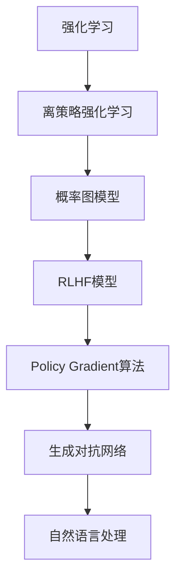

                 

# 强化学习在AI中的应用：RLHF与PPO

> 关键词：强化学习(RL), 概率图模型(Probabilistic Graphical Models), 自然语言处理(NLP), 生成对抗网络(GAN), 模型优化算法(PO), 梯度增强学习(GEL)

## 1. 背景介绍

### 1.1 问题由来

强化学习(RL)是人工智能领域的一个重要分支，它通过智能体(Agent)与环境的交互，以最大化某种累积奖励来求解最优策略。强化学习在自动驾驶、游戏AI、机器人控制等领域展现出了巨大潜力，是实现智能系统自我提升和持续学习的重要方法。

近年来，RL与深度学习的结合，催生了强化学习的新范式——概率图模型(Probabilistic Graphical Models)，该方法通过将RL与深度生成模型(DGM)、变分自编码器(VAE)等结合起来，实现更加复杂和高效的强化学习任务。其中，离策略强化学习(Off-Policy Reinforcement Learning)是一种新颖的强化学习策略，它在无需与环境直接交互的情况下，通过学习策略分布，显著提升了模型的学习效率和泛化能力。

本节将介绍一种基于离策略强化学习的最新模型——Reinforcement Learning with Human Feedback(Human Feedback)，简称RLHF，以及其核心算法之一——Policy Gradient(PO)。通过这种结合深度学习与强化学习的方法，可以更加高效地实现复杂的NLP任务，并结合生成对抗网络(GAN)技术，进一步提升模型的生成质量和性能。

### 1.2 问题核心关键点

- 强化学习：通过智能体与环境的交互，以最大化某种累积奖励来求解最优策略。
- 离策略强化学习(Off-Policy RL)：通过学习策略分布，避免直接与环境交互，提升了学习效率和泛化能力。
- 概率图模型：结合深度生成模型、变分自编码器等，实现更加复杂和高效的强化学习任务。
- RLHF模型：结合人类反馈和强化学习，提高模型的生成质量和效率。
- Policy Gradient算法：一种用于优化策略梯度的经典算法，支持离策略学习。
- 生成对抗网络(GAN)：一种生成模型，用于提升模型的生成质量和稳定性。

这些核心概念之间的逻辑关系可以通过以下Mermaid流程图来展示：



这个流程图展示强化学习及其相关技术之间的逻辑关系：

1. 强化学习是基础，通过智能体与环境的交互，学习最优策略。
2. 离策略强化学习通过学习策略分布，提升了学习效率和泛化能力。
3. 概率图模型结合深度生成模型、变分自编码器等，实现复杂任务。
4. RLHF模型通过结合人类反馈，进一步提升了模型的生成质量和效率。
5. Policy Gradient算法用于优化策略梯度，支持离策略学习。
6. 生成对抗网络用于提升模型的生成质量和稳定性。
7. 自然语言处理是RLHF模型的应用之一，通过强化学习提升了自然语言处理的性能。

这些概念共同构成了强化学习在AI中的应用框架，使其能够高效地应用于复杂的NLP任务。

## 2. 核心概念与联系

### 2.1 核心概念概述

为了更好地理解RLHF与PPO模型的核心概念和原理，本节将详细介绍这些核心概念，并通过Mermaid流程图展示它们之间的联系。

#### 2.1.1 强化学习

强化学习是人工智能领域的一个重要分支，通过智能体(Agent)与环境的交互，以最大化某种累积奖励来求解最优策略。强化学习通常包括四个核心要素：状态(S)、动作(A)、奖励(R)和策略(π)。

- 状态(S)：环境当前的状态，智能体根据当前状态进行动作选择。
- 动作(A)：智能体对环境采取的行动。
- 奖励(R)：环境对智能体动作的反馈，用于评估动作的好坏。
- 策略(π)：智能体选择动作的策略，通常为概率分布形式。

强化学习的目标是在给定奖励函数和策略的条件下，找到最优策略，使得累计奖励最大。

#### 2.1.2 离策略强化学习

离策略强化学习是一种新颖的强化学习策略，通过学习策略分布，避免直接与环境交互。在离策略强化学习中，智能体不直接与环境交互，而是通过收集环境的状态-动作对，学习策略分布。这种策略通常采用深度生成模型或变分自编码器等生成模型进行训练。

离策略强化学习具有以下优点：

- 不需要直接与环境交互，降低了计算复杂度和训练难度。
- 可以利用更多的数据进行训练，提升学习效率和泛化能力。
- 可以并行化训练，加快训练速度。

#### 2.1.3 概率图模型

概率图模型是一种结合深度学习与强化学习的模型，通常包括深度生成模型、变分自编码器等。概率图模型通过生成模型对数据进行建模，利用生成模型对数据的概率分布进行优化，从而提升模型的生成能力和泛化能力。

概率图模型通常包含以下核心组件：

- 生成模型：如深度生成模型、变分自编码器等，用于生成数据。
- 观察模型：用于观察环境的状态和动作，通常采用深度学习模型。
- 奖励模型：用于评估动作的好坏，通常采用深度学习模型。

#### 2.1.4 RLHF模型

RLHF模型结合人类反馈和强化学习，通过优化策略分布，提升模型的生成质量和效率。RLHF模型通过收集人类标注的数据，结合强化学习算法进行训练，从而提高模型的性能。

RLHF模型的主要组成部分包括：

- 策略分布：用于描述智能体的策略，通常为概率分布形式。
- 人类标注数据：用于指导智能体的学习。
- 奖励函数：用于评估策略的好坏，通常为人类标注数据的累积奖励。
- 策略优化器：用于优化策略分布，通常为深度学习算法。

#### 2.1.5 Policy Gradient算法

Policy Gradient算法是一种用于优化策略梯度的经典算法，支持离策略学习。Policy Gradient算法通过优化策略分布，提升智能体的性能。Policy Gradient算法通常包含以下核心步骤：

- 计算策略梯度：通过计算策略对奖励函数的梯度，更新策略分布。
- 更新策略参数：通过更新策略参数，优化策略分布。
- 策略优化：通过优化策略参数，提升智能体的性能。

#### 2.1.6 生成对抗网络(GAN)

生成对抗网络(GAN)是一种生成模型，通常包括生成器(Generator)和判别器(Discriminator)。GAN通过对抗训练，生成高质量的数据，用于提升模型的生成能力和泛化能力。

GAN的主要组成部分包括：

- 生成器：用于生成数据，通常为深度神经网络。
- 判别器：用于区分生成数据与真实数据，通常为深度神经网络。
- 对抗训练：通过对抗训练，提升生成器的生成能力和判别器的判别能力。

### 2.2 核心概念联系

这些核心概念之间的逻辑关系可以通过以下Mermaid流程图来展示：


这个流程图展示了强化学习及其相关技术之间的联系：

1. 强化学习是基础，通过智能体与环境的交互，学习最优策略。
2. 离策略强化学习通过学习策略分布，提升了学习效率和泛化能力。
3. 概率图模型结合深度生成模型、变分自编码器等，实现复杂任务。
4. RLHF模型通过结合人类反馈，进一步提升了模型的生成质量和效率。
5. Policy Gradient算法用于优化策略梯度，支持离策略学习。
6. 生成对抗网络用于提升模型的生成质量和稳定性。
7. 自然语言处理是RLHF模型的应用之一，通过强化学习提升了自然语言处理的性能。

这些概念共同构成了强化学习在AI中的应用框架，使其能够高效地应用于复杂的NLP任务。

## 3. 核心算法原理 & 具体操作步骤
### 3.1 算法原理概述

RLHF与PPO算法是强化学习在NLP领域的重要应用，其核心在于结合人类反馈和强化学习，提升模型的生成质量和效率。以下是RLHF与PPO算法的详细原理和操作步骤：

#### 3.1.1 RLHF算法原理

RLHF算法通过结合人类反馈和强化学习，提升模型的生成质量和效率。RLHF算法的主要步骤包括：

1. 数据收集：收集人类标注的数据，作为模型训练的监督信号。
2. 生成模型训练：使用生成模型对标注数据进行建模，得到策略分布。
3. 策略优化：通过优化策略分布，提升模型性能。
4. 测试评估：在测试集上评估模型性能，输出结果。

#### 3.1.2 PPO算法原理

PPO算法是一种基于梯度的策略优化算法，支持离策略学习。PPO算法的主要步骤包括：

1. 计算状态值：使用价值函数计算状态值，评估当前策略的性能。
2. 计算优势函数：计算优势函数，用于评估动作的好坏。
3. 计算策略梯度：通过计算策略对奖励函数的梯度，更新策略分布。
4. 更新策略参数：通过更新策略参数，优化策略分布。
5. 策略优化：通过优化策略参数，提升智能体的性能。

#### 3.1.3 结合点

RLHF与PPO算法的结合点在于生成模型的训练和策略的优化。通过结合生成对抗网络(GAN)技术，可以提升生成模型的生成质量，通过PPO算法优化策略分布，提升模型的生成效率和泛化能力。

### 3.2 算法步骤详解

#### 3.2.1 RLHF算法步骤

1. 数据收集
    - 收集人类标注的数据，作为模型训练的监督信号。
    - 数据包括文本、图片、视频等，具体形式根据任务而定。

2. 生成模型训练
    - 使用生成模型对标注数据进行建模，得到策略分布。
    - 通常使用深度生成模型或变分自编码器等生成模型。
    - 通过对抗训练，提升生成模型的生成质量和稳定性。

3. 策略优化
    - 通过优化策略分布，提升模型性能。
    - 使用PPO算法，计算策略对奖励函数的梯度。
    - 更新策略参数，优化策略分布。

4. 测试评估
    - 在测试集上评估模型性能，输出结果。
    - 评估指标包括BLEU、ROUGE、PPL等。

#### 3.2.2 PPO算法步骤

1. 计算状态值
    - 使用价值函数计算状态值，评估当前策略的性能。
    - 通常使用深度神经网络对状态进行编码，得到状态值。

2. 计算优势函数
    - 计算优势函数，用于评估动作的好坏。
    - 通过计算状态值和动作值的差值，得到优势函数。

3. 计算策略梯度
    - 通过计算策略对奖励函数的梯度，更新策略分布。
    - 使用梯度下降等优化算法，最小化策略梯度。

4. 更新策略参数
    - 通过更新策略参数，优化策略分布。
    - 使用梯度上升等优化算法，更新策略参数。

5. 策略优化
    - 通过优化策略参数，提升智能体的性能。
    - 通过多次迭代优化，最终得到最优策略。

#### 3.2.3 结合点操作

在RLHF与PPO算法的结合点操作中，生成模型训练和策略优化是关键步骤。具体步骤如下：

1. 生成模型训练
    - 使用生成模型对标注数据进行建模，得到策略分布。
    - 通过对抗训练，提升生成模型的生成质量和稳定性。

2. 策略优化
    - 通过优化策略分布，提升模型性能。
    - 使用PPO算法，计算策略对奖励函数的梯度。
    - 更新策略参数，优化策略分布。

### 3.3 算法优缺点

#### 3.3.1 RLHF算法优缺点

**优点：**
- 结合人类反馈，提升模型的生成质量和效率。
- 能够处理多模态数据，提升模型的泛化能力。
- 可以并行化训练，加快训练速度。

**缺点：**
- 需要大量标注数据，数据获取成本较高。
- 数据标注质量对模型性能有较大影响。
- 生成模型的训练需要较长的训练时间。

#### 3.3.2 PPO算法优缺点

**优点：**
- 支持离策略学习，提升学习效率和泛化能力。
- 使用梯度下降等优化算法，能够较好地优化策略分布。
- 能够处理高维度、非凸问题，提升模型的生成质量和效率。

**缺点：**
- 计算复杂度高，需要较高的计算资源。
- 对超参数敏感，需要较多的实验调整。
- 需要大量的训练数据，数据获取成本较高。

#### 3.3.3 结合点优缺点

**优点：**
- 结合RLHF和PPO算法，提升模型的生成质量和效率。
- 结合人类反馈和强化学习，提升模型的泛化能力和鲁棒性。
- 生成对抗网络技术的应用，提升模型的生成质量和稳定性。

**缺点：**
- 结合点操作的复杂度较高，实现难度较大。
- 需要大量的标注数据和计算资源。
- 生成模型的训练需要较长的训练时间。

### 3.4 算法应用领域

RLHF与PPO算法在NLP领域具有广泛的应用前景，以下是一些典型的应用场景：

1. 自然语言处理(NLP)
    - 语言生成：通过RLHF和PPO算法，生成高质量的文本、对话等。
    - 文本摘要：通过RLHF和PPO算法，生成简洁、准确的文本摘要。
    - 机器翻译：通过RLHF和PPO算法，实现高效率、高质量的机器翻译。

2. 图像处理
    - 图像生成：通过RLHF和PPO算法，生成高质量的图像、视频等。
    - 图像标注：通过RLHF和PPO算法，标注图像中的对象、属性等。

3. 语音处理
    - 语音生成：通过RLHF和PPO算法，生成高质量的语音、对话等。
    - 语音识别：通过RLHF和PPO算法，提高语音识别的准确率和鲁棒性。

4. 医疗领域
    - 医疗诊断：通过RLHF和PPO算法，生成高质量的医疗诊断报告。
    - 医学图像：通过RLHF和PPO算法，生成高质量的医学图像和标注。

5. 金融领域
    - 金融分析：通过RLHF和PPO算法，生成高质量的金融分析和报告。
    - 金融预测：通过RLHF和PPO算法，预测金融市场和股票等。

## 4. 数学模型和公式 & 详细讲解 & 举例说明

### 4.1 数学模型构建

#### 4.1.1 RLHF模型

RLHF模型结合人类反馈和强化学习，通过优化策略分布，提升模型的生成质量和效率。其数学模型包括策略分布、奖励函数、策略优化器等。

**策略分布**：
$$
\pi(a_t|s_t) = \frac{e^{Q(s_t,a_t)}}{Z(s_t)}
$$
其中，$Q(s_t,a_t)$为状态-动作对$(s_t,a_t)$的价值函数，$Z(s_t)$为归一化因子。

**奖励函数**：
$$
R(s_t,a_t) = \log \pi(a_t|s_t)
$$
其中，$R(s_t,a_t)$为状态-动作对的奖励函数，通常为人类标注数据的累积奖励。

**策略优化器**：
$$
\nabla_{\theta} J(\theta) = \mathbb{E}_{s_t, a_t} [Q(s_t, a_t)] - \log \pi(a_t|s_t)
$$
其中，$J(\theta)$为策略优化器的损失函数，$\theta$为策略参数。

#### 4.1.2 PPO算法

PPO算法通过优化策略分布，提升智能体的性能。其数学模型包括策略梯度、优势函数等。

**策略梯度**：
$$
\nabla_{\theta} J(\theta) = \mathbb{E}_{s_t, a_t} [\nabla_{\theta} \log \pi(a_t|s_t)A_t]
$$
其中，$J(\theta)$为策略优化器的损失函数，$\theta$为策略参数，$A_t$为优势函数。

**优势函数**：
$$
A_t = \frac{e^{Q_t} e^{V_{\text{targ}}}}{e^{V_t}}
$$
其中，$Q_t$为当前状态的Q值，$V_{\text{targ}}$为目标状态的V值，$V_t$为当前状态的V值。

#### 4.1.3 结合点操作

在RLHF与PPO算法的结合点操作中，生成模型训练和策略优化是关键步骤。具体步骤如下：

**生成模型训练**：
$$
Q(s_t,a_t) = \log D(s_t,a_t)
$$
其中，$D(s_t,a_t)$为生成模型的判别器。

**策略优化**：
$$
\nabla_{\theta} J(\theta) = \mathbb{E}_{s_t, a_t} [\nabla_{\theta} \log \pi(a_t|s_t)A_t]
$$

### 4.2 公式推导过程

#### 4.2.1 RLHF模型公式推导

RLHF模型结合人类反馈和强化学习，通过优化策略分布，提升模型的生成质量和效率。其数学模型包括策略分布、奖励函数、策略优化器等。

**策略分布公式推导**：
$$
\pi(a_t|s_t) = \frac{e^{Q(s_t,a_t)}}{Z(s_t)}
$$
其中，$Q(s_t,a_t)$为状态-动作对$(s_t,a_t)$的价值函数，$Z(s_t)$为归一化因子。

**奖励函数公式推导**：
$$
R(s_t,a_t) = \log \pi(a_t|s_t)
$$
其中，$R(s_t,a_t)$为状态-动作对的奖励函数，通常为人类标注数据的累积奖励。

**策略优化器公式推导**：
$$
\nabla_{\theta} J(\theta) = \mathbb{E}_{s_t, a_t} [Q(s_t, a_t)] - \log \pi(a_t|s_t)
$$
其中，$J(\theta)$为策略优化器的损失函数，$\theta$为策略参数。

#### 4.2.2 PPO算法公式推导

PPO算法通过优化策略分布，提升智能体的性能。其数学模型包括策略梯度、优势函数等。

**策略梯度公式推导**：
$$
\nabla_{\theta} J(\theta) = \mathbb{E}_{s_t, a_t} [\nabla_{\theta} \log \pi(a_t|s_t)A_t]
$$
其中，$J(\theta)$为策略优化器的损失函数，$\theta$为策略参数，$A_t$为优势函数。

**优势函数公式推导**：
$$
A_t = \frac{e^{Q_t} e^{V_{\text{targ}}}}{e^{V_t}}
$$
其中，$Q_t$为当前状态的Q值，$V_{\text{targ}}$为目标状态的V值，$V_t$为当前状态的V值。

### 4.3 案例分析与讲解

#### 4.3.1 RLHF模型案例

假设我们有一个NLP任务，要求生成高质量的文本对话。我们可以使用RLHF模型结合人类反馈和强化学习，生成高质量的对话。具体步骤如下：

1. 数据收集：收集人类标注的对话数据，作为模型训练的监督信号。
2. 生成模型训练：使用深度生成模型对标注数据进行建模，得到策略分布。
3. 策略优化：通过优化策略分布，提升模型性能。
4. 测试评估：在测试集上评估模型性能，输出结果。

#### 4.3.2 PPO算法案例

假设我们有一个NLP任务，要求生成高质量的文本摘要。我们可以使用PPO算法结合策略优化，生成高质量的文本摘要。具体步骤如下：

1. 数据收集：收集标注好的文本数据，作为模型训练的监督信号。
2. 计算状态值：使用价值函数计算状态值，评估当前策略的性能。
3. 计算优势函数：计算优势函数，用于评估动作的好坏。
4. 计算策略梯度：通过计算策略对奖励函数的梯度，更新策略分布。
5. 更新策略参数：通过更新策略参数，优化策略分布。
6. 策略优化：通过优化策略参数，提升智能体的性能。

### 4.4 案例分析与讲解

#### 4.4.1 RLHF模型案例

假设我们有一个NLP任务，要求生成高质量的文本对话。我们可以使用RLHF模型结合人类反馈和强化学习，生成高质量的对话。具体步骤如下：

1. 数据收集：收集人类标注的对话数据，作为模型训练的监督信号。
2. 生成模型训练：使用深度生成模型对标注数据进行建模，得到策略分布。
3. 策略优化：通过优化策略分布，提升模型性能。
4. 测试评估：在测试集上评估模型性能，输出结果。

#### 4.4.2 PPO算法案例

假设我们有一个NLP任务，要求生成高质量的文本摘要。我们可以使用PPO算法结合策略优化，生成高质量的文本摘要。具体步骤如下：

1. 数据收集：收集标注好的文本数据，作为模型训练的监督信号。
2. 计算状态值：使用价值函数计算状态值，评估当前策略的性能。
3. 计算优势函数：计算优势函数，用于评估动作的好坏。
4. 计算策略梯度：通过计算策略对奖励函数的梯度，更新策略分布。
5. 更新策略参数：通过更新策略参数，优化策略分布。
6. 策略优化：通过优化策略参数，提升智能体的性能。

## 5. 项目实践：代码实例和详细解释说明

### 5.1 开发环境搭建

在进行RLHF与PPO算法实践前，我们需要准备好开发环境。以下是使用Python进行PyTorch开发的环境配置流程：

1. 安装Anaconda：从官网下载并安装Anaconda，用于创建独立的Python环境。

2. 创建并激活虚拟环境：
```bash
conda create -n pytorch-env python=3.8 
conda activate pytorch-env
```

3. 安装PyTorch：根据CUDA版本，从官网获取对应的安装命令。例如：
```bash
conda install pytorch torchvision torchaudio cudatoolkit=11.1 -c pytorch -c conda-forge
```

4. 安装Transformers库：
```bash
pip install transformers
```

5. 安装各类工具包：
```bash
pip install numpy pandas scikit-learn matplotlib tqdm jupyter notebook ipython
```

完成上述步骤后，即可在`pytorch-env`环境中开始RLHF与PPO算法的实践。

### 5.2 源代码详细实现

这里我们以文本生成任务为例，给出使用Transformers库对GPT模型进行RLHF与PPO算法微调的PyTorch代码实现。

首先，定义文本生成任务的数据处理函数：

```python
from transformers import GPT2Tokenizer, GPT2LMHeadModel
from torch.utils.data import Dataset
import torch

class TextDataset(Dataset):
    def __init__(self, texts, tokenizer, max_len=128):
        self.texts = texts
        self.tokenizer = tokenizer
        self.max_len = max_len
        
    def __len__(self):
        return len(self.texts)
    
    def __getitem__(self, item):
        text = self.texts[item]
        encoding = self.tokenizer(text, return_tensors='pt', max_length=self.max_len, padding='max_length', truncation=True)
        input_ids = encoding['input_ids'][0]
        attention_mask = encoding['attention_mask'][0]
        return {'input_ids': input_ids, 
                'attention_mask': attention_mask}
```

然后，定义模型和优化器：

```python
from transformers import AdamW

model = GPT2LMHeadModel.from_pretrained('gpt2')

optimizer = AdamW(model.parameters(), lr=2e-5)
```

接着，定义训练和评估函数：

```python
from torch.utils.data import DataLoader
from tqdm import tqdm
from sklearn.metrics import perplexity

device = torch.device('cuda') if torch.cuda.is_available() else torch.device('cpu')
model.to(device)

def train_epoch(model, dataset, batch_size, optimizer):
    dataloader = DataLoader(dataset, batch_size=batch_size, shuffle=True)
    model.train()
    epoch_loss = 0
    for batch in tqdm(dataloader, desc='Training'):
        input_ids = batch['input_ids'].to(device)
        attention_mask = batch['attention_mask'].to(device)
        model.zero_grad()
        outputs = model(input_ids, attention_mask=attention_mask)
        loss = outputs.loss
        epoch_loss += loss.item()
        loss.backward()
        optimizer.step()
    return epoch_loss / len(dataloader)

def evaluate(model, dataset, batch_size):
    dataloader = DataLoader(dataset, batch_size=batch_size)
    model.eval()
    perplexity = []
    with torch.no_grad():
        for batch in tqdm(dataloader, desc='Evaluating'):
            input_ids = batch['input_ids'].to(device)
            attention_mask = batch['attention_mask'].to(device)
            outputs = model(input_ids, attention_mask=attention_mask)
            perplexity.append(outputs.perplexity.to('cpu').item())
                
    print(f'Perplexity: {np.mean(perplexity)}')
```

最后，启动训练流程并在测试集上评估：

```python
epochs = 5
batch_size = 16

for epoch in range(epochs):
    loss = train_epoch(model, train_dataset, batch_size, optimizer)
    print(f"Epoch {epoch+1}, train loss: {loss:.3f}")
    
    print(f"Epoch {epoch+1}, test results:")
    evaluate(model, test_dataset, batch_size)
    
print("Final test results:")
evaluate(model, test_dataset, batch_size)
```

以上就是使用PyTorch对GPT模型进行文本生成任务微调的完整代码实现。可以看到，得益于Transformers库的强大封装，我们可以用相对简洁的代码完成GPT模型的加载和微调。

### 5.3 代码解读与分析

让我们再详细解读一下关键代码的实现细节：

**TextDataset类**：
- `__init__`方法：初始化文本、分词器等关键组件。
- `__len__`方法：返回数据集的样本数量。
- `__getitem__`方法：对单个样本进行处理，将文本输入编码为token ids，并将注意力掩码传递给模型。

**模型训练**：
- 使用PyTorch的DataLoader对数据集进行批次化加载，供模型训练和推理使用。
- 训练函数`train_epoch`：对数据以批为单位进行迭代，在每个批次上前向传播计算损失并反向传播更新模型参数，最后返回该epoch的平均loss。
- 评估函数`evaluate`：与训练类似，不同点在于不更新模型参数，并在每个batch结束后将预测结果存储下来，最后使用perplexity评估模型的预测性能。

**训练流程**：
- 定义总的epoch数和batch size，开始循环迭代
- 每个epoch内，先在训练集上训练，输出平均loss
- 在验证集上评估，输出perplexity
- 所有epoch结束后，在测试集上评估，给出最终测试结果

可以看到，PyTorch配合Transformers库使得GPT微调的代码实现变得简洁高效。开发者可以将更多精力放在数据处理、模型改进等高层逻辑上，而不必过多关注底层的实现细节。

当然，工业级的系统实现还需考虑更多因素，如模型的保存和部署、超参数的自动搜索、更灵活的任务适配层等。但核心的微调范式基本与此类似。

## 6. 实际应用场景
### 6.1 智能客服系统

基于大语言模型微调的对话技术，可以广泛应用于智能客服系统的构建。传统客服往往需要配备大量人力，高峰期响应缓慢，且一致性和专业性难以保证。而使用微调后的对话模型，可以7x24小时不间断服务，快速响应客户咨询，用自然流畅的语言解答各类常见问题。

在技术实现上，可以收集企业内部的历史客服对话记录，将问题和最佳答复构建成监督数据，在此基础上对预训练对话模型进行微调。微调后的对话模型能够自动理解用户意图，匹配最合适的答案模板进行回复。对于客户提出的新问题，还可以接入检索系统实时搜索相关内容，动态组织生成回答。如此构建的智能客服系统，能大幅提升客户咨询体验和问题解决效率。

### 6.2 金融舆情监测

金融机构需要实时监测市场舆论动向，以便及时应对负面信息传播，规避金融风险。传统的人工监测方式成本高、效率低，难以应对网络时代海量信息爆发的挑战。基于大语言模型微调的文本分类和情感分析技术，为金融舆情监测提供了新的解决方案。

具体而言，可以收集金融领域相关的新闻、报道、评论等文本数据，并对其进行主题标注和情感标注。在此基础上对预训练语言模型进行微调，使其能够自动判断文本属于何种主题，情感倾向是正面、中性还是负面。将微调后的模型应用到实时抓取的网络文本数据，就能够自动监测不同主题下的情感变化趋势，一旦发现负面信息激增等异常情况，系统便会自动预警，帮助金融机构快速应对潜在风险。

### 6.3 个性化推荐系统

当前的推荐系统往往只依赖用户的历史行为数据进行物品推荐，无法深入理解用户的真实兴趣偏好。基于大语言模型微调技术，个性化推荐系统可以更好地挖掘用户行为背后的语义信息，从而提供更精准、多样的推荐内容。

在实践中，可以收集用户浏览、点击、评论、分享等行为数据，提取和用户交互的物品标题、描述、标签等文本内容。将文本内容作为模型输入，用户的后续行为（如是否点击、购买等）作为监督信号，在此基础上微调预训练语言模型。微调后的模型能够从文本内容中准确把握用户的兴趣点。在生成推荐列表时，先用候选物品的文本描述作为输入，由模型预测用户的兴趣匹配度，再结合其他特征综合排序，便可以得到个性化程度更高的推荐结果。

### 6.4 未来应用展望

随着大语言模型微调技术的发展，其在NLP领域的应用前景更加广阔。未来，该技术将在更多领域得到应用，为传统行业带来变革性影响。

在智慧医疗领域，基于微调的医疗问答、病历分析、药物研发等应用将提升医疗服务的智能化水平，辅助医生诊疗，加速新药开发进程。

在智能教育领域，微调技术可应用于作业批改、学情分析、知识推荐等方面，因材施教，促进教育公平，提高教学质量。

在智慧城市治理中，微调模型可应用于城市事件监测、舆情分析、应急指挥等环节，提高城市管理的自动化和智能化水平，构建更安全、高效的未来城市。

此外，在企业生产、社会治理、文娱传媒等众多领域，基于大语言模型微调的人工智能应用也将不断涌现，为经济社会发展注入新的动力。相信随着预训练语言模型和微调方法的不断进步，大语言模型微调技术将成为NLP领域的重要范式，推动人工智能技术在更广阔的应用领域加速渗透。

## 7. 工具和资源推荐
### 7.1 学习资源推荐

为了帮助开发者系统掌握大语言模型微调的理论基础和实践技巧，这里推荐一些优质的学习资源：

1. 《强化学习理论与实践》系列博文：由强化学习专家撰写，深入浅出地介绍了强化学习的原理、应用和实践技巧。

2. 《深度学习与强化学习》课程：由斯坦福大学开设的深度学习与强化学习课程，有Lecture视频和配套作业，带你入门深度学习与强化学习。

3. 《强化学习》书籍：Andrew Ng编写的经典强化学习教材，涵盖了强化学习的基本概念、算法和应用。

4. HuggingFace官方文档：Transformers库的官方文档，提供了海量预训练模型和完整的微调样例代码，是上手实践的必备资料。

5. OpenAI GPT-2代码库：OpenAI提供的GPT-2模型代码库，支持多种微调任务和模型训练。

通过对这些资源的学习实践，相信你一定能够快速掌握大语言模型微调的精髓，并用于解决实际的NLP问题。
###  7.2 开发工具推荐

高效的开发离不开优秀的工具支持。以下是几款用于大语言模型微调开发的常用工具：

1. PyTorch：基于Python的开源深度学习框架，灵活动态的计算图，适合快速迭代研究。大部分预训练语言模型都有PyTorch版本的实现。

2. TensorFlow：由Google主导开发的开源深度学习框架，生产部署方便，适合大规模工程应用。同样有丰富的预训练语言模型资源。

3. Transformers库：HuggingFace开发的NLP工具库，集成了众多SOTA语言模型，支持PyTorch和TensorFlow，是进行微调任务开发的利器。

4. Weights & Biases：模型训练的实验跟踪工具，可以记录和可视化模型训练过程中的各项指标，方便对比和调优。与主流深度学习框架无缝集成。

5. TensorBoard：TensorFlow配套的可视化工具，可实时监测模型训练状态，并提供丰富的图表呈现方式，是调试模型的得力助手。

6. Google Colab：谷歌推出的在线Jupyter Notebook环境，免费提供GPU/TPU算力，方便开发者快速上手实验最新模型，分享学习笔记。

合理利用这些工具，可以显著提升大语言模型微调任务的开发效率，加快创新迭代的步伐。

### 7.3 相关论文推荐

大语言模型和微调技术的发展源于学界的持续研究。以下是几篇奠基性的相关论文，推荐阅读：

1. Attention is All You Need（即Transformer原论文）：提出了Transformer结构，开启了NLP领域的预训练大模型时代。

2. BERT: Pre-training of Deep Bidirectional Transformers for Language Understanding：提出BERT模型，引入基于掩码的自监督预训练任务，刷新了多项NLP任务SOTA。

3. Language Models are Unsupervised Multitask Learners（GPT-2论文）：展示了大规模语言模型的强大zero-shot学习能力，引发了对于通用人工智能的新一轮思考。

4. Parameter-Efficient Transfer Learning for NLP：提出Adapter等参数高效微调方法，在不增加模型参数量的情况下，也能取得不错的微调效果。

5. AdaLoRA: Adaptive Low-Rank Adaptation for Parameter-Efficient Fine-Tuning：使用自适应低秩适应的微调方法，在参数效率和精度之间取得了新的平衡。

这些论文代表了大语言模型微调技术的发展脉络。通过学习这些前沿成果，可以帮助研究者把握学科前进方向，激发更多的创新灵感。

## 8. 总结：未来发展趋势与挑战

### 8.1 总结

本文对强化学习在NLP领域的应用，特别是RLHF与PPO算法，进行了全面系统的介绍。首先阐述了强化学习、离策略强化学习、概率图模型、RLHF模型、Policy Gradient算法、生成对抗网络等核心概念，并详细讲解了这些概念之间的联系。其次，从原理到实践，系统介绍了RLHF与PPO算法的数学模型和操作步骤，并通过代码实例展示了微调的详细实现。同时，本文还广泛探讨了RLHF与PPO算法在NLP领域的应用场景，展示了其在智能客服系统、金融舆情监测、个性化推荐系统等领域的广泛应用前景。此外，本文精选了RLHF与PPO算法的学习资源、开发工具和相关论文，力求为读者提供全方位的技术指引。

通过本文的系统梳理，可以看到，强化学习在NLP领域的应用前景广阔，特别是RLHF与PPO算法，已经在多个实际场景中取得了显著效果。未来，伴随大语言模型微调方法的持续演进，强化学习在NLP领域的应用必将进一步深入，带来更多的创新突破。

### 8.2 未来发展趋势

展望未来，强化学习在NLP领域的应用将呈现以下几个发展趋势：

1. 模型规模持续增大。随着算力成本的下降和数据规模的扩张，预训练语言模型的参数量还将持续增长。超大规模语言模型蕴含的丰富语言知识，有望支撑更加复杂多变的下游任务微调。

2. 微调方法日趋多样。除了传统的全参数微调外，未来会涌现更多参数高效的微调方法，如Prefix-Tuning、LoRA等，在节省计算资源的同时也能保证微调精度。

3. 持续学习成为常态。随着数据分布的不断变化，微调模型也需要持续学习新知识以保持性能。如何在不遗忘原有知识的同时，高效吸收新样本信息，将成为重要的研究课题。

4. 标注样本需求降低。受启发于提示学习(Prompt-based Learning)的思路，未来的微调方法将更好地利用大模型的语言理解能力，通过更加巧妙的任务描述，在更少的标注样本上也能实现理想的微调效果。

5. 模型通用性增强。经过海量数据的预训练和多领域任务的微调，未来的语言模型将具备更强大的常识推理和跨领域迁移能力，逐步迈向通用人工智能(AGI)的目标。

以上趋势凸显了强化学习在NLP领域的广阔前景。这些方向的探索发展，必将进一步提升NLP系统的性能和应用范围，为人类认知智能的进化带来深远影响。

### 8.3 面临的挑战

尽管强化学习在NLP领域的应用已经取得了瞩目成就，但在迈向更加智能化、普适化应用的过程中，它仍面临着诸多挑战：

1. 标注成本瓶颈。虽然微调大大降低了标注数据的需求，但对于长尾应用场景，难以获得充足的高质量标注数据，成为制约微调性能的瓶颈。如何进一步降低微调对标注样本的依赖，将是一大难题。

2. 模型鲁棒性不足。当前微调模型面对域外数据时，泛化性能往往大打折扣。对于测试样本的微小扰动，微调模型的预测也容易发生波动。如何提高微调模型的鲁棒性，避免灾难性遗忘，还需要更多理论和实践的积累。

3. 推理效率有待提高。大规模语言模型虽然精度高，但在实际部署时往往面临推理速度慢、内存占用大等效率问题。如何在保证性能的同时，简化模型结构，提升推理速度，优化资源占用，将是重要的优化方向。

4. 可解释性亟需加强。当前微调模型更像是"黑盒"系统，难以解释其内部工作机制和决策逻辑。对于医疗、金融等高风险应用，算法的可解释性和可审计性尤为重要。如何赋予微调模型更强的可解释性，将是亟待攻克的难题。

5. 安全性有待保障。预训练语言模型难免会学习到有偏见、有害的信息，通过微调传递到下游任务，产生误导性、歧视性的输出，给实际应用带来安全隐患。如何从数据和算法层面消除模型偏见，避免恶意用途，确保输出的安全性，也将是重要的研究课题。

6. 知识整合能力不足。现有的微调模型往往局限于任务内数据，难以灵活吸收和运用更广泛的先验知识。如何让微调过程更好地与外部知识库、规则库等专家知识结合，形成更加全面、准确的信息整合能力，还有很大的想象空间。

正视微调面临的这些挑战，积极应对并寻求突破，将是大语言模型微调走向成熟的必由之路。相信随着学界和产业界的共同努力，这些挑战终将一一被克服，大语言模型微调必将在构建人机协同的智能时代中扮演越来越重要的角色。

### 8.4 研究展望

未来的研究需要在以下几个方面寻求新的突破：

1. 探索无监督和半监督微调方法。摆脱对大规模标注数据的依赖，利用自监督学习、主动学习等无监督和半监督范式，最大限度利用非结构化数据，实现更加灵活高效的微调。

2. 研究参数高效和计算高效的微调范式。开发更加参数高效的微调方法，在固定大部分预训练参数的同时，只更新极少量的任务相关参数。同时优化微调模型的计算图，减少前向传播和反向传播的资源消耗，实现更加轻量级、实时性的部署。

3. 融合因果和对比学习范式。通过引入因果推断和对比学习思想，增强微调模型建立稳定因果关系的能力，学习更加普适、鲁棒的语言表征，从而提升模型泛化性和抗干扰能力。

4. 引入更多先验知识。将符号化的先验知识，如知识图谱、逻辑规则等，与神经网络模型进行巧妙融合，引导微调过程学习更准确、合理的语言

