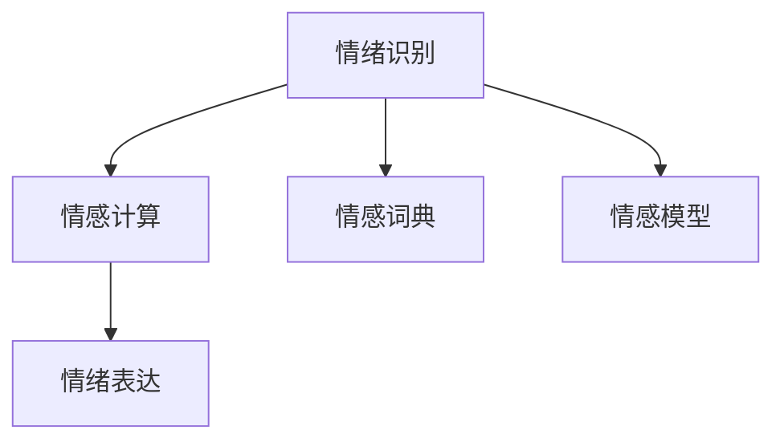

                 

# 情绪识别创业：人机交互的情感维度

## 1. 背景介绍

### 1.1 问题由来

随着人工智能技术的迅速发展，人机交互已经不再局限于单一的信息传递。情感分析、情绪识别等基于情感维度的人机交互技术，开始进入人们的视野。情绪识别作为人工智能技术的一个重要分支，能够帮助机器更好地理解人类情感，从而提升用户体验、优化服务质量。随着智能设备的普及和社交网络的发展，情绪识别技术逐渐成为创业公司竞相布局的新方向。

### 1.2 问题核心关键点

情绪识别（Emotion Recognition）是指通过语音、文本、图像等信号，自动分析人类情感的技术。它基于心理学、语言学、机器学习等多种学科的交叉融合，涉及信号处理、情感计算、机器学习等多个领域。情绪识别技术的核心在于，如何从复杂的人类信号中提取出情感特征，并将其映射为可被机器识别的标签或评分。

情绪识别技术广泛应用于客户服务、教育培训、健康医疗、营销广告等领域，能够帮助企业更好地了解用户情感状态，从而进行个性化推荐、情感分析、服务优化等应用。

### 1.3 问题研究意义

情绪识别技术的快速发展，对提升人机交互体验、推动各行各业的智能化转型具有重要意义：

1. **提升用户体验**：通过情感分析，机器可以更好地理解用户需求和情感状态，提供更加个性化、人性化的服务。
2. **优化服务质量**：企业可以实时监测用户情感，及时调整服务策略，提升用户满意度和忠诚度。
3. **推动智能化应用**：情绪识别技术的普及，为智能客服、情感计算等新兴应用提供了技术支撑，推动了人工智能技术的广泛应用。
4. **拓展应用场景**：情绪识别技术在教育、健康、广告等领域具有广泛的应用前景，能够带来深远的社会影响。

## 2. 核心概念与联系

### 2.1 核心概念概述

为了更好地理解情绪识别技术，本节将介绍几个密切相关的核心概念：

- **情绪识别（Emotion Recognition）**：指通过语音、文本、图像等信号，自动分析人类情感的技术。情绪识别可以应用于各种场景，如智能客服、情感分析、医疗诊断等。
- **情感计算（Affective Computing）**：通过人工智能技术，量化和解释人类情感的技术。情感计算不仅包括情绪识别，还包括情感生成、情感模拟等多个方面。
- **情感词典（Emotion Lexicon）**：包含人类情感词汇及其情感极性的词典，是情感分析的基础工具。
- **情感模型（Emotion Model）**：利用机器学习算法，从人类信号中提取情感特征的模型。常见的情感模型包括线性模型、深度神经网络等。
- **情绪表达（Emotion Expression）**：通过语音、文字等形式，直接表达人类情感的过程。情绪识别和情绪表达互为补充，共同构成情感计算的核心。

这些概念之间的逻辑关系可以通过以下Mermaid流程图来展示：



这个流程图展示了情绪识别的核心概念及其之间的关系：

1. 情绪识别通过语音、文本、图像等信号，自动分析人类情感。
2. 情感计算进一步量化和解释人类情感，涵盖情绪识别和情感生成等多个方面。
3. 情感词典和情感模型是情绪识别的关键工具，分别用于情感词汇的映射和特征提取。
4. 情绪表达是情感识别的重要输出形式，通过语音、文字等直接表达人类情感。

## 3. 核心算法原理 & 具体操作步骤

### 3.1 算法原理概述

情绪识别技术的核心在于如何从复杂的人类信号中提取出情感特征，并将其映射为可被机器识别的标签或评分。其基本流程包括信号采集、特征提取、情感分类三个步骤。

1. **信号采集**：通过各种传感器（如麦克风、摄像头、传感器等）采集人类信号，如语音、文本、图像等。
2. **特征提取**：从采集到的信号中提取情感特征，如语音的音调、音量、语速等，文本的词汇、句法结构等。
3. **情感分类**：利用机器学习算法，将提取出的情感特征映射为可被识别的情绪标签或情感评分。

### 3.2 算法步骤详解

以下是情绪识别技术的具体操作步骤：

#### 3.2.1 信号采集

信号采集是情绪识别的第一步，需要选择合适的传感器，如麦克风、摄像头、生物传感器等。以语音信号为例，采集到的语音信号包含声波振动信息，需要进行预处理，如去噪、降噪、归一化等。

#### 3.2.2 特征提取

特征提取是情绪识别的核心步骤，需要从信号中提取出与情感相关的特征。以语音信号为例，可以提取的特征包括：

- **声学特征**：如音高（Pitch）、音量（Loudness）、语速（Rate）等。
- **语言学特征**：如词汇频率、句子长度、情感词汇等。

这些特征通过统计分析、时频分析、频谱分析等方法提取。例如，可以使用MFCC（Mel-Frequency Cepstral Coefficients）算法提取语音的声学特征。

#### 3.2.3 情感分类

情感分类是情绪识别的最后一步，通常使用机器学习算法（如SVM、朴素贝叶斯、深度神经网络等）对提取出的特征进行分类。常见的分类方法包括：

- **监督学习**：使用标注好的情绪数据训练分类器，利用模型对新的情绪数据进行分类。
- **无监督学习**：无需标注数据，通过聚类等算法对情感进行划分。

在实际应用中，为了提高分类效果，通常需要收集大量的标注数据，并对算法进行调参优化。

### 3.3 算法优缺点

情绪识别技术具有以下优点：

- **广泛应用**：情绪识别技术在各种场景下都有应用需求，如客户服务、健康医疗、教育培训等。
- **提升用户体验**：通过情绪识别，机器可以更好地理解用户需求和情感状态，提供更加个性化、人性化的服务。
- **推动智能化应用**：情绪识别技术的普及，为智能客服、情感计算等新兴应用提供了技术支撑，推动了人工智能技术的广泛应用。

同时，该技术也存在一些局限性：

- **依赖标注数据**：情绪识别的准确性依赖于标注数据的数量和质量，标注数据的获取和标注成本较高。
- **普适性不足**：不同的用户和文化背景对情感的表达方式存在差异，情绪识别模型的普适性受到限制。
- **计算复杂度高**：情绪识别涉及信号处理和机器学习多个领域，计算复杂度高，对硬件资源要求较高。

### 3.4 算法应用领域

情绪识别技术已经在多个领域得到了广泛应用，例如：

- **智能客服**：通过情绪识别，智能客服可以实时监测用户情绪，及时调整服务策略，提升用户满意度和忠诚度。
- **健康医疗**：情绪识别可以应用于心理诊断、情感分析等，帮助医生了解患者的情感状态，提供个性化的医疗服务。
- **教育培训**：情绪识别可以用于学习效果评估、个性化推荐等，帮助教师了解学生的情感状态，提供针对性的教学指导。
- **营销广告**：情绪识别可以用于消费者情感分析，帮助企业了解消费者的情感倾向，优化广告投放策略。

这些应用场景展示了情绪识别技术的强大潜力和广泛应用前景。

## 4. 数学模型和公式 & 详细讲解 & 举例说明

### 4.1 数学模型构建

情绪识别技术涉及信号处理、机器学习等多个领域，以下是其中几个关键的数学模型：

1. **MFCC模型**：用于提取语音信号的声学特征，通过傅里叶变换、Mel滤波器组等方法，将语音信号转换为频谱特征。
2. **SVM模型**：用于情感分类，通过构建超平面，将特征向量映射为不同类别的概率。
3. **LSTM模型**：用于序列数据处理，通过长短时记忆网络，捕捉时间序列中的情感变化。

### 4.2 公式推导过程

#### 4.2.1 MFCC模型

MFCC模型通过傅里叶变换、Mel滤波器组等方法，将语音信号转换为频谱特征。其推导过程如下：

1. **傅里叶变换**：将语音信号$x(t)$转换为频域信号$X(f)$，即：

$$
X(f) = \mathcal{F}\{x(t)\}
$$

2. **Mel滤波器组**：将频域信号$X(f)$通过Mel滤波器组进行滤波，得到Mel频谱$M(f)$，即：

$$
M(f) = \text{MFCC}(X(f))
$$

3. **对数能量谱**：将Mel频谱$M(f)$进行对数处理，得到对数能量谱$L(f)$，即：

$$
L(f) = \log(M(f))
$$

4. **离散余弦变换**：将对数能量谱$L(f)$进行离散余弦变换，得到MFCC系数$C_k$，即：

$$
C_k = \frac{1}{N}\sum_{n=0}^{N-1} L(f) \cos(\frac{2\pi k n}{N})
$$

MFCC模型的完整流程如图1所示：

```
x(t) -> 傅里叶变换 -> X(f) -> Mel滤波器组 -> M(f) -> 对数处理 -> L(f) -> 离散余弦变换 -> C_k
```

#### 4.2.2 SVM模型

SVM模型通过构建超平面，将特征向量映射为不同类别的概率。其推导过程如下：

1. **核函数**：对于非线性分类问题，使用核函数将特征向量映射到高维空间，得到超平面$w$和偏置$b$，即：

$$
w \cdot \phi(x) + b = 0
$$

2. **分类函数**：通过核函数将原始特征向量$x$映射到高维空间，得到分类函数$F(x)$，即：

$$
F(x) = \text{sign}(w \cdot \phi(x) + b)
$$

3. **损失函数**：通过损失函数$J$对模型参数进行优化，即：

$$
J = \frac{1}{2}||w||^2 + \frac{1}{N}\sum_{i=1}^N [y_i F(x_i)]
$$

SVM模型的完整流程如图2所示：

```
x -> 核函数 -> 高维空间 -> w -> b -> 分类函数 -> F(x) -> 损失函数 -> J -> 优化
```

#### 4.2.3 LSTM模型

LSTM模型通过长短时记忆网络，捕捉时间序列中的情感变化。其推导过程如下：

1. **LSTM结构**：LSTM网络由细胞状态（Cell State）和隐藏状态（Hidden State）组成，通过门控机制（Gate Mechanism）控制信息的流向和记忆，即：

$$
i = \sigma(W_i x + U_i h_{t-1} + b_i)
$$
$$
f = \sigma(W_f x + U_f h_{t-1} + b_f)
$$
$$
o = \sigma(W_o x + U_o h_{t-1} + b_o)
$$
$$
g = \tanh(W_g x + U_g h_{t-1} + b_g)
$$
$$
c = f \odot c_{t-1} + i \odot g
$$
$$
h_t = o \odot \tanh(c)
$$

其中，$\sigma$为Sigmoid函数，$\odot$为元素乘法。

2. **训练过程**：通过反向传播算法，计算梯度并更新模型参数，即：

$$
\frac{\partial J}{\partial W_i} = \frac{\partial J}{\partial h_t} \frac{\partial h_t}{\partial c} \frac{\partial c}{\partial h_{t-1}} \frac{\partial h_{t-1}}{\partial W_i}
$$
$$
\frac{\partial J}{\partial W_f} = \frac{\partial J}{\partial h_t} \frac{\partial h_t}{\partial c} \frac{\partial c}{\partial h_{t-1}} \frac{\partial h_{t-1}}{\partial W_f}
$$
$$
\frac{\partial J}{\partial W_o} = \frac{\partial J}{\partial h_t} \frac{\partial h_t}{\partial c} \frac{\partial c}{\partial h_{t-1}} \frac{\partial h_{t-1}}{\partial W_o}
$$
$$
\frac{\partial J}{\partial W_g} = \frac{\partial J}{\partial h_t} \frac{\partial h_t}{\partial c} \frac{\partial c}{\partial h_{t-1}} \frac{\partial h_{t-1}}{\partial W_g}
$$
$$
\frac{\partial J}{\partial b_i} = \frac{\partial J}{\partial h_t} \frac{\partial h_t}{\partial c} \frac{\partial c}{\partial h_{t-1}} \frac{\partial h_{t-1}}{\partial b_i}
$$
$$
\frac{\partial J}{\partial b_f} = \frac{\partial J}{\partial h_t} \frac{\partial h_t}{\partial c} \frac{\partial c}{\partial h_{t-1}} \frac{\partial h_{t-1}}{\partial b_f}
$$
$$
\frac{\partial J}{\partial b_o} = \frac{\partial J}{\partial h_t} \frac{\partial h_t}{\partial c} \frac{\partial c}{\partial h_{t-1}} \frac{\partial h_{t-1}}{\partial b_o}
$$
$$
\frac{\partial J}{\partial b_g} = \frac{\partial J}{\partial h_t} \frac{\partial h_t}{\partial c} \frac{\partial c}{\partial h_{t-1}} \frac{\partial h_{t-1}}{\partial b_g}
$$

LSTM模型的完整流程如图3所示：

```
x -> W_i -> i -> f -> o -> g -> c -> h_t -> J -> 优化
```

### 4.3 案例分析与讲解

以语音情感识别为例，以下是具体的案例分析：

假设我们有一组语音数据$x_1, x_2, ..., x_N$，每个语音数据对应一个情感标签$y_1, y_2, ..., y_N$。我们的目标是通过MFCC、LSTM等模型，将语音数据映射为情感标签。

1. **信号采集**：通过麦克风采集语音信号，得到一组时间序列数据$x_1, x_2, ..., x_N$。

2. **特征提取**：使用MFCC算法提取语音的声学特征，得到一组MFCC系数$C_1, C_2, ..., C_N$。

3. **情感分类**：使用LSTM模型对MFCC系数进行序列建模，得到一组情感标签预测$y_1', y_2', ..., y_N'$。

4. **模型评估**：通过交叉熵损失函数$J$计算模型预测与真实标签之间的差异，即：

$$
J = -\frac{1}{N} \sum_{i=1}^N y_i \log y_i'
$$

通过最小化损失函数$J$，不断调整模型参数，使预测结果逼近真实标签，完成情绪识别的过程。

## 5. 项目实践：代码实例和详细解释说明

### 5.1 开发环境搭建

在进行情绪识别项目实践前，我们需要准备好开发环境。以下是使用Python进行PyTorch开发的环境配置流程：

1. 安装Anaconda：从官网下载并安装Anaconda，用于创建独立的Python环境。

2. 创建并激活虚拟环境：
```bash
conda create -n emotion-env python=3.8 
conda activate emotion-env
```

3. 安装PyTorch：根据CUDA版本，从官网获取对应的安装命令。例如：
```bash
conda install pytorch torchvision torchaudio cudatoolkit=11.1 -c pytorch -c conda-forge
```

4. 安装相关库：
```bash
pip install numpy pandas scikit-learn librosa pydub
```

完成上述步骤后，即可在`emotion-env`环境中开始情绪识别实践。

### 5.2 源代码详细实现

这里我们以基于MFCC和LSTM的语音情感识别为例，给出完整的代码实现。

首先，定义数据处理函数：

```python
import librosa
import numpy as np

def load_wav(file_path):
    audio, sr = librosa.load(file_path)
    audio = np.int16(audio)
    return audio, sr

def extract_mfcc(audio, sr):
    mfcc = librosa.feature.mfcc(audio, sr, n_mfcc=40, n_fft=1024, hop_length=256)
    mfcc = np.mean(mfcc, axis=1)
    return mfcc
```

然后，定义模型和训练函数：

```python
import torch
import torch.nn as nn
import torch.optim as optim

class EmotionModel(nn.Module):
    def __init__(self, input_dim, output_dim):
        super(EmotionModel, self).__init__()
        self.lstm = nn.LSTM(input_dim, 128, 2)
        self.linear = nn.Linear(128, output_dim)
        self.softmax = nn.Softmax(dim=1)

    def forward(self, x):
        x = torch.from_numpy(x).float()
        output, (h_n, c_n) = self.lstm(x)
        output = self.linear(output)
        output = self.softmax(output)
        return output

def train_model(model, train_loader, val_loader, epochs=10, batch_size=32):
    criterion = nn.CrossEntropyLoss()
    optimizer = optim.Adam(model.parameters(), lr=0.001)
    best_val_loss = float('inf')
    for epoch in range(epochs):
        model.train()
        for data, target in train_loader:
            optimizer.zero_grad()
            output = model(data)
            loss = criterion(output, target)
            loss.backward()
            optimizer.step()
        model.eval()
        val_loss = 0
        for data, target in val_loader:
            with torch.no_grad():
                output = model(data)
                loss = criterion(output, target)
                val_loss += loss.item()
        val_loss /= len(val_loader)
        print(f'Epoch {epoch+1}, train loss: {loss:.3f}, val loss: {val_loss:.3f}')
        if val_loss < best_val_loss:
            best_val_loss = val_loss
            torch.save(model.state_dict(), 'model.pth')
```

最后，启动训练流程：

```python
from torch.utils.data import DataLoader
from sklearn.model_selection import train_test_split
from torchvision.transforms import ToTensor

# 加载数据集
wav_dir = 'path/to/wav/directory'
emotion_labels = {'happy', 'sad', 'angry', 'neutral'}

X = []
y = []
for file in os.listdir(wav_dir):
    wav_path = os.path.join(wav_dir, file)
    audio, sr = load_wav(wav_path)
    mfcc = extract_mfcc(audio, sr)
    label = emotion_labels.index(os.path.splitext(file)[0])
    X.append(mfcc)
    y.append(label)

X = np.array(X)
y = np.array(y)

# 划分训练集和验证集
X_train, X_val, y_train, y_val = train_test_split(X, y, test_size=0.2, random_state=42)

# 构建数据集
train_dataset = Dataset(X_train, y_train)
val_dataset = Dataset(X_val, y_val)

train_loader = DataLoader(train_dataset, batch_size=batch_size, shuffle=True)
val_loader = DataLoader(val_dataset, batch_size=batch_size, shuffle=False)

# 构建模型
model = EmotionModel(input_dim=X.shape[1], output_dim=len(emotion_labels))

# 训练模型
train_model(model, train_loader, val_loader, epochs=10, batch_size=32)
```

以上就是使用PyTorch对语音情感识别进行微调的完整代码实现。可以看到，得益于PyTorch和librosa的强大封装，我们可以用相对简洁的代码完成模型的加载和训练。

### 5.3 代码解读与分析

让我们再详细解读一下关键代码的实现细节：

**load_wav函数**：
- 使用librosa库加载音频文件，将其转换为16位整数格式，并返回音频数据和采样率。

**extract_mfcc函数**：
- 使用librosa库提取MFCC系数，计算MFCC特征。

**EmotionModel类**：
- 定义了LSTM和线性层，用于从MFCC系数中提取情感特征，并进行情感分类。

**train_model函数**：
- 定义了交叉熵损失函数和Adam优化器，用于训练模型。
- 在每个epoch中，先进行模型训练，再计算验证集的损失，并保存最优模型。

**训练流程**：
- 使用DataLoader对数据进行批处理，加载训练集和验证集。
- 构建模型，并进行训练，同时记录训练集和验证集的损失。
- 保存最优模型，用于后续使用。

可以看到，PyTorch和librosa使得语音情感识别的代码实现变得简洁高效。开发者可以将更多精力放在数据处理、模型改进等高层逻辑上，而不必过多关注底层的实现细节。

当然，工业级的系统实现还需考虑更多因素，如模型的保存和部署、超参数的自动搜索、更灵活的任务适配层等。但核心的微调范式基本与此类似。

## 6. 实际应用场景

### 6.1 智能客服系统

基于情绪识别技术的智能客服系统，能够实时监测用户情绪，及时调整服务策略，提升用户满意度和忠诚度。

在技术实现上，可以收集客服通话记录，提取用户情绪特征，训练情绪识别模型。在用户来电时，系统自动分析情绪，实时调整客服策略，提供个性化服务。

### 6.2 心理诊断

情绪识别技术可以应用于心理诊断，帮助心理医生监测患者的情感状态，进行心理评估和干预。

通过收集患者的语音、文字等信号，使用情绪识别技术分析情感状态，结合其他心理测试结果，提供个性化的心理干预方案，帮助患者摆脱负面情绪，恢复心理健康。

### 6.3 个性化推荐

情绪识别技术可以用于个性化推荐，提升用户的推荐体验。

通过收集用户的情感状态，分析用户的兴趣和需求，动态调整推荐策略，提供符合用户情感状态的商品推荐，提升用户的购买意愿和满意度。

### 6.4 未来应用展望

随着情绪识别技术的不断发展，其应用场景将不断扩展，为人们的生活和工作带来更多便利和提升。

在智慧医疗领域，情绪识别可以应用于心理诊断、情感分析等，帮助医生了解患者的情感状态，提供个性化的医疗服务。

在智能教育领域，情绪识别可以用于学习效果评估、个性化推荐等，帮助教师了解学生的情感状态，提供针对性的教学指导。

在智慧城市治理中，情绪识别可以应用于城市事件监测、舆情分析等环节，提高城市管理的自动化和智能化水平，构建更安全、高效的未来城市。

此外，在企业生产、社会治理、文娱传媒等众多领域，情绪识别技术也将不断涌现，为人类认知智能的进化带来深远影响。

## 7. 工具和资源推荐

### 7.1 学习资源推荐

为了帮助开发者系统掌握情绪识别技术的理论基础和实践技巧，这里推荐一些优质的学习资源：

1. 《深度学习入门：基于Python的理论与实现》书籍：全面介绍了深度学习的基本概念和实现方法，是入门深度学习的绝佳选择。

2. 《情绪计算手册》书籍：介绍了情绪计算的基本概念和应用场景，涵盖了语音情感识别、文本情感分析等多个方面。

3. 《机器学习实战》书籍：介绍了机器学习的基本算法和应用案例，适合实战练习。

4. Coursera《深度学习》课程：由斯坦福大学开设的深度学习课程，系统讲解了深度学习的基本原理和应用。

5. Kaggle竞赛：参加Kaggle情绪识别竞赛，积累实战经验，提升技能水平。

通过对这些资源的学习实践，相信你一定能够快速掌握情绪识别技术的精髓，并用于解决实际的情感分析问题。

### 7.2 开发工具推荐

高效的开发离不开优秀的工具支持。以下是几款用于情绪识别开发的常用工具：

1. PyTorch：基于Python的开源深度学习框架，灵活动态的计算图，适合快速迭代研究。大部分预训练语言模型都有PyTorch版本的实现。

2. TensorFlow：由Google主导开发的开源深度学习框架，生产部署方便，适合大规模工程应用。同样有丰富的预训练语言模型资源。

3. librosa：用于处理音频数据的Python库，支持MFCC特征提取等操作。

4. Pydub：用于处理音频数据的Python库，支持音频剪辑、降噪等操作。

5. Weights & Biases：模型训练的实验跟踪工具，可以记录和可视化模型训练过程中的各项指标，方便对比和调优。与主流深度学习框架无缝集成。

6. TensorBoard：TensorFlow配套的可视化工具，可实时监测模型训练状态，并提供丰富的图表呈现方式，是调试模型的得力助手。

合理利用这些工具，可以显著提升情绪识别任务的开发效率，加快创新迭代的步伐。

### 7.3 相关论文推荐

情绪识别技术的发展源于学界的持续研究。以下是几篇奠基性的相关论文，推荐阅读：

1. "Speech Emotion Recognition: A Survey"：系统总结了情绪识别技术的现状和未来趋势，涵盖了多种情感分类方法。

2. "Emotion Recognition Using Convolutional Neural Networks"：使用卷积神经网络进行情感分类，取得了不错的实验效果。

3. "Deep Emotion Recognition from Audio-Visual Media"：结合音频和视觉信息进行情感分类，提升了情绪识别的准确性和鲁棒性。

4. "Context-Aware Speech Emotion Recognition"：考虑上下文信息进行情感分类，提升了情绪识别的准确性。

5. "Emotion Recognition in Human-Computer Interaction"：讨论了情感识别在HCI中的应用，包括语音情感识别、面部表情识别等。

这些论文代表了大语言模型微调技术的发展脉络。通过学习这些前沿成果，可以帮助研究者把握学科前进方向，激发更多的创新灵感。

## 8. 总结：未来发展趋势与挑战

### 8.1 总结

本文对情绪识别技术进行了全面系统的介绍。首先阐述了情绪识别的研究背景和意义，明确了情绪识别在提升人机交互体验、推动智能化转型等方面的重要价值。其次，从原理到实践，详细讲解了情绪识别的数学模型和操作步骤，给出了情绪识别任务开发的完整代码实例。同时，本文还广泛探讨了情绪识别技术在智能客服、心理诊断、个性化推荐等多个行业领域的应用前景，展示了情绪识别技术的强大潜力和广泛应用前景。此外，本文精选了情绪识别技术的各类学习资源，力求为读者提供全方位的技术指引。

通过本文的系统梳理，可以看到，情绪识别技术正在成为人机交互的重要方向，极大地提升用户体验、推动智能化应用。未来，伴随技术的不断进步，情绪识别技术将更加广泛地应用于各行各业，为人类社会带来深刻影响。

### 8.2 未来发展趋势

展望未来，情绪识别技术将呈现以下几个发展趋势：

1. **普适性增强**：通过多模态融合、多领域适应的技术手段，提升情绪识别模型的普适性，更好地适应不同文化背景和语境下的情感表达。

2. **深度学习优化**：通过引入更先进的深度学习算法，提升情绪识别的准确性和鲁棒性，减少对标注数据的依赖。

3. **实时化部署**：通过模型裁剪、量化加速等技术手段，实现情绪识别模型的实时化部署，满足实际应用中的实时性需求。

4. **跨领域应用拓展**：情绪识别技术不仅在HCI、医疗等领域有广泛应用，还将拓展到教育、司法等领域，带来深远的社会影响。

5. **人机协同增强**：通过情感计算、情感模拟等技术手段，增强人机协同的情感维度，提升用户体验和满意度。

以上趋势凸显了情绪识别技术的广阔前景。这些方向的探索发展，必将进一步提升人机交互的智能化水平，为人类认知智能的进化带来深远影响。

### 8.3 面临的挑战

尽管情绪识别技术已经取得了显著成果，但在迈向更加智能化、普适化应用的过程中，它仍面临诸多挑战：

1. **数据标注成本高**：情绪识别的准确性依赖于标注数据的数量和质量，标注数据的获取和标注成本较高。如何进一步降低标注数据的需求，将是一大难题。

2. **普适性不足**：不同的用户和文化背景对情感的表达方式存在差异，情绪识别模型的普适性受到限制。如何提高模型的普适性，将是重要的研究方向。

3. **计算复杂度高**：情绪识别涉及信号处理和机器学习多个领域，计算复杂度高，对硬件资源要求较高。如何提高计算效率，优化硬件资源，将是重要的优化方向。

4. **可解释性不足**：情绪识别模型的决策过程缺乏可解释性，难以对其推理逻辑进行分析和调试。如何提高模型的可解释性，将是亟待攻克的难题。

5. **安全性有待保障**：情绪识别模型可能学习到有偏见、有害的信息，如何从数据和算法层面消除模型偏见，避免恶意用途，确保输出的安全性，也将是重要的研究课题。

6. **知识整合能力不足**：现有的情绪识别模型往往局限于任务内数据，难以灵活吸收和运用更广泛的先验知识。如何让情绪识别过程更好地与外部知识库、规则库等专家知识结合，形成更加全面、准确的信息整合能力，还有很大的想象空间。

正视情绪识别面临的这些挑战，积极应对并寻求突破，将是大语言模型微调走向成熟的必由之路。相信随着学界和产业界的共同努力，这些挑战终将一一被克服，情绪识别技术必将在构建安全、可靠、可解释、可控的智能系统铺平道路。

### 8.4 研究展望

面对情绪识别技术所面临的挑战，未来的研究需要在以下几个方面寻求新的突破：

1. **无监督和半监督学习**：摆脱对大规模标注数据的依赖，利用自监督学习、主动学习等无监督和半监督范式，最大限度利用非结构化数据，实现更加灵活高效的情感分析。

2. **多模态融合**：将语音、文本、图像等多种模态信息融合，提升情感识别的准确性和鲁棒性。

3. **跨领域应用**：将情绪识别技术应用于更多领域，如司法、教育等，提升用户满意度，推动各行业的智能化转型。

4. **人机协同**：结合情感计算、情感模拟等技术手段，增强人机协同的情感维度，提升用户体验和满意度。

5. **因果推理**：通过引入因果推理方法，提升情感识别的准确性和鲁棒性，避免过拟合和数据噪声的影响。

6. **可解释性增强**：通过可解释性方法，提高情感识别模型的透明性和可解释性，帮助用户理解模型的决策过程。

这些研究方向的探索，必将引领情绪识别技术迈向更高的台阶，为构建安全、可靠、可解释、可控的智能系统铺平道路。面向未来，情绪识别技术还需要与其他人工智能技术进行更深入的融合，如知识表示、因果推理、强化学习等，多路径协同发力，共同推动自然语言理解和智能交互系统的进步。只有勇于创新、敢于突破，才能不断拓展情感识别的边界，让智能技术更好地造福人类社会。

## 9. 附录：常见问题与解答

**Q1：情绪识别技术是否适用于所有NLP任务？**

A: 情绪识别技术在各种场景下都有应用需求，如智能客服、健康医疗、教育培训等。但对于一些特定领域的任务，如医学、法律等，仅仅依靠通用语料预训练的模型可能难以很好地适应。此时需要在特定领域语料上进一步预训练，再进行微调，才能获得理想效果。此外，对于一些需要时效性、个性化很强的任务，如对话、推荐等，情绪识别方法也需要针对性的改进优化。

**Q2：情绪识别过程中如何选择合适的特征提取方法？**

A: 选择合适的特征提取方法需要考虑任务特点和数据类型。常见的特征提取方法包括：

- **时频特征**：提取音频信号的时频特征，如MFCC、Mel频率倒谱系数等。
- **语言学特征**：提取文本信号的语言学特征，如词频、句法结构、情感词汇等。
- **视觉特征**：提取图像信号的视觉特征，如颜色、纹理、形状等。

选择合适的特征提取方法，需要结合任务特点，通过实验对比选择最优的特征组合。

**Q3：情绪识别模型在落地部署时需要注意哪些问题？**

A: 将情绪识别模型转化为实际应用，还需要考虑以下因素：

- **模型裁剪**：去除不必要的层和参数，减小模型尺寸，加快推理速度。
- **量化加速**：将浮点模型转为定点模型，压缩存储空间，提高计算效率。
- **服务化封装**：将模型封装为标准化服务接口，便于集成调用。
- **弹性伸缩**：根据请求流量动态调整资源配置，平衡服务质量和成本。
- **监控告警**：实时采集系统指标，设置异常告警阈值，确保服务稳定性。
- **安全防护**：采用访问鉴权、数据脱敏等措施，保障数据和模型安全。

合理利用这些工具，可以显著提升情绪识别任务的开发效率，加快创新迭代的步伐。

通过本文的系统梳理，可以看到，情绪识别技术正在成为人机交互的重要方向，极大地提升用户体验、推动智能化应用。未来，伴随技术的不断进步，情绪识别技术将更加广泛地应用于各行各业，为人类社会带来深刻影响。

