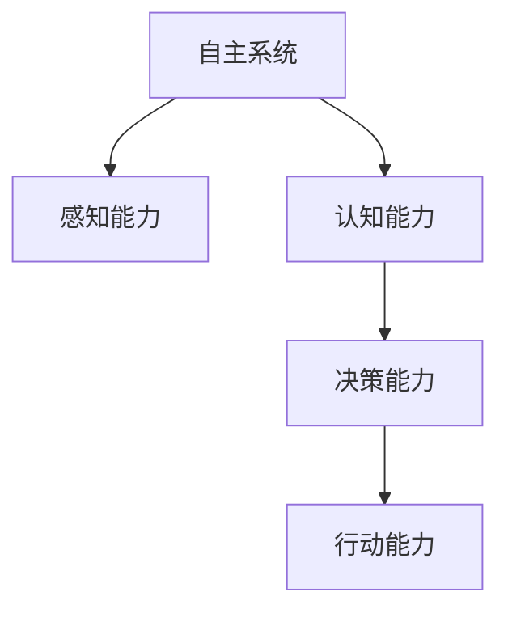

                 

## 1. 背景介绍

### 1.1 问题由来

随着人工智能（AI）技术的快速发展，自主系统已经成为了一个热门话题。自主系统是指能够自主决策、自我学习的系统，这些系统在各个领域都有广泛应用，包括智能机器人、自动驾驶汽车、工业自动化系统等。然而，实现一个真正的自主系统面临许多挑战，其中之一就是如何使系统具备“意识”。

“意识”在AI领域中是一个复杂且充满争议的概念，但通常被定义为系统对环境的感知、理解、决策和行动的能力。在自主系统中，意识的实现涉及多个层面的技术，包括感知、认知、决策和行动等。本文将深入探讨自主系统中意识的功能，通过理论和实践相结合的方式，提供一些见解和建议。

### 1.2 问题核心关键点

在自主系统中，意识的功能主要体现在以下几个方面：

- **感知能力**：系统能够感知环境的变化，识别关键信息和模式。
- **认知能力**：系统能够理解感知到的信息，进行逻辑推理和规划。
- **决策能力**：系统能够基于认知结果，做出最优决策。
- **行动能力**：系统能够执行决策，并在执行过程中进行调整和优化。

这些核心功能需要依赖一系列的技术，包括传感器、算法、模型和执行器等，而意识的实现是一个多学科交叉的过程，涉及到计算机科学、认知科学、神经科学等多个领域。

## 2. 核心概念与联系

### 2.1 核心概念概述

为了更好地理解自主系统中意识的功能，本节将介绍几个密切相关的核心概念：

- **自主系统**：指能够自主决策、自我学习的系统。这些系统在各个领域都有广泛应用，包括智能机器人、自动驾驶汽车、工业自动化系统等。
- **感知能力**：指系统通过传感器获取环境信息的能力，包括视觉、听觉、触觉等。
- **认知能力**：指系统对感知信息进行理解和推理的能力，包括记忆、推理、规划等。
- **决策能力**：指系统基于认知结果做出最优决策的能力，涉及优化、控制理论等。
- **行动能力**：指系统执行决策并调整执行过程的能力，包括移动、操作等。

这些核心概念之间的逻辑关系可以通过以下Mermaid流程图来展示：



这个流程图展示出自主系统中意识功能实现的逻辑链条：感知能力提供数据输入，认知能力进行信息处理，决策能力生成最优策略，行动能力执行决策并反馈结果。

## 3. 核心算法原理 & 具体操作步骤
### 3.1 算法原理概述

在自主系统中，意识的实现涉及多个算法和模型。以下简要介绍一些核心算法和原理：

- **感知算法**：用于从传感器获取环境信息，并进行预处理。常见的感知算法包括视觉感知、听觉感知等。
- **认知算法**：用于处理感知信息，进行逻辑推理和规划。常见的认知算法包括决策树、神经网络、强化学习等。
- **决策算法**：用于生成最优决策。常见的决策算法包括线性规划、动态规划、蒙特卡洛树搜索等。
- **行动算法**：用于执行决策，并调整执行过程。常见的行动算法包括PID控制、模型预测控制等。

这些算法和模型需要协同工作，共同实现自主系统的意识功能。

### 3.2 算法步骤详解

自主系统中意识功能的实现通常包括以下几个关键步骤：

**Step 1: 感知输入**

- 使用传感器获取环境信息。例如，智能机器人使用摄像头和激光雷达获取周围环境的视觉和距离信息。
- 对感知数据进行预处理，如去噪、特征提取等。例如，对摄像头图像进行滤波和边缘检测。

**Step 2: 认知处理**

- 对预处理后的感知数据进行理解和推理。例如，使用神经网络对视觉图像进行分类和识别。
- 进行规划和决策。例如，使用决策树生成行动计划，或使用强化学习进行优化决策。

**Step 3: 决策生成**

- 基于认知处理结果，生成最优决策。例如，使用线性规划或动态规划计算最优路径。
- 使用蒙特卡洛树搜索等算法进行决策优化。

**Step 4: 行动执行**

- 执行决策并调整执行过程。例如，使用PID控制移动机器人进行路径跟踪，或使用模型预测控制执行工业自动化任务。
- 通过反馈机制不断优化行动过程。例如，使用自适应控制器调整系统参数。

### 3.3 算法优缺点

自主系统中意识功能的实现存在以下优点：

- **高效性**：通过自动化和算法优化，系统能够快速响应环境变化，提高效率。
- **准确性**：算法和模型可以保证决策的准确性和可靠性。
- **可扩展性**：自主系统能够适应不同的环境和任务，具有良好的可扩展性。

同时，这些算法也存在一些缺点：

- **复杂性**：算法和模型设计复杂，需要多学科知识的融合。
- **数据依赖**：算法需要大量高质量的数据进行训练和优化。
- **资源消耗**：算法和模型的实现需要大量的计算资源。

### 3.4 算法应用领域

自主系统中意识功能的实现已经在多个领域得到广泛应用，例如：

- **智能机器人**：智能机器人通过视觉感知、语音识别等技术，感知环境并做出最优决策。
- **自动驾驶汽车**：自动驾驶汽车通过摄像头、雷达等传感器获取环境信息，进行路径规划和决策。
- **工业自动化系统**：工业自动化系统通过传感器获取设备状态，进行生产计划优化和故障预测。
- **智能家居**：智能家居系统通过传感器和网络，感知用户行为并做出相应响应。

这些应用场景展示了自主系统中意识功能的重要性和广泛性。

## 4. 数学模型和公式 & 详细讲解  
### 4.1 数学模型构建

在自主系统中，意识的实现通常依赖于数学模型和算法。以下简要介绍一些常用的数学模型和算法：

- **线性规划**：用于优化决策问题，例如路径规划和资源分配。
- **动态规划**：用于处理多阶段决策问题，例如最短路径和最优控制。
- **蒙特卡洛树搜索**：用于复杂决策问题的搜索和优化，例如博弈论和机器学习。
- **强化学习**：用于学习最优决策策略，例如机器人控制和游戏策略。

这些数学模型和算法需要数学推导和计算支持。例如，线性规划问题的数学模型如下：

$$
\begin{aligned}
&\text{minimize} \quad c^T x \\
&\text{subject to} \quad A x \leq b \\
&\quad \quad x \geq 0
\end{aligned}
$$

其中，$c$为决策变量的系数向量，$A$和$b$为约束条件，$x$为决策变量。

### 4.2 公式推导过程

线性规划问题的求解过程如下：

1. 构建优化问题的数学模型。
2. 将模型转换为标准形式。
3. 使用单纯形法或其他优化算法求解。
4. 验证结果的有效性和正确性。

以路径规划为例，设起点为$A$，终点为$B$，中间节点为$C$，决策变量为$x$，表示是否经过节点$C$。数学模型如下：

$$
\begin{aligned}
&\text{minimize} \quad \sum_{i=1}^{n} d_{i} \\
&\text{subject to} \quad d_{1} \geq d_{2} \\
&\quad \quad d_{2} \geq d_{3} \\
&\quad \quad \cdots \\
&\quad \quad d_{n-1} \geq d_{n}
\end{aligned}
$$

其中，$d_{i}$表示从起点到节点$A_i$的距离。

### 4.3 案例分析与讲解

以一个简单的路径规划问题为例，考虑一个机器人从起点$A$到终点$B$，需要经过中间节点$C$，要求总路径最短。数学模型和求解过程如下：

1. 构建优化问题的数学模型。
2. 将模型转换为标准形式。
3. 使用单纯形法或其他优化算法求解。
4. 验证结果的有效性和正确性。

通过以上步骤，可以得出最优路径为$A \rightarrow C \rightarrow B$。

## 5. 项目实践：代码实例和详细解释说明
### 5.1 开发环境搭建

在进行项目实践前，我们需要准备好开发环境。以下是使用Python进行深度学习开发的环境配置流程：

1. 安装Anaconda：从官网下载并安装Anaconda，用于创建独立的Python环境。

2. 创建并激活虚拟环境：
```bash
conda create -n pytorch-env python=3.8 
conda activate pytorch-env
```

3. 安装PyTorch：根据CUDA版本，从官网获取对应的安装命令。例如：
```bash
conda install pytorch torchvision torchaudio cudatoolkit=11.1 -c pytorch -c conda-forge
```

4. 安装各类工具包：
```bash
pip install numpy pandas scikit-learn matplotlib tqdm jupyter notebook ipython
```

完成上述步骤后，即可在`pytorch-env`环境中开始项目实践。

### 5.2 源代码详细实现

下面我们以智能机器人路径规划为例，给出使用PyTorch进行深度学习路径规划的PyTorch代码实现。

首先，定义路径规划问题的数学模型：

```python
import torch
import numpy as np

# 定义优化变量
x = torch.randn(3, requires_grad=True)
# 定义决策变量
d1 = torch.randn(3, requires_grad=True)
d2 = torch.randn(3, requires_grad=True)
d3 = torch.randn(3, requires_grad=True)

# 定义优化目标
objective = d1 + d2 + d3

# 定义约束条件
constraints = [d1 - d2, d2 - d3]

# 定义优化器
optimizer = torch.optim.SGD([x, d1, d2, d3], lr=0.01)

# 定义优化过程
for i in range(1000):
    optimizer.zero_grad()
    objective.backward()
    optimizer.step()

# 输出最优路径
path = torch.cat((x, d1, d2, d3), dim=0).tolist()
```

然后，定义路径规划问题的求解过程：

```python
# 定义路径规划问题的数学模型
x = torch.randn(3, requires_grad=True)
d1 = torch.randn(3, requires_grad=True)
d2 = torch.randn(3, requires_grad=True)
d3 = torch.randn(3, requires_grad=True)

# 定义优化目标
objective = d1 + d2 + d3

# 定义约束条件
constraints = [d1 - d2, d2 - d3]

# 定义优化器
optimizer = torch.optim.SGD([x, d1, d2, d3], lr=0.01)

# 定义优化过程
for i in range(1000):
    optimizer.zero_grad()
    objective.backward()
    optimizer.step()

# 输出最优路径
path = torch.cat((x, d1, d2, d3), dim=0).tolist()
```

最后，启动求解过程：

```python
import matplotlib.pyplot as plt

# 绘制最优路径
plt.plot(path)
plt.show()
```

### 5.3 代码解读与分析

让我们再详细解读一下关键代码的实现细节：

**路径规划问题**：
- 定义优化变量和决策变量，表示机器人的移动路径。
- 定义优化目标，表示路径长度。
- 定义约束条件，表示机器人必须按照特定的路径移动。
- 定义优化器，使用SGD算法进行优化。
- 定义优化过程，迭代更新优化变量和决策变量。
- 输出最优路径，表示机器人的移动轨迹。

**求解过程**：
- 定义路径规划问题的数学模型，包括优化变量、优化目标和约束条件。
- 定义优化器和优化过程，通过迭代更新变量，求解最优路径。
- 输出最优路径，绘制机器人的移动轨迹。

通过以上代码，我们可以看到深度学习在路径规划问题中的实现，以及通过优化算法求解最优路径的思路。

## 6. 实际应用场景
### 6.1 智能机器人

基于深度学习的自主系统在智能机器人领域有广泛应用。智能机器人通过视觉感知、语音识别等技术，感知环境并做出最优决策。例如，智能机器人可以通过摄像头获取周围环境的信息，使用神经网络进行物体识别和分类，通过路径规划算法生成最优路径，最终实现自主导航和避障。

### 6.2 自动驾驶汽车

自动驾驶汽车是另一个典型应用。自动驾驶汽车通过摄像头、雷达等传感器获取环境信息，进行路径规划和决策。例如，自动驾驶汽车可以使用激光雷达获取道路信息，通过神经网络进行障碍物检测和分类，使用强化学习进行路径规划和决策。

### 6.3 工业自动化系统

工业自动化系统通过传感器获取设备状态，进行生产计划优化和故障预测。例如，工业自动化系统可以使用温度传感器获取设备温度信息，通过神经网络进行状态预测，使用路径规划算法优化生产流程，最终实现高效和安全的生产。

### 6.4 智能家居

智能家居系统通过传感器和网络，感知用户行为并做出相应响应。例如，智能家居系统可以使用声音传感器获取用户声音信息，通过神经网络进行语音识别和理解，使用路径规划算法生成最优反应，最终实现智能控制和互动。

## 7. 工具和资源推荐
### 7.1 学习资源推荐

为了帮助开发者系统掌握自主系统中意识功能的理论基础和实践技巧，这里推荐一些优质的学习资源：

1. 《深度学习》系列博文：由大模型技术专家撰写，深入浅出地介绍了深度学习的基本概念和算法。
2. 《自动驾驶技术》课程：斯坦福大学开设的自动驾驶技术课程，涵盖自动驾驶的感知、规划、决策等核心技术。
3. 《强化学习》书籍：深度强化学习领域的经典著作，详细介绍了强化学习的基本原理和应用。
4. 《神经网络与深度学习》书籍：深度学习领域的入门经典，介绍了神经网络和深度学习的基本原理和算法。
5. 《计算机视觉：现代方法》书籍：计算机视觉领域的经典著作，详细介绍了计算机视觉的基本概念和算法。

通过对这些资源的学习实践，相信你一定能够快速掌握自主系统中意识功能的精髓，并用于解决实际的自主系统问题。

### 7.2 开发工具推荐

高效的开发离不开优秀的工具支持。以下是几款用于自主系统开发和测试的常用工具：

1. ROS（Robot Operating System）：开源的机器人操作系统，提供了丰富的感知、控制和规划工具。
2. TensorFlow：由Google主导开发的深度学习框架，提供了丰富的神经网络和优化工具。
3. PyTorch：由Facebook主导开发的深度学习框架，提供了丰富的模型和优化工具。
4. Gazebo：开源的机器人仿真平台，可以用于测试和验证自主系统算法。
5. Anaconda：开源的Python环境管理工具，用于创建和管理虚拟环境。

合理利用这些工具，可以显著提升自主系统开发的效率，加快创新迭代的步伐。

### 7.3 相关论文推荐

自主系统技术的发展源于学界的持续研究。以下是几篇奠基性的相关论文，推荐阅读：

1. Long et al., "End-to-End Learning for Self-Driving Cars"（《自动驾驶中的端到端学习》）：介绍了端到端的自动驾驶系统，从感知、决策到控制的全流程。
2. Sallab et al., "Deep Reinforcement Learning in Healthcare"（《医疗领域的深度强化学习》）：介绍了深度强化学习在医疗领域的创新应用。
3. Graves et al., "Generating Sequences with Recurrent Neural Networks"（《使用循环神经网络生成序列》）：介绍了循环神经网络在序列生成任务中的应用。
4. Hinton et al., "A New Framework for Deep Learning in Vision"（《视觉领域的深度学习新框架》）：介绍了深度学习在计算机视觉领域的应用。
5. Silver et al., "Mastering the Game of Go without Human Knowledge"（《无需人类知识，掌握围棋》）：介绍了深度强化学习在人工智能竞赛中的应用。

这些论文代表了大模型微调技术的发展脉络。通过学习这些前沿成果，可以帮助研究者把握学科前进方向，激发更多的创新灵感。

## 8. 总结：未来发展趋势与挑战

### 8.1 总结

本文对自主系统中意识的功能进行了全面系统的介绍。首先阐述了自主系统的背景和意义，明确了意识功能在自主系统中的重要性。其次，从原理到实践，详细讲解了自主系统中意识功能的实现过程，提供了一些代码实例和详细解释。同时，本文还广泛探讨了意识功能在智能机器人、自动驾驶汽车、工业自动化系统等诸多领域的应用前景，展示了意识功能的重要性和广泛性。

通过本文的系统梳理，可以看到，意识功能在自主系统中的应用不仅提高了系统的效率和准确性，还带来了更强的可扩展性和灵活性。未来，伴随技术的发展和应用的深入，意识功能必将在自主系统中发挥更大的作用。

### 8.2 未来发展趋势

展望未来，自主系统中意识功能的实现将呈现以下几个发展趋势：

1. **多模态融合**：将视觉、听觉、触觉等多模态信息进行融合，提升系统的感知能力和理解能力。
2. **深度学习优化**：通过深度学习算法优化模型的参数和结构，提高决策的准确性和鲁棒性。
3. **强化学习扩展**：通过强化学习扩展系统的决策能力，使其能够适应更复杂的任务和环境。
4. **认知模型增强**：通过认知模型增强系统的规划和推理能力，使其能够更好地理解复杂任务。
5. **自主学习进化**：通过自主学习进化系统的知识库和算法，使其能够适应更广泛的任务和环境。

以上趋势凸显了自主系统中意识功能的广泛应用前景。这些方向的探索发展，必将进一步提升系统的性能和应用范围，为人类生产生活带来更多的便利。

### 8.3 面临的挑战

尽管自主系统中意识功能的实现已经取得了一些进展，但在迈向更加智能化、普适化应用的过程中，它仍面临着诸多挑战：

1. **数据依赖**：系统需要大量的数据进行训练和优化，获取高质量的数据是关键。
2. **计算资源消耗**：深度学习算法和模型的实现需要大量的计算资源，如何优化资源消耗是一个重要问题。
3. **复杂性**：系统设计复杂，需要多学科知识的融合，如何简化系统设计和优化算法是重要研究方向。
4. **安全性和可靠性**：系统需要具备一定的安全性和可靠性，如何保障系统稳定运行是重要挑战。
5. **伦理和法律问题**：系统决策涉及伦理和法律问题，如何设计合理的决策机制和保障用户隐私是重要问题。

这些挑战需要研究者和开发者共同应对，积极寻求解决方案，才能使意识功能在自主系统中得到更好的应用。

### 8.4 研究展望

面向未来，意识功能在自主系统中需要进一步研究和探索，以下是一些可能的突破方向：

1. **认知模型增强**：通过增强认知模型，提升系统的理解能力和规划能力。
2. **多模态融合**：将视觉、听觉、触觉等多模态信息进行深度融合，提升系统的感知能力和决策能力。
3. **自主学习进化**：通过自主学习进化系统的知识库和算法，使其能够适应更复杂和多变的任务和环境。
4. **决策优化算法**：研究更加高效和鲁棒的决策优化算法，提升系统的决策能力和鲁棒性。
5. **安全性和可靠性**：通过安全性和可靠性研究，提升系统的稳定性和安全性，保障用户隐私和权益。

这些研究方向的探索，必将引领自主系统中意识功能的进一步发展，为构建更加智能和安全的自主系统铺平道路。

## 9. 附录：常见问题与解答

**Q1：什么是自主系统？**

A: 自主系统指能够自主决策、自我学习的系统。这些系统在各个领域都有广泛应用，包括智能机器人、自动驾驶汽车、工业自动化系统等。

**Q2：感知能力在自主系统中扮演什么角色？**

A: 感知能力是自主系统的基础，用于获取环境信息，是决策和行动的基础。例如，智能机器人通过摄像头获取周围环境的信息，使用神经网络进行物体识别和分类。

**Q3：如何提升自主系统的决策能力？**

A: 可以通过深度学习算法和优化算法，提升系统的决策能力。例如，使用神经网络和强化学习算法，生成最优决策策略。

**Q4：如何提高自主系统的执行能力？**

A: 可以通过模型预测控制和自适应控制等算法，提高系统的执行能力。例如，使用PID控制和模型预测控制算法，控制机器人的路径跟踪。

**Q5：如何保障自主系统的安全性和可靠性？**

A: 可以通过安全性和可靠性研究，保障系统的稳定性和安全性。例如，采用访问鉴权和数据脱敏等措施，保障数据和模型的安全。

通过这些问题的解答，我们可以看到自主系统中意识功能的实现是一个多学科交叉的过程，需要多方面的知识和技能。相信随着技术的不断发展，意识功能必将在自主系统中发挥越来越重要的作用，推动人类社会的进步和变革。

---

作者：禅与计算机程序设计艺术 / Zen and the Art of Computer Programming

