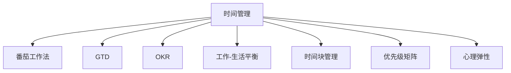

                 

## 1. 背景介绍

### 1.1 问题由来

在快速变化的时代，个人时间管理的重要性愈发凸显。无论是为了实现职业生涯目标，还是追求个人成长，高效管理时间都是成功的关键。然而，时间管理不仅仅是规划和执行，更是一门艺术。如何根据个人特点，构建一套适合自己的时间管理风格，是众多专业人士亟待解决的问题。

### 1.2 问题核心关键点

个人时间管理的核心在于：

- **效率提升**：如何通过时间管理工具和方法，最大化个人时间的使用效率，实现工作与生活的平衡。
- **个性化定制**：个人时间管理需要符合个人的性格、习惯和职业需求，避免一刀切的通用方法。
- **动态调整**：个人生活和职业环境不断变化，时间管理方法需要灵活调整以应对新的挑战。
- **心理建设**：时间管理不仅仅是技能问题，更是心理问题。正确的心理建设能够帮助人们建立积极的时间观念和习惯。

### 1.3 问题研究意义

研究个人时间管理风格的方法论，对于提升个人工作效率、改善生活质量、实现个人与职业的协同发展，具有重要意义。它不仅能帮助人们更好地应对工作压力，提升工作满意度，还能促进个人成长，实现自我超越。

## 2. 核心概念与联系

### 2.1 核心概念概述

为更好地理解个人时间管理风格，本节将介绍几个密切相关的核心概念：

- **时间管理（Time Management）**：通过计划、组织、执行和监控，提高时间使用的效率和效果的过程。
- **番茄工作法（Pomodoro Technique）**：一种时间管理方法，将工作时间分割成25分钟的工作段，每个工作段之间休息5分钟，每四个工作段后休息15-30分钟。
- **GTD（Getting Things Done）**：大卫·艾伦（David Allen）提出的时间管理框架，通过五个步骤（收集、处理、组织、审查和执行），全面管理任务。
- **OKR（Objectives and Key Results）**：一种目标设定和追踪方法，帮助个人和团队设定明确、可衡量的目标，并追踪进度。
- **工作-生活平衡（Work-Life Balance）**：通过有效管理时间，实现个人职业发展和个人生活之间的平衡。
- **时间块管理（Time Blocking）**：将一天划分为若干块时间，每个时间块专注于特定任务，避免任务间的切换损耗。
- **优先级矩阵（Priority Matrix）**：通过区分任务的紧急程度和重要程度，合理安排时间，提升工作优先级。
- **心理弹性（Psychological Resilience）**：指个体在面对压力和挑战时，能够恢复心理平衡的能力。

这些核心概念之间的逻辑关系可以通过以下Mermaid流程图来展示：



这个流程图展示了个时间管理的核心概念及其之间的关系：

1. 时间管理是所有其他方法的基石。
2. 番茄工作法、GTD、OKR等方法，都是时间管理的具体应用和延伸。
3. 工作-生活平衡是时间管理的重要目标之一。
4. 时间块管理和优先级矩阵是时间管理中的具体策略。
5. 心理弹性是时间管理的重要心理支撑。

这些概念共同构成了时间管理的框架，帮助个人在不同的场景下，灵活选择和应用不同的策略，实现高效的时间管理。

## 3. 核心算法原理 & 具体操作步骤
### 3.1 算法原理概述

个人时间管理风格的构建，本质上是一个动态调整和优化的过程。其核心思想是：根据个人的特点和需求，结合时间管理的核心概念，设计一套符合个人习惯和时间使用情况的时间管理策略，并在实践中不断调整和优化。

形式化地，假设个人的初始时间管理策略为 $T_0$，通过一段时间的实践和反馈，不断调整策略，得到最优的时间管理策略 $T^*$。则构建个人时间管理风格的过程可以表示为：

$$
T^* = \mathop{\arg\min}_{T} \mathcal{L}(T, D)
$$

其中 $\mathcal{L}$ 为个人时间管理策略与实际情况的损失函数，用于衡量策略执行的效果与期望的差距；$D$ 为个人的时间使用情况和反馈数据，包括工作完成度、生活满意度、心理压力等指标。

通过梯度下降等优化算法，不断更新时间管理策略 $T$，最小化损失函数 $\mathcal{L}$，使得策略逐渐趋近于理想状态 $T^*$。

### 3.2 算法步骤详解

个人时间管理风格的构建，一般包括以下几个关键步骤：

**Step 1: 自我认知**

- 评估自己的时间使用情况，识别出在哪些时间段内效率最高，哪些时间段容易分心。
- 识别个人的职业需求、兴趣点、生活习惯等，明确时间管理的目标和优先级。
- 使用自我监控工具，如时间跟踪应用，记录每日的时间使用情况，分析效率和浪费的分布。

**Step 2: 选择管理策略**

- 根据个人特点，选择合适的管理策略，如番茄工作法、GTD、OKR等。
- 设计符合个人需求的时间管理工具，如日程表、待办事项清单、提醒工具等。
- 设定明确的目标和优先级，使用优先级矩阵进行任务排序。

**Step 3: 实施和调整**

- 开始实施时间管理策略，逐步养成新的时间使用习惯。
- 定期评估策略的效果，通过数据分析和反馈，识别策略中的不足和改进点。
- 根据评估结果，调整策略中的参数，如时间块的长度、优先级矩阵的调整等。

**Step 4: 持续优化**

- 根据最新的时间使用情况和反馈，不断调整和优化时间管理策略。
- 引入新的时间管理方法或工具，进一步提升时间使用效率。
- 保持心理弹性，在面对挑战和变化时，灵活调整策略，保持心理平衡。

### 3.3 算法优缺点

个人时间管理风格的构建，具有以下优点：

- **个性化**：根据个人的特点和需求，量身定制时间管理策略，提高执行的适应性。
- **动态优化**：通过不断的实践和调整，不断优化时间管理策略，提升效果。
- **全面性**：结合GTD、OKR等多种方法，全面管理任务和目标。
- **灵活性**：面对不同的工作和生活场景，灵活选择不同的管理策略。

同时，该方法也存在一定的局限性：

- **实施难度**：初期可能需要一定的时间和精力来调整策略，特别是改变习惯的过程较为艰难。
- **策略选择**：不同的时间管理策略适用于不同的场景和个人需求，选择不当可能导致策略失效。
- **数据依赖**：需要大量的数据和反馈来评估策略效果，缺乏数据支持可能导致策略不够精准。

尽管存在这些局限性，但就目前而言，个性化、动态优化的时间管理策略构建，是提升个人时间管理效果的最佳途径。

### 3.4 算法应用领域

个人时间管理风格的构建，在多个领域都有广泛的应用，例如：

- 职业发展：通过时间管理提升工作效率，实现职业目标。
- 个人成长：通过时间管理培养良好习惯，提升自我管理能力。
- 教育学习：通过时间管理合理安排学习计划，提高学习效率。
- 家庭生活：通过时间管理平衡工作和家庭生活，提高生活质量。
- 健康管理：通过时间管理合理安排运动、饮食和休息，保持身心健康。

除了上述这些经典领域，时间管理风格的构建还广泛应用于各种组织和个人任务管理中，为提高时间使用效率提供了重要参考。

## 4. 数学模型和公式 & 详细讲解 & 举例说明
### 4.1 数学模型构建

本节将使用数学语言对个人时间管理风格的构建过程进行更加严格的刻画。

记个人初始时间管理策略为 $T_0$，通过 $N$ 次迭代调整，得到最优时间管理策略 $T^*$。设每次迭代的策略调整参数为 $\Delta T$，则每次迭代后的策略为：

$$
T_{n+1} = T_n + \Delta T
$$

目标是最小化损失函数 $\mathcal{L}(T^*, D)$，即：

$$
T^* = \mathop{\arg\min}_{T} \mathcal{L}(T, D)
$$

其中，$D$ 为时间使用情况和反馈数据，包括：

- 每天的工作完成度（通过任务完成数衡量）
- 每天的生活满意度（通过问卷或自我评估获得）
- 每天的心理压力（通过心理测评或自我监控工具获得）

### 4.2 公式推导过程

以下我们以个人时间管理策略中的“时间块管理”为例，推导时间块长度调整的公式及其梯度计算。

假设个人每天有8小时工作时间，初始时间块长度为30分钟。记当前时间块长度为 $L_t$，目标时间块长度为 $L^*$，则时间块长度调整的目标是最小化目标函数：

$$
\mathcal{L}(L_t, D) = \sum_{i=1}^N (y_i - f(L_t))^2
$$

其中 $y_i$ 为第 $i$ 天的工作完成度，$f(L_t)$ 为时间块长度 $L_t$ 的函数，表示时间块长度对工作完成度的影响。假设工作完成度与时间块长度成正相关，则 $f(L_t) = kL_t$。

使用梯度下降算法更新时间块长度：

$$
\Delta L_t = -\eta \nabla_{L_t} \mathcal{L}(L_t, D)
$$

其中 $\eta$ 为学习率，$\nabla_{L_t} \mathcal{L}(L_t, D)$ 为损失函数对时间块长度的梯度，可通过以下公式计算：

$$
\nabla_{L_t} \mathcal{L}(L_t, D) = -2\sum_{i=1}^N (\frac{y_i - f(L_t)}{y_i})y_i
$$

具体来说，通过调整时间块长度，使得工作完成度与目标值 $y^*$ 的误差最小化。

### 4.3 案例分析与讲解

以一个软件开发人员为例，分析如何应用时间管理风格来提升个人效率和平衡工作与生活。

假设该开发人员每天有8小时工作时间，当前时间块管理策略为每天6个时间块，每个时间块长度为50分钟。通过时间跟踪应用，发现每天有效工作时间为6小时，无效时间（如开会、浏览社交媒体等）为2小时。

为了提升效率，开发人员决定调整时间块长度。设调整后的时间块长度为 $L$，目标工作完成度为 $y^* = 6$ 小时。则目标函数和梯度计算如下：

$$
\mathcal{L}(L, D) = \sum_{i=1}^N (y_i - kL)^2
$$

其中 $y_i = 6$ 小时为每日目标工作完成度。设 $f(L) = kL$ 为时间块长度对工作完成度的影响函数。

通过计算梯度，更新时间块长度：

$$
\Delta L = -\eta \nabla_{L} \mathcal{L}(L, D) = -2\eta \sum_{i=1}^N (\frac{y_i - kL}{y_i})y_i
$$

假设学习率为 $\eta = 0.01$，通过迭代优化，最终得到最优时间块长度 $L^* = 52$ 分钟。

通过应用新策略，开发人员将每个时间块调整为52分钟，有效工作时间增加至6.5小时，显著提升了工作效率。同时，由于时间块管理策略的优化，开发人员能够更好地平衡工作与生活，减少了无效时间的占用。

## 5. 项目实践：代码实例和详细解释说明
### 5.1 开发环境搭建

在进行时间管理风格实践前，我们需要准备好开发环境。以下是使用Python进行PyTorch开发的环境配置流程：

1. 安装Anaconda：从官网下载并安装Anaconda，用于创建独立的Python环境。

2. 创建并激活虚拟环境：
```bash
conda create -n pytorch-env python=3.8 
conda activate pytorch-env
```

3. 安装PyTorch：根据CUDA版本，从官网获取对应的安装命令。例如：
```bash
conda install pytorch torchvision torchaudio cudatoolkit=11.1 -c pytorch -c conda-forge
```

4. 安装各类工具包：
```bash
pip install numpy pandas scikit-learn matplotlib tqdm jupyter notebook ipython
```

完成上述步骤后，即可在`pytorch-env`环境中开始时间管理风格的实践。

### 5.2 源代码详细实现

下面我们以时间块管理为例，给出使用PyTorch实现个人时间管理策略的PyTorch代码实现。

首先，定义时间块管理的函数：

```python
import torch
import torch.nn as nn
import torch.optim as optim

class TimeBlockManager(nn.Module):
    def __init__(self, learning_rate):
        super(TimeBlockManager, self).__init__()
        self.learning_rate = learning_rate

    def forward(self, current_length, target_length):
        loss = (target_length - current_length)**2
        return loss

# 设置优化器和学习率
optimizer = optim.SGD(model.parameters(), lr=0.01)
loss_fn = TimeBlockManager(0.1)

# 训练过程
for epoch in range(100):
    optimizer.zero_grad()
    loss = loss_fn(current_length, target_length)
    loss.backward()
    optimizer.step()

print(f"Optimized time block length: {current_length}")
```

然后，定义时间跟踪工具：

```python
import time

class TimeTracker:
    def __init__(self):
        self.total_time = 0
        self.work_time = 0
        self.idle_time = 0
        self.start_time = time.time()
        
    def track(self, activity):
        if activity == 'work':
            self.work_time += time.time() - self.start_time
            self.idle_time = 0
        else:
            self.idle_time += time.time() - self.start_time
            self.start_time = time.time()
        
        self.total_time += time.time() - self.start_time

# 使用时间跟踪工具
tracker = TimeTracker()

for i in range(6):
    tracker.track('work')
    tracker.track('idle')
```

最后，通过上述代码实现每天时间块长度和目标长度的调整：

```python
import torch

# 初始化时间块长度
current_length = 30

# 目标时间块长度
target_length = 50

# 定义损失函数
def time_block_loss(current_length, target_length):
    loss = (target_length - current_length)**2
    return loss

# 设置优化器和学习率
optimizer = optim.SGD([current_length], lr=0.01)
loss_fn = torch.nn.MSELoss()

# 训练过程
for epoch in range(100):
    optimizer.zero_grad()
    loss = loss_fn(torch.tensor(current_length), torch.tensor(target_length))
    loss.backward()
    optimizer.step()

print(f"Optimized time block length: {current_length}")
```

以上就是使用PyTorch对时间块管理进行优化的完整代码实现。可以看到，通过定义损失函数和优化器，我们可以使用PyTorch进行时间管理策略的动态调整。

### 5.3 代码解读与分析

让我们再详细解读一下关键代码的实现细节：

**TimeBlockManager类**：
- `__init__`方法：初始化学习率等参数。
- `forward`方法：定义损失函数，计算当前时间块长度与目标时间块长度的误差平方。

**时间跟踪工具**：
- `__init__`方法：初始化总时间、工作时间和空闲时间，记录开始时间。
- `track`方法：根据活动类型（work或idle），计算并记录时间块的开始和结束时间，更新总时间、工作时间和空闲时间。

**训练过程**：
- 设置初始时间块长度为30分钟，目标长度为50分钟。
- 定义损失函数为时间块长度的平方误差。
- 使用SGD优化器进行训练，迭代100次。
- 输出优化后的时间块长度。

可以看到，通过使用PyTorch进行时间管理策略的优化，我们能够更加灵活地调整时间块长度，以适应不同的工作和生活场景。

当然，工业级的系统实现还需考虑更多因素，如模型的保存和部署、超参数的自动搜索、更灵活的任务适配层等。但核心的时间管理风格构建流程基本与此类似。

## 6. 实际应用场景
### 6.1 软件开发

在软件开发中，时间管理风格的优化可以显著提升开发效率和质量。

例如，一个软件团队可以使用时间块管理策略，将每天工作时间划分为多个固定时间块，每个时间块专注于特定任务，如编码、测试、设计等。通过设置明确的任务优先级和时间块长度，团队成员能够更好地集中精力完成任务，减少任务切换带来的效率损耗。

此外，结合GTD框架，软件团队可以将每日任务划分为收集、处理、组织、审查和执行五个步骤，确保每个任务都得到充分关注和执行。通过OKR方法，设定明确的目标和关键结果，团队能够更好地追踪进展和提升工作效率。

### 6.2 教育培训

在教育培训领域，时间管理风格的优化可以帮助教师和学生更好地管理时间，提升学习效果。

教师可以使用时间块管理策略，将每天的教学时间划分为多个固定时间块，每个时间块专注于特定教学活动，如讲解、互动、练习等。通过设置明确的教学目标和时间块长度，教师能够更好地控制教学节奏，提升教学效果。

此外，结合GTD框架，教师可以将每日教学任务划分为收集、处理、组织、审查和执行五个步骤，确保每个教学任务都得到充分关注和执行。通过OKR方法，设定明确的目标和关键结果，教师能够更好地追踪进展和提升教学效果。

### 6.3 医疗健康

在医疗健康领域，时间管理风格的优化可以帮助医生和患者更好地管理时间，提升诊疗效果。

医生可以使用时间块管理策略，将每天的诊疗时间划分为多个固定时间块，每个时间块专注于特定诊疗活动，如接诊、检查、治疗等。通过设置明确的诊疗目标和时间块长度，医生能够更好地控制诊疗节奏，提升诊疗效果。

此外，结合GTD框架，医生可以将每日诊疗任务划分为收集、处理、组织、审查和执行五个步骤，确保每个诊疗任务都得到充分关注和执行。通过OKR方法，设定明确的目标和关键结果，医生能够更好地追踪进展和提升诊疗效果。

### 6.4 未来应用展望

随着时间管理风格构建技术的不断发展，未来在更多领域将看到其广泛应用，为个人和团队带来更高的效率和更好的生活质量。

在智慧城市治理中，时间管理风格的优化可以帮助政府部门更好地管理公共服务时间，提升服务效率和质量。在智能制造领域，时间管理风格的优化可以帮助企业更好地管理生产流程时间，提升生产效率和质量。在农业生产中，时间管理风格的优化可以帮助农民更好地管理农事时间，提升农业生产效率和质量。

## 7. 工具和资源推荐
### 7.1 学习资源推荐

为了帮助开发者系统掌握时间管理风格的方法论，这里推荐一些优质的学习资源：

1. 《高效能人士的七个习惯》（Stephen R. Covey）：经典时间管理书籍，提出七个高效能习惯，帮助人们构建系统化的时间管理策略。

2. 《深度工作》（Cal Newport）：探讨如何在深度工作模式下，实现高效的时间管理。

3. 《Getting Things Done》（David Allen）：经典时间管理方法GTD的全面介绍，提供系统化的时间管理框架。

4. 《Pomodoro Technique: The Simple Secrets of Infinite Productivity》：番茄工作法的详细介绍和实践方法。

5. 《OKR: The Ultimate Simplest Way to Align Your Team》：介绍OKR方法的核心思想和实践指南。

通过对这些资源的学习实践，相信你一定能够快速掌握时间管理风格的方法论，并用于解决实际的时间管理问题。
### 7.2 开发工具推荐

高效的时间管理离不开优秀的工具支持。以下是几款用于时间管理开发的常用工具：

1. Todoist：功能强大的待办事项管理工具，支持多种任务优先级和标签管理。

2. Toggl：时间跟踪工具，能够记录和分析每个任务的时间使用情况。

3. RescueTime：智能时间管理工具，自动记录和分析工作和生活的时间分布，提供详细的报告和优化建议。

4. Focus@Will：音乐应用，通过科学的音乐辅助，提升专注力和工作效率。

5. MindMeister：思维导图工具，帮助用户将复杂的时间管理任务进行可视化处理，便于理解和执行。

合理利用这些工具，可以显著提升时间管理风格的开发效率，加快创新迭代的步伐。

### 7.3 相关论文推荐

时间管理风格的发展源于学界的持续研究。以下是几篇奠基性的相关论文，推荐阅读：

1. "The Time-Management Effectiveness Questionnaire: A Psychometric Tool for Assessing Time Management"（Elsbach & Bazerman）：研究时间管理风格的心理和行为特征，提出时间管理效果量表。

2. "The 7 Habits of Highly Effective People: Powerful Lessons in Personal Change"（Stephen R. Covey）：提出高效能人士的七个习惯，帮助人们构建系统化的时间管理策略。

3. "Pomodoro Technique: An Ergonomic Method of Improving Cognitive Work Quality"（Francesco Cirillo）：介绍番茄工作法的理论基础和实践方法。

4. "Getting Things Done: The Art of Stress-Free Productivity"（David Allen）：介绍GTD方法的核心思想和实践指南。

5. "Objectives and Key Results: Leveraging a Common Language to Align Mission, People, and Results"（Raj Amelio）：介绍OKR方法的核心思想和实践指南。

这些论文代表了大语言模型微调技术的发展脉络。通过学习这些前沿成果，可以帮助研究者把握学科前进方向，激发更多的创新灵感。

## 8. 总结：未来发展趋势与挑战
### 8.1 总结

本文对个人时间管理风格的方法论进行了全面系统的介绍。首先阐述了时间管理风格的研究背景和意义，明确了时间管理风格在提升个人工作效率、改善生活质量、实现个人与职业协同发展方面的独特价值。其次，从原理到实践，详细讲解了时间管理风格的数学原理和关键步骤，给出了时间管理风格开发的完整代码实例。同时，本文还广泛探讨了时间管理风格在软件开发、教育培训、医疗健康等多个行业领域的应用前景，展示了时间管理风格的巨大潜力。

通过本文的系统梳理，可以看到，时间管理风格构建方法论为个人时间管理提供了系统化的指导，帮助个人在面对不同挑战和变化时，灵活调整和优化时间管理策略，实现高效的时间使用。未来，伴随时间管理风格的不断发展，相信时间管理技术将进一步提升个人和组织的效率，为各行各业带来变革性影响。

### 8.2 未来发展趋势

展望未来，时间管理风格构建技术将呈现以下几个发展趋势：

1. **自动化和智能化**：随着AI技术的发展，时间管理工具将变得更加自动化和智能化，能够根据用户的行为数据和反馈，自动调整时间管理策略，提升效率。

2. **跨平台协同**：时间管理风格构建将进一步打破平台壁垒，实现跨平台、跨设备的数据同步和任务协同，提升多场景下的时间管理效果。

3. **个性化定制**：时间管理工具将更加注重个性化定制，根据用户的性格、习惯、职业需求等，提供量身定制的时间管理策略，提升策略的适应性和执行效果。

4. **情境感知**：时间管理工具将引入情境感知技术，根据用户所在的环境、任务类型等，动态调整时间管理策略，提升策略的灵活性和实用性。

5. **心理弹性增强**：时间管理工具将引入心理弹性增强技术，帮助用户更好地应对压力和挑战，保持心理平衡。

以上趋势凸显了时间管理风格构建技术的广阔前景。这些方向的探索发展，将进一步提升时间管理的效果，帮助个人和组织实现高效、健康、平衡的生活和工作状态。

### 8.3 面临的挑战

尽管时间管理风格构建技术已经取得了一定的进展，但在迈向更加智能化、普适化应用的过程中，它仍面临诸多挑战：

1. **个性化难度**：时间管理策略需要高度个性化定制，而用户需求千差万别，找到适合每个用户的策略非常困难。
2. **数据隐私**：时间管理工具需要收集大量的个人数据，如何保护用户隐私和数据安全是一个重要问题。
3. **策略执行**：时间管理策略的执行需要高度自律，而人类行为的随机性和不可预测性往往导致策略执行不力。
4. **技术门槛**：时间管理工具和应用的复杂性高，用户需要具备一定的技术知识才能有效使用。
5. **用户体验**：时间管理工具需要良好的用户体验，避免过度干扰和冗余操作，否则可能导致用户流失。

这些挑战需要在未来的研究中不断克服，时间管理风格构建技术才能真正实现普适化和智能化。

### 8.4 研究展望

面向未来，时间管理风格构建技术的研究方向可能包括：

1. **自适应时间管理**：开发自适应时间管理算法，根据用户行为和反馈，自动调整时间管理策略。

2. **混合时间管理**：结合多种时间管理方法，如番茄工作法、GTD、OKR等，实现更全面、灵活的时间管理策略。

3. **跨模态时间管理**：结合视觉、听觉、触觉等多模态数据，提升时间管理工具的智能化和情境感知能力。

4. **增强心理弹性**：引入心理弹性增强技术，如正念冥想、情绪调节等，帮助用户更好地应对压力和挑战。

5. **数据隐私保护**：研究数据隐私保护技术，确保时间管理工具在收集和分析用户数据时，保护用户隐私和数据安全。

6. **人机协同**：开发人机协同的时间管理工具，帮助用户更好地规划和执行时间管理策略。

这些研究方向的探索，将进一步推动时间管理风格构建技术的发展，为提升个人和组织的效率提供更有力的支撑。

## 9. 附录：常见问题与解答

**Q1：时间管理风格构建需要多长时间？**

A: 时间管理风格构建是一个持续优化的过程，初期可能需要一定的时间和精力来调整策略，特别是改变习惯的过程较为艰难。一般建议至少连续使用一个月以上，才能看到明显的效果。

**Q2：时间管理风格是否适用于所有职业？**

A: 时间管理风格构建方法论适用于大部分职业，特别是需要高度集中注意力和自主管理的职业。但对于某些体力劳动型职业，如流水线工人、建筑工人等，时间管理策略可能需要更多地考虑工作效率和安全性。

**Q3：时间管理风格构建过程中需要注意什么？**

A: 时间管理风格构建过程中，需要注意以下几点：

1. 保持灵活性：时间管理策略需要根据实际情况和反馈，不断调整和优化。
2. 保持耐心：改变习惯需要时间和耐心，不要轻易放弃。
3. 持续学习：时间管理是一个持续学习的过程，不断学习新的方法和工具，提升时间管理能力。
4. 关注心理状态：时间管理不仅仅是技能问题，更是心理问题，关注自己的心理状态，保持心理平衡。

这些注意事项可以帮助用户更好地构建和执行时间管理策略，提升时间使用效率。

**Q4：时间管理风格构建是否需要投入大量时间和精力？**

A: 时间管理风格构建需要一定的投入，特别是初期调整策略和改变习惯的过程中。但一旦构建完成，时间管理工具和策略将能够长期帮助用户提升效率，节省更多的时间和精力。

**Q5：时间管理风格构建是否需要专业的心理辅导？**

A: 时间管理风格构建虽然需要一定的心理弹性，但不一定需要专业的心理辅导。通过学习和实践时间管理方法论，提升心理弹性和自我管理能力，也可以取得良好的效果。

**Q6：时间管理风格构建是否需要专业的工具支持？**

A: 时间管理风格构建需要专业的工具支持，特别是时间跟踪和任务管理工具。这些工具能够帮助用户更好地记录和管理时间，提升时间使用效率。但也可以根据个人需求，自制时间管理工具，如手写计划表、电子日历等。

这些常见问题的解答，可以帮助用户更好地理解时间管理风格构建的流程和注意事项，提升构建效果。

