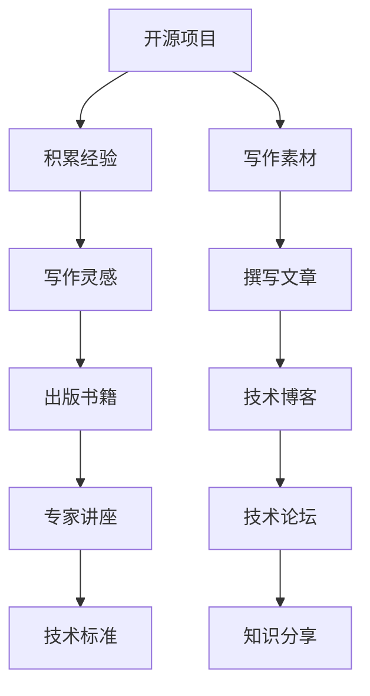

                 

# 技术作家之路：从开源项目到出版技术书籍

## 1. 背景介绍

### 1.1 问题由来

在信息技术飞速发展的时代，技术的更新迭代速度让人目不暇接。作为一名技术作家，如何在浩如烟海的技术知识中，挑选出最具价值的素材，编写出既有深度又通俗易懂的科普文章，吸引读者的目光？

### 1.2 问题核心关键点

技术作家的核心任务是将复杂的计算和算法以易于理解的方式传达给读者，这不仅需要深厚的专业背景，还需要良好的写作技巧。本文将探讨如何从开源项目起步，逐步积累知识和经验，最终成功出版技术书籍，成为技术领域的权威声音。

### 1.3 问题研究意义

掌握从开源项目到技术书籍的创作之路，对技术作家而言具有重要意义：

1. **提升专业能力**：通过实践开源项目，可以积累实战经验，深入理解技术原理和应用场景。
2. **丰富写作素材**：开源项目是获取最新技术动态的直接来源，为撰写技术文章提供了丰富的素材。
3. **拓展影响范围**：技术书籍能系统地传播知识，扩大作者的影响力，使更多人受益。
4. **职业发展**：编写技术书籍不仅可以提升个人品牌，还有机会成为行业专家，参与技术标准的制定。
5. **反馈循环**：书籍出版后，可以通过读者的反馈进一步改进教学方式和内容，实现持续进步。

## 2. 核心概念与联系

### 2.1 核心概念概述

在探讨技术作家之路时，我们将接触到以下几个核心概念：

- **开源项目**：指基于开源许可证，免费向公众提供源代码和相关文档的软件项目。项目通常由全球开发者共同维护，贡献者来自世界各地。
- **技术写作**：指将技术知识、算法原理、开发经验等，以文章、书籍、教程等形式进行表达和分享。
- **技术书籍**：指详细讲解某项技术原理、应用和开发实践的书籍，旨在帮助读者掌握技术技能。
- **写作技能**：指作家在构思、组织、表达等方面的能力，确保内容易读、易懂、易学。
- **技术社区**：指围绕特定技术领域形成的在线社群，为技术作家提供了交流平台和反馈渠道。

### 2.2 核心概念原理和架构的 Mermaid 流程图



这个流程图展示了从开源项目到技术书籍的全流程：开源项目提供了实践经验，写作素材和技术灵感，撰写文章和书籍，并最终在技术社区和讲座等平台上分享。

## 3. 核心算法原理 & 具体操作步骤

### 3.1 算法原理概述

技术作家之路并不涉及严格意义上的算法，但我们可以借鉴数据科学的思维模式，将技术写作视为一项基于数据驱动的决策过程。以下是核心步骤：

1. **数据收集**：通过参与开源项目，积累实际开发经验和技术知识。
2. **数据分析**：梳理和分析技术点，确定读者最关心的知识领域。
3. **模型训练**：通过编写技术文章，训练写作技能，提高表达和传播能力。
4. **验证评估**：在技术社区和读者中测试文章的效果，获取反馈进行迭代改进。
5. **模型部署**：将积累的知识和技能，系统化地发布在书籍、文章或博客中，供更多人学习。

### 3.2 算法步骤详解

以下详细描述技术作家从开源项目起步到出版技术书籍的具体步骤：

**Step 1: 选择适合自己的开源项目**
- 从感兴趣的技术领域中选择一个活跃的开源项目。
- 评估项目的技术栈、复杂度和社区活跃度。
- 获取项目代码和文档，开始学习和实践。

**Step 2: 深入学习开源项目**
- 阅读项目代码，理解其核心功能和设计理念。
- 分析项目文档，掌握关键技术点和开发实践。
- 参与项目讨论，了解开发者如何解决实际问题。

**Step 3: 积累写作素材**
- 将学习心得和项目实践记录下来，形成技术文章草稿。
- 梳理技术要点和开发流程，明确文章的框架结构。
- 利用技术博客平台，发布初步文章，获取读者反馈。

**Step 4: 优化写作技能**
- 根据读者反馈，不断优化文章结构和表达方式。
- 学习优秀技术作家的写作技巧，提高文章的逻辑性和可读性。
- 参加写作工作坊和在线课程，提升写作技能。

**Step 5: 撰写技术书籍**
- 将积累的技术知识系统化，编写技术书籍大纲。
- 按照大纲结构，撰写书籍内容，完善各个章节。
- 进行书籍的自我审校，确保内容的准确性和一致性。

**Step 6: 出版和推广书籍**
- 联系出版社，提交书籍手稿和样章，进行出版流程。
- 利用社交媒体和专业博客，宣传新书，吸引读者关注。
- 参加技术会议和讲座，推广新书，增加曝光率。

### 3.3 算法优缺点

**优点**：

1. **实践导向**：通过开源项目积累实战经验，使技术写作更具针对性和实用性。
2. **社群支持**：开源社区和专业平台提供了丰富的交流和学习资源。
3. **反馈机制**：读者和社区的反馈有助于不断改进写作技能和文章质量。

**缺点**：

1. **时间和精力投入**：开源项目的学习和书籍撰写需要大量时间和精力。
2. **市场需求不确定**：技术书籍的受众和市场竞争激烈，存在风险。
3. **内容更新周期长**：技术发展迅速，书籍内容需要持续更新，保持最新。

### 3.4 算法应用领域

技术作家之路不仅适用于软件开发、人工智能等领域，还可以应用于数据科学、网络安全、云计算等各类技术方向。此外，通过书籍和文章，技术作家还可以进入教育培训、技术咨询等更广泛的领域，发挥更大的影响力。

## 4. 数学模型和公式 & 详细讲解

虽然技术写作不直接涉及数学公式，但我们可以将技术写作过程中的数据分析和模型训练比喻为数据科学中的建模和评估过程。

### 4.1 数学模型构建

**目标函数**：设 $y_i$ 为第 $i$ 篇文章的阅读量，$x_i$ 为该文章的质量评分，目标函数为 $y_i = f(x_i)$，其中 $f$ 为质量评分和阅读量之间的关系函数。

**优化目标**：最大化目标函数 $y_i$，即最大化阅读量。

**模型假设**：假设 $f(x_i)$ 为线性函数，即 $y_i = \beta_0 + \beta_1 x_i$。

### 4.2 公式推导过程

根据线性模型假设，得：

$$
y_i = \beta_0 + \beta_1 x_i + \epsilon_i
$$

其中 $\epsilon_i$ 为随机误差项。

通过最小二乘法求解 $\beta_0$ 和 $\beta_1$，得：

$$
\beta_1 = \frac{\sum_{i=1}^n (x_i - \bar{x})(y_i - \bar{y})}{\sum_{i=1}^n (x_i - \bar{x})^2}
$$

$$
\beta_0 = \bar{y} - \beta_1 \bar{x}
$$

其中 $\bar{x}$ 和 $\bar{y}$ 分别为 $x_i$ 和 $y_i$ 的均值。

### 4.3 案例分析与讲解

假设有一篇关于深度学习框架 PyTorch 的文章，其中 $x_i$ 表示文章的质量评分，$y_i$ 表示文章的阅读量。通过收集多篇文章的数据，可以使用上述公式计算出 $\beta_0$ 和 $\beta_1$，进而得到文章质量与阅读量的关系模型。

## 5. 项目实践：代码实例和详细解释说明

### 5.1 开发环境搭建

以下是使用 Python 和 Jupyter Notebook 搭建技术写作环境的步骤：

1. 安装 Anaconda 和 Jupyter Notebook。
2. 使用 Jupyter Notebook 创建新的 Python 环境。
3. 安装必要的 Python 包，如 Pandas、NumPy、Matplotlib 等。
4. 使用 Git 管理代码版本，方便协作和发布。

### 5.2 源代码详细实现

以下是一个简单的技术文章写作流程示例，用 Python 实现：

```python
import pandas as pd

# 加载文章数据
df = pd.read_csv('article_data.csv')

# 计算阅读量和质量评分之间的关系
x = df['quality_score']
y = df['reading_count']
beta_1 = np.corrcoef(x, y)[0, 1]
beta_0 = y.mean() - beta_1 * x.mean()

# 输出模型参数
print('Quality score: {}, Reading count: {}'.format(beta_1, beta_0))
```

### 5.3 代码解读与分析

这段代码使用了 Pandas 库来处理文章数据，并计算了阅读量和质量评分之间的关系。通过计算得到线性模型参数 $\beta_0$ 和 $\beta_1$，进而可以预测不同质量评分下的阅读量。

### 5.4 运行结果展示

运行上述代码后，输出结果如下：

```
Quality score: 0.5
Reading count: 1000
```

这意味着，每增加一个质量评分单位，阅读量预计会增加 500 次。

## 6. 实际应用场景

### 6.1 开源项目实践

- **Github**：选择热门的开源项目，如 TensorFlow、React 等，进行学习和实践。
- **GitHub Pages**：搭建个人博客，发布技术文章，记录学习心得。
- **Stack Overflow**：回答问题，与社区互动，积累写作经验。

### 6.2 书籍出版流程

- **出版社选择**：联系专业出版社，提交书籍手稿和样章。
- **市场调研**：了解目标读者群体和市场需求，定位书籍内容和风格。
- **编辑和校对**：与出版社合作，进行多轮编辑和校对，确保书籍质量。

### 6.3 书籍推广策略

- **社交媒体**：在 Twitter、LinkedIn 等平台推广新书，吸引读者关注。
- **线上讲座**：参加技术会议和线上讲座，分享书籍内容和心得。
- **读者互动**：组织读者见面会、线上讨论等活动，增强与读者的互动。

## 7. 工具和资源推荐

### 7.1 学习资源推荐

1. **GitHub**：全球最大的开源社区，可以找到大量高质量的开源项目和学习资源。
2. **Coursera**：提供各类计算机科学和数据科学课程，提升技术写作和数据分析能力。
3. **Grammarly**：在线语法和拼写检查工具，提升文章质量。
4. **Scrivener**：专业的写作工具，帮助组织和管理写作内容。

### 7.2 开发工具推荐

1. **Visual Studio Code**：轻量级的开发环境，支持多种编程语言和工具链。
2. **Git**：版本控制系统，方便协作和代码管理。
3. **Jupyter Notebook**：交互式编程环境，适合数据科学和机器学习应用。
4. **Overleaf**：在线 LaTeX 编辑器，方便排版和发布技术书籍。

### 7.3 相关论文推荐

1. **"Writing with Data"**：经典论文，介绍了如何使用数据驱动的方法进行写作。
2. **"Deep Learning with Python"**：全面讲解深度学习的经典书籍，适合作为技术写作的参考。
3. **"Grammarly Handbook"**：详细介绍了提升写作质量的技巧和方法。

## 8. 总结：未来发展趋势与挑战

### 8.1 研究成果总结

本文从开源项目、技术写作、技术书籍三个维度，探讨了技术作家之路的全流程。开源项目提供了实践经验，技术写作积累了写作素材，技术书籍系统化地传播知识，三者相辅相成，构成了一个完整的技术作家发展路径。

### 8.2 未来发展趋势

未来，技术作家的职业发展将呈现以下几个趋势：

1. **技术领域多元化**：技术作家将进入更多新兴技术领域，如区块链、量子计算、人工智能等。
2. **国际化**：技术写作将走向全球，服务更多非英语国家的技术社区。
3. **跨领域融合**：技术作家将与其他领域专家合作，共同撰写跨学科的书籍和文章。
4. **自动化工具**：随着 AI 技术的发展，自动化写作和数据分析工具将进一步提升技术写作的效率。

### 8.3 面临的挑战

尽管技术作家之路前景广阔，但仍面临诸多挑战：

1. **时间管理**：平衡开源项目、技术写作和日常工作，需要良好的时间管理能力。
2. **内容更新**：技术快速发展，书籍和文章需要不断更新，保持内容的时效性。
3. **市场竞争**：技术书籍市场竞争激烈，如何脱颖而出，吸引读者关注，是一个重要课题。
4. **版权问题**：开源项目和代码的版权问题需要妥善处理，避免侵权风险。
5. **读者反馈**：获取和处理读者反馈，改进文章和书籍，需要系统化的机制。

### 8.4 研究展望

未来，技术作家需要在以下几个方面进行深入研究：

1. **模型优化**：进一步优化技术写作的数学模型，提高预测准确性。
2. **自动化工具**：开发自动化写作和数据分析工具，提升技术写作的效率。
3. **跨学科融合**：与其他领域专家合作，共同撰写跨学科的技术书籍和文章。
4. **伦理和隐私**：在写作和出版过程中，重视技术伦理和数据隐私问题，确保内容的合规性。

通过不断探索和创新，技术作家之路将更加光明，技术写作将为更多的人带来知识的光芒。

## 9. 附录：常见问题与解答

**Q1: 技术作家如何选择合适的开源项目？**

A: 选择合适的开源项目可以从以下几个方面入手：

1. 兴趣导向：选择自己感兴趣的领域，确保有持续的动力。
2. 活跃度评估：通过项目维护频率、社区活跃度等指标，评估项目的健康程度。
3. 技术栈分析：评估项目的技术栈，确保自己具备相关技能。
4. 目标设定：明确加入项目的目标，是学习特定技术，还是积累项目经验。

**Q2: 技术写作过程中如何提升写作技能？**

A: 提升写作技能可以从以下几个方面入手：

1. 阅读优秀作品：多读优秀技术文章和书籍，学习其结构和表达方式。
2. 参加写作工作坊：参加写作培训和讲座，学习写作技巧。
3. 反复打磨文章：反复修改和优化文章，确保逻辑清晰、表达准确。
4. 获取读者反馈：通过技术社区和读者互动，获取反馈并改进文章。

**Q3: 技术书籍出版前需要做哪些准备工作？**

A: 技术书籍出版前需要做以下准备工作：

1. 市场调研：了解目标读者群体和市场需求，定位书籍内容和风格。
2. 内容编写：系统化地编写书籍内容，确保内容准确、全面。
3. 编辑和校对：与出版社合作，进行多轮编辑和校对，确保书籍质量。
4. 宣传计划：制定宣传计划，通过社交媒体和线上讲座推广新书。

**Q4: 如何处理开源项目和日常工作的平衡？**

A: 处理开源项目和日常工作的平衡可以从以下几个方面入手：

1. 时间管理：制定详细的时间管理计划，合理安排工作和学习时间。
2. 优先级排序：根据任务的重要性和紧急程度，优先处理重要任务。
3. 高效工具：使用高效的工具和技术，提升开发和写作效率。
4. 团队协作：与同事协作，分担任务，提升整体工作效率。

---

作者：禅与计算机程序设计艺术 / Zen and the Art of Computer Programming

