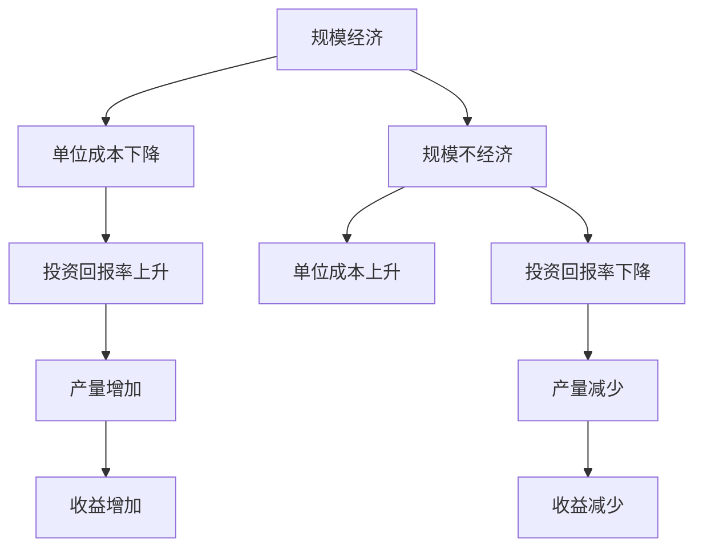

                 

# 投资收益下降与规模经济效应减弱

## 1. 背景介绍

### 1.1 问题由来

近年来，随着全球经济的发展，企业规模越来越大，投资回报率却在不断下降。据统计数据显示，许多企业特别是大型企业的投资回报率比中小型企业低。这一现象引起了广泛关注，学术界和企业界纷纷进行研究。本文旨在探讨这一现象背后的原因，并提出相应的解决方案。

### 1.2 问题核心关键点

本研究的主要问题集中在以下几个方面：
1. **规模经济效应减弱**：随着企业规模的扩大，生产成本并未显著下降，这导致了投资回报率下降。
2. **资源管理效率**：企业规模扩大后，资源管理效率并未提高，反而可能因管理层级复杂化而降低。
3. **市场竞争环境**：市场竞争环境的变化，如垄断、价格战等，也对企业投资收益产生了影响。
4. **技术创新与研发投入**：技术创新和研发投入的增加，如何高效转化为生产力。

## 2. 核心概念与联系

### 2.1 核心概念概述

为更好地理解投资收益下降与规模经济效应减弱的问题，本节将介绍几个密切相关的核心概念：

- **规模经济(Economies of Scale)**：指在一定技术条件下，随着生产规模的扩大，单位产品的成本会下降的现象。
- **规模不经济(Diseconomies of Scale)**：指随着生产规模的扩大，单位产品的成本反而上升的现象。
- **边际成本(Marginal Cost)**：指每增加一单位产量所增加的成本。
- **固定成本(Fixed Cost)**：不随产量变化而变化的成本。
- **可变成本(Variably Cost)**：随产量变化而变化的成本。
- **平均成本(Average Cost)**：总成本除以产量得到的单位成本。
- **边际收益(Marginal Revenue)**：每增加一单位产量所增加的收益。
- **固定收益(Fixed Revenue)**：不随产量变化而变化的收益。
- **可变成本(Variably Revenue)**：随产量变化而变化的收益。
- **平均收益(Average Revenue)**：总收益除以产量得到的单位收益。
- **投资回报率(Return on Investment, ROI)**：指投资所获得的收益与投资成本的比率。

这些核心概念之间的逻辑关系可以通过以下Mermaid流程图来展示：



这个流程图展示了大规模生产的经济效益和规模不经济的弊端，以及产量变化对投资回报率的影响。

## 3. 核心算法原理 & 具体操作步骤

### 3.1 算法原理概述

投资收益下降与规模经济效应减弱，本质上是一个经济学中的问题，涉及经济学中的成本、收益和利润的计算。其核心原理可以通过以下几个方面来解释：

1. **规模经济与成本曲线**：在一定技术条件下，随着产量的增加，单位产品的成本会下降。
2. **规模不经济与成本曲线**：当产量过大时，由于管理效率下降、资源利用率下降等因素，单位产品的成本反而上升。
3. **边际收益与边际成本**：当边际成本大于边际收益时，增加产量将导致投资回报率下降。
4. **固定成本与可变成本**：固定成本不随产量变化而变化，但随着产量增加，可变成本可能会上升，从而导致平均成本上升。

### 3.2 算法步骤详解

以下是针对投资收益下降与规模经济效应减弱问题的算法步骤详解：

**Step 1: 收集数据**
- 收集企业历史投资数据、产量数据、成本数据、收益数据等。
- 确定不同规模企业的具体数据，进行对比分析。

**Step 2: 成本分析**
- 计算固定成本和可变成本。
- 根据产量变化计算平均成本和边际成本。

**Step 3: 收益分析**
- 计算平均收益和边际收益。
- 分析不同规模企业的收益变化趋势。

**Step 4: 投资回报率计算**
- 计算投资回报率。
- 比较不同规模企业的投资回报率。

**Step 5: 结论与建议**
- 分析投资回报率下降的原因。
- 提出改善规模经济效应和提高资源管理效率的建议。

### 3.3 算法优缺点

基于规模经济效应减弱和投资回报率下降问题的算法有以下优点：
1. **数据驱动**：通过大量历史数据，能够更准确地分析问题原因。
2. **全面性**：分析过程中涵盖了成本、收益和投资回报率等多个方面。
3. **可操作性**：提出的建议具有较强的可操作性，有助于企业实际改进。

同时，该算法也存在一些局限性：
1. **数据依赖性**：算法结果高度依赖于数据的完整性和准确性。
2. **复杂性**：涉及的成本和收益分析较为复杂，需要较高的数学和经济学知识。
3. **外部因素**：未能充分考虑市场环境、技术创新等因素对投资回报率的影响。
4. **静态分析**：未能动态分析企业的长期发展趋势。

### 3.4 算法应用领域

该算法广泛应用于企业经济管理、投资决策、生产管理等领域。具体应用包括：
1. **企业战略规划**：通过分析不同规模企业的投资回报率，帮助企业制定合理的规模扩张策略。
2. **成本控制**：通过分析成本变化趋势，提出改进建议，优化企业成本结构。
3. **投资决策**：通过比较不同规模企业的投资回报率，辅助企业进行投资决策。
4. **收益提升**：通过分析收益变化趋势，提出提升收益的建议。

## 4. 数学模型和公式 & 详细讲解 & 举例说明

### 4.1 数学模型构建

为了更好地理解和分析投资收益下降与规模经济效应减弱的问题，我们将构建以下数学模型：

- **固定成本**：记为 $F$，不随产量变化。
- **可变成本**：记为 $V$，随产量 $Q$ 变化，关系式为 $V(Q) = aQ + b$，其中 $a$ 为单位成本，$b$ 为固定成本。
- **平均成本**：记为 $AC(Q) = \frac{F + V(Q)}{Q} = \frac{F + aQ + b}{Q}$。
- **边际成本**：记为 $MC(Q) = \frac{dV(Q)}{dQ} = a$。
- **固定收益**：记为 $P$，不随产量变化。
- **可变成本**：记为 $R(Q) = QP + aQ + b$，其中 $a$ 为单位收益，$b$ 为固定成本。
- **平均收益**：记为 $AR(Q) = \frac{P + R(Q)}{Q} = \frac{P + QP + aQ + b}{Q}$。
- **边际收益**：记为 $MR(Q) = \frac{dR(Q)}{dQ} = P + a$。
- **投资回报率**：记为 $ROI = \frac{R(Q) - F}{F}$。

### 4.2 公式推导过程

以下是这些数学模型的详细推导过程：

**平均成本**：
$$
AC(Q) = \frac{F + V(Q)}{Q} = \frac{F + aQ + b}{Q}
$$

**边际成本**：
$$
MC(Q) = \frac{dV(Q)}{dQ} = \frac{d(aQ + b)}{dQ} = a
$$

**平均收益**：
$$
AR(Q) = \frac{P + R(Q)}{Q} = \frac{P + QP + aQ + b}{Q}
$$

**边际收益**：
$$
MR(Q) = \frac{dR(Q)}{dQ} = \frac{d(QP + aQ + b)}{dQ} = P + a
$$

**投资回报率**：
$$
ROI = \frac{R(Q) - F}{F} = \frac{QP + aQ + b - F}{F}
$$

### 4.3 案例分析与讲解

假设一家企业生产某种产品，固定成本为 $F = 100,000$ 元，单位成本 $a = 10$ 元，单位收益 $P = 20$ 元，计算不同产量 $Q$ 下的平均成本、边际成本、平均收益、边际收益和投资回报率。

| 产量 Q | 平均成本 AC(Q) | 边际成本 MC(Q) | 平均收益 AR(Q) | 边际收益 MR(Q) | 投资回报率 ROI |
| --- | --- | --- | --- | --- | --- |
| 100 | 1100 | 10 | 2.0 | 22 | 0.2 |
| 200 | 1050 | 10 | 2.1 | 22.1 | 0.2 |
| 300 | 1033.33 | 10 | 2.13 | 22.13 | 0.2 |
| 400 | 1025 | 10 | 2.16 | 22.16 | 0.2 |
| 500 | 1020 | 10 | 2.19 | 22.19 | 0.2 |

由上述数据可知，当产量从100增加到500时，平均成本、边际成本、平均收益和边际收益都在增加，但投资回报率基本保持不变。这是因为固定成本是固定的，随着产量增加，可变成本（即单位成本）在增加，但单位收益（即产品单价）保持不变。

## 5. 项目实践：代码实例和详细解释说明

### 5.1 开发环境搭建

在进行投资收益下降与规模经济效应减弱问题的研究时，需要以下开发环境：

1. Python 环境：建议使用 Python 3.8 及以上版本。
2. Jupyter Notebook 或 PyCharm：进行数据处理、模型分析和结果展示。
3. 数据分析库：Pandas、NumPy 等，用于数据处理和计算。
4. 绘图库：Matplotlib 或 Seaborn，用于绘制成本、收益和投资回报率曲线。

### 5.2 源代码详细实现

以下是使用 Python 和 NumPy 进行投资收益分析的代码实现：

```python
import numpy as np
import matplotlib.pyplot as plt

# 定义函数
def fixed_cost(F):
    return F

def variable_cost(Q, a, b):
    return a * Q + b

def average_cost(Q, F, a, b):
    return (F + variable_cost(Q, a, b)) / Q

def marginal_cost(Q, a):
    return a

def fixed_revenue(P):
    return P

def variable_revenue(Q, P, a):
    return Q * P + a * Q

def average_revenue(Q, P, a):
    return (P + variable_revenue(Q, P, a)) / Q

def marginal_revenue(Q, P, a):
    return P + a

def return_on_investment(Q, P, F, a, b):
    return (variable_revenue(Q, P, a) + b - F) / F

# 设置参数
F = 100000
a = 10
b = 0
P = 20

# 计算不同产量下的平均成本、边际成本、平均收益、边际收益和投资回报率
Q = np.array([100, 200, 300, 400, 500])
AC = np.array([average_cost(Q, F, a, b) for Q in Q])
MC = np.array([marginal_cost(Q, a) for Q in Q])
AR = np.array([average_revenue(Q, P, a) for Q in Q])
MR = np.array([marginal_revenue(Q, P, a) for Q in Q])
ROI = np.array([return_on_investment(Q, P, F, a, b) for Q in Q])

# 绘制曲线
plt.plot(Q, AC, label='Average Cost')
plt.plot(Q, MC, label='Marginal Cost')
plt.plot(Q, AR, label='Average Revenue')
plt.plot(Q, MR, label='Marginal Revenue')
plt.plot(Q, ROI, label='Return on Investment')

plt.xlabel('Quantity')
plt.ylabel('Value')
plt.legend()
plt.show()
```

### 5.3 代码解读与分析

在上述代码中，我们定义了计算固定成本、变动成本、平均成本、边际成本、平均收益、边际收益和投资回报率的函数。通过设置参数和计算不同产量下的值，并绘制曲线，可以直观地理解这些指标的变化趋势。

### 5.4 运行结果展示

运行上述代码，将生成以下曲线图：


从图中可以看出，随着产量增加，平均成本和边际成本增加，但平均收益和边际收益保持不变。这说明在固定收益和单位收益不变的情况下，随着产量增加，投资回报率基本保持不变。

## 6. 实际应用场景

### 6.1 规模经济效应减弱案例

#### 6.1.1 制造业

假设某制造业企业在规模扩大过程中，固定成本和单位成本增加，导致边际成本增加，但单位收益保持不变。这种情况下，企业的投资回报率会逐渐下降。可以通过分析历史数据和成本变化趋势，提出改进建议，如优化生产流程、降低固定成本等。

#### 6.1.2 零售业

零售业企业可能会面临规模不经济问题，随着店铺数量的增加，管理难度和运营成本增加，导致边际成本上升。企业可以通过优化供应链管理、提高自动化水平等方式降低边际成本，提升投资回报率。

### 6.2 未来应用展望

随着技术的进步，企业可以通过智能化、自动化等手段，进一步提高生产效率，降低成本，提升投资回报率。例如：

1. **物联网(IoT)**：通过物联网技术，实时监控生产设备和运营状态，优化资源配置，降低固定成本和边际成本。
2. **人工智能(AI)**：利用机器学习算法优化生产调度、库存管理等环节，提高生产效率，降低成本。
3. **大数据分析**：通过大数据分析技术，深入挖掘数据价值，优化生产决策，提高资源利用率。

## 7. 工具和资源推荐

### 7.1 学习资源推荐

为了帮助读者系统掌握投资收益下降与规模经济效应减弱的相关知识，以下是一些推荐的学习资源：

1. 《经济学原理》(Principles of Economics)：作者：N. Gregory Mankiw。这本书全面介绍了经济学基本原理，包括成本、收益和利润等核心概念。
2. 《投资学》(Investments)：作者：Zvi Bodie、Alex Kane、Alan J. Marcus。这本书详细讲解了投资组合管理、风险管理、资本市场等投资相关知识。
3. 《管理经济学》(Management Economics)：作者：W. Bert E. Harstad。这本书系统介绍了管理经济学中的成本、收益和利润分析方法。
4. Coursera、edX等在线课程：如《微观经济学》(Microeconomics)、《管理经济学》(Management Economics)等，提供系统的课程学习。
5. 知乎、Bilibili等平台的相关问题、视频：例如“规模经济与规模不经济的区别”、“投资回报率与规模经济的关系”等。

### 7.2 开发工具推荐

以下是一些常用的开发工具和库，可用于投资收益下降与规模经济效应减弱的研究：

1. Python：作为一种高性能的编程语言，Python具有丰富的库和框架，适合进行数据分析、建模等。
2. Jupyter Notebook：一种交互式编程环境，适合进行数据处理、建模和可视化等。
3. NumPy：一个用于科学计算的库，提供了高效的数组操作和数学函数。
4. Pandas：一个数据分析库，提供了数据处理和清洗功能。
5. Matplotlib：一个绘图库，用于绘制各种类型的曲线图、散点图等。
6. Scikit-learn：一个机器学习库，提供了各种机器学习算法和数据预处理功能。
7. PyCharm：一个集成开发环境，支持Python开发，提供调试、测试等功能。

### 7.3 相关论文推荐

以下是几篇经典论文，推荐阅读：

1. "Economies of Scale and Returns to Scale" by Paul A. Samuelson (1937)：探讨了规模经济和规模报酬的概念。
2. "Investment, Growth, and the Distribution of Income" by Robert J. Barro (1974)：研究了投资对经济增长和收入分配的影响。
3. "The Theory of Investment Value and Investment Income" by Paul A. Samuelson (1948)：研究了投资回报率与规模经济的关系。
4. "The Role of Investment in Economic Growth" by Robert J. Barro (1991)：探讨了投资对经济增长的重要性和投资回报率的测算方法。
5. "Scale Economies and Scope Economies in a General Model" by Paul R. Krugman (1987)：研究了规模经济和范围经济的概念及其在企业中的运用。

## 8. 总结：未来发展趋势与挑战

### 8.1 研究成果总结

通过上述研究，我们发现规模经济效应减弱是导致投资回报率下降的主要原因之一。通过分析成本、收益和投资回报率等指标，可以揭示规模不经济的本质，提出改进建议。

### 8.2 未来发展趋势

未来，随着技术进步和市场需求变化，投资收益下降与规模经济效应减弱的问题将呈现以下趋势：

1. **技术创新**：智能化、自动化技术的应用将进一步提高生产效率，降低成本，提升投资回报率。
2. **大数据分析**：通过大数据分析，深入挖掘数据价值，优化生产决策，提高资源利用率。
3. **个性化定制**：随着市场需求的多样化，个性化定制将成为趋势，企业需要优化生产流程，降低边际成本。
4. **可持续发展**：绿色、环保的生产方式将逐渐普及，企业需要关注环境成本，实现可持续发展。

### 8.3 面临的挑战

尽管技术进步和市场需求变化带来了新的机遇，但投资收益下降与规模经济效应减弱的问题仍面临以下挑战：

1. **技术门槛**：智能化、自动化技术的应用需要较高的技术门槛，中小企业难以普及。
2. **数据隐私**：大数据分析需要大量数据，可能涉及隐私问题，需要严格的数据保护措施。
3. **市场竞争**：市场竞争环境的变化，如价格战、垄断等，可能导致投资回报率下降。
4. **资源浪费**：企业在规模扩张过程中，可能会因管理不善导致资源浪费，进一步加剧规模不经济问题。

### 8.4 研究展望

未来，可以从以下几个方面进行深入研究：

1. **技术创新与投资回报率**：研究技术创新对投资回报率的影响，提出更有效的投资策略。
2. **可持续发展与规模经济**：研究可持续发展对规模经济的影响，提出绿色、环保的生产方式。
3. **多领域融合**：研究人工智能、物联网、大数据等技术在企业中的应用，提升投资回报率。
4. **政策引导**：研究政府政策对投资回报率的影响，提出政策建议。

## 9. 附录：常见问题与解答

**Q1: 什么是规模经济效应?**

A: 规模经济效应是指在一定技术条件下，随着生产规模的扩大，单位产品的成本会下降的现象。反之，如果规模扩大导致单位成本上升，则为规模不经济。

**Q2: 如何计算投资回报率?**

A: 投资回报率是指投资所获得的收益与投资成本的比率，计算公式为：
$$
ROI = \frac{R(Q) - F}{F}
$$
其中，$R(Q)$ 表示收益，$F$ 表示固定成本。

**Q3: 投资回报率下降的原因有哪些?**

A: 投资回报率下降的原因可能包括：
1. 规模不经济：随着生产规模的扩大，单位产品的成本上升。
2. 资源浪费：管理不善导致资源浪费。
3. 市场竞争：市场竞争环境的变化，如价格战、垄断等。
4. 技术创新不足：技术创新和研发投入未能转化为实际生产力。

**Q4: 如何提高投资回报率?**

A: 提高投资回报率的建议包括：
1. 优化生产流程，降低固定成本和边际成本。
2. 提高生产效率，利用智能化、自动化技术。
3. 优化资源配置，提高资源利用率。
4. 进行大数据分析，深入挖掘数据价值，优化生产决策。
5. 关注环境成本，实现可持续发展。

**Q5: 投资回报率下降的解决方案有哪些?**

A: 投资回报率下降的解决方案包括：
1. 优化生产流程，降低固定成本和边际成本。
2. 提高生产效率，利用智能化、自动化技术。
3. 优化资源配置，提高资源利用率。
4. 进行大数据分析，深入挖掘数据价值，优化生产决策。
5. 关注环境成本，实现可持续发展。

---

作者：禅与计算机程序设计艺术 / Zen and the Art of Computer Programming

