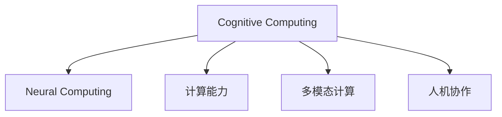

                 

# 拓展认知边界：人类计算的科学探索

## 1. 背景介绍

### 1.1 问题由来

随着人类社会的信息化进程不断加速，计算能力已经成为一个国家科技竞争力的重要指标。然而，人类自身的计算能力仍然面临诸多瓶颈，如注意力的广度和深度有限、记忆力不足、逻辑推理能力有待提升等。这些问题限制了人类在复杂任务和创新性思维方面的表现。如何借助计算机的强大计算能力，拓展人类计算的边界，成为当前科技界的一大挑战。

### 1.2 问题核心关键点

拓展人类计算边界的问题核心在于：

- **计算能力提升**：利用计算机强大的计算能力，扩展人类注意力的广度和深度，增强记忆力和逻辑推理能力。
- **多模态融合**：结合视觉、听觉、触觉等多种感官信息，提高综合处理信息的能力。
- **智能辅助**：通过人工智能技术，为人类提供高效、准确的计算和决策支持。
- **人机协作**：构建人机协作系统，实现任务分配和信息整合，提升整体计算效能。

### 1.3 问题研究意义

拓展人类计算边界的研究，具有以下重要意义：

- **提升认知能力**：通过计算技术增强人类的记忆力和逻辑推理能力，提高认知效率。
- **推动科学发现**：利用计算能力处理海量数据，加速科学研究的进程，突破传统认知限制。
- **改善生活质量**：提升信息处理能力，提高工作和学习效率，改善生活质量。
- **促进技术创新**：推动跨领域技术融合，催生新的应用场景和商业模式。

## 2. 核心概念与联系

### 2.1 核心概念概述

为了更好地理解拓展人类计算边界的问题，本节将介绍几个关键概念：

- **认知计算(Cognitive Computing)**：指通过计算机技术模拟、扩展和增强人类认知能力，实现智能决策和问题解决。
- **神经计算(Neural Computing)**：模拟人类神经系统工作原理，通过神经元网络进行信息处理和模式识别。
- **计算能力(Cognitive Capability)**：包括注意力、记忆、推理、情感等认知功能，通过计算技术进行增强和扩展。
- **多模态计算(Multimodal Computing)**：结合视觉、听觉、触觉等多种感官信息，提高综合处理信息的能力。
- **人机协作(Human-Machine Collaboration)**：构建人机协同系统，实现任务分配和信息整合，提升整体计算效能。

这些概念之间的逻辑关系可以通过以下Mermaid流程图来展示：



这个流程图展示了几大核心概念及其之间的关系：

1. 认知计算是研究的目标，旨在通过计算技术增强人类认知能力。
2. 神经计算是实现认知计算的主要手段，通过模拟人类神经系统进行信息处理。
3. 计算能力是认知计算的核心要素，包括注意力、记忆、推理、情感等。
4. 多模态计算是提升认知能力的重要途径，结合多种感官信息增强信息处理能力。
5. 人机协作是实现认知计算的重要方式，通过任务分配和信息整合提升整体计算效能。

这些概念共同构成了拓展人类计算边界的研究框架，使得我们能够更全面地理解人类计算的技术发展和应用前景。

## 3. 核心算法原理 & 具体操作步骤

### 3.1 算法原理概述

拓展人类计算边界的核心算法原理，基于神经网络和认知科学的研究成果。其核心思想是通过计算模型模拟人类认知过程，实现认知能力的增强和扩展。

具体来说，算法包括以下几个关键步骤：

1. **认知模型构建**：构建认知计算模型，模拟人类认知过程，如注意机制、记忆存储、逻辑推理等。
2. **多模态信息融合**：通过视觉、听觉、触觉等多种感官信息，提高综合处理信息的能力。
3. **智能决策支持**：利用人工智能技术，为人类提供高效、准确的计算和决策支持。
4. **人机协同系统构建**：通过任务分配和信息整合，实现人机协作，提升整体计算效能。

### 3.2 算法步骤详解

以下是对拓展人类计算边界算法的详细步骤详解：

**Step 1: 构建认知计算模型**

认知计算模型的构建，是拓展人类计算边界的基础。常见的认知计算模型包括：

- **神经网络模型(Neural Networks)**：通过多层神经元网络模拟人类神经系统的工作原理。
- **深度学习模型(Deep Learning)**：利用深层神经网络进行复杂的模式识别和决策。
- **符号计算模型(Symbolic Computation)**：通过逻辑推理和符号表示进行精确计算。

例如，基于神经网络的结构化预测模型(SPM)，通过模拟人类认知过程，可以实现对复杂问题的高效预测。

**Step 2: 多模态信息融合**

多模态信息的融合，是提升人类计算能力的重要途径。常见的多模态融合方法包括：

- **特征融合**：将不同模态的信息特征进行合并，形成综合特征向量。
- **模型融合**：将不同模型的预测结果进行加权融合，提高预测准确性。
- **认知融合**：结合不同认知过程，综合处理信息。

例如，通过视觉识别技术获取物体的图像信息，结合语音识别技术获取语言的语音信息，综合处理后可以更好地理解场景和任务。

**Step 3: 智能决策支持**

智能决策支持系统，是拓展人类计算边界的关键工具。常见的智能决策支持方法包括：

- **决策树**：通过构建决策树进行分类和推理。
- **贝叶斯网络**：利用贝叶斯概率模型进行推理和决策。
- **遗传算法**：通过遗传算法进行优化和决策。

例如，通过机器学习算法构建推荐系统，根据用户的历史行为和偏好进行商品推荐。

**Step 4: 人机协同系统构建**

人机协同系统，是实现认知计算目标的重要方式。常见的人机协同方法包括：

- **协作任务分配**：通过任务分配系统，将复杂任务分解为多个子任务，分配给不同模块进行处理。
- **信息整合与共享**：通过信息共享平台，实现不同模块之间的信息整合和协同工作。
- **协同决策与反馈**：通过协同决策和反馈机制，提高系统的整体效能。

例如，在智能医疗系统中，通过人机协作系统，将医生的诊断和机器学习的预测结果进行整合，提高诊断的准确性和效率。

### 3.3 算法优缺点

拓展人类计算边界的算法具有以下优点：

- **高效处理复杂任务**：通过计算技术，可以处理人类难以解决的复杂问题，提升工作效率。
- **增强认知能力**：通过认知计算模型，可以增强人类的记忆力和逻辑推理能力，提高认知效率。
- **提升决策质量**：通过智能决策支持系统，可以提供高效、准确的计算和决策支持。

同时，该算法也存在以下局限性：

- **计算资源消耗大**：认知计算模型需要大量计算资源，难以在低端设备上实现。
- **模型复杂度较高**：复杂的认知计算模型需要大量的训练数据和计算时间，难以快速迭代和优化。
- **人机协同复杂**：人机协作系统需要高度整合和协调，难以实现无缝衔接。

尽管存在这些局限性，但就目前而言，基于神经网络和多模态融合的认知计算方法，仍是最主流的拓展人类计算边界的研究范式。未来相关研究的重点在于如何进一步降低计算资源消耗，提高模型的泛化能力和实时性，同时兼顾人机协同系统的效率和可用性。

### 3.4 算法应用领域

拓展人类计算边界的算法已经在多个领域得到应用，包括但不限于：

- **智能医疗**：利用认知计算模型进行疾病诊断、病历分析、药物研发等。
- **智慧教育**：通过智能决策支持系统，进行学情分析、知识推荐、作业批改等。
- **智能交通**：结合视觉和语音信息，提升交通信号控制、自动驾驶等系统的智能化水平。
- **智能制造**：利用多模态信息融合技术，实现设备监控、故障诊断、生产优化等。
- **金融服务**：通过智能决策支持系统，进行风险评估、投资分析、欺诈检测等。

这些领域的应用，展示了拓展人类计算边界的巨大潜力，为人类社会的智能化转型提供了新的方向。

## 4. 数学模型和公式 & 详细讲解 & 举例说明

### 4.1 数学模型构建

认知计算模型的数学建模，需要结合认知科学和神经科学的理论成果。以下以神经网络模型为例，构建一个简单的认知计算模型。

假设我们有一个单层感知器，其输入为 $x_1, x_2, ..., x_n$，权重为 $w_1, w_2, ..., w_n$，偏置为 $b$，输出为 $y$。则该模型的线性部分可以表示为：

$$
y = \sum_{i=1}^n w_i x_i + b
$$

### 4.2 公式推导过程

对上式进行求导，得：

$$
\frac{\partial y}{\partial w_i} = x_i
$$

$$
\frac{\partial y}{\partial b} = 1
$$

通过反向传播算法，可以计算出每个权重的梯度，并进行参数更新。

### 4.3 案例分析与讲解

以结构化预测模型(SPM)为例，说明如何使用神经网络模型进行认知计算。

SPM模型通过构建多层神经网络，模拟人类认知过程，实现对复杂问题的高效预测。假设输入为 $x_1, x_2, ..., x_n$，输出为 $y$，则模型可以表示为：

$$
y = f(g(h_1(x_1, x_2, ..., x_n), h_2(x_1, x_2, ..., x_n), ..., h_k(x_1, x_2, ..., x_n)))
$$

其中，$f$ 为输出层激活函数，$g, h_1, h_2, ..., h_k$ 为隐藏层激活函数，$h_1, h_2, ..., h_k$ 为隐藏层。

通过多层神经网络，模型可以学习到输入与输出之间的复杂映射关系，实现对复杂问题的精确预测。

## 5. 项目实践：代码实例和详细解释说明

### 5.1 开发环境搭建

在进行认知计算模型的开发和实验时，需要一个合适的开发环境。以下是使用Python进行TensorFlow开发的环境配置流程：

1. 安装Anaconda：从官网下载并安装Anaconda，用于创建独立的Python环境。

2. 创建并激活虚拟环境：
```bash
conda create -n tf-env python=3.8 
conda activate tf-env
```

3. 安装TensorFlow：
```bash
pip install tensorflow
```

4. 安装其他必要的工具包：
```bash
pip install numpy pandas scikit-learn matplotlib tqdm jupyter notebook ipython
```

完成上述步骤后，即可在`tf-env`环境中开始认知计算模型的开发和实验。

### 5.2 源代码详细实现

以下是一个简单的神经网络模型的代码实现，用于解决二分类问题：

```python
import tensorflow as tf
import numpy as np

# 定义神经网络模型
class NeuralNetwork(tf.keras.Model):
    def __init__(self, input_dim):
        super(NeuralNetwork, self).__init__()
        self.dense1 = tf.keras.layers.Dense(8, activation='relu')
        self.dense2 = tf.keras.layers.Dense(1, activation='sigmoid')

    def call(self, inputs):
        x = self.dense1(inputs)
        x = self.dense2(x)
        return x

# 加载数据集
(x_train, y_train), (x_test, y_test) = tf.keras.datasets.boston_housing.load_data()

# 数据预处理
x_train = np.reshape(x_train, (len(x_train), -1))
x_test = np.reshape(x_test, (len(x_test), -1))

# 构建模型
model = NeuralNetwork(input_dim=x_train.shape[1])

# 定义损失函数和优化器
loss_fn = tf.keras.losses.BinaryCrossentropy()
optimizer = tf.keras.optimizers.Adam()

# 训练模型
model.compile(optimizer=optimizer, loss=loss_fn, metrics=['accuracy'])
model.fit(x_train, y_train, epochs=10, validation_data=(x_test, y_test))

# 测试模型
model.evaluate(x_test, y_test)
```

### 5.3 代码解读与分析

上述代码实现了一个简单的神经网络模型，用于解决波士顿房价预测问题。

1. **模型定义**：定义了一个包含两个隐藏层的神经网络模型，使用ReLU和Sigmoid激活函数。

2. **数据预处理**：将输入数据转换为模型可接受的形式，并进行标准化处理。

3. **模型训练**：使用Adam优化器和二元交叉熵损失函数训练模型，训练10个epoch。

4. **模型评估**：使用测试集评估模型性能，计算准确率和损失。

通过上述代码，可以看到TensorFlow库提供了丰富的API，使得神经网络模型的构建和训练变得简便高效。开发者可以快速上手进行模型实验和优化。

## 6. 实际应用场景

### 6.1 智能医疗

认知计算技术在智能医疗中的应用，可以大幅提升医疗服务的智能化水平。通过构建认知计算模型，可以实现疾病诊断、病历分析、药物研发等任务。

例如，利用认知计算模型对患者的历史病历进行分析，可以提取关键特征，辅助医生进行诊断。通过多模态信息融合技术，结合患者的主观描述和医学影像，可以提高诊断的准确性。

### 6.2 智慧教育

在智慧教育领域，认知计算技术可以应用于学情分析、知识推荐、作业批改等任务。通过构建智能决策支持系统，可以为教师和学生提供高效的教学和学习支持。

例如，利用认知计算模型分析学生的学习行为和成绩，可以生成个性化的学习计划和推荐。通过智能决策支持系统，可以自动批改作业，提高教学效率。

### 6.3 智能交通

智能交通系统是认知计算技术的典型应用场景之一。通过结合视觉和语音信息，可以实现交通信号控制、自动驾驶等功能的智能化。

例如，利用多模态信息融合技术，结合摄像头和传感器数据，可以实时监控交通状况，优化交通信号控制。通过智能决策支持系统，可以实现自动驾驶和路径规划。

### 6.4 智能制造

在智能制造领域，认知计算技术可以用于设备监控、故障诊断、生产优化等任务。通过构建多模态融合系统，可以提高设备的智能化水平。

例如，利用视觉和声学信息，实时监控设备的运行状态，实现故障预测和诊断。通过智能决策支持系统，可以优化生产流程，提高生产效率。

### 6.5 金融服务

在金融服务领域，认知计算技术可以应用于风险评估、投资分析、欺诈检测等任务。通过构建智能决策支持系统，可以提供高效、准确的计算和决策支持。

例如，利用认知计算模型分析市场数据，进行风险评估和投资建议。通过智能决策支持系统，可以检测欺诈行为，保障金融安全。

### 6.6 未来应用展望

随着认知计算技术的发展，其在未来将有更加广阔的应用前景。以下列举几个可能的未来应用方向：

- **智能家居**：通过认知计算技术，实现家庭环境的智能控制和优化，提升生活质量。
- **智慧城市**：结合多模态信息融合技术，实现城市管理的智能化，提升城市运行效率。
- **智能农业**：利用认知计算技术，实现农业生产的智能化，提高农业生产效率和产量。
- **智慧零售**：通过认知计算技术，实现客户行为分析、库存管理、销售预测等任务，提升零售企业的运营效率。

## 7. 工具和资源推荐

### 7.1 学习资源推荐

为了帮助开发者系统掌握认知计算的理论基础和实践技巧，这里推荐一些优质的学习资源：

1. 《深度学习与认知计算》课程：斯坦福大学开设的认知计算课程，介绍了认知计算的基本概念和前沿技术。
2. 《认知计算基础》书籍：认知计算领域的经典教材，系统讲解了认知计算的理论基础和应用案例。
3. 《神经网络与深度学习》书籍：深度学习领域的经典教材，介绍了神经网络和深度学习的基本概念和算法。
4. 《TensorFlow官方文档》：TensorFlow的官方文档，提供了详细的API介绍和代码示例，适合快速上手。
5. 《Python深度学习》书籍：介绍Python在深度学习中的应用，适合初学者入门。

通过对这些资源的学习实践，相信你一定能够快速掌握认知计算的核心技术，并用于解决实际的计算问题。

### 7.2 开发工具推荐

高效的开发离不开优秀的工具支持。以下是几款用于认知计算开发的常用工具：

1. TensorFlow：基于Python的开源深度学习框架，灵活动态的计算图，适合快速迭代研究。TensorFlow提供了丰富的API和工具，支持分布式训练和模型部署。
2. PyTorch：基于Python的开源深度学习框架，灵活性高，易于调试和优化。PyTorch提供了动态计算图和自动微分功能，适合科研和工程应用。
3. Jupyter Notebook：交互式的数据分析和编程工具，适合快速原型开发和实验验证。Jupyter Notebook支持多种语言和库，方便多学科协作。
4. Weights & Biases：模型训练的实验跟踪工具，可以记录和可视化模型训练过程中的各项指标，方便对比和调优。与主流深度学习框架无缝集成。
5. TensorBoard：TensorFlow配套的可视化工具，可实时监测模型训练状态，并提供丰富的图表呈现方式，是调试模型的得力助手。

合理利用这些工具，可以显著提升认知计算模型的开发效率，加快创新迭代的步伐。

### 7.3 相关论文推荐

认知计算技术的发展源于学界的持续研究。以下是几篇奠基性的相关论文，推荐阅读：

1. Cognitive Computation: An Introduction to the Logic of Human Reasoning: This paper provides an overview of cognitive computing, its key concepts, and its applications in various domains.
2. Symbolic and Connectionist Computing: A Consensus: This paper explores the relationship between symbolic computation and connectionist models, and discusses their advantages and limitations.
3. Principles of Human-Machine Symbiosis: This paper outlines the principles of human-machine symbiosis, including collaboration, communication, and shared control.
4. A Survey of Cognitive Computing and Its Applications: This paper provides a comprehensive review of cognitive computing research and its applications in fields like healthcare, education, and finance.
5. Cognitive Computing: An Overview of Foundations and Applications: This paper reviews the foundational concepts of cognitive computing and its current applications.

这些论文代表了大计算模型的发展脉络。通过学习这些前沿成果，可以帮助研究者把握学科前进方向，激发更多的创新灵感。

## 8. 总结：未来发展趋势与挑战

### 8.1 总结

本文对拓展人类计算边界的认知计算技术进行了全面系统的介绍。首先阐述了认知计算的研究背景和意义，明确了认知计算在提升人类认知能力、推动科学发现、改善生活质量等方面的独特价值。其次，从原理到实践，详细讲解了认知计算的数学模型和算法步骤，给出了认知计算模型开发的完整代码实例。同时，本文还广泛探讨了认知计算技术在智能医疗、智慧教育、智能交通、智能制造等多个领域的应用前景，展示了认知计算技术的巨大潜力。最后，本文精选了认知计算技术的各类学习资源，力求为读者提供全方位的技术指引。

通过本文的系统梳理，可以看到，认知计算技术正在成为人工智能领域的重要范式，极大地拓展了人类计算的边界，催生了更多的落地场景。认知计算技术的不断发展，将为人类认知智能的进化带来深远影响。

### 8.2 未来发展趋势

展望未来，认知计算技术将呈现以下几个发展趋势：

1. **多模态融合技术的发展**：结合视觉、听觉、触觉等多种感官信息，提高综合处理信息的能力，实现多模态认知计算。
2. **认知计算与AI技术的融合**：将认知计算技术与自然语言处理、计算机视觉、语音识别等AI技术结合，实现更加全面、智能的认知计算系统。
3. **人机协同系统的优化**：构建更加高效、智能的人机协同系统，提升系统的协作效率和效果。
4. **实时计算能力的提升**：通过优化计算模型和算法，提升系统的实时计算能力，实现快速响应和决策。
5. **跨领域应用的拓展**：将认知计算技术应用到更多领域，如智能家居、智慧城市、智能农业等，拓展认知计算技术的市场前景。

以上趋势凸显了认知计算技术的广阔前景。这些方向的探索发展，必将进一步提升认知计算系统的性能和应用范围，为人类社会的智能化转型提供新的动力。

### 8.3 面临的挑战

尽管认知计算技术已经取得了瞩目成就，但在迈向更加智能化、普适化应用的过程中，它仍面临诸多挑战：

1. **计算资源消耗大**：认知计算模型需要大量计算资源，难以在低端设备上实现。
2. **模型复杂度较高**：复杂的认知计算模型需要大量的训练数据和计算时间，难以快速迭代和优化。
3. **人机协同复杂**：人机协作系统需要高度整合和协调，难以实现无缝衔接。
4. **模型解释性不足**：认知计算模型的内部机制复杂，难以提供清晰的解释和说明。
5. **数据隐私和安全问题**：在多模态信息融合过程中，需要处理大量的个人隐私数据，存在数据泄露和滥用的风险。

尽管存在这些挑战，但随着计算资源和技术的不断进步，认知计算技术的发展前景仍然广阔。未来研究需要关注如何降低计算资源消耗，提高模型的泛化能力和实时性，同时兼顾人机协同系统的效率和可用性，以及模型解释性和数据隐私保护问题。

### 8.4 研究展望

未来的研究需要在以下几个方面寻求新的突破：

1. **多模态信息融合技术**：研究如何更好地融合视觉、听觉、触觉等多种感官信息，提高综合处理信息的能力。
2. **认知计算与AI技术的融合**：研究如何将认知计算技术与自然语言处理、计算机视觉、语音识别等AI技术结合，实现更加全面、智能的认知计算系统。
3. **实时计算能力的提升**：研究如何优化计算模型和算法，提升系统的实时计算能力，实现快速响应和决策。
4. **跨领域应用的拓展**：研究如何拓展认知计算技术在更多领域的应用，如智能家居、智慧城市、智能农业等，拓展认知计算技术的市场前景。

这些研究方向的探索，将引领认知计算技术迈向更高的台阶，为人类认知智能的进化带来深远影响。

## 9. 附录：常见问题与解答

**Q1: 什么是认知计算?**

A: 认知计算是利用计算机技术模拟、扩展和增强人类认知能力，实现智能决策和问题解决。它融合了神经科学、认知科学和计算机科学的理论和方法，旨在构建智能化的计算系统。

**Q2: 如何构建认知计算模型?**

A: 构建认知计算模型需要选择合适的神经网络结构和激活函数，并结合认知科学和神经科学的理论，模拟人类认知过程。例如，使用多层神经网络，结合ReLU和Sigmoid等激活函数，可以实现对复杂问题的精确预测。

**Q3: 认知计算有哪些应用场景?**

A: 认知计算在医疗、教育、交通、制造、金融等领域都有广泛应用。例如，在智能医疗中，可以利用认知计算模型进行疾病诊断和病历分析；在智慧教育中，可以通过智能决策支持系统，实现学情分析和知识推荐；在智能交通中，结合多模态信息融合技术，实现交通信号控制和自动驾驶等功能。

**Q4: 认知计算的优缺点有哪些?**

A: 认知计算的优点在于可以模拟人类认知过程，提升认知效率和决策质量。然而，它的缺点在于计算资源消耗大、模型复杂度较高、人机协同复杂等。为了解决这些问题，需要不断优化算法和模型，同时结合多模态信息和人工智能技术，实现更加全面、智能的认知计算系统。

**Q5: 未来认知计算技术的发展方向是什么?**

A: 未来认知计算技术的发展方向包括多模态信息融合、认知计算与AI技术的融合、实时计算能力的提升、跨领域应用的拓展等。这些方向的探索发展，将进一步提升认知计算系统的性能和应用范围，为人类社会的智能化转型提供新的动力。

通过回答这些常见问题，可以帮助读者更全面地理解认知计算技术的研究背景、原理、应用和前景，以及面临的挑战和未来发展方向。

