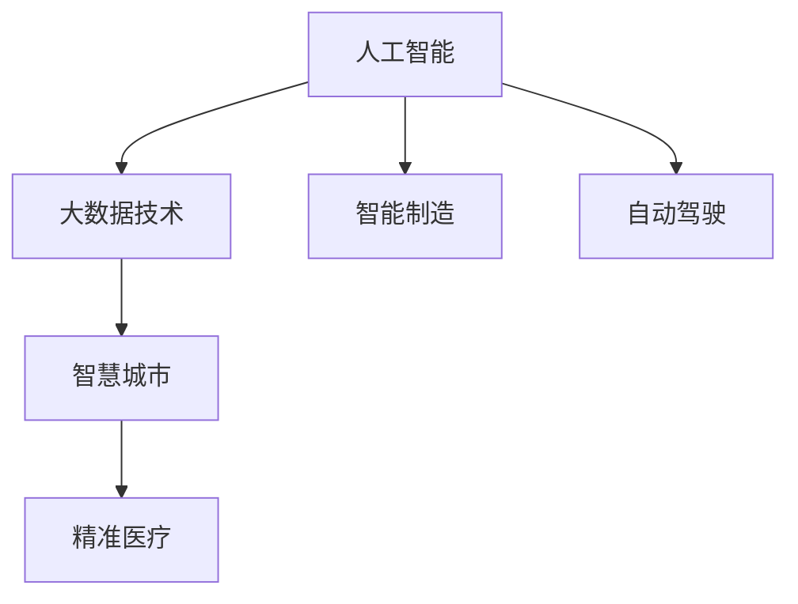

                 

# 推动社会进步的动力：人类计算的积极影响

## 1. 背景介绍

### 1.1 问题由来

随着数字时代的到来，人类社会正经历前所未有的变革。智能计算技术，特别是人工智能(AI)和大数据技术，正逐步成为推动社会进步的重要动力。从智慧城市到精准医疗，从智能制造到自动化物流，计算技术的力量正在深刻改变人们的生活方式、工作模式和社会结构。然而，这一变革亦带来了诸多挑战，如数据隐私、算法偏见、社会公平等。如何在充分利用计算技术的优势的同时，确保其良性发展，成为当前社会关注的焦点。

### 1.2 问题核心关键点

人类计算的积极影响主要体现在以下几个方面：

1. **效率提升**：计算技术能够显著提高各行各业的生产效率，通过自动化、智能化手段，减少人工错误，缩短生产周期。

2. **决策优化**：计算技术辅助决策者进行数据分析和预测，提供更加客观、科学的决策依据。

3. **创新加速**：计算技术提供了强大的计算能力，加速了新药研发、新材料发现等基础科学研究的发展。

4. **知识共享**：计算技术使得知识获取和共享更加便捷，促进了教育、文化、科研等领域的知识传播。

5. **服务普惠**：计算技术推动了普惠金融、智能客服、在线医疗等新兴服务的普及，提升了公众的生活质量。

然而，计算技术的快速发展也带来了数据隐私、算法透明性、伦理道德等挑战。如何在保障技术进步的同时，构建公平、透明、安全的社会环境，是需要全社会共同努力的方向。

### 1.3 问题研究意义

研究人类计算的积极影响，不仅有助于把握技术进步的机遇，更能够指引我们避免潜在的风险，构建一个更加公平、透明、可持续的数字社会。具体而言：

- **技术引领**：通过对计算技术进步的深入理解，把握技术变革的脉搏，指导相关领域的科技创新和应用。
- **社会责任**：关注计算技术对社会的影响，强调技术应用的伦理道德，确保技术进步服务于人类福祉。
- **国际竞争力**：提升我国在计算技术领域的国际竞争力，推动相关产业的发展，提升国家软实力。

## 2. 核心概念与联系

### 2.1 核心概念概述

为更好地理解人类计算的积极影响，本节将介绍几个密切相关的核心概念：

- **人工智能(AI)**：通过模拟人类智能行为，使机器能够理解、学习和执行复杂任务的技术。
- **大数据技术**：涉及数据的采集、存储、处理和分析，通过数据挖掘、机器学习等手段提取知识，支持决策和优化。
- **智慧城市**：利用大数据、物联网、云计算等技术，构建高效、智能、可持续的城市管理和服务体系。
- **精准医疗**：通过数据分析和AI技术，实现对疾病的早期检测、精准诊断和治疗。
- **智能制造**：利用物联网、自动化和AI技术，实现制造过程的数字化、智能化和协同化。
- **自动驾驶**：通过感知、决策和控制技术，实现车辆自动驾驶，提升交通安全性与效率。

这些核心概念之间的逻辑关系可以通过以下Mermaid流程图来展示：



这个流程图展示了几大计算技术领域的相互关系和影响：

1. **人工智能**：核心技术支撑，提供智能决策和执行能力。
2. **大数据技术**：提供数据基础，支持数据驱动的决策和优化。
3. **智慧城市**：应用领域之一，涵盖城市管理的各个方面。
4. **精准医疗**：另一个应用领域，提升医疗服务的精准度和效率。
5. **智能制造**：推动制造业转型升级，实现智能化生产。
6. **自动驾驶**：实现交通自动化，提升交通安全和效率。

## 3. 核心算法原理 & 具体操作步骤

### 3.1 算法原理概述

人类计算的积极影响主要通过以下几个核心算法原理实现：

1. **机器学习**：通过大量数据训练模型，实现数据的特征提取和模式识别，辅助决策和预测。
2. **深度学习**：通过多层次的神经网络结构，提取高层次特征，支持复杂任务的自动学习和执行。
3. **自然语言处理(NLP)**：使机器能够理解和生成自然语言，实现人机交互和知识获取。
4. **计算机视觉**：通过图像识别和处理技术，实现视觉信息的理解和应用。
5. **智能推荐系统**：通过用户行为数据分析，实现个性化内容的推荐和优化。

这些算法原理通过计算技术的应用，推动了社会各个领域的进步。

### 3.2 算法步骤详解

以下以机器学习和大数据技术为例，详细讲解其在推动社会进步中的应用步骤：

**Step 1: 数据收集与预处理**
- 收集相关领域的原始数据，进行清洗、去重和标注。
- 使用数据增强、特征工程等技术，提高数据的质量和可用性。

**Step 2: 模型选择与训练**
- 根据任务特点选择合适的机器学习模型，如回归模型、分类模型、聚类模型等。
- 使用大数据技术，对数据进行分布式并行训练，提高训练效率。
- 在模型训练过程中，应用交叉验证、正则化等技术，防止过拟合。

**Step 3: 模型评估与优化**
- 使用测试集对训练好的模型进行评估，计算各种评估指标，如精度、召回率、F1值等。
- 根据评估结果，调整模型参数或重新选择模型，优化模型性能。

**Step 4: 模型部署与应用**
- 将训练好的模型部署到实际应用场景中，进行实时预测和决策支持。
- 通过持续收集用户反馈和数据，不断优化模型，提升服务质量。

### 3.3 算法优缺点

人类计算的积极影响主要算法具有以下优点：

1. **高效率**：机器学习和深度学习模型能够在短时间内处理大量数据，提供高效的决策支持。
2. **高精度**：通过大量数据的训练，模型能够实现高精度的预测和分类。
3. **低成本**：相较于传统人工处理，计算技术能够大幅度降低人力成本和时间成本。
4. **可扩展性**：通过分布式计算和云计算技术，实现算力的快速扩展和资源共享。

然而，这些算法也存在一些缺点：

1. **数据依赖性高**：模型性能高度依赖数据的质量和数量，数据偏差可能导致模型偏见。
2. **算法复杂度高**：深度学习模型结构复杂，训练和调优过程需要专业知识和大量计算资源。
3. **解释性不足**：许多机器学习模型（如黑盒模型）缺乏可解释性，难以理解模型内部的决策过程。
4. **安全性问题**：模型可能存在安全漏洞，如数据泄露、算法攻击等，需要额外的安全保障措施。

### 3.4 算法应用领域

人类计算的积极影响算法在多个领域得到广泛应用，包括但不限于：

- **金融领域**：通过大数据分析和机器学习，实现风险控制、投资策略优化、智能投顾等。
- **医疗领域**：通过医学影像分析、基因组学研究、智能问诊等，提升医疗服务的精准度和效率。
- **教育领域**：通过智能推荐系统、学习数据分析、虚拟实验等，提升教育质量和个性化学习体验。
- **交通领域**：通过智能交通系统、自动驾驶技术、交通流量预测等，提升交通管理和安全。
- **环保领域**：通过大数据分析、智能监测等，实现环境污染的预测和治理。

## 4. 数学模型和公式 & 详细讲解 & 举例说明

### 4.1 数学模型构建

本节以回归模型为例，构建机器学习在特定任务上的数学模型。

假设我们有一组数据 $(x_1, y_1), (x_2, y_2), ..., (x_n, y_n)$，其中 $x_i$ 为输入特征，$y_i$ 为输出标签。回归模型的目标是通过学习一个函数 $f(x)$，最小化预测值 $y_i = f(x_i)$ 与真实值 $y_i$ 之间的误差，从而实现对未知样本的预测。常用的回归模型有线性回归、逻辑回归、决策树回归等。

### 4.2 公式推导过程

以线性回归模型为例，推导其优化目标和求解方法。

线性回归模型的目标是找到一组系数 $\theta = (\theta_0, \theta_1, ..., \theta_p)$，使得模型预测值与真实值之间的均方误差最小。设 $x_i = (x_{i1}, x_{i2}, ..., x_{ip})$，则线性回归模型的目标函数为：

$$
\min_{\theta} \frac{1}{2N} \sum_{i=1}^N (y_i - f(x_i))^2
$$

其中 $f(x_i) = \theta_0 + \theta_1 x_{i1} + ... + \theta_p x_{ip}$。

将目标函数对 $\theta$ 求导，得到梯度向量：

$$
\nabla_{\theta} L = \frac{1}{N} \sum_{i=1}^N -2(y_i - f(x_i))x_i
$$

使用梯度下降算法，更新参数 $\theta$，优化目标函数：

$$
\theta_{k+1} = \theta_k - \alpha \nabla_{\theta} L
$$

其中 $\alpha$ 为学习率，控制每次迭代的步长。

### 4.3 案例分析与讲解

以一个简单的房价预测为例，展示回归模型在实际应用中的工作流程：

假设我们有一组包含房价和面积的数据集，目标是预测给定面积下的房价。

**Step 1: 数据收集与预处理**
- 收集历史房价和面积数据，并进行清洗、标注。
- 对数据进行归一化处理，减少特征之间的尺度差异。

**Step 2: 模型选择与训练**
- 选择线性回归模型，定义输入特征为面积，输出标签为房价。
- 使用随机梯度下降算法，对数据进行分布式并行训练。
- 应用交叉验证，调整学习率，防止过拟合。

**Step 3: 模型评估与优化**
- 使用测试集对训练好的模型进行评估，计算均方误差。
- 根据评估结果，调整模型参数，优化模型性能。

**Step 4: 模型部署与应用**
- 将训练好的模型部署到实际应用场景中，进行房价预测。
- 通过持续收集新数据，不断优化模型，提升预测准确度。

## 5. 项目实践：代码实例和详细解释说明

### 5.1 开发环境搭建

在进行项目实践前，我们需要准备好开发环境。以下是使用Python进行TensorFlow开发的环境配置流程：

1. 安装Anaconda：从官网下载并安装Anaconda，用于创建独立的Python环境。

2. 创建并激活虚拟环境：
```bash
conda create -n tf-env python=3.8 
conda activate tf-env
```

3. 安装TensorFlow：根据CUDA版本，从官网获取对应的安装命令。例如：
```bash
conda install tensorflow -c tf
```

4. 安装各类工具包：
```bash
pip install numpy pandas scikit-learn matplotlib tqdm jupyter notebook ipython
```

完成上述步骤后，即可在`tf-env`环境中开始项目实践。

### 5.2 源代码详细实现

这里我们以房价预测为例，给出使用TensorFlow实现线性回归模型的代码实现。

```python
import tensorflow as tf
from sklearn.model_selection import train_test_split
import numpy as np
from sklearn.metrics import mean_squared_error

# 准备数据
X = np.array([[1000], [1500], [2000], [2500], [3000], [3500], [4000], [4500], [5000]])
y = np.array([180000, 270000, 360000, 480000, 630000, 780000, 940000, 1110000, 1360000])

# 划分训练集和测试集
X_train, X_test, y_train, y_test = train_test_split(X, y, test_size=0.2, random_state=42)

# 定义模型
model = tf.keras.Sequential([
    tf.keras.layers.Dense(1, input_shape=[1], activation='linear')
])

# 编译模型
model.compile(optimizer=tf.keras.optimizers.SGD(learning_rate=0.01),
              loss='mean_squared_error')

# 训练模型
model.fit(X_train, y_train, epochs=100, verbose=0)

# 评估模型
y_pred = model.predict(X_test)
mse = mean_squared_error(y_test, y_pred)
print('MSE:', mse)
```

以上就是使用TensorFlow实现线性回归模型的完整代码实现。可以看到，通过简短的几行代码，我们就能够完成数据的准备、模型的定义、训练和评估。

### 5.3 代码解读与分析

让我们再详细解读一下关键代码的实现细节：

**数据准备**：
- 使用NumPy生成输入特征（面积）和输出标签（房价）的样本数据。
- 通过`train_test_split`函数将数据集划分为训练集和测试集。

**模型定义**：
- 使用`Sequential`模型定义一个单层线性回归模型。
- 通过`Dense`层设置输入特征为1，输出维度为1，激活函数为线性函数。

**模型编译**：
- 使用`SGD`优化器，设置学习率为0.01。
- 使用均方误差作为损失函数。

**模型训练**：
- 通过`fit`函数，指定训练集数据、学习率、迭代次数等参数，进行模型训练。
- 设置`verbose`参数为0，表示不输出训练过程中的日志信息。

**模型评估**：
- 使用`predict`函数对测试集进行预测。
- 通过`mean_squared_error`函数计算预测值与真实值之间的均方误差，评估模型性能。

**运行结果展示**：
- 输出模型在测试集上的均方误差，作为模型评估的指标。

## 6. 实际应用场景

### 6.1 智慧城市

智慧城市是大数据和AI技术的典型应用场景之一，通过城市数据的全面感知和实时分析，实现城市管理的智能化和精准化。具体应用包括：

- **交通管理**：通过实时监测交通流量、车辆位置、交通事件等数据，优化交通信号灯、疏导交通流量、预测交通堵塞。
- **公共安全**：通过视频监控、人脸识别、异常检测等技术，提升公共安全水平，防范和应对各种突发事件。
- **环境保护**：通过监测空气质量、水质、噪音等数据，实现环境污染的实时监测和预警。
- **应急响应**：通过数据分析和预测，提前识别和预警自然灾害、公共卫生事件等，提升应急响应效率。

### 6.2 精准医疗

精准医疗通过大数据分析和AI技术，实现疾病的早期检测、精准诊断和治疗，提升医疗服务的质量和效率。具体应用包括：

- **医学影像分析**：通过图像处理和深度学习技术，自动识别和分析医学影像，辅助医生诊断。
- **基因组学研究**：通过基因组数据和大数据分析，研究疾病的发病机制，指导个性化治疗方案。
- **智能问诊**：通过自然语言处理和机器学习技术，实现智能问诊系统，提供个性化的医疗建议。
- **药物研发**：通过数据分析和模拟，加速新药的研发进程，降低研发成本和风险。

### 6.3 自动驾驶

自动驾驶技术通过感知、决策和控制技术的结合，实现车辆的自动驾驶，提升交通安全性和效率。具体应用包括：

- **环境感知**：通过摄像头、雷达、激光雷达等传感器，实时感知车辆周围的环境信息。
- **路径规划**：通过计算机视觉和地图数据，规划最优路径，实现自动驾驶。
- **安全控制**：通过控制系统和传感器技术，实现车辆自动避障、紧急制动等功能，提升驾驶安全。
- **车联网**：通过车辆间的通信和协作，实现更高效的交通管理和服务。

## 7. 工具和资源推荐

### 7.1 学习资源推荐

为了帮助开发者系统掌握计算技术的应用，这里推荐一些优质的学习资源：

1. **TensorFlow官方文档**：提供了丰富的教程和示例，帮助开发者快速上手TensorFlow的使用。
2. **TensorFlow中文社区**：提供了大量中文教程和实践案例，方便国内开发者学习和交流。
3. **Kaggle数据集和竞赛**：提供了大量的数据集和竞赛机会，帮助开发者进行数据分析和模型训练。
4. **Coursera机器学习和深度学习课程**：提供系统化课程，涵盖机器学习、深度学习、自然语言处理等多个领域。
5. **Arxiv论文库**：提供最新的AI领域论文，帮助开发者了解前沿技术和发展趋势。

### 7.2 开发工具推荐

高效的开发离不开优秀的工具支持。以下是几款用于计算技术开发的常用工具：

1. **PyTorch**：基于Python的开源深度学习框架，灵活的计算图和动态图机制，适用于研究和大规模模型训练。
2. **TensorFlow**：由Google主导开发的开源深度学习框架，生产部署方便，支持分布式计算和自动微分。
3. **Scikit-learn**：Python的机器学习库，提供了丰富的算法和工具，支持数据分析和模型训练。
4. **Jupyter Notebook**：基于Web的交互式笔记本，支持Python、R、SQL等多种编程语言，方便数据科学家的研究和开发。
5. **Google Colab**：谷歌推出的在线Jupyter Notebook环境，免费提供GPU/TPU算力，方便开发者快速实验最新技术。

### 7.3 相关论文推荐

计算技术的发展离不开学界的持续研究。以下是几篇奠基性的相关论文，推荐阅读：

1. **深度学习：一种新型的表示学习框架**：提出了深度学习框架，并通过多个经典案例展示了深度学习在各个领域的应用。
2. **大数据技术在城市管理中的应用**：探讨了大数据技术在智慧城市中的具体应用，如交通管理、公共安全、环境保护等。
3. **基于机器学习的精准医疗**：通过多个案例展示了机器学习在医学影像分析、基因组学研究、智能问诊等精准医疗任务中的应用。
4. **自动驾驶技术的前景与挑战**：探讨了自动驾驶技术的发展现状、关键技术以及面临的挑战，展望了未来发展方向。

## 8. 总结：未来发展趋势与挑战

### 8.1 总结

本文对人类计算的积极影响进行了全面系统的介绍。首先阐述了计算技术在智慧城市、精准医疗、自动驾驶等领域的广泛应用，明确了计算技术在推动社会进步中的重要价值。其次，从原理到实践，详细讲解了机器学习和大数据技术在计算中的应用，展示了计算技术在实际应用中的效果和挑战。

通过本文的系统梳理，可以看到，计算技术在推动社会进步中发挥了重要作用，同时也面临着数据隐私、算法透明性、伦理道德等诸多挑战。如何充分利用计算技术的优势，同时避免潜在的风险，是当下社会各界共同关注的课题。

### 8.2 未来发展趋势

展望未来，计算技术的积极影响将呈现以下几个发展趋势：

1. **自动化程度提高**：计算技术将进一步渗透到各行各业，实现自动化的生产、服务和管理。
2. **数据驱动决策**：计算技术将更广泛地应用于决策支持系统，实现数据驱动的决策和优化。
3. **智能交互普及**：计算技术将推动智能客服、智能助手等智能交互系统的普及，提升用户体验。
4. **跨领域融合**：计算技术与物联网、区块链、量子计算等技术的融合，将拓展计算技术的应用边界。
5. **伦理道德重视**：计算技术将更加注重伦理道德的规范，确保技术进步服务于人类福祉。

### 8.3 面临的挑战

尽管计算技术的积极影响巨大，但在迈向更加智能化、普适化应用的过程中，仍面临诸多挑战：

1. **数据隐私问题**：大数据和AI技术的广泛应用，带来数据隐私和安全问题。如何在保障数据隐私的同时，充分利用数据的价值，是亟需解决的问题。
2. **算法透明性不足**：许多机器学习和深度学习模型缺乏可解释性，难以理解其内部决策过程。如何增强算法的透明性和可解释性，是当前研究的重点。
3. **伦理道德问题**：计算技术可能带来歧视、偏见等伦理道德问题，如何在技术设计和应用中避免这些问题，是重要的研究方向。
4. **资源消耗高**：计算技术的应用往往需要大量计算资源和存储资源，如何提高计算效率和资源利用率，是未来发展的重要方向。
5. **社会公平问题**：计算技术可能加剧社会不平等，如何通过技术手段，缩小数字鸿沟，提升社会公平性，是重要的社会责任。

### 8.4 研究展望

面对计算技术积极影响所面临的挑战，未来的研究需要在以下几个方面寻求新的突破：

1. **隐私保护技术**：研发更加高效和安全的隐私保护技术，确保数据的安全和隐私。
2. **可解释性算法**：开发更加透明和可解释的算法，提升算法的可信度和可解释性。
3. **伦理道德框架**：构建伦理道德框架，指导计算技术的应用，确保技术进步服务于人类福祉。
4. **高效计算架构**：研究和开发高效计算架构，提升计算效率和资源利用率。
5. **普惠技术应用**：推动普惠技术应用，缩小数字鸿沟，提升社会公平性。

这些研究方向的探索，将推动计算技术向更加智能化、普适化、人性化方向发展，为构建一个更加公平、透明、可持续的数字社会提供有力支撑。

## 9. 附录：常见问题与解答

**Q1: 计算技术在推动社会进步中，如何平衡数据隐私和利用？**

A: 数据隐私和利用是计算技术发展中需要平衡的重要问题。以下是一些常见策略：

1. **数据去标识化**：对数据进行去标识化处理，去除与个人身份相关的信息，减少数据泄露风险。
2. **数据匿名化**：对数据进行匿名化处理，使得数据无法直接关联到个人身份。
3. **联邦学习**：在不需要集中存储数据的前提下，通过分布式计算实现模型训练，保护数据隐私。
4. **差分隐私**：在数据集中加入随机噪声，保护个体数据隐私，同时确保模型性能。
5. **多方安全计算**：通过加密技术实现多方协作计算，保护数据隐私和安全。

这些策略可以结合使用，在不同场景下灵活应用，平衡数据隐私和利用。

**Q2: 如何提高计算技术的透明度和可解释性？**

A: 提高计算技术的透明度和可解释性，可以从以下几个方面入手：

1. **模型选择**：选择具有可解释性的模型，如决策树、逻辑回归等。
2. **特征重要性分析**：通过特征重要性分析，识别对模型预测结果影响较大的特征。
3. **可视化工具**：使用可视化工具，如LIME、SHAP等，对模型进行可视化分析。
4. **模型解释框架**：研究和开发模型解释框架，帮助用户理解模型内部工作机制。
5. **用户反馈机制**：建立用户反馈机制，及时收集用户对模型输出的反馈，进行模型调整和优化。

通过这些方法，可以逐步提高计算技术的透明度和可解释性，增强用户对模型的信任。

**Q3: 计算技术如何避免伦理道德问题？**

A: 计算技术在应用过程中，需要注重伦理道德的规范，避免可能带来的伦理道德问题。以下是一些常见策略：

1. **伦理审查**：在技术设计和应用中，进行伦理审查，确保技术应用符合伦理道德规范。
2. **公平性保障**：设计和应用计算技术时，注重公平性保障，避免算法偏见和歧视。
3. **用户隐私保护**：在技术应用中，注重用户隐私保护，避免数据泄露和滥用。
4. **透明化机制**：建立透明化机制，确保技术应用的公开透明，接受社会监督。
5. **伦理教育和培训**：对技术人员进行伦理教育和培训，提高其伦理意识和责任感。

通过这些策略，可以最大限度地避免计算技术应用中的伦理道德问题，确保技术应用服务于人类福祉。

**Q4: 计算技术如何提高资源利用率？**

A: 提高计算技术的资源利用率，可以从以下几个方面入手：

1. **模型压缩和优化**：通过模型压缩和优化技术，减少模型参数和计算量。
2. **分布式计算**：利用分布式计算技术，实现计算任务的并行化，提高计算效率。
3. **高效算法**：研究和开发高效算法，提升计算速度和资源利用率。
4. **资源共享**：建立资源共享平台，实现计算资源的共享和复用。
5. **边缘计算**：利用边缘计算技术，将计算任务分布到设备端，减少计算负担。

通过这些方法，可以提高计算技术的资源利用率，降低计算成本。

**Q5: 如何缩小数字鸿沟，提升社会公平性？**

A: 缩小数字鸿沟，提升社会公平性，可以从以下几个方面入手：

1. **普惠技术推广**：推广普惠技术，提供低成本、易使用的技术解决方案，缩小数字鸿沟。
2. **教育普及**：普及数字教育，提高公众对计算技术的应用能力，提升其技术素养。
3. **基础设施建设**：加强数字基础设施建设，提升网络覆盖和信息获取能力。
4. **政策支持**：制定相关政策，支持普惠技术的发展和应用，保障弱势群体的技术权益。
5. **社会协作**：加强社会协作，多方参与，共同推动普惠技术的普及和应用。

通过这些方法，可以逐步缩小数字鸿沟，提升社会公平性，确保计算技术应用普惠全社会。

---

作者：禅与计算机程序设计艺术 / Zen and the Art of Computer Programming

