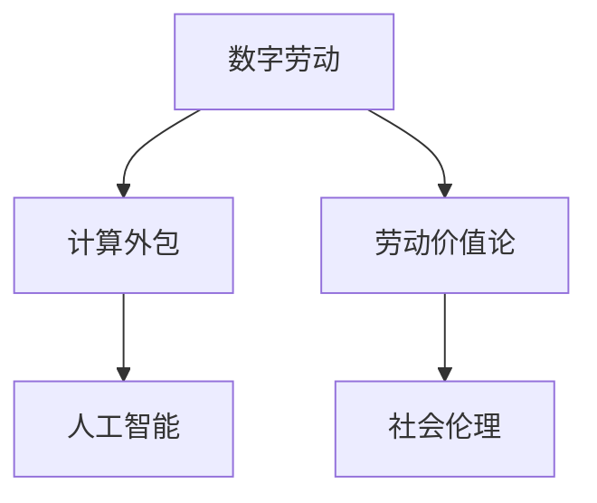

                 

# 数字劳动：人类计算的社会和经济影响

> 关键词：数字劳动,计算外包,人工智能,劳动价值论,社会伦理

## 1. 背景介绍

### 1.1 问题由来

随着信息技术的发展，特别是互联网和移动互联网的普及，全球劳动力市场的结构正在发生根本性变化。越来越多的工作从传统的办公室和工厂转移到了网络空间，以往依赖人力操作的繁琐任务逐渐被自动化的算法所取代。这种数字化、网络化的劳动形式，我们称之为“数字劳动”。

数字劳动不仅改变了劳动的形态，也重塑了劳动价值和社会关系。机器取代人力，使得劳动成果的创造不再仅仅依赖于劳动者的体力和智力，而是越来越依赖于数字化工具和计算能力。这种转变引发了对劳动价值论的深刻反思，并带来了诸多社会和经济问题。

### 1.2 问题核心关键点

本节将探讨数字劳动的核心概念及其对社会经济的影响，通过以下关键点展开讨论：

1. **数字劳动的定义与特征**：区分传统劳动与数字劳动的差异，理解其背后的技术驱动因素。
2. **计算外包的本质**：分析计算外包现象的起源和演变，探讨其对全球劳动市场的影响。
3. **人工智能的劳动价值**：讨论人工智能技术在数字劳动中的应用，以及其对劳动价值链的重塑。
4. **社会伦理与公平**：分析数字劳动带来的伦理问题，探讨如何实现劳动的公平分配和社会正义。

### 1.3 问题研究意义

研究数字劳动的社会和经济影响，对于理解数字化时代的劳动本质、探索新经济模式、以及推动社会公平和可持续发展具有重要意义：

1. **劳动本质的重塑**：数字劳动强调计算与算法在劳动过程中的核心作用，有助于重新定义劳动价值和劳动力的概念。
2. **新经济模式的探索**：数字劳动推动了以算法、数据为核心的新经济形态的发展，为传统产业的数字化转型提供了新的思路。
3. **社会公平的追求**：数字劳动的普及可能加剧社会不平等，因此，如何通过制度创新实现劳动的公平分配，是社会关注的焦点。
4. **可持续发展目标**：数字劳动有助于提高劳动效率，但也带来了资源过度消耗和环境污染等问题，如何平衡经济与环境的可持续发展，需要深入探讨。

## 2. 核心概念与联系

### 2.1 核心概念概述

为了更好地理解数字劳动及其影响，本节将介绍几个关键概念及其相互联系：

1. **数字劳动**：指利用数字化工具和算法进行的劳动形式，与传统基于人力的劳动相比，更加依赖于计算资源和算法逻辑。
2. **计算外包**：指将部分计算任务外包给第三方服务提供商，以降低企业运营成本和提升效率的现象。
3. **人工智能**：指利用机器学习、深度学习等技术，使机器具备人类智能水平的计算能力。
4. **劳动价值论**：探讨劳动成果的价值来源，区分体力劳动和脑力劳动，以及其在经济中的贡献。
5. **社会伦理**：涉及劳动的社会关系、劳动权益保护、以及社会公平正义等方面的问题。

这些概念之间的联系可以通过以下Mermaid流程图来展示：



这个流程图展示了数字劳动与计算外包、人工智能、劳动价值论和社会伦理之间的相互关系和影响。

## 3. 核心算法原理 & 具体操作步骤
### 3.1 算法原理概述

数字劳动的核心在于利用计算资源和算法进行任务的自动化处理。其算法原理可以概括为以下几个步骤：

1. **任务自动化**：将人类可执行的劳动任务，转化为可编程的算法任务，通过编程语言和框架实现。
2. **数据处理**：收集、清洗和预处理数据，为算法提供输入。
3. **模型训练**：使用机器学习算法，如监督学习、强化学习等，对数据进行训练，生成模型。
4. **模型部署**：将训练好的模型部署到实际应用环境中，执行任务。
5. **持续优化**：通过反馈和监控，不断优化模型性能和算法逻辑。

### 3.2 算法步骤详解

以下将详细介绍数字劳动中关键的算法步骤：

**Step 1: 任务自动化**
- 确定自动化任务的范围和目标，选择合适的算法框架（如TensorFlow、PyTorch等）。
- 分析任务逻辑，将任务分解为多个可编程的子任务。
- 设计算法流程，定义输入输出接口，确保算法可重用和可维护。

**Step 2: 数据处理**
- 数据收集：从各种渠道（如传感器、API、数据库等）获取数据。
- 数据清洗：去除噪声和冗余数据，进行数据标准化和格式转换。
- 数据预处理：对数据进行特征工程、归一化、编码等操作，为模型训练做准备。

**Step 3: 模型训练**
- 选择适合的任务模型，如线性回归、决策树、神经网络等。
- 划分训练集和测试集，进行交叉验证和超参数调优。
- 训练模型，监控训练过程中的性能指标，如准确率、召回率、损失函数等。

**Step 4: 模型部署**
- 将训练好的模型导出为可部署的格式，如TensorFlow SavedModel、ONNX等。
- 部署模型到生产环境，配置服务器、网络等基础设施。
- 编写API接口或应用程序，使模型能够被外部调用。

**Step 5: 持续优化**
- 收集模型输出结果，进行效果评估和反馈分析。
- 根据反馈结果，调整算法和模型参数，进行迭代优化。
- 定期监控模型性能，防止模型过时或失效。

### 3.3 算法优缺点

数字劳动的算法具有以下优点：

1. **效率提升**：通过自动化和算法优化，可以大幅度提升劳动效率和任务处理速度。
2. **成本节约**：减少人力成本和运营成本，提升企业的盈利能力。
3. **灵活性高**：算法可以根据任务需求进行灵活配置和调整，适应多变的业务环境。

同时，算法也存在以下局限：

1. **依赖技术**：算法需要高水平的技术支撑，对开发人员的素质要求较高。
2. **数据质量**：算法的准确性和性能很大程度上依赖于数据的质量和完备性。
3. **安全性风险**：算法可能存在被攻击或篡改的风险，影响数据和模型的安全。
4. **伦理问题**：算法的决策过程可能不透明，导致伦理和道德问题。

### 3.4 算法应用领域

数字劳动的算法广泛应用于多个领域，具体包括：

1. **金融科技**：利用算法进行风险评估、反欺诈、量化交易等。
2. **医疗健康**：通过机器学习分析医疗数据，辅助诊断和治疗。
3. **零售电商**：使用推荐系统、价格优化算法提升用户体验和销售效率。
4. **制造业**：采用工业物联网（IIoT）和智能制造算法，实现智能生产和质量控制。
5. **交通物流**：利用算法优化交通流量、货物配送路线和库存管理。
6. **媒体娱乐**：通过算法推荐个性化内容，提升用户体验和流量转化率。

这些应用领域展示了数字劳动的广泛影响力，也反映了算法的强大能力。

## 4. 数学模型和公式 & 详细讲解 & 举例说明

### 4.1 数学模型构建

数字劳动中的算法通常以数学模型为基础。以下以一个简单的线性回归模型为例，介绍其数学构建过程。

假设有一个线性回归问题，目标是通过输入变量 $x_1, x_2, ..., x_n$ 预测输出变量 $y$，模型形式为 $y = \beta_0 + \beta_1 x_1 + \beta_2 x_2 + ... + \beta_n x_n + \epsilon$，其中 $\epsilon$ 为误差项。

为了训练模型，通常需要构建一个损失函数，如均方误差（Mean Squared Error, MSE）：

$$
\mathcal{L} = \frac{1}{N} \sum_{i=1}^N (y_i - (\beta_0 + \beta_1 x_{1,i} + \beta_2 x_{2,i} + ... + \beta_n x_{n,i}))^2
$$

优化目标是最小化损失函数 $\mathcal{L}$，常用的优化算法如梯度下降（Gradient Descent, GD）：

$$
\theta_{k+1} = \theta_k - \eta \nabla_{\theta_k} \mathcal{L}
$$

其中，$\theta_k = (\beta_0, \beta_1, \beta_2, ..., \beta_n)$，$\eta$ 为学习率。

### 4.2 公式推导过程

以线性回归模型为例，其推导过程如下：

**Step 1: 建立假设函数**
$$
h_\theta(x) = \theta_0 + \theta_1 x_1 + \theta_2 x_2 + ... + \theta_n x_n
$$

**Step 2: 定义损失函数**
$$
\mathcal{L} = \frac{1}{2N} \sum_{i=1}^N (y_i - h_\theta(x_i))^2
$$

**Step 3: 求梯度**
$$
\nabla_{\theta} \mathcal{L} = \frac{1}{N} \sum_{i=1}^N (2(y_i - h_\theta(x_i))(x_i))
$$

**Step 4: 更新参数**
$$
\theta_{k+1} = \theta_k - \eta \nabla_{\theta} \mathcal{L}
$$

**Step 5: 迭代优化**
重复以上步骤，直至损失函数收敛或达到预设迭代次数。

### 4.3 案例分析与讲解

**案例分析：**

假设有一个电商平台，需要根据用户的购买历史和浏览行为，预测其对商品的评分。可以使用线性回归模型来进行预测。

**数据集准备：**

1. 收集用户的购买历史数据，包括用户ID、购买时间、购买商品ID、评分等。
2. 收集用户的浏览行为数据，包括浏览时间、浏览商品ID、浏览次数等。
3. 对数据进行清洗、预处理和特征工程。

**模型构建：**

1. 选择线性回归模型作为预测模型，构建假设函数 $h_\theta(x) = \theta_0 + \theta_1 x_1 + \theta_2 x_2 + ... + \theta_n x_n$。
2. 定义损失函数 $\mathcal{L} = \frac{1}{N} \sum_{i=1}^N (y_i - h_\theta(x_i))^2$。
3. 求梯度 $\nabla_{\theta} \mathcal{L} = \frac{1}{N} \sum_{i=1}^N (2(y_i - h_\theta(x_i))(x_i))$。
4. 更新参数 $\theta_{k+1} = \theta_k - \eta \nabla_{\theta} \mathcal{L}$。
5. 迭代优化，直至模型收敛。

**结果展示：**

1. 使用训练好的模型，对新用户的行为数据进行预测，输出其对商品的评分。
2. 对比预测评分与实际评分，计算模型的准确率、均方误差等指标。
3. 分析模型的预测效果和误差来源，进一步优化模型和算法。

## 5. 项目实践：代码实例和详细解释说明

### 5.1 开发环境搭建

为了实现数字劳动的算法，需要先搭建开发环境。以下是Python环境中常用的开发环境搭建步骤：

1. 安装Anaconda：从官网下载并安装Anaconda，用于创建独立的Python环境。
2. 创建并激活虚拟环境：
```bash
conda create -n pytorch-env python=3.8 
conda activate pytorch-env
```
3. 安装必要的依赖包：
```bash
pip install torch torchvision torchaudio numpy pandas scikit-learn
```
4. 安装机器学习框架：
```bash
pip install scikit-learn
```
5. 安装可视化工具：
```bash
pip install matplotlib seaborn
```

完成上述步骤后，即可在`pytorch-env`环境中进行数字劳动算法的开发。

### 5.2 源代码详细实现

以下是一个简单的线性回归模型在Python中的实现，以供读者参考：

```python
import numpy as np
from sklearn.linear_model import LinearRegression
from sklearn.metrics import mean_squared_error

# 准备数据集
X = np.array([[1, 2, 3], [4, 5, 6], [7, 8, 9]])
y = np.array([2, 4, 6])

# 构建模型
model = LinearRegression()

# 训练模型
model.fit(X, y)

# 预测新数据
X_new = np.array([[10, 11, 12]])
y_pred = model.predict(X_new)

# 计算均方误差
mse = mean_squared_error(y, y_pred)

# 输出结果
print(f"模型参数：{model.coef_}")
print(f"均方误差：{mse}")
```

### 5.3 代码解读与分析

**代码解析：**

1. 首先，准备了一个包含3个样本、3个特征的二维数组X和一个目标值数组y。
2. 使用`LinearRegression`类创建线性回归模型。
3. 使用`fit`方法训练模型，传入X和y作为训练数据。
4. 使用`predict`方法预测新数据X_new的输出值。
5. 使用`mean_squared_error`函数计算预测值与真实值之间的均方误差。
6. 输出模型参数和均方误差。

**性能分析：**

- 模型的预测结果需要与实际值进行比较，计算均方误差作为模型性能的指标。
- 可以使用更多的数据集进行训练和测试，以评估模型的泛化能力和稳定性。
- 可以通过调整模型参数和优化算法，进一步提高模型性能。

## 6. 实际应用场景

### 6.1 金融科技

在金融科技领域，数字劳动的应用尤为广泛。利用算法进行风险评估、反欺诈、量化交易等，可以提高金融机构的决策效率和准确性。

**实际案例：**

1. **风险评估**：利用机器学习算法对借款人的信用评分进行预测，根据评分结果进行风险控制和贷款审批。
2. **反欺诈**：通过分析交易数据和行为数据，检测异常交易，及时预警和拦截欺诈行为。
3. **量化交易**：利用算法模型分析市场数据，生成交易策略，实现高频交易和套利。

### 6.2 医疗健康

在医疗健康领域，数字劳动的应用可以辅助医生进行疾病诊断和治疗。

**实际案例：**

1. **图像识别**：利用深度学习算法对医学影像进行自动诊断，识别病变区域和类型。
2. **电子病历分析**：通过自然语言处理技术，分析电子病历中的文本信息，提取疾病特征和病史信息。
3. **个性化治疗**：利用机器学习算法，根据患者的基因数据和临床数据，推荐个性化治疗方案。

### 6.3 零售电商

在零售电商领域，数字劳动可以提升用户体验和销售效率。

**实际案例：**

1. **推荐系统**：利用推荐算法，根据用户的浏览和购买历史，推荐相关商品。
2. **库存管理**：通过预测算法，优化库存水平和供应链管理，减少库存成本和缺货风险。
3. **价格优化**：利用动态定价算法，根据市场需求和竞争情况，自动调整商品价格。

### 6.4 未来应用展望

随着技术的进步，数字劳动的应用将不断扩展和深化。未来可能的应用场景包括：

1. **智能制造**：通过工业物联网和智能制造算法，实现设备的自我监测和维护。
2. **智慧城市**：利用算法优化城市资源配置和环境管理，提升城市运行效率。
3. **教育培训**：利用智能辅导系统，提供个性化的学习方案和答疑服务。
4. **物流配送**：通过算法优化路线和配送策略，提高物流效率和降低成本。
5. **农业生产**：利用算法优化农业生产流程和资源管理，提升农业生产效率和质量。

## 7. 工具和资源推荐

### 7.1 学习资源推荐

为了帮助开发者深入理解数字劳动及其算法，以下是一些推荐的资源：

1. **机器学习课程**：如Coursera上的“Machine Learning by Stanford”和“Deep Learning Specialization”，系统介绍了机器学习和深度学习的理论和实践。
2. **数据科学书籍**：如《Python数据科学手册》、《深度学习》等，详细介绍了数据处理和机器学习算法。
3. **在线社区**：如Kaggle、GitHub等，提供了丰富的学习资源和实战案例。
4. **开源项目**：如TensorFlow、PyTorch等，提供了丰富的预训练模型和开发工具。

### 7.2 开发工具推荐

为了实现数字劳动的算法，以下是一些推荐的开发工具：

1. **Python**：作为数字劳动算法的开发主流语言，Python具有丰富的库和框架支持。
2. **Jupyter Notebook**：用于编写和执行代码，支持交互式编程和结果展示。
3. **Git**：用于版本控制和协作开发，方便代码管理和版本追踪。
4. **Docker**：用于容器化应用部署，支持跨平台和环境一致性。

### 7.3 相关论文推荐

数字劳动及其算法的研究涉及多个学科，以下是一些推荐的论文：

1. **《机器学习》（周志华）**：详细介绍了机器学习的基本原理和算法。
2. **《深度学习》（Ian Goodfellow等）**：介绍了深度学习的理论基础和实践应用。
3. **《数据科学与人工智能》（邱锡鹏）**：系统介绍了数据科学和人工智能的相关技术。
4. **《自然语言处理》（李航）**：介绍了自然语言处理的基本技术和应用。

## 8. 总结：未来发展趋势与挑战

### 8.1 研究成果总结

数字劳动作为数字化时代的重要劳动形式，其应用已经渗透到各个领域。通过算法自动化和数据驱动，数字劳动在提升劳动效率、降低成本和提高决策准确性等方面具有显著优势。

### 8.2 未来发展趋势

未来，数字劳动将呈现以下几个发展趋势：

1. **技术融合**：数字劳动将与其他人工智能技术（如自然语言处理、计算机视觉、强化学习等）进一步融合，形成更加强大和灵活的算法系统。
2. **产业升级**：数字劳动将推动各产业的数字化转型，提升生产效率和产品质量，实现智能化升级。
3. **伦理与社会**：数字劳动将引发新的社会伦理问题，需要建立相应的法律和制度保障。
4. **可持续发展**：数字劳动需要考虑资源消耗和环境影响，推动绿色可持续发展。

### 8.3 面临的挑战

数字劳动在发展过程中也面临一些挑战：

1. **数据隐私**：数字劳动依赖大量数据，需要关注数据隐私和保护问题。
2. **算法透明**：算法的黑箱问题可能导致伦理和社会问题，需要提高算法透明性和可解释性。
3. **公平与偏见**：数字劳动算法可能存在偏见，导致不公平和歧视问题，需要引入公平性评估和矫正机制。
4. **技术复杂性**：数字劳动算法复杂度高，需要高水平的技术支持和人才储备。
5. **伦理与社会影响**：数字劳动可能引发新的社会伦理问题，需要建立相应的法律和制度保障。

### 8.4 研究展望

未来，数字劳动的研究将关注以下几个方面：

1. **算法优化**：研究更高效的算法和模型，提高数字劳动的性能和效率。
2. **伦理与社会**：研究数字劳动的社会影响和伦理问题，推动公平和透明的社会制度建设。
3. **跨领域应用**：研究数字劳动在不同领域的应用，推动各产业的数字化转型。
4. **可持续发展**：研究数字劳动的资源消耗和环境影响，推动绿色可持续发展。

## 9. 附录：常见问题与解答

**Q1: 什么是数字劳动？**

A: 数字劳动指利用数字化工具和算法进行的劳动形式，与传统基于人力的劳动相比，更加依赖于计算资源和算法逻辑。

**Q2: 数字劳动与传统劳动的区别是什么？**

A: 传统劳动主要依赖于人力，而数字劳动则利用算法和计算资源进行自动化处理，具有更高的效率和灵活性。

**Q3: 数字劳动的应用领域有哪些？**

A: 数字劳动广泛应用于金融科技、医疗健康、零售电商、智能制造、智慧城市等多个领域，展现了其广泛的应用价值。

**Q4: 数字劳动的算法实现有哪些步骤？**

A: 数字劳动的算法实现通常包括任务自动化、数据处理、模型训练、模型部署和持续优化等步骤。

**Q5: 数字劳动面临的挑战有哪些？**

A: 数字劳动面临数据隐私、算法透明、公平性偏见、技术复杂性和伦理社会影响等挑战。

---

作者：禅与计算机程序设计艺术 / Zen and the Art of Computer Programming

