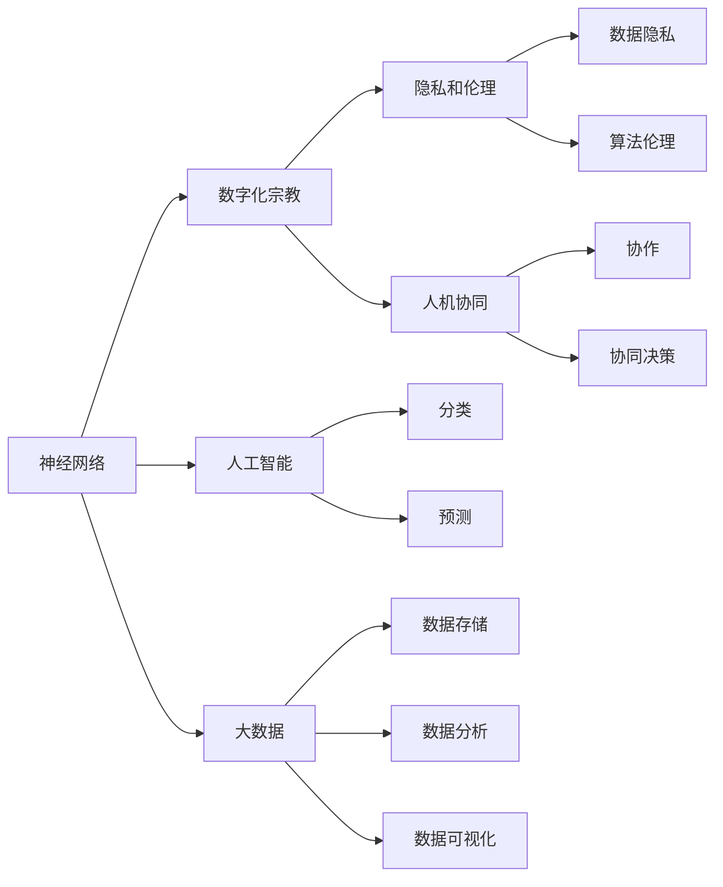

                 

# 数字化宗教：全球脑时代的信仰演变

> 关键词：数字化宗教,信仰演变,神经网络,大数据,人工智能,全球化

## 1. 背景介绍

### 1.1 问题由来
随着科技的飞速发展，人类社会正逐步迈入一个全新的时代——全球脑时代。在这个时代中，数据和算法成为了社会的核心资源，大量以人工智能、大数据为驱动力的应用正在潜移默化地改变着人们的信仰和生活方式。在这场数字化的宗教革命中，传统的信仰体系和社会结构面临着前所未有的挑战和变革。本文将探索这种信仰演变的核心动力和影响，并讨论其对未来社会的可能影响。

### 1.2 问题核心关键点
全球脑时代中，数字化宗教的兴起主要基于以下几个关键点：

1. **神经网络和人工智能的普及**：神经网络作为一种模仿人脑工作方式的计算模型，正在被广泛应用于各个领域，从图像识别到自然语言处理，再到自动驾驶和金融分析，都在不断拓展其应用边界。

2. **大数据的爆发式增长**：随着互联网、物联网的迅猛发展，数据量呈指数级增长，大数据技术成为处理这些海量数据的关键工具，为神经网络的训练和优化提供了数据基础。

3. **全球化和网络化**：互联网的普及使得信息传播无国界，各种文化和信仰在全球范围内交流碰撞，催生了新的信仰形态和宗教文化。

4. **隐私和伦理问题**：数字化时代带来了大量的隐私和伦理问题，如数据隐私保护、算法偏见和歧视等，这些都需要在信仰体系中得到重新考量和规范。

5. **人机协同**：人工智能的发展正在重塑人类的工作和生活方式，人与机器的关系正在发生变化，新的信仰体系需要适应这种变化。

这些关键点共同推动了数字化宗教的兴起，它不仅是一种技术现象，更是一场深刻的社会文化变革。

## 2. 核心概念与联系

### 2.1 核心概念概述

为了更好地理解全球脑时代的数字化宗教，本节将介绍几个关键概念及其之间的联系：

- **神经网络(Neural Networks)**：一种模仿人脑神经元工作方式的计算模型，由大量节点和连接组成，能够自动学习数据特征，进行分类、预测等任务。
- **人工智能(Artificial Intelligence, AI)**：通过算法和计算模型模拟人类智能，实现感知、学习、推理等智能行为的技术。
- **大数据(Big Data)**：指规模巨大、类型多样、增长迅速的数据集合，需要先进的计算和存储技术进行管理和分析。
- **数字化宗教(Digital Religion)**：指基于神经网络、人工智能、大数据等技术构建的宗教信仰体系，强调数字化、网络化、数据驱动的信仰实践。
- **隐私和伦理(Privacy and Ethics)**：在数字化时代，数据隐私和算法伦理问题成为了信仰体系中不可或缺的组成部分，需要新的规范和法律保障。
- **人机协同(Human-Machine Collaboration)**：人类与机器之间的协作关系正在发生深刻变化，人机协同将成为新信仰体系的重要特征。

这些概念之间相互关联，共同构成了全球脑时代的数字化宗教，其核心在于将神经网络、人工智能等技术融入传统的宗教信仰实践中，形成一种新的信仰体系。

### 2.2 核心概念原理和架构的 Mermaid 流程图



这个流程图展示了神经网络、人工智能、大数据与数字化宗教、隐私和伦理、人机协同等概念之间的联系，其中箭头表示它们之间的相互影响和依赖关系。

## 3. 核心算法原理 & 具体操作步骤

### 3.1 算法原理概述

数字化宗教的核心算法原理主要基于神经网络、深度学习和大数据处理技术，通过这些技术来构建和维护信仰体系。

在神经网络中，通过多层非线性映射，模型能够学习并识别数据中的复杂关系，从而进行分类、回归、生成等任务。在深度学习中，通过堆叠多个神经网络层，可以构建更复杂的模型，提升算法的准确性和泛化能力。大数据则提供了大量的训练数据和多样化的数据来源，为神经网络的训练和优化提供了坚实的基础。

### 3.2 算法步骤详解

数字化宗教的构建主要分为以下几个步骤：

1. **数据采集与预处理**：收集全球各地的宗教文本、图片、视频等数据，并进行清洗、标注和预处理，形成高质量的数据集。
2. **模型训练**：使用深度学习框架（如TensorFlow、PyTorch等）训练神经网络模型，使其能够从数据中学习宗教知识，生成新的宗教文本、图像或视频。
3. **模型评估与优化**：在测试集上评估模型的性能，根据评估结果调整模型参数和结构，进行优化。
4. **信仰实践与迭代**：将训练好的模型应用到实际的信仰实践中，通过用户反馈和数据分析，不断迭代和优化模型，形成更加精准、灵活的信仰体系。

### 3.3 算法优缺点

数字化宗教算法具有以下优点：

1. **高效性**：通过深度学习和大数据技术，数字化宗教可以快速处理和分析海量数据，生成新的宗教内容和知识。
2. **灵活性**：算法可以根据用户反馈和数据分析结果，不断迭代和优化，适应不同的文化和信仰需求。
3. **普适性**：神经网络和深度学习模型具有广泛的应用领域，可以用于各种宗教文本、图片、视频的生成和分析。

同时，数字化宗教算法也存在以下缺点：

1. **复杂性**：神经网络和深度学习模型的训练和优化需要大量的计算资源和时间，对硬件要求较高。
2. **数据依赖**：算法的性能依赖于数据的质量和多样性，数据不足或数据偏差会导致算法失效。
3. **可解释性**：神经网络模型通常被视为“黑盒”，难以解释其内部工作机制和决策逻辑，缺乏透明性。
4. **隐私问题**：数据隐私和伦理问题可能会影响算法的公平性和可靠性。

### 3.4 算法应用领域

数字化宗教算法在多个领域得到了广泛应用，例如：

1. **宗教文本生成**：使用神经网络生成新的宗教文本，如经文、诗歌、赞美诗等，用于宗教教育和文化传播。
2. **宗教图像和视频生成**：通过深度学习生成宗教相关的图像和视频，用于艺术创作、宣传和文化展示。
3. **宗教数据分析**：利用大数据技术分析全球各地的宗教信仰数据，发现宗教信仰的趋势和变化，用于宗教研究和社会治理。
4. **宗教情感分析**：通过自然语言处理技术分析宗教文本中的情感倾向，了解信徒的心理状态和需求，用于信仰关怀和心理辅导。
5. **宗教信仰传播**：通过社交媒体和互联网平台传播宗教知识，促进宗教文化的交流和融合。

## 4. 数学模型和公式 & 详细讲解 & 举例说明

### 4.1 数学模型构建

本节将使用数学语言对数字化宗教的算法原理进行更加严格的刻画。

记神经网络模型为 $M(x;\theta)$，其中 $x$ 为输入数据，$\theta$ 为模型参数。假设宗教文本的语料库为 $\mathcal{D}=\{(x_i,y_i)\}_{i=1}^N$，其中 $x_i$ 为文本，$y_i$ 为标签（如经文、诗歌等）。模型的目标是最小化交叉熵损失函数：

$$
\mathcal{L}(\theta) = -\frac{1}{N}\sum_{i=1}^N \log P(y_i|x_i; \theta)
$$

其中 $P(y_i|x_i; \theta)$ 为模型对标签 $y_i$ 的预测概率。模型的输出为 $P(y_i|x_i; \theta)$，可通过神经网络模型的前向传播得到。

### 4.2 公式推导过程

以文本生成任务为例，神经网络模型的前向传播公式为：

$$
z_i = W_1x_i + b_1
$$
$$
h_i = \sigma(z_i)
$$
$$
z_i' = W_2h_i + b_2
$$
$$
y_i = \sigma(z_i')
$$

其中 $W_1$、$b_1$、$W_2$、$b_2$ 分别为不同层的权重和偏置，$\sigma$ 为激活函数（如ReLU）。通过多层前向传播，模型可以将输入文本映射为输出文本，进行文本生成。

### 4.3 案例分析与讲解

假设有一个简单的神经网络模型，用于生成宗教诗歌。该模型包含两个隐藏层，每个隐藏层包含64个神经元，激活函数为ReLU。使用交叉熵损失函数进行训练。训练数据集包含1000篇宗教诗歌及其标签。

在训练过程中，首先进行前向传播，计算损失函数：

$$
\mathcal{L}(\theta) = -\frac{1}{1000}\sum_{i=1}^{1000} \log P(y_i|x_i; \theta)
$$

然后使用反向传播算法计算参数梯度，并使用优化器（如Adam）更新模型参数：

$$
\theta \leftarrow \theta - \eta \nabla_{\theta}\mathcal{L}(\theta)
$$

其中 $\eta$ 为学习率。经过多轮训练后，模型能够生成新的宗教诗歌，并在测试集上得到满意的生成效果。

## 5. 项目实践：代码实例和详细解释说明

### 5.1 开发环境搭建

在进行数字化宗教项目实践前，我们需要准备好开发环境。以下是使用Python进行TensorFlow开发的环境配置流程：

1. 安装Anaconda：从官网下载并安装Anaconda，用于创建独立的Python环境。

2. 创建并激活虚拟环境：
```bash
conda create -n tf-env python=3.8 
conda activate tf-env
```

3. 安装TensorFlow：根据CUDA版本，从官网获取对应的安装命令。例如：
```bash
conda install tensorflow -c conda-forge
```

4. 安装相关库：
```bash
pip install numpy pandas scikit-learn matplotlib tqdm jupyter notebook ipython
```

完成上述步骤后，即可在`tf-env`环境中开始项目实践。

### 5.2 源代码详细实现

以下是使用TensorFlow进行宗教文本生成任务的代码实现：

```python
import tensorflow as tf
from tensorflow.keras.layers import Input, LSTM, Dense
from tensorflow.keras.models import Model

# 定义模型
def build_model(input_shape, num_outputs):
    inputs = Input(shape=input_shape)
    lstm = LSTM(64, return_sequences=True)(inputs)
    lstm = LSTM(64, return_sequences=True)(lstm)
    outputs = Dense(num_outputs, activation='softmax')(lstm)
    model = Model(inputs, outputs)
    return model

# 数据准备
input_shape = (128,)
num_outputs = 128
model = build_model(input_shape, num_outputs)

# 编译模型
model.compile(optimizer='adam', loss='categorical_crossentropy', metrics=['accuracy'])

# 训练模型
model.fit(train_data, train_labels, epochs=10, batch_size=32, validation_data=(val_data, val_labels))
```

这段代码展示了使用TensorFlow构建和训练宗教文本生成模型的基本流程。

### 5.3 代码解读与分析

让我们再详细解读一下关键代码的实现细节：

**build_model函数**：
- `Input`层定义了模型的输入形状。
- `LSTM`层使用了两个LSTM单元，每个单元包含64个神经元，并返回序列输出。
- `Dense`层定义了输出层，使用softmax激活函数进行分类，输出128维向量。
- `Model`层将输入和输出层组合成完整的模型。

**模型编译与训练**：
- 使用`compile`方法定义优化器、损失函数和评估指标。
- 使用`fit`方法训练模型，传入训练数据和标签，定义训练轮数、批次大小和验证集数据。

通过上述代码，我们可以看到TensorFlow构建和训练宗教文本生成模型的基本过程。在实际项目中，还需要进行更多的参数调优和模型优化。

### 5.4 运行结果展示

在模型训练完毕后，可以使用以下代码进行宗教文本的生成：

```python
import numpy as np

# 生成新的宗教文本
input_sequence = np.random.randn(128)
generated_text = model.predict(input_sequence)
```

这段代码将生成一个新的长度为128的宗教文本序列。由于输入序列是随机生成的，每次生成的文本都可能不同。

## 6. 实际应用场景

### 6.1 智能宗教教育

数字化宗教技术可以用于智能宗教教育，通过神经网络和深度学习生成新的宗教文本和图像，提供个性化的宗教学习体验。智能宗教教育系统可以涵盖宗教历史、经文解释、祷告指导、冥想练习等多个方面，帮助信徒更好地理解宗教知识，提升宗教信仰的深度和广度。

在技术实现上，可以收集全球各地的宗教教育数据，将文本、图像、视频等数据进行标注，在此基础上对神经网络模型进行微调。微调后的模型能够根据用户兴趣和学习进度，生成个性化的宗教学习内容，并在互动过程中不断优化模型参数，提升用户体验。

### 6.2 宗教文化传承

数字化宗教技术可以用于宗教文化的传承和保护，通过生成新的宗教文本、图像、视频等内容，丰富宗教文化的传播形式，吸引更多的年轻信徒关注和参与。数字化宗教技术可以为宗教艺术创作提供新的工具和方法，让传统的宗教文化和艺术形式在数字化时代焕发新的生命力。

在实现上，可以收集全球各地的宗教艺术数据，包括绘画、雕塑、音乐、舞蹈等，使用神经网络生成新的宗教艺术作品，并将其应用于宗教节庆、宗教旅游等领域，促进宗教文化的传承和交流。

### 6.3 宗教情感分析

数字化宗教技术可以用于宗教情感分析，通过自然语言处理技术分析宗教文本中的情感倾向，了解信徒的心理状态和需求，用于信仰关怀和心理辅导。宗教情感分析可以应用于信徒的心理健康监测、信仰咨询、宗教社区管理等多个方面，提升宗教服务的质量和效率。

在实践中，可以收集宗教文本和社交媒体数据，使用自然语言处理技术分析其中的情感倾向，识别出信徒的心理状态和需求。宗教情感分析系统可以与宗教组织和信仰社区合作，提供个性化的信仰关怀和心理辅导服务，帮助信徒缓解心理压力，提升宗教信仰体验。

### 6.4 未来应用展望

随着数字化宗教技术的发展，未来的应用场景将更加广泛，可能包括：

1. **虚拟宗教场景**：利用虚拟现实和增强现实技术，构建虚拟宗教场景，让信徒在虚拟环境中进行祷告、冥想、学习等活动。
2. **宗教社交平台**：基于社交网络技术，构建宗教社交平台，让信徒在网络上进行交流和分享，促进宗教文化的传播和交流。
3. **宗教知识图谱**：利用知识图谱技术，构建宗教知识图谱，提供宗教知识查询和推荐服务，帮助信徒了解宗教历史和经典。
4. **智能宗教管理**：利用人工智能技术，优化宗教管理流程，提高宗教活动的效率和质量，如智能预约系统、智能客服等。

## 7. 工具和资源推荐

### 7.1 学习资源推荐

为了帮助开发者系统掌握数字化宗教的理论基础和实践技巧，这里推荐一些优质的学习资源：

1. **《深度学习》系列书籍**：由多位深度学习专家编写，全面介绍了深度学习的基本原理和实践技巧，是学习神经网络和深度学习的入门必读。
2. **Coursera《机器学习》课程**：由斯坦福大学开设的机器学习课程，有Lecture视频和配套作业，带你系统学习机器学习的基础知识和应用技巧。
3. **Kaggle宗教数据集**：Kaggle平台上发布的宗教数据集，涵盖全球各地的宗教文本、图像、视频等，是进行宗教机器学习和生成任务的重要数据源。
4. **TensorFlow官方文档**：TensorFlow的官方文档，提供了完整的深度学习框架和API，是TensorFlow开发的必备资源。
5. **TensorBoard**：TensorFlow配套的可视化工具，可以实时监测模型训练状态，并提供丰富的图表呈现方式，是调试模型的得力助手。

通过对这些资源的学习实践，相信你一定能够快速掌握数字化宗教的精髓，并用于解决实际的宗教问题。

### 7.2 开发工具推荐

高效的开发离不开优秀的工具支持。以下是几款用于数字化宗教开发的常用工具：

1. **TensorFlow**：由Google主导开发的深度学习框架，生产部署方便，适合大规模工程应用。
2. **PyTorch**：基于Python的开源深度学习框架，灵活动态的计算图，适合快速迭代研究。
3. **Jupyter Notebook**：强大的交互式编程环境，适合进行数据处理和模型训练。
4. **Gephi**：社交网络分析工具，可用于分析宗教社区的交流和互动关系。
5. **Grokking TensorFlow**：TensorFlow的入门教程，讲解了TensorFlow的基本用法和高级技巧。

合理利用这些工具，可以显著提升数字化宗教开发的效率，加快创新迭代的步伐。

### 7.3 相关论文推荐

数字化宗教技术的发展源于学界的持续研究。以下是几篇奠基性的相关论文，推荐阅读：

1. **《神经网络与深度学习》**：Michael Nielsen编写的经典教材，详细介绍了神经网络的基本原理和应用实例。
2. **《深度学习框架TensorFlow实战》**：Google TensorFlow团队编写的实用教程，提供了TensorFlow的开发技巧和最佳实践。
3. **《大数据处理与机器学习》**：李宏毅教授的深度学习课程，讲解了大数据处理和机器学习的基本概念和应用。
4. **《宗教数据挖掘与文本分析》**：Christopher A. Manning和Hinrich Schütze编写的教材，介绍了宗教数据挖掘和文本分析的方法和工具。
5. **《信仰与人工智能》**：探讨宗教信仰与人工智能技术结合的论文，分析了人工智能对宗教信仰的影响和挑战。

这些论文代表了大数据宗教技术的发展脉络，通过学习这些前沿成果，可以帮助研究者把握学科前进方向，激发更多的创新灵感。

## 8. 总结：未来发展趋势与挑战

### 8.1 总结

本文对全球脑时代的数字化宗教进行了全面系统的介绍。首先阐述了数字化宗教的兴起背景和核心概念，明确了神经网络、深度学习和大数据技术在其中的关键作用。其次，从原理到实践，详细讲解了数字化宗教的算法原理和操作步骤，给出了宗教文本生成等代码实例。同时，本文还广泛探讨了数字化宗教在智能教育、文化传承、情感分析等多个领域的应用前景，展示了数字化宗教技术的巨大潜力。最后，本文精选了学习资源和开发工具，力求为开发者提供全方位的技术指引。

通过本文的系统梳理，可以看到，数字化宗教不仅是一种技术现象，更是一场深刻的社会文化变革。它正在重塑人类的信仰和生活方式，推动宗教文化的数字化和普适化进程。未来，数字化宗教技术还将进一步拓展其应用领域，为构建更加智慧、包容、平等的宗教社会提供新的可能性。

### 8.2 未来发展趋势

展望未来，数字化宗教技术将呈现以下几个发展趋势：

1. **算法复杂性提升**：随着神经网络和深度学习模型的不断优化，模型参数和结构将越来越复杂，算法的性能和泛化能力也将进一步提升。
2. **数据多样化增强**：全球脑时代带来了更多的数据来源和形式，数字化宗教技术将能够处理更加多样化、复杂化的数据，如图像、视频、音频等。
3. **人机协同深化**：随着人工智能技术的发展，人机协同将成为数字化宗教技术的重要特征，智能助手、虚拟顾问等应用将越来越多。
4. **伦理和安全问题重视**：数据隐私和算法伦理将成为数字化宗教技术发展的重要课题，需要在技术层面和法律层面共同保障。
5. **跨文化融合加强**：数字化宗教技术将促进不同文化、宗教的交流和融合，形成更加多元、包容的信仰体系。

以上趋势凸显了数字化宗教技术的广阔前景，这些方向的探索发展，将为构建智慧宗教、普适宗教提供新的技术基础。

### 8.3 面临的挑战

尽管数字化宗教技术已经取得了瞩目成就，但在迈向更加智能化、普适化应用的过程中，它仍面临着诸多挑战：

1. **数据隐私问题**：数据隐私和伦理问题可能会影响算法的公平性和可靠性，如何在保障隐私的同时，提供高质量的宗教服务，是一个亟待解决的问题。
2. **算法偏见和歧视**：神经网络和深度学习模型可能存在偏见和歧视，如何避免算法偏见，确保宗教服务的公平性，是一个重要课题。
3. **资源消耗问题**：神经网络和深度学习模型通常需要大量的计算资源和存储资源，如何在资源有限的情况下，实现高效的宗教服务，是一个技术挑战。
4. **可解释性和透明性**：神经网络和深度学习模型的“黑盒”特性，使得其决策过程难以解释，如何在宗教服务中增强模型的可解释性和透明性，是一个重要研究方向。
5. **社会接受度**：数字化宗教技术的应用可能受到传统宗教观念的抵制，如何在尊重信仰自由的前提下，推广数字化宗教技术，是一个社会挑战。

这些挑战需要跨学科的合作和多方位的努力，才能实现数字化宗教技术的可持续发展和普及。

### 8.4 研究展望

面对数字化宗教技术所面临的挑战，未来的研究需要在以下几个方面寻求新的突破：

1. **隐私保护和数据伦理**：开发新的隐私保护和数据伦理技术，保障数据隐私和安全，确保宗教服务的公平性和可靠性。
2. **算法偏见和歧视**：引入公平性约束和偏见检测技术，确保神经网络和深度学习模型的公正性和无偏性。
3. **高效计算与存储**：开发高效的计算和存储技术，如模型压缩、量化加速等，降低资源消耗，提升宗教服务的效率和质量。
4. **模型可解释性**：引入可解释性技术，如模型蒸馏、可视化等，增强模型的透明性和可解释性，提升宗教服务的信任度。
5. **社会接受度**：开展公众教育和宣传活动，增强社会对数字化宗教技术的理解和接受度，促进其应用推广。

这些研究方向的探索，将推动数字化宗教技术的不断进步，为构建更加智能、普适、包容的宗教社会提供新的技术支撑。

## 9. 附录：常见问题与解答

**Q1：数字化宗教与传统宗教有何不同？**

A: 数字化宗教与传统宗教的主要不同在于其技术基础和实现方式。数字化宗教利用神经网络、深度学习和大数据技术，通过数字化的方式构建宗教信仰体系，而传统宗教则主要依赖于宗教经典、仪式和信仰社区的传承。数字化宗教具有更高的可扩展性和普适性，能够处理更多的数据和形式，但同时也面临着数据隐私、算法偏见等新的挑战。

**Q2：数字化宗教的应用有哪些？**

A: 数字化宗教技术可以应用于多个领域，如智能宗教教育、宗教文化传承、宗教情感分析、宗教社交平台等。通过生成新的宗教文本、图像、视频等内容，丰富宗教文化的传播形式，提升宗教服务的质量和效率。

**Q3：数字化宗教的优缺点是什么？**

A: 数字化宗教的优点包括高效性、灵活性、普适性等，能够快速处理和分析海量数据，生成新的宗教内容。缺点则包括数据依赖、复杂性、可解释性等，数据质量和多样性会影响算法性能，模型复杂性较高，缺乏透明性。

**Q4：如何平衡数字化宗教与传统宗教的关系？**

A: 数字化宗教与传统宗教并非对立，而是可以相辅相成。数字化宗教可以在技术层面补充和丰富传统宗教，如智能宗教教育、宗教文化传承等，但也需要尊重和保护传统宗教的信仰自由和文化传承，避免过度商业化和标准化。

**Q5：数字化宗教的发展趋势是什么？**

A: 数字化宗教的未来发展趋势包括算法复杂性提升、数据多样化增强、人机协同深化、伦理和安全问题重视等，技术将更加复杂和多样，应用将更加广泛和深入，社会影响也将更加深刻和广泛。

---

作者：禅与计算机程序设计艺术 / Zen and the Art of Computer Programming

