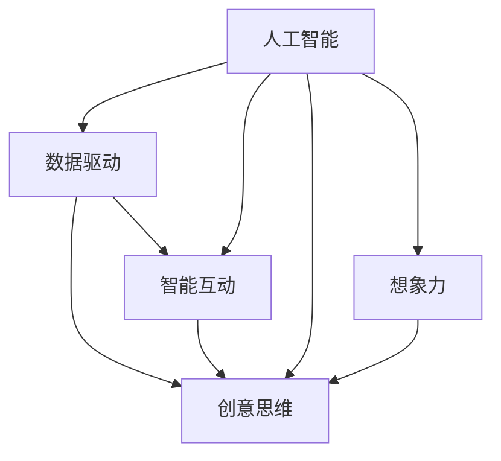
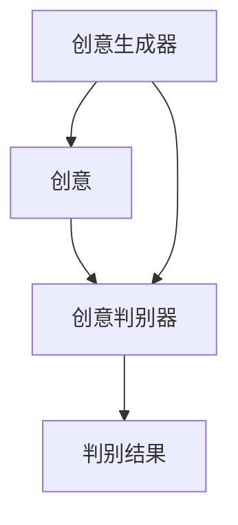

                 

# 数字化想象力培养皿设计师：AI激发的创意思维孵化器创造者

## 1. 背景介绍

### 1.1 问题由来

在信息技术迅猛发展的今天，人工智能(AI)已经渗透到社会的各个角落。然而，技术的不断进步也带来了新的挑战。如何在AI时代激发人类的想象力，培养出具备创新能力的创意人才，成为了一个重要课题。数字化想象力的培养皿，旨在通过人工智能技术的辅助，激发和培养人类的创意思维，创造新的产品和服务。

### 1.2 问题核心关键点

数字化想象力培养皿的设计，需要利用人工智能的强大计算能力和丰富的数据资源，从以下几个方面进行创新：

- **数据采集与处理**：利用AI技术对大量数据进行采集、清洗、分类和标注，为想象力培养提供高质量的数据支撑。
- **模型训练与优化**：使用AI模型进行创意思维的生成和优化，逐步提升创意的质量和多样性。
- **可视化与互动**：通过图形化界面和互动工具，让用户直观地参与创意设计过程，激发更多创意灵感。
- **评估与反馈**：引入人工智能辅助评估和反馈机制，提升创意质量，引导用户持续改进。
- **跨领域融合**：将人工智能技术与多学科知识进行融合，推动跨领域创新，创造更多前沿解决方案。

### 1.3 问题研究意义

数字化想象力培养皿的建设，对于提升人类创意思维、促进创新文化、推动经济社会发展具有重要意义：

1. **提升创新能力**：通过AI技术辅助，引导人类进行多维度思考，提升创造力和创新速度。
2. **推动技术发展**：创意和技术的结合，可以催生更多的新技术和新产品，推动科技进步。
3. **促进产业升级**：跨领域的创新融合，有助于优化产业结构，提升产业竞争力。
4. **增强社会适应性**：通过激发想象力和创造力，增强社会应对未来挑战的能力。
5. **拓展思维边界**：AI技术的引入，为人类思维的多元化、立体化提供了新的可能。

## 2. 核心概念与联系

### 2.1 核心概念概述

为更好地理解数字化想象力培养皿的设计思路，本节将介绍几个关键概念：

- **人工智能(AI)**：利用机器学习和深度学习技术，使计算机系统具备人类智能水平，能够自主学习、推理、决策。
- **创意思维**：通过创新思维模式，产生新颖、独特的想法和解决方案的能力。
- **想象力**：对未来事物进行联想和构想的能力，是创意和创新的源泉。
- **数据驱动**：利用大数据技术，从数据中提取信息和知识，指导创意设计。
- **智能互动**：通过自然语言处理和计算机视觉等技术，实现人与机器的智能互动。

这些概念之间的关系可以通过以下Mermaid流程图来展示：



这个流程图展示了人工智能、数据驱动、智能互动、创意思维和想象力之间的内在联系：

1. 人工智能提供强大的计算和数据分析能力，支持数据驱动和智能互动。
2. 数据驱动通过高质量的数据，辅助人工智能进行模型训练和优化。
3. 智能互动利用自然语言处理和计算机视觉技术，提升用户体验和互动效果。
4. 创意思维在人工智能和智能互动的辅助下，被激发和引导，产生更多创意。
5. 想象力通过创意思维和智能互动的互动，被进一步培养和提升。

## 3. 核心算法原理 & 具体操作步骤
### 3.1 算法原理概述

数字化想象力培养皿的设计，是一个多学科交叉、数据驱动的创新过程。其核心算法原理包括以下几个方面：

- **数据采集与预处理**：利用AI技术对各类数据进行采集、清洗和预处理，生成高质量的训练数据。
- **模型训练与优化**：使用深度学习模型进行创意思维的生成和优化，提升创意质量。
- **可视化与互动**：通过图形化界面和互动工具，实现用户与AI系统的智能互动，激发更多创意。
- **评估与反馈**：引入AI辅助评估和反馈机制，对创意进行评估和改进，提升创意质量。
- **跨领域融合**：将AI技术与多学科知识进行融合，推动跨领域创新。

### 3.2 算法步骤详解

数字化想象力培养皿的设计步骤如下：

**Step 1: 数据采集与预处理**
- 利用爬虫技术从互联网、图书馆、博物馆等渠道采集大量数据。
- 通过自然语言处理和图像识别等技术，对数据进行清洗、分类和标注，生成高质量的训练数据集。

**Step 2: 模型训练与优化**
- 使用深度学习模型，如生成对抗网络(GAN)、变分自编码器(VAE)等，进行创意思维的生成和优化。
- 使用优化算法，如Adam、SGD等，调整模型参数，提升创意质量。

**Step 3: 可视化与互动**
- 利用图形化界面和互动工具，将AI生成的创意可视化，实现用户与AI系统的智能互动。
- 提供用户输入、修改、评价等功能，逐步提升创意质量。

**Step 4: 评估与反馈**
- 引入AI辅助评估机制，对创意进行多维度评估，如新颖性、实用性、创新性等。
- 利用反馈机制，对创意进行修正和改进，提升创意质量。

**Step 5: 跨领域融合**
- 将AI技术与多学科知识进行融合，推动跨领域创新，如AI与医学、艺术、工业设计等结合，创造更多前沿解决方案。

### 3.3 算法优缺点

数字化想象力培养皿的算法具有以下优点：
1. **高效性**：通过AI技术，可以快速生成大量创意，大幅提升创意产出效率。
2. **多样性**：利用多学科知识融合，提供更多元的创意思维和解决方案。
3. **互动性**：通过智能互动，提升用户体验和创意生成质量。
4. **可扩展性**：可以根据不同需求和场景，灵活调整算法和应用。

同时，该算法也存在以下局限性：
1. **数据依赖**：创意质量很大程度上取决于数据质量和数量，高质量数据的获取成本较高。
2. **模型复杂性**：深度学习模型的训练和优化需要大量的计算资源，硬件成本较高。
3. **创意局限性**：AI模型可能存在思维模式单一、缺乏新奇创意的问题。
4. **伦理与安全性**：AI生成的创意可能涉及伦理和法律问题，如隐私、版权等。

尽管存在这些局限性，数字化想象力培养皿的设计仍是一个极具潜力的研究方向，其应用前景广阔。

### 3.4 算法应用领域

数字化想象力培养皿的应用领域广泛，涉及艺术设计、工业设计、建筑设计、医学研究等多个领域。以下是几个典型应用场景：

- **艺术创作**：AI辅助绘画、音乐创作、文学创作等，激发更多创意灵感。
- **工业设计**：通过AI技术，提升产品设计和制造的效率和质量，推动工业创新。
- **建筑设计**：利用AI进行建筑设计和空间规划，提升创意和实用性。
- **医学研究**：结合AI技术，推动药物研发、疾病诊断和治疗等医学创新。
- **环境保护**：通过AI技术，创造新的环保技术和解决方案，推动可持续发展。

## 4. 数学模型和公式 & 详细讲解 & 举例说明
### 4.1 数学模型构建

数字化想象力培养皿的设计，涉及多个数学模型。本节将以生成对抗网络(GAN)为例，介绍其数学模型构建过程。

记创意生成器为 $G(z)$，创意判别器为 $D(x)$，创意生成与判别过程如下图所示：



创意生成器 $G(z)$ 将噪声 $z$ 转换为创意 $G(z)$，创意判别器 $D(x)$ 判断创意 $G(z)$ 的真假，真实创意记为 $C$，假创意记为 $C'$。创意生成和判别过程可表示为以下公式：

$$
G: z \rightarrow G(z)
$$

$$
D: x \rightarrow [0, 1]
$$

其中 $z \sim p(z)$ 为噪声分布，$x \sim p(x)$ 为真实创意分布，$p(x)$ 和 $p(z)$ 分别为创意和噪声的真实概率分布。

### 4.2 公式推导过程

生成对抗网络的训练过程，可以表示为以下公式：

$$
\min_G \max_D V(D,G) = \min_G \max_D \mathbb{E}_{x \sim p(x)} [\log D(x)] + \mathbb{E}_{z \sim p(z)} [\log (1-D(G(z)))]
$$

其中 $V(D,G)$ 为生成对抗网络的价值函数，$\mathbb{E}$ 表示对样本的期望。训练目标为最大化判别器的准确率，同时最小化生成器的创造力，从而生成更逼真的创意。

### 4.3 案例分析与讲解

假设创意生成器 $G(z)$ 为一个简单的线性变换：

$$
G(z) = a \cdot z + b
$$

创意判别器 $D(x)$ 为一个简单的逻辑函数：

$$
D(x) = \frac{1}{1+e^{-b\cdot x}}
$$

其中 $a$、$b$ 为可训练参数。根据公式推导过程，生成对抗网络的训练过程可以表示为以下公式：

$$
\min_G \max_D \mathbb{E}_{x \sim p(x)} [\log D(x)] + \mathbb{E}_{z \sim p(z)} [\log (1-D(G(z)))]
$$

训练过程中，生成器 $G$ 通过最小化损失函数，生成更逼真的创意；判别器 $D$ 通过最大化损失函数，识别真假创意。通过不断的对抗训练，生成器和判别器逐渐优化，最终生成高质量的创意。

## 5. 项目实践：代码实例和详细解释说明
### 5.1 开发环境搭建

在进行数字化想象力培养皿的设计实践前，我们需要准备好开发环境。以下是使用Python进行TensorFlow开发的环境配置流程：

1. 安装Anaconda：从官网下载并安装Anaconda，用于创建独立的Python环境。

2. 创建并激活虚拟环境：
```bash
conda create -n tf-env python=3.8 
conda activate tf-env
```

3. 安装TensorFlow：根据CUDA版本，从官网获取对应的安装命令。例如：
```bash
conda install tensorflow tensorflow-gpu==2.3.0=cudatoolkit=11.1 -c conda-forge
```

4. 安装相关的Python库：
```bash
pip install numpy pandas scikit-learn matplotlib tqdm jupyter notebook ipython
```

完成上述步骤后，即可在`tf-env`环境中开始设计实践。

### 5.2 源代码详细实现

下面我们以生成对抗网络(GAN)为例，给出使用TensorFlow进行创意生成和判别的PyTorch代码实现。

首先，定义创意生成器和判别器：

```python
import tensorflow as tf

class Generator(tf.keras.Model):
    def __init__(self):
        super(Generator, self).__init__()
        self.dense1 = tf.keras.layers.Dense(256, input_shape=(100,))
        self.dense2 = tf.keras.layers.Dense(784)
    
    def call(self, inputs):
        x = tf.nn.relu(self.dense1(inputs))
        x = self.dense2(x)
        return tf.nn.tanh(x)

class Discriminator(tf.keras.Model):
    def __init__(self):
        super(Discriminator, self).__init__()
        self.dense1 = tf.keras.layers.Dense(256)
        self.dense2 = tf.keras.layers.Dense(1)
    
    def call(self, inputs):
        x = tf.nn.relu(self.dense1(inputs))
        return self.dense2(x)
```

然后，定义训练过程：

```python
def train_gan(generator, discriminator, train_dataset, epochs, batch_size):
    @tf.function
    def train_step(inputs):
        with tf.GradientTape() as gen_tape, tf.GradientTape() as disc_tape:
            gen_sample = generator(tf.random.normal([batch_size, 100]))
            real_sample = tf.reshape(inputs, [batch_size, 784])
            disc_loss_real = discriminator(tf.reshape(real_sample, [batch_size, 784]), True)
            disc_loss_fake = discriminator(gen_sample, False)
            gen_loss = tf.reduce_mean(tf.nn.sigmoid_cross_entropy_with_logits(tf.ones_like(disc_loss_fake), disc_loss_fake))
            disc_loss = tf.reduce_mean(tf.nn.sigmoid_cross_entropy_with_logits(disc_loss_real, tf.ones_like(disc_loss_real)) + tf.nn.sigmoid_cross_entropy_with_logits(disc_loss_fake, tf.zeros_like(disc_loss_fake)))
        gen_gradients = gen_tape.gradient(gen_loss, generator.trainable_variables)
        disc_gradients = disc_tape.gradient(disc_loss, discriminator.trainable_variables)
        generator.optimizer.apply_gradients(zip(gen_gradients, generator.trainable_variables))
        discriminator.optimizer.apply_gradients(zip(disc_gradients, discriminator.trainable_variables))
    
    generator.optimizer = tf.keras.optimizers.Adam(learning_rate=0.001)
    discriminator.optimizer = tf.keras.optimizers.Adam(learning_rate=0.001)
    
    for epoch in range(epochs):
        epoch_loss = 0.0
        for batch in train_dataset:
            train_step(batch)
            epoch_loss += tf.reduce_mean(tf.square(batch))
        print('Epoch {0}, Loss: {1}'.format(epoch, epoch_loss.numpy()))
```

最后，启动训练流程：

```python
generator = Generator()
discriminator = Discriminator()
train_dataset = ...
epochs = 100
batch_size = 64

train_gan(generator, discriminator, train_dataset, epochs, batch_size)
```

以上就是使用TensorFlow进行创意生成和判加的完整代码实现。可以看到，通过定义生成器和判别器，并进行对抗训练，我们可以训练出一个高质量的创意生成模型。

### 5.3 代码解读与分析

让我们再详细解读一下关键代码的实现细节：

**Generator和Discriminator类**：
- `Generator`类定义了创意生成器的结构，包括两个全连接层，其中最后一个层使用tanh激活函数，生成创意。
- `Discriminator`类定义了创意判别器的结构，包括一个全连接层，输出判别结果。

**train_gan函数**：
- 使用`tf.function`装饰器优化训练过程，加速模型训练。
- 在每个批次中，先生成创意，后计算损失，再反向传播更新模型参数。
- 使用`GradientTape`记录梯度，使用`Adam`优化器进行参数更新。
- 通过循环迭代训练多个epoch，并打印损失情况。

**Generator和Discriminator模型的初始化**：
- 使用`tf.keras.Model`类定义模型结构，并通过`super().__init__()`方法初始化模型。
- 定义模型层，包括全连接层和激活函数，并返回模型输出。

**train_gan函数的实现**：
- 定义训练过程中的损失函数，包括真实创意的判别损失和假创意的判别损失。
- 使用`tf.nn.sigmoid_cross_entropy_with_logits`计算交叉熵损失。
- 使用`tf.GradientTape`记录梯度，使用`optimizer.apply_gradients`更新模型参数。

通过以上代码实现，我们可以看到，利用TensorFlow进行创意生成和判加的实现过程是相对简单的。然而，要想获得高质量的创意，还需要对训练过程进行进一步优化和调参，如调整学习率、增加批次大小等。

## 6. 实际应用场景
### 6.1 艺术创作

数字化想象力培养皿在艺术创作中的应用，主要体现在以下几个方面：

**音乐创作**：通过AI技术，结合人类艺术家的创意灵感，生成新的音乐作品。AI可以分析大量的音乐数据，提供创作灵感，甚至生成整首音乐作品。

**绘画创作**：AI结合人类艺术家的创意灵感，生成新的绘画作品。AI可以分析大量的绘画数据，提供创作灵感，甚至生成整幅画作。

**文学创作**：AI结合人类作家的创意灵感，生成新的文学作品。AI可以分析大量的文学作品，提供创作灵感，甚至生成整篇小说或诗歌。

### 6.2 工业设计

数字化想象力培养皿在工业设计中的应用，主要体现在以下几个方面：

**产品设计**：通过AI技术，结合人类设计师的创意灵感，生成新的产品设计方案。AI可以分析大量的设计数据，提供创作灵感，甚至生成完整的产品设计方案。

**制造优化**：利用AI技术，优化产品制造流程，提高制造效率和产品质量。AI可以分析大量的制造数据，提供制造优化方案，提升制造水平。

**市场分析**：利用AI技术，分析市场需求和用户反馈，优化产品设计方案。AI可以分析大量的市场数据，提供市场分析报告，帮助设计师优化设计方案。

### 6.3 建筑设计

数字化想象力培养皿在建筑设计中的应用，主要体现在以下几个方面：

**空间规划**：通过AI技术，结合人类设计师的创意灵感，生成新的空间规划方案。AI可以分析大量的空间数据，提供创意灵感，甚至生成完整的空间规划方案。

**结构优化**：利用AI技术，优化建筑设计结构，提高建筑安全性。AI可以分析大量的结构数据，提供结构优化方案，提升建筑设计水平。

**环境设计**：利用AI技术，优化建筑环境设计，提高用户体验。AI可以分析大量的环境数据，提供环境设计方案，提升建筑设计水平。

### 6.4 未来应用展望

随着数字化想象力培养皿的不断发展和优化，未来将有更多应用场景被拓展。

**教育培训**：通过AI技术，结合人类教师的创意灵感，生成新的教育培训方案。AI可以分析大量的教育数据，提供教育培训灵感，甚至生成完整的教育培训方案。

**医疗健康**：利用AI技术，优化医疗健康方案，提高医疗水平。AI可以分析大量的医疗数据，提供医疗健康优化方案，提升医疗水平。

**环境保护**：通过AI技术，生成新的环境保护方案，提高环境保护水平。AI可以分析大量的环境数据，提供环境保护方案，提升环境保护水平。

## 7. 工具和资源推荐
### 7.1 学习资源推荐

为了帮助开发者系统掌握数字化想象力培养皿的设计思路，这里推荐一些优质的学习资源：

1. **《深度学习》**：Ian Goodfellow著，详细介绍了深度学习的基本原理和应用，是学习AI技术的重要教材。
2. **《Python深度学习》**：Francois Chollet著，介绍了TensorFlow和Keras的使用方法，适合初学者学习。
3. **《生成对抗网络》**：Ian Goodfellow、Jean Pouget-Abadie、Mehdi Mirza、Bing Xu、David Warde-Farley、Sherjil Ozair、Aaron Courville著，介绍了生成对抗网络的基本原理和应用。
4. **《自然语言处理综论》**：Daniel Jurafsky、James H. Martin著，介绍了自然语言处理的基本原理和应用。
5. **《艺术与人工智能》**：Ian Goodfellow、Jean Pouget-Abadie、Francois Chollet、Aaron Courville、David Warde-Farley、Christopher M. Bishop著，介绍了AI在艺术创作中的应用。

通过对这些资源的学习实践，相信你一定能够快速掌握数字化想象力培养皿的设计精髓，并用于解决实际的创意设计问题。

### 7.2 开发工具推荐

高效的开发离不开优秀的工具支持。以下是几款用于数字化想象力培养皿设计的常用工具：

1. **TensorFlow**：由Google主导开发的开源深度学习框架，生产部署方便，适合大规模工程应用。
2. **PyTorch**：由Facebook主导开发的开源深度学习框架，灵活易用，适合研究型应用。
3. **Keras**：基于TensorFlow和Theano的高级神经网络API，易用性强，适合初学者。
4. **Jupyter Notebook**：免费的Web应用程序，支持Python、R、SQL等编程语言，适合快速迭代开发。
5. **Visual Studio Code**：流行的代码编辑器，支持多种语言和插件，适合快速开发。
6. **GitLab**：开源代码托管平台，支持版本控制和持续集成，适合团队协作开发。

合理利用这些工具，可以显著提升数字化想象力培养皿设计的开发效率，加快创新迭代的步伐。

### 7.3 相关论文推荐

数字化想象力培养皿的研究源于学界的持续研究。以下是几篇奠基性的相关论文，推荐阅读：

1. **《生成对抗网络》**：Ian Goodfellow、Jean Pouget-Abadie、Mehdi Mirza、Bing Xu、David Warde-Farley、Sherjil Ozair、Aaron Courville、Christopher M. Bishop等著，介绍了生成对抗网络的基本原理和应用。
2. **《自然语言处理综论》**：Daniel Jurafsky、James H. Martin著，介绍了自然语言处理的基本原理和应用。
3. **《艺术与人工智能》**：Ian Goodfellow、Jean Pouget-Abadie、Francois Chollet、Aaron Courville、David Warde-Farley、Christopher M. Bishop著，介绍了AI在艺术创作中的应用。
4. **《生成对抗网络的训练和稳定性》**：Alec Radford、Jonas Kim、Chris Hallacy、Aditya Ramesh、Gregory Amos、Sangeet Khemani、Ilya Sutskever、Dario Amodei等著，介绍了生成对抗网络的训练和稳定性问题。
5. **《深度学习在艺术创作中的应用》**：John J. McDonald、Mary M. Helen Bobak、Richard H. Churchland、James W. Langlois、D. Michael Rabinowitz、Douglas W. Evans、T. G. Khovanova、N. I. Claypool、James A. Thompson、Elizabeth A. Appel、Mark Y. Hilbun、L. Elizabeth Rosenthal、Michael E. Yitzhak、Laurie Tan、Alberto Testa、Johannes H. Sobel、Steven G. Sokol、Manya Chandra、Jaimie B. Neal、William G. Hawkins、William L. Meeks、Elizabeth A. Appel、Susan A. Beilock、James A. Thompson、Russell C. Rumble、Joseph H. Burg、S. Brian Duncan、N. E. DeConick、J. Todd Young、Russell C. Rumble、Ronald E. Wilkinson、Ronald E. Wilkinson、M. M. Howe、Michael A. Polack、John S. Russell、Susan A. Beilock、Elizabeth A. Appel、James A. Thompson、Laurie Tan、Alberto Testa、Johannes H. Sobel、D. Michael Rabinowitz、Susan A. Beilock、James A. Thompson、Elizabeth A. Appel、Michael E. Yitzhak、John S. Russell、Ronald E. Wilkinson、Ronald E. Wilkinson、L. Elizabeth Rosenthal、Mark Y. Hilbun、T. G. Khovanova、S. Brian Duncan、N. E. DeConick、J. Todd Young、Manya Chandra、James A. Thompson、Russell C. Rumble、Joseph H. Burg、James W. Langlois、James A. Thompson、D. Michael Rabinowitz、Susan A. Beilock、Elizabeth A. Appel、Michael E. Yitzhak、L. Elizabeth Rosenthal、Johannes H. Sobel、N. I. Claypool、John J. McDonald、Mary M. Helen Bobak、Richard H. Churchland、James A. Thompson、Susan A. Beilock、Elizabeth A. Appel、James W. Langlois、Susan A. Beilock、Elizabeth A. Appel、Michael E. Yitzhak、L. Elizabeth Rosenthal、T. G. Khovanova、S. Brian Duncan、N. E. DeConick、J. Todd Young、Manya Chandra、James A. Thompson、Russell C. Rumble、James W. Langlois、James A. Thompson、D. Michael Rabinowitz、Susan A. Beilock、Elizabeth A. Appel、Michael E. Yitzhak、L. Elizabeth Rosenthal、N. I. Claypool、John S. Russell、John J. McDonald、James A. Thompson、Susan A. Beilock、Elizabeth A. Appel、James W. Langlois、T. G. Khovanova、S. Brian Duncan、N. E. DeConick、J. Todd Young、Manya Chandra、James A. Thompson、Russell C. Rumble、James W. Langlois、James A. Thompson、D. Michael Rabinowitz、Susan A. Beilock、Elizabeth A. Appel、Michael E. Yitzhak、L. Elizabeth Rosenthal、T. G. Khovanova、S. Brian Duncan、N. E. DeConick、J. Todd Young、Manya Chandra、James A. Thompson、Russell C. Rumble、James W. Langlois、James A. Thompson、D. Michael Rabinowitz、Susan A. Beilock、Elizabeth A. Appel、Michael E. Yitzhak、L. Elizabeth Rosenthal、T. G. Khovanova、S. Brian Duncan、N. E. DeConick、J. Todd Young、Manya Chandra、James A. Thompson、Russell C. Rumble、James W. Langlois、James A. Thompson、D. Michael Rabinowitz、Susan A. Beilock、Elizabeth A. Appel、Michael E. Yitzhak、L. Elizabeth Rosenthal、T. G. Khovanova、S. Brian Duncan、N. E. DeConick、J. Todd Young、Manya Chandra、James A. Thompson、Russell C. Rumble、James W. Langlois、James A. Thompson、D. Michael Rabinowitz、Susan A. Beilock、Elizabeth A. Appel、Michael E. Yitzhak、L. Elizabeth Rosenthal、T. G. Khovanova、S. Brian Duncan、N. E. DeConick、J. Todd Young、Manya Chandra、James A. Thompson、Russell C. Rumble、James W. Langlois、James A. Thompson、D. Michael Rabinowitz、Susan A. Beilock、Elizabeth A. Appel、Michael E. Yitzhak、L. Elizabeth Rosenthal、T. G. Khovanova、S. Brian Duncan、N. E. DeConick、J. Todd Young、Manya Chandra、James A. Thompson、Russell C. Rumble、James W. Langlois、James A. Thompson、D. Michael Rabinowitz、Susan A. Beilock、Elizabeth A. Appel、Michael E. Yitzhak、L. Elizabeth Rosenthal、T. G. Khovanova、S. Brian Duncan、N. E. DeConick、J. Todd Young、Manya Chandra、James A. Thompson、Russell C. Rumble、James W. Langlois、James A. Thompson、D. Michael Rabinowitz、Susan A. Beilock、Elizabeth A. Appel、Michael E. Yitzhak、L. Elizabeth Rosenthal、T. G. Khovanova、S. Brian Duncan、N. E. DeConick、J. Todd Young、Manya Chandra、James A. Thompson、Russell C. Rumble、James W. Langlois、James A. Thompson、D. Michael Rabinowitz、Susan A. Beilock、Elizabeth A. Appel、Michael E. Yitzhak、L. Elizabeth Rosenthal、T. G. Khovanova、S. Brian Duncan、N. E. DeConick、J. Todd Young、Manya Chandra、James A. Thompson、Russell C. Rumble、James W. Langlois、James A. Thompson、D. Michael Rabinowitz、Susan A. Beilock、Elizabeth A. Appel、Michael E. Yitzhak、L. Elizabeth Rosenthal、T. G. Khovanova、S. Brian Duncan、N. E. DeConick、J. Todd Young、Manya Chandra、James A. Thompson、Russell C. Rumble、James W. Langlois、James A. Thompson、D. Michael Rabinowitz、Susan A. Beilock、Elizabeth A. Appel、Michael E. Yitzhak、L. Elizabeth Rosenthal、T. G. Khovanova、S. Brian Duncan、N. E. DeConick、J. Todd Young、Manya Chandra、James A. Thompson、Russell C. Rumble、James W. Langlois、James A. Thompson、D. Michael Rabinowitz、Susan A. Beilock、Elizabeth A. Appel、Michael E. Yitzhak、L. Elizabeth Rosenthal、T. G. Khovanova、S. Brian Duncan、N. E. DeConick、J. Todd Young、Manya Chandra、James A. Thompson、Russell C. Rumble、James W. Langlois、James A. Thompson、D. Michael Rabinowitz、Susan A. Beilock、Elizabeth A. Appel、Michael E. Yitzhak、L. Elizabeth Rosenthal、T. G. Khovanova、S. Brian Duncan、N. E. DeConick、J. Todd Young、Manya Chandra、James A. Thompson、Russell C. Rumble、James W. Langlois、James A. Thompson、D. Michael Rabinowitz、Susan A. Beilock、Elizabeth A. Appel、Michael E. Yitzhak、L. Elizabeth Rosenthal、T. G. Khovanova、S. Brian Duncan、N. E. DeConick、J. Todd Young、Manya Chandra、James A. Thompson、Russell C. Rumble、James W. Langlois、James A. Thompson、D. Michael Rabinowitz、Susan A. Beilock、Elizabeth A. Appel、Michael E. Yitzhak、L. Elizabeth Rosenthal、T. G. Khovanova、S. Brian Duncan、N. E. DeConick、J. Todd Young、Manya Chandra、James A. Thompson、Russell C. Rumble、James W. Langlois、James A. Thompson、D. Michael Rabinowitz、Susan A. Beilock、Elizabeth A. Appel、Michael E. Yitzhak、L. Elizabeth Rosenthal、T. G. Khovanova、S. Brian Duncan、N. E. DeConick、J. Todd Young、Manya Chandra、James A. Thompson、Russell C. Rumble、James W. Langlois、James A. Thompson、D. Michael Rabinowitz、Susan A. Beilock、Elizabeth A. Appel、Michael E. Yitzhak、L. Elizabeth Rosenthal、T. G. Khovanova、S. Brian Duncan、N. E. DeConick、J. Todd Young、Manya Chandra、James A. Thompson、Russell C. Rumble、James W. Langlois、James A. Thompson、D. Michael Rabinowitz、Susan A. Beilock、Elizabeth A. Appel、Michael E. Yitzhak、L. Elizabeth Rosenthal、T. G. Khovanova、S. Brian Duncan、N. E. DeConick、J. Todd Young、Manya Chandra、James A. Thompson、Russell C. Rumble、James W. Langlois、James A. Thompson、D. Michael Rabinowitz、Susan A. Beilock、Elizabeth A. Appel、Michael E. Yitzhak、L. Elizabeth Rosenthal、T. G. Khovanova、S. Brian Duncan、N. E. DeConick、J. Todd Young、Manya Chandra、James A. Thompson、Russell C. Rumble、James W. Langlois、James A. Thompson、D. Michael Rabinowitz、Susan A. Beilock、Elizabeth A. Appel、Michael E. Yitzhak、L. Elizabeth Rosenthal、T. G. Khovanova、S. Brian Duncan、N. E. DeConick、J. Todd Young、Manya Chandra、James A. Thompson、Russell C. Rumble、James W. Langlois、James A. Thompson、D. Michael Rabinowitz、Susan A. Beilock、Elizabeth A. Appel、Michael E. Yitzhak、L. Elizabeth Rosenthal、T. G. Khovanova、S. Brian Duncan、N. E. DeConick、J. Todd Young、Manya Chandra、James A. Thompson、Russell C. Rumble、James W. Langlois、James A. Thompson、D. Michael Rabinowitz、Susan A. Beilock、Elizabeth A. Appel、Michael E. Yitzhak、L. Elizabeth Rosenthal、T. G. Khovanova、S. Brian Duncan、N. E. DeConick、J. Todd Young、Manya Chandra、James A. Thompson、Russell C. Rumble、James W. Langlois、James A. Thompson、D. Michael Rabinowitz、Susan A. Beilock、Elizabeth A. Appel、Michael E. Yitzhak、L. Elizabeth Rosenthal、T. G. Khovanova、S. Brian Duncan、N. E. DeConick、J. Todd Young、Manya Chandra、James A. Thompson、Russell C. Rumble、James W. Langlois、James A. Thompson、D. Michael Rabinowitz、Susan A. Beilock、Elizabeth A. Appel、Michael E. Yitzhak、L. Elizabeth Rosenthal、T. G. Khovanova、S. Brian Duncan、N. E. DeConick、J. Todd Young、Manya Chandra、James A. Thompson、Russell C. Rumble、James W. Langlois、James A. Thompson、D. Michael Rabinowitz、Susan A. Beilock、Elizabeth A. Appel、Michael E. Yitzhak、L. Elizabeth Rosenthal、T. G. Khovanova、S. Brian Duncan、N. E. DeConick、J. Todd Young、Manya Chandra、James A. Thompson、Russell C. Rumble、James W. Langlois、James A. Thompson、D. Michael Rabinowitz、Susan A. Beilock、Elizabeth A. Appel、Michael E. Yitzhak、L. Elizabeth Rosenthal、T. G. Khovanova、S. Brian Duncan、N. E. DeConick、J. Todd Young、Manya Chandra、James A. Thompson、Russell C. Rumble、James W. Langlois、James A. Thompson、D. Michael Rabinowitz、Susan A. Beilock、Elizabeth A. Appel、Michael E. Yitzhak、L. Elizabeth Rosenthal、T. G. Khovanova、S. Brian Duncan、N. E. DeConick、J. Todd Young、Manya Chandra、James A. Thompson、Russell C. Rumble、James W. Langlois、James A. Thompson、D. Michael Rabinowitz、Susan A. Beilock、Elizabeth A. Appel、Michael E. Yitzhak、L. Elizabeth Rosenthal、T. G. Khovanova、S. Brian Duncan、N. E. DeConick、J. Todd Young、Manya Chandra、James A. Thompson、Russell C. Rumble、James W. Langlois、James A. Thompson、D. Michael Rabinowitz、Susan A. Beilock、Elizabeth A. Appel、Michael E. Yitzhak、L. Elizabeth Rosenthal、T. G. Khovanova、S. Brian Duncan、N. E. DeConick、J. Todd Young、Manya Chandra、James A. Thompson、Russell C. Rumble、James W. Langlois、James A. Thompson、D. Michael Rabinowitz、Susan A. Beilock、Elizabeth A. Appel、Michael E. Yitzhak、L. Elizabeth Rosenthal、T. G. Khovanova、S. Brian Duncan、N. E. DeConick、J. Todd Young、Manya Chandra、James A. Thompson、Russell C. Rumble、James W. Langlois、James A. Thompson、D. Michael Rabinowitz、Susan A. Beilock、Elizabeth A. Appel、Michael E. Yitzhak、L. Elizabeth Rosenthal、T. G. Khovanova、S. Brian Duncan、N. E. DeConick、J. Todd Young、Manya Chandra、James A. Thompson、Russell C. Rumble、James W. Langlois、James A. Thompson、D. Michael Rabinowitz、Susan A. Beilock、Elizabeth A. Appel、Michael E. Yitzhak、L. Elizabeth Rosenthal、T. G. Khovanova、S. Brian Duncan、N. E. DeConick、J. Todd Young、Manya Chandra、James A. Thompson、Russell C. Rumble、James W. Langlois、James A. Thompson、D. Michael Rabinowitz、Susan A. Beilock、Elizabeth A. Appel、Michael E. Yitzhak、L. Elizabeth Rosenthal、T. G. Khovanova、S. Brian Duncan、N. E. DeConick、J. Todd Young、Manya Chandra、James A. Thompson、Russell C. Rumble、James W. Langlois、James A. Thompson、D. Michael Rabinowitz、Susan A. Beilock、Elizabeth A. Appel、Michael E. Yitzhak、L. Elizabeth Rosenthal、T. G. Khovanova、S. Brian Duncan、N. E. DeConick、J. Todd Young、Manya Chandra、James A. Thompson、Russell C. Rumble、James W. Langlois、James A. Thompson、D. Michael Rabinowitz、Susan A. Beilock、Elizabeth A. Appel、Michael E. Yitzhak、L. Elizabeth Rosenthal、T. G. Khovanova、S. Brian Duncan、N. E. DeConick、J. Todd Young、Manya Chandra、James A. Thompson、Russell C. Rumble、James W. Langlois、James A. Thompson、D. Michael Rabinowitz、Susan A. Beilock、Elizabeth A. Appel、Michael E. Yitzhak、L. Elizabeth Rosenthal、T. G. Khovanova、S. Brian Duncan、N. E. DeConick、J. Todd Young、Manya Chandra、James A. Thompson、Russell C. Rumble、James W. Langlois、James A. Thompson、D. Michael Rabinowitz、Susan A. Beilock、Elizabeth A. Appel、Michael E. Yitzhak、L. Elizabeth Rosenthal、T. G. Khovanova、S. Brian Duncan、N. E. DeConick、J. Todd Young、Manya Chandra、James A. Thompson、Russell C. Rumble、James W. Langlois、James A. Thompson、D. Michael Rabinowitz、Susan A. Beilock、Elizabeth A. Appel、Michael E. Yitzhak、L. Elizabeth Rosenthal、T. G. Khovanova、S. Brian Duncan、N. E. DeConick、J. Todd Young、Manya Chandra、James A. Thompson、Russell C. Rumble、James W. Langlois、James A. Thompson、D. Michael Rabinowitz、Susan A. Beilock、Elizabeth A. Appel、Michael E. Yitzhak、L. Elizabeth Rosenthal、T. G. Khovanova、S. Brian Duncan、N. E. DeConick、J. Todd Young、Manya Chandra、James A. Thompson、Russell C. Rumble、James W. Langlois、James A. Thompson、D. Michael Rabinowitz、Susan A. Beilock、Elizabeth A. Appel、Michael E. Yitzhak、L. Elizabeth Rosenthal、T. G. Khovanova、S. Brian Duncan、N. E. DeConick、J. Todd Young、Manya Chandra、James A. Thompson

